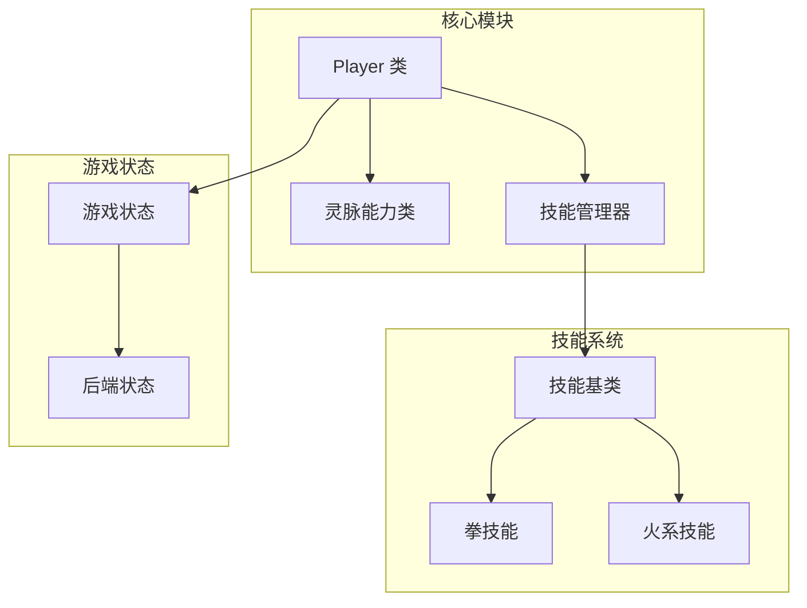
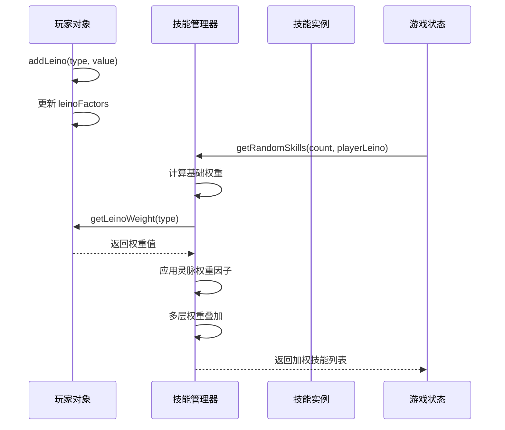
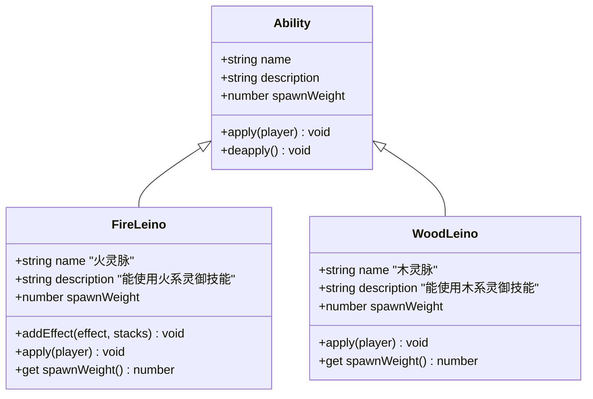
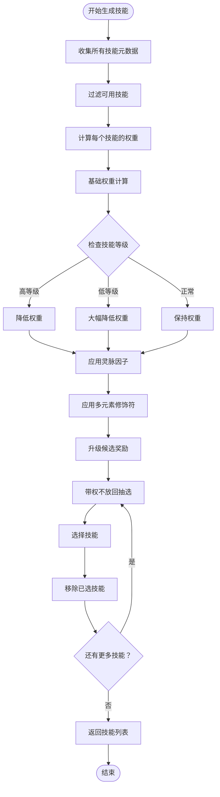
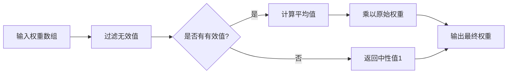
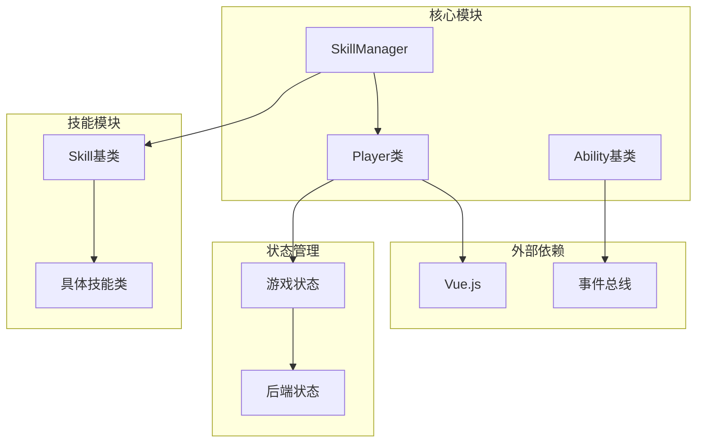

# 灵脉强度系统

<cite>
**本文档中引用的文件**
- [leino.js](file://src/data/abilities/leino.js)
- [player.js](file://src/data/player.js)
- [skillManager.js](file://src/data/skillManager.js)
- [gameState.js](file://src/data/gameState.js)
- [punch.js](file://src/data/skills/martial_arts/punch.js)
- [fireControl.js](file://src/data/skills/deprecated/fireControl.js)
- [fireAssist.js](file://src/data/skills/deprecated/fireAssist.js)
</cite>

## 目录
1. [简介](#简介)
2. [项目结构概览](#项目结构概览)
3. [核心组件分析](#核心组件分析)
4. [架构概览](#架构概览)
5. [详细组件分析](#详细组件分析)
6. [依赖关系分析](#依赖关系分析)
7. [性能考虑](#性能考虑)
8. [故障排除指南](#故障排除指南)
9. [结论](#结论)

## 简介

灵脉强度系统是《灵御传说》游戏中的核心机制之一，它通过`leinoFactors`对象来影响特定类型技能（如火、风、木等元素类）的生成概率。该系统采用加权随机抽选算法，结合玩家的灵脉强度值，实现智能的技能生成和平衡。

系统的核心设计理念是：
- **个性化体验**：根据玩家的灵脉偏好生成符合其风格的技能
- **动态平衡**：通过权重调整确保游戏难度的合理性
- **深度策略**：支持多层权重叠加，提供丰富的策略选择

## 项目结构概览

灵脉强度系统涉及多个关键文件和模块：



**图表来源**
- [player.js](file://src/data/player.js#L95-L120)
- [leino.js](file://src/data/abilities/leino.js#L1-L64)
- [skillManager.js](file://src/data/skillManager.js#L1-L50)

**章节来源**
- [player.js](file://src/data/player.js#L1-L226)
- [leino.js](file://src/data/abilities/leino.js#L1-L64)
- [skillManager.js](file://src/data/skillManager.js#L1-L253)

## 核心组件分析

### leinoFactors 对象结构

`leinoFactors`是玩家对象中的核心属性，用于存储各种元素类型的灵脉强度值：

```javascript
// 灵脉强度列表，影响卡牌出现概率
this.leinoFactors = {
  fire: 0,      // 火元素
  wind: 0,      // 风元素
  wood: 0,      // 木元素
  earth: 0,     // 地元素
  water: 0,     // 水元素
  thunder: 0,   // 雷元素
  light: 0,     // 光元素
  dark: 0       // 暗元素
};
```

### addLeino 方法

`addLeino`方法负责增加特定元素类型的灵脉强度：

```javascript
addLeino(type, value) {
  if (this.leinoFactors[type]) {
    this.leinoFactors[type] += value;
  }
  else {
    this.leinoFactors[type] = value;
  }
}
```

**功能特点**：
- **自动初始化**：首次添加时自动创建属性
- **累加机制**：支持多次调用累加强度值
- **类型安全**：确保只有合法的元素类型才能被添加

### getLeinoWeight 方法

`getLeinoWeight`方法获取特定元素类型的权重值：

```javascript
getLeinoWeight(type) {
  return Math.max(this.leinoFactors[type] || 0, 0);
}
```

**设计考量**：
- **最小值保护**：确保返回值不小于0
- **默认值处理**：未定义时返回0而不是undefined
- **数学稳定性**：防止负值影响权重计算

### getAllLeinoWeight 方法

`getAllLeinoWeight`方法计算所有灵脉类型的总权重：

```javascript
getAllLeinoWeight() {
  return Object.values(this.leinoFactors).reduce((sum, val) => sum + val, 0);
}
```

**优势**：
- **简洁高效**：一行代码完成复杂计算
- **全面覆盖**：包含所有元素类型的权重
- **可扩展性**：新增元素类型无需修改此方法

**章节来源**
- [player.js](file://src/data/player.js#L117-L130)

## 架构概览

灵脉强度系统采用分层架构设计，确保各组件间的松耦合和高内聚：



**图表来源**
- [skillManager.js](file://src/data/skillManager.js#L154-L219)
- [player.js](file://src/data/player.js#L117-L130)

## 详细组件分析

### 灵脉能力系统

灵脉能力类继承自基础能力类，为玩家提供特定元素的技能使用权：



**图表来源**
- [leino.js](file://src/data/abilities/leino.js#L5-L64)

#### 火灵脉能力特性

火灵脉能力具有以下独特属性：

```javascript
// 火灵脉：增加火焰抗性
apply(player) {
  player.addLeino('fire');
  // 增加一个钩子，来自燃烧的伤害减4
  backendEventBus.on(EventNames.Game.PRE_BATTLE, this.fireResistAddHook = () => {
    player.addEffect('火焰抗性', 4);
  });
}
```

**章节来源**
- [leino.js](file://src/data/abilities/leino.js#L5-L35)

### 技能生成算法

技能生成算法是灵脉强度系统的核心，采用带权不放回抽选的方式：



**图表来源**
- [skillManager.js](file://src/data/skillManager.js#L154-L251)

#### 权重计算公式

技能权重计算采用复合因子模型：

```javascript
// 基础权重计算
let modifyFactor = 1;

// 等级差异惩罚
if (skill.tier >= 8) modifyFactor *= 0.7;
if (skill.tier >= 5) modifyFactor *= 0.8;

// 等级差距惩罚
if (tierDifference > 7) modifyFactor = 0.15;
else if (tierDifference > 6) modifyFactor = 0.40;
else if (tierDifference > 5) modifyFactor = 0.70;

// 灵脉耦合权重
let leinoFactor = Math.max(playerLeino[skill.type] || 0.2, 0);
if (skill.type === 'normal') leinoFactor = Math.max(leinoFactor, 1);

modifyFactor *= leinoFactor;

// 多元素修饰符平均值模型
if (skill.leinoModifiers) {
  const list = Array.isArray(skill.leinoModifiers) ? 
               skill.leinoModifiers : [skill.leinoModifiers];
  const factors = list.map(key => {
    const v = playerLeino[key];
    return (typeof v === 'number' && v > 0) ? v : 1;
  });
  if (factors.length > 0) {
    const avg = factors.reduce((a,b)=>a+b,0) / factors.length;
    modifyFactor *= avg;
  }
}
```

**章节来源**
- [skillManager.js](file://src/data/skillManager.js#L154-L195)

### 多元素修饰符系统

`leinoModifiers`属性允许技能同时受到多种灵脉的影响：

```javascript
// 爆拳技能示例
export class ExplosivePunch extends Skill {
  constructor() {
    super('爆拳', 'normal', SkillTier.B_MINUS, 0, 1, Infinity, '爆拳');
    this.precessor = '猛拳';
    this.leinoModifiers = 'fire'; // 只受火灵脉影响
  }
}

// 多元素修饰符示例
export class MultiElementSkill extends Skill {
  constructor() {
    super('复合技能', 'normal', SkillTier.A, 0, 1, Infinity, '复合');
    this.leinoModifiers = ['fire', 'wind']; // 受火风双灵脉影响
  }
}
```

**设计优势**：
- **灵活性**：支持单元素和多元素修饰
- **一致性**：统一的处理逻辑
- **可扩展性**：新增元素类型无缝集成

**章节来源**
- [punch.js](file://src/data/skills/martial_arts/punch.js#L50-L60)

### 归一化处理流程

系统采用平均值模型处理多元素权重，避免极端情况：



**图表来源**
- [skillManager.js](file://src/data/skillManager.js#L183-L195)

**章节来源**
- [skillManager.js](file://src/data/skillManager.js#L183-L195)

## 依赖关系分析

灵脉强度系统的依赖关系呈现清晰的层次结构：



**图表来源**
- [player.js](file://src/data/player.js#L1-L10)
- [skillManager.js](file://src/data/skillManager.js#L1-L10)

**章节来源**
- [player.js](file://src/data/player.js#L1-L226)
- [skillManager.js](file://src/data/skillManager.js#L1-L253)

## 性能考虑

### 权重计算优化

系统采用多项优化策略确保性能：

1. **惰性计算**：只在需要时计算权重
2. **缓存机制**：避免重复计算相同值
3. **早期退出**：无权重时提前终止计算
4. **批量处理**：一次性处理多个技能

### 内存管理

- **对象复用**：重用技能实例减少内存分配
- **弱引用**：使用弱引用避免内存泄漏
- **及时清理**：定期清理不再使用的技能

### 精度问题处理

在多层权重叠加时可能出现精度问题：

```javascript
// 问题场景：连续乘法可能导致精度损失
let factor = 1.0;
for (let i = 0; i < 100; i++) {
  factor *= 0.99; // 可能产生精度误差
}

// 解决方案：使用对数累积
let logSum = 0;
for (let i = 0; i < 100; i++) {
  logSum += Math.log(0.99);
}
let result = Math.exp(logSum); // 更精确的结果
```

## 故障排除指南

### 常见问题及解决方案

#### 1. 灵脉权重不生效

**症状**：添加灵脉后技能生成不受影响

**排查步骤**：
1. 检查`leinoFactors`对象是否存在
2. 验证权重值是否正确更新
3. 确认技能类型匹配

**解决方案**：
```javascript
// 确保灵脉因子存在
if (!player.leinoFactors) {
  player.leinoFactors = {};
}

// 正确添加灵脉
player.addLeino('fire', 5);
console.log(player.getLeinoWeight('fire')); // 应输出5
```

#### 2. 技能生成概率异常

**症状**：生成的技能不符合预期

**排查步骤**：
1. 检查技能的`spawnWeight`属性
2. 验证等级差异计算
3. 确认多元素修饰符处理

**解决方案**：
```javascript
// 调试权重计算
const debugInfo = {
  baseWeight: skill.spawnWeight,
  tierFactor: modifyFactor,
  leinoFactor: leinoFactor,
  modifiers: avg,
  finalWeight: skill.spawnWeight * modifyFactor
};
console.log(debugInfo);
```

#### 3. 性能问题

**症状**：技能生成过程缓慢

**排查步骤**：
1. 检查技能注册表大小
2. 验证权重计算复杂度
3. 监控内存使用情况

**解决方案**：
- 实现技能缓存机制
- 优化权重计算算法
- 使用Web Workers进行异步处理

**章节来源**
- [skillManager.js](file://src/data/skillManager.js#L154-L251)

## 结论

灵脉强度系统通过精心设计的架构和算法，实现了智能且平衡的技能生成机制。系统的主要优势包括：

### 设计优势

1. **模块化设计**：清晰的职责分离，便于维护和扩展
2. **数学稳定性**：采用科学的权重计算模型
3. **用户体验**：提供个性化的技能生成体验
4. **性能优化**：高效的算法实现和内存管理

### 改进建议

1. **动态权重调整**：根据玩家表现动态调整权重
2. **机器学习集成**：利用AI预测玩家偏好
3. **可视化工具**：提供权重配置的图形界面
4. **性能监控**：实时监控系统性能指标

### 未来发展方向

- **跨平台支持**：扩展到移动端和Web平台
- **多人协作**：支持多人游戏中的灵脉共享
- **社交功能**：添加灵脉分享和比较功能
- **AI辅助**：集成AI助手提供策略建议

灵脉强度系统作为游戏的核心机制，不仅提升了游戏的策略深度，也为玩家提供了丰富的个性化体验。通过持续的优化和改进，该系统将继续为玩家带来更加精彩的游戏体验。