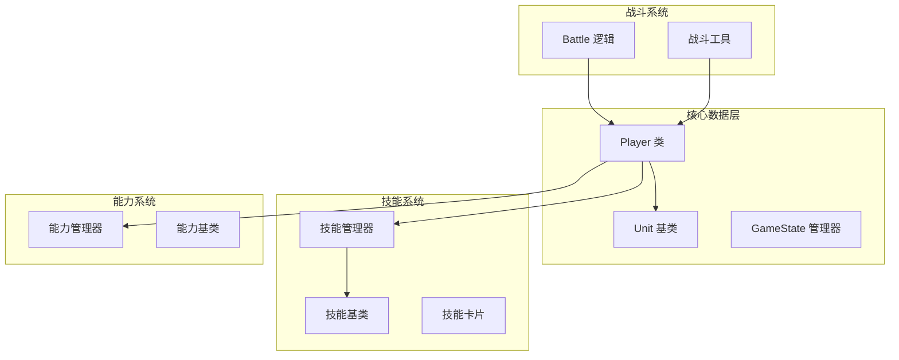
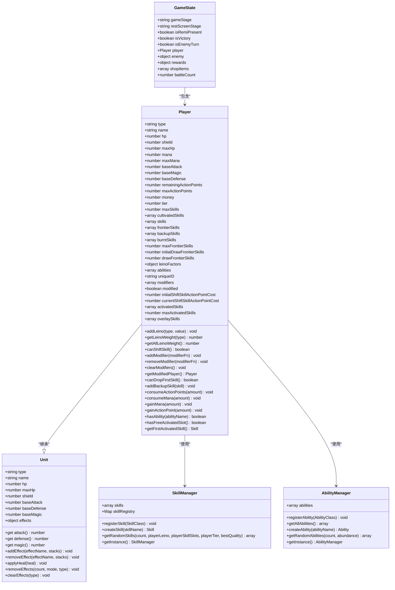
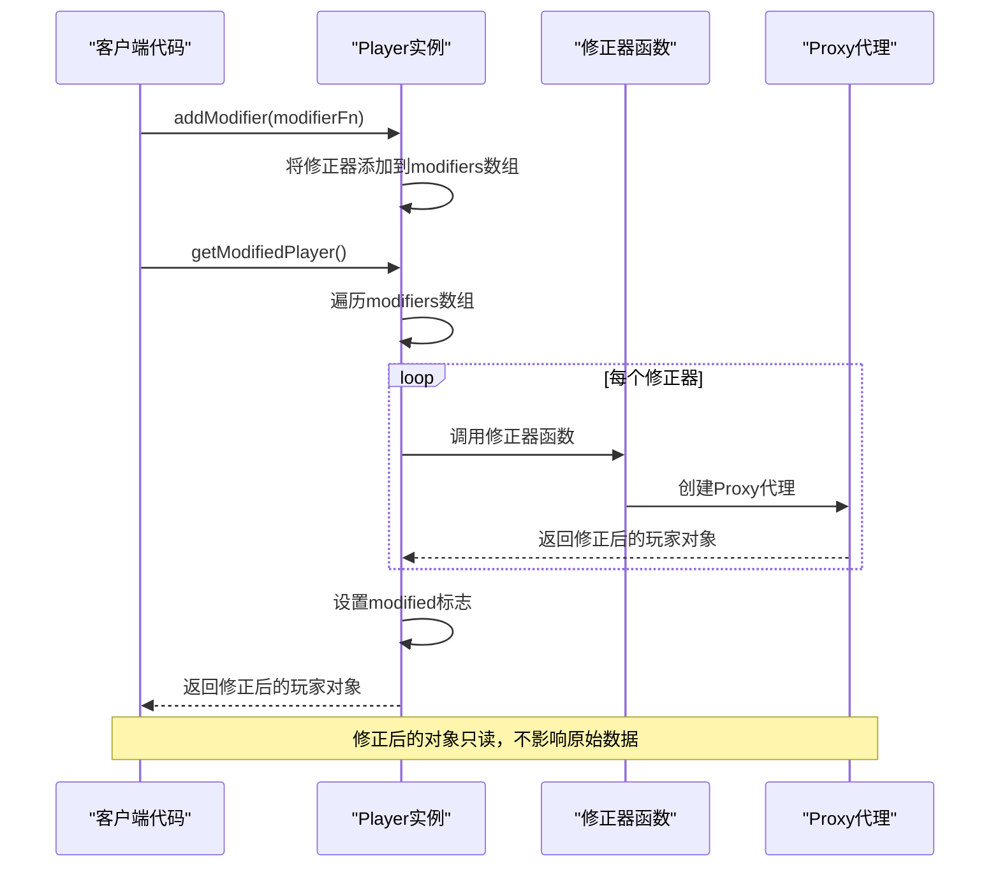
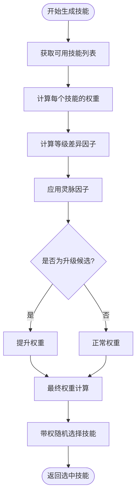
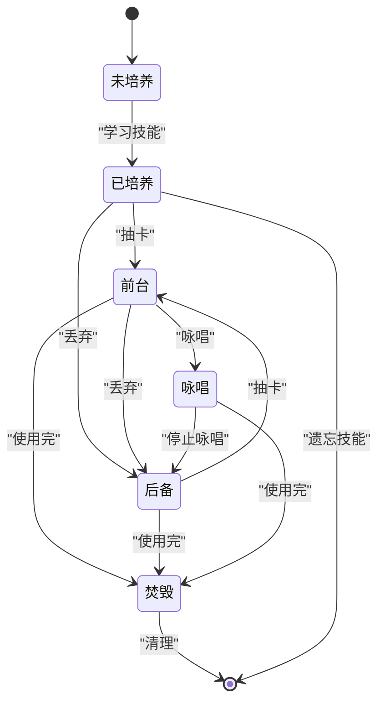
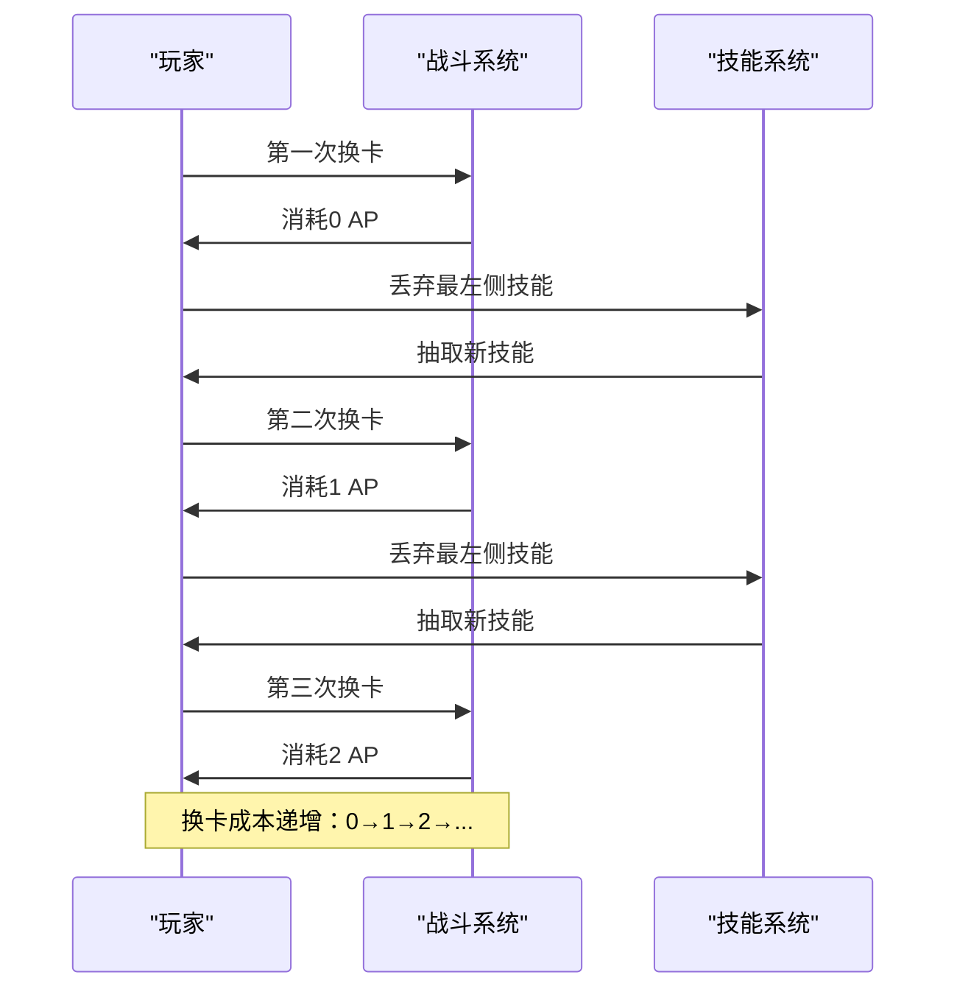
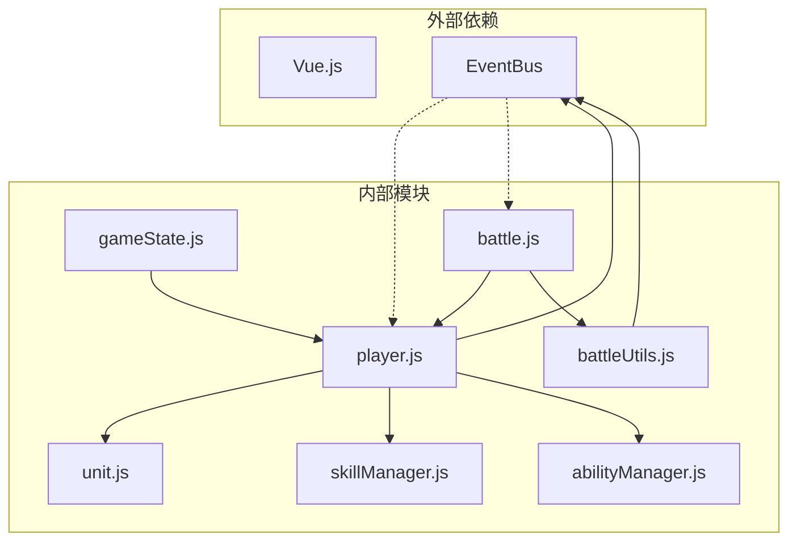

# 玩家数据模型

<cite>
**本文档中引用的文件**
- [src/data/player.js](file://src/data/player.js)
- [src/data/unit.js](file://src/data/unit.js)
- [src/data/skillManager.js](file://src/data/skillManager.js)
- [src/data/gameState.js](file://src/data/gameState.js)
- [src/data/battleUtils.js](file://src/data/battleUtils.js)
- [src/data/battle.js](file://src/data/battle.js)
- [src/data/abilities/basic.js](file://src/data/abilities/basic.js)
- [src/data/abilityManager.js](file://src/data/abilityManager.js)
- [src/data/skills/martial_arts/punch.js](file://src/data/skills/martial_arts/punch.js)
</cite>

## 目录
1. [简介](#简介)
2. [项目结构概览](#项目结构概览)
3. [核心数据结构](#核心数据结构)
4. [架构概览](#架构概览)
5. [详细组件分析](#详细组件分析)
6. [依赖关系分析](#依赖关系分析)
7. [性能考虑](#性能考虑)
8. [故障排除指南](#故障排除指南)
9. [结论](#结论)

## 简介

本文档深入分析了基于Vue.js的游戏《灵御》中的玩家数据模型系统。该系统采用了面向对象的设计模式，通过Player类继承Unit基类，实现了复杂的玩家状态管理、技能系统、能力系统和战斗机制。系统支持动态属性修正、灵脉强度影响、技能培养、战斗流程控制等多个核心功能。

## 项目结构概览

玩家数据模型系统主要分布在以下关键文件中：



**图表来源**
- [src/data/player.js](file://src/data/player.js#L1-L226)
- [src/data/unit.js](file://src/data/unit.js#L1-L143)
- [src/data/gameState.js](file://src/data/gameState.js#L1-L75)

**章节来源**
- [src/data/player.js](file://src/data/player.js#L1-L226)
- [src/data/unit.js](file://src/data/unit.js#L1-L143)
- [src/data/gameState.js](file://src/data/gameState.js#L1-L75)

## 核心数据结构

### Player类设计

Player类是整个玩家数据模型的核心，继承自Unit基类并扩展了丰富的功能：

```javascript
export class Player extends Unit {
  constructor() {
    super();
    this.type = 'player';
    this.name = "你";
    this.hp = 65;
    this.shield = 0;
    this.maxHp = 65;
    this.mana = 0;
    this.maxMana = 0;
    this.baseAttack = 0;
    this.baseMagic = 1;
    this.baseDefense = 0;
    this.remainingActionPoints = 3;
    this.maxActionPoints = 3;
    this.money = 0;
    this.tier = 1;
    this.maxSkills = 20;
    this.cultivatedSkills = [];
    this.skills = [];
    this.frontierSkills = [];
    this.backupSkills = [];
    this.burntSkills = [];
    this.maxFrontierSkills = 10;
    this.initialDrawFrontierSkills = 2;
    this.drawFrontierSkills = 3;
    this.leinoFactors = {};
    this.abilities = [];
    this.uniqueID = 'playeruniqueid';
    this.modifiers = [];
    this.modified = false;
    this.initialShiftSkillActionPointCost = 0;
    this.currentShiftSkillActionPointCost = this.initialShiftSkillActionPointCost;
    this.activatedSkills = [];
    this.maxActivatedSkills = 1;
    this.overlaySkills = [];
  }
}
```

### Unit基类继承体系

Unit类提供了所有战斗单位的基础属性和方法：

```javascript
export default class Unit {
  constructor() {
    this.type = 'unit';
    this.name = '';
    this.hp = 0;
    this.maxHp = 0;
    this.shield = 0;
    this.baseAttack = 0;
    this.baseDefense = 0;
    this.baseMagic = 0;
    this.effects = {};
  }

  get attack() {
    return this.baseAttack + (this.effects['力量'] || 0);
  }

  get defense() {
    return this.baseDefense + (this.effects['坚固'] || 0);
  }

  get magic() {
    return this.baseMagic + (this.effects['集中'] || 0);
  }
}
```

**章节来源**
- [src/data/player.js](file://src/data/player.js#L65-L120)
- [src/data/unit.js](file://src/data/unit.js#L5-L20)

## 架构概览

### 玩家数据模型架构



**图表来源**
- [src/data/player.js](file://src/data/player.js#L65-L120)
- [src/data/unit.js](file://src/data/unit.js#L5-L20)
- [src/data/skillManager.js](file://src/data/skillManager.js#L5-L15)
- [src/data/abilityManager.js](file://src/data/abilityManager.js#L5-L15)
- [src/data/gameState.js](file://src/data/gameState.js#L10-L30)

## 详细组件分析

### 属性修正器系统

属性修正器系统是Player类的一个重要特性，通过Proxy模式实现动态属性修改：

```javascript
export function createPlayerStatModifier({ attack, defense, magic } = {}) {
  return function(player) {
    return new Proxy(player, {
      get(target, prop, receiver) {
        if (prop === 'attack') {
          const base = Reflect.get(target, 'attack', receiver);
          return typeof attack === 'function' ? attack(base, receiver) : base;
        }
        if (prop === 'defense') {
          const base = Reflect.get(target, 'defense', receiver);
          return typeof defense === 'function' ? defense(base, receiver) : base;
        }
        if (prop === 'magic') {
          const base = Reflect.get(target, 'magic', receiver);
          return typeof magic === 'function' ? magic(base, receiver) : base;
        }
        return Reflect.get(target, prop, receiver);
      }
    });
  }
}
```

#### 属性修正器API详解



**图表来源**
- [src/data/player.js](file://src/data/player.js#L140-L180)

#### 性能影响分析

属性修正器系统采用惰性计算策略：
- 仅在首次调用`getModifiedPlayer()`时应用修正器
- 使用Proxy代理避免不必要的对象复制
- 修正器链按顺序执行，确保正确的计算顺序

**章节来源**
- [src/data/player.js](file://src/data/player.js#L140-L180)

### 灵脉强度系统

灵脉强度（Leino Factors）系统影响技能生成概率和效果：

```javascript
addLeino(type, value) {
  if (this.leinoFactors[type]) {
    this.leinoFactors[type] += value;
  }
  else {
    this.leinoFactors[type] = value;
  }
}

getLeinoWeight(type) {
  return Math.max(this.leinoFactors[type] || 0, 0);
}

getAllLeinoWeight() {
  return Object.values(this.leinoFactors).reduce((sum, val) => sum + val, 0);
}
```

#### 灵脉强度对技能生成的影响



**图表来源**
- [src/data/skillManager.js](file://src/data/skillManager.js#L120-L180)

**章节来源**
- [src/data/player.js](file://src/data/player.js#L125-L135)
- [src/data/skillManager.js](file://src/data/skillManager.js#L120-L180)

### 技能管理系统

#### 技能槽位系统

Player类维护多个技能列表：

```javascript
// 已培养技能（顺序即为战斗中的默认顺序）
this.cultivatedSkills = [];

// 初始场上技能。在战斗开始前由 cultivatedSkills 深拷贝生成
this.skills = [];

// 前台技能列表，玩家在当前回合可以使用的技能
this.frontierSkills = [];

// 后备技能列表，用于存储暂时不可用的技能
this.backupSkills = [];

// 坟地技能列表，存放被焚毁的技能
this.burntSkills = [];

// 新增：临时覆盖技能容器
this.overlaySkills = [];
```

#### 技能生命周期管理



**图表来源**
- [src/data/player.js](file://src/data/player.js#L80-L100)
- [src/data/battleUtils.js](file://src/data/battleUtils.js#L200-L250)

**章节来源**
- [src/data/player.js](file://src/data/player.js#L80-L100)
- [src/data/battleUtils.js](file://src/data/battleUtils.js#L200-L250)

### 战斗流程控制系统

#### 行动点消耗机制

```javascript
// 每场战斗第一次换卡的行动点消耗
this.initialShiftSkillActionPointCost = 0;

// 当前换卡行动点消耗，每丢一次消耗增1
this.currentShiftSkillActionPointCost = this.initialShiftSkillActionPointCost;

canShiftSkill() {
  return this.frontierSkills.length > 0 && 
         this.remainingActionPoints >= this.currentShiftSkillActionPointCost;
}
```

#### 换卡成本递增机制



**图表来源**
- [src/data/player.js](file://src/data/player.js#L105-L115)
- [src/data/battle.js](file://src/data/battle.js#L400-L420)

#### 咏唱位管理系统

```javascript
// 咏唱位：当前激活的咏唱型技能
this.activatedSkills = [];
this.maxActivatedSkills = 1; // 默认一个咏唱位

hasFreeActivatedSlot() { 
  return this.activatedSkills.length < this.maxActivatedSkills; 
}

getFirstActivatedSkill() { 
  return this.activatedSkills[0] || null; 
}
```

**章节来源**
- [src/data/player.js](file://src/data/player.js#L105-L115)
- [src/data/battle.js](file://src/data/battle.js#L400-L420)

### 等级与升级系统

#### 等阶系统

```javascript
export function getPlayerTierFromTierIndex(tierIndex) {
  const tiers = [
    {tier: 0, name: '旅人'},
    {tier: 1, name: '见习灵御'},
    {tier: 2, name: '普通灵御'},
    {tier: 3, name: '中级灵御'},
    {tier: 4, name: '资深灵御'},
    {tier: 5, name: '高级灵御'},
    {tier: 6, name: '准大师灵御'},
    {tier: 7, name: '大师灵御', subtitle: '古往今来，灵御协会所能给出的最高认可'},
    {tier: 8, name: '一代宗师', subtitle: '和独开一代的宗师们并肩而立'},
    {tier: 9, name: '传奇', subtitle: '即便肉身消陨，你的名字也会回荡于传说之中'}
  ];
  return tiers[tierIndex];
}
```

#### 升级逻辑

```javascript
export function upgradePlayerTier(player) {
  const nextTier = getNextPlayerTier(player.tier);
  if (nextTier !== undefined) {
    player.tier = nextTier;
    if (player.tier === 1) {
      // 特殊：第一次升级时给5魏启上限
      player.maxMana = 5;
    }
    if (player.maxActionPoints < 4) {
      player.maxActionPoints++;
    }
  }
  player.hp = player.maxHp;
  player.mana = player.maxMana;
  backendEventBus.emit(EventNames.Player.TIER_UPGRADED, player);
  return true;
}
```

**章节来源**
- [src/data/player.js](file://src/data/player.js#L10-L30)
- [src/data/player.js](file://src/data/player.js#L32-L45)

### 能力系统

#### 能力管理器

```javascript
class AbilityManager {
  constructor() {
    this.abilities = [];
  }

  getRandomAbilities(count = 3, abundance = 1.0) {
    const allAbilities = this.abilities.map(a => ({
      name: a.name,
      tier: a.tier,
      spawnWeight: (new a.AbilityClass()).spawnWeight
    }));
    
    // 根据abundance、spawnWeight和tier计算每个能力的权重
    const weightedAbilities = allAbilities.map(ability => {
      let offset = Math.max(1, abundance * 2);
      const tierFactor = Math.pow(0.6, Math.max(ability.tier - offset, 0));
      const rarityFactor = ability.spawnWeight;
      const weight = tierFactor * rarityFactor;
      
      return { ...ability, weight };
    });
    
    // 根据权重随机选择能力
    const selected = [];
    let availableAbilities = weightedAbilities;
    const maxEntries = Math.min(count, availableAbilities.length);
    
    for (let i = 0; i < maxEntries; i++) {
      const totalWeight = availableAbilities.reduce((sum, ability) => sum + ability.weight, 0);
      let random = Math.random() * totalWeight;
      
      let selectedIndex = 0;
      for (let j = 0; j < availableAbilities.length; j++) {
        random -= availableAbilities[j].weight;
        if (random <= 0) {
          selectedIndex = j;
          break;
        }
      }
      
      const selectedAbility = this.createAbility(availableAbilities[selectedIndex].name);
      selected.push(selectedAbility);
      availableAbilities.splice(selectedIndex, 1);
    }
    
    return selected;
  }
}
```

**章节来源**
- [src/data/abilityManager.js](file://src/data/abilityManager.js#L5-L117)

## 依赖关系分析

### 核心依赖图



**图表来源**
- [src/data/player.js](file://src/data/player.js#L1-L5)
- [src/data/gameState.js](file://src/data/gameState.js#L1-L5)
- [src/data/battle.js](file://src/data/battle.js#L1-L10)

**章节来源**
- [src/data/player.js](file://src/data/player.js#L1-L5)
- [src/data/gameState.js](file://src/data/gameState.js#L1-L5)
- [src/data/battle.js](file://src/data/battle.js#L1-L10)

## 性能考虑

### 内存优化策略

1. **Proxy代理模式**：仅在需要时创建修正器代理，避免不必要的内存占用
2. **惰性计算**：属性修正器只在首次调用`getModifiedPlayer()`时应用
3. **对象引用管理**：effects等数据链接保持为原对象引用，避免深度复制

### 计算复杂度分析

- **属性修正器**：O(n)，其中n为修正器数量
- **技能生成**：O(m)，其中m为可用技能数量
- **权重计算**：O(k)，其中k为灵脉因子数量

### 缓存机制

系统实现了多层缓存：
- **修正器缓存**：避免重复应用相同的修正器
- **技能缓存**：技能管理器维护技能注册表
- **权重缓存**：技能生成时缓存计算结果

## 故障排除指南

### 常见错误处理模式

#### 属性修正器错误处理

```javascript
getModifiedPlayer() {
  if(this.modified) return this; // 已经是修正过的，直接返回自己
  let current = this;
  for (const mod of this.modifiers) {
    try {
      const next = mod(current);
      if (next) current = next;
    } catch (e) {
      console.warn('应用属性修正器时发生错误，已跳过：', e);
    }
  }
  return current;
}
```

#### 技能操作错误处理

```javascript
// 在战斗工具函数中
export function drawSkillCard(player, number = 1) {
  number = Math.min(number, player.maxDrawSkillCardCount);
  let returnSkill = null;
  let ids = [];
  for (let i = 0; i < number; i++) {
    if (player.frontierSkills.length >= player.maxHandSize) {
      console.warn('你的手牌已满，无法抽取更多卡牌！');
      break;
    }
    if (player.backupSkills.length === 0) {
      console.warn('你的后备技能已空，无法抽取更多卡牌！');
      break;
    }
    // ... 抽卡逻辑
  }
  return returnSkill;
}
```

#### 错误恢复机制

1. **修正器错误**：捕获异常并跳过错误修正器
2. **技能操作错误**：记录警告信息并继续执行
3. **状态不一致**：通过事件总线同步状态

**章节来源**
- [src/data/player.js](file://src/data/player.js#L160-L180)
- [src/data/battleUtils.js](file://src/data/battleUtils.js#L120-L140)

## 结论

玩家数据模型系统展现了现代游戏开发中的优秀设计实践：

### 主要优势

1. **模块化设计**：清晰的职责分离和接口定义
2. **扩展性强**：通过继承和组合轻松添加新功能
3. **性能优化**：惰性计算和缓存机制确保高效运行
4. **错误处理**：完善的异常处理和恢复机制

### 设计亮点

- **属性修正器系统**：灵活的动态属性修改机制
- **灵脉强度系统**：影响游戏平衡性的深度机制
- **技能生命周期管理**：完整的技能状态转换
- **战斗流程控制**：精确的行动点和资源管理

### 改进建议

1. **性能监控**：添加性能指标收集和分析
2. **调试工具**：增强开发者调试体验
3. **文档完善**：补充详细的API文档和使用示例
4. **测试覆盖**：提高单元测试和集成测试覆盖率

该系统为游戏《灵御》提供了坚实的数据模型基础，支持复杂的玩法机制和良好的用户体验。通过持续的优化和改进，该系统能够适应未来的游戏发展需求。