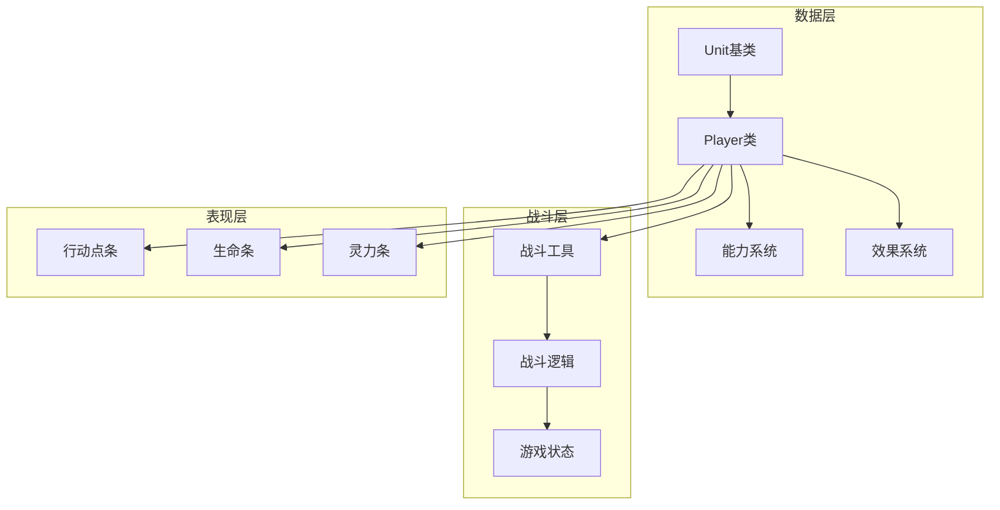
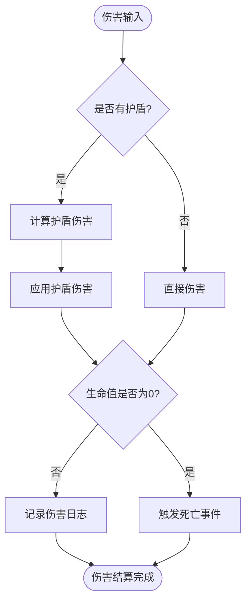
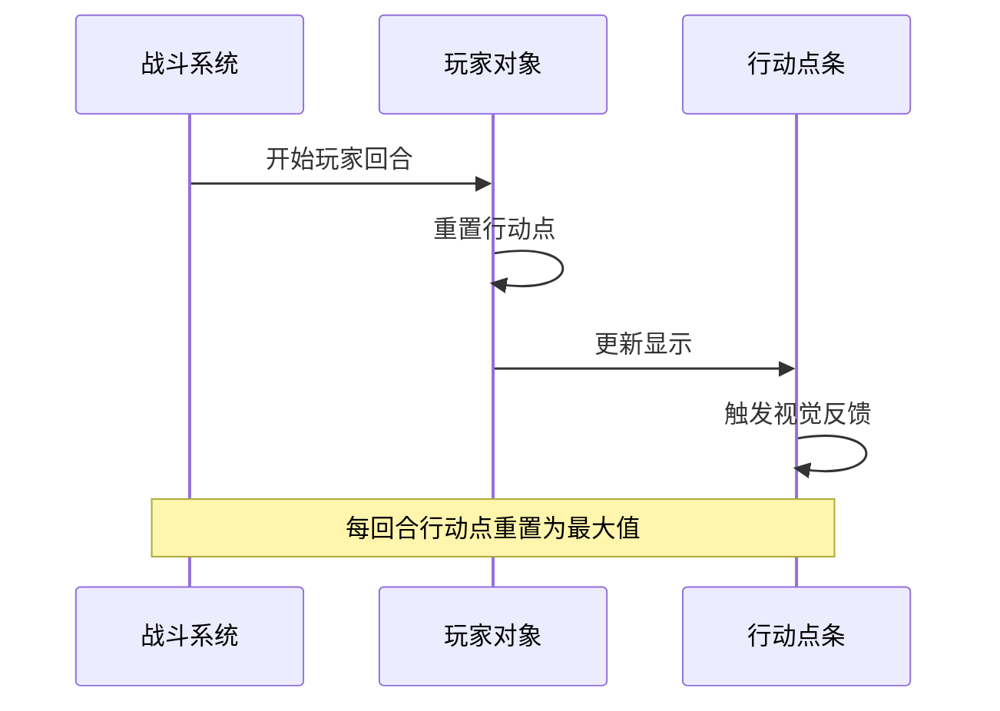
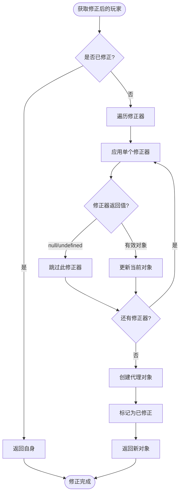
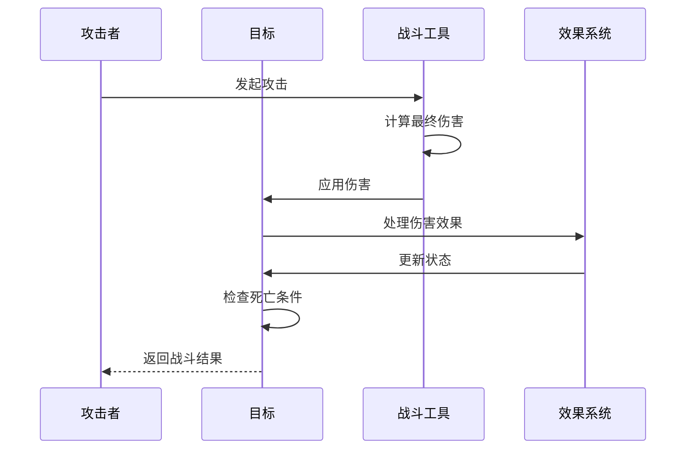
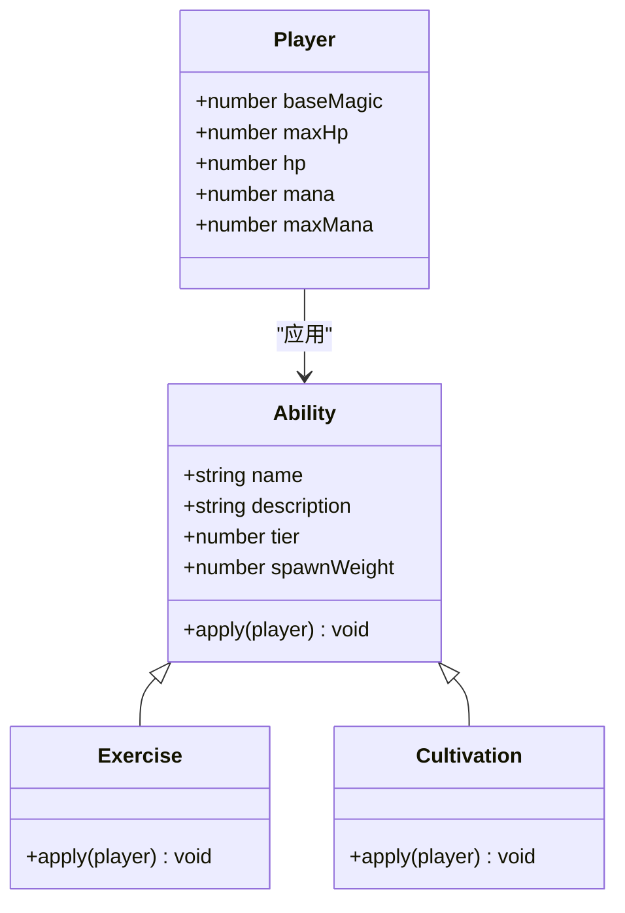

# 玩家核心属性系统

<cite>
**本文档中引用的文件**
- [player.js](file://src/data/player.js)
- [unit.js](file://src/data/unit.js)
- [battleUtils.js](file://src/data/battleUtils.js)
- [effectProcessor.js](file://src/data/effectProcessor.js)
- [battle.js](file://src/data/battle.js)
- [gameState.js](file://src/data/gameState.js)
- [basic.js](file://src/data/abilities/basic.js)
- [ActionPointsBar.vue](file://src/components/global/ActionPointsBar.vue)
</cite>

## 目录
1. [简介](#简介)
2. [项目结构概览](#项目结构概览)
3. [基础属性架构](#基础属性架构)
4. [核心属性详解](#核心属性详解)
5. [属性计算机制](#属性计算机制)
6. [战斗流程中的属性变化](#战斗流程中的属性变化)
7. [属性修正系统](#属性修正系统)
8. [能力系统与属性提升](#能力系统与属性提升)
9. [性能考虑](#性能考虑)
10. [故障排除指南](#故障排除指南)
11. [总结](#总结)

## 简介

本文档详细解析了游戏《灵御》中玩家核心属性系统的设计与实现。该系统基于Unit基类构建，包含了生命值、护盾、灵力、行动点、攻击力、防御力、灵术力等多个关键属性。系统采用面向对象设计，支持属性修正、效果叠加、回合制战斗等复杂机制。

## 项目结构概览



**图表来源**
- [unit.js](file://src/data/unit.js#L1-L143)
- [player.js](file://src/data/player.js#L1-L225)
- [battleUtils.js](file://src/data/battleUtils.js#L1-L365)

## 基础属性架构

### Unit基类设计

Unit基类作为所有战斗单位的抽象，定义了基础属性框架：

```javascript
// 基础作战单位抽象类
export default class Unit {
  constructor() {
    this.type = 'unit';
    this.name = '';
    this.hp = 0; // 当前生命值
    this.maxHp = 0; // 最大生命值
    this.shield = 0; // 当前护盾
    this.baseAttack = 0; // 基础攻击力
    this.baseDefense = 0; // 基础防御力
    this.baseMagic = 0; // 基础灵能强度
    this.effects = {}; // 效果列表
  }
}
```

### Player类继承扩展

Player类继承自Unit，增加了战斗专用属性：

```javascript
export class Player extends Unit {
  constructor() {
    super();
    this.type = 'player';
    this.name = "你";
    this.hp = 65;
    this.shield = 0;
    this.maxHp = 65;
    this.mana = 0;
    this.maxMana = 0;
    this.baseAttack = 0;
    this.baseMagic = 1;
    this.baseDefense = 0;
    this.remainingActionPoints = 3;
    this.maxActionPoints = 3;
    this.money = 0;
    this.tier = 1;
  }
}
```

**章节来源**
- [unit.js](file://src/data/unit.js#L1-L143)
- [player.js](file://src/data/player.js#L62-L95)

## 核心属性详解

### 生命值系统

#### 基础生命值属性

```javascript
// 生命值相关属性
this.hp = 65;           // 当前生命值
this.maxHp = 65;        // 最大生命值
this.shield = 0;        // 当前护盾
```

#### 生命值计算机制



**图表来源**
- [battleUtils.js](file://src/data/battleUtils.js#L15-L60)

### 灵力系统

#### 灵力属性结构

```javascript
this.mana = 0;          // 当前灵力
this.maxMana = 0;       // 最大灵力
```

#### 灵力操作方法

```javascript
// 灵力消耗
consumeMana(amount) {
  this.mana -= amount;
  this.mana = Math.max(this.mana, 0);
  this.mana = Math.min(this.mana, this.maxMana);
}

// 灵力恢复
gainMana(amount) {
  this.mana += amount;
  this.mana = Math.max(this.mana, 0);
  this.mana = Math.min(this.mana, this.maxMana);
}
```

### 行动点系统

#### 行动点属性

```javascript
this.remainingActionPoints = 3;  // 当前剩余行动点
this.maxActionPoints = 3;        // 最大行动点
```

#### 行动点重置机制



**图表来源**
- [battle.js](file://src/data/battle.js#L85-L108)
- [ActionPointsBar.vue](file://src/components/global/ActionPointsBar.vue#L1-L52)

### 攻击力、防御力、灵术力

#### 基础属性计算

```javascript
// 攻击力计算
get attack() {
  return this.baseAttack + (this.effects['力量'] || 0);
}

// 防御力计算
get defense() {
  return this.baseDefense + (this.effects['坚固'] || 0);
}

// 灵术力计算
get magic() {
  return this.baseMagic + (this.effects['集中'] || 0);
}
```

**章节来源**
- [unit.js](file://src/data/unit.js#L18-L30)
- [player.js](file://src/data/player.js#L62-L95)

## 属性计算机制

### 属性修饰器系统

系统提供了强大的属性修饰器机制，允许动态修改属性值：

```javascript
// 创建属性修正器
export function createPlayerStatModifier({ attack, defense, magic } = {}) {
  return function(player) {
    return new Proxy(player, {
      get(target, prop, receiver) {
        if (prop === 'attack') {
          const base = Reflect.get(target, 'attack', receiver);
          return typeof attack === 'function' ? attack(base, receiver) : base;
        }
        if (prop === 'defense') {
          const base = Reflect.get(target, 'defense', receiver);
          return typeof defense === 'function' ? defense(base, receiver) : base;
        }
        if (prop === 'magic') {
          const base = Reflect.get(target, 'magic', receiver);
          return typeof magic === 'function' ? magic(base, receiver) : base;
        }
        return Reflect.get(target, prop, receiver);
      }
    });
  }
}
```

### 修正器应用流程



**图表来源**
- [player.js](file://src/data/player.js#L163-L204)

**章节来源**
- [player.js](file://src/data/player.js#L36-L63)
- [player.js](file://src/data/player.js#L163-L204)

## 战斗流程中的属性变化

### 战斗伤害结算

战斗中的伤害结算遵循以下流程：



**图表来源**
- [battleUtils.js](file://src/data/battleUtils.js#L64-L108)

### 回合开始效果处理

每回合开始时，系统会处理各种持续效果：

```javascript
export function processStartOfTurnEffects(target) {
  // 摧毁护盾
  if(target.effects['警戒'] > 0) {
    target.addEffect('警戒', -1);
  } else {
    target.shield = 0;
  }

  // 处理燃烧效果
  if (target.effects['燃烧'] > 0) {
    let damage = target.effects['燃烧'];
    damage -= target.effects['火焰抗性'] || 0;
    target.addEffect('燃烧', -1);
    if(damage > 0) {
      dealDamage(null, target, damage);
    }
  }
  
  // 聚气效果
  if (target.effects['聚气'] > 0) {
    if (typeof target.gainMana === 'function') {
      target.gainMana(target.effects['聚气']);
    }
    target.addEffect('聚气', -target.effects['聚气']);
  }
}
```

### 回合结束效果处理

```javascript
export function processEndOfTurnEffects(target) {
  // 处理再生效果
  if (target.effects['再生'] > 0) {
    const heal = target.effects['再生'];
    target.applyHeal(heal);
    target.addEffect('再生', -1);
  }
  
  // 处理中毒效果
  if (target.effects['中毒'] > 0) {
    const damage = target.effects['中毒'];
    dealDamage(null, target, damage, true);
    target.addEffect('中毒', -1);
  }
}
```

**章节来源**
- [effectProcessor.js](file://src/data/effectProcessor.js#L10-L199)

## 属性修正系统

### 修正器接口设计

属性修正器采用函数式编程模式，提供灵活的属性修改能力：

```javascript
// 修正器类型定义
interface StatModifier {
  attack?: (baseValue: number, player: Player) => number;
  defense?: (baseValue: number, player: Player) => number;
  magic?: (baseValue: number, player: Player) => number;
}
```

### 修正器应用示例

```javascript
// 攻击力修正器示例
const increaseAttackByTen = createPlayerStatModifier({
  attack: (base, player) => base + 10
});

// 防御力修正器示例
const increaseDefenseByFive = createPlayerStatModifier({
  defense: (base, player) => base + 5
});

// 灵术力修正器示例
const multiplyMagicByTwo = createPlayerStatModifier({
  magic: (base, player) => base * 2
});
```

### 修正器链式应用

多个修正器可以按顺序应用，形成复杂的属性计算逻辑：

```javascript
// 链式修正器应用
const combinedModifier = (player) => {
  let current = player;
  
  // 应用第一个修正器
  current = increaseAttackByTen(current);
  
  // 应用第二个修正器
  current = increaseDefenseByFive(current);
  
  // 应用第三个修正器
  current = multiplyMagicByTwo(current);
  
  return current;
};
```

**章节来源**
- [player.js](file://src/data/player.js#L36-L63)
- [player.js](file://src/data/player.js#L163-L204)

## 能力系统与属性提升

### 基础能力系统

游戏提供了丰富的属性提升能力：

```javascript
// 生命值提升能力
class Exercise extends Ability {
  constructor() {
    super('锻炼', '/named{生命}上限增8。', 2, 1.0);
  }

  apply(player) {
    player.maxHp += 7;
    player.hp += 7; // 同时恢复增加的生命值
  }
}

// 灵力提升能力
class Cultivation extends Ability {
  constructor() {
    super('修炼', '/named{灵能}增1，获得1魏启上限，恢复所有/named{魏启}。', 4, 0.5);
  }

  apply(player) {
    player.baseMagic += 1;
    player.maxMana += 1;
    player.mana = player.maxMana; // 恢复所有灵力
  }
}
```

### 能力效果持久化

能力应用后，属性提升会永久保存在玩家对象中：



**图表来源**
- [basic.js](file://src/data/abilities/basic.js#L58-L170)

### 等级提升与属性增长

随着玩家等级提升，属性会有相应的增长机制：

```javascript
// 等级提升时的属性增长
const tierGrowth = [
  {tier: 1, name: '见习灵御', subtitle: '初入修行之路'},
  {tier: 2, name: '灵御学徒', subtitle: '掌握基础法术'},
  {tier: 3, name: '初级灵御', subtitle: '能够独立作战'},
  {tier: 4, name: '中级灵御', subtitle: '精通多种法术'},
  {tier: 5, name: '高级灵御', subtitle: '大师级修为'},
  {tier: 6, name: '灵御宗师', subtitle: '领悟天地法则'},
  {tier: 7, name: '一代宗师', subtitle: '和独开一代的宗师们并肩而立'},
  {tier: 8, name: '传奇', subtitle: '即便肉身消陨，你的名字也会回荡于传说之中'}
];

// 等级提升时的属性修正
function applyTierBonus(player, tier) {
  switch(tier) {
    case 1:
      player.maxHp += 5;
      player.baseMagic += 1;
      break;
    case 2:
      player.maxHp += 10;
      player.baseMagic += 2;
      player.maxMana += 5;
      break;
    // 更多等级的处理...
  }
}
```

**章节来源**
- [basic.js](file://src/data/abilities/basic.js#L118-L170)
- [player.js](file://src/data/player.js#L62-L95)

## 性能考虑

### 属性计算优化

系统采用了多种优化策略来提高性能：

1. **延迟计算**: 属性值采用getter方式，在需要时才计算
2. **缓存机制**: 修正后的属性对象会被缓存，避免重复计算
3. **代理优化**: 使用Proxy对象而非传统getter/setter，提供更好的性能

### 内存管理

```javascript
// 避免内存泄漏的修正器清理
function cleanupModifiers(player) {
  if (player.modified) {
    // 清理修正器引用
    player.modifiers = [];
    // 移除代理包装
    delete player.modified;
  }
}
```

### 大规模战斗优化

对于大规模战斗场景，系统提供了批量处理机制：

```javascript
// 批量应用效果
function batchApplyEffects(targets, effects) {
  const updates = [];
  
  targets.forEach(target => {
    effects.forEach(effect => {
      const update = processSingleEffect(target, effect);
      updates.push(update);
    });
  });
  
  // 批量更新状态
  applyBatchUpdates(updates);
}
```

## 故障排除指南

### 常见属性异常

#### 行动点异常

**问题**: 行动点显示异常或无法正常消耗

**解决方案**:
```javascript
// 检查行动点状态
console.log('当前行动点:', player.remainingActionPoints);
console.log('最大行动点:', player.maxActionPoints);

// 强制重置行动点
player.remainingActionPoints = player.maxActionPoints;
```

#### 灵力溢出

**问题**: 灵力超过最大值限制

**解决方案**:
```javascript
// 安全设置灵力值
player.mana = Math.min(player.mana, player.maxMana);
player.mana = Math.max(player.mana, 0);
```

#### 属性修正失效

**问题**: 属性修正器不生效

**解决方案**:
```javascript
// 检查修正器应用
const modifiedPlayer = player.getModifiedPlayer();
console.log('修正后的攻击力:', modifiedPlayer.attack);
console.log('修正器数量:', player.modifiers.length);

// 重新应用修正器
player.modifiers.forEach(modifier => {
  player.addModifier(modifier);
});
```

### 调试工具

```javascript
// 属性调试工具
function debugPlayerState(player) {
  console.group('玩家状态调试');
  console.log('生命值:', `${player.hp}/${player.maxHp}`);
  console.log('护盾:', player.shield);
  console.log('灵力:', `${player.mana}/${player.maxMana}`);
  console.log('行动点:', `${player.remainingActionPoints}/${player.maxActionPoints}`);
  console.log('攻击力:', player.attack);
  console.log('防御力:', player.defense);
  console.log('灵术力:', player.magic);
  console.log('效果列表:', player.effects);
  console.groupEnd();
}
```

**章节来源**
- [battleUtils.js](file://src/data/battleUtils.js#L15-L60)
- [effectProcessor.js](file://src/data/effectProcessor.js#L10-L199)

## 总结

《灵御》的玩家核心属性系统展现了现代游戏开发中优秀的架构设计。该系统具有以下特点：

### 设计优势

1. **模块化设计**: 基于Unit基类的继承体系，清晰的职责分离
2. **灵活性**: 支持动态属性修正和效果叠加
3. **可扩展性**: 易于添加新的属性和效果系统
4. **性能优化**: 采用延迟计算和缓存机制

### 关键特性

- **完整的属性生命周期**: 从初始化到销毁的完整管理
- **强大的修正系统**: 支持函数式属性修改
- **丰富的战斗机制**: 包含伤害结算、效果处理、回合制逻辑
- **用户界面集成**: 与Vue组件无缝集成

### 最佳实践

1. **属性修改**: 使用官方提供的方法（如`gainMana()`、`consumeActionPoints()`）而非直接修改属性
2. **修正器使用**: 通过`createPlayerStatModifier()`创建修正器，避免直接修改原型
3. **效果管理**: 使用`addEffect()`和`removeEffect()`管理状态效果
4. **状态检查**: 在关键节点使用`getModifiedPlayer()`获取修正后的状态

该系统为游戏提供了坚实的属性管理基础，支持复杂的战斗逻辑和角色成长系统，是现代回合制RPG游戏开发的优秀范例。