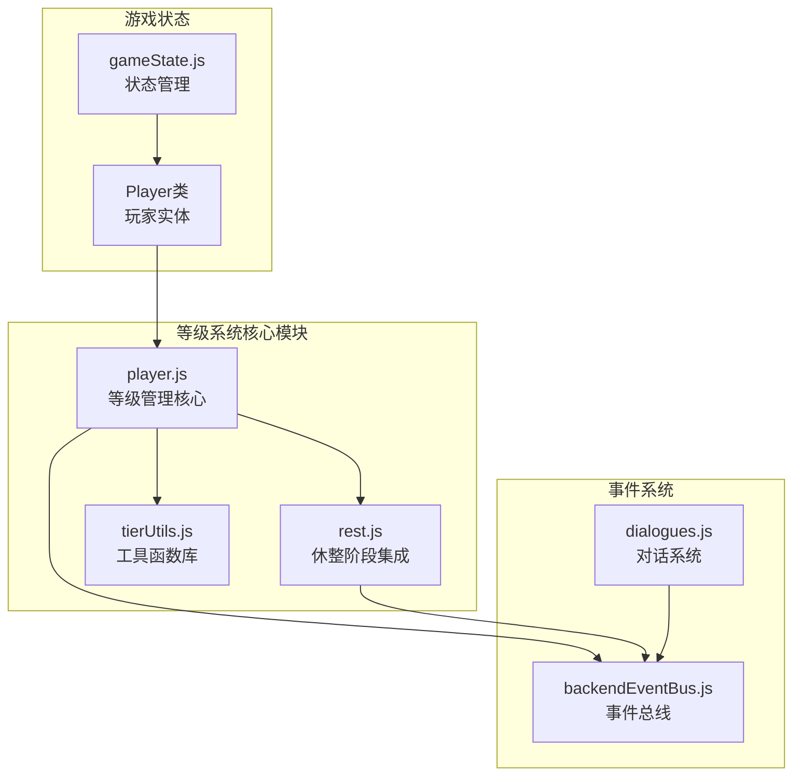
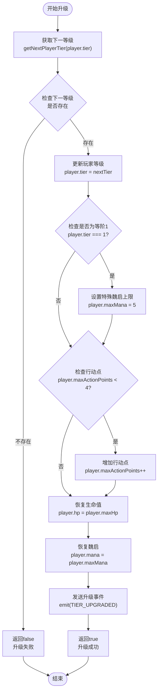
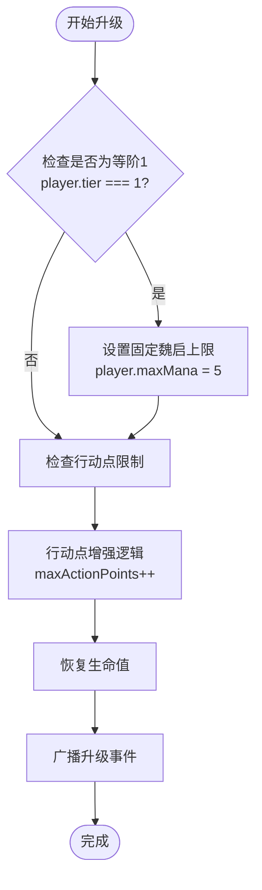
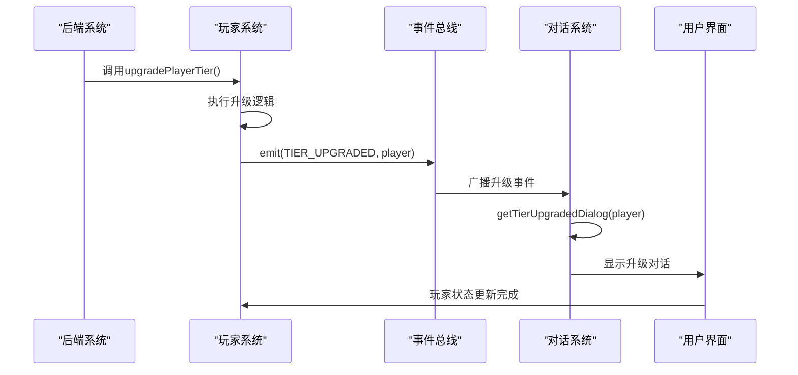
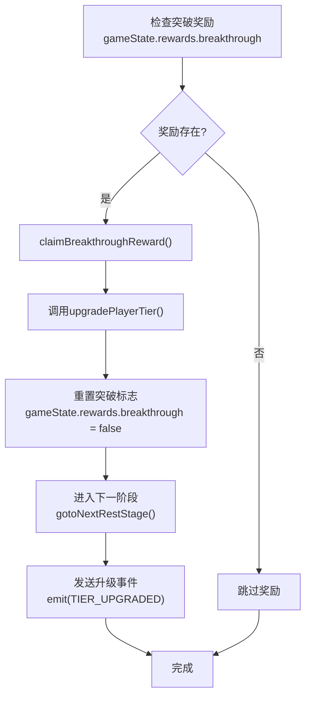
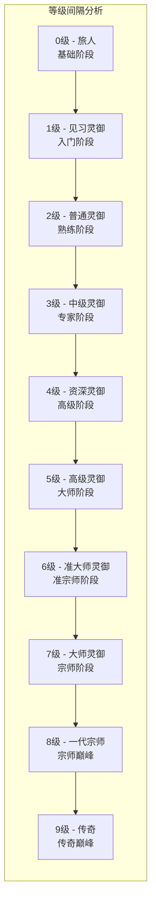

# 等级与等阶系统

<cite>
**本文档中引用的文件**
- [src/data/player.js](file://src/data/player.js)
- [src/data/rest.js](file://src/data/rest.js)
- [src/utils/tierUtils.js](file://src/utils/tierUtils.js)
- [src/data/dialogues.js](file://src/data/dialogues.js)
- [src/backendEventBus.js](file://src/backendEventBus.js)
- [src/data/gameState.js](file://src/data/gameState.js)
</cite>

## 目录
1. [简介](#简介)
2. [系统架构概览](#系统架构概览)
3. [等级查找表设计](#等级查找表设计)
4. [等级升级流程](#等级升级流程)
5. [属性增强规则](#属性增强规则)
6. [特殊逻辑处理](#特殊逻辑处理)
7. [事件广播机制](#事件广播机制)
8. [休整阶段奖励机制](#休整阶段奖励机制)
9. [等级边界值分析](#等级边界值分析)
10. [扩展建议](#扩展建议)
11. [总结](#总结)

## 简介

本系统是一个完整的玩家等级（tier）与等阶管理系统，负责管理玩家在游戏中的成长路径。该系统通过getNextPlayerTier查找表设计实现等级递进，并通过upgradePlayerTier升级流程控制玩家属性增强。系统支持从0级到9级的完整等级体系，每个等级都有独特的名称和特性描述。

## 系统架构概览



**图表来源**
- [src/data/player.js](file://src/data/player.js#L1-L226)
- [src/data/rest.js](file://src/data/rest.js#L1-L215)
- [src/utils/tierUtils.js](file://src/utils/tierUtils.js#L1-L218)

## 等级查找表设计

### 查找表结构

系统采用简洁的查找表设计来管理等级递进关系：

```javascript
export function getNextPlayerTier(playerTier) {
  const tierUpgrades = { 0: 1, 1: 2, 2: 3, 3: 4, 4: 5, 5: 6, 6: 7, 7: 8, 8: 9 };
  return tierUpgrades[playerTier];
}
```

### 等级映射表

系统维护了一个完整的等级映射表，包含每个等级的详细信息：

```javascript
export function getPlayerTierFromTierIndex(tierIndex) {
  const tiers = [
    {tier: 0, name: '旅人'},
    {tier: 1, name: '见习灵御'},
    {tier: 2, name: '普通灵御'},
    {tier: 3, name: '中级灵御'},
    {tier: 4, name: '资深灵御'},
    {tier: 5, name: '高级灵御'},
    {tier: 6, name: '准大师灵御'},
    {tier: 7, name: '大师灵御', subtitle: '古往今来，灵御协会所能给出的最高认可'},
    {tier: 8, name: '一代宗师', subtitle: '和独开一代的宗师们并肩而立'},
    {tier: 9, name: '传奇', subtitle: '即便肉身消陨，你的名字也会回荡于传说之中'}
  ];
  return tiers[tierIndex];
}
```

### 等级颜色系统

系统提供了完整的等级颜色映射，支持视觉化的等级标识：

```javascript
const PLAYER_TIER_PALLETE = {
  '0': {major: '#333333', background: '#DDDDDD', text: '#000000'}, // 旅人 - 黑色 + 灰色
  '1': {major: '#008000', background: '#90EE90', text: '#000000'}, // 见习灵御 - 绿色 + 淡绿色
  '2': {major: '#00FFFF', background: '#E0FFFF', text: '#000000'}, // 普通灵御 - 青色 + 浅青色
  '3': {major: '#00008B', background: '#ADD8E6', text: '#000000'}, // 中级灵御 - 深蓝色 + 浅蓝色
  '4': {major: '#700090', background: '#cfbfd8', text: '#000000'}, // 资深灵御 - 紫色 + 淡紫色
  '5': {major: '#A00050', background: '#d8bfcc', text: '#000000'}, // 高级灵御 - 嫣红色 + 淡紫色
  '6': {major: '#FFA500', background: '#FFFFFF', text: '#000000'},  // 准大师灵御 - 橙色
  '7': {major: '#FF8800', background: '#FFE5A0', text: '#000000'}, // 大师灵御 - 橙色 + 金色
  '8': {major: '#FF0000', background: '#FFC0A0', text: '#000000'}, // 一代宗师 - 红色 + 橙红色
  '9': {major: '#CCCCCC', background: '#000000', text: '#FFFFFF'} // 传奇 - 深红色 + 红色 （白字）
};
```

**章节来源**
- [src/data/player.js](file://src/data/player.js#L4-L10)
- [src/data/player.js](file://src/data/player.js#L12-L25)
- [src/utils/tierUtils.js](file://src/utils/tierUtils.js#L30-L45)

## 等级升级流程

### 升级函数实现



**图表来源**
- [src/data/player.js](file://src/data/player.js#L12-L28)

### 升级流程详解

升级流程的核心逻辑如下：

1. **获取下一等级**：通过查找表确定玩家的下一等级
2. **验证等级有效性**：确保下一等级存在且有效
3. **更新等级状态**：将玩家的tier属性更新为新的等级
4. **特殊逻辑处理**：
   - 等阶1时设置固定的魏启上限为5
   - 增加行动点上限（如果小于4）
5. **状态恢复**：恢复玩家的生命值和魏启值到最大值
6. **事件广播**：通过事件总线通知系统等级已升级

```javascript
export function upgradePlayerTier (player) {
  const nextTier = getNextPlayerTier(player.tier);
  if (nextTier !== undefined) {
    player.tier = nextTier;
    if (player.tier === 1) {
      // 特殊：第一次升级时给5魏启上限
      player.maxMana = 5;
    }
    if (player.maxActionPoints < 4) {
      player.maxActionPoints++;
    }
  }
  player.hp = player.maxHp;
  player.mana = player.maxMana;
  backendEventBus.emit(EventNames.Player.TIER_UPGRADED, player);
  return true;
}
```

**章节来源**
- [src/data/player.js](file://src/data/player.js#L12-L28)

## 属性增强规则

### 行动点增强机制

系统实现了渐进式的行动点增强机制：

```javascript
if (player.maxActionPoints < 4) {
  player.maxActionPoints++;
}
```

这种设计确保：
- 初始行动点从3开始
- 每次升级最多增加到4点
- 提供了有限的强化空间

### 魏启增强机制

```javascript
if (player.tier === 1) {
  // 特殊：第一次升级时给5魏启上限
  player.maxMana = 5;
}
```

### 属性修正器系统

系统还提供了属性修正器框架，支持动态属性调整：

```javascript
export function createPlayerStatModifier({ attack, defense, magic } = {}) {
  return function(player) {
    return new Proxy(player, {
      get(target, prop, receiver) {
        if (prop === 'attack') {
          const base = Reflect.get(target, 'attack', receiver);
          return typeof attack === 'function' ? attack(base, receiver) : base;
        }
        if (prop === 'defense') {
          const base = Reflect.get(target, 'defense', receiver);
          return typeof defense === 'function' ? defense(base, receiver) : base;
        }
        if (prop === 'magic') {
          const base = Reflect.get(target, 'magic', receiver);
          return typeof magic === 'function' ? magic(base, receiver) : base;
        }
        return Reflect.get(target, prop, receiver);
      }
    });
  }
}
```

**章节来源**
- [src/data/player.js](file://src/data/player.js#L18-L20)
- [src/data/player.js](file://src/data/player.js#L15-L17)
- [src/data/player.js](file://src/data/player.js#L30-L55)

## 特殊逻辑处理

### 等阶1的特殊处理

等阶1的特殊处理体现了游戏设计的平衡性考虑：



**图表来源**
- [src/data/player.js](file://src/data/player.js#L15-L17)

### 等级边界保护

系统通过多种方式保护等级边界：

1. **查找表验证**：确保只有有效的等级才能被升级
2. **数值范围控制**：限制行动点和魏启的最大值
3. **状态一致性**：升级后立即恢复相关状态

```javascript
// 等级边界验证
const tierUpgrades = { 0: 1, 1: 2, 2: 3, 3: 4, 4: 5, 5: 6, 6: 7, 7: 8, 8: 9 };

// 数值范围控制
if (player.maxActionPoints < 4) {
  player.maxActionPoints++;
}

// 状态恢复
player.hp = player.maxHp;
player.mana = player.maxMana;
```

**章节来源**
- [src/data/player.js](file://src/data/player.js#L4-L10)
- [src/data/player.js](file://src/data/player.js#L18-L20)
- [src/data/player.js](file://src/data/player.js#L22-L24)

## 事件广播机制

### 事件总线集成

系统通过事件总线实现松耦合的组件通信：

```javascript
import backendEventBus, { EventNames } from '../backendEventBus.js'

// 升级事件广播
backendEventBus.emit(EventNames.Player.TIER_UPGRADED, player);
```

### 事件监听器注册



**图表来源**
- [src/data/player.js](file://src/data/player.js#L26-L27)
- [src/data/dialogues.js](file://src/data/dialogues.js#L316-L320)

### 对话系统集成

系统集成了专门的对话系统来处理等级升级事件：

```javascript
backendEventBus.on(EventNames.Player.TIER_UPGRADED, (player) => {
  // 触发升级对话
  const sequence = getTierUpgradedDialog(player);
  if (sequence && isRemiPresent) {
    enqueueUI('displayDialog', sequence);
  }
});
```

### 等级升级对话逻辑

```javascript
function getTierUpgradedDialog(player) {
  if(player.tier === getPlayerTierFromTierIndex(1).tier) {
    // 第一次升级，瑞米提供关于升级的提示和教程
    return [
      {
        character: '瑞米',
        text: '哇！恭喜你！你通过战斗证明自己的实力，进行了一次/named{突破}！',
        avatar: new URL('../assets/remi.png', import.meta.url).href
      },
      // ... 更多对话内容
    ];
  }
  return null;
}
```

**章节来源**
- [src/data/player.js](file://src/data/player.js#L26-L27)
- [src/data/dialogues.js](file://src/data/dialogues.js#L316-L320)
- [src/data/dialogues.js](file://src/data/dialogues.js#L180-L210)

## 休整阶段奖励机制

### 突破奖励触发

系统在休整阶段通过特定条件触发突破奖励：

```javascript
// 突破奖励条件
gameState.rewards.breakthrough = (
  gameState.battleCount === 2 || gameState.enemy.isBoss
);
```

### 突破奖励领取



**图表来源**
- [src/data/rest.js](file://src/data/rest.js#L140-L145)

### 技能奖励与等级关联

系统将等级提升与技能奖励生成关联：

```javascript
export function spawnSkillRewards() {
  let tier = gameState.player.tier;
  // 如果已经生成了突破奖励，那么生成技能奖励时奖励提升
  if(gameState.rewards.breakthrough) {
    const nextTier = getNextPlayerTier(tier);
    if(nextTier) tier = nextTier;
  }
  gameState.rewards.skills = SkillManager.getInstance().getRandomSkills(
    4, gameState.player.leino, gameState.player.cultivatedSkills, tier, true
  );
}
```

**章节来源**
- [src/data/rest.js](file://src/data/rest.js#L140-L145)
- [src/data/rest.js](file://src/data/rest.js#L10-L17)

## 等级边界值分析

### 边界值设计意图

系统采用了精心设计的等级边界值：

```javascript
const tierUpgrades = { 0: 1, 1: 2, 2: 3, 3: 4, 4: 5, 5: 6, 6: 7, 7: 8, 8: 9 };
```

### 设计特点分析

1. **线性递进**：从0到9的线性增长，便于理解和预测
2. **完整性**：覆盖了从新手到传奇的完整成长路径
3. **平衡性**：每个等级都有明确的提升目标
4. **扩展性**：预留了未来扩展的空间

### 等级间隔分析



**图表来源**
- [src/data/player.js](file://src/data/player.js#L4-L10)

**章节来源**
- [src/data/player.js](file://src/data/player.js#L4-L10)

## 扩展建议

### 功能扩展方向

1. **动态等级系统**：支持可配置的等级间隔和属性增强
2. **等级成就系统**：为每个等级解锁特定的成就和奖励
3. **等级进度可视化**：提供更直观的等级进度展示
4. **等级互斥机制**：防止玩家同时获得多个等级提升

### 性能优化建议

1. **缓存机制**：缓存等级查找结果减少重复计算
2. **批量处理**：支持批量等级提升操作
3. **异步处理**：将复杂的等级计算异步化

### 用户体验改进

1. **渐进式提示**：为不同等级提供渐进式的指导
2. **等级预览**：允许玩家预览等级提升的效果
3. **等级选择**：在某些情况下允许玩家选择不同的成长路径

## 总结

本等级与等阶系统展现了优秀的软件架构设计，具有以下特点：

### 核心优势

1. **简洁高效**：通过查找表实现简单的等级递进逻辑
2. **灵活扩展**：支持未来的功能扩展和定制
3. **事件驱动**：通过事件总线实现松耦合的系统集成
4. **用户体验**：提供丰富的对话和视觉反馈

### 设计亮点

1. **特殊逻辑处理**：等阶1的特殊处理体现了游戏平衡性考虑
2. **渐进式增强**：行动点和魏启的渐进式增强提供了合理的成长曲线
3. **状态一致性**：升级后立即恢复相关状态确保了系统的一致性
4. **事件集成**：与对话系统和UI系统的无缝集成提升了用户体验

### 技术特色

1. **模块化设计**：清晰的模块划分便于维护和扩展
2. **类型安全**：通过TypeScript类型定义确保代码质量
3. **性能优化**：合理的算法设计保证了良好的运行性能
4. **可测试性**：清晰的函数接口便于单元测试

该系统为游戏提供了坚实的等级成长基础，既满足了当前的功能需求，也为未来的扩展预留了充足的空间。通过合理的架构设计和完善的事件机制，系统能够很好地支持游戏的整体发展。