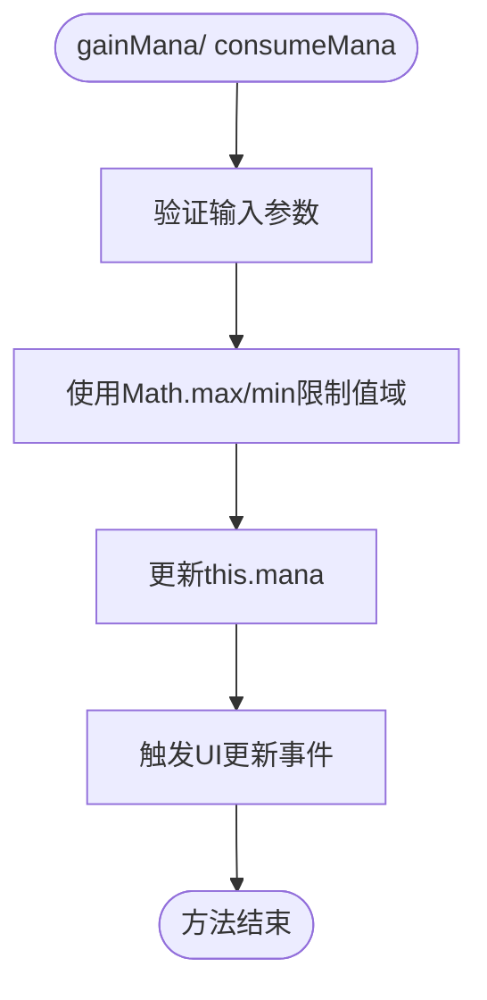
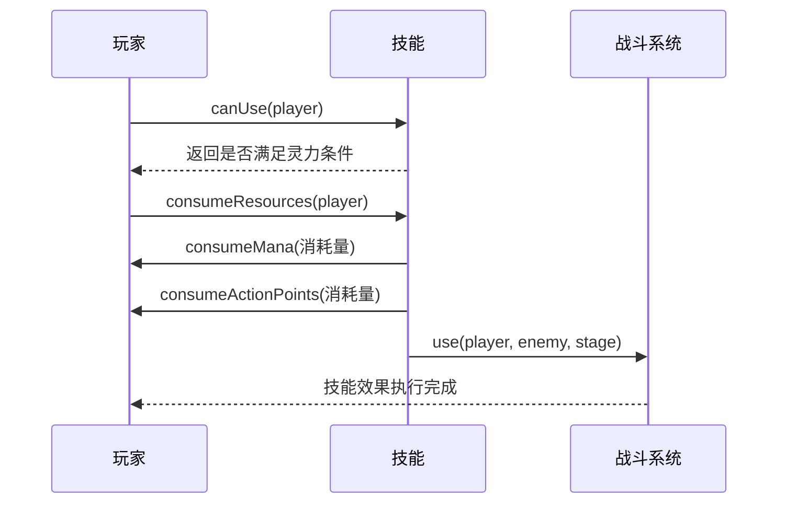
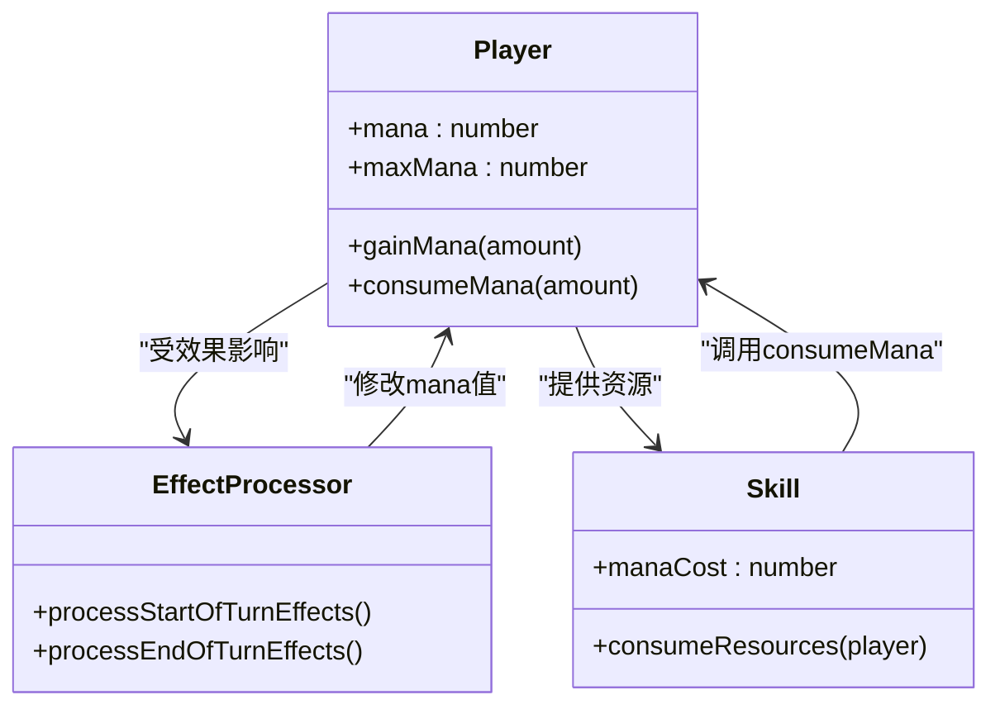
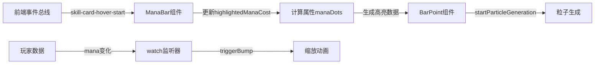

# 灵力系统

<cite>
**本文档引用文件**  
- [player.js](file://src/data/player.js)
- [ManaBar.vue](file://src/components/global/ManaBar.vue)
- [skill.js](file://src/data/skill.js)
- [battle.js](file://src/data/battle.js)
- [effectProcessor.js](file://src/data/effectProcessor.js)
- [frontendEventBus.js](file://src/frontendEventBus.js)
- [BarPoint.vue](file://src/components/global/BarPoint.vue)
</cite>

## 目录
1. [简介](#简介)
2. [灵力管理核心机制](#灵力管理核心机制)
3. [技能释放中的灵力交互](#技能释放中的灵力交互)
4. [灵力恢复与消耗策略](#灵力恢复与消耗策略)
5. [UI层灵力状态可视化](#ui层灵力状态可视化)
6. [异常情况处理](#异常情况处理)
7. [性能优化建议](#性能优化建议)

## 简介
灵力系统是游戏战斗机制的核心资源管理系统之一，用于控制玩家技能的释放权限。该系统通过魏启（Mana）值的增减来平衡玩家在战斗中的行动策略，与行动点、技能冷却等机制共同构成战术决策的基础。灵力值受玩家等阶、技能效果和战斗阶段等多种因素影响，其管理逻辑贯穿于整个战斗流程。

## 灵力管理核心机制

灵力值的管理主要通过`gainMana`和`consumeMana`两个核心方法实现，这两个方法定义在`Player`类中，负责对灵力值进行安全的增减操作。

**灵力值上下限控制策略**：
- 所有灵力变更操作均通过`gainMana`和`consumeMana`方法执行
- 使用`Math.max(this.mana, 0)`确保灵力值不低于0
- 使用`Math.min(this.mana, this.maxMana)`确保灵力值不超过上限
- 这种双重钳制策略有效防止了数值溢出或负值异常

**Section sources**
- [player.js](file://src/data/player.js#L200-L225)

## 技能释放中的灵力交互

技能释放过程中的灵力管理是一个多阶段的交互流程，涉及技能可用性判断、资源消耗和效果执行三个主要环节。

**技能可用性判断**：
- `canUse`方法检查玩家灵力是否大于等于技能消耗
- 同时验证行动点和剩余使用次数
- 该判断在前端UI层和后端结算层双重执行，确保数据一致性

**资源消耗流程**：
- `consumeResources`方法统一处理灵力和行动点的扣除
- 扣除顺序为：行动点 → 灵力 → 技能使用次数
- 所有操作均在后端状态机中执行，保证原子性

**Section sources**
- [skill.js](file://src/data/skill.js#L200-L225)
- [battle.js](file://src/data/battle.js#L300-L350)

## 灵力恢复与消耗策略

灵力的恢复与消耗不仅限于技能使用，还受到多种游戏内效果的影响，形成了复杂的动态平衡系统。

### 灵力恢复机制
- **回合开始恢复**：通过`聚气`效果在每回合开始时恢复灵力
- **回合结束恢复**：通过`吸收`效果在每回合结束时恢复灵力
- **等级提升恢复**：玩家升级时灵力值会重置为最大值
- **特殊技能恢复**：部分技能如`肾上腺素激增`可直接增加灵力

### 灵力消耗机制
- **主动消耗**：使用技能时通过`consumeMana`方法扣除
- **被动消耗**：通过`漏气`效果在每回合结束时自动扣除
- **异常状态消耗**：某些负面效果可能导致额外灵力消耗

**Diagram sources**
- [player.js](file://src/data/player.js#L163-L204)
- [effectProcessor.js](file://src/data/effectProcessor.js#L100-L150)

## UI层灵力状态可视化

灵力状态在UI层通过`ManaBar`组件进行可视化展示，该组件实现了动态更新和视觉反馈两大核心功能。

### 组件结构分析
- **文本显示区**：显示当前灵力/最大灵力的数值信息
- **圆点指示区**：通过多个`BarPoint`组件构成可视化进度条
- **高亮反馈区**：当鼠标悬停在技能卡上时，高亮显示所需灵力消耗

### 动态更新机制
- 通过Vue的`watch`监听器监控`player.mana`和`player.maxMana`变化
- 当数值发生变化时，触发缩放动画增强视觉反馈
- 使用`$nextTick`确保DOM更新完成后再执行动画

### 视觉反馈实现
- **高亮逻辑**：通过前端事件总线监听技能悬停事件
- **粒子效果**：高亮状态下的圆点会生成蓝色粒子特效
- **颜色渐变**：使用CSS动画实现颜色脉冲效果

**Diagram sources**
- [ManaBar.vue](file://src/components/global/ManaBar.vue#L50-L100)
- [BarPoint.vue](file://src/components/global/BarPoint.vue#L50-L100)
- [frontendEventBus.js](file://src/frontendEventBus.js#L1-L10)

**Section sources**
- [ManaBar.vue](file://src/components/global/ManaBar.vue#L0-L120)
- [BarPoint.vue](file://src/components/global/BarPoint.vue#L0-L175)

## 异常情况处理

系统对灵力相关的异常情况进行了全面的边界条件处理，确保游戏运行的稳定性。

### 数值溢出处理
- 使用`Math.min`和`Math.max`双重钳制防止溢出
- 在`gainMana`和`consumeMana`方法中同时检查上下限
- 所有数值操作都在方法内部完成，避免外部直接修改

### 负值校验机制
- `consumeMana`方法中`Math.max(this.mana, 0)`确保不会出现负值
- 即使传入负数作为参数，也会被自动修正为0
- 这种防御性编程策略有效防止了因计算错误导致的数值异常

### 并发访问保护
- 灵力操作都在后端状态机中串行执行
- 通过动画指令队列确保操作的原子性
- 前端控件在操作执行期间会被锁定，防止重复点击

**Section sources**
- [player.js](file://src/data/player.js#L200-L225)
- [battle.js](file://src/data/battle.js#L400-L450)

## 性能优化建议

针对灵力系统的实现，提出以下性能优化建议：

1. **减少不必要的重渲染**：
   - 将`ManaBar`组件设置为`shouldComponentUpdate`优化
   - 使用`v-memo`或`computed`缓存计算结果

2. **事件监听器管理**：
   - 确保在组件销毁时移除所有事件监听器
   - 使用事件委托减少监听器数量

3. **动画性能优化**：
   - 将粒子生成频率从500ms调整为800ms
   - 限制同时存在的粒子数量

4. **内存管理**：
   - 避免在`gainMana`和`consumeMana`中创建临时对象
   - 重用动画指令对象池

5. **批量更新优化**：
   - 当多个技能连续使用时，合并UI更新
   - 使用`requestAnimationFrame`协调渲染时机