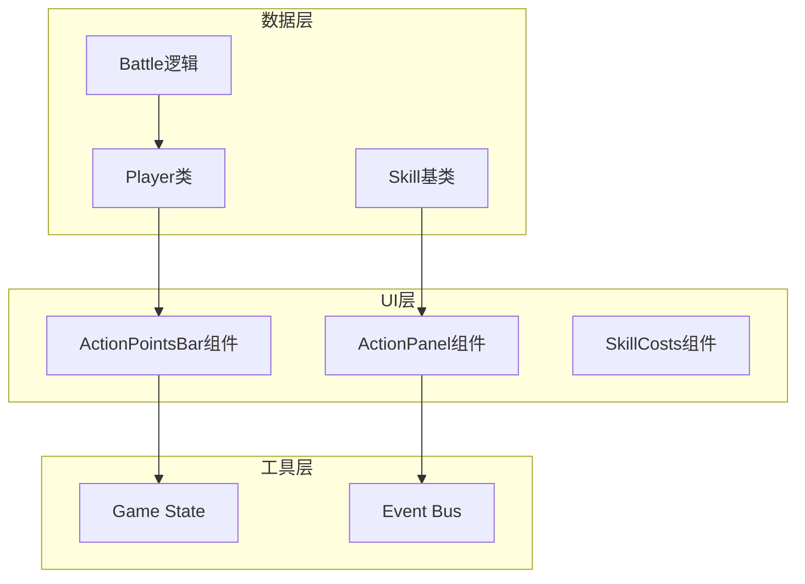
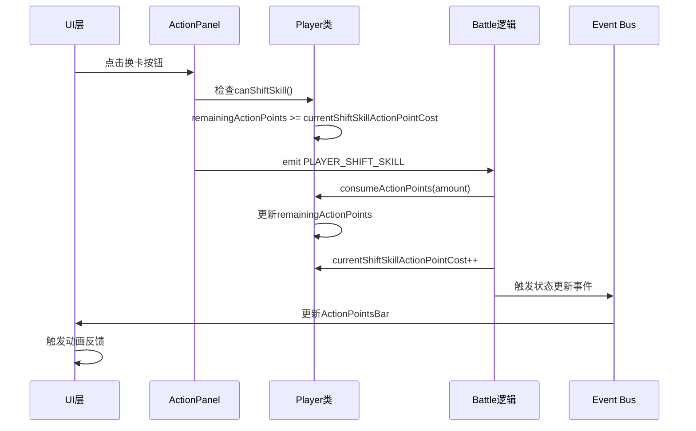
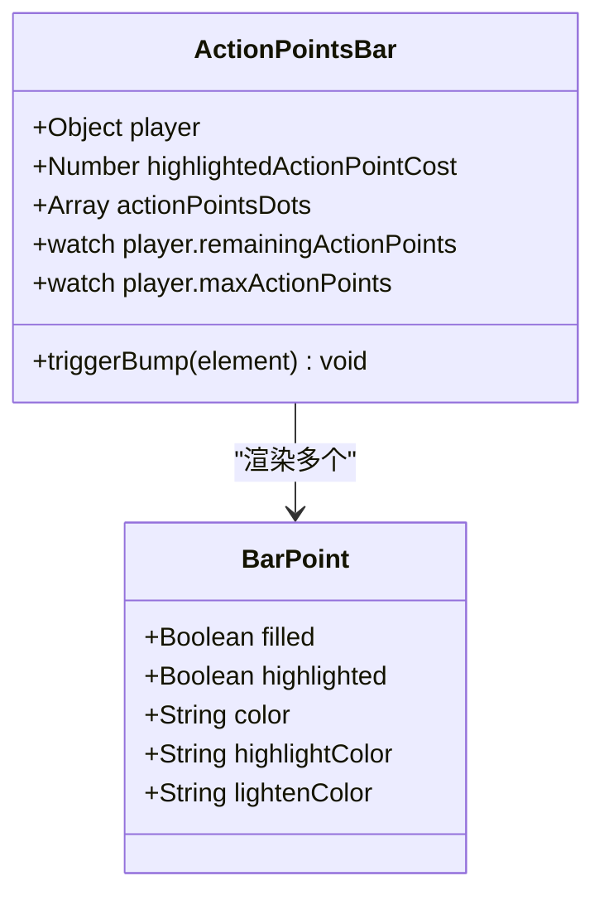
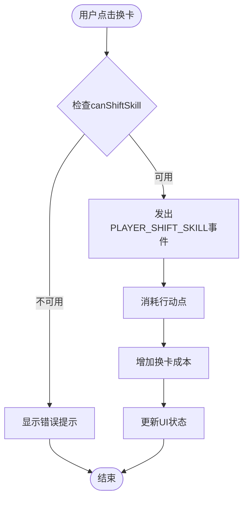
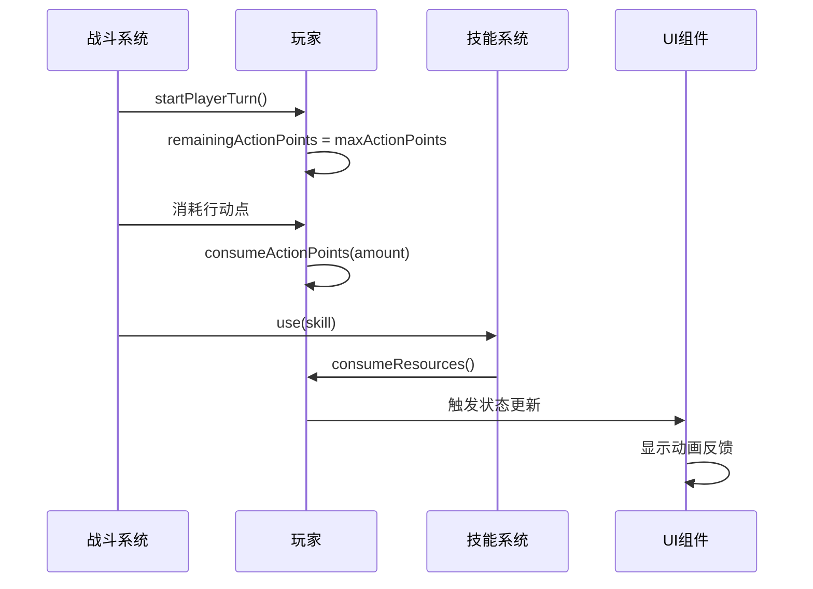
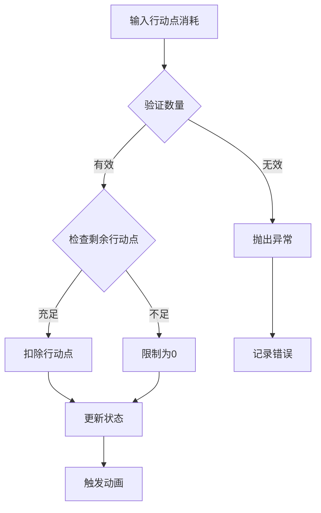
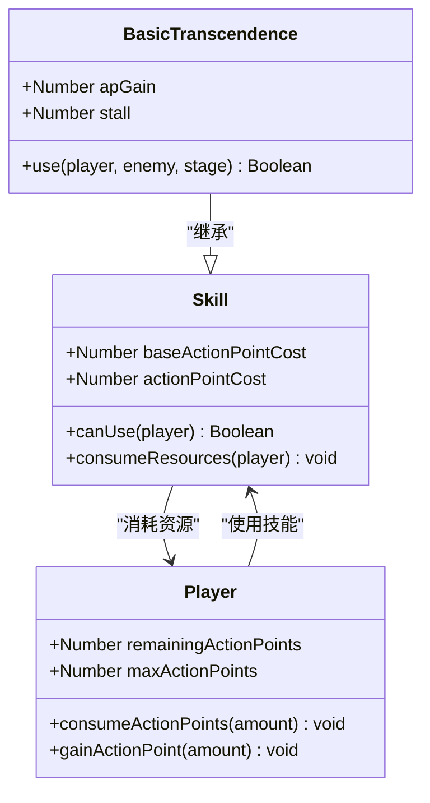
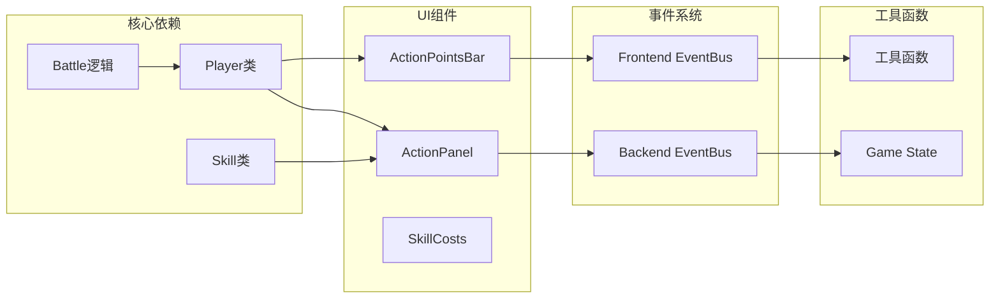

# 行动点系统

<cite>
**本文档中引用的文件**
- [src/data/player.js](file://src/data/player.js)
- [src/data/battle.js](file://src/data/battle.js)
- [src/data/skill.js](file://src/data/skill.js)
- [src/components/global/ActionPointsBar.vue](file://src/components/global/ActionPointsBar.vue)
- [src/components/battle/ActionPanel.vue](file://src/components/battle/ActionPanel.vue)
- [src/data/skills/martial_arts/transcendence.js](file://src/data/skills/martial_arts/transcendence.js)
- [src/data/skills/deprecated/speedThinking.js](file://src/data/skills/deprecated/speedThinking.js)
- [src/data/skills/deprecated/matialArts.js](file://src/data/skills/deprecated/matialArts.js)
- [src/data/skills/deprecated/cMinus.js](file://src/data/skills/deprecated/cMinus.js)
- [src/data/skills/martial_arts/misc.js](file://src/data/skills/martial_arts/misc.js)
- [src/data/skills/martial_arts/agilePunch.js](file://src/data/skills/martial_arts/agilePunch.js)
- [src/data/skills/martial_arts/martialArtPose.js](file://src/data/skills/martial_arts/martialArtPose.js)
- [src/components/global/skillCard/SkillCosts.vue](file://src/components/global/skillCard/SkillCosts.vue)
</cite>

## 目录
1. [简介](#简介)
2. [项目结构](#项目结构)
3. [核心组件](#核心组件)
4. [架构概览](#架构概览)
5. [详细组件分析](#详细组件分析)
6. [依赖关系分析](#依赖关系分析)
7. [性能考虑](#性能考虑)
8. [故障排除指南](#故障排除指南)
9. [结论](#结论)

## 简介

行动点系统是RTVL游戏的核心机制之一，负责管理玩家在战斗中的行动能力。该系统通过consumeActionPoints方法实现行动点的消耗逻辑，支持换卡成本递增机制，并提供了完整的UI反馈和边界检查功能。

行动点系统的主要特点包括：
- 每回合自动恢复机制
- 换卡成本递增的经济系统
- 实时UI状态同步
- 完整的边界检查和错误处理
- 性能优化的动画反馈

## 项目结构

行动点系统的核心文件分布在以下目录结构中：



**图表来源**
- [src/data/player.js](file://src/data/player.js#L1-L226)
- [src/data/battle.js](file://src/data/battle.js#L1-L553)
- [src/components/global/ActionPointsBar.vue](file://src/components/global/ActionPointsBar.vue#L1-L119)

## 核心组件

### Player类 - 行动点管理核心

Player类是行动点系统的核心数据结构，负责维护玩家的行动点状态：

```javascript
// 行动点初始化
this.remainingActionPoints = 3;
this.maxActionPoints = 3; // 行动点初始为3

// 当前换卡行动点消耗
this.initialShiftSkillActionPointCost = 0; // 每场战斗第一次换卡的行动点消耗
this.currentShiftSkillActionPointCost = this.initialShiftSkillActionPointCost; // 当前换卡行动点消耗，每丢一次消耗增1
```

### consumeActionPoints方法 - 消耗逻辑实现

```javascript
consumeActionPoints (amount) {
  this.remainingActionPoints -= amount;
  this.remainingActionPoints = Math.max(this.remainingActionPoints, 0);
}
```

该方法实现了以下关键特性：
- **边界检查**：确保行动点不会变为负值
- **原子操作**：一次性减去指定数量的行动点
- **性能优化**：使用Math.max进行高效的边界检查

**章节来源**
- [src/data/player.js](file://src/data/player.js#L163-L225)

## 架构概览

行动点系统采用分层架构设计，确保了良好的模块化和可维护性：



**图表来源**
- [src/components/battle/ActionPanel.vue](file://src/components/battle/ActionPanel.vue#L82-L90)
- [src/data/battle.js](file://src/data/battle.js#L479-L486)

## 详细组件分析

### ActionPointsBar组件 - UI状态展示

ActionPointsBar组件负责实时展示玩家的行动点状态：



**图表来源**
- [src/components/global/ActionPointsBar.vue](file://src/components/global/ActionPointsBar.vue#L15-L45)

#### 行动点圆点计算逻辑

```javascript
actionPointsDots() {
  const dots = [];
  for (let i = 0; i < this.player.maxActionPoints; i++) {
    const isFilled = i < this.player.remainingActionPoints;
    const isHighlighted = isFilled && i >= this.player.remainingActionPoints - this.highlightedActionPointCost;
    dots.push({
      filled: isFilled,
      highlighted: isHighlighted
    });
  }
  return dots;
}
```

该计算逻辑实现了以下功能：
- **动态渲染**：根据剩余行动点数量动态生成圆点
- **高亮显示**：突出显示即将消耗的行动点
- **视觉反馈**：通过颜色变化提供直观的状态指示

### ActionPanel组件 - 用户交互控制

ActionPanel组件管理用户与行动点系统的交互：



**图表来源**
- [src/components/battle/ActionPanel.vue](file://src/components/battle/ActionPanel.vue#L82-L90)
- [src/data/battle.js](file://src/data/battle.js#L479-L486)

#### 换卡成本递增机制

```javascript
// 检查是否可以换卡
canShiftSkill() {
  const canShiftSkill = backendGameState.player.getModifiedPlayer().canShiftSkill();
  return (this.isPlayerTurn && !this.isControlDisabled && canShiftSkill);
}

// 获取当前换卡成本
shiftSkillCost() {
  return backendGameState.player.getModifiedPlayer().currentShiftSkillActionPointCost;
}
```

换卡成本递增机制的特点：
- **经济平衡**：随着战斗进行，换卡成本逐渐增加
- **策略深度**：鼓励玩家合理规划行动点使用
- **渐进式难度**：后期战斗中行动点更加珍贵

**章节来源**
- [src/components/battle/ActionPanel.vue](file://src/components/battle/ActionPanel.vue#L82-L90)
- [src/data/player.js](file://src/data/player.js#L136-L137)

### 战斗系统集成

战斗系统中的行动点管理逻辑：



**图表来源**
- [src/data/battle.js](file://src/data/battle.js#L100-L120)
- [src/data/skill.js](file://src/data/skill.js#L170-L175)

#### 每回合行动点恢复流程

```javascript
// 开始玩家回合时恢复行动点
function startPlayerTurn() {
  const modPlayer = gameState.player.getModifiedPlayer();
  
  // 补充行动力
  gameState.player.remainingActionPoints = modPlayer.maxActionPoints;
  
  // 进行技能冷却
  gameState.player.frontierSkills.forEach(skill => {
    skill.coldDown();
  });
}
```

恢复流程的关键特性：
- **完整恢复**：每回合恢复到最大行动点数量
- **技能冷却**：同时进行所有前台技能的冷却
- **修正器支持**：考虑属性修正器对行动点的影响

**章节来源**
- [src/data/battle.js](file://src/data/battle.js#L100-L120)

### 边界检查与错误处理

行动点系统实现了多层边界检查机制：



#### 消耗规则实现

```javascript
// 消耗行动点的边界检查
consumeActionPoints (amount) {
  this.remainingActionPoints -= amount;
  this.remainingActionPoints = Math.max(this.remainingActionPoints, 0);
}

// 换卡时的边界检查
if(modPlayer.remainingActionPoints < modPlayer.currentShiftSkillActionPointCost) {
  console.warn('行动力不足，无法丢弃技能。');
  return ;
}
```

边界检查的优势：
- **数据完整性**：防止行动点出现负值
- **用户体验**：提供清晰的错误提示
- **系统稳定性**：避免因数据异常导致的崩溃

**章节来源**
- [src/data/player.js](file://src/data/player.js#L195-L200)
- [src/data/battle.js](file://src/data/battle.js#L479-L481)

### 技能系统集成

技能系统与行动点系统的深度集成：



**图表来源**
- [src/data/skill.js](file://src/data/skill.js#L160-L175)
- [src/data/skills/martial_arts/transcendence.js](file://src/data/skills/martial_arts/transcendence.js#L10-L25)

#### 技能行动点消耗计算

```javascript
// 基础技能行动点消耗
get actionPointCost () {
  return Math.max(this.baseActionPointCost, 0);
}

// 可变行动点消耗（如武术姿态）
get actionPointCost() {
  return Math.max(super.actionPointCost - this.power, 0);
}

// 资源消耗统一接口
consumeResources (player) {
  player.consumeActionPoints(this.actionPointCost);
  player.consumeMana(this.manaCost);
  this.consumeUses()
}
```

技能系统的特点：
- **灵活性**：支持动态调整行动点消耗
- **一致性**：统一的资源消耗接口
- **扩展性**：易于添加新的消耗类型

**章节来源**
- [src/data/skill.js](file://src/data/skill.js#L160-L175)
- [src/data/skills/martial_arts/martialArtPose.js](file://src/data/skills/martial_arts/martialArtPose.js#L30-L32)

## 依赖关系分析

行动点系统的依赖关系图展示了各组件之间的相互作用：



**图表来源**
- [src/data/player.js](file://src/data/player.js#L1-L10)
- [src/data/battle.js](file://src/data/battle.js#L1-L15)
- [src/components/battle/ActionPanel.vue](file://src/components/battle/ActionPanel.vue#L1-L30)

**章节来源**
- [src/data/player.js](file://src/data/player.js#L1-L10)
- [src/data/battle.js](file://src/data/battle.js#L1-L15)

## 性能考虑

行动点系统在设计时充分考虑了性能优化：

### 渲染优化

1. **虚拟DOM优化**：ActionPointsBar使用computed属性避免不必要的重新渲染
2. **CSS动画**：利用GPU加速的CSS变换实现流畅的动画效果
3. **事件委托**：ActionPanel使用事件委托减少内存占用

### 计算优化

1. **缓存机制**：Player类使用Proxy缓存修正后的属性
2. **批量更新**：战斗系统中的状态更新采用批量处理
3. **懒加载**：UI组件按需加载，减少初始加载时间

### 内存管理

1. **对象池**：重复使用技能对象，减少垃圾回收压力
2. **弱引用**：使用WeakMap存储临时数据，避免内存泄漏
3. **及时清理**：战斗结束后及时清理事件监听器和定时器

## 故障排除指南

### 常见问题及解决方案

#### 行动点显示异常

**症状**：ActionPointsBar显示的行动点数量不正确
**原因**：状态同步问题或事件监听器失效
**解决方案**：
```javascript
// 检查事件监听器
mounted() {
  this.$nextTick(() => {
    // 确保事件监听器正确绑定
    frontendEventBus.on('player-state-update', this.updateActionPoints);
  });
}

beforeUnmount() {
  // 清理事件监听器
  frontendEventBus.off('player-state-update', this.updateActionPoints);
}
```

#### 换卡成本递增异常

**症状**：换卡成本没有正确递增
**原因**：战斗状态重置或事件触发异常
**解决方案**：
```javascript
// 确保战斗开始时重置换卡成本
function startBattle() {
  const modPlayer = gameState.player.getModifiedPlayer();
  gameState.player.currentShiftSkillActionPointCost = modPlayer.initialShiftSkillActionPointCost;
}
```

#### 性能问题

**症状**：UI响应缓慢或卡顿
**原因**：频繁的状态更新或动画冲突
**解决方案**：
```javascript
// 使用防抖处理频繁的状态更新
watch: {
  'player.remainingActionPoints': debounce(function(nv, ov) {
    if (nv !== ov) this.triggerBump(this.$refs.apText);
  }, 100)
}
```

**章节来源**
- [src/components/global/ActionPointsBar.vue](file://src/components/global/ActionPointsBar.vue#L83-L119)
- [src/data/battle.js](file://src/data/battle.js#L76-L77)

## 结论

行动点系统是RTVL游戏的核心机制，通过精心设计的架构实现了以下目标：

### 设计优势

1. **模块化设计**：清晰的职责分离使得系统易于维护和扩展
2. **性能优化**：多层次的优化策略确保了流畅的游戏体验
3. **用户体验**：完善的UI反馈和边界检查提升了游戏体验
4. **扩展性强**：灵活的接口设计支持未来功能扩展

### 关键特性总结

- **consumeActionPoints方法**：实现了安全的行动点消耗逻辑
- **换卡成本递增机制**：提供了经济平衡和策略深度
- **实时UI同步**：ActionPointsBar组件提供即时状态反馈
- **边界检查机制**：确保数据完整性和系统稳定性
- **动画反馈系统**：增强的视觉反馈提升用户体验

### 未来改进方向

1. **智能提示**：基于玩家行为提供行动点使用建议
2. **统计分析**：记录行动点使用模式，帮助玩家优化策略
3. **移动端适配**：优化触摸交互和屏幕布局
4. **无障碍支持**：增强对残障用户的友好度

行动点系统展现了现代游戏开发中优秀的设计实践，通过合理的架构设计和性能优化，为玩家提供了流畅、有趣的游戏体验。其模块化的结构也为未来的功能扩展奠定了坚实的基础。