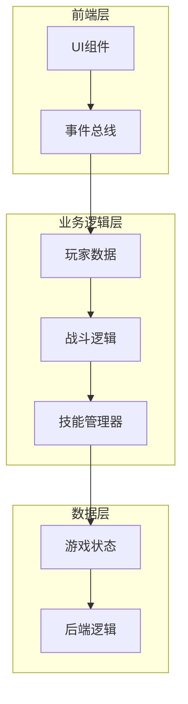
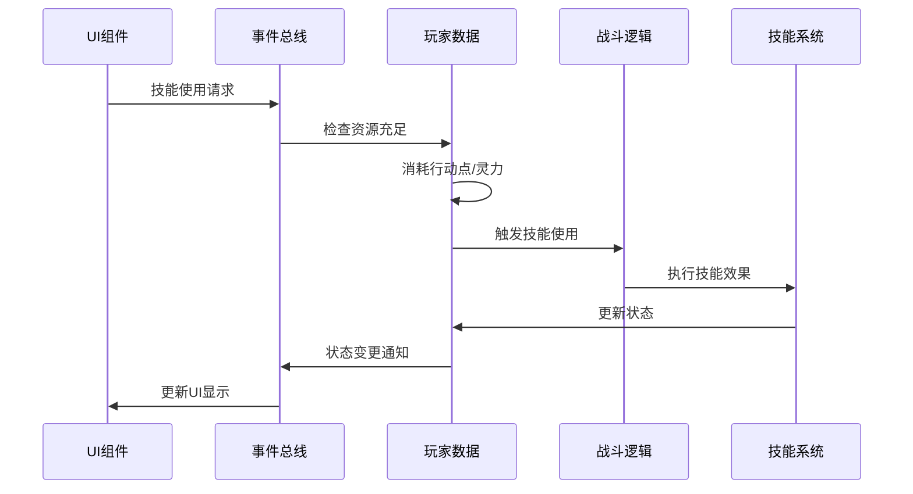
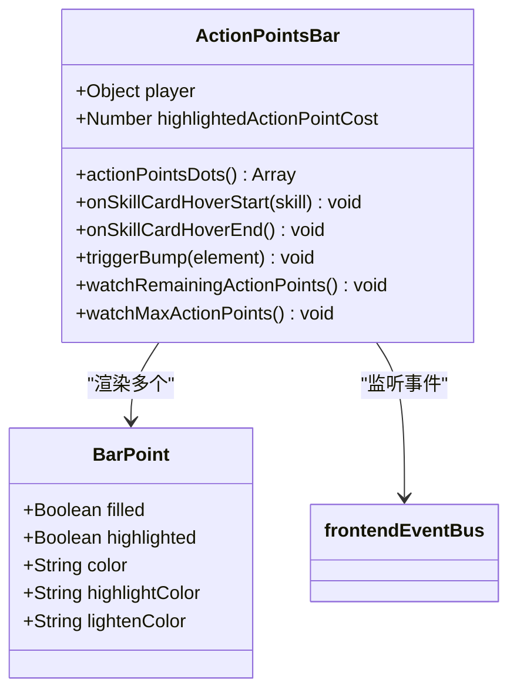
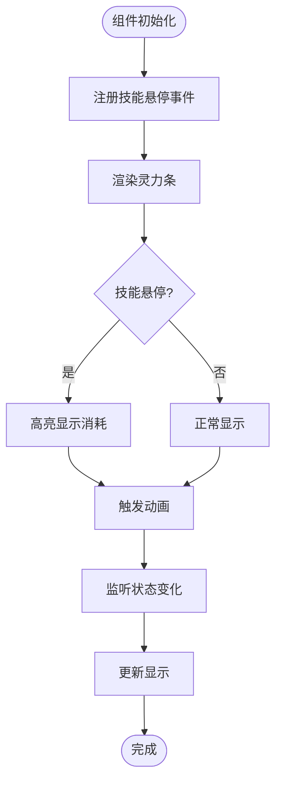
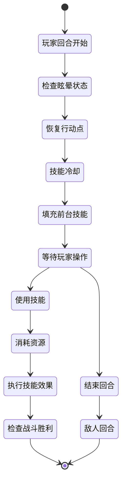
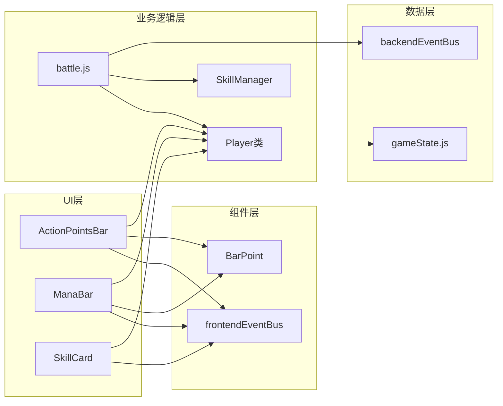

# 资源与行动管理

<cite>
**本文档中引用的文件**
- [src/data/player.js](file://src/data/player.js)
- [src/components/global/ActionPointsBar.vue](file://src/components/global/ActionPointsBar.vue)
- [src/components/global/ManaBar.vue](file://src/components/global/ManaBar.vue)
- [src/components/global/skillCard/SkillCosts.vue](file://src/components/global/skillCard/SkillCosts.vue)
- [src/data/skillManager.js](file://src/data/skillManager.js)
- [src/data/gameState.js](file://src/data/gameState.js)
- [src/data/battle.js](file://src/data/battle.js)
- [src/data/battleUtils.js](file://src/data/battleUtils.js)
- [src/frontendEventBus.js](file://src/frontendEventBus.js)
- [src/backendEventBus.js](file://src/backendEventBus.js)
- [src/components/global/SkillCard.vue](file://src/components/global/SkillCard.vue)
</cite>

## 目录
1. [简介](#简介)
2. [项目结构概览](#项目结构概览)
3. [核心资源系统](#核心资源系统)
4. [架构概览](#架构概览)
5. [详细组件分析](#详细组件分析)
6. [依赖关系分析](#依赖关系分析)
7. [性能考虑](#性能考虑)
8. [故障排除指南](#故障排除指南)
9. [结论](#结论)

## 简介

本文档全面解析了《灵御》游戏中玩家资源消耗与恢复机制的核心系统。该系统主要围绕两个关键资源展开：行动点（Action Points）和灵力（Mana），并通过复杂的消耗规则、恢复逻辑和边界控制确保游戏平衡性和流畅的游戏体验。

系统采用了前后端分离的设计模式，通过事件总线机制协调各个组件之间的交互，实现了高度解耦和可维护的架构设计。资源管理系统不仅处理基础的数值计算，还包含了丰富的UI反馈机制，为玩家提供了直观的视觉反馈。

## 项目结构概览

该项目采用模块化的Vue.js架构，将功能划分为清晰的层次：



**图表来源**
- [src/data/player.js](file://src/data/player.js#L1-L226)
- [src/data/battle.js](file://src/data/battle.js#L1-L553)
- [src/frontendEventBus.js](file://src/frontendEventBus.js#L1-L9)

**章节来源**
- [src/data/player.js](file://src/data/player.js#L1-L226)
- [src/data/gameState.js](file://src/data/gameState.js#L1-L75)

## 核心资源系统

### 行动点系统（Action Points）

行动点系统是游戏回合制战斗的核心机制，负责控制玩家的行动能力：

```javascript
// 行动点消耗逻辑
consumeActionPoints(amount) {
  this.remainingActionPoints -= amount;
  this.remainingActionPoints = Math.max(this.remainingActionPoints, 0);
}

// 行动点恢复逻辑
gainActionPoint(amount) {
  this.remainingActionPoints += amount;
  this.remainingActionPoints = Math.min(this.remainingActionPoints, this.maxActionPoints);
}
```

#### 换卡成本递增机制

系统实现了独特的换卡成本递增机制，首次换卡免费，后续每次换卡成本递增：

```javascript
// 初始换卡成本
initialShiftSkillActionPointCost = 0;

// 当前换卡成本，每丢一次消耗增1
currentShiftSkillActionPointCost = this.initialShiftSkillActionPointCost;

// 换卡逻辑
if (modPlayer.frontierSkills.length > 0 && 
    modPlayer.remainingActionPoints >= modPlayer.currentShiftSkillActionPointCost) {
  gameState.player.consumeActionPoints(modPlayer.currentShiftSkillActionPointCost);
  modPlayer.currentShiftSkillActionPointCost++;
}
```

### 灵力系统（Mana）

灵力系统负责控制技能释放的能力，具有严格的边界控制：

```javascript
// 灵力消耗逻辑
consumeMana(amount) {
  this.mana -= amount;
  this.mana = Math.max(this.mana, 0);
  this.mana = Math.min(this.mana, this.maxMana);
}

// 灵力恢复逻辑
gainMana(amount) {
  this.mana += amount;
  this.mana = Math.max(this.mana, 0);
  this.mana = Math.min(this.mana, this.maxMana);
}
```

**章节来源**
- [src/data/player.js](file://src/data/player.js#L175-L226)
- [src/data/battle.js](file://src/data/battle.js#L350-L370)

## 架构概览

系统采用了分层架构设计，通过事件驱动的方式实现组件间的松耦合：



**图表来源**
- [src/frontendEventBus.js](file://src/frontendEventBus.js#L1-L9)
- [src/backendEventBus.js](file://src/backendEventBus.js#L1-L80)
- [src/data/battle.js](file://src/data/battle.js#L150-L200)

## 详细组件分析

### ActionPointsBar 组件

ActionPointsBar 是行动点资源的可视化组件，提供了直观的用户界面反馈：



**图表来源**
- [src/components/global/ActionPointsBar.vue](file://src/components/global/ActionPointsBar.vue#L1-L120)

#### 关键特性

1. **动态高亮显示**：当玩家悬停在技能卡片上时，自动高亮显示所需的行动点消耗
2. **动画反馈**：当资源发生变化时触发缩放动画，提供视觉反馈
3. **响应式设计**：根据玩家的行动点状态动态调整显示

```javascript
// 动画触发逻辑
triggerBump(el) {
  if (!el) return;
  el.classList.remove('stat-bump');
  el.offsetWidth; // 强制回流
  el.classList.add('stat-bump');
  const onEnd = () => {
    el.classList.remove('stat-bump');
    el.removeEventListener('animationend', onEnd);
  };
  el.addEventListener('animationend', onEnd);
}
```

### ManaBar 组件

ManaBar 组件负责灵力资源的可视化展示：



**图表来源**
- [src/components/global/ManaBar.vue](file://src/components/global/ManaBar.vue#L1-L120)

### 技能成本显示组件

SkillCosts 组件专门负责显示技能的资源消耗信息：

```javascript
// 灵力消耗显示逻辑
<div class="mana-cost" v-if="skill?.manaCost > 0">
  <span class="mana-icon">💧</span>
  <span class="mana-value" 
        :class="{ 'insufficient-mana': playerMana < skill.manaCost }">
    {{ skill.manaCost }}
  </span>
</div>

// 行动点消耗显示逻辑
<div class="action-cost" v-if="skill?.actionPointCost > 0">
  <span class="action-icon">⚡</span>
  <span class="action-value">{{ skill.actionPointCost }}</span>
</div>
```

**章节来源**
- [src/components/global/ActionPointsBar.vue](file://src/components/global/ActionPointsBar.vue#L1-L120)
- [src/components/global/ManaBar.vue](file://src/components/global/ManaBar.vue#L1-L120)
- [src/components/global/skillCard/SkillCosts.vue](file://src/components/global/skillCard/SkillCosts.vue#L1-L51)

### 战斗系统集成

战斗系统通过复杂的事件流协调资源管理：



**图表来源**
- [src/data/battle.js](file://src/data/battle.js#L100-L200)

**章节来源**
- [src/data/battle.js](file://src/data/battle.js#L1-L553)

## 依赖关系分析

系统的依赖关系体现了清晰的分层架构：



**图表来源**
- [src/data/player.js](file://src/data/player.js#L1-L226)
- [src/data/battle.js](file://src/data/battle.js#L1-L553)
- [src/frontendEventBus.js](file://src/frontendEventBus.js#L1-L9)

**章节来源**
- [src/data/player.js](file://src/data/player.js#L1-L226)
- [src/data/battle.js](file://src/data/battle.js#L1-L553)
- [src/frontendEventBus.js](file://src/frontendEventBus.js#L1-L9)

## 性能考虑

### 资源计算优化

系统采用了多种优化策略来确保性能：

1. **懒加载计算**：资源状态变化时才触发重新计算
2. **缓存机制**：避免重复计算相同的资源值
3. **批量更新**：通过事件总线批量处理状态变更

### 内存管理

```javascript
// 属性修正器管道优化
getModifiedPlayer() {
  if(this.modified) return this; // 已经是修正过的，直接返回自己
  let current = this;
  for (const mod of this.modifiers) {
    try {
      const next = mod(current);
      if (next) current = next;
    } catch (e) {
      console.warn('应用属性修正器时发生错误，已跳过：', e);
    }
  }
  return current;
}
```

### 动画性能优化

UI组件使用CSS变换而非布局属性来提高动画性能：

```css
.stat-bump {
  animation: stat-bump-animation 0.3s ease-out;
  will-change: transform;
}
```

## 故障排除指南

### 常见问题及解决方案

#### 1. 行动点显示异常

**症状**：行动点条显示不正确或动画异常
**原因**：事件监听器未正确注册或状态同步问题
**解决方案**：
```javascript
// 确保组件正确注册事件监听器
mounted() {
  frontendEventBus.on('skill-card-hover-start', this.onSkillCardHoverStart);
  frontendEventBus.on('skill-card-hover-end', this.onSkillCardHoverEnd);
},
beforeUnmount() {
  frontendEventBus.off('skill-card-hover-start', this.onSkillCardHoverStart);
  frontendEventBus.off('skill-card-hover-end', this.onSkillCardHoverEnd);
}
```

#### 2. 灵力消耗异常

**症状**：灵力值超出范围或无法正确消耗
**原因**：边界检查逻辑缺失或状态更新时机不当
**解决方案**：
```javascript
// 确保所有资源操作都有边界检查
consumeMana(amount) {
  this.mana -= amount;
  this.mana = Math.max(this.mana, 0);     // 下限保护
  this.mana = Math.min(this.mana, this.maxMana); // 上限保护
}
```

#### 3. 换卡成本递增失效

**症状**：换卡成本没有正确递增
**原因**：状态更新逻辑错误或事件处理不当
**解决方案**：
```javascript
// 确保换卡成本正确更新
gameState.player.consumeActionPoints(modPlayer.currentShiftSkillActionPointCost);
modPlayer.currentShiftSkillActionPointCost++; // 成本递增
```

**章节来源**
- [src/components/global/ActionPointsBar.vue](file://src/components/global/ActionPointsBar.vue#L40-L80)
- [src/data/player.js](file://src/data/player.js#L175-L226)
- [src/data/battle.js](file://src/data/battle.js#L350-L370)

## 结论

《灵御》的资源与行动管理系统展现了现代游戏开发中复杂状态管理的最佳实践。通过精心设计的架构，系统实现了：

1. **清晰的职责分离**：UI组件、业务逻辑和数据层各司其职
2. **强大的事件驱动架构**：通过事件总线实现松耦合的组件通信
3. **完善的边界控制**：确保资源值始终处于有效范围内
4. **优秀的用户体验**：通过动画和视觉反馈提供即时反馈
5. **良好的可维护性**：模块化设计便于功能扩展和bug修复

该系统不仅满足了游戏的核心需求，还为未来的功能扩展奠定了坚实的基础。通过持续的优化和改进，这套资源管理系统将继续为玩家提供流畅、有趣的游戏体验。