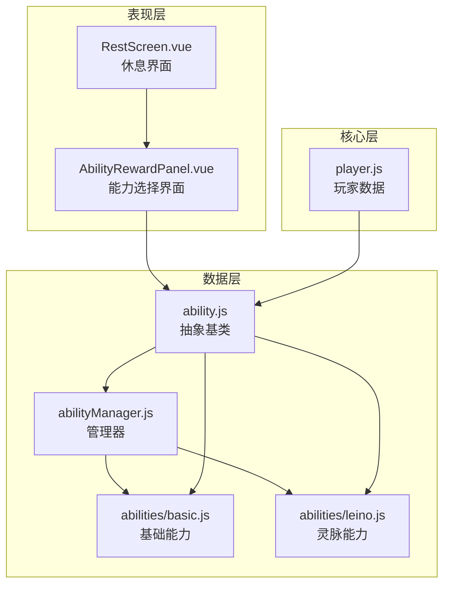
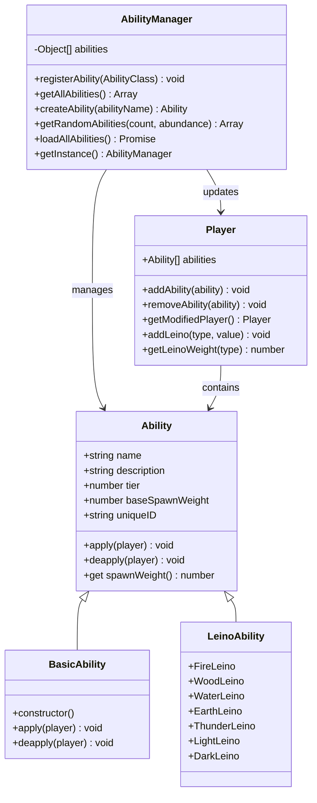
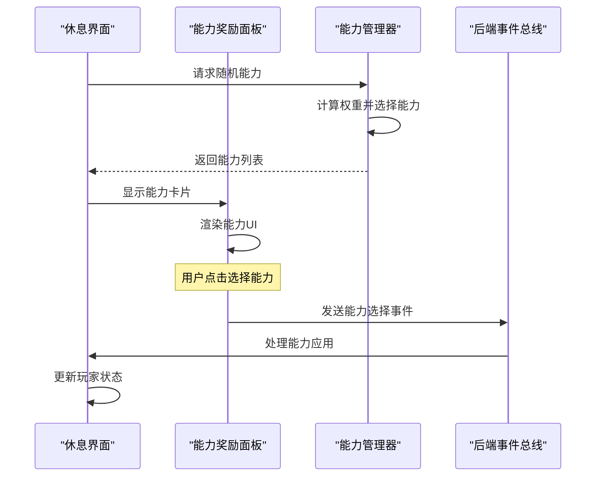
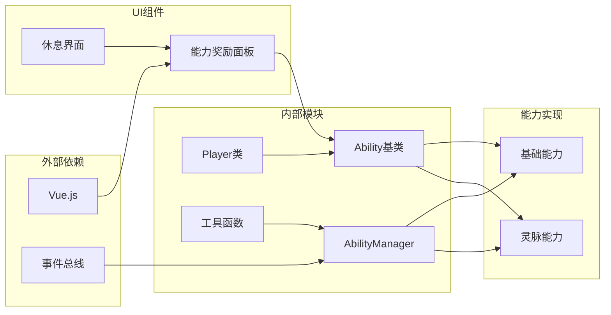

# 能力数据模型

<cite>
**本文档中引用的文件**
- [ability.js](file://src/data/ability.js)
- [abilityManager.js](file://src/data/abilityManager.js)
- [basic.js](file://src/data/abilities/basic.js)
- [leino.js](file://src/data/abilities/leino.js)
- [player.js](file://src/data/player.js)
- [AbilityRewardPanel.vue](file://src/components/rest/AbilityRewardPanel.vue)
- [RestScreen.vue](file://src/components/rest/RestScreen.vue)
</cite>

## 目录
1. [简介](#简介)
2. [项目结构](#项目结构)
3. [核心组件](#核心组件)
4. [架构概览](#架构概览)
5. [详细组件分析](#详细组件分析)
6. [依赖关系分析](#依赖关系分析)
7. [性能考虑](#性能考虑)
8. [故障排除指南](#故障排除指南)
9. [结论](#结论)

## 简介

能力系统是游戏的核心机制之一，它为玩家提供了多样化的成长路径和策略选择。该系统采用面向对象的设计模式，通过抽象基类和具体实现类的组合，实现了灵活且可扩展的能力管理框架。

能力系统的主要特点包括：
- **抽象基类设计**：Ability类作为所有能力的基础抽象
- **动态加载机制**：支持运行时动态注册和加载能力
- **权重系统**：基于等级和稀有度的生成权重计算
- **生命周期管理**：完整的应用和撤销机制
- **UI集成**：与Vue组件无缝集成的能力展示界面

## 项目结构

能力系统的文件组织遵循清晰的分层架构：



**图表来源**
- [ability.js](file://src/data/ability.js#L1-L27)
- [abilityManager.js](file://src/data/abilityManager.js#L1-L118)
- [basic.js](file://src/data/abilities/basic.js#L1-L171)
- [leino.js](file://src/data/abilities/leino.js#L1-L64)

**章节来源**
- [ability.js](file://src/data/ability.js#L1-L27)
- [abilityManager.js](file://src/data/abilityManager.js#L1-L118)

## 核心组件

### Ability抽象基类

Ability类是整个能力系统的核心抽象基类，定义了所有能力的基本属性和行为规范：

```javascript
export class Ability {
  constructor(name, description, tier, baseSpawnWeight = 1) {
    this.name = name;                    // 能力名称
    this.description = description;       // 能力描述
    this.tier = tier || 1;               // 能力等级，默认为1
    this.baseSpawnWeight = baseSpawnWeight; // 能力生成权重，默认为1
    this.uniqueID = Math.random().toString(36).substring(2, 10);
  }
  
  apply(player) { /* 子类需要实现具体逻辑 */ }
  deapply(player) { /* 子类需要实现具体逻辑 */ }
  
  get spawnWeight() {
    return this.baseSpawnWeight;
  }
}
```

### AbilityManager管理器

AbilityManager负责能力的注册、管理和随机生成：

```javascript
class AbilityManager {
  constructor() {
    this.abilities = [];
  }
  
  registerAbility(AbilityClass) {
    const ability = new AbilityClass();
    this.abilities.push({ 
      name: ability.name, 
      AbilityClass, 
      tier: ability.tier 
    });
  }
  
  getRandomAbilities(count = 3, abundance = 1.0) {
    // 基于权重的概率算法
    const weightedAbilities = allAbilities.map(ability => {
      let offset = Math.max(1, abundance * 2);
      const tierFactor = Math.pow(0.6, Math.max(ability.tier - offset, 0));
      const rarityFactor = ability.spawnWeight;
      const weight = tierFactor * rarityFactor;
      return { ...ability, weight };
    });
    // 实现复杂的权重选择算法...
  }
}
```

**章节来源**
- [ability.js](file://src/data/ability.js#L4-L27)
- [abilityManager.js](file://src/data/abilityManager.js#L3-L118)

## 架构概览

能力系统采用分层架构设计，确保了良好的可维护性和扩展性：



**图表来源**
- [ability.js](file://src/data/ability.js#L4-L27)
- [abilityManager.js](file://src/data/abilityManager.js#L3-L118)
- [player.js](file://src/data/player.js#L62-L226)
- [basic.js](file://src/data/abilities/basic.js#L4-L171)
- [leino.js](file://src/data/abilities/leino.js#L5-L64)

## 详细组件分析

### 基础能力实现

基础能力涵盖了玩家成长过程中的各种常见能力类型：

#### 生命成长类能力
```javascript
class Growth extends Ability {
  constructor() {
    super('成长', '/named{生命}上限增15。', 4, 1.0);
  }

  apply(player) {
    player.maxHp += 15;
    player.hp += 15; // 同时恢复增加的生命值
  }
}
```

#### 属性强化类能力
```javascript
class Strengthen extends Ability {
  constructor() {
    super('全面强化', '/named{防御}、/named{灵能}各增1。', 5, 0.8);
  }

  apply(player) {
    player.baseDefense += 1;
    player.baseMagic += 1;
  }
}
```

#### 修炼类能力
```javascript
class Cultivation extends Ability {
  constructor() {
    super('修炼', '/named{灵能}增1，获得1魏启上限，恢复所有/named{魏启}。', 4, 0.5);
  }

  apply(player) {
    player.baseMagic += 1;
    player.maxMana += 1;
    player.mana = player.maxMana; // 恢复所有魏启
  }
}
```

### 灵脉能力系统

灵脉能力是游戏中的特殊能力类型，具有独特的权重计算和生命周期管理：

```javascript
export class FireLeino extends Ability {
  constructor() {
    super('火灵脉', '能使用火系灵御技能，获得4层/effect{火焰抗性}', 5, 10);
    this.fireResistAddHook = null;
  }

  apply(player) {
    player.addLeino('fire');
    // 增加一个钩子，来自燃烧的伤害减4
    backendEventBus.on(EventNames.Game.PRE_BATTLE, this.fireResistAddHook = () => {
      player.addEffect('火焰抗性', 4);
    });
  }

  deapply() {
    if(this.fireResistAddHook) {
      backendEventBus.off(EventNames.Game.PRE_BATTLE, this.fireResistAddHook);
      this.fireResistAddHook = null;
    }
  }

  get spawnWeight() {
    if (!backendGameState.player.getLeinoWeight('fire') === 0) {
      let weight = super.spawnWeight;
      if(backendGameState.player.getAllLeinoWeight() <= 1) {
        weight *= 10;
      }
      return weight;
    }
    return 0;
  }
}
```

### 能力UI渲染系统

能力奖励面板是能力系统与玩家交互的主要界面：



**图表来源**
- [AbilityRewardPanel.vue](file://src/components/rest/AbilityRewardPanel.vue#L43-L105)
- [RestScreen.vue](file://src/components/rest/RestScreen.vue#L110-L145)

**章节来源**
- [basic.js](file://src/data/abilities/basic.js#L4-L171)
- [leino.js](file://src/data/abilities/leino.js#L5-L64)
- [AbilityRewardPanel.vue](file://src/components/rest/AbilityRewardPanel.vue#L1-L228)

## 依赖关系分析

能力系统的依赖关系体现了清晰的分层架构：



**图表来源**
- [ability.js](file://src/data/ability.js#L1-L3)
- [abilityManager.js](file://src/data/abilityManager.js#L1-L3)
- [player.js](file://src/data/player.js#L1-L3)

**章节来源**
- [ability.js](file://src/data/ability.js#L1-L27)
- [abilityManager.js](file://src/data/abilityManager.js#L1-L118)

## 性能考虑

能力系统在设计时充分考虑了性能优化：

### 权重计算优化
- 使用指数衰减因子减少高等级能力的生成概率
- 基于玩家状态动态调整权重
- 缓存计算结果避免重复运算

### 内存管理
- 使用单例模式管理AbilityManager实例
- 及时清理事件监听器防止内存泄漏
- uniqueID的合理生成策略

### 渲染性能
- Vue组件的key属性优化DOM更新
- 条件渲染减少不必要的UI更新
- 动画效果的合理使用

## 故障排除指南

### 常见问题及解决方案

#### 能力注册失败
**问题**：能力无法正确注册到系统中
**原因**：继承关系验证失败或构造函数异常
**解决方案**：
```javascript
// 确保正确继承Ability类
class MyAbility extends Ability {
  constructor() {
    super('能力名称', '描述', 等级, 权重);
  }
  // 实现必要的方法
}
```

#### 权重计算异常
**问题**：随机选择能力时权重分布不合理
**原因**：spawnWeight计算逻辑错误
**解决方案**：
```javascript
get spawnWeight() {
  // 确保返回有效的数值
  return Math.max(0, this.baseSpawnWeight);
}
```

#### UI渲染问题
**问题**：能力卡片显示异常
**原因**：uniqueID重复或数据绑定错误
**解决方案**：
```javascript
// 确保uniqueID的唯一性
this.uniqueID = `${this.name}_${Date.now()}`;
```

**章节来源**
- [ability.js](file://src/data/ability.js#L4-L27)
- [abilityManager.js](file://src/data/abilityManager.js#L20-L40)

## 结论

能力数据模型展现了优秀的软件工程实践，通过抽象基类、工厂模式和观察者模式的有机结合，构建了一个灵活、可扩展且易于维护的能力系统。

### 主要优势

1. **高度抽象**：Ability基类定义了统一的行为接口
2. **灵活扩展**：支持多种能力类型的自由扩展
3. **智能管理**：动态权重计算和随机选择算法
4. **良好集成**：与UI组件和游戏状态系统的无缝集成
5. **性能优化**：合理的缓存和渲染策略

### 最佳实践建议

1. **继承规范**：严格遵循Ability基类的接口规范
2. **副作用管理**：正确实现apply和deapply方法
3. **状态一致性**：确保能力应用不会破坏游戏状态平衡
4. **错误处理**：完善的异常处理和日志记录
5. **测试覆盖**：为每个能力实现单元测试

该能力系统为游戏提供了丰富的成长路径和策略深度，是游戏机制设计的优秀范例。