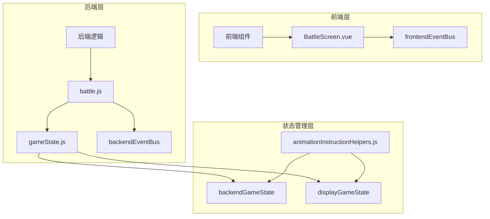
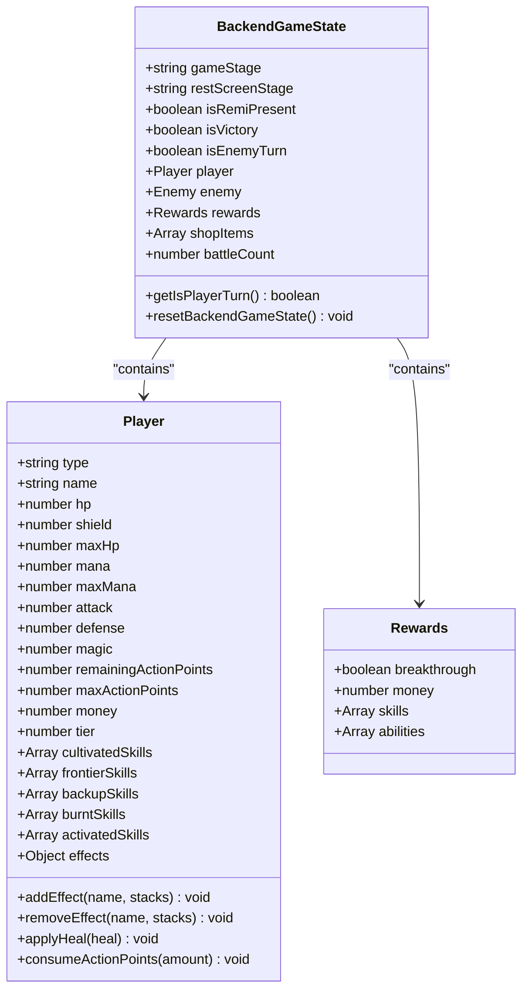
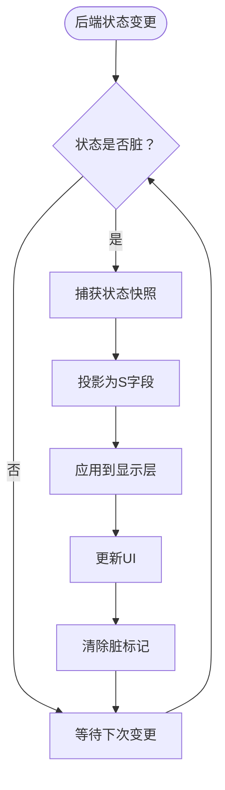
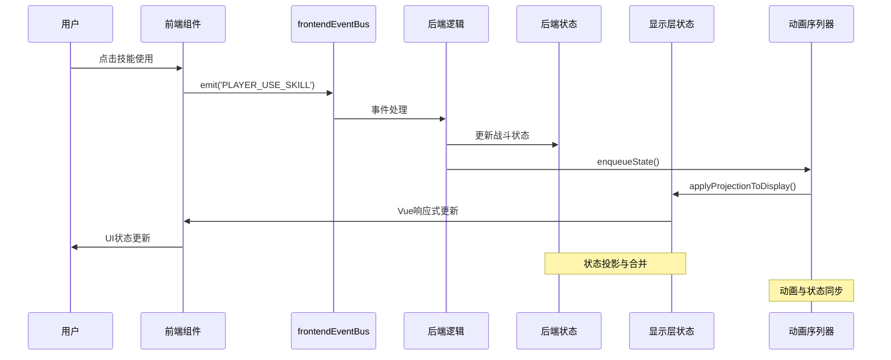
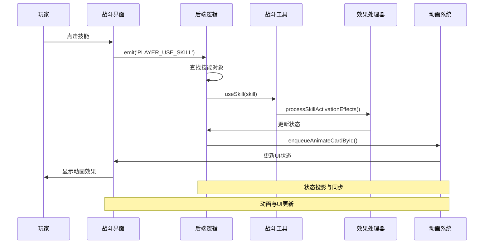

# 前后端状态分离机制

<cite>
**本文档中引用的文件**
- [gameState.js](file://src/data/gameState.js)
- [player.js](file://src/data/player.js)
- [backendEventBus.js](file://src/backendEventBus.js)
- [frontendEventBus.js](file://src/frontendEventBus.js)
- [battle.js](file://src/data/battle.js)
- [animationInstructionHelpers.js](file://src/data/animationInstructionHelpers.js)
- [effectProcessor.js](file://src/data/effectProcessor.js)
- [battleUtils.js](file://src/data/battleUtils.js)
- [battleLogUtils.js](file://src/data/battleLogUtils.js)
- [BattleScreen.vue](file://src/components/battle/BattleScreen.vue)
- [skillManager.js](file://src/data/skillManager.js)
</cite>

## 目录
1. [简介](#简介)
2. [项目结构概览](#项目结构概览)
3. [核心状态分离架构](#核心状态分离架构)
4. [状态对象结构分析](#状态对象结构分析)
5. [前后端状态同步机制](#前后端状态同步机制)
6. [状态更新触发流程](#状态更新触发流程)
7. [动画与状态同步时序](#动画与状态同步时序)
8. [状态交互示例](#状态交互示例)
9. [性能考虑](#性能考虑)
10. [故障排除指南](#故障排除指南)
11. [总结](#总结)

## 简介

本文档深入分析了RTVL游戏项目中实现的前后端状态分离机制。该机制通过将游戏状态分为"后端状态"（backendGameState）和"显示层状态"（displayGameState）两个独立但结构一致的状态对象，实现了清晰的职责分离和高效的动画同步。

这种设计模式确保了战斗逻辑的正确性和动画表现的流畅性，同时保持了系统的可维护性和扩展性。

## 项目结构概览



**图表来源**
- [gameState.js](file://src/data/gameState.js#L1-L75)
- [battle.js](file://src/data/battle.js#L1-L50)
- [animationInstructionHelpers.js](file://src/data/animationInstructionHelpers.js#L1-L50)

## 核心状态分离架构

### 状态分离原则

系统采用以下核心原则实现前后端分离：

1. **职责分离**：后端负责战斗逻辑和状态计算，前端负责动画和用户界面
2. **状态隔离**：两个状态对象独立维护，避免相互污染
3. **同步机制**：通过事件总线和动画序列器实现状态同步
4. **响应式支持**：前端状态使用Vue响应式系统，后端状态保持原始状态

### 状态对象创建

```javascript
// 工厂方法：创建一个"干净"的游戏状态对象（非响应式）
export function createGameState() {
  return {
    // 游戏阶段: 'start', 'battle', 'rest', 'end'
    gameStage: 'start',
    
    // 休整界面阶段：'money' | 'breakthrough' | 'skill' | 'ability' | 'shop' | ''
    restScreenStage: '',
    
    // 是否开启了瑞米进行游戏
    isRemiPresent: false,
    
    // 游戏结果状态
    isVictory: false,
    
    // 回合控制
    isEnemyTurn: false,
    
    get isPlayerTurn() {
      return !this.isEnemyTurn;
    },
    
    // 玩家数据
    player: reactive(new Player()),
    
    // 敌人数据（在战斗开始时赋值）
    enemy: {},
    
    // 奖励数据
    rewards: {
      breakthrough: false,
      money: 0,
      skills: [],
      abilities: []
    },
    
    // 当前商店内商品
    shopItems: [],
    
    // 战斗场次数
    battleCount: 0
  };
}
```

**章节来源**
- [gameState.js](file://src/data/gameState.js#L8-L35)

## 状态对象结构分析

### 后端状态（backendGameState）

后端状态专注于战斗逻辑和状态计算，包含以下核心属性：



**图表来源**
- [gameState.js](file://src/data/gameState.js#L8-L35)
- [player.js](file://src/data/player.js#L50-L150)

### 显示层状态（displayGameState）

显示层状态继承后端状态的所有属性，但使用Vue响应式系统包装，确保UI能够实时更新：

```javascript
// 分别创建"显示层状态"和"后端状态"，二者结构一致，但相互独立
export const backendGameState = reactive(createGameState());
export const displayGameState = reactive(createGameState());

// 重置显示层状态
export function resetDisplayGameState() {
  const fresh = createGameState();
  // 保持玩家对象响应式：用 Object.assign 同步字段
  Object.assign(displayGameState, fresh);
  Object.assign(displayGameState.player, fresh.player);
}
```

**章节来源**
- [gameState.js](file://src/data/gameState.js#L37-L45)

## 前后端状态同步机制

### 状态投影与合并

系统通过`projectToS`和`applyProjectionToDisplay`函数实现状态的投影和合并：



**图表来源**
- [animationInstructionHelpers.js](file://src/data/animationInstructionHelpers.js#L15-L80)

### 状态投影算法

```javascript
// projectToS：将 backendGameState 投影为轻量快照，仅包含 S 字段，同时保留原型链
function projectToS(value, seen = new WeakMap()) {
  if (value === null || typeof value !== 'object') return value;
  if (seen.has(value)) return seen.get(value);

  const raw = toRaw(value);

  if (Array.isArray(raw)) {
    // 维持为普通数组；若未来存在自定义 Array 子类，可按需设置原型
    const arr = new Array(raw.length);
    seen.set(value, arr);
    for (let i = 0; i < raw.length; i++) {
      arr[i] = projectToS(raw[i], seen);
    }
    return arr;
  }

  // 为对象创建与后端节点相同的原型
  const proto = Object.getPrototypeOf(raw) || Object.prototype;
  const out = Object.create(proto);
  seen.set(value, out);

  // 仅复制 S 字段，且避免向 getter-only / 不可写属性赋值
  for (const key of Object.keys(raw)) {
    if (!isSKey(key)) continue;
    const desc = Object.getOwnPropertyDescriptor(raw, key);
    // 如果后端自身就是 getter-only，也不需要写入该字段
    if (desc && typeof desc.get === 'function' && typeof desc.set !== 'function') continue;
    const v = raw[key];
    if (typeof v === 'function') continue;

    // 跳过不可写字段（考虑到原型链上可能定义为 getter-only）
    if (!isWritableProperty(out, key)) continue;

    out[key] = projectToS(v, seen);
  }
  return out;
}
```

**章节来源**
- [animationInstructionHelpers.js](file://src/data/animationInstructionHelpers.js#L15-L80)

### 状态合并算法

```javascript
// 将 S 投影快照合并到显示层，仅写入/删除 S 字段，保留实例/方法（使用快照的原型）
export function applyProjectionToDisplay(src, dst) {
  if (Array.isArray(src) && Array.isArray(dst)) {
    const done = reconcileArrayById(src, dst);
    if (done) return;

    const len = src.length;
    for (let i = 0; i < len; i++) {
      const sEl = src[i];
      const dEl = dst[i];
      if (sEl && typeof sEl === 'object') {
        if (dEl && typeof dEl === 'object') {
          applyProjectionToDisplay(sEl, dEl);
        } else {
          const inst = createInstanceFromSnapshotNode(sEl);
          applyProjectionToDisplay(sEl, inst);
          dst[i] = inst;
        }
      } else {
        dst[i] = sEl;
      }
    }
    if (dst.length > len) dst.splice(len);
    return;
  }

  // 删除 dst 中 S 字段但 src 不再包含的键
  for (const key of Object.keys(dst)) {
    if (!isSKey(key)) continue;
    const desc = Object.getOwnPropertyDescriptor(dst, key);
    if (desc && typeof desc.get === 'function' && typeof desc.set !== 'function') continue;
    if (typeof dst[key] === 'function') continue;
    if (!Object.prototype.hasOwnProperty.call(src, key)) {
      try { delete dst[key]; } catch (_) {}
    }
  }

  // 将 src 的键写入到 dst
  for (const key of Object.keys(src)) {
    if (!isWritableProperty(dst, key)) continue;
    const sVal = src[key];
    const dVal = dst[key];

    if (Array.isArray(sVal)) {
      if (Array.isArray(dVal)) {
        applyProjectionToDisplay(sVal, dVal);
      } else {
        const arr = new Array(0);
        dst[key] = arr;
        applyProjectionToDisplay(sVal, arr);
      }
      continue;
    }

    if (sVal && typeof sVal === 'object') {
      const sProto = Object.getPrototypeOf(toRaw(sVal));
      if (dVal && typeof dVal === 'object' && !Array.isArray(dVal)) {
        try {
          const dstProto = Object.getPrototypeOf(dVal);
          if (sProto && dstProto !== sProto) {
            Object.setPrototypeOf(dVal, sProto);
          }
        } catch (_) {}
        applyProjectionToDisplay(sVal, dVal);
      } else {
        let obj = Object.create(sProto || Object.prototype);
        applyProjectionToDisplay(sVal, obj);
        dst[key] = obj;
      }
      continue;
    }

    if (dst[key] !== sVal) dst[key] = sVal;
  }
}
```

**章节来源**
- [animationInstructionHelpers.js](file://src/data/animationInstructionHelpers.js#L82-L180)

## 状态更新触发流程

### 用户输入到状态更新的完整流程



**图表来源**
- [battle.js](file://src/data/battle.js#L400-L450)
- [animationInstructionHelpers.js](file://src/data/animationInstructionHelpers.js#L200-L250)

### 事件总线架构

系统使用两个独立的事件总线实现前后端通信：

```javascript
// 后端事件总线 - 负责战斗逻辑和状态更新
export const EventNames = {
  Game: {
    PRE_GAME_START: 'pre-game-start',
    GAME_START: 'game-start',
    ENTER_BATTLE_STAGE: 'enter-battle-stage',
    ENTER_REST_STAGE: 'enter-rest-stage',
    PRE_BATTLE: 'pre-battle',
    POST_BATTLE: 'post-battle',
    GAME_OVER: 'game-over',
  },
  Player: {
    TIER_UPGRADED: 'player-tier-upgraded',
    ABILITY_CLAIMED: 'player-ability-claimed',
    MONEY_CLAIMED: 'player-money-claimed',
    SKILL_REWARD_CLAIMED: 'player-skill-claimed',
    FRONTIER_UPDATED: 'player-frontier-skills-updated',
    ACTIVATED_SKILLS_UPDATED: 'player-activated-skills-updated',
    EFFECT_CHANGED: 'player-effect-changed',
    SKILL_BURNT: 'player-skill-burnt',
    SKILL_DISCOVERED: 'player-skill-discovered',
    SKILL_USED: 'player-skill-used',
    SKILL_DROPPED: 'player-skill-dropped',
    SKILL_DRAWN: 'player-skill-drawn'
  },
  PlayerOperations: {
    PLAYER_USE_SKILL: 'battle-player-use-skill',
    PLAYER_SHIFT_SKILL: 'battle-player-shift-skill',
    PLAYER_END_TURN: 'player-end-turn',
    PLAYER_STOP_ACTIVATED_SKILL: 'battle-player-stop-activated-skill',
    CLAIM_MONEY: 'rest-claim-money',
    CLAIM_SKILL: 'rest-claim-skill',
    CLAIM_ABILITY: 'rest-claim-ability',
    CLAIM_BREAKTHROUGH: 'rest-claim-breakthrough',
    REORDER_SKILLS: 'rest-reorder-skills',
    PURCHASE_ITEM: 'rest-purchase-item',
    FINISH: 'rest-finish',
    DROP_REWARD: 'rest-drop-reward'
  }
};

// 前端事件总线 - 负责动画和UI控制
export default frontendEventBus;
```

**章节来源**
- [backendEventBus.js](file://src/backendEventBus.js#L1-L80)
- [frontendEventBus.js](file://src/frontendEventBus.js#L1-L9)

## 动画与状态同步时序

### 状态同步时序图

```mermaid
gantt
title 状态同步时序
dateFormat X
axisFormat %s
section 后端逻辑
状态变更检测 :active, backend1, 0, 100
快照捕获 :active, backend2, 100, 200
状态投影 :active, backend3, 200, 300
section 动画序列器
状态同步指令 :active, anim1, 300, 400
动画执行 :active, anim2, 400, 600
section 前端渲染
显示层更新 :active, front1, 400, 500
UI重新渲染 :active, front2, 500, 600
```



**图表来源**
- [animationInstructionHelpers.js](file://src/data/animationInstructionHelpers.js#L200-L250)

### 自动状态同步机制

```javascript
// 内部：监听 backendGameState 变化，标记为脏
// 如果backendGameState为脏，则在任何enqueueInstruction调用前，自动插入一次enqueueState，并清除脏标记
let backendStateDirty = false;
let endOfTickStateSycnScheduled = false;
function scheduleEndOfTickCheck() {
  if (endOfTickStateSycnScheduled) return;
  endOfTickStateSycnScheduled = true;
  setTimeout(() => {
    endOfTickStateSycnScheduled = false;
    if (backendStateDirty) {
      // tick 结束仍有未同步的变更，强制入队一次当前快照（默认带屏障）
      enqueueState();
    }
  }, 0);
}

export function registerBackendStateWatcher() {
  watch(backendGameState, () => {
    backendStateDirty = true;
    scheduleEndOfTickCheck();
  }, {deep: true, flush: "sync"});
}
```

**章节来源**
- [animationInstructionHelpers.js](file://src/data/animationInstructionHelpers.js#L200-L220)

## 状态交互示例

### 技能使用流程

以下是一个典型的技能使用流程，展示了前后端状态分离的实际应用：



**图表来源**
- [battle.js](file://src/data/battle.js#L400-L450)
- [battleUtils.js](file://src/data/battleUtils.js#L50-L100)

### 效果处理示例

```javascript
// 处理回合开始时触发的效果
export function processStartOfTurnEffects(target) {
  // 摧毁护盾
  if(target.effects['警戒'] > 0) {
    target.addEffect('警戒', -1);
  } else {
    target.shield = 0;
  }

  // 处理燃烧效果
  if (target.effects['燃烧'] > 0) {
    let damage = target.effects['燃烧'];
    damage -= target.effects['火焰抗性'] || 0;
    target.addEffect('燃烧', -1);
    if(damage > 0) {
      addEffectLog(`${target.name}被烧伤了，受到${damage}伤害！`);
      dealDamage(null, target, damage);
      enqueueDelay(400);
    }
  }
  
  // 处理眩晕效果
  if (target.effects['眩晕'] > 0) {
    target.addEffect('眩晕', -1);
    addEffectLog(`${target.name}处于眩晕状态，跳过回合！`);
    enqueueDelay(400);
    return true; // 返回true表示需要跳过回合
  }

  return false; // 返回false表示不需要跳过回合
}
```

**章节来源**
- [effectProcessor.js](file://src/data/effectProcessor.js#L10-L80)

## 性能考虑

### 状态同步优化

1. **增量同步**：只同步发生变化的S字段，减少不必要的UI更新
2. **批量处理**：通过动画序列器批量处理状态更新和动画
3. **防抖机制**：使用setTimeout实现状态同步的防抖，避免频繁更新
4. **内存管理**：使用WeakMap避免循环引用和内存泄漏

### 动画与状态同步的性能平衡

```javascript
// 默认的状态同步"虚拟动画"时长
export const DEFAULT_STATE_CHANGE_DURATION = 200;

// 对外暴露：将一次状态同步作为指令推入 sequencer
export function enqueueState({ snapshot, durationMs, waitTags } = {}) {
  const snap = snapshot || captureSnapshot();
  const dur = typeof durationMs === 'number' ? durationMs : DEFAULT_STATE_CHANGE_DURATION;
  return animationSequencer.enqueueInstruction({
    tags: ['state'],
    waitTags: waitTags || ['all'],
    durationMs: dur,
    start: () => {
      try {
        applyProjectionToDisplay(snap, displayGameState);
      } catch (err) {
        console.error('[animationInstructionHelpers] applyProjectionToDisplay failed:', err);
      }
    }
  });
}
```

**章节来源**
- [animationInstructionHelpers.js](file://src/data/animationInstructionHelpers.js#L180-L200)

## 故障排除指南

### 常见问题及解决方案

1. **状态不同步**
   - 检查`backendStateDirty`标志是否正确设置
   - 验证`registerBackendStateWatcher`是否正常工作
   - 确认`applyProjectionToDisplay`函数的参数类型

2. **动画延迟**
   - 检查动画序列器的执行顺序
   - 验证`waitTags`配置是否正确
   - 确认状态同步指令的优先级

3. **性能问题**
   - 监控状态更新频率
   - 检查是否有不必要的深度监听
   - 优化大型状态对象的投影过程

### 调试技巧

```javascript
// 调试状态投影过程
function debugProjection(src, dst) {
  console.log('源状态:', JSON.stringify(src, null, 2));
  console.log('目标状态:', JSON.stringify(dst, null, 2));
  const snapshot = projectToS(src);
  console.log('投影结果:', JSON.stringify(snapshot, null, 2));
  applyProjectionToDisplay(snapshot, dst);
  console.log('合并后状态:', JSON.stringify(dst, null, 2));
}
```

**章节来源**
- [animationInstructionHelpers.js](file://src/data/animationInstructionHelpers.js#L15-L80)

## 总结

RTVL游戏项目的前后端状态分离机制通过精心设计的架构实现了以下目标：

1. **清晰的职责分离**：后端专注于战斗逻辑，前端专注于动画和UI
2. **高效的同步机制**：通过投影和合并算法实现状态的高效同步
3. **良好的性能表现**：增量同步和批量处理确保了系统的流畅运行
4. **强大的扩展性**：模块化的架构便于添加新的功能和特性

这种设计模式不仅提高了代码的可维护性，还为复杂的战斗系统提供了坚实的技术基础。通过合理的事件总线设计和动画序列器，系统能够处理复杂的战斗流程，同时保持用户界面的响应性和流畅性。