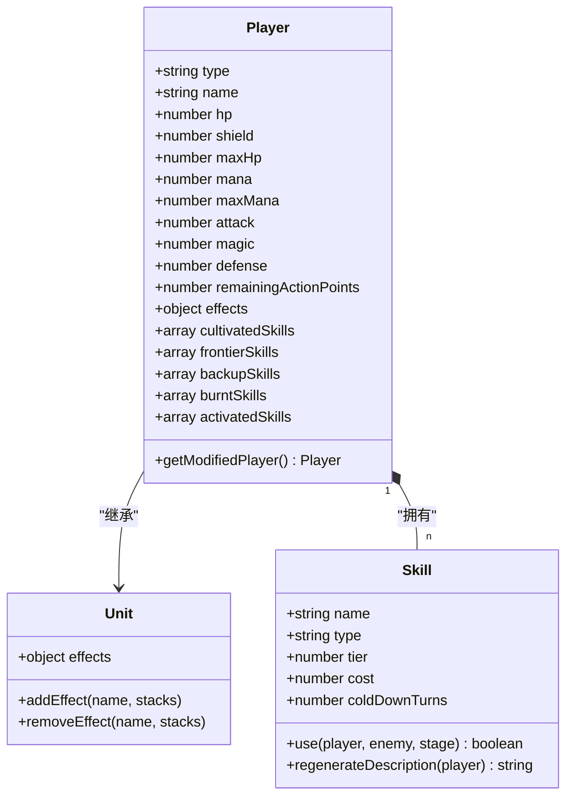
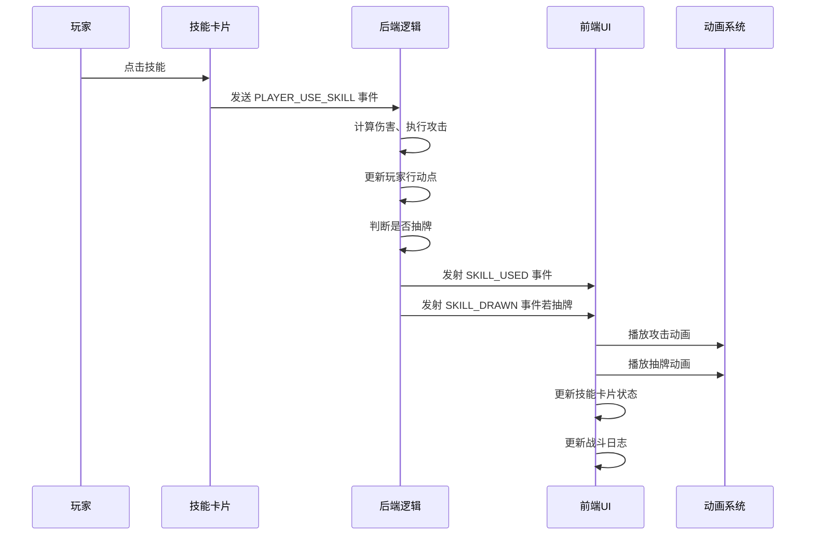
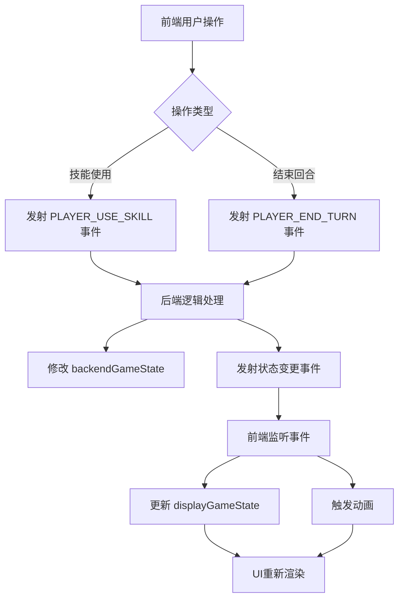

# 前后端状态划分边界

<cite>
**本文档引用的文件**  
- [gameState.js](file://src/data/gameState.js)
- [player.js](file://src/data/player.js)
- [skillManager.js](file://src/data/skillManager.js)
- [battleUtils.js](file://src/data/battleUtils.js)
- [effectProcessor.js](file://src/data/effectProcessor.js)
- [backendEventBus.js](file://src/backendEventBus.js)
- [frontendEventBus.js](file://src/frontendEventBus.js)
- [BattleScreen.vue](file://src/components/battle/BattleScreen.vue)
- [SkillCard.vue](file://src/components/global/SkillCard.vue)
- [agilePunch.js](file://src/data/skills/martial_arts/agilePunch.js)
</cite>

## 目录
1. [引言](#引言)
2. [项目结构分析](#项目结构分析)
3. [核心状态对象设计](#核心状态对象设计)
4. [前端状态与后端状态的划分原则](#前端状态与后端状态的划分原则)
5. [前后端状态分离的架构实现](#前后端状态分离的架构实现)
6. [技能生效时的状态责任划分](#技能生效时的状态责任划分)
7. [状态同步机制与事件通信](#状态同步机制与事件通信)
8. [分离架构的优势分析](#分离架构的优势分析)
9. [结论](#结论)

## 引言

在本项目中，游戏状态管理采用了前后端分离的设计模式，以确保逻辑清晰、职责分明。这种设计不仅提升了系统的可维护性，还有效避免了状态同步混乱的问题。本文将深入分析 `gameState.js` 文件中的状态划分方式，详细说明哪些数据属于前端状态（如UI显示、动画控制），哪些属于后端状态（如战斗逻辑、技能效果、角色属性变化），并通过代码示例展示状态对象的结构设计及其背后的架构考量。

## 项目结构分析

项目的源码目录结构清晰地反映了功能模块的划分。核心数据逻辑位于 `src/data/` 目录下，包括玩家、敌人、技能、战斗逻辑等；UI组件则分布在 `src/components/` 下，按功能区域组织（如 battle、global 等）。这种物理上的分离为前后端状态的逻辑分离提供了良好的基础。

关键文件分布如下：
- 状态管理：`gameState.js`
- 玩家模型：`player.js`
- 技能系统：`skillManager.js`, `skill.js`
- 战斗逻辑：`battleUtils.js`, `effectProcessor.js`
- 事件通信：`backendEventBus.js`, `frontendEventBus.js`
- UI组件：`BattleScreen.vue`, `SkillCard.vue`

**Section sources**
- [gameState.js](file://src/data/gameState.js)
- [player.js](file://src/data/player.js)
- [skillManager.js](file://src/data/skillManager.js)

## 核心状态对象设计

### 状态对象结构

`gameState.js` 中通过 `createGameState()` 工厂函数定义了一个“干净”的游戏状态对象，其结构如下：

```js
{
  gameStage: 'start', // 游戏阶段
  restScreenStage: '', // 休整界面阶段
  isRemiPresent: false, // 是否开启瑞米
  isVictory: false, // 游戏结果
  isEnemyTurn: false, // 回合控制
  player: reactive(new Player()), // 玩家数据
  enemy: {}, // 敌人数据
  rewards: { ... }, // 奖励数据
  shopItems: [], // 商店商品
  battleCount: 0 // 战斗场次数
}
```

该状态对象被用于创建两个独立的响应式实例：

- `backendGameState`：后端状态，承载所有战斗逻辑和规则计算。
- `displayGameState`：前端状态，仅用于UI渲染和动画展示。

两者通过 `resetDisplayGameState()` 和 `resetBackendGameState()` 分别重置，确保生命周期独立。

### 玩家状态结构

`Player` 类继承自 `Unit`，封装了所有与角色相关的属性和行为：

- **基础属性**：`hp`, `shield`, `maxHp`, `mana`, `maxMana`
- **战斗属性**：`attack`, `magic`, `defense`, `remainingActionPoints`
- **技能系统**：`skills`, `frontierSkills`, `backupSkills`, `burntSkills`, `activatedSkills`
- **效果系统**：`effects`（如“燃烧”、“集中”等）
- **养成系统**：`tier`, `money`, `cultivatedSkills`, `abilities`

这些属性中，部分直接参与战斗计算（后端状态），部分仅用于UI展示（前端状态）。

**Section sources**
- [gameState.js](file://src/data/gameState.js#L10-L74)
- [player.js](file://src/data/player.js#L50-L199)

## 前端状态与后端状态的划分原则

### 前端状态（Display State）

前端状态主要负责UI的可视化呈现和用户交互反馈，不参与任何战斗逻辑计算。其典型特征包括：

- **UI显示控制**：如 `restScreenStage` 控制休整界面显示哪个面板。
- **动画触发标记**：虽然动画指令由后端生成，但前端状态可能包含临时标记来驱动动画播放。
- **视觉反馈状态**：如技能卡片的悬停状态、禁用状态等。

例如，在 `SkillCard.vue` 组件中，`hovered` 是典型的前端状态，仅用于控制视觉样式和事件发射：

```vue
<div :class="['skill-card', { disabled: disabled, 'chant-mode': isChant }]" @mouseenter="onMouseEnter">
```

`onMouseEnter` 会通过 `frontendEventBus` 发射事件，通知其他组件进行视觉反馈。

### 后端状态（Backend State）

后端状态承载所有游戏规则和战斗逻辑，是唯一可信的“真相源”。其典型特征包括：

- **战斗逻辑数据**：`player.hp`, `enemy.shield`, `isEnemyTurn` 等直接影响战斗结果的数据。
- **技能效果计算**：技能的伤害、冷却、抽牌等逻辑均在后端状态上执行。
- **属性修正系统**：通过 `modifiers` 管线动态调整玩家属性。
- **效果堆叠管理**：`effects` 字典中的每一层都影响战斗行为。

例如，在 `AgilePunch` 技能中，`damage` 和 `coldDownTurns` 的计算完全基于后端状态：

```js
get damage() {
  return Math.max(this.baseDamage + this.powerMultiplier * this.power, 4);
}
```

此计算依赖于 `power` 属性，而 `power` 的变化由战斗逻辑决定。

**Section sources**
- [gameState.js](file://src/data/gameState.js#L10-L74)
- [player.js](file://src/data/player.js#L50-L199)
- [agilePunch.js](file://src/data/skills/martial_arts/agilePunch.js#L10-L30)

## 前后端状态分离的架构实现

### 双状态实例化

`gameState.js` 的核心设计是创建两个独立的响应式状态实例：

```js
export const backendGameState = reactive(createGameState());
export const displayGameState = reactive(createGameState());
```

这一设计确保了：
- 所有战斗逻辑只修改 `backendGameState`。
- UI组件绑定 `displayGameState` 进行渲染。
- 避免了UI更新直接污染核心状态。

### 状态同步机制

尽管状态分离，但二者必须保持一致。同步不是通过直接复制，而是通过**事件驱动**的方式完成：

1. 后端逻辑修改 `backendGameState`。
2. 通过 `backendEventBus` 广播状态变更事件。
3. 前端监听事件，更新 `displayGameState` 或触发动画。

例如，当玩家抽卡时：

```js
export function drawSkillCard(player, number = 1) {
  // ... 修改后端状态
  backendEventBus.emit(EventNames.Player.SKILL_DRAWN, { skillID: firstSkill.uniqueID });
}
```

`BattleScreen.vue` 监听此事件并更新UI：

```js
frontendEventBus.on('add-battle-log', this.onAddBattleLog);
```

### 代理与修饰器模式

`Player` 类使用 `Proxy` 实现属性修饰器系统，允许在不修改原始对象的情况下动态调整属性值：

```js
getModifiedPlayer() {
  let current = this;
  for (const mod of this.modifiers) {
    const next = mod(current);
    if (next) current = next;
  }
  return current;
}
```

此模式属于后端逻辑，因为它影响战斗计算结果，而非UI展示。



**Diagram sources**
- [player.js](file://src/data/player.js#L50-L199)
- [unit.js](file://src/data/unit.js#L1-L50)
- [skill.js](file://src/data/skill.js#L1-L30)

**Section sources**
- [gameState.js](file://src/data/gameState.js#L1-L74)
- [player.js](file://src/data/player.js#L50-L199)
- [skillManager.js](file://src/data/skillManager.js#L1-L50)

## 技能生效时的状态责任划分

以 `AgilePunch` 技能为例，分析其生效过程中前后端状态的责任划分。

### 后端状态责任

1. **技能使用判定**：检查行动点是否足够，技能是否可使用。
2. **伤害计算**：根据 `power` 和 `powerMultiplier` 计算实际伤害。
3. **攻击结算**：调用 `launchAttack()` 执行攻击，处理护盾、防御减免。
4. **效果触发**：判断是否造成伤害，决定是否抽牌。
5. **状态更新**：修改 `player.remainingActionPoints`，更新技能冷却。

```js
use(player, enemy, stage) {
  if (stage % 2 === 0) {
    const result = launchAttack(player, enemy, this.damage);
    this.shouldDrawCard_ = result.passThoughDamage > 0;
    return false;
  } else {
    if(this.shouldDrawCard_) drawSkillCard(player, this.drawCardCount);
    return false;
  }
}
```

所有这些操作都在 `backendGameState` 上进行，确保逻辑一致性。

### 前端状态责任

1. **UI反馈**：技能卡片变灰（`disabled` 状态）。
2. **动画播放**：接收 `SKILL_USED` 事件后，播放技能发动动画。
3. **日志显示**：通过 `add-battle-log` 事件更新战斗日志。
4. **手牌更新**：当 `SKILL_DRAWN` 事件触发时，将新技能加入手牌UI。
5. **生命值/护盾条更新**：监听状态变化，平滑更新进度条。

```vue
<SkillCard :skill="skill" :disabled="!canUse" @skill-card-clicked="onSkillClick" />
```

`disabled` 属性由前端根据后端状态计算得出，但本身不参与逻辑。



**Diagram sources**
- [agilePunch.js](file://src/data/skills/martial_arts/agilePunch.js#L1-L50)
- [battleUtils.js](file://src/data/battleUtils.js#L1-L50)
- [backendEventBus.js](file://src/backendEventBus.js#L1-L20)
- [SkillCard.vue](file://src/components/global/SkillCard.vue#L1-L50)

**Section sources**
- [agilePunch.js](file://src/data/skills/martial_arts/agilePunch.js#L1-L90)
- [battleUtils.js](file://src/data/battleUtils.js#L1-L200)
- [SkillCard.vue](file://src/components/global/SkillCard.vue#L1-L200)

## 状态同步机制与事件通信

### 事件总线设计

项目采用双事件总线架构：

- `backendEventBus`：用于后端逻辑之间以及后端向前端广播状态变更。
- `frontendEventBus`：用于前端组件之间传递UI事件（如悬停、点击动画）。

这种分离确保了：
- 后端不依赖前端实现。
- 前端可以灵活调整UI而不影响核心逻辑。

### 典型事件流

1. **玩家使用技能**
   - 前端：`SkillCard` 发射 `PLAYER_USE_SKILL` 到 `backendEventBus`
   - 后端：`GameApp` 监听并执行技能逻辑
   - 后端：修改 `backendGameState`，发射 `SKILL_USED`, `SKILL_DRAWN` 等事件
   - 前端：`BattleScreen` 监听事件，更新 `displayGameState` 或触发动画

2. **回合结束**
   - 前端：点击“结束回合”按钮
   - 前端：发射 `PLAYER_END_TURN` 到 `backendEventBus`
   - 后端：切换 `isEnemyTurn`，执行敌人行动
   - 后端：发射 `ENEMY_TURN_START` 等事件
   - 前端：更新UI，播放敌人行动动画



**Diagram sources**
- [backendEventBus.js](file://src/backendEventBus.js#L1-L80)
- [frontendEventBus.js](file://src/frontendEventBus.js#L1-L9)
- [battleUtils.js](file://src/data/battleUtils.js#L1-L50)

**Section sources**
- [backendEventBus.js](file://src/backendEventBus.js#L1-L80)
- [frontendEventBus.js](file://src/frontendEventBus.js#L1-L9)

## 分离架构的优势分析

### 提升可维护性

- **逻辑隔离**：战斗规则与UI逻辑完全解耦，修改UI不会意外破坏战斗逻辑。
- **易于测试**：后端状态和逻辑可以在无UI环境下进行单元测试。
- **代码清晰**：开发者能快速定位问题属于UI层还是逻辑层。

### 减少耦合

- **依赖单向**：前端依赖后端状态，但后端不依赖前端。
- **接口明确**：通过事件总线通信，而非直接调用方法，降低模块间耦合度。
- **可替换性强**：可以轻松替换UI框架（如从Vue迁移到React）而不影响核心逻辑。

### 避免状态同步混乱

- **单一数据源**：`backendGameState` 是唯一可信源，避免多处修改导致状态不一致。
- **异步安全**：即使UI渲染延迟，核心逻辑仍能正确执行。
- **调试友好**：可通过日志或快照对比 `backendGameState` 和 `displayGameState` 来诊断同步问题。

### 支持复杂动画与预测

- **动画独立**：前端可以播放复杂的动画序列，而不阻塞后端逻辑。
- **状态预测**：在动画播放期间，前端可展示预测状态，提升响应感。
- **错误恢复**：若动画失败，可基于后端状态重新同步UI。

**Section sources**
- [gameState.js](file://src/data/gameState.js#L1-L74)
- [backendEventBus.js](file://src/backendEventBus.js#L1-L80)

## 结论

本项目通过在 `gameState.js` 中创建独立的 `backendGameState` 和 `displayGameState`，实现了前后端状态的清晰划分。后端状态承载所有战斗逻辑和规则计算，是系统的“真相源”；前端状态仅用于UI渲染和动画控制。二者通过事件总线进行通信，确保了逻辑解耦和状态一致性。

这种架构设计显著提升了系统的可维护性，减少了模块间的耦合，并有效避免了状态同步混乱的问题。在技能生效等复杂场景下，前后端各司其职，后端负责精确的逻辑计算，前端负责流畅的用户体验，共同构建了一个健壮且可扩展的游戏系统。