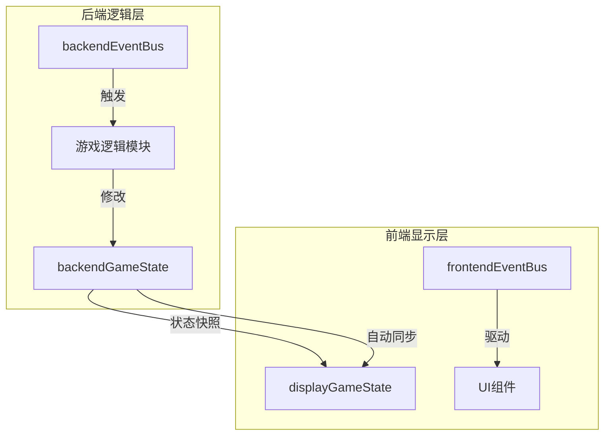
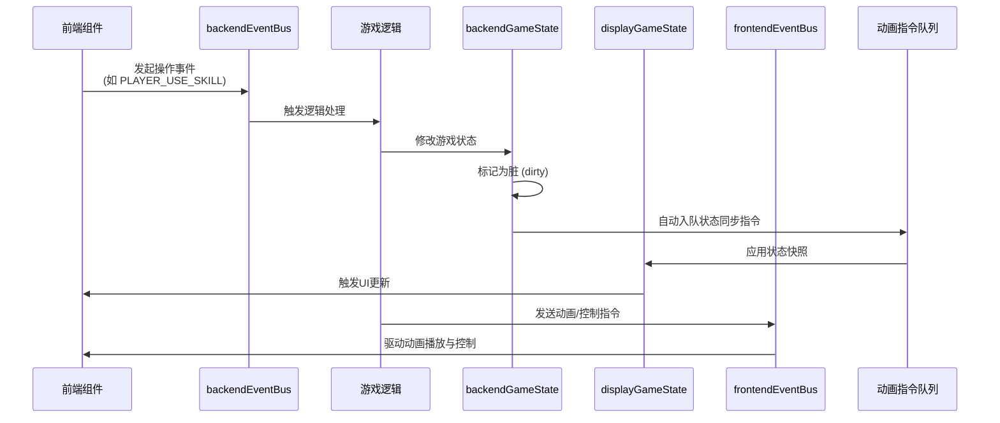
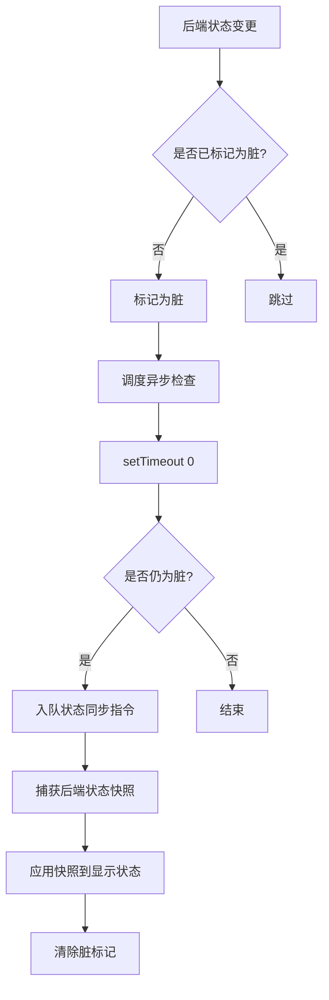
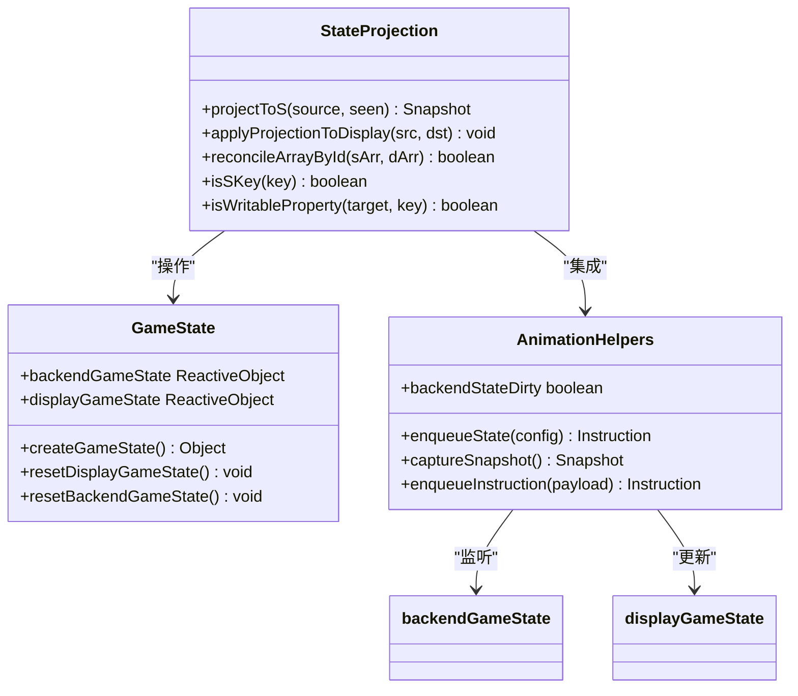
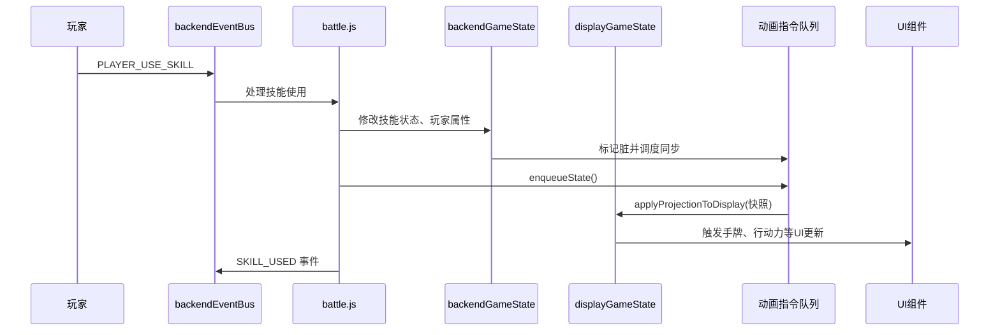
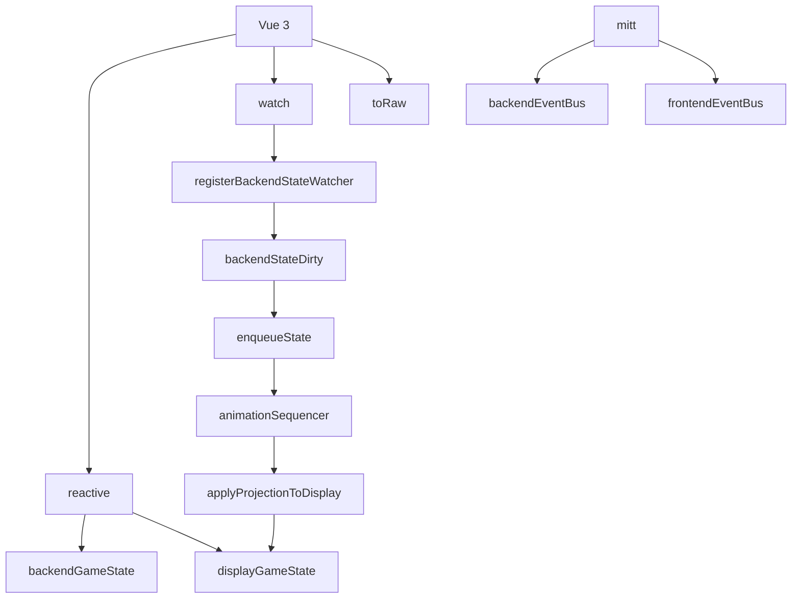

# 状态数据同步机制

<cite>
**本文档引用文件**  
- [gameState.js](file://src/data/gameState.js)
- [backendEventBus.js](file://src/backendEventBus.js)
- [frontendEventBus.js](file://src/frontendEventBus.js)
- [game.js](file://src/game.js)
- [battle.js](file://src/data/battle.js)
- [rest.js](file://src/data/rest.js)
- [animationInstructionHelpers.js](file://src/data/animationInstructionHelpers.js)
- [battleUtils.js](file://src/data/battleUtils.js)
</cite>

## 目录
1. [引言](#引言)
2. [项目结构](#项目结构)
3. [核心组件](#核心组件)
4. [架构概述](#架构概述)
5. [详细组件分析](#详细组件分析)
6. [依赖分析](#依赖分析)
7. [性能考虑](#性能考虑)
8. [故障排除指南](#故障排除指南)
9. [结论](#结论)

## 引言
本文档详细描述了游戏前后端状态之间的数据同步策略。系统采用前后端分离的状态管理架构，通过事件总线驱动状态变更与UI更新。后端状态（backendGameState）负责核心逻辑计算与游戏规则执行，前端显示状态（displayGameState）则用于驱动UI组件渲染。两者通过状态快照机制保持一致性，确保玩家在战斗回合切换、技能执行等关键节点获得准确的视觉反馈。

## 项目结构
项目采用典型的Vue.js前端架构，核心状态管理与事件系统位于`src/data`和`src/`根目录下。状态同步机制贯穿于游戏流程控制、战斗逻辑和休整阶段，通过事件驱动的方式协调前后端状态更新。

**图示来源**  
- [gameState.js](file://src/data/gameState.js#L51-L73)
- [backendEventBus.js](file://src/backendEventBus.js#L1-L80)
- [frontendEventBus.js](file://src/frontendEventBus.js#L1-L9)

**本节来源**  
- [gameState.js](file://src/data/gameState.js#L1-L75)
- [backendEventBus.js](file://src/backendEventBus.js#L1-L80)

## 核心组件
系统的核心组件包括两个独立但结构一致的游戏状态对象（backendGameState 和 displayGameState）、一个用于后端逻辑通信的事件总线（backendEventBus）以及一个用于前端UI协调的事件总线（frontendEventBus）。状态同步由后端状态变更驱动，通过捕获状态快照并应用到显示层来实现。

**本节来源**  
- [gameState.js](file://src/data/gameState.js#L51-L73)
- [backendEventBus.js](file://src/backendEventBus.js#L1-L80)
- [frontendEventBus.js](file://src/frontendEventBus.js#L1-L9)

## 架构概述
系统采用事件驱动的前后端分离架构。后端事件总线（backendEventBus）是游戏逻辑的核心驱动器，所有游戏状态变更（如技能使用、回合切换、奖励领取）都通过该总线发布。当后端状态（backendGameState）发生变化时，系统会自动将变更同步到前端显示状态（displayGameState），从而触发UI组件的响应式更新。

**图示来源**  
- [backendEventBus.js](file://src/backendEventBus.js#L1-L80)
- [gameState.js](file://src/data/gameState.js#L51-L73)
- [animationInstructionHelpers.js](file://src/data/animationInstructionHelpers.js#L218-L261)

## 详细组件分析

### 状态同步机制分析
系统通过`animationInstructionHelpers.js`中的`registerBackendStateWatcher`函数监听后端状态的变化。一旦检测到变更，系统会将状态标记为“脏”，并在下一个事件循环中自动插入一次状态同步操作，确保UI最终与逻辑状态保持一致。

#### 状态同步流程

**图示来源**  
- [animationInstructionHelpers.js](file://src/data/animationInstructionHelpers.js#L230-L261)

#### 状态快照与投影机制
系统使用`projectToS`和`applyProjectionToDisplay`函数实现高效的状态同步。`projectToS`函数创建一个轻量级的后端状态快照，仅包含需要同步的字段（以'S'命名规则标识），而`applyProjectionToDisplay`则将此快照安全地合并到显示状态对象中，保留其响应式特性和方法。

**图示来源**  
- [animationInstructionHelpers.js](file://src/data/animationInstructionHelpers.js#L30-L222)
- [gameState.js](file://src/data/gameState.js#L1-L75)

**本节来源**  
- [animationInstructionHelpers.js](file://src/data/animationInstructionHelpers.js#L1-L525)
- [gameState.js](file://src/data/gameState.js#L1-L75)

### 战斗逻辑中的状态同步
在战斗流程中，状态同步的时机与条件至关重要。例如，在玩家使用技能后，系统会先在后端完成所有结算逻辑（伤害计算、效果处理等），然后通过`enqueueState`指令将最终状态同步到前端，确保UI反映的是完整结算后的结果。

#### 战斗回合状态同步

**图示来源**  
- [battle.js](file://src/data/battle.js#L1-L199)
- [battleUtils.js](file://src/data/battleUtils.js#L0-L364)
- [animationInstructionHelpers.js](file://src/data/animationInstructionHelpers.js#L218-L222)

**本节来源**  
- [battle.js](file://src/data/battle.js#L1-L553)
- [battleUtils.js](file://src/data/battleUtils.js#L1-L365)

### 休整阶段状态同步
在休整阶段，当玩家领取奖励时，后端逻辑会修改`backendGameState`中的玩家数据（如金钱、技能），随后这些变更会自动同步到`displayGameState`，驱动UI面板更新。

**本节来源**  
- [rest.js](file://src/data/rest.js#L1-L215)

## 依赖分析
系统依赖于Vue的响应式系统（`reactive`, `watch`）来检测状态变化，并依赖`mitt`库实现事件总线功能。状态同步机制深度依赖于`animationInstructionHelpers`模块，该模块不仅处理状态同步，还管理动画指令队列，确保状态更新与UI动画的协调。

**图示来源**  
- [gameState.js](file://src/data/gameState.js#L1-L75)
- [backendEventBus.js](file://src/backendEventBus.js#L1-L80)
- [frontendEventBus.js](file://src/frontendEventBus.js#L1-L9)
- [animationInstructionHelpers.js](file://src/data/animationInstructionHelpers.js#L1-L525)

**本节来源**  
- [gameState.js](file://src/data/gameState.js#L1-L75)
- [backendEventBus.js](file://src/backendEventBus.js#L1-L80)
- [frontendEventBus.js](file://src/frontendEventBus.js#L1-L9)
- [animationInstructionHelpers.js](file://src/data/animationInstructionHelpers.js#L1-L525)

## 性能考虑
状态同步机制设计时考虑了性能优化。通过`projectToS`函数创建轻量级快照，避免了深拷贝整个状态树的开销。同时，使用`setTimeout(0)`进行异步批处理，将同一事件循环中的多次状态变更合并为一次同步操作，有效减少了UI更新的频率。

## 故障排除指南
潜在的数据不一致风险主要源于事件丢失或顺序错乱。系统通过以下机制应对：
1. **状态快照机制**：即使事件丢失，最终通过`enqueueState`指令应用的完整状态快照也能恢复一致性。
2. **指令队列屏障**：`enqueueInstruction`在入队新指令前会检查并先同步脏状态，防止指令执行时状态不一致。
3. **事件命名规范**：清晰的事件命名（如`PRE_PLAYER_TURN_START`, `PLAYER_TURN_START`）有助于区分事件顺序，避免逻辑混淆。

**本节来源**  
- [animationInstructionHelpers.js](file://src/data/animationInstructionHelpers.js#L218-L261)
- [backendEventBus.js](file://src/backendEventBus.js#L1-L80)

## 结论
该游戏的状态同步机制设计精巧，通过前后端状态分离、事件驱动和自动化的状态快照同步，实现了逻辑与表现的解耦。该机制保证了在复杂的游戏流程中（如战斗回合切换、技能执行），UI能够准确、及时地反映后端逻辑状态，同时通过批处理和防抖机制优化了性能。该设计模式具有良好的可维护性和扩展性，为处理复杂状态同步问题提供了有效解决方案。