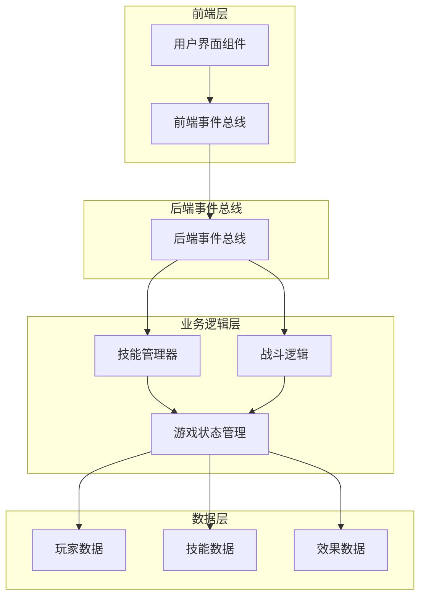
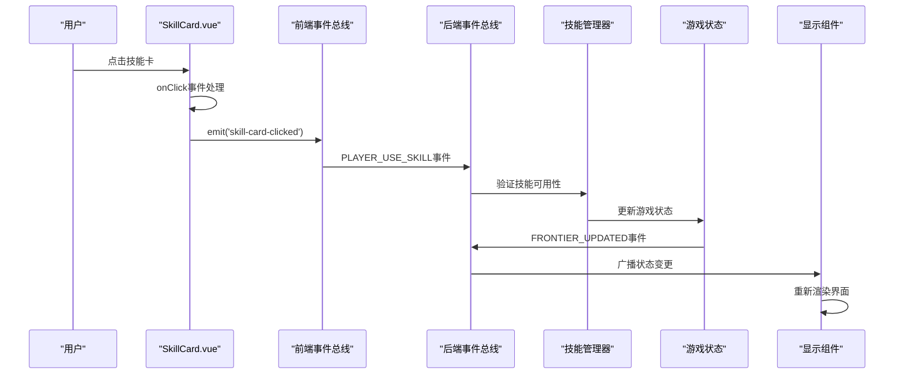
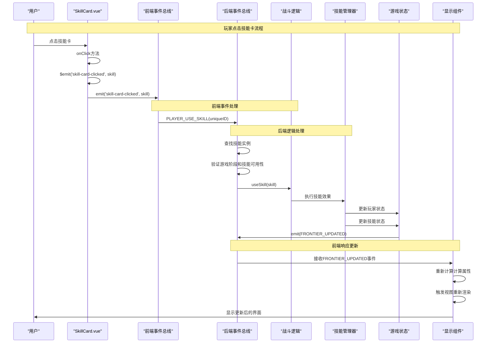

# 状态更新触发流程

<cite>
**本文档中引用的文件**
- [frontendEventBus.js](file://src/frontendEventBus.js)
- [backendEventBus.js](file://src/backendEventBus.js)
- [skillManager.js](file://src/data/skillManager.js)
- [gameState.js](file://src/data/gameState.js)
- [SkillCard.vue](file://src/components/global/SkillCard.vue)
- [battle.js](file://src/data/battle.js)
- [player.js](file://src/data/player.js)
</cite>

## 目录
1. [简介](#简介)
2. [项目架构概览](#项目架构概览)
3. [核心组件分析](#核心组件分析)
4. [状态更新流程详解](#状态更新流程详解)
5. [事件总线机制](#事件总线机制)
6. [技能使用流程时序图](#技能使用流程时序图)
7. [关键调试断点](#关键调试断点)
8. [性能考虑](#性能考虑)
9. [故障排除指南](#故障排除指南)
10. [总结](#总结)

## 简介

本文档详细分析了一个基于Vue.js的游戏项目中，从用户界面到后端逻辑再到前端渲染的完整状态更新触发流程。以玩家点击技能卡为例，展示了事件如何从前端组件发出，经过事件总线传递，由后端逻辑模块处理，最终驱动前端组件重新渲染的全过程。

该项目采用了前后端分离的架构设计，通过事件总线实现UI组件与业务逻辑之间的解耦，确保了系统的可维护性和扩展性。

## 项目架构概览

该项目采用模块化的架构设计，主要分为以下几个层次：



**图表来源**
- [frontendEventBus.js](file://src/frontendEventBus.js#L1-L9)
- [backendEventBus.js](file://src/backendEventBus.js#L1-L80)
- [gameState.js](file://src/data/gameState.js#L1-L75)

## 核心组件分析

### 前端事件总线

前端事件总线负责在前端组件之间传递事件和数据，主要用于控制和播放动画，不涉及具体结算逻辑。

```javascript
// 前端事件总线
// 前端事件总线负责在前端组件之间传递事件和数据，一般用于控制和播放动画，不涉及具体结算逻辑
import mitt from 'mitt';

const frontendEventBus = mitt();

export default frontendEventBus;
```

### 后端事件总线

后端事件总线定义了完整的事件命名空间，包括游戏、玩家、战斗、休整等多个阶段的事件。

```javascript
import mitt from 'mitt';

const backendEventBus = mitt();

export const EventNames = {
  Game: {
    PRE_GAME_START: 'pre-game-start',
    GAME_START: 'game-start',
    ENTER_BATTLE_STAGE: 'enter-battle-stage',
    ENTER_REST_STAGE: 'enter-rest-stage',
    PRE_BATTLE: 'pre-battle',
    POST_BATTLE: 'post-battle',
    GAME_OVER: 'game-over',
  },
  Player: {
    TIER_UPGRADED: 'player-tier-upgraded',
    ABILITY_CLAIMED: 'player-ability-claimed',
    MONEY_CLAIMED: 'player-money-claimed',
    SKILL_REWARD_CLAIMED: 'player-skill-claimed',
    FRONTIER_UPDATED: 'player-frontier-skills-updated',
    ACTIVATED_SKILLS_UPDATED: 'player-activated-skills-updated',
    EFFECT_CHANGED: 'player-effect-changed',
    SKILL_BURNT: 'player-skill-burnt',
    SKILL_DISCOVERED: 'player-skill-discovered',
    SKILL_USED: 'player-skill-used',
    SKILL_DROPPED: 'player-skill-dropped',
    SKILL_DRAWN: 'player-skill-drawn'
  },
  PlayerOperations: {
    PLAYER_USE_SKILL: 'battle-player-use-skill',
    PLAYER_SHIFT_SKILL: 'battle-player-shift-skill',
    PLAYER_END_TURN: 'player-end-turn',
    PLAYER_STOP_ACTIVATED_SKILL: 'battle-player-stop-activated-skill',
    CLAIM_MONEY: 'rest-claim-money',
    CLAIM_SKILL: 'rest-claim-skill',
    CLAIM_ABILITY: 'rest-claim-ability',
    CLAIM_BREAKTHROUGH: 'rest-claim-breakthrough',
    REORDER_SKILLS: 'rest-reorder-skills',
    PURCHASE_ITEM: 'rest-purchase-item',
    FINISH: 'rest-finish',
    DROP_REWARD: 'rest-drop-reward',
    CONFIRM_OVERLAY_SKILL_SELECTIONS: 'overlay-confirm-skill-selections'
  }
};
```

### 游戏状态管理

游戏状态管理采用前后端分离的设计，分别创建显示层状态和后端状态，二者结构一致但相互独立。

```javascript
// gameState.js - 游戏状态管理（前后端分离）

import { reactive } from 'vue';
import { Player } from './player.js';
import SkillManager from './skillManager.js';

// 工厂方法：创建一个“干净”的游戏状态对象（非响应式）
export function createGameState() {
  return {
    // 游戏阶段: 'start', 'battle', 'rest', 'end'
    gameStage: 'start',

    // 休整界面阶段：'money' | 'breakthrough' | 'skill' | 'ability' | 'shop' | ''（不显示）
    restScreenStage: '',

    // 是否开启了瑞米进行游戏
    isRemiPresent: false,

    // 游戏结果状态
    isVictory: false,

    // 回合控制
    isEnemyTurn: false,

    get isPlayerTurn() {
      return !this.isEnemyTurn;
    },

    // 玩家数据
    player: reactive(new Player()),

    // 敌人数据（在战斗开始时赋值）
    enemy: {},

    // 奖励数据
    rewards: {
      breakthrough: false,
      money: 0,
      skills: [],
      abilities: []
    },

    // 当前商店内商品
    shopItems: [],

    // 战斗场次数
    battleCount: 0
  };
}

// 分别创建“显示层状态”和“后端状态”，二者结构一致，但相互独立
export const backendGameState = reactive(createGameState());
export const displayGameState = reactive(createGameState());
```

**章节来源**
- [frontendEventBus.js](file://src/frontendEventBus.js#L1-L9)
- [backendEventBus.js](file://src/backendEventBus.js#L1-L80)
- [gameState.js](file://src/data/gameState.js#L1-L75)

## 状态更新流程详解

### 技能使用流程概述

当玩家点击技能卡时，整个状态更新流程遵循以下步骤：

1. **前端组件触发事件**：SkillCard.vue组件捕获用户点击事件
2. **前端事件总线传递**：事件通过frontendEventBus传递
3. **后端事件监听**：后端事件总线监听PLAYER_USE_SKILL事件
4. **技能验证与执行**：后端逻辑验证技能可用性并执行
5. **状态更新**：游戏状态被更新
6. **后端事件广播**：通过backendEventBus广播状态变更
7. **前端响应更新**：前端组件接收到事件并重新渲染

### 技能管理器核心功能

技能管理器负责技能的注册、创建和管理，是整个技能系统的核心组件。

```javascript
class SkillManager {
  constructor() {
    this.skills = [];
    this.skillRegistry = new Map(); // 新增技能注册表
    
  }
  // 注册技能
  registerSkill(SkillClass) {
    const skillName = (new SkillClass()).name;
    this.skillRegistry.set(skillName, SkillClass);
  }

  // 创建技能实例
  createSkill(skillName) {
    // 使用注册表创建技能实例
    const SkillClass = this.skillRegistry.get(skillName);
    if (SkillClass) {
      const obj = new SkillClass();
      obj.description = obj.regenerateDescription();
      return obj;
    }
    throw new Error(`Unknown skill: ${skillName}`);
  }
  
  // 获取SkillManager实例
  static getInstance() {
    if (!this.instance) {
      this.instance = new SkillManager();
    }
    return this.instance;
  }
}
```

### 战斗逻辑处理

战斗逻辑处理玩家使用技能的具体流程，包括技能验证、效果执行和状态更新。

```javascript
// 玩家使用技能（前端操作）
backendEventBus.on(EventNames.PlayerOperations.PLAYER_USE_SKILL, (uniqueID) => {
  const skill = gameState.player.frontierSkills.find(s => s.uniqueID === uniqueID);
  console.log('使用技能：', skill);
  if (skill) {
    // 额外检查一次技能是否能使用，因为前端是异步动画，所以如果玩家操作过快则可能会尝试发动无法使用的技能
    if(gameState.gameStage === 'battle' && gameState.isPlayerTurn && skill.canUse(gameState.player)) {
      useSkill(skill);
    } else {
      console.warn(`技能使用失败：技能 ${skill.name} 当前无法使用。`);
    }
  } else {
    console.warn(`技能使用失败：前台技能列表中未找到id为 ${uniqueID} 的技能`);
    console.log(gameState.player.frontierSkills);
  }
});
```

**章节来源**
- [skillManager.js](file://src/data/skillManager.js#L1-L253)
- [battle.js](file://src/data/battle.js#L458-L486)

## 事件总线机制

### 前端事件总线的作用

前端事件总线主要用于：
- 组件间通信
- 动画控制
- 用户交互反馈
- 不涉及具体的业务逻辑结算

### 后端事件总线的作用

后端事件总线负责：
- 游戏状态变更通知
- 业务逻辑协调
- 前后端状态同步
- 事件驱动的架构模式



**图表来源**
- [SkillCard.vue](file://src/components/global/SkillCard.vue#L150-L160)
- [backendEventBus.js](file://src/backendEventBus.js#L30-L50)
- [battle.js](file://src/data/battle.js#L458-L486)

## 技能使用流程时序图

以下是玩家点击技能卡的完整时序图：



**图表来源**
- [SkillCard.vue](file://src/components/global/SkillCard.vue#L150-L160)
- [backendEventBus.js](file://src/backendEventBus.js#L30-L50)
- [battle.js](file://src/data/battle.js#L458-L486)

## 关键调试断点

为了有效调试状态更新流程，建议在以下关键位置设置断点：

### 1. 前端事件发射点

```javascript
// SkillCard.vue - 点击事件处理
onClick(event) {
  if (!this.disabled && this.canClick) {
    this.$emit('skill-card-clicked', this.skill, event);
    // 在这里设置断点，检查技能数据和事件参数
  }
}
```

### 2. 前端事件接收点

```javascript
// 前端事件总线监听
frontendEventBus.on('skill-card-clicked', (skill, event) => {
  // 设置断点，检查事件传播过程
});
```

### 3. 后端事件处理点

```javascript
// 后端事件总线监听
backendEventBus.on(EventNames.PlayerOperations.PLAYER_USE_SKILL, (uniqueID) => {
  const skill = gameState.player.frontierSkills.find(s => s.uniqueID === uniqueID);
  // 设置断点，检查技能查找和验证过程
});
```

### 4. 状态更新验证点

```javascript
// 状态更新后验证
backendEventBus.on(EventNames.Player.FRONTIER_UPDATED, ({frontierSkills, backupSkills}) => {
  // 设置断点，检查状态更新后的数据一致性
});
```

### 5. 渲染更新检测点

```javascript
// Vue响应式数据变化检测
watch(() => gameState.player.frontierSkills, (newSkills, oldSkills) => {
  // 设置断点，监控状态变化对渲染的影响
});
```

## 性能考虑

### 事件总线性能优化

1. **事件去重**：避免重复发送相同事件
2. **批量更新**：合并多个状态变更事件
3. **延迟处理**：对于非关键路径的操作使用setTimeout
4. **内存管理**：及时清理不再使用的事件监听器

### 游戏状态管理优化

1. **响应式数据分层**：将频繁变化的数据与稳定数据分离
2. **计算属性缓存**：合理使用Vue的计算属性缓存机制
3. **深度监听优化**：避免不必要的深度监听
4. **组件懒加载**：按需加载大型组件

### 技能系统性能优化

1. **技能注册表缓存**：使用Map提高技能查找效率
2. **技能描述预计算**：避免重复计算技能描述
3. **随机算法优化**：优化技能抽取算法的复杂度
4. **DOM操作优化**：减少不必要的DOM更新

## 故障排除指南

### 常见问题及解决方案

#### 1. 技能无法使用

**症状**：点击技能卡后没有反应

**排查步骤**：
1. 检查游戏阶段是否为战斗阶段
2. 验证玩家回合状态
3. 确认技能是否满足使用条件
4. 检查技能冷却时间

**解决方案**：
```javascript
// 添加调试日志
console.log('游戏阶段:', gameState.gameStage);
console.log('玩家回合:', gameState.isPlayerTurn);
console.log('技能可用性:', skill.canUse(gameState.player));
```

#### 2. 状态不同步

**症状**：前端显示与实际状态不符

**排查步骤**：
1. 检查事件总线是否正确传播
2. 验证状态更新是否正确触发
3. 确认响应式数据绑定是否正常

**解决方案**：
```javascript
// 强制刷新状态
Object.assign(gameState, {...gameState});
```

#### 3. 性能问题

**症状**：界面卡顿或响应缓慢

**排查步骤**：
1. 检查事件监听器数量
2. 分析计算属性复杂度
3. 监控DOM更新频率

**解决方案**：
```javascript
// 使用防抖函数
import { debounce } from 'lodash';

const debouncedUpdate = debounce(() => {
  // 状态更新逻辑
}, 100);
```

**章节来源**
- [SkillCard.vue](file://src/components/global/SkillCard.vue#L150-L160)
- [battle.js](file://src/data/battle.js#L458-L486)

## 总结

本文档详细分析了从用户界面到后端逻辑再到前端渲染的完整状态更新触发流程。通过深入研究代码结构和实现细节，我们了解了：

1. **事件总线解耦机制**：前后端事件总线在系统架构中的重要作用
2. **状态管理模式**：前后端分离的游戏状态管理策略
3. **技能系统设计**：技能注册、管理和执行的完整流程
4. **性能优化要点**：关键的性能考虑和优化方向
5. **调试技巧**：有效的调试断点设置和问题排查方法

这种事件驱动的架构设计不仅提高了系统的可维护性，还为未来的功能扩展提供了良好的基础。通过理解这些核心概念和实现细节，开发者可以更好地维护和扩展这个游戏项目。