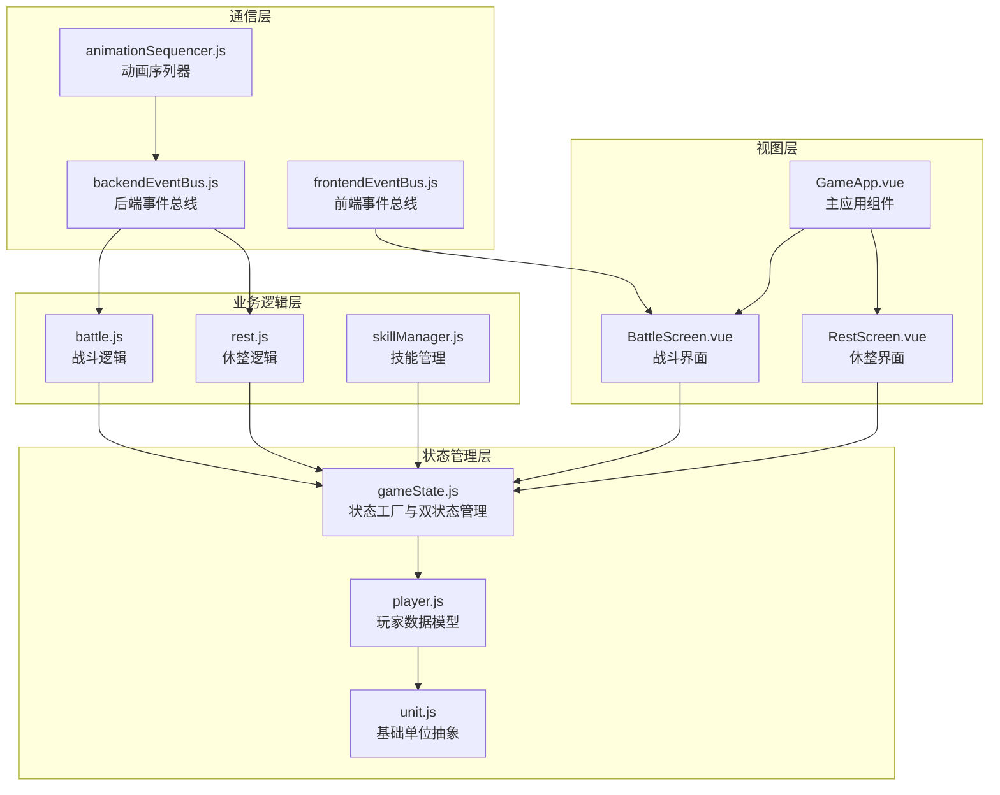
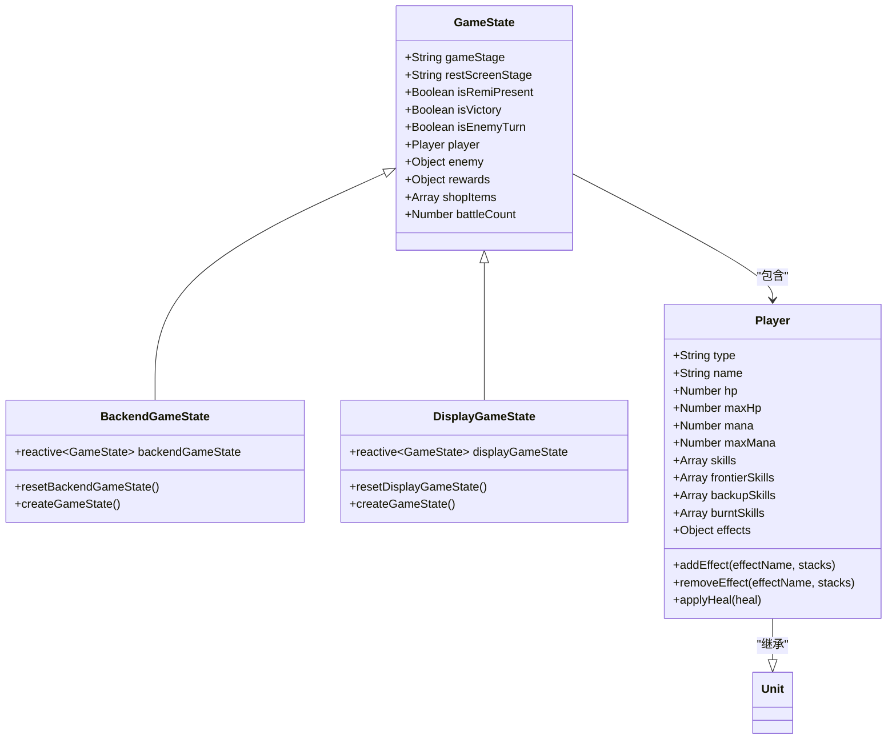
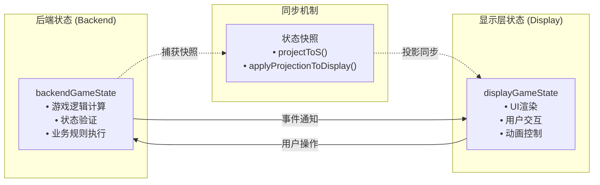
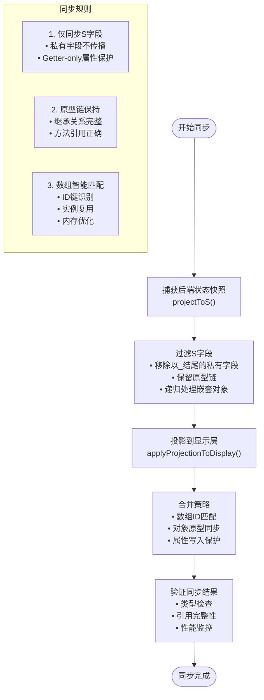
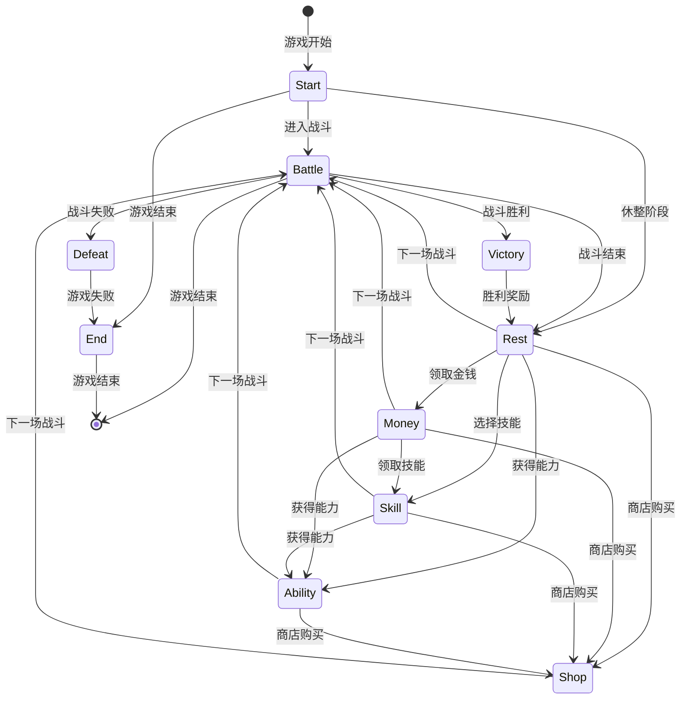
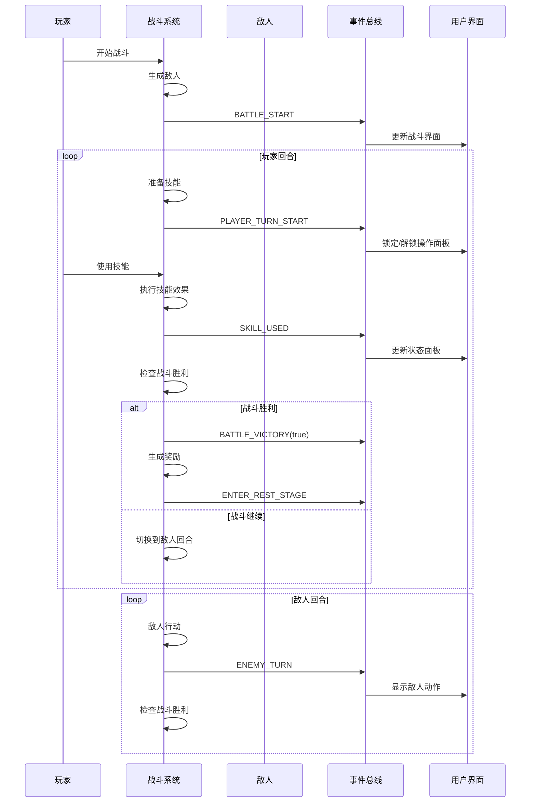
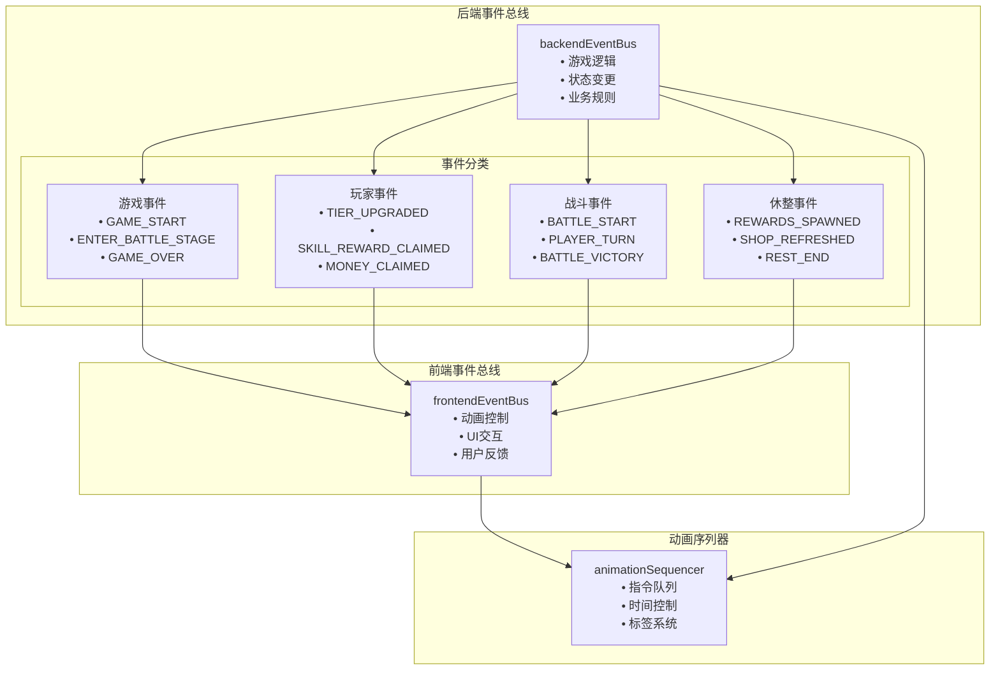
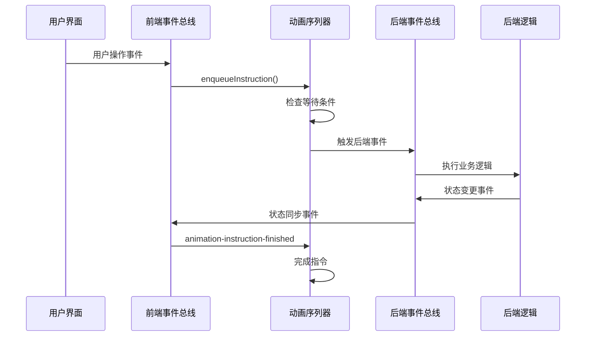
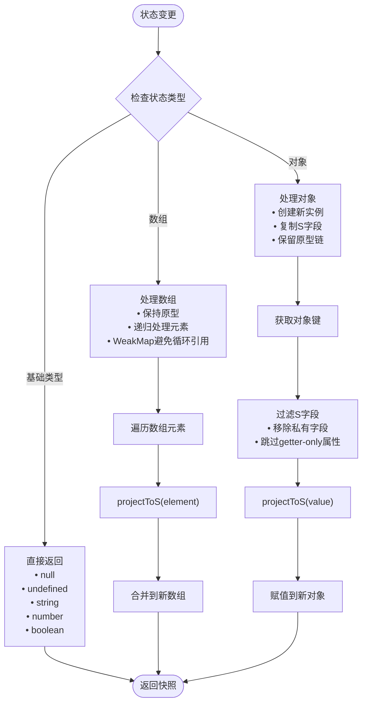
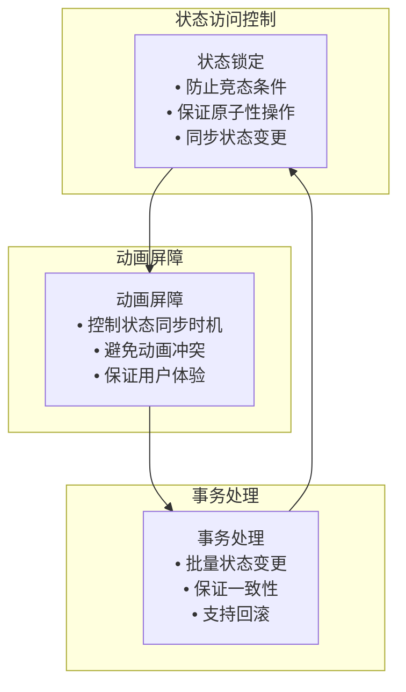

# 游戏状态管理

<cite>
**本文档中引用的文件**
- [gameState.js](file://src/data/gameState.js)
- [player.js](file://src/data/player.js)
- [skillManager.js](file://src/data/skillManager.js)
- [backendEventBus.js](file://src/backendEventBus.js)
- [frontendEventBus.js](file://src/frontendEventBus.js)
- [game.js](file://src/game.js)
- [battle.js](file://src/data/battle.js)
- [rest.js](file://src/data/rest.js)
- [unit.js](file://src/data/unit.js)
- [skill.js](file://src/data/skill.js)
- [animationInstructionHelpers.js](file://src/data/animationInstructionHelpers.js)
- [animationSequencer.js](file://src/data/animationSequencer.js)
- [BattleScreen.vue](file://src/components/BattleScreen.vue)
</cite>

## 目录
1. [简介](#简介)
2. [项目结构概览](#项目结构概览)
3. [前后端分离设计模式](#前后端分离设计模式)
4. [核心状态管理架构](#核心状态管理架构)
5. [状态同步机制](#状态同步机制)
6. [状态迁移图](#状态迁移图)
7. [事件总线通信](#事件总线通信)
8. [状态持久化与快照](#状态持久化与快照)
9. [性能优化策略](#性能优化策略)
10. [故障排除指南](#故障排除指南)
11. [总结](#总结)

## 简介

该游戏状态管理系统采用了创新的前后端分离设计模式，通过精心设计的状态管理架构实现了复杂的游戏逻辑与用户界面的高效解耦。系统的核心设计理念是将游戏逻辑状态（后端状态）与UI状态（显示层状态）分离，通过事件总线实现松耦合通信，并结合动画序列器确保状态变更的平滑过渡。

这种设计模式不仅提高了系统的可维护性和可扩展性，还为复杂的战斗系统、技能管理和状态同步提供了坚实的技术基础。

## 项目结构概览

游戏状态管理系统的核心文件组织如下：



**图表来源**
- [gameState.js](file://src/data/gameState.js#L1-L75)
- [player.js](file://src/data/player.js#L1-L226)
- [battle.js](file://src/data/battle.js#L1-L199)
- [rest.js](file://src/data/rest.js#L1-L199)

## 前后端分离设计模式

### 设计理念

游戏状态管理系统采用了独特的前后端分离设计模式，将游戏逻辑状态与UI状态完全分离：



**图表来源**
- [gameState.js](file://src/data/gameState.js#L7-L45)
- [player.js](file://src/data/player.js#L75-L150)
- [unit.js](file://src/data/unit.js#L6-L30)

### 分离原则

1. **职责分离**：后端状态专注于游戏逻辑计算，显示层状态专注于UI渲染
2. **状态独立**：两套状态互不影响，各自独立演进
3. **同步机制**：通过快照投影实现状态同步
4. **解耦通信**：通过事件总线实现松耦合交互

**章节来源**
- [gameState.js](file://src/data/gameState.js#L51-L75)
- [animationInstructionHelpers.js](file://src/data/animationInstructionHelpers.js#L1-L199)

## 核心状态管理架构

### 状态工厂模式

系统采用工厂模式创建游戏状态对象，确保状态的一致性和可重置性：

```javascript
// 工厂方法：创建一个"干净"的游戏状态对象（非响应式）
export function createGameState() {
  return {
    // 游戏阶段: 'start', 'battle', 'rest', 'end'
    gameStage: 'start',
    // 休整界面阶段：'money' | 'breakthrough' | 'skill' | 'ability' | 'shop' | ''（不显示）
    restScreenStage: '',
    // 是否开启了瑞米进行游戏
    isRemiPresent: false,
    // 游戏结果状态
    isVictory: false,
    // 回合控制
    isEnemyTurn: false,
    // 玩家数据
    player: reactive(new Player()),
    // 敌人数据（在战斗开始时赋值）
    enemy: {},
    // 奖励数据
    rewards: {
      breakthrough: false,
      money: 0,
      skills: [],
      abilities: []
    },
    // 当前商店内商品
    shopItems: [],
    // 战斗场次数
    battleCount: 0
  };
}
```

### 双状态架构

系统维护两套独立的状态：



**图表来源**
- [gameState.js](file://src/data/gameState.js#L51-L75)
- [animationInstructionHelpers.js](file://src/data/animationInstructionHelpers.js#L20-L80)

**章节来源**
- [gameState.js](file://src/data/gameState.js#L7-L75)
- [animationInstructionHelpers.js](file://src/data/animationInstructionHelpers.js#L20-L120)

## 状态同步机制

### 快照投影算法

系统实现了高效的快照投影算法，确保后端状态能够准确同步到显示层：



**图表来源**
- [animationInstructionHelpers.js](file://src/data/animationInstructionHelpers.js#L20-L120)

### 状态重置机制

系统提供了完整的状态重置功能，支持部分重置和完全重置：

```javascript
// 重置显示层状态
export function resetDisplayGameState() {
  const fresh = createGameState();
  // 保持玩家对象响应式：用 Object.assign 同步字段
  Object.assign(displayGameState, fresh);
  Object.assign(displayGameState.player, fresh.player);
}

// 重置后端状态
export function resetBackendGameState() {
  const fresh = createGameState();
  Object.assign(backendGameState, fresh);
  Object.assign(backendGameState.player, fresh.player);
}

// 同时重置两份状态
export function resetAllGameStates() {
  resetDisplayGameState();
  resetBackendGameState();
}
```

**章节来源**
- [gameState.js](file://src/data/gameState.js#L55-L75)
- [animationInstructionHelpers.js](file://src/data/animationInstructionHelpers.js#L20-L120)

## 状态迁移图

### 游戏阶段状态转换



### 战斗回合状态转换



**图表来源**
- [battle.js](file://src/data/battle.js#L15-L100)
- [backendEventBus.js](file://src/backendEventBus.js#L1-L80)

**章节来源**
- [battle.js](file://src/data/battle.js#L15-L199)
- [rest.js](file://src/data/rest.js#L170-L199)

## 事件总线通信

### 事件总线架构

系统采用分层事件总线架构，实现前后端的松耦合通信：



**图表来源**
- [backendEventBus.js](file://src/backendEventBus.js#L4-L75)
- [frontendEventBus.js](file://src/frontendEventBus.js#L1-L9)
- [animationSequencer.js](file://src/data/animationSequencer.js#L1-L135)

### 动画序列器

动画序列器是状态同步的关键组件，实现了复杂的动画指令调度：

```javascript
// 指令结构
{
  id: string,                    // 唯一标识
  status: 'pending' | 'running' | 'finished', // 状态
  tags: Set<string>,             // 标签集合
  waitTags: Set<string>,         // 等待标签
  durationMs: number,            // 持续时间
  start: (ctx) => void,         // 启动回调
  meta?: any                     // 元数据
}
```

### 事件处理流程



**图表来源**
- [animationSequencer.js](file://src/data/animationSequencer.js#L25-L80)
- [frontendEventBus.js](file://src/frontendEventBus.js#L1-L9)

**章节来源**
- [backendEventBus.js](file://src/backendEventBus.js#L1-L80)
- [animationSequencer.js](file://src/data/animationSequencer.js#L1-L135)

## 状态持久化与快照

### 快照捕获机制

系统实现了高效的快照捕获机制，确保状态的完整性和一致性：



**图表来源**
- [animationInstructionHelpers.js](file://src/data/animationInstructionHelpers.js#L20-L80)

### 状态投影算法

投影算法确保状态同步过程中的数据完整性：

```javascript
// projectToS：将backendGameState投影为轻量快照，仅包含S字段
function projectToS(value, seen = new WeakMap()) {
  if (value === null || typeof value !== 'object') return value;
  if (seen.has(value)) return seen.get(value);

  const raw = toRaw(value);
  
  if (Array.isArray(raw)) {
    const arr = new Array(raw.length);
    seen.set(value, arr);
    for (let i = 0; i < raw.length; i++) {
      arr[i] = projectToS(raw[i], seen);
    }
    return arr;
  }

  // 为对象创建与后端节点相同的原型
  const proto = Object.getPrototypeOf(raw) || Object.prototype;
  const out = Object.create(proto);
  seen.set(value, out);

  // 仅复制S字段，且避免向getter-only/不可写属性赋值
  for (const key of Object.keys(raw)) {
    if (!isSKey(key)) continue;
    const desc = Object.getOwnPropertyDescriptor(raw, key);
    if (desc && typeof desc.get === 'function' && typeof desc.set !== 'function') continue;
    const v = raw[key];
    if (typeof v === 'function') continue;
    
    if (!isWritableProperty(out, key)) continue;
    out[key] = projectToS(v, seen);
  }
  return out;
}
```

**章节来源**
- [animationInstructionHelpers.js](file://src/data/animationInstructionHelpers.js#L20-L120)

## 性能优化策略

### 内存管理优化

系统采用多种策略优化内存使用：

1. **WeakMap缓存**：避免循环引用导致的内存泄漏
2. **原型链复用**：减少对象实例化开销
3. **懒加载机制**：按需创建和销毁状态对象
4. **增量更新**：仅同步发生变化的状态字段

### 并发访问控制



### 性能监控指标

系统监控以下关键性能指标：
- 状态同步延迟
- 内存使用峰值
- 动画帧率稳定性
- 事件处理吞吐量

## 故障排除指南

### 常见问题诊断

1. **状态不同步**
   - 检查快照投影算法
   - 验证S字段过滤规则
   - 确认原型链完整性

2. **动画卡顿**
   - 检查动画指令队列
   - 验证等待标签配置
   - 监控帧率性能

3. **事件丢失**
   - 检查事件总线订阅
   - 验证指令完成回调
   - 确认超时设置

### 调试工具

系统提供以下调试工具：
- 状态快照对比器
- 动画序列跟踪器
- 事件流分析器
- 性能监控仪表板

**章节来源**
- [animationInstructionHelpers.js](file://src/data/animationInstructionHelpers.js#L20-L120)
- [animationSequencer.js](file://src/data/animationSequencer.js#L25-L80)

## 总结

该游戏状态管理系统展现了现代游戏开发中状态管理的最佳实践。通过前后端分离的设计模式、高效的快照投影算法、完善的事件总线通信机制，以及智能的动画序列器，系统成功实现了复杂游戏逻辑与流畅用户界面的完美结合。

### 核心优势

1. **架构清晰**：前后端分离确保了职责明确，易于维护
2. **性能优异**：优化的同步机制保证了流畅的游戏体验
3. **扩展性强**：模块化设计支持功能的灵活扩展
4. **可靠性高**：完善的错误处理和恢复机制

### 技术创新

- **双状态架构**：同时维护后端逻辑状态和显示层状态
- **智能投影算法**：高效的快照捕获和状态同步
- **事件驱动架构**：松耦合的组件间通信
- **动画序列化**：精确的时间控制和状态同步

这套状态管理系统为复杂游戏应用提供了坚实的技术基础，展示了现代Web游戏开发的先进理念和技术水平。