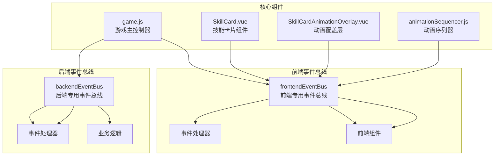
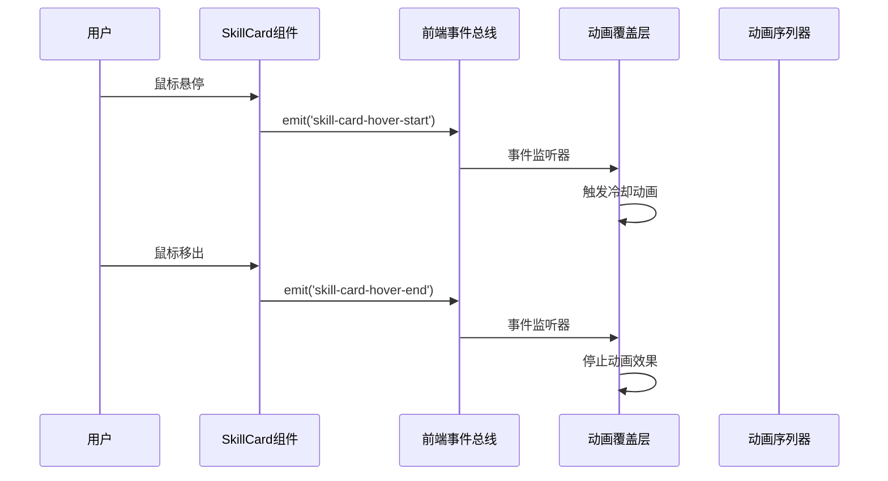
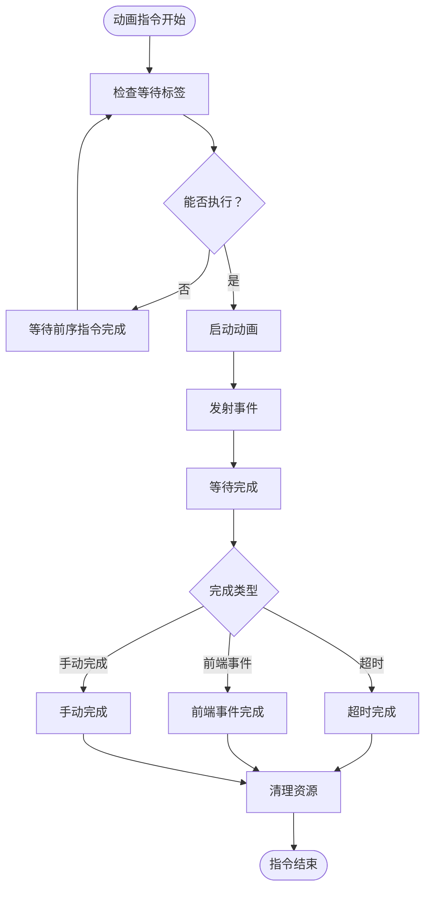
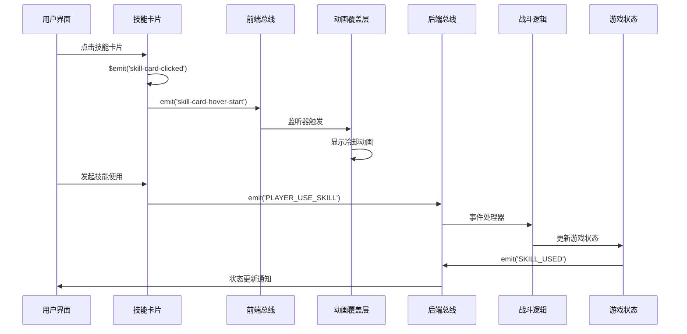

# 事件分发机制

<cite>
**本文档引用的文件**
- [frontendEventBus.js](file://src/frontendEventBus.js)
- [backendEventBus.js](file://src/backendEventBus.js)
- [game.js](file://src/game.js)
- [SkillCard.vue](file://src/components/global/SkillCard.vue)
- [SkillCardAnimationOverlay.vue](file://src/components/global/SkillCardAnimationOverlay.vue)
- [animationSequencer.js](file://src/data/animationSequencer.js)
- [animationInstructionHelpers.js](file://src/data/animationInstructionHelpers.js)
- [cardAnimationOrchestrator.js](file://src/utils/cardAnimationOrchestrator.js)
</cite>

## 目录
1. [简介](#简介)
2. [项目结构概览](#项目结构概览)
3. [核心事件总线架构](#核心事件总线架构)
4. [详细组件分析](#详细组件分析)
5. [事件传播流程](#事件传播流程)
6. [性能考量与优化](#性能考量与优化)
7. [故障排除指南](#故障排除指南)
8. [总结](#总结)

## 简介

本文档深入分析基于mitt库的事件广播实现机制，重点描述frontendEventBus和backendEventBus在game.js中的具体使用场景。该系统采用事件驱动架构，实现了前端组件间以及前后端之间的解耦通信，支持复杂的动画序列和状态管理。

事件分发机制的核心优势在于：
- **解耦设计**：组件间通过事件总线通信，降低直接依赖
- **异步执行**：支持非阻塞的事件处理和动画序列
- **灵活扩展**：易于添加新的事件类型和处理器
- **性能优化**：通过事件节流和批量处理避免性能瓶颈

## 项目结构概览



**图表来源**
- [frontendEventBus.js](file://src/frontendEventBus.js#L1-L8)
- [backendEventBus.js](file://src/backendEventBus.js#L1-L80)
- [game.js](file://src/game.js#L1-L119)

## 核心事件总线架构

### 前端事件总线 (frontendEventBus)

前端事件总线专门负责在前端组件之间传递事件和数据，主要用于控制和播放动画，不涉及具体结算逻辑。

```javascript
// 前端事件总线定义
import mitt from 'mitt';

const frontendEventBus = mitt();

export default frontendEventBus;
```

**主要功能**：
- 技能卡片交互事件
- 动画播放控制
- 用户界面状态更新
- 组件间通信协调

### 后端事件总线 (backendEventBus)

后端事件总线负责游戏逻辑的事件分发，包含完整的事件命名空间体系。

```javascript
export const EventNames = {
  Game: {
    PRE_GAME_START: 'pre-game-start',
    GAME_START: 'game-start',
    ENTER_BATTLE_STAGE: 'enter-battle-stage',
    ENTER_REST_STAGE: 'enter-rest-stage',
    PRE_BATTLE: 'pre-battle',
    POST_BATTLE: 'post-battle',
    GAME_OVER: 'game-over',
  },
  Player: {
    TIER_UPGRADED: 'player-tier-upgraded',
    ABILITY_CLAIMED: 'player-ability-claimed',
    MONEY_CLAIMED: 'player-money-claimed',
    SKILL_REWARD_CLAIMED: 'player-skill-claimed',
    FRONTIER_UPDATED: 'player-frontier-skills-updated',
    ACTIVATED_SKILLS_UPDATED: 'player-activated-skills-updated',
    SKILL_USED: 'player-skill-used',
    SKILL_DRAWN: 'player-skill-drawn'
  },
  PlayerOperations: {
    PLAYER_USE_SKILL: 'battle-player-use-skill',
    PLAYER_SHIFT_SKILL: 'battle-player-shift-skill',
    PLAYER_END_TURN: 'player-end-turn',
    CLAIM_MONEY: 'rest-claim-money',
    CLAIM_SKILL: 'rest-claim-skill',
    FINISH: 'rest-finish'
  }
};
```

**章节来源**
- [frontendEventBus.js](file://src/frontendEventBus.js#L1-L8)
- [backendEventBus.js](file://src/backendEventBus.js#L1-L80)

## 详细组件分析

### SkillCard组件事件处理

SkillCard.vue组件是事件分发的核心节点，负责捕获用户交互并触发相应的事件。



**图表来源**
- [SkillCard.vue](file://src/components/global/SkillCard.vue#L120-L132)
- [SkillCardAnimationOverlay.vue](file://src/components/global/SkillCardAnimationOverlay.vue#L60-L80)

**关键实现细节**：

```javascript
// 鼠标悬停事件处理
onMouseEnter() {
  this.hovered = true;
  if (!this.previewMode) frontendEventBus.emit('skill-card-hover-start', this.skill);
},
onMouseLeave() {
  this.hovered = false;
  if (!this.previewMode) frontendEventBus.emit('skill-card-hover-end', this.skill);
}
```

### 动画序列器事件集成

animationSequencer.js实现了复杂的动画事件处理机制，支持异步事件完成通知。



**图表来源**
- [animationSequencer.js](file://src/data/animationSequencer.js#L101-L133)

**核心事件处理逻辑**：

```javascript
_startInstruction(instr) {
  instr.status = 'running';
  instr._startedAt = Date.now();
  try {
    instr.start({ 
      id: instr.id, 
      meta: instr.meta, 
      emit: (name, payload) => frontendEventBus.emit(name, payload) 
    });
  } catch (err) {
    console.error('[animationSequencer] start logic error:', err);
  }
  if (isFinite(instr.durationMs) && instr.durationMs >= 0) {
    const timerId = setTimeout(() => {
      this.finish(instr.id, 'timeout');
    }, Math.max(0, instr.durationMs));
    this._idToTimer.set(instr.id, timerId);
  }
}
```

### 事件总线监听器注册

game.js展示了后端事件总线的完整监听器注册和事件处理流程：

```javascript
export function initGameFlowListeners() {
  // 游戏开始
  backendEventBus.on(EventNames.Game.GAME_START, () => {
    startGame();
  });

  // 开始战斗
  backendEventBus.on(EventNames.Game.ENTER_BATTLE_STAGE, () => {
    enterBattleStage();
  });

  // 战斗内玩家操作
  backendEventBus.on(EventNames.PlayerOperations.PLAYER_USE_SKILL, (uniqueID) => {
    const skill = gameState.player.frontierSkills.find(s => s.uniqueID === uniqueID);
    if (skill) {
      if(gameState.gameStage === 'battle' && gameState.isPlayerTurn && skill.canUse(gameState.player)) {
        useSkill(skill);
      } else {
        console.warn(`技能使用失败：技能 ${skill.name} 当前无法使用。`);
      }
    }
  });
}
```

**章节来源**
- [SkillCard.vue](file://src/components/global/SkillCard.vue#L120-L132)
- [animationSequencer.js](file://src/data/animationSequencer.js#L101-L133)
- [game.js](file://src/game.js#L30-L119)

## 事件传播流程

### 完整事件传播路径



**图表来源**
- [SkillCard.vue](file://src/components/global/SkillCard.vue#L120-L132)
- [backendEventBus.js](file://src/backendEventBus.js#L25-L40)
- [game.js](file://src/game.js#L45-L60)

### 异步事件执行特性

事件系统采用异步执行模型，确保不会阻塞主线程：

1. **事件发射**：emit方法立即返回，不等待处理完成
2. **事件处理**：监听器在事件循环中异步执行
3. **动画协调**：通过事件完成通知实现动画序列化
4. **错误处理**：每个事件处理都有独立的错误捕获机制

### 事件传播顺序

事件传播遵循严格的顺序规则：

```javascript
// 事件传播优先级（高优先级先处理）
const priorityOrder = [
  'animation-instruction-finished',    // 动画完成
  'skill-card-overlay-effect',         // 技能动画效果
  'card-tooltip:show',                 // 卡片提示
  'disable-controls',                  // 控制禁用
  'enable-controls'                    // 控制启用
];

// 标签系统实现依赖关系
const tagDependencies = {
  'all': [],                          // 等待所有前序指令
  'ui': ['all'],                      // 等待UI相关指令
  'state': ['all'],                   // 等待状态同步
  'locking': ['mount'],               // 等待组件挂载
  'unlocking': ['locking']            // 解锁前等待锁定完成
};
```

## 性能考量与优化

### 高频事件处理策略

为了避免高频事件导致的性能瓶颈，系统采用了多种优化策略：

1. **事件节流**：对于频繁触发的事件（如鼠标移动），使用节流技术限制处理频率
2. **批量处理**：将多个相关事件合并处理，减少重复计算
3. **延迟执行**：使用requestAnimationFrame或setTimeout延迟非关键事件
4. **内存管理**：及时清理事件监听器，避免内存泄漏

### 动画性能优化

```javascript
// 动画性能优化配置
const animationOptimizations = {
  // 使用CSS变换而非重排
  useTransform: true,
  // 启用GPU加速
  gpuAcceleration: true,
  // 限制同时运行的动画数量
  maxConcurrentAnimations: 5,
  // 动画缓存机制
  animationCache: new Map(),
  // 虚拟滚动优化
  virtualScrollThreshold: 100
};

// 动画序列器优化
class OptimizedAnimationSequencer extends AnimationSequencer {
  constructor() {
    super();
    this.performanceMonitor = new PerformanceMonitor();
  }
  
  enqueueInstruction(payload) {
    // 性能监控
    const startTime = performance.now();
    const result = super.enqueueInstruction(payload);
    const endTime = performance.now();
    
    // 记录性能数据
    this.performanceMonitor.record('enqueueInstruction', endTime - startTime);
    
    return result;
  }
}
```

### 内存使用优化

```javascript
// 内存优化策略
const memoryOptimizations = {
  // 事件监听器弱引用
  weakListeners: true,
  // 自动清理过期事件
  cleanupInterval: 1000,
  // 最大事件队列长度
  maxQueueLength: 1000,
  // 事件历史记录限制
  historyLimit: 100
};

// 实现自动清理机制
setInterval(() => {
  // 清理过期的事件监听器
  frontendEventBus.cleanupExpiredListeners();
  
  // 压缩事件历史记录
  if (eventHistory.size > memoryOptimizations.historyLimit) {
    const excess = eventHistory.size - memoryOptimizations.historyLimit;
    const keys = Array.from(eventHistory.keys()).slice(0, excess);
    for (const key of keys) {
      eventHistory.delete(key);
    }
  }
}, memoryOptimizations.cleanupInterval);
```

## 故障排除指南

### 常见事件处理问题

1. **事件丢失**
   - 检查事件监听器是否正确注册
   - 验证事件名称拼写是否正确
   - 确认事件总线实例是否一致

2. **动画卡顿**
   - 检查是否有过多并发动画
   - 验证CSS变换属性是否正确
   - 确认requestAnimationFrame调用频率

3. **内存泄漏**
   - 确保组件卸载时移除事件监听器
   - 检查闭包引用是否正确清理
   - 验证定时器是否及时清除

### 调试工具和技巧

```javascript
// 事件总线调试工具
class EventBusDebugger {
  constructor(bus) {
    this.bus = bus;
    this.eventLog = [];
    this.enabled = true;
  }
  
  enable() {
    this.enabled = true;
    console.log('EventBus debugger enabled');
  }
  
  disable() {
    this.enabled = false;
    console.log('EventBus debugger disabled');
  }
  
  logEvent(eventName, payload) {
    if (!this.enabled) return;
    
    const timestamp = new Date().toISOString();
    const logEntry = {
      timestamp,
      eventName,
      payload,
      stack: new Error().stack.split('\n')[2].trim()
    };
    
    this.eventLog.push(logEntry);
    console.log(`[${timestamp}] Event emitted: ${eventName}`, payload);
    
    // 保持日志长度合理
    if (this.eventLog.length > 1000) {
      this.eventLog = this.eventLog.slice(-500);
    }
  }
  
  getEventLog() {
    return this.eventLog;
  }
  
  clearLog() {
    this.eventLog = [];
  }
}

// 使用示例
const debugFrontendBus = new EventBusDebugger(frontendEventBus);
frontendEventBus.on('*', (eventName, payload) => {
  debugFrontendBus.logEvent(eventName, payload);
});
```

**章节来源**
- [animationSequencer.js](file://src/data/animationSequencer.js#L101-L133)
- [cardAnimationOrchestrator.js](file://src/utils/cardAnimationOrchestrator.js#L497-L528)

## 总结

基于mitt库的事件广播实现机制为游戏应用提供了强大而灵活的通信基础设施。通过frontendEventBus和backendEventBus的分离设计，系统实现了：

1. **清晰的职责分离**：前端专注于UI交互和动画，后端处理游戏逻辑
2. **高度的可扩展性**：新增事件类型和处理器无需修改现有代码
3. **优秀的性能表现**：异步事件处理和动画序列化确保流畅体验
4. **强大的调试能力**：完善的事件日志和监控机制便于问题排查

这种事件驱动架构特别适合复杂的游戏应用，能够有效管理大量的用户交互、动画序列和状态变更，为开发者提供了简洁而强大的编程模型。