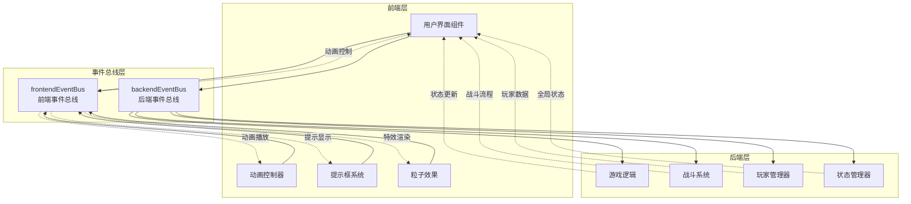
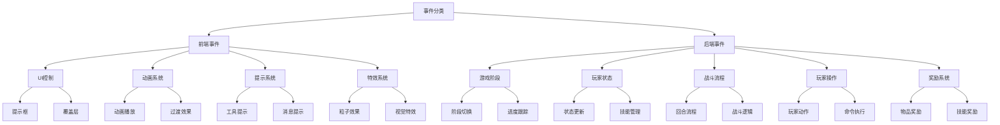
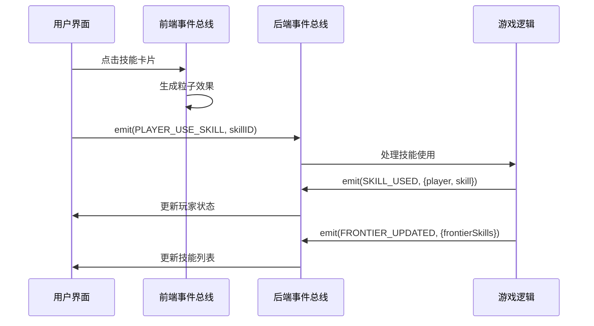
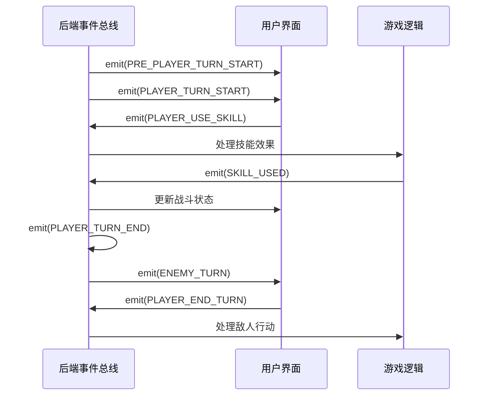

# 事件定义

<cite>
**本文档中引用的文件**
- [frontendEventBus.js](file://src/frontendEventBus.js)
- [backendEventBus.js](file://src/backendEventBus.js)
- [ActionPanel.vue](file://src/components/battle/ActionPanel.vue)
- [SkillsHand.vue](file://src/components/battle/SkillsHand.vue)
- [MessagePopupScreen.vue](file://src/components/end/MessagePopupScreen.vue)
- [battle.js](file://src/data/battle.js)
- [onePunch.js](file://src/data/skills/martial_arts/onePunch.js)
</cite>

## 目录
1. [简介](#简介)
2. [事件总线架构](#事件总线架构)
3. [前端事件总线 (frontendEventBus)](#前端事件总线-frontendeventbus)
4. [后端事件总线 (backendEventBus)](#后端事件总线-backendeventbus)
5. [事件命名规范与分类](#事件命名规范与分类)
6. [事件载荷结构详解](#事件载荷结构详解)
7. [事件使用最佳实践](#事件使用最佳实践)
8. [常见事件模式](#常见事件模式)
9. [故障排除指南](#故障排除指南)
10. [总结](#总结)

## 简介

本项目采用双事件总线架构，通过前端事件总线(frontendEventBus)和后端事件总线(backendEventBus)实现前后端分离的事件通信机制。这种设计确保了UI动画与业务逻辑的完全分离，提高了系统的可维护性和扩展性。

前端事件总线专门负责在前端组件之间传递事件和数据，主要用于控制和播放动画，不涉及具体结算逻辑。而后端事件总线则负责游戏核心逻辑的事件传播，包括战斗流程、玩家操作、状态更新等。

## 事件总线架构



**图表来源**
- [frontendEventBus.js](file://src/frontendEventBus.js#L1-L9)
- [backendEventBus.js](file://src/backendEventBus.js#L1-L80)

## 前端事件总线 (frontendEventBus)

### 基本特性

前端事件总线是一个轻量级的事件发射器，基于mitt库构建，专门用于前端组件间的通信。它的主要职责包括：

- **动画控制**：控制各种UI动画的播放和停止
- **视觉反馈**：处理用户交互的视觉反馈
- **粒子效果**：管理游戏特效和粒子系统
- **提示系统**：处理工具提示和信息展示

### 核心事件类型

```javascript
// 提示框相关事件
frontendEventBus.emit('tooltip:show', { name, text, x, y });
frontendEventBus.emit('tooltip:move', { x, y });
frontendEventBus.emit('tooltip:hide');

// 卡牌相关事件
frontendEventBus.emit('card-tooltip:show', { skill, x, y });
frontendEventBus.emit('card-tooltip:move', { x, y });
frontendEventBus.emit('card-tooltip:hide');

// 粒子效果事件
frontendEventBus.emit('spawn-particles', particles);

// 卡牌选择事件
frontendEventBus.emit('card-selection-finished', { token });

// 对话结束事件
frontendEventBus.emit('dialog-ended');
```

### 事件使用示例

#### 卡牌悬停效果
```javascript
// 显示卡牌提示
frontendEventBus.emit('card-tooltip:show', { 
  skill: this.skillInstance, 
  x: e.clientX, 
  y: e.clientY 
});

// 移动提示位置
frontendEventBus.emit('card-tooltip:move', { x: e.clientX, y: e.clientY });

// 隐藏提示
frontendEventBus.emit('card-tooltip:hide');
```

#### 粒子效果生成
```javascript
// 生成粒子效果
frontendEventBus.emit('spawn-particles', particles);
```

**章节来源**
- [frontendEventBus.js](file://src/frontendEventBus.js#L1-L9)
- [SkillsHand.vue](file://src/components/battle/SkillsHand.vue#L289-L294)
- [CardIcon.vue](file://src/components/global/CardIcon.vue#L76-L79)

## 后端事件总线 (backendEventBus)

### 架构设计

后端事件总线采用模块化的命名空间设计，将事件按功能域进行分类：

```javascript
export const EventNames = {
  Game: {
    PRE_GAME_START: 'pre-game-start',
    GAME_START: 'game-start',
    ENTER_BATTLE_STAGE: 'enter-battle-stage',
    ENTER_REST_STAGE: 'enter-rest-stage',
    PRE_BATTLE: 'pre-battle',
    POST_BATTLE: 'post-battle',
    GAME_OVER: 'game-over',
  },
  Player: {
    // 休息/通用事件
    TIER_UPGRADED: 'player-tier-upgraded',
    ABILITY_CLAIMED: 'player-ability-claimed',
    MONEY_CLAIMED: 'player-money-claimed',
    SKILL_REWARD_CLAIMED: 'player-skill-claimed',
    // 战斗事件
    FRONTIER_UPDATED: 'player-frontier-skills-updated',
    ACTIVATED_SKILLS_UPDATED: 'player-activated-skills-updated',
    ACTIVATED_SKILL_ENABLED: 'player-activated-skill-enabled',
    ACTIVATED_SKILL_DISABLED: 'player-activated-skill-disabled',
    EFFECT_CHANGED: 'player-effect-changed',
    SKILL_BURNT: 'player-skill-burnt',
    SKILL_DISCOVERED: 'player-skill-discovered',
    SKILL_USED: 'player-skill-used',
    SKILL_DROPPED: 'player-skill-dropped',
    SKILL_DRAWN: 'player-skill-drawn'
  },
  PlayerOperations: {
    // 战斗内玩家操作
    PLAYER_USE_SKILL: 'battle-player-use-skill',
    PLAYER_SHIFT_SKILL: 'battle-player-shift-skill',
    PLAYER_END_TURN: 'player-end-turn',
    PLAYER_STOP_ACTIVATED_SKILL: 'battle-player-stop-activated-skill',
    // 休整阶段操作
    CLAIM_MONEY: 'rest-claim-money',
    CLAIM_SKILL: 'rest-claim-skill',
    CLAIM_ABILITY: 'rest-claim-ability',
    CLAIM_BREAKTHROUGH: 'rest-claim-breakthrough',
    REORDER_SKILLS: 'rest-reorder-skills',
    PURCHASE_ITEM: 'rest-purchase-item',
    FINISH: 'rest-finish',
    DROP_REWARD: 'rest-drop-reward',
    // Overlay 操作
    CONFIRM_OVERLAY_SKILL_SELECTIONS: 'overlay-confirm-skill-selections'
  },
  Battle: {
    // 战斗流程事件
    BATTLE_START: 'battle-battle-start',
    PRE_PLAYER_TURN_START: 'battle-pre-player-turn-start',
    PLAYER_TURN_START: 'battle-player-turn-start',
    PLAYER_TURN: 'battle-player-turn',
    PLAYER_TURN_END: 'battle-player-turn-end',
    POST_PLAYER_TURN_END: 'battle-post-player-turn-end',
    ENEMY_TURN: 'battle-enemy-turn',
    ENEMY_TURN_START: 'battle-enemy-turn-start',
    ENEMY_ACTION_END: 'battle-enemy-action-end',
    ENEMY_TURN_END: 'battle-enemy-turn-end',
    BATTLE_VICTORY: 'battle-victory',
  },
  Rest: {
    REWARDS_SPAWNED: 'rewards-spawned',
    SHOP_REFRESHED: 'rest-shop-refreshed',
    END: 'rest-end'
  },
  Shop: {
    ITEM_PURCHASED: 'item-purchased'
  }
};
```

### 核心事件类型详解

#### 游戏阶段事件
- **PRE_GAME_START**: 游戏开始前准备阶段
- **GAME_START**: 游戏正式开始
- **ENTER_BATTLE_STAGE**: 进入战斗阶段
- **ENTER_REST_STAGE**: 进入休整阶段
- **POST_BATTLE**: 战斗结束后处理
- **GAME_OVER**: 游戏结束

#### 玩家状态事件
- **FRONTIER_UPDATED**: 前台技能列表更新
- **ACTIVATED_SKILLS_UPDATED**: 已激活技能列表更新
- **SKILL_USED**: 技能使用事件
- **SKILL_DROPPED**: 技能丢弃事件
- **SKILL_DRAWN**: 技能抽牌事件

#### 战斗流程事件
- **PLAYER_TURN_START**: 玩家回合开始
- **ENEMY_TURN**: 敌人回合执行
- **BATTLE_VICTORY**: 战斗胜利确认
- **PLAYER_END_TURN**: 玩家结束回合

**章节来源**
- [backendEventBus.js](file://src/backendEventBus.js#L1-L80)
- [battle.js](file://src/data/battle.js#L424-L459)

## 事件命名规范与分类

### 命名规范原则

1. **层级结构**: 使用冒号(:)分隔的层级命名
   - `tooltip:show` - 提示框显示
   - `card-tooltip:move` - 卡牌提示移动
   - `spawn-particles` - 粒子生成

2. **动词优先**: 事件名称以动词开头，表示动作或状态变化
   - `show`: 显示
   - `hide`: 隐藏
   - `move`: 移动
   - `spawn`: 生成

3. **领域隔离**: 不同领域的事件使用不同前缀
   - 前端事件: `tooltip:`, `card-tooltip:`, `spawn-`
   - 后端事件: `battle-`, `player-`, `rest-`

### 分类体系



**图表来源**
- [frontendEventBus.js](file://src/frontendEventBus.js#L1-L9)
- [backendEventBus.js](file://src/backendEventBus.js#L1-L80)

## 事件载荷结构详解

### 前端事件载荷

#### 提示框事件载荷
```typescript
// tooltip:show
{
  name: string,        // 提示标题
  text: string,        // 提示内容
  x: number,           // X坐标
  y: number,           // Y坐标
  type?: string,       // 类型：info/warning/error等
  duration?: number    // 显示时长（毫秒）
}

// tooltip:move
{
  x: number,           // X坐标
  y: number            // Y坐标
}

// tooltip:hide
{}
```

#### 卡牌事件载荷
```typescript
// card-tooltip:show
{
  skill: Skill,        // 技能实例
  x: number,           // X坐标
  y: number            // Y坐标
}

// card-tooltip:move
{
  x: number,           // X坐标
  y: number            // Y坐标
}

// card-tooltip:hide
{}
```

#### 粒子效果载荷
```typescript
// spawn-particles
particles: Array<{
  x: number,           // 粒子起始X坐标
  y: number,           // 粒子起始Y坐标
  vx: number,          // X方向速度
  vy: number,          // Y方向速度
  color: string,       // 颜色
  life: number,        // 存活时间（毫秒）
  gravity: number,     // 重力加速度
  size: number         // 大小
}>
```

### 后端事件载荷

#### 玩家操作事件载荷
```typescript
// battle-player-use-skill
uniqueID: string      // 技能唯一标识符

// rest-claim-money
{}

// rest-claim-skill
skillID: string       // 技能ID

// rest-purchase-item
{
  item: Item          // 物品实例
}

// battle-player-end-turn
{}
```

#### 战斗事件载荷
```typescript
// player-skill-used
{
  player: Player,      // 玩家实例
  skill: Skill,        // 使用的技能
  manualStop?: boolean // 是否手动停止
}

// player-frontier-skills-updated
{
  frontierSkills: Skill[],  // 前台技能列表
  backupSkills: Skill[]     // 后备技能列表
}

// battle-victory
isVictory: boolean    // 是否胜利
```

#### 状态更新事件载荷
```typescript
// player-effect-changed
{
  effectName: string,  // 效果名称
  deltaStacks: number  // 栈层数量变化
}

// player-skill-burnt
{
  skill: Skill,        // 焚毁的技能
  reason: string       // 焚毁原因
}
```

**章节来源**
- [MessagePopupScreen.vue](file://src/components/end/MessagePopupScreen.vue#L30-L50)
- [SkillsHand.vue](file://src/components/battle/SkillsHand.vue#L260-L270)
- [battle.js](file://src/data/battle.js#L208-L210)

## 事件使用最佳实践

### 1. 事件命名最佳实践

#### 推荐命名格式
```javascript
// ✓ 正确：清晰且具有描述性
frontendEventBus.emit('tooltip:show', { name: '技能效果', text: '造成额外伤害' });
frontendEventBus.emit('spawn-particles', particles);

// ✗ 错误：过于宽泛或不明确
frontendEventBus.emit('show', { content: '...' });
frontendEventBus.emit('effect', { type: 'damage' });
```

#### 避免命名冲突
```javascript
// ✓ 正确：使用领域前缀
frontendEventBus.emit('tooltip:show', payload);
frontendEventBus.emit('card-tooltip:show', payload);

// ✗ 错误：可能产生冲突
frontendEventBus.emit('show', payload);
```

### 2. 事件载荷设计原则

#### 结构化载荷
```javascript
// ✓ 正确：使用结构化对象
frontendEventBus.emit('player-skill-used', {
  player: gameState.player,
  skill: skillInstance,
  target: enemy,
  damage: calculatedDamage
});

// ✗ 错误：使用扁平化参数
frontendEventBus.emit('player-skill-used', player, skill, target, damage);
```

#### 可选参数处理
```javascript
// ✓ 正确：使用可选参数
frontendEventBus.emit('tooltip:show', {
  name: '技能名称',
  text: '技能描述',
  x: clientX,
  y: clientY,
  type: 'info',           // 可选
  duration: 3000          // 可选
});
```

### 3. 事件监听器管理

#### 正确的生命周期管理
```javascript
export default {
  name: 'ExampleComponent',
  data() {
    return {
      messages: []
    };
  },
  mounted() {
    // 注册事件监听器
    frontendEventBus.on('pop-message', this.handleMessage);
  },
  beforeUnmount() {
    // 移除事件监听器
    frontendEventBus.off('pop-message', this.handleMessage);
  },
  methods: {
    handleMessage(message) {
      this.messages.push(message);
    }
  }
};
```

#### 避免内存泄漏
```javascript
// ✓ 正确：在组件销毁时清理
beforeUnmount() {
  frontendEventBus.off('tooltip:show', this.tooltipHandler);
  frontendEventBus.off('tooltip:hide', this.hideHandler);
}

// ✗ 错误：忘记清理
mounted() {
  frontendEventBus.on('tooltip:show', this.tooltipHandler);
}
```

### 4. 事件传播策略

#### 局部事件 vs 全局事件
```javascript
// ✓ 局部事件：组件内部使用
this.$emit('local-event', payload);

// ✓ 全局事件：跨组件通信
frontendEventBus.emit('global-event', payload);
```

#### 条件触发事件
```javascript
// ✓ 正确：添加条件检查
if (canShowTooltip) {
  frontendEventBus.emit('tooltip:show', { name, text, x, y });
}
```

**章节来源**
- [MessagePopupScreen.vue](file://src/components/end/MessagePopupScreen.vue#L25-L35)
- [ActionPanel.vue](file://src/components/battle/ActionPanel.vue#L120-L130)

## 常见事件模式

### 1. 技能使用流程模式



**图表来源**
- [SkillsHand.vue](file://src/components/battle/SkillsHand.vue#L260-L270)
- [battle.js](file://src/data/battle.js#L440-L450)

### 2. 战斗回合流程模式



**图表来源**
- [battle.js](file://src/data/battle.js#L90-L120)
- [battle.js](file://src/data/battle.js#L120-L130)

### 3. 提示系统模式

```mermaid
flowchart TD
MouseEnter[鼠标悬停] --> CheckVisible{提示可见?}
CheckVisible --> |否| ShowTooltip[显示提示]
CheckVisible --> |是| MoveTooltip[移动提示]
ShowTooltip --> EmitShow[emit(tooltip:show)]
MoveTooltip --> EmitMove[emit(tooltip:move)]
MouseMove[鼠标移动] --> EmitMove
MouseLeave[鼠标离开] --> HideTooltip[隐藏提示]
HideTooltip --> EmitHide[emit(tooltip:hide)]
Click[点击事件] --> HideTooltip
FocusOut[失去焦点] --> HideTooltip
```

**图表来源**
- [CardIcon.vue](file://src/components/global/CardIcon.vue#L76-L79)
- [EffectIcon.vue](file://src/components/global/EffectIcon.vue#L87-L90)

### 4. 粒子效果生成模式

```javascript
// 技能使用时的粒子效果生成
generateParticleEffects(manaCost, actionPointCost, mouseX, mouseY) {
  const particles = [];
  
  // 魔法消耗粒子
  if (manaCost > 0) {
    for (let i = 0; i < 2 + manaCost * 8; i++) {
      particles.push({
        x: mouseX, y: mouseY,
        vx: (Math.random() - 0.5) * 100,
        vy: (Math.random() - 0.5) * 100 - 50,
        color: '#2196f3', // 蓝色
        life: 2000, 
        gravity: 400, 
        size: 3 + Math.random() * 2
      });
    }
  }
  
  // 行动力消耗粒子
  if (actionPointCost > 0) {
    for (let i = 0; i < 2 + actionPointCost * 8; i++) {
      particles.push({
        x: mouseX, y: mouseY,
        vx: (Math.random() - 0.5) * 100,
        vy: (Math.random() - 0.5) * 100 - 50,
        color: '#FFD700', // 黄色
        life: 2000, 
        gravity: 400, 
        size: 3 + Math.random() * 2
      });
    }
  }
  
  // 发送粒子效果事件
  frontendEventBus.emit('spawn-particles', particles);
}
```

**章节来源**
- [SkillsHand.vue](file://src/components/battle/SkillsHand.vue#L270-L290)
- [HurtAnimationWrapper.vue](file://src/components/global/HurtAnimationWrapper.vue#L198-L200)

## 故障排除指南

### 1. 事件未触发问题

#### 常见原因
- 事件监听器未正确注册
- 事件名称拼写错误
- 事件载荷格式不匹配
- 组件生命周期问题

#### 解决方案
```javascript
// 1. 检查事件监听器注册
mounted() {
  // 确保使用正确的事件名称
  frontendEventBus.on('tooltip:show', this.handleTooltipShow);
  
  // 检查事件名称是否正确
  console.log('Registered events:', frontendEventBus.all);
}

// 2. 验证事件载荷
frontendEventBus.emit('tooltip:show', {
  name: '测试提示',
  text: '这是一个测试',
  x: 100,
  y: 100
});

// 3. 添加调试日志
frontendEventBus.on('tooltip:show', (payload) => {
  console.log('Received tooltip show event:', payload);
});
```

### 2. 事件重复触发问题

#### 原因分析
- 事件监听器重复注册
- 生命周期管理不当
- 异步操作导致多次触发

#### 解决方案
```javascript
export default {
  mounted() {
    // 使用唯一标识符注册监听器
    const handler = this.handleTooltipShow.bind(this);
    this.tooltipHandler = handler;
    frontendEventBus.on('tooltip:show', handler);
  },
  beforeUnmount() {
    // 确保只移除注册过的监听器
    if (this.tooltipHandler) {
      frontendEventBus.off('tooltip:show', this.tooltipHandler);
    }
  }
};
```

### 3. 事件性能问题

#### 优化策略
```javascript
// 1. 使用防抖处理高频事件
methods: {
  handleMouseMove: debounce(function(event) {
    frontendEventBus.emit('tooltip:move', { x: event.clientX, y: event.clientY });
  }, 16) // 16ms ≈ 60fps
}

// 2. 限制事件发送频率
data() {
  return {
    lastParticleSpawn: 0
  };
},
methods: {
  spawnParticles(particles) {
    const now = Date.now();
    if (now - this.lastParticleSpawn > 100) { // 限制每100ms一次
      frontendEventBus.emit('spawn-particles', particles);
      this.lastParticleSpawn = now;
    }
  }
}
```

### 4. 调试工具和技巧

#### 事件追踪工具
```javascript
// 全局事件监控
function createEventLogger(eventName) {
  return function(payload) {
    console.group(`[${eventName}]`);
    console.log('Timestamp:', new Date().toISOString());
    console.log('Payload:', payload);
    console.groupEnd();
  };
}

// 在开发环境中启用事件日志
if (process.env.NODE_ENV === 'development') {
  frontendEventBus.on('*', createEventLogger);
  backendEventBus.on('*', createEventLogger);
}
```

**章节来源**
- [battle.js](file://src/data/battle.js#L440-L450)
- [MessagePopupScreen.vue](file://src/components/end/MessagePopupScreen.vue#L25-L35)

## 总结

本项目采用的双事件总线架构有效地实现了前后端分离，提供了清晰的事件通信机制。通过合理的命名规范、结构化的载荷设计和完善的生命周期管理，确保了系统的稳定性和可维护性。

### 关键要点

1. **架构优势**: 前后端事件分离，职责清晰
2. **命名规范**: 层级化命名，避免冲突
3. **载荷设计**: 结构化参数，支持可选字段
4. **最佳实践**: 生命周期管理，性能优化
5. **调试支持**: 完善的错误处理和日志记录

### 发展建议

1. **类型安全**: 考虑使用TypeScript增强事件类型的类型安全性
2. **事件验证**: 添加事件载荷验证机制
3. **性能监控**: 实现事件发送频率和性能监控
4. **文档完善**: 维护详细的事件API文档
5. **测试覆盖**: 增加事件系统的单元测试覆盖率

通过遵循这些原则和实践，开发者可以充分利用事件系统的优势，构建高质量的游戏应用程序。