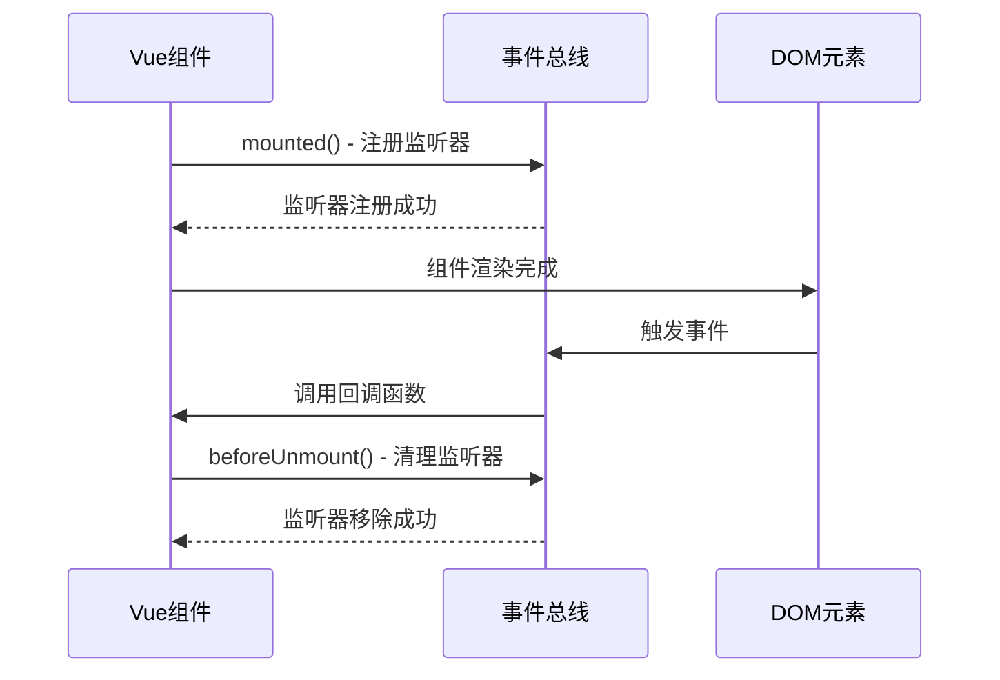
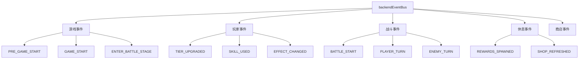

# 事件监听模式

<cite>
**本文档中引用的文件**
- [backendEventBus.js](file://src/backendEventBus.js)
- [frontendEventBus.js](file://src/frontendEventBus.js)
- [SkillCard.vue](file://src/components/global/SkillCard.vue)
- [battle.js](file://src/data/battle.js)
- [MessagePopupScreen.vue](file://src/components/end/MessagePopupScreen.vue)
- [NamedEntity.vue](file://src/components/global/NamedEntity.vue)
- [ParticleEffectManager.vue](file://src/components/global/ParticleEffectManager.vue)
- [ActivatedSkillsBar.vue](file://src/components/battle/ActivatedSkillsBar.vue)
- [OverlaySkillsPanel.vue](file://src/components/battle/OverlaySkillsPanel.vue)
- [cardDomRegistry.js](file://src/utils/cardDomRegistry.js)
- [cardAnimationOrchestrator.js](file://src/utils/cardAnimationOrchestrator.js)
</cite>

## 目录
1. [简介](#简介)
2. [事件总线架构](#事件总线架构)
3. [Vue组件事件监听模式](#vue组件事件监听模式)
4. [backendEventBus事件监听](#backendeventbus事件监听)
5. [事件监听器注册与清理最佳实践](#事件监听器注册与清理最佳实践)
6. [统一监听管理策略](#统一监听管理策略)
7. [性能考虑与优化](#性能考虑与优化)
8. [故障排除指南](#故障排除指南)
9. [总结](#总结)

## 简介

本文档系统性地分析了RTVL项目中的事件监听模式，重点阐述了Vue组件中事件监听器的注册与销毁机制，以及backendEventBus在业务逻辑模块中的事件监听模式。通过分析实际代码示例，展示了如何正确地管理事件监听器以防止内存泄漏，确保应用程序的稳定性和性能。

事件监听模式是现代Web应用中重要的通信机制，特别是在复杂的单页应用中。正确的事件监听器管理不仅关系到功能的正常运行，更是维护应用性能的关键因素。

## 事件总线架构

### 前端事件总线 (frontendEventBus)

前端事件总线专门负责在前端组件之间传递事件和数据，主要用于控制和播放动画，不涉及具体的游戏结算逻辑。

```javascript
// 前端事件总线定义
import mitt from 'mitt';

const frontendEventBus = mitt();

export default frontendEventBus;
```

### 后端事件总线 (backendEventBus)

后端事件总线负责游戏核心逻辑的事件通信，包括游戏状态变更、玩家操作、战斗流程等关键事件。

```javascript
// 后端事件总线定义
import mitt from 'mitt';

const backendEventBus = mitt();

export const EventNames = {
  Game: {
    PRE_GAME_START: 'pre-game-start',
    GAME_START: 'game-start',
    ENTER_BATTLE_STAGE: 'enter-battle-stage',
    ENTER_REST_STAGE: 'enter-rest-stage',
    PRE_BATTLE: 'pre-battle',
    POST_BATTLE: 'post-battle',
    GAME_OVER: 'game-over',
  },
  Player: {
    TIER_UPGRADED: 'player-tier-upgraded',
    ABILITY_CLAIMED: 'player-ability-claimed',
    MONEY_CLAIMED: 'player-money-claimed',
    SKILL_REWARD_CLAIMED: 'player-skill-claimed',
    FRONTIER_UPDATED: 'player-frontier-skills-updated',
    ACTIVATED_SKILLS_UPDATED: 'player-activated-skills-updated',
    EFFECT_CHANGED: 'player-effect-changed',
    SKILL_BURNT: 'player-skill-burnt',
    SKILL_DISCOVERED: 'player-skill-discovered',
    SKILL_USED: 'player-skill-used',
    SKILL_DROPPED: 'player-skill-dropped',
    SKILL_DRAWN: 'player-skill-drawn'
  },
  // ... 更多事件类型
};
```

**章节来源**
- [backendEventBus.js](file://src/backendEventBus.js#L1-L80)
- [frontendEventBus.js](file://src/frontendEventBus.js#L1-L9)

## Vue组件事件监听模式

### 基本监听模式

Vue组件中的事件监听遵循标准的生命周期模式，在`mounted`钩子中注册监听器，在`beforeUnmount`钩子中清理监听器。



**图表来源**
- [SkillCard.vue](file://src/components/global/SkillCard.vue#L100-L110)
- [MessagePopupScreen.vue](file://src/components/end/MessagePopupScreen.vue#L20-L30)

### SkillCard组件示例

SkillCard组件展示了典型的事件监听模式：

```javascript
export default {
  name: 'SkillCard',
  // ... 组件配置
  
  mounted() {
    // 仅在需要时由组件自身注册到全局卡片DOM注册表
    if (this.autoRegisterInRegistry) {
      try { 
        registerCardEl(this.skill?.uniqueID, this.$refs.root, this.skill.uniqueID); 
        this._registeredSelf = true; 
      } catch (_) {}
    }
  },
  
  beforeUnmount() {
    if (this._registeredSelf) {
      try { 
        unregisterCardEl(this.skill?.uniqueID, this.skill.uniqueID); 
      } catch (_) {}
      this._registeredSelf = false;
    }
  },
  
  methods: {
    onMouseEnter() {
      this.hovered = true;
      if (!this.previewMode) frontendEventBus.emit('skill-card-hover-start', this.skill);
    },
    onMouseLeave() {
      this.hovered = false;
      if (!this.previewMode) frontendEventBus.emit('skill-card-hover-end', this.skill);
    }
  }
};
```

### MessagePopupScreen组件示例

MessagePopupScreen组件展示了更复杂的事件监听模式，包括事件参数处理和定时器管理：

```javascript
export default {
  name: 'MessagePopupScreen',
  data() {
    return {
      messages: [],
      messageId: 0
    };
  },
  
  mounted() {
    // 监听pop-message事件
    frontendEventBus.on('pop-message', (message) => {
      this.addMessage(message);
    });
  },
  
  beforeUnmount() {
    // 移除事件监听
    frontendEventBus.off('pop-message');
  },
  
  methods: {
    addMessage(message) {
      const id = this.messageId++;
      const newMessage = {
        id,
        text: message.text,
        type: message.type || 'info',
        duration: message.duration || 3000
      };
      
      this.messages.push(newMessage);
      
      // 设置自动移除
      setTimeout(() => {
        this.removeMessage(id);
      }, newMessage.duration);
    }
  }
};
```

**章节来源**
- [SkillCard.vue](file://src/components/global/SkillCard.vue#L100-L120)
- [MessagePopupScreen.vue](file://src/components/end/MessagePopupScreen.vue#L10-L60)

## backendEventBus事件监听

### 战斗流程监听器初始化

backendEventBus在battle.js中初始化了一系列战斗流程监听器，这些监听器负责处理游戏的核心逻辑：

```javascript
export function initializeBattleFlowListeners() {
  // 战斗开始
  backendEventBus.on(EventNames.Battle.BATTLE_START, () => {
    startBattle();
  });

  // 玩家回合开始
  backendEventBus.on(EventNames.Battle.PLAYER_TURN, () => {
    startPlayerTurn();
  });

  // 玩家使用技能（前端操作）
  backendEventBus.on(EventNames.PlayerOperations.PLAYER_USE_SKILL, (uniqueID) => {
    const skill = gameState.player.frontierSkills.find(s => s.uniqueID === uniqueID);
    if (skill) {
      if(gameState.gameStage === 'battle' && gameState.isPlayerTurn && skill.canUse(gameState.player)) {
        useSkill(skill);
      } else {
        console.warn(`技能使用失败：技能 ${skill.name} 当前无法使用。`);
      }
    }
  });

  // 玩家结束回合（前端操作）
  backendEventBus.on(EventNames.PlayerOperations.PLAYER_END_TURN, () => {
    endPlayerTurn();
  });
}
```

### 事件监听器的分类管理

backendEventBus根据事件类型进行了分类管理，便于统一管理和清理：



**图表来源**
- [backendEventBus.js](file://src/backendEventBus.js#L4-L70)
- [battle.js](file://src/data/battle.js#L445-L505)

**章节来源**
- [battle.js](file://src/data/battle.js#L445-L505)
- [backendEventBus.js](file://src/backendEventBus.js#L4-L70)

## 事件监听器注册与清理最佳实践

### 安全的监听器注册模式

```javascript
// 推荐的安全注册模式
mounted() {
  // 1. 检查组件是否处于激活状态
  if (this.isActive) {
    // 2. 使用箭头函数保持this上下文
    this.eventHandler = (data) => {
      this.handleEvent(data);
    };
    
    // 3. 注册事件监听器
    frontendEventBus.on('specific-event', this.eventHandler);
  }
},
```

### 完整的清理模式

```javascript
beforeUnmount() {
  // 1. 检查监听器是否存在
  if (this.eventHandler) {
    // 2. 使用相同的处理器函数进行清理
    frontendEventBus.off('specific-event', this.eventHandler);
    
    // 3. 清空处理器引用
    this.eventHandler = null;
  }
  
  // 4. 清理其他资源
  this.cleanupOtherResources();
}
```

### 错误处理和异常保护

```javascript
beforeUnmount() {
  try {
    // 使用try-catch保护清理过程
    frontendEventBus.off('card-transfer-start', this.onTransferStart);
    frontendEventBus.off('card-transfer-end', this.onTransferEnd);
    
    // 清理DOM注册表
    for (const id of Object.keys(this.cardRefs)) {
      unregisterCardEl(id, 'activated-skills-bar');
    }
  } catch (error) {
    console.error('清理事件监听器时发生错误:', error);
  }
}
```

**章节来源**
- [ActivatedSkillsBar.vue](file://src/components/battle/ActivatedSkillsBar.vue#L62-L96)
- [OverlaySkillsPanel.vue](file://src/components/battle/OverlaySkillsPanel.vue#L85-L95)

## 统一监听管理策略

### 事件订阅集合管理

为了更好地管理多个事件监听器，可以使用统一的订阅集合：

```javascript
export default {
  data() {
    return {
      eventSubscriptions: new Map(),
      isActive: true
    };
  },
  
  mounted() {
    this.registerEventListeners();
  },
  
  beforeUnmount() {
    this.cleanupEventListeners();
  },
  
  methods: {
    registerEventListeners() {
      const subscriptions = [
        { event: 'card-transfer-start', handler: this.onTransferStart },
        { event: 'card-transfer-end', handler: this.onTransferEnd },
        { event: 'start-card-selection', handler: this.onStartCardSelection }
      ];
      
      subscriptions.forEach(({ event, handler }) => {
        frontendEventBus.on(event, handler);
        this.eventSubscriptions.set(event, handler);
      });
    },
    
    cleanupEventListeners() {
      this.eventSubscriptions.forEach((handler, event) => {
        frontendEventBus.off(event, handler);
      });
      this.eventSubscriptions.clear();
    }
  }
};
```

### 上下文一致性保证

```javascript
export default {
  data() {
    return {
      handlers: {
        hoverStart: null,
        hoverEnd: null,
        clickHandler: null
      }
    };
  },
  
  mounted() {
    // 使用箭头函数确保this上下文
    this.handlers.hoverStart = (skill) => {
      this.onHoverStart(skill);
    };
    
    this.handlers.hoverEnd = (skill) => {
      this.onHoverEnd(skill);
    };
    
    frontendEventBus.on('skill-card-hover-start', this.handlers.hoverStart);
    frontendEventBus.on('skill-card-hover-end', this.handlers.hoverEnd);
  },
  
  beforeUnmount() {
    // 使用存储的处理器进行清理
    frontendEventBus.off('skill-card-hover-start', this.handlers.hoverStart);
    frontendEventBus.off('skill-card-hover-end', this.handlers.hoverEnd);
    
    // 清空处理器引用
    this.handlers = {};
  }
};
```

### 条件监听管理

```javascript
export default {
  data() {
    return {
      conditionalListeners: new Map()
    };
  },
  
  methods: {
    addConditionalListener(event, condition, handler) {
      if (condition) {
        frontendEventBus.on(event, handler);
        this.conditionalListeners.set(event, handler);
      }
    },
    
    removeConditionalListener(event) {
      const handler = this.conditionalListeners.get(event);
      if (handler) {
        frontendEventBus.off(event, handler);
        this.conditionalListeners.delete(event);
      }
    },
    
    updateConditionalListeners() {
      // 根据条件动态添加或移除监听器
      this.addConditionalListener(
        'dynamic-event', 
        this.shouldListenToDynamicEvent,
        this.handleDynamicEvent
      );
    }
  }
};
```

## 性能考虑与优化

### 监听器数量监控

```javascript
export default {
  data() {
    return {
      listenerCounts: {
        frontend: 0,
        backend: 0
      }
    };
  },
  
  methods: {
    countFrontendListeners() {
      // 实现监听器计数逻辑
      const listeners = frontendEventBus.all;
      this.listenerCounts.frontend = Object.keys(listeners).length;
    },
    
    optimizeListenerUsage() {
      // 实现监听器优化策略
      if (this.listenerCounts.frontend > MAX_LISTENERS) {
        this.reduceListenerUsage();
      }
    }
  }
};
```

### 内存泄漏预防

```javascript
export default {
  data() {
    return {
      cleanupTasks: []
    };
  },
  
  beforeUnmount() {
    // 执行所有清理任务
    this.cleanupTasks.forEach(task => {
      try {
        task();
      } catch (error) {
        console.warn('清理任务执行失败:', error);
      }
    });
    
    // 清空清理任务列表
    this.cleanupTasks = [];
  },
  
  methods: {
    addCleanupTask(task) {
      this.cleanupTasks.push(task);
    }
  }
};
```

## 故障排除指南

### 常见问题诊断

1. **监听器未正确移除**
   ```javascript
   // 问题：监听器重复注册
   mounted() {
     frontendEventBus.on('event-name', this.handler); // 重复调用此行
   }
   
   // 解决方案：检查监听器是否已存在
   mounted() {
     if (!this.isListenerRegistered) {
       frontendEventBus.on('event-name', this.handler);
       this.isListenerRegistered = true;
     }
   }
   ```

2. **上下文丢失问题**
   ```javascript
   // 问题：this指向错误
   mounted() {
     frontendEventBus.on('event-name', function(data) {
       this.someMethod(); // this指向错误
     });
   }
   
   // 解决方案：使用箭头函数
   mounted() {
     frontendEventBus.on('event-name', (data) => {
       this.someMethod(); // this指向正确
     });
   }
   ```

3. **事件总线引用丢失**
   ```javascript
   // 问题：事件总线被意外修改
   export default {
     mounted() {
       // 错误：重新赋值事件总线
       frontendEventBus = newEventBus();
     }
   }
   ```

### 调试工具和技巧

```javascript
// 调试工具：监听器追踪
export function trackEventListeners(eventBus) {
  const originalOn = eventBus.on;
  const originalOff = eventBus.off;
  
  eventBus.on = function(event, handler) {
    console.log(`监听器注册: ${event}`);
    return originalOn.call(this, event, handler);
  };
  
  eventBus.off = function(event, handler) {
    console.log(`监听器移除: ${event}`);
    return originalOff.call(this, event, handler);
  };
}
```

**章节来源**
- [cardDomRegistry.js](file://src/utils/cardDomRegistry.js#L1-L29)
- [cardAnimationOrchestrator.js](file://src/utils/cardAnimationOrchestrator.js#L432-L468)

## 总结

通过本文档的分析，我们可以看到RTVL项目中采用了完善的事件监听模式管理体系：

1. **清晰的职责分离**：前端事件总线专注于UI交互和动画控制，后端事件总线处理游戏逻辑和状态管理

2. **标准化的生命周期管理**：Vue组件严格遵循mounted和beforeUnmount生命周期进行监听器的注册和清理

3. **安全的错误处理**：所有清理操作都包含错误处理机制，确保即使出现异常也不会影响应用稳定性

4. **统一的管理模式**：通过事件订阅集合和上下文一致性保证，实现了监听器的统一管理

5. **性能优化考虑**：包含了监听器数量监控和内存泄漏预防机制

这种事件监听模式不仅保证了应用的功能完整性，也为未来的扩展和维护奠定了良好的基础。开发者应该遵循这些最佳实践，确保事件监听器的正确管理和使用，从而构建稳定、高效的Web应用程序。