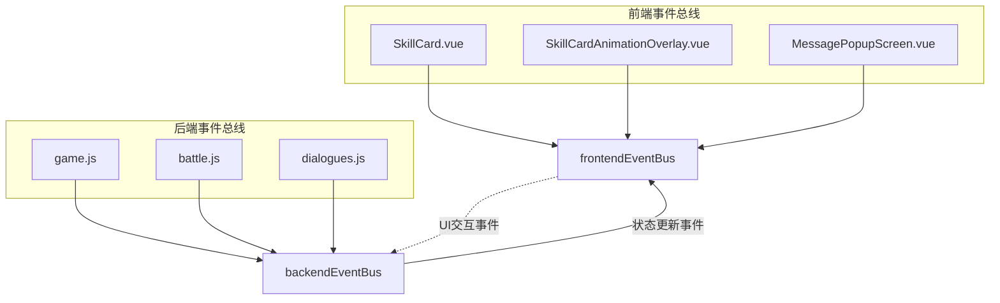
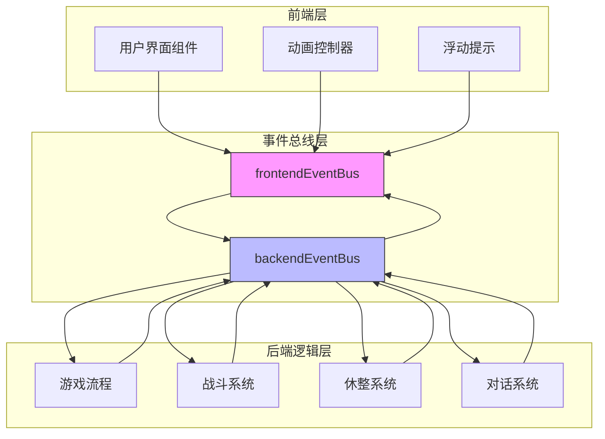
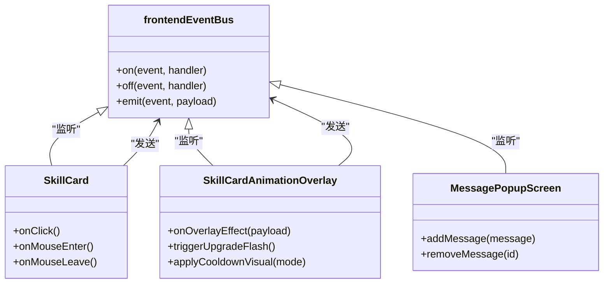
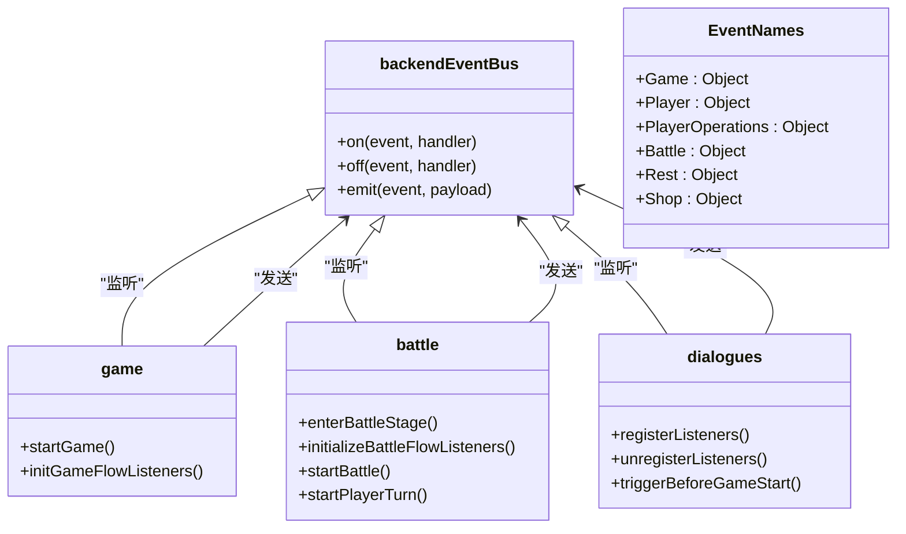
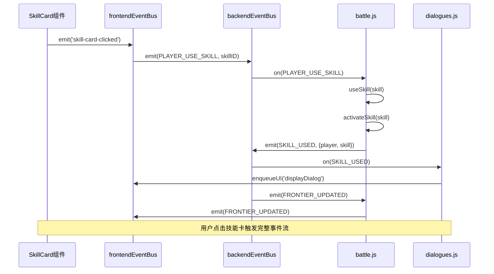
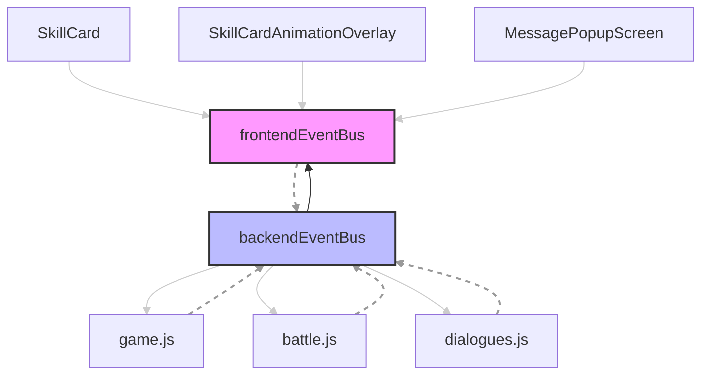

# 事件通信机制

<cite>
**本文档引用的文件**
- [frontendEventBus.js](file://src/frontendEventBus.js)
- [backendEventBus.js](file://src/backendEventBus.js)
- [game.js](file://src/game.js)
- [battle.js](file://src/data/battle.js)
- [dialogues.js](file://src/data/dialogues.js)
- [SkillCard.vue](file://src/components/global/SkillCard.vue)
- [SkillCardAnimationOverlay.vue](file://src/components/global/SkillCardAnimationOverlay.vue)
- [MessagePopupScreen.vue](file://src/components/end/MessagePopupScreen.vue)
</cite>

## 目录
1. [简介](#简介)
2. [项目结构](#项目结构)
3. [核心组件](#核心组件)
4. [架构概述](#架构概述)
5. [详细组件分析](#详细组件分析)
6. [依赖分析](#依赖分析)
7. [性能考虑](#性能考虑)
8. [故障排除指南](#故障排除指南)
9. [结论](#结论)

## 简介
本文档详细说明了基于mitt库实现的双事件总线通信机制，包括frontendEventBus和backendEventBus的职责划分、事件类型枚举、事件监听注册方式、异步消息广播流程，并结合game.js中的事件分发逻辑进行分析。同时提供事件监听与销毁的最佳实践，避免内存泄漏。

## 项目结构
该项目采用前后端分离的事件通信架构，通过两个独立的事件总线分别处理UI交互和游戏逻辑事件。前端事件总线负责UI动画和用户交互，后端事件总线负责游戏状态管理和业务逻辑处理。

**图示来源**
- [frontendEventBus.js](file://src/frontendEventBus.js)
- [backendEventBus.js](file://src/backendEventBus.js)
- [SkillCard.vue](file://src/components/global/SkillCard.vue)
- [game.js](file://src/game.js)

**本节来源**
- [frontendEventBus.js](file://src/frontendEventBus.js)
- [backendEventBus.js](file://src/backendEventBus.js)

## 核心组件
系统核心由两个事件总线构成：frontendEventBus处理UI交互事件（如技能点击、按钮操作），backendEventBus处理游戏逻辑事件（如回合开始、战斗结束）。这种分离设计实现了关注点分离，确保UI交互不影响核心游戏逻辑。

**本节来源**
- [frontendEventBus.js](file://src/frontendEventBus.js#L1-L7)
- [backendEventBus.js](file://src/backendEventBus.js#L1-L80)

## 架构概述
系统采用双事件总线架构，frontendEventBus专注于前端组件间的通信，主要用于控制和播放动画；backendEventBus则负责后端游戏逻辑的状态管理和流程控制。两者通过明确定义的事件接口进行交互，形成清晰的通信边界。

**图示来源**
- [frontendEventBus.js](file://src/frontendEventBus.js)
- [backendEventBus.js](file://src/backendEventBus.js)
- [game.js](file://src/game.js)
- [battle.js](file://src/data/battle.js)

## 详细组件分析

### 前端事件总线分析
frontendEventBus是一个基于mitt库的轻量级事件总线，专门用于前端组件之间的通信。它不涉及任何游戏结算逻辑，主要负责UI交互和动画控制。

**图示来源**
- [frontendEventBus.js](file://src/frontendEventBus.js#L1-L7)
- [SkillCard.vue](file://src/components/global/SkillCard.vue#L1-L236)
- [SkillCardAnimationOverlay.vue](file://src/components/global/SkillCardAnimationOverlay.vue#L1-L163)

**本节来源**
- [frontendEventBus.js](file://src/frontendEventBus.js#L1-L7)
- [SkillCard.vue](file://src/components/global/SkillCard.vue#L1-L236)

### 后端事件总线分析
backendEventBus管理所有游戏核心逻辑事件，包括游戏阶段转换、战斗流程、玩家状态变更等。它定义了详细的事件枚举，确保前后端通信的类型安全。

**图示来源**
- [backendEventBus.js](file://src/backendEventBus.js#L1-L80)
- [game.js](file://src/game.js#L1-L119)
- [battle.js](file://src/data/battle.js#L1-L553)
- [dialogues.js](file://src/data/dialogues.js#L1-L344)

**本节来源**
- [backendEventBus.js](file://src/backendEventBus.js#L1-L80)
- [game.js](file://src/game.js#L1-L119)

### 典型事件流分析
以下是一个完整的用户操作事件流示例，展示了从UI交互到游戏逻辑处理的完整过程。

**图示来源**
- [SkillCard.vue](file://src/components/global/SkillCard.vue#L1-L236)
- [frontendEventBus.js](file://src/frontendEventBus.js#L1-L7)
- [backendEventBus.js](file://src/backendEventBus.js#L1-L80)
- [battle.js](file://src/data/battle.js#L1-L553)
- [dialogues.js](file://src/data/dialogues.js#L1-L344)

**本节来源**
- [SkillCard.vue](file://src/components/global/SkillCard.vue#L1-L236)
- [battle.js](file://src/data/battle.js#L1-L553)

## 依赖分析
系统通过双事件总线实现了松耦合的架构设计。前端组件仅依赖frontendEventBus进行UI通信，后端逻辑模块依赖backendEventBus处理游戏状态。两个总线之间通过预定义的事件类型进行有限交互，确保了系统的可维护性和扩展性。

**图示来源**
- [frontendEventBus.js](file://src/frontendEventBus.js)
- [backendEventBus.js](file://src/backendEventBus.js)
- [SkillCard.vue](file://src/components/global/SkillCard.vue)
- [game.js](file://src/game.js)
- [battle.js](file://src/data/battle.js)

**本节来源**
- [frontendEventBus.js](file://src/frontendEventBus.js)
- [backendEventBus.js](file://src/backendEventBus.js)
- [game.js](file://src/game.js)

## 性能考虑
双事件总线架构在性能方面表现出色。frontendEventBus专注于高频的UI事件处理，避免了后端逻辑的阻塞；backendEventBus则处理低频但关键的游戏状态变更，确保了核心逻辑的稳定性。事件监听器的正确注册和销毁机制有效防止了内存泄漏问题。

## 故障排除指南
当遇到事件通信问题时，应首先检查事件监听器的注册和销毁是否匹配。确保在组件销毁时调用off方法移除事件监听，特别是在使用frontendEventBus时。对于backendEventBus，需要验证事件名称的正确性以及事件处理函数的执行上下文。

**本节来源**
- [MessagePopupScreen.vue](file://src/components/end/MessagePopupScreen.vue#L1-L119)
- [SkillCardAnimationOverlay.vue](file://src/components/global/SkillCardAnimationOverlay.vue#L1-L163)
- [dialogues.js](file://src/data/dialogues.js#L1-L344)

## 结论
双事件总线通信机制有效地分离了UI交互和游戏逻辑，提高了代码的可维护性和可测试性。frontendEventBus和backendEventBus的职责划分清晰，通过明确定义的事件接口进行通信，形成了良好的架构边界。这种设计模式适用于复杂的游戏系统开发，值得在类似项目中推广使用。