# 异常处理策略

<cite>
**本文档引用的文件**
- [animationInstructionHelpers.js](file://src/data/animationInstructionHelpers.js)
- [animationSequencer.js](file://src/data/animationSequencer.js)
- [gameState.js](file://src/data/gameState.js)
- [frontendEventBus.js](file://src/frontendEventBus.js)
- [backendEventBus.js](file://src/backendEventBus.js)
- [battleLogUtils.js](file://src/data/battleLogUtils.js)
</cite>

## 目录
1. [简介](#简介)
2. [状态同步机制](#状态同步机制)
3. [异常处理机制](#异常处理机制)
4. [事件丢失与重复处理](#事件丢失与重复处理)
5. [事件顺序错乱应对](#事件顺序错乱应对)
6. [日志记录与状态快照](#日志记录与状态快照)
7. [错误边界与恢复机制](#错误边界与恢复机制)
8. [调试工具建议](#调试工具建议)
9. [结论](#结论)

## 简介
本文档系统化地描述了游戏系统中状态同步过程的异常处理机制。系统采用前后端分离的状态管理架构，通过事件驱动和指令队列机制确保状态一致性。文档重点分析了在状态同步过程中可能出现的事件丢失、重复事件和事件顺序错乱等问题的应对策略，以及如何通过日志记录、错误边界和状态快照保障系统稳定性。

## 状态同步机制

**图示来源**
- [animationInstructionHelpers.js](file://src/data/animationInstructionHelpers.js#L182-L222)
- [gameState.js](file://src/data/gameState.js#L0-L75)

**本节来源**
- [animationInstructionHelpers.js](file://src/data/animationInstructionHelpers.js#L0-L30)
- [gameState.js](file://src/data/gameState.js#L0-L75)

## 异常处理机制

```mermaid
sequenceDiagram
participant Backend as 后端状态
participant Sync as 状态同步
participant Display as 前端显示
participant Logger as 日志系统
Backend->>Sync : 状态变更
Sync->>Sync : 标记为脏状态
Sync->>Sync : 计划同步检查
Sync->>Sync : 捕获状态快照
Sync->>Display : 应用投影显示
alt 成功
Display-->>Sync : 成功更新
else 失败
Display--x Sync : 抛出异常
Sync->>Logger : 记录错误日志
Logger-->>Sync : 错误已记录
end
Sync->>Sequencer : 指令完成
```

**图示来源**
- [animationInstructionHelpers.js](file://src/data/animationInstructionHelpers.js#L218-L261)
- [animationSequencer.js](file://src/data/animationSequencer.js#L0-L135)

**本节来源**
- [animationInstructionHelpers.js](file://src/data/animationInstructionHelpers.js#L182-L261)
- [animationSequencer.js](file://src/data/animationSequencer.js#L0-L135)

## 事件丢失与重复处理

**图示来源**
- [animationInstructionHelpers.js](file://src/data/animationInstructionHelpers.js#L218-L261)
- [frontendEventBus.js](file://src/frontendEventBus.js#L0-L9)

**本节来源**
- [animationInstructionHelpers.js](file://src/data/animationInstructionHelpers.js#L218-L261)
- [backendEventBus.js](file://src/backendEventBus.js#L0-L80)

## 事件顺序错乱应对

**图示来源**
- [animationSequencer.js](file://src/data/animationSequencer.js#L0-L135)
- [animationInstructionHelpers.js](file://src/data/animationInstructionHelpers.js#L182-L222)

**本节来源**
- [animationSequencer.js](file://src/data/animationSequencer.js#L0-L135)
- [animationInstructionHelpers.js](file://src/data/animationInstructionHelpers.js#L182-L222)

## 日志记录与状态快照

**图示来源**
- [battleLogUtils.js](file://src/data/battleLogUtils.js#L0-L73)
- [animationInstructionHelpers.js](file://src/data/animationInstructionHelpers.js#L182-L222)

**本节来源**
- [battleLogUtils.js](file://src/data/battleLogUtils.js#L0-L73)
- [animationInstructionHelpers.js](file://src/data/animationInstructionHelpers.js#L30-L69)

## 错误边界与恢复机制

**图示来源**
- [animationInstructionHelpers.js](file://src/data/animationInstructionHelpers.js#L218-L261)
- [animationSequencer.js](file://src/data/animationSequencer.js#L0-L135)

**本节来源**
- [animationInstructionHelpers.js](file://src/data/animationInstructionHelpers.js#L218-L261)
- [animationSequencer.js](file://src/data/animationSequencer.js#L130-L135)

## 调试工具建议
为帮助开发者快速定位同步问题，建议使用以下调试工具：

1. **事件日志追踪**：通过 `battleLogUtils.js` 提供的日志工具，可以追踪所有战斗相关事件的执行顺序和内容。开发者可以使用不同类型的日志（玩家行动、敌人行动、系统事件等）来区分不同来源的事件。

2. **状态变更历史回放**：利用 `captureSnapshot()` 函数定期捕获后端状态快照，可以实现状态变更的历史回放功能。通过比较不同时间点的状态快照，可以准确识别状态同步问题的发生时机和原因。

3. **指令队列可视化**：`animationSequencer.js` 中的指令队列机制提供了完整的指令执行顺序控制。开发者可以通过监控指令队列的状态（pending、running、finished）来理解事件处理的时序关系。

4. **错误监控**：系统在关键的异常处理点（如 `applyProjectionToDisplay` 函数）都包含了错误捕获和日志记录机制。开发者可以通过查看控制台错误日志来快速定位同步过程中的问题。

5. **脏状态监控**：`backendStateDirty` 标志位和 `registerBackendStateWatcher` 函数提供了后端状态变更的监控能力。开发者可以利用这些机制来验证状态变更是否被正确检测和处理。

**本节来源**
- [battleLogUtils.js](file://src/data/battleLogUtils.js#L0-L73)
- [animationInstructionHelpers.js](file://src/data/animationInstructionHelpers.js#L182-L261)

## 结论
本系统通过精心设计的状态同步和异常处理机制，有效保障了游戏状态的一致性和稳定性。核心机制包括：

1. **前后端状态分离**：通过 `backendGameState` 和 `displayGameState` 两个独立的状态对象，实现了逻辑与显示的分离。

2. **自动同步机制**：利用 Vue 的 `watch` 功能监听后端状态变化，自动触发状态同步，确保显示层及时更新。

3. **指令队列控制**：通过 `animationSequencer` 实现了指令的有序执行，使用 `waitTags` 机制确保状态同步指令的优先执行。

4. **异常安全处理**：在关键的同步操作中使用 try-catch 机制捕获异常，并通过日志记录确保问题可追踪，同时保证系统可以继续运行。

5. **状态快照技术**：通过 `captureSnapshot` 和 `applyProjectionToDisplay` 函数实现了高效的状态同步，只传输和更新必要的状态数据。

这些机制共同构成了一个健壮的状态同步系统，能够有效处理事件丢失、重复和顺序错乱等问题，确保游戏状态不会进入不一致状态。