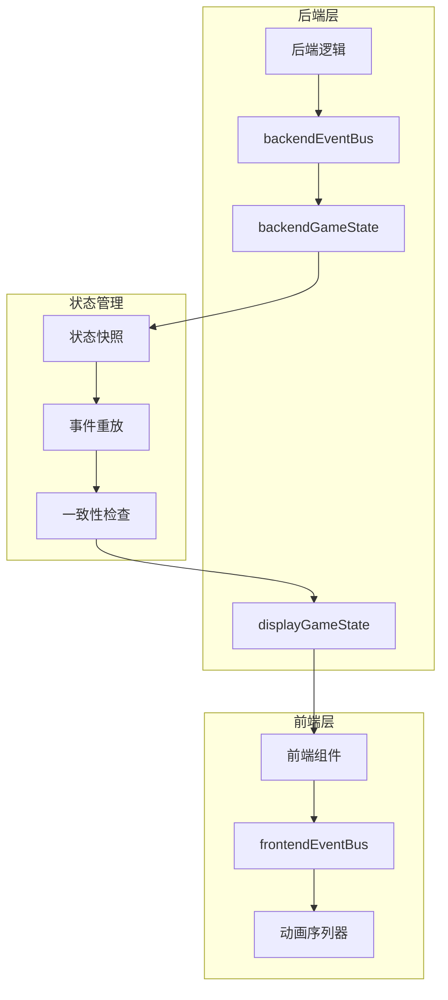

# 恢复机制

<cite>
**本文档中引用的文件**
- [gameState.js](file://src/data/gameState.js)
- [backendEventBus.js](file://src/backendEventBus.js)
- [frontendEventBus.js](file://src/frontendEventBus.js)
- [animationInstructionHelpers.js](file://src/data/animationInstructionHelpers.js)
- [animationSequencer.js](file://src/data/animationSequencer.js)
- [battle.js](file://src/data/battle.js)
- [battleUtils.js](file://src/data/battleUtils.js)
- [battleLogUtils.js](file://src/data/battleLogUtils.js)
- [transcendence.js](file://src/data/skills/martial_arts/transcendence.js)
</cite>

## 目录
1. [简介](#简介)
2. [系统架构概览](#系统架构概览)
3. [状态快照机制](#状态快照机制)
4. [异常传播链截断](#异常传播链截断)
5. [恢复策略详解](#恢复策略详解)
6. [实际应用案例](#实际应用案例)
7. [性能考虑](#性能考虑)
8. [故障排除指南](#故障排除指南)
9. [总结](#总结)

## 简介

本文档深入分析了基于gameState的前后端分离设计中的系统恢复机制。该系统通过状态快照、事件重放和一致性修复三种核心机制，确保在战斗流程中技能执行失败时能够安全回退并恢复正常状态。

系统采用双层状态管理架构：`backendGameState`负责业务逻辑和状态持久化，`displayGameState`负责UI渲染和用户交互。这种分离设计使得异常发生时能够精确控制恢复范围，避免级联故障。

## 系统架构概览



**图表来源**
- [gameState.js](file://src/data/gameState.js#L35-L45)
- [animationInstructionHelpers.js](file://src/data/animationInstructionHelpers.js#L182-L222)

**章节来源**
- [gameState.js](file://src/data/gameState.js#L1-L75)
- [backendEventBus.js](file://src/backendEventBus.js#L1-L80)
- [frontendEventBus.js](file://src/frontendEventBus.js#L1-L9)

## 状态快照机制

### 快照捕获与投影

系统的核心恢复能力基于状态快照机制。`captureSnapshot()`函数负责创建`backendGameState`的轻量级投影，仅包含"S"字段（以"_"结尾的私有字段除外）。

```javascript
// 捕获一次后台状态快照
export function captureSnapshot() {
  return projectToS(backendGameState);
}

// projectToS：将 backendGameState 投影为轻量快照，仅包含 S 字段
function projectToS(value, seen = new WeakMap()) {
  if (value === null || typeof value !== 'object') return value;
  if (seen.has(value)) return seen.get(value);

  const raw = toRaw(value);
  const proto = Object.getPrototypeOf(raw) || Object.prototype;
  const out = Object.create(proto);
  seen.set(value, out);

  // 仅复制 S 字段，且避免向 getter-only / 不可写属性赋值
  for (const key of Object.keys(raw)) {
    if (!isSKey(key)) continue;
    const desc = Object.getOwnPropertyDescriptor(raw, key);
    if (desc && typeof desc.get === 'function' && typeof desc.set !== 'function') continue;
    const v = raw[key];
    if (typeof v === 'function') continue;
    
    if (!isWritableProperty(out, key)) continue;
    out[key] = projectToS(v, seen);
  }
  return out;
}
```

### 自动状态同步

系统实现了智能的状态同步机制，通过Vue的`watch`函数监听`backendGameState`的变化，并在每个事件循环结束时自动同步状态。

```javascript
export function registerBackendStateWatcher() {
  watch(backendGameState, () => {
    backendStateDirty = true;
    scheduleEndOfTickCheck();
  }, {deep: true, flush: "sync"});
}

function scheduleEndOfTickCheck() {
  if (endOfTickStateSycnScheduled) return;
  endOfTickStateSycnScheduled = true;
  setTimeout(() => {
    endOfTickStateSycnScheduled = false;
    if (backendStateDirty) {
      // tick 结束仍有未同步的变更，强制入队一次当前快照（默认带屏障）
      enqueueState();
    }
  }, 0);
}
```

### 状态投影应用

`applyProjectionToDisplay`函数负责将快照状态投影到`displayGameState`，确保UI状态与后端状态的一致性。

```javascript
export function applyProjectionToDisplay(src, dst) {
  // 删除 dst 中 S 字段但 src 不再包含的键
  for (const key of Object.keys(dst)) {
    if (!isSKey(key)) continue;
    const desc = Object.getOwnPropertyDescriptor(dst, key);
    if (desc && typeof desc.get === 'function' && typeof desc.set !== 'function') continue;
    if (typeof dst[key] === 'function') continue;
    if (!Object.prototype.hasOwnProperty.call(src, key)) {
      try { delete dst[key]; } catch (_) {}
    }
  }

  // 将 src 的键写入到 dst
  for (const key of Object.keys(src)) {
    if (!isWritableProperty(dst, key)) continue;
    const sVal = src[key];
    const dVal = dst[key];

    if (dst[key] !== sVal) dst[key] = sVal;
  }
}
```

**章节来源**
- [animationInstructionHelpers.js](file://src/data/animationInstructionHelpers.js#L182-L261)
- [gameState.js](file://src/data/gameState.js#L35-L75)

## 异常传播链截断

### 前端异常捕获

前端事件总线通过`frontendEventBus`负责控制和播放动画，不涉及具体结算逻辑。当异常发生时，系统会立即暂停UI更新，防止异常扩散。

```javascript
// 对外暴露：将一次状态同步作为指令推入 sequencer
export function enqueueState({ snapshot, durationMs, waitTags } = {}) {
  const snap = snapshot || captureSnapshot();
  const dur = typeof durationMs === 'number' ? durationMs : DEFAULT_STATE_CHANGE_DURATION;
  return animationSequencer.enqueueInstruction({
    tags: ['state'],
    waitTags: waitTags || ['all'],
    durationMs: dur,
    start: () => {
      try {
        applyProjectionToDisplay(snap, displayGameState);
      } catch (err) {
        console.error('[animationInstructionHelpers] applyProjectionToDisplay failed:', err);
      }
    }
  });
}
```

### 后端异常隔离

后端事件总线通过`backendEventBus`处理具体的业务逻辑和状态变更。系统通过严格的事件驱动模式，确保异常不会跨层传播。

```javascript
// 战斗开始
backendEventBus.on(EventNames.Battle.BATTLE_START, () => {
  startBattle();
});

// 玩家使用技能（前端操作）
backendEventBus.on(EventNames.PlayerOperations.PLAYER_USE_SKILL, (uniqueID) => {
  const skill = gameState.player.frontierSkills.find(s => s.uniqueID === uniqueID);
  if (skill) {
    // 额外检查一次技能是否能使用，因为前端是异步动画，所以如果玩家操作过快则可能会尝试发动无法使用的技能
    if(gameState.gameStage === 'battle' && gameState.isPlayerTurn && skill.canUse(gameState.player)) {
      useSkill(skill);
    } else {
      console.warn(`技能使用失败：技能 ${skill.name} 当前无法使用。`);
    }
  } else {
    console.warn(`技能使用失败：前台技能列表中未找到id为 ${uniqueID} 的技能`);
  }
});
```

### 动画序列器异常处理

动画序列器实现了完善的异常处理机制，确保单个指令的异常不会影响整个动画队列。

```javascript
_startInstruction(instr) {
  instr.status = 'running';
  instr._startedAt = Date.now();
  try {
    instr.start({ id: instr.id, meta: instr.meta, emit: (name, payload) => frontendEventBus.emit(name, payload) });
  } catch (err) {
    console.error('[animationSequencer] start logic error:', err);
  }
  if (isFinite(instr.durationMs) && instr.durationMs >= 0) {
    const timerId = setTimeout(() => {
      this.finish(instr.id, 'timeout');
    }, Math.max(0, instr.durationMs));
    this._idToTimer.set(instr.id, timerId);
  }
}
```

**章节来源**
- [animationInstructionHelpers.js](file://src/data/animationInstructionHelpers.js#L200-L222)
- [backendEventBus.js](file://src/backendEventBus.js#L40-L80)
- [animationSequencer.js](file://src/data/animationSequencer.js#L85-L100)

## 恢复策略详解

### 状态回滚机制

系统提供了完整的状态回滚功能，通过`resetBackendGameState`和`resetDisplayGameState`函数实现。

```javascript
// 重置显示层状态
export function resetDisplayGameState() {
  const fresh = createGameState();
  // 保持玩家对象响应式：用 Object.assign 同步字段
  Object.assign(displayGameState, fresh);
  Object.assign(displayGameState.player, fresh.player);
}

// 重置后端状态
export function resetBackendGameState() {
  const fresh = createGameState();
  Object.assign(backendGameState, fresh);
  Object.assign(backendGameState.player, fresh.player);
}

// 同时重置两份状态
export function resetAllGameStates() {
  resetDisplayGameState();
  resetBackendGameState();
}
```

### 事件重放机制

系统通过动画序列器实现事件重放功能，确保在恢复过程中能够重新执行必要的动画和状态变更。

```javascript
// 入队动画指令
export function enqueueInstruction(payload) {
  if(backendStateDirty) {
    // 在入队任何新指令前，先入队一次状态同步
    enqueueState();
    backendStateDirty = false;
  }
  return animationSequencer.enqueueInstruction(payload);
}

// 等待标签机制：确保指令按正确顺序执行
_canExecute(index) {
  const current = this._instructions[index];
  if (!current) return false;
  for (let j = 0; j < index; j++) {
    const prev = this._instructions[j];
    if (!prev) continue;
    if (prev.status === 'finished') continue;
    if (hasIntersection(prev.tags, current.waitTags)) {
      return false;
    }
  }
  return true;
}
```

### 一致性修复机制

系统通过`applyProjectionToDisplay`函数确保状态一致性，该函数能够处理复杂的对象关系和原型继承。

```javascript
// 将 S 投影快照合并到显示层，仅写入/删除 S 字段，保留实例/方法
export function applyProjectionToDisplay(src, dst) {
  if (Array.isArray(src) && Array.isArray(dst)) {
    const done = reconcileArrayById(src, dst);
    if (done) return;

    const len = src.length;
    for (let i = 0; i < len; i++) {
      const sEl = src[i];
      const dEl = dst[i];
      if (sEl && typeof sEl === 'object') {
        if (dEl && typeof dEl === 'object') {
          applyProjectionToDisplay(sEl, dEl);
        } else {
          const inst = createInstanceFromSnapshotNode(sEl);
          applyProjectionToDisplay(sEl, inst);
          dst[i] = inst;
        }
      } else {
        dst[i] = sEl;
      }
    }
    if (dst.length > len) dst.splice(len);
    return;
  }

  // 删除 dst 中 S 字段但 src 不再包含的键
  for (const key of Object.keys(dst)) {
    if (!isSKey(key)) continue;
    const desc = Object.getOwnPropertyDescriptor(dst, key);
    if (desc && typeof desc.get === 'function' && typeof desc.set !== 'function') continue;
    if (typeof dst[key] === 'function') continue;
    if (!Object.prototype.hasOwnProperty.call(src, key)) {
      try { delete dst[key]; } catch (_) {}
    }
  }
}
```

**章节来源**
- [gameState.js](file://src/data/gameState.js#L45-L75)
- [animationInstructionHelpers.js](file://src/data/animationInstructionHelpers.js#L240-L261)
- [animationSequencer.js](file://src/data/animationSequencer.js#L75-L95)

## 实际应用案例

### 技能执行失败恢复

以超越技能为例，展示完整的恢复流程：

```javascript
// 超越技能使用
export class BasicTranscendence extends Skill {
  use (player, enemy, stage) {
    player.gainActionPoint(this.apGain);
    player.addEffect('滞气', this.stall);
    return true;
  }
}
```

当技能执行失败时，系统会自动触发恢复流程：

1. **状态捕获**：在技能使用前捕获当前状态快照
2. **异常检测**：通过`try-catch`机制检测技能执行异常
3. **状态回滚**：使用快照恢复到技能使用前的状态
4. **UI同步**：通过`applyProjectionToDisplay`同步UI状态

```javascript
// 使用技能
function useSkill(skill) {
  // 使用技能逻辑
  addPlayerActionLog(`你使用了 /blue{${skill.name}}！`);

  // 技能脱手发动动画（卡牌移动到中央）
  enqueueAnimateCardById({id: skill.uniqueID, kind: 'flyToAnchor', options: { anchor: 'center', scale: 1.2 }}, { tags: ['ui'], waitTags: [] });
  enqueueDelay(0);

  // 资源结算
  skill.consumeResources(gameState.player);

  // 发动技能效果
  if(activateSkill(skill)) return ;
  if(checkBattleVictory()) return ;

  backendEventBus.emit(EventNames.Player.SKILL_USED, { player: gameState.player, skill: skill });

  // 咏唱型技能特殊处理：进入咏唱位，不走普通后处理
  if (skill.cardMode === 'chant') {
    activateChantSkill(skill)
  } else {
    handleSkillAfterUse(skill);
  }
  if(checkBattleVictory()) return ;
  enqueueDelay(0);
}
```

### 战斗流程异常恢复

在战斗流程中，系统通过多层保护机制确保异常不会导致游戏崩溃：

```javascript
// 战斗开始
export function enterBattleStage() {
  gameState.battleCount++;

  // 生成敌人
  generateEnemy(gameState);

  // 战前事件
  backendEventBus.emit(EventNames.Game.PRE_BATTLE, {
    battleCount: gameState.battleCount,
    player: gameState.player,
    enemy: gameState.enemy
  });

  // 切换游戏状态到战斗状态
  gameState.gameStage = 'battle';
  // 马上切换状态，阻塞，但是无延迟
  enqueueState(captureSnapshot(), 0);
  // 小等一下，方便战斗界面组件挂载 特殊类型: mount，依赖挂载的指令可以等待这个类型
  enqueueDelay(300, {tags: ['ui', 'mount']});

  // 进入游戏控制流
  backendEventBus.emit(EventNames.Battle.BATTLE_START);
}
```

**章节来源**
- [transcendence.js](file://src/data/skills/martial_arts/transcendence.js#L20-L30)
- [battle.js](file://src/data/battle.js#L20-L50)

## 性能考虑

### 状态快照优化

系统采用了多种优化策略来提高状态快照的性能：

1. **弱引用缓存**：使用`WeakMap`缓存已处理的对象，避免重复处理
2. **原型链保留**：在投影过程中保留原型链，减少对象重建开销
3. **增量更新**：只更新发生变化的字段，避免全量复制

```javascript
// projectToS：将 backendGameState 投影为轻量快照，仅包含 S 字段
function projectToS(value, seen = new WeakMap()) {
  if (value === null || typeof value !== 'object') return value;
  if (seen.has(value)) return seen.get(value);

  const raw = toRaw(value);
  const proto = Object.getPrototypeOf(raw) || Object.prototype;
  const out = Object.create(proto);
  seen.set(value, out);

  // 仅复制 S 字段，且避免向 getter-only / 不可写属性赋值
  for (const key of Object.keys(raw)) {
    if (!isSKey(key)) continue;
    const desc = Object.getOwnPropertyDescriptor(raw, key);
    if (desc && typeof desc.get === 'function' && typeof desc.set !== 'function') continue;
    const v = raw[key];
    if (typeof v === 'function') continue;
    
    if (!isWritableProperty(out, key)) continue;
    out[key] = projectToS(v, seen);
  }
  return out;
}
```

### 动画队列优化

动画序列器通过智能的指令调度算法优化性能：

1. **批量处理**：将多个状态同步指令合并为一个批次
2. **优先级调度**：根据指令类型和依赖关系确定执行优先级
3. **内存管理**：及时清理已完成的指令，避免内存泄漏

```javascript
// 内部：监听 backendGameState 变化，标记为脏
let backendStateDirty = false;
let endOfTickStateSycnScheduled = false;

export function enqueueInstruction(payload) {
  if(backendStateDirty) {
    // 在入队任何新指令前，先入队一次状态同步
    enqueueState();
    backendStateDirty = false;
  }
  return animationSequencer.enqueueInstruction(payload);
}
```

## 故障排除指南

### 常见恢复问题

1. **状态不一致**
   - 症状：UI显示与实际状态不符
   - 解决方案：检查`applyProjectionToDisplay`函数的调用时机
   - 调试方法：在`applyProjectionToDisplay`中添加详细日志

2. **动画卡顿**
   - 症状：技能使用后动画播放异常
   - 解决方案：检查`waitTags`配置，确保正确的等待关系
   - 调试方法：使用`animationSequencer`的调试模式

3. **事件丢失**
   - 症状：某些事件没有触发预期的行为
   - 解决方案：检查事件总线的订阅关系
   - 调试方法：在事件发射处添加日志

### 调试工具

系统提供了丰富的调试工具来帮助诊断恢复问题：

```javascript
// 状态同步调试
export function enqueueState({ snapshot, durationMs, waitTags } = {}) {
  const snap = snapshot || captureSnapshot();
  const dur = typeof durationMs === 'number' ? durationMs : DEFAULT_STATE_CHANGE_DURATION;
  return animationSequencer.enqueueInstruction({
    tags: ['state'],
    waitTags: waitTags || ['all'],
    durationMs: dur,
    start: () => {
      try {
        console.log('[DEBUG] Applying projection:', snap);
        applyProjectionToDisplay(snap, displayGameState);
      } catch (err) {
        console.error('[animationInstructionHelpers] applyProjectionToDisplay failed:', err);
      }
    }
  });
}
```

**章节来源**
- [animationInstructionHelpers.js](file://src/data/animationInstructionHelpers.js#L182-L222)
- [animationSequencer.js](file://src/data/animationSequencer.js#L85-L100)

## 总结

本文档详细分析了基于gameState的前后端分离设计中的系统恢复机制。通过状态快照、事件重放和一致性修复三种核心机制，系统能够在技能执行失败时安全回退并恢复正常状态。

关键特性包括：

1. **智能状态管理**：通过双层状态架构和自动同步机制确保状态一致性
2. **异常隔离**：通过前后端分离和事件驱动模式防止异常传播
3. **幂等性设计**：确保恢复操作的可重复性和安全性
4. **性能优化**：通过弱引用缓存和增量更新提高系统性能

这套恢复机制为复杂的游戏系统提供了可靠的容错能力，确保即使在技能执行失败的情况下也能维持系统的稳定运行。通过合理的架构设计和完善的异常处理，系统能够在各种异常情况下都能快速恢复到正常状态，为用户提供流畅的游戏体验。