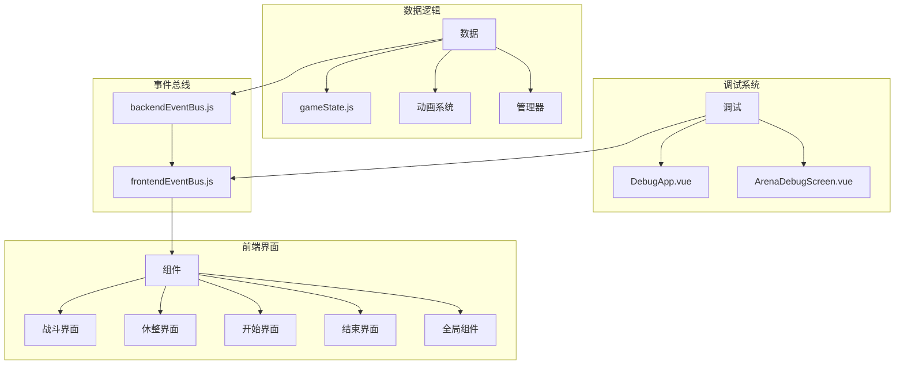
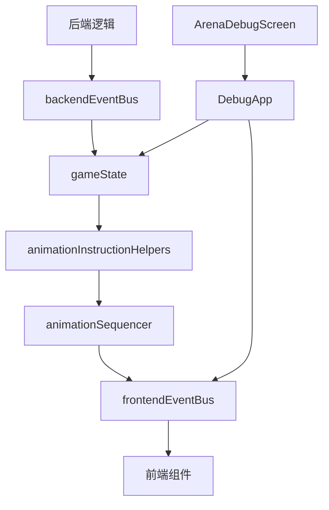
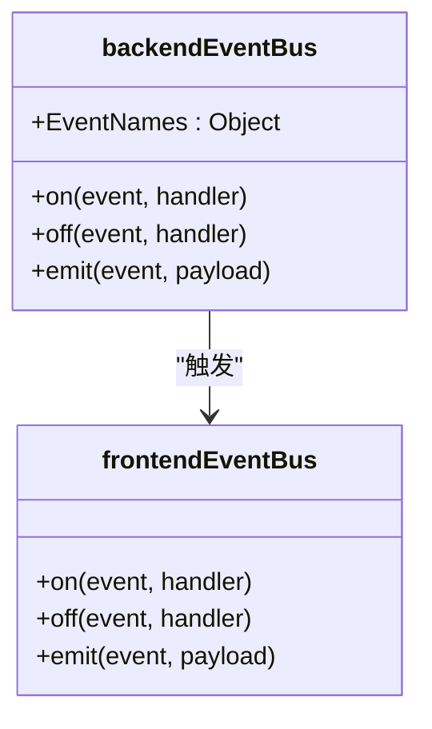
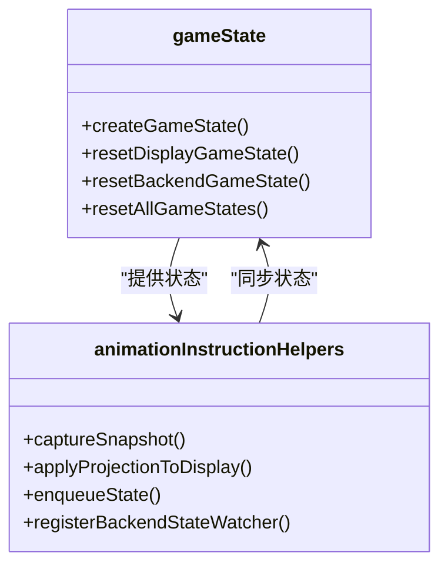
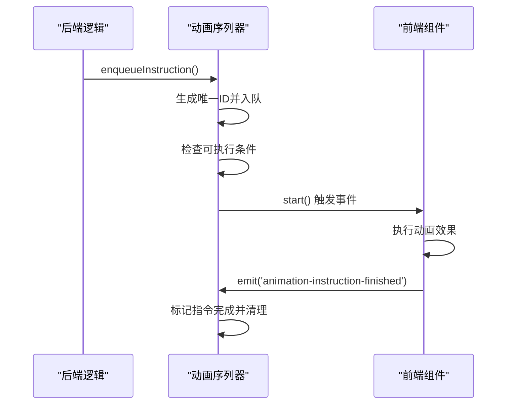
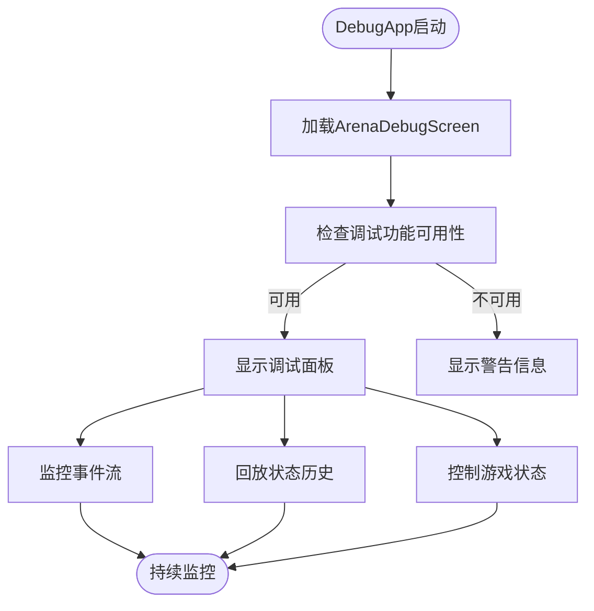
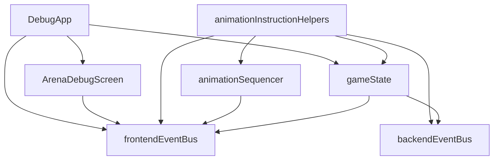

# 调试支持工具

<cite>
**本文档引用的文件**
- [backendEventBus.js](file://src/backendEventBus.js)
- [frontendEventBus.js](file://src/frontendEventBus.js)
- [gameState.js](file://src/data/gameState.js)
- [animationInstructionHelpers.js](file://src/data/animationInstructionHelpers.js)
- [animationSequencer.js](file://src/data/animationSequencer.js)
- [DebugApp.vue](file://src/DebugApp.vue)
- [ArenaDebugScreen.vue](file://src/components/global/ArenaDebugScreen.vue)
</cite>

## 目录
1. [简介](#简介)
2. [项目结构](#项目结构)
3. [核心组件](#核心组件)
4. [架构概述](#架构概述)
5. [详细组件分析](#详细组件分析)
6. [依赖分析](#依赖分析)
7. [性能考量](#性能考量)
8. [故障排除指南](#故障排除指南)
9. [结论](#结论)

## 简介
本文档系统化介绍了用于诊断状态同步问题的调试工具集。重点说明如何启用事件日志追踪功能，记录所有通过 backendEventBus 和 frontendEventBus 传递的消息及其时间序列。描述了状态变更历史回放机制的实现原理，利用 gameState 的历史快照实现“时间机器”式调试。同时提供控制台命令和可视化面板的集成方式，帮助开发者实时监控事件流健康状况。最后包含性能影响评估和生产环境禁用策略，确保调试功能不影响正式版本运行效率。

## 项目结构
项目采用前后端分离的架构设计，主要分为三个核心部分：前端组件、数据逻辑层和调试专用模块。前端组件位于 `src/components` 目录下，按功能划分为 battle、end、global、rest 和 start 五个子模块。数据逻辑层位于 `src/data` 目录，包含游戏核心状态管理、技能系统、敌人配置等业务逻辑。调试相关功能通过独立的 `DebugApp.vue` 入口进行访问，其核心调试面板 `ArenaDebugScreen.vue` 目前处于未开发状态。

**Diagram sources**
- [DebugApp.vue](file://src/DebugApp.vue)
- [ArenaDebugScreen.vue](file://src/components/global/ArenaDebugScreen.vue)

**Section sources**
- [DebugApp.vue](file://src/DebugApp.vue)
- [ArenaDebugScreen.vue](file://src/components/global/ArenaDebugScreen.vue)

## 核心组件
系统的核心调试功能围绕两个事件总线（backendEventBus 和 frontendEventBus）以及游戏状态管理（gameState）构建。backendEventBus 负责后端逻辑事件的广播，如游戏阶段切换、玩家技能使用等；frontendEventBus 则负责前端动画和UI事件的传递。gameState 模块维护了两套独立的游戏状态：backendGameState 用于后端逻辑计算，displayGameState 用于前端显示，两者通过状态同步机制保持一致。

**Section sources**
- [backendEventBus.js](file://src/backendEventBus.js)
- [frontendEventBus.js](file://src/frontendEventBus.js)
- [gameState.js](file://src/data/gameState.js)

## 架构概述
系统的调试架构采用分层设计模式，从下到上依次为：事件总线层、状态管理层、动画序列层和调试界面层。事件总线层作为消息传递的基础设施，实现了前后端的解耦。状态管理层通过 reactive 机制维护游戏状态，并通过深监听实现自动同步。动画序列层将状态变更包装为可追踪的指令，形成时间序列。调试界面层则提供可视化工具，允许开发者观察和控制整个事件流。

**Diagram sources**
- [backendEventBus.js](file://src/backendEventBus.js)
- [frontendEventBus.js](file://src/frontendEventBus.js)
- [gameState.js](file://src/data/gameState.js)
- [animationInstructionHelpers.js](file://src/data/animationInstructionHelpers.js)
- [animationSequencer.js](file://src/data/animationSequencer.js)

## 详细组件分析

### 事件总线分析
事件总线是系统调试功能的基础，分为后端事件总线和前端事件总线两个独立实例。后端事件总线定义了游戏核心流程的事件类型，包括游戏阶段切换、玩家操作、战斗流程等。前端事件总线则专注于UI和动画相关的事件传递。这种分离设计使得开发者可以独立追踪业务逻辑和界面表现。

**Diagram sources**
- [backendEventBus.js](file://src/backendEventBus.js)
- [frontendEventBus.js](file://src/frontendEventBus.js)

### 状态管理分析
状态管理模块实现了前后端状态的分离与同步。通过 createGameState 工厂方法创建初始状态对象，并使用 reactive 包装生成响应式状态。系统维护两套独立的状态实例：backendGameState 用于后端逻辑处理，displayGameState 用于前端显示。状态同步通过 animationInstructionHelpers 中的 captureSnapshot 和 applyProjectionToDisplay 函数实现。

**Diagram sources**
- [gameState.js](file://src/data/gameState.js)
- [animationInstructionHelpers.js](file://src/data/animationInstructionHelpers.js)

### 动画序列分析
动画序列器（animationSequencer）是事件流追踪的核心组件。它将各种UI操作和状态变更包装为具有唯一ID的指令对象，并按照预设的执行规则进行调度。每个指令包含标签（tags）、等待标签（waitTags）、持续时间（durationMs）和启动逻辑（start）。通过监听 'animation-instruction-finished' 事件，实现指令的完成回调和链式执行。

**Diagram sources**
- [animationSequencer.js](file://src/data/animationSequencer.js)
- [animationInstructionHelpers.js](file://src/data/animationInstructionHelpers.js)

### 调试界面分析
调试界面通过独立的 DebugApp.vue 入口进行访问，目前主要包含一个占位用的 ArenaDebugScreen 组件。该组件设计为调试功能的主要可视化界面，但当前实现仅为简单的"未开发"提示。理想情况下，该界面应集成事件日志查看器、状态快照浏览器、时间线回放控制器等调试工具。

**Diagram sources**
- [DebugApp.vue](file://src/DebugApp.vue)
- [ArenaDebugScreen.vue](file://src/components/global/ArenaDebugScreen.vue)

## 依赖分析
系统各组件之间的依赖关系清晰且层次分明。上层组件依赖下层服务，形成单向依赖链。这种设计有利于模块的独立测试和维护。

**Diagram sources**
- [backendEventBus.js](file://src/backendEventBus.js)
- [frontendEventBus.js](file://src/frontendEventBus.js)
- [gameState.js](file://src/data/gameState.js)
- [animationInstructionHelpers.js](file://src/data/animationInstructionHelpers.js)
- [animationSequencer.js](file://src/data/animationSequencer.js)
- [DebugApp.vue](file://src/DebugApp.vue)
- [ArenaDebugScreen.vue](file://src/components/global/ArenaDebugScreen.vue)

**Section sources**
- [package.json](file://package.json)

## 性能考量
当前的调试系统在生产环境中可能存在性能影响，主要体现在以下几个方面：首先，状态变更的深监听（deep watch）会带来额外的性能开销；其次，动画序列器的指令队列管理需要持续的内存和CPU资源；最后，事件总线的频繁通信可能影响主线程性能。建议在生产版本中通过构建配置完全移除调试相关代码，或提供运行时开关控制调试功能的启用状态。

## 故障排除指南
当遇到状态同步问题时，可按照以下步骤进行排查：首先确认 backendEventBus 和 frontendEventBus 的事件是否正常触发；其次检查 gameState 的前后端状态是否一致；然后验证 animationSequencer 的指令队列是否正确执行；最后通过 DebugApp 查看完整的事件时间序列。对于复杂的同步问题，建议启用完整的事件日志追踪，分析从状态变更到UI更新的完整调用链。

**Section sources**
- [backendEventBus.js](file://src/backendEventBus.js)
- [frontendEventBus.js](file://src/frontendEventBus.js)
- [gameState.js](file://src/data/gameState.js)
- [animationInstructionHelpers.js](file://src/data/animationInstructionHelpers.js)

## 结论
本系统提供了一套完整的调试工具集，通过事件总线、状态管理和动画序列器的协同工作，实现了对游戏状态同步过程的全面监控。尽管当前的调试界面尚不完善，但底层架构已经具备了强大的诊断能力。未来应重点开发 ArenaDebugScreen 的可视化功能，集成事件流监控、状态历史回放等实用工具，同时优化生产环境的性能表现，确保调试功能既能满足开发需求，又不影响最终用户体验。