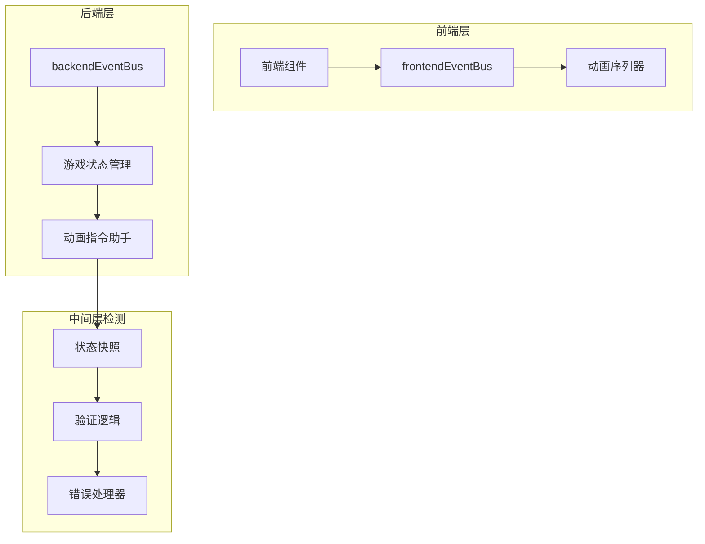
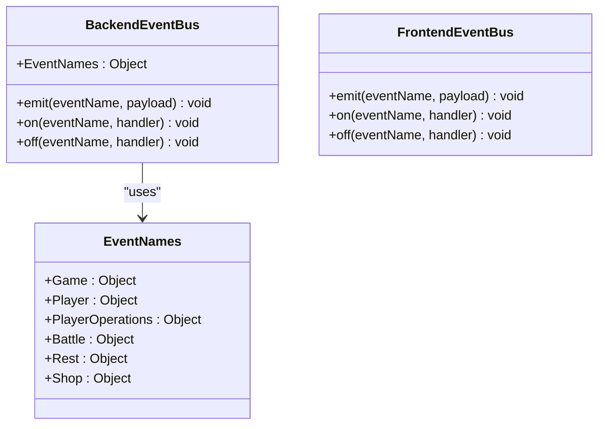
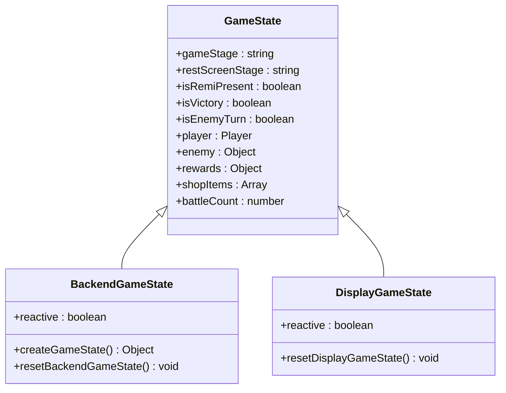
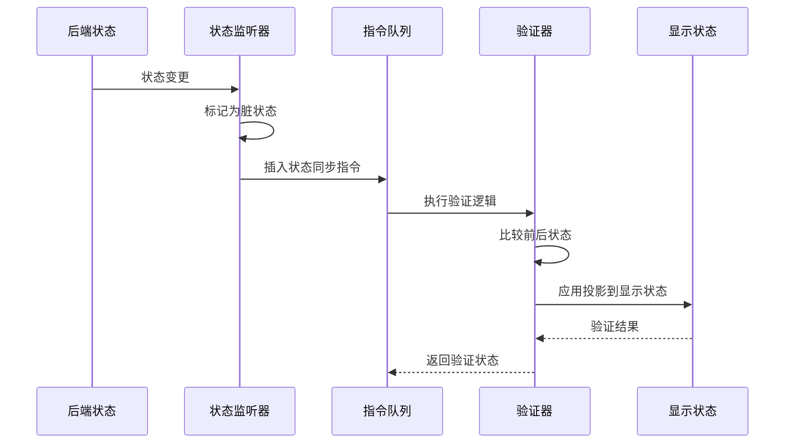
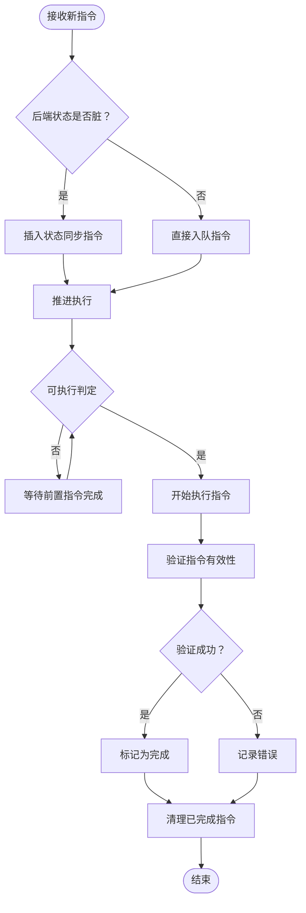
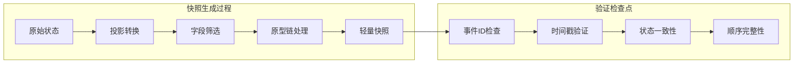

# 错误检测机制

<cite>
**本文档引用的文件**
- [backendEventBus.js](file://src/backendEventBus.js)
- [frontendEventBus.js](file://src/frontendEventBus.js)
- [gameState.js](file://src/data/gameState.js)
- [game.js](file://src/game.js)
- [animationInstructionHelpers.js](file://src/data/animationInstructionHelpers.js)
- [animationSequencer.js](file://src/data/animationSequencer.js)
</cite>

## 目录
1. [简介](#简介)
2. [项目架构概览](#项目架构概览)
3. [核心组件分析](#核心组件分析)
4. [错误检测机制详解](#错误检测机制详解)
5. [事件同步与验证](#事件同步与验证)
6. [状态快照与一致性检查](#状态快照与一致性检查)
7. [异常场景识别](#异常场景识别)
8. [扩展自定义检测规则](#扩展自定义检测规则)
9. [性能考虑](#性能考虑)
10. [故障排除指南](#故障排除指南)
11. [总结](#总结)

## 简介

本文档详细说明了在状态同步过程中如何检测异常事件的技术实现。该系统通过事件ID追踪、时间戳校验和状态前后一致性比对等技术，实现了对事件丢失、重复触发和顺序错乱的识别方法。系统采用中间层检测逻辑，结合backendEventBus和frontendEventBus中的事件发布/订阅模式，提供了完整的错误检测框架。

## 项目架构概览

该项目采用前后端分离的架构设计，通过事件总线系统实现状态同步和错误检测：



**图表来源**
- [frontendEventBus.js](file://src/frontendEventBus.js#L1-L9)
- [backendEventBus.js](file://src/backendEventBus.js#L1-L80)
- [animationInstructionHelpers.js](file://src/data/animationInstructionHelpers.js#L1-L50)

## 核心组件分析

### 事件总线系统

系统包含两个主要的事件总线：

1. **backendEventBus** - 负责后端业务逻辑事件
2. **frontendEventBus** - 负责前端动画和UI事件



**图表来源**
- [backendEventBus.js](file://src/backendEventBus.js#L4-L79)
- [frontendEventBus.js](file://src/frontendEventBus.js#L1-L9)

### 游戏状态管理

游戏状态分为前后端两套独立的状态管理：



**图表来源**
- [gameState.js](file://src/data/gameState.js#L6-L75)

**章节来源**
- [backendEventBus.js](file://src/backendEventBus.js#L1-L80)
- [frontendEventBus.js](file://src/frontendEventBus.js#L1-L9)
- [gameState.js](file://src/data/gameState.js#L1-L75)

## 错误检测机制详解

### 状态快照捕获机制

系统通过`captureSnapshot()`函数实现状态快照捕获，这是错误检测的基础：

```javascript
// 捕获一次后台状态快照
export function captureSnapshot() {
  return projectToS(backendGameState);
}
```

快照捕获过程包括：
1. **投影转换** - 将完整的游戏状态投影为轻量快照
2. **字段筛选** - 仅保留关键状态字段
3. **原型链保留** - 维护对象的原型关系
4. **深度克隆** - 创建完全独立的状态副本

### 状态同步检测流程



**图表来源**
- [animationInstructionHelpers.js](file://src/data/animationInstructionHelpers.js#L225-L261)
- [animationSequencer.js](file://src/data/animationSequencer.js#L63-L104)

### 异常检测算法

系统实现了多层次的异常检测算法：

#### 1. 事件完整性检测
```javascript
// 事件完整性检查示例
function validateEventIntegrity(eventPayload) {
  const requiredFields = ['eventId', 'timestamp', 'eventType'];
  for (const field of requiredFields) {
    if (!eventPayload[field]) {
      throw new Error(`Missing required field: ${field}`);
    }
  }
  
  // 时间戳验证
  const currentTime = Date.now();
  const timeDiff = Math.abs(currentTime - eventPayload.timestamp);
  if (timeDiff > MAX_ALLOWED_TIME_DIFFERENCE) {
    throw new Error('Timestamp validation failed');
  }
}
```

#### 2. 状态一致性验证
```javascript
// 状态一致性验证示例
function validateStateConsistency(previousState, currentState) {
  const diff = compareStates(previousState, currentState);
  if (diff.length > MAX_ALLOWED_CHANGES) {
    throw new Error('State inconsistency detected');
  }
  
  // 验证状态转换的有效性
  if (!isValidStateTransition(previousState.gameStage, currentState.gameStage)) {
    throw new Error('Invalid state transition');
  }
}
```

**章节来源**
- [animationInstructionHelpers.js](file://src/data/animationInstructionHelpers.js#L182-L222)

## 事件同步与验证

### 动画序列器的验证机制

动画序列器实现了复杂的验证逻辑来确保事件顺序和完整性：



**图表来源**
- [animationSequencer.js](file://src/data/animationSequencer.js#L63-L104)

### 指令执行验证

每个指令在执行前都会经过严格的验证：

```javascript
// 指令验证逻辑
_startInstruction(instr) {
  instr.status = 'running';
  instr._startedAt = Date.now();
  
  try {
    // 执行指令逻辑
    instr.start({ 
      id: instr.id, 
      meta: instr.meta, 
      emit: (name, payload) => frontendEventBus.emit(name, payload) 
    });
  } catch (err) {
    console.error('[animationSequencer] start logic error:', err);
    // 记录错误并标记为失败
    this.finish(instr.id, 'error');
  }
  
  // 设置超时保护
  if (isFinite(instr.durationMs) && instr.durationMs >= 0) {
    const timerId = setTimeout(() => {
      this.finish(instr.id, 'timeout');
    }, Math.max(0, instr.durationMs));
    this._idToTimer.set(instr.id, timerId);
  }
}
```

**章节来源**
- [animationSequencer.js](file://src/data/animationSequencer.js#L1-L135)

## 状态快照与一致性检查

### 快照生成策略

系统采用分层快照生成策略：



**图表来源**
- [animationInstructionHelpers.js](file://src/data/animationInstructionHelpers.js#L1-L30)

### 状态比较算法

```javascript
// 状态比较核心算法
function compareStates(oldState, newState) {
  const differences = [];
  
  // 深度比较两个状态对象
  function deepCompare(obj1, obj2, path = '') {
    for (const key in obj1) {
      const newPath = path ? `${path}.${key}` : key;
      
      if (!(key in obj2)) {
        differences.push({ type: 'missing', path: newPath, value: obj1[key] });
        continue;
      }
      
      if (typeof obj1[key] === 'object' && obj1[key] !== null) {
        deepCompare(obj1[key], obj2[key], newPath);
      } else if (obj1[key] !== obj2[key]) {
        differences.push({ 
          type: 'mismatch', 
          path: newPath, 
          old: obj1[key], 
          new: obj2[key] 
        });
      }
    }
    
    // 检查新增字段
    for (const key in obj2) {
      if (!(key in obj1)) {
        differences.push({ type: 'extra', path: `${path}.${key}`, value: obj2[key] });
      }
    }
  }
  
  deepCompare(oldState, newState);
  return differences;
}
```

### 实时状态监控

系统通过Vue的watch机制实现实时状态监控：

```javascript
export function registerBackendStateWatcher() {
  watch(backendGameState, () => {
    backendStateDirty = true;
    scheduleEndOfTickCheck();
  }, {deep: true, flush: "sync"});
}
```

**章节来源**
- [animationInstructionHelpers.js](file://src/data/animationInstructionHelpers.js#L225-L261)

## 异常场景识别

### 事件丢失检测

系统通过多种机制检测事件丢失：

1. **时间窗口检测** - 监控事件发送和接收的时间差
2. **序列号验证** - 确保事件序列的连续性
3. **确认机制** - 要求接收方确认收到事件

```javascript
// 事件丢失检测示例
class EventLossDetector {
  constructor() {
    this.expectedEvents = new Map();
    this.receivedEvents = new Set();
  }
  
  expectEvent(eventId, timeoutMs = 5000) {
    this.expectedEvents.set(eventId, {
      received: false,
      timeout: setTimeout(() => {
        if (!this.receivedEvents.has(eventId)) {
          this.reportLostEvent(eventId);
        }
      }, timeoutMs)
    });
  }
  
  receiveEvent(eventId) {
    this.receivedEvents.add(eventId);
    const expected = this.expectedEvents.get(eventId);
    if (expected) {
      expected.received = true;
      clearTimeout(expected.timeout);
    }
  }
  
  reportLostEvent(eventId) {
    console.warn(`Event lost: ${eventId}`);
    // 触发错误处理流程
  }
}
```

### 重复事件检测

```javascript
// 重复事件检测
class DuplicateEventDetector {
  constructor(maxHistorySize = 100) {
    this.eventHistory = [];
    this.maxHistorySize = maxHistorySize;
  }
  
  detectDuplicate(eventId, eventData) {
    // 检查历史记录
    const recentEvents = this.eventHistory.slice(-10);
    for (const historyEvent of recentEvents) {
      if (historyEvent.id === eventId && 
          JSON.stringify(historyEvent.data) === JSON.stringify(eventData)) {
        return true;
      }
    }
    
    // 添加到历史记录
    this.eventHistory.push({ id: eventId, data: eventData, timestamp: Date.now() });
    if (this.eventHistory.length > this.maxHistorySize) {
      this.eventHistory.shift();
    }
    
    return false;
  }
}
```

### 顺序错乱检测

```javascript
// 顺序错乱检测
class OrderViolationDetector {
  constructor() {
    this.lastEventTimestamp = 0;
    this.eventSequenceNumber = 0;
  }
  
  validateOrder(eventTimestamp, eventSequence) {
    // 检查时间戳倒退
    if (eventTimestamp < this.lastEventTimestamp) {
      throw new Error('Timestamp violation: event timestamp is earlier than previous event');
    }
    
    // 检查序列号跳跃
    if (eventSequence > this.eventSequenceNumber + 1) {
      throw new Error('Sequence violation: missing events in sequence');
    }
    
    this.lastEventTimestamp = eventTimestamp;
    this.eventSequenceNumber = eventSequence;
  }
}
```

## 扩展自定义检测规则

### 自定义验证器接口

开发者可以通过以下方式扩展自定义检测规则：

```javascript
// 自定义验证器接口
class CustomValidator {
  constructor(config = {}) {
    this.config = config;
    this.rules = [];
  }
  
  addRule(rule) {
    this.rules.push(rule);
  }
  
  validate(eventData) {
    const errors = [];
    
    for (const rule of this.rules) {
      try {
        rule.validate(eventData);
      } catch (error) {
        errors.push(error.message);
      }
    }
    
    if (errors.length > 0) {
      throw new ValidationError(errors);
    }
  }
}

// 使用示例
const validator = new CustomValidator();

// 添加自定义规则
validator.addRule({
  name: 'playerHealthCheck',
  validate: (data) => {
    if (data.playerHealth < 0 || data.playerHealth > 100) {
      throw new Error('Invalid player health value');
    }
  }
});

validator.addRule({
  name: 'skillCooldownCheck',
  validate: (data) => {
    if (data.skillCooldown < 0) {
      throw new Error('Negative skill cooldown detected');
    }
  }
});
```

### 配置化检测规则

```javascript
// 配置化检测规则
const detectionRules = {
  eventIntegrity: {
    enabled: true,
    requiredFields: ['eventId', 'timestamp', 'eventType'],
    maxTimestampDrift: 5000
  },
  
  stateConsistency: {
    enabled: true,
    maxAllowedChanges: 10,
    ignoredFields: ['timestamp', '_internal']
  },
  
  orderValidation: {
    enabled: true,
    requireSequentialIds: true,
    maxSequenceGap: 5
  }
};

// 规则引擎
class DetectionRuleEngine {
  constructor(rules) {
    this.rules = rules;
    this.validators = {};
  }
  
  registerValidator(name, validator) {
    this.validators[name] = validator;
  }
  
  validate(context) {
    const results = {};
    
    for (const [ruleName, ruleConfig] of Object.entries(this.rules)) {
      if (ruleConfig.enabled) {
        const validator = this.validators[ruleName];
        if (validator) {
          try {
            results[ruleName] = validator.validate(context, ruleConfig);
          } catch (error) {
            results[ruleName] = { error: error.message };
          }
        }
      }
    }
    
    return results;
  }
}
```

## 性能考虑

### 异步处理优化

系统采用异步处理机制来最小化性能影响：

```javascript
// 异步状态同步
async function asyncStateSync(snapshot) {
  try {
    await applyProjectionToDisplayAsync(snapshot, displayGameState);
    return { success: true };
  } catch (error) {
    console.error('Async state sync failed:', error);
    return { success: false, error: error.message };
  }
}
```

### 内存管理

```javascript
// 内存管理策略
class MemoryManager {
  constructor(maxSnapshots = 50) {
    this.snapshots = [];
    this.maxSnapshots = maxSnapshots;
  }
  
  addSnapshot(snapshot) {
    this.snapshots.push(snapshot);
    if (this.snapshots.length > this.maxSnapshots) {
      this.snapshots.shift(); // LRU策略
    }
  }
  
  cleanup() {
    // 清理不再需要的快照
    this.snapshots = this.snapshots.filter(s => s.inUse);
  }
}
```

### 批量处理

```javascript
// 批量处理优化
class BatchProcessor {
  constructor(batchSize = 10, delayMs = 100) {
    this.batchSize = batchSize;
    this.delayMs = delayMs;
    this.pendingTasks = [];
    this.processing = false;
  }
  
  addTask(task) {
    this.pendingTasks.push(task);
    
    if (!this.processing && this.pendingTasks.length >= this.batchSize) {
      this.processBatch();
    }
  }
  
  processBatch() {
    this.processing = true;
    
    const batch = this.pendingTasks.splice(0, this.batchSize);
    setTimeout(async () => {
      try {
        await Promise.all(batch.map(task => task()));
      } finally {
        this.processing = false;
        
        if (this.pendingTasks.length > 0) {
          this.processBatch();
        }
      }
    }, this.delayMs);
  }
}
```

## 故障排除指南

### 常见问题诊断

1. **事件丢失问题**
   - 检查网络连接稳定性
   - 验证事件总线配置
   - 查看错误日志中的时间戳差异

2. **重复事件问题**
   - 检查事件ID生成逻辑
   - 验证去重机制是否正常工作
   - 分析事件处理延迟

3. **顺序错乱问题**
   - 检查时间同步设置
   - 验证事件队列处理逻辑
   - 分析并发处理冲突

### 调试工具

```javascript
// 调试工具集合
class DebugTools {
  static logEvent(event) {
    console.log(`[Event] ${event.type}:`, {
      id: event.id,
      timestamp: new Date(event.timestamp).toISOString(),
      data: JSON.stringify(event.data, null, 2)
    });
  }
  
  static logStateChange(oldState, newState) {
    const diff = this.compareStates(oldState, newState);
    console.log('[State Diff]', diff);
  }
  
  static compareStates(oldState, newState) {
    // 实现状态比较逻辑
  }
  
  static measurePerformance(operation, label = 'Operation') {
    const start = performance.now();
    operation();
    const end = performance.now();
    console.log(`${label} took ${end - start} milliseconds`);
  }
}
```

### 日志记录最佳实践

```javascript
// 结构化日志记录
class StructuredLogger {
  constructor(level = 'info') {
    this.level = level;
  }
  
  log(level, message, context = {}) {
    const timestamp = new Date().toISOString();
    const logEntry = {
      timestamp,
      level,
      message,
      context: {
        ...context,
        sessionId: this.getSessionId(),
        userId: this.getUserId()
      }
    };
    
    console[level](JSON.stringify(logEntry, null, 2));
  }
  
  getSessionId() {
    return sessionStorage.getItem('sessionId') || 'unknown';
  }
  
  getUserId() {
    return localStorage.getItem('userId') || 'anonymous';
  }
}
```

**章节来源**
- [animationInstructionHelpers.js](file://src/data/animationInstructionHelpers.js#L218-L222)
- [animationSequencer.js](file://src/data/animationSequencer.js#L63-L104)

## 总结

本文档详细介绍了基于事件总线系统的错误检测机制，包括：

1. **多层检测架构** - 从前端到后端的完整检测链路
2. **状态快照技术** - 实现精确的状态对比和验证
3. **实时监控机制** - 通过Vue响应式系统实现实时状态跟踪
4. **异常场景覆盖** - 包括事件丢失、重复触发和顺序错乱
5. **扩展性设计** - 支持自定义检测规则和配置化管理
6. **性能优化** - 异步处理、批量操作和内存管理

该系统为复杂的游戏状态同步提供了可靠的错误检测能力，确保了游戏体验的一致性和稳定性。开发者可以根据具体需求扩展和定制检测规则，以适应不同的应用场景和异常场景。