# 状态同步机制

<cite>
**本文档引用的文件**
- [frontendEventBus.js](file://src/frontendEventBus.js)
- [backendEventBus.js](file://src/backendEventBus.js)
- [gameState.js](file://src/data/gameState.js)
- [battle.js](file://src/data/battle.js)
- [animationInstructionHelpers.js](file://src/data/animationInstructionHelpers.js)
- [BattleScreen.vue](file://src/components/battle/BattleScreen.vue)
- [MessagePopupScreen.vue](file://src/components/end/MessagePopupScreen.vue)
- [dialogues.js](file://src/data/dialogues.js)
</cite>

## 目录
1. [引言](#引言)
2. [事件总线架构](#事件总线架构)
3. [状态管理模型](#状态管理模型)
4. [后端事件处理流程](#后端事件处理流程)
5. [前端状态同步机制](#前端状态同步机制)
6. [UI组件响应式更新](#ui组件响应式更新)
7. [典型状态同步场景](#典型状态同步场景)
8. [事件去重与顺序保证](#事件去重与顺序保证)
9. [错误处理策略](#错误处理策略)
10. [结论](#结论)

## 引言
本项目采用前后端分离的状态管理架构，通过两个独立的事件总线（frontendEventBus 和 backendEventBus）实现高效的状态同步。该机制确保了游戏逻辑的纯净性与UI响应的实时性，同时提供了清晰的职责划分。本文档详细分析这一状态同步机制的设计与实现。

## 事件总线架构

### 事件总线设计
项目采用 mitt 库实现两个独立的事件总线：
- **backendEventBus**：负责核心游戏逻辑的状态变更通知和流程控制
- **frontendEventBus**：负责UI组件间的动画控制和视觉反馈

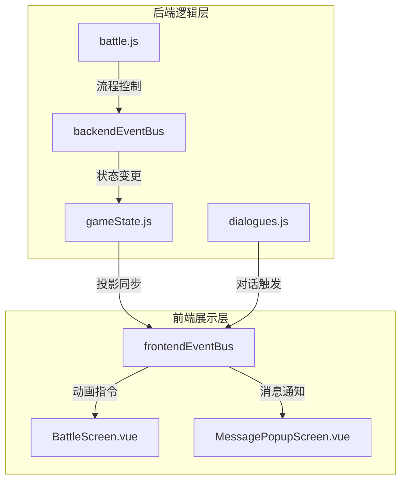

**Diagram sources**
- [backendEventBus.js](file://src/backendEventBus.js#L1-L80)
- [frontendEventBus.js](file://src/frontendEventBus.js#L1-L8)

**Section sources**
- [backendEventBus.js](file://src/backendEventBus.js#L1-L80)
- [frontendEventBus.js](file://src/frontendEventBus.js#L1-L8)

### 事件类型定义
backendEventBus 定义了结构化的事件命名空间，涵盖游戏各个阶段：

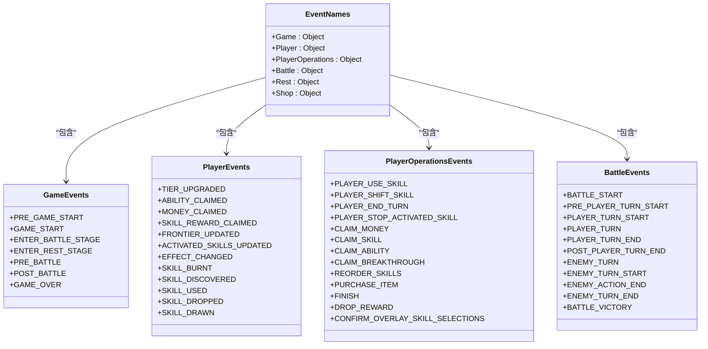

**Diagram sources**
- [backendEventBus.js](file://src/backendEventBus.js#L5-L78)

## 状态管理模型

### 双状态系统
项目采用双状态系统实现前后端分离：

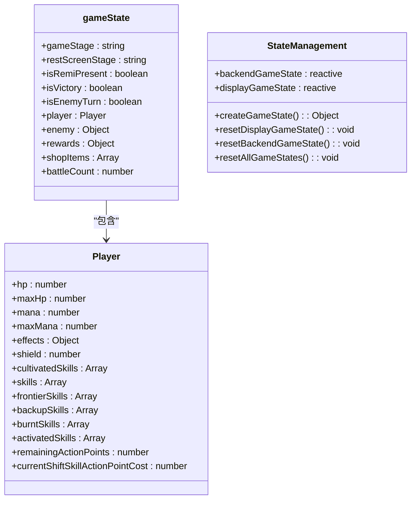

**Section sources**
- [gameState.js](file://src/data/gameState.js#L1-L74)

### 状态同步流程
后端状态变更通过投影机制同步到前端：

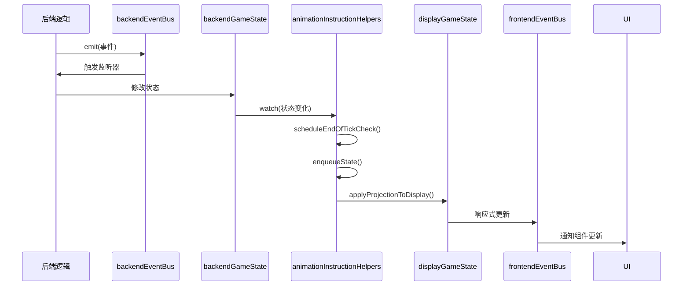

**Diagram sources**
- [gameState.js](file://src/data/gameState.js#L51-L74)
- [animationInstructionHelpers.js](file://src/data/animationInstructionHelpers.js#L200-L250)

## 后端事件处理流程

### 战斗流程控制
后端事件总线驱动整个战斗流程：

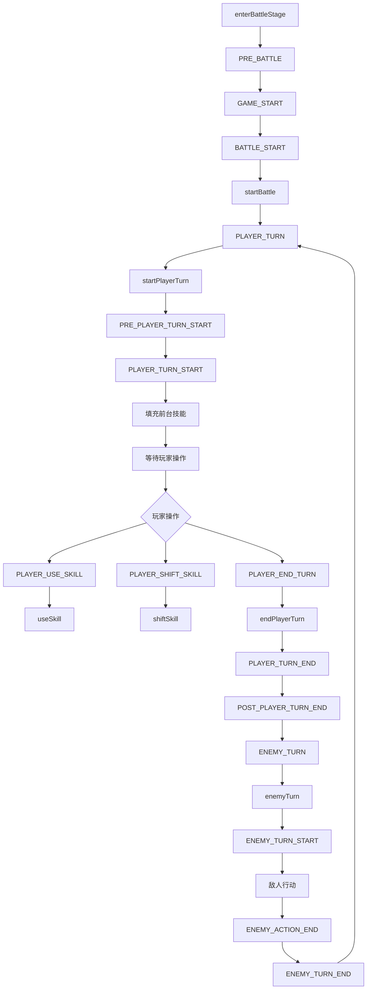

**Diagram sources**
- [battle.js](file://src/data/battle.js#L30-L552)

**Section sources**
- [battle.js](file://src/data/battle.js#L30-L552)

### 事件监听注册
初始化战斗流程监听器：

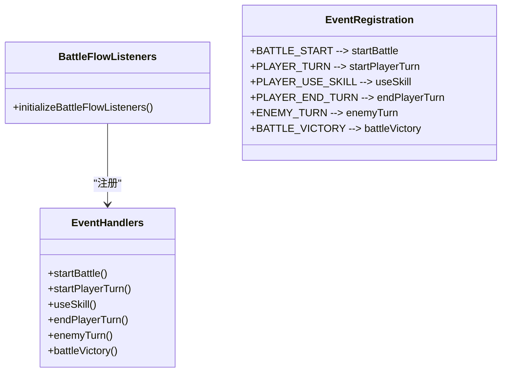

**Section sources**
- [battle.js](file://src/data/battle.js#L400-L552)

## 前端状态同步机制

### 状态投影同步
通过 animationInstructionHelpers 实现状态同步：

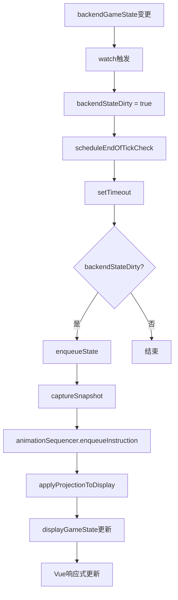

**Section sources**
- [animationInstructionHelpers.js](file://src/data/animationInstructionHelpers.js#L200-L250)

### 同步指令队列
状态同步作为动画指令入队：

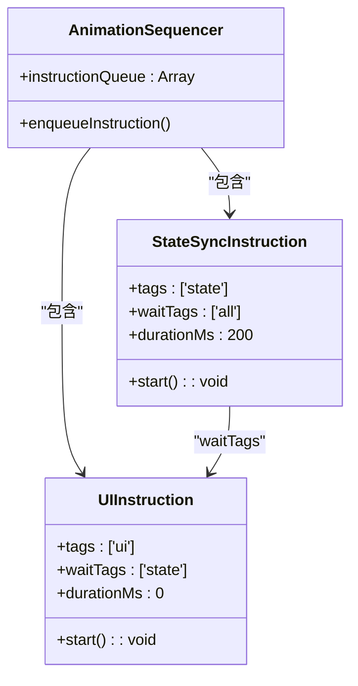

**Section sources**
- [animationInstructionHelpers.js](file://src/data/animationInstructionHelpers.js#L200-L250)

## UI组件响应式更新

### 消息弹窗组件
MessagePopupScreen 监听前端事件总线：

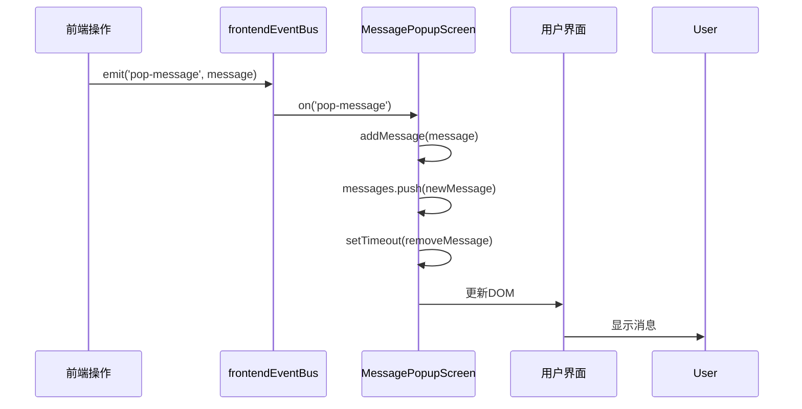

**Diagram sources**
- [MessagePopupScreen.vue](file://src/components/end/MessagePopupScreen.vue#L1-L61)

**Section sources**
- [MessagePopupScreen.vue](file://src/components/end/MessagePopupScreen.vue#L1-L61)

### 对话系统集成
dialogues.js 监听后端事件触发对话：

```mermaid
flowchart TD
A[registerListeners] --> B[监听SKILL_USED]
B --> C[SKILL_USED事件]
C --> D[getSkillUseDialog]
D --> E{isRemiPresent?}
E --> |是| F[enqueueUI('displayDialog')]
E --> |否| G[结束]
F --> H[frontendEventBus.emit('display-dialog')]
H --> I[DialogScreen.vue显示对话]
```

**Diagram sources**
- [dialogues.js](file://src/data/dialogues.js#L300-L343)

**Section sources**
- [dialogues.js](file://src/data/dialogues.js#L300-L343)

## 典型状态同步场景

### 回合切换场景
玩家结束回合时的状态同步流程：

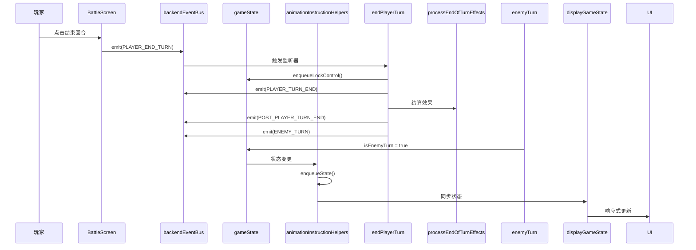

**Section sources**
- [battle.js](file://src/data/battle.js#L300-L353)

### 技能使用场景
玩家使用技能时的状态同步流程：

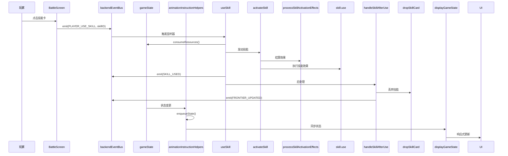

**Section sources**
- [battle.js](file://src/data/battle.js#L200-L300)

## 事件去重与顺序保证

### 事件去重机制
通过状态标记和定时器实现事件去重：

```mermaid
flowchart TD
A[backendGameState变更] --> B[watch触发]
B --> C[backendStateDirty = true]
C --> D{endOfTickStateSycnScheduled?}
D --> |否| E[endOfTickStateSycnScheduled = true]
D --> |是| F[直接返回]
E --> G[setTimeout(0)]
G --> H[执行enqueueState]
H --> I[backendStateDirty = false]
I --> J[endOfTickStateSycnScheduled = false]
```

**Section sources**
- [animationInstructionHelpers.js](file://src/data/animationInstructionHelpers.js#L200-L250)

### 顺序保证机制
通过指令队列的依赖关系保证执行顺序：

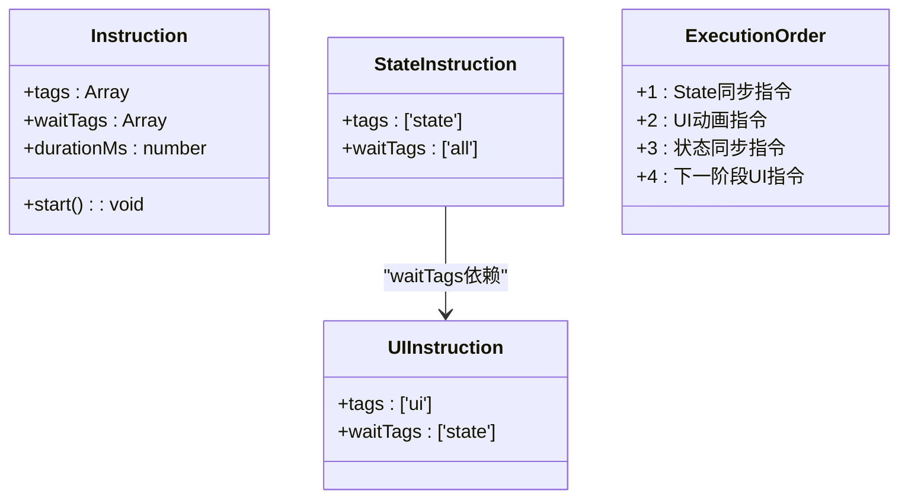

**Section sources**
- [animationInstructionHelpers.js](file://src/data/animationInstructionHelpers.js#L200-L250)

## 错误处理策略

### 事件监听错误处理
在事件处理中包含错误捕获：

```mermaid
flowchart TD
A[事件处理函数] --> B[try-catch包裹]
B --> C[执行核心逻辑]
C --> D{发生异常?}
D --> |是| E[console.error记录]
D --> |否| F[正常执行]
E --> G[继续执行后续逻辑]
F --> H[完成]
G --> H
class try-catch {
+try { ... }
+catch(err) { console.error(...) }
}
```

**Section sources**
- [battle.js](file://src/data/battle.js#L300-L353)
- [animationInstructionHelpers.js](file://src/data/animationInstructionHelpers.js#L200-L250)

### 状态同步错误处理
状态投影过程中的错误处理：

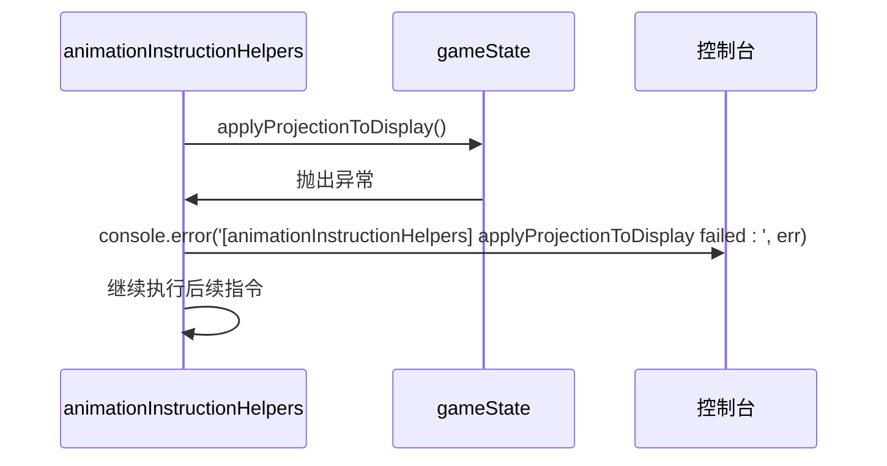

**Section sources**
- [animationInstructionHelpers.js](file://src/data/animationInstructionHelpers.js#L200-L250)

## 结论
本项目的状态同步机制通过精心设计的双事件总线架构和双状态系统，实现了高效、可靠的状态管理。backendEventBus 负责核心游戏逻辑的流程控制和状态变更通知，而 frontendEventBus 专注于UI层面的动画和视觉反馈。通过 reactive 状态管理和投影同步机制，确保了前后端状态的一致性，同时保持了逻辑层与展示层的清晰分离。该设计模式具有良好的可维护性和扩展性，为复杂游戏系统的状态管理提供了可靠的解决方案。