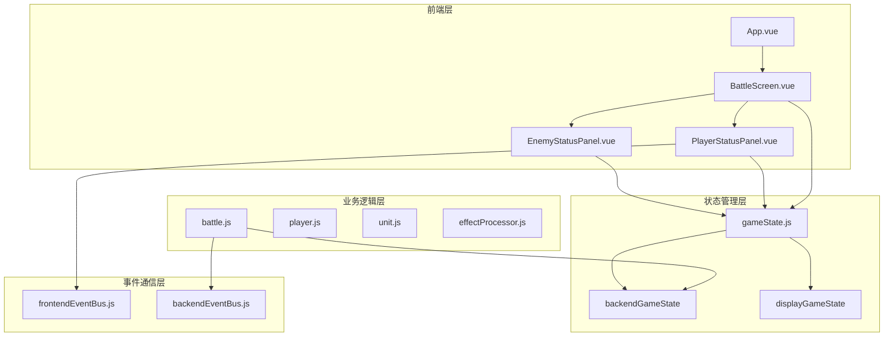
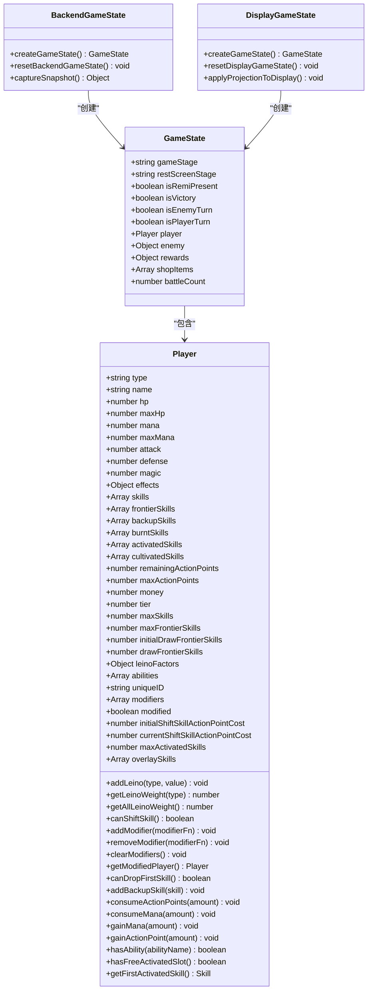
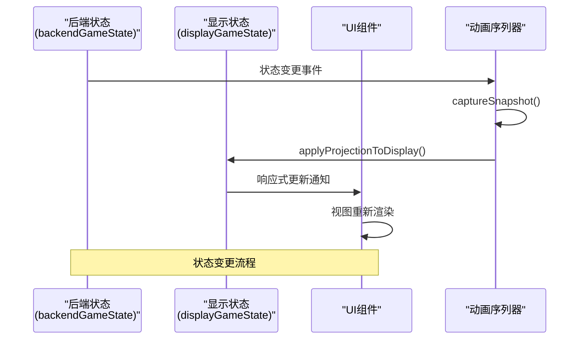
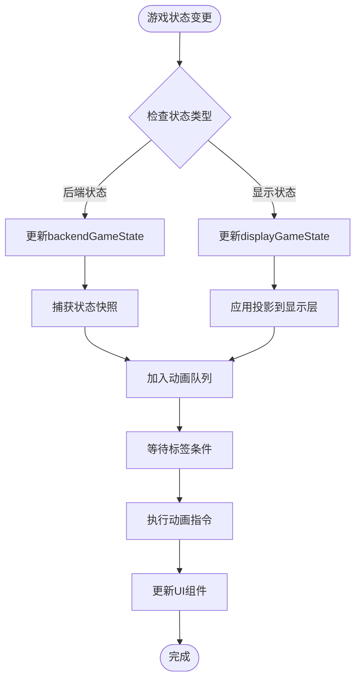
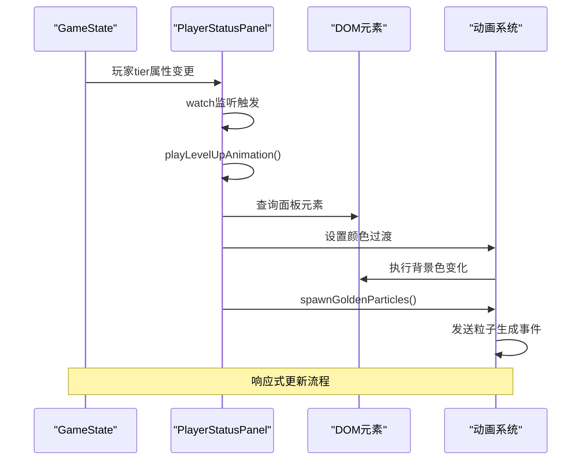
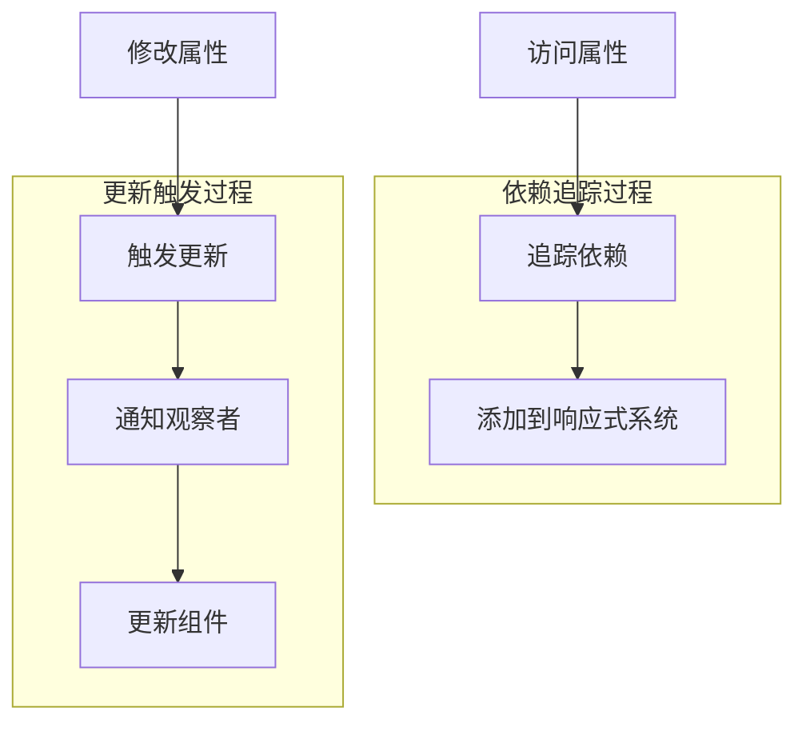
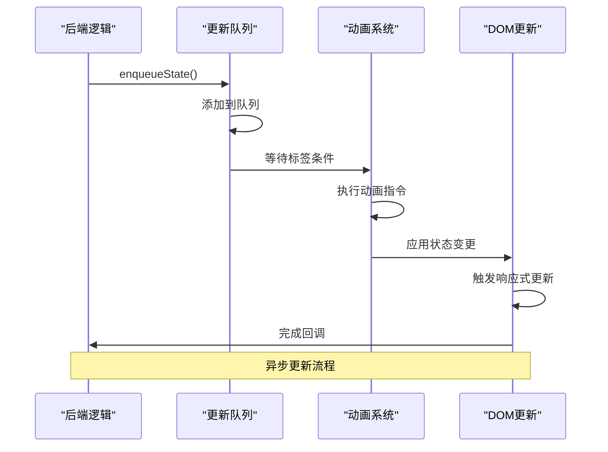

# Vue 3响应式同步机制

<cite>
**本文档引用的文件**
- [gameState.js](file://src/data/gameState.js)
- [BattleScreen.vue](file://src/components/battle/BattleScreen.vue)
- [PlayerStatusPanel.vue](file://src/components/global/PlayerStatusPanel.vue)
- [player.js](file://src/data/player.js)
- [unit.js](file://src/data/unit.js)
- [battle.js](file://src/data/battle.js)
- [effectProcessor.js](file://src/data/effectProcessor.js)
- [frontendEventBus.js](file://src/frontendEventBus.js)
</cite>

## 目录
1. [简介](#简介)
2. [项目架构概览](#项目架构概览)
3. [响应式系统核心设计](#响应式系统核心设计)
4. [GameState全局状态管理](#gameState全局状态管理)
5. [BattleScreen组件响应式集成](#battlescreen组件响应式集成)
6. [PlayerStatusPanel响应式实现](#playerstatuspanel响应式实现)
7. [响应式依赖追踪机制](#响应式依赖追踪机制)
8. [异步更新队列与DOM刷新](#异步更新队列与dom刷新)
9. [性能优化策略](#性能优化策略)
10. [故障排除指南](#故障排除指南)
11. [总结](#总结)

## 简介

本文档深入分析了Vue 3的reactive系统如何与游戏的全局状态对象gameState集成，实现UI组件的自动响应。通过分析BattleScreen和PlayerStatusPanel组件中使用computed属性或watchEffect监听状态变化的具体实现方式，解释了异步更新队列和DOM刷新的时机控制，确保视图与模型保持一致。

该项目采用前后端分离的状态管理模式，通过Vue 3的响应式系统实现了高效的数据绑定和视图更新机制。

## 项目架构概览



**图表来源**
- [gameState.js](file://src/data/gameState.js#L51-L73)
- [BattleScreen.vue](file://src/components/battle/BattleScreen.vue#L1-L50)
- [PlayerStatusPanel.vue](file://src/components/global/PlayerStatusPanel.vue#L1-L50)

## 响应式系统核心设计

Vue 3的响应式系统采用了Proxy API来实现深度响应式数据绑定。在本项目中，响应式系统的核心设计体现在以下几个方面：

### Reactive对象创建

```javascript
// 工厂方法：创建一个"干净"的游戏状态对象（非响应式）
export function createGameState() {
  return {
    // 游戏阶段: 'start', 'battle', 'rest', 'end'
    gameStage: 'start',
    
    // 休整界面阶段：'money' | 'breakthrough' | 'skill' | 'ability' | 'shop' | ''（不显示）
    restScreenStage: '',
    
    // 是否开启了瑞米进行游戏
    isRemiPresent: false,
    
    // 游戏结果状态
    isVictory: false,
    
    // 回合控制
    isEnemyTurn: false,
    
    get isPlayerTurn() {
      return !this.isEnemyTurn;
    },
    
    // 玩家数据
    player: reactive(new Player()),
    
    // 敌人数据（在战斗开始时赋值）
    enemy: {},
    
    // 奖励数据
    rewards: {
      breakthrough: false,
      money: 0,
      skills: [],
      abilities: []
    },
    
    // 当前商店内商品
    shopItems: [],
    
    // 战斗场次数
    battleCount: 0
  };
}
```

### 前后端分离状态架构



**图表来源**
- [gameState.js](file://src/data/gameState.js#L8-L45)
- [player.js](file://src/data/player.js#L75-L150)

**章节来源**
- [gameState.js](file://src/data/gameState.js#L1-L75)
- [player.js](file://src/data/player.js#L1-L226)

## GameState全局状态管理

### 状态对象结构设计

GameState采用了工厂函数模式来创建状态对象，确保每次都能获得一个全新的、干净的状态实例。这种设计避免了状态污染问题，并支持状态的动态重置。

```javascript
// 分别创建"显示层状态"和"后端状态"，二者结构一致，但相互独立
export const backendGameState = reactive(createGameState());
export const displayGameState = reactive(createGameState());
```

### 状态重置机制

```javascript
// 重置显示层状态
export function resetDisplayGameState() {
  const fresh = createGameState();
  // 保持玩家对象响应式：用 Object.assign 同步字段
  Object.assign(displayGameState, fresh);
  Object.assign(displayGameState.player, fresh.player);
}

// 重置后端状态
export function resetBackendGameState() {
  const fresh = createGameState();
  Object.assign(backendGameState, fresh);
  Object.assign(backendGameState.player, fresh.player);
}

// 同时重置两份状态
export function resetAllGameStates() {
  resetDisplayGameState();
  resetBackendGameState();
}
```

### 状态同步机制



**图表来源**
- [gameState.js](file://src/data/gameState.js#L51-L73)
- [battle.js](file://src/data/battle.js#L32-L69)

**章节来源**
- [gameState.js](file://src/data/gameState.js#L51-L73)
- [battle.js](file://src/data/battle.js#L32-L69)

## BattleScreen组件响应式集成

### 组件Props绑定

BattleScreen组件通过props接收来自GameState的状态数据：

```javascript
props: {
  player: { type: Object, required: true },
  enemy: { type: Object, required: true },
  isPlayerTurn: { type: Boolean, default: true },
  level: { type: Number, default: 1 }
}
```

### 响应式数据流



**图表来源**
- [battle.js](file://src/data/battle.js#L32-L69)
- [gameState.js](file://src/data/gameState.js#L51-L73)

### 事件总线集成

BattleScreen组件集成了前端事件总线来处理战斗日志：

```javascript
mounted() {
  frontendEventBus.on('add-battle-log', this.onAddBattleLog);
  frontendEventBus.on('clear-battle-log', this.onClearBattleLog);
},
beforeUnmount() {
  frontendEventBus.off('add-battle-log', this.onAddBattleLog);
  frontendEventBus.off('clear-battle-log', this.onClearBattleLog);
},
methods: {
  onAddBattleLog(value) {
    // 兼容字符串与对象格式
    this.logs.push(value);
  },
  onClearBattleLog() {
    this.logs = [];
  },
}
```

**章节来源**
- [BattleScreen.vue](file://src/components/battle/BattleScreen.vue#L1-L112)
- [frontendEventBus.js](file://src/frontendEventBus.js#L1-L9)

## PlayerStatusPanel响应式实现

### Watch监听机制

PlayerStatusPanel组件使用watch来监听玩家状态的变化：

```javascript
watch: {
  // 监听玩家等阶变化，播放升级动画
  'player.tier'(newTier, oldTier) {
    if (newTier !== oldTier && this.restScreen) {
      this.playLevelUpAnimation();
    }
  },
}
```

### 计算属性与响应式

PlayerStatusPanel利用Vue 3的响应式特性实现自动化的状态更新：

```javascript
// 播放升级动画
playLevelUpAnimation() {
  if (!this.restScreen) return;
  
  // 颜色渐变动画
  const panel = this.$el.querySelector('.player-status-panel');
  if (panel) {
    const originalColor = this.getPlayerPanelTierStyle(this.player.tier).major;
    
    // 闪烁效果
    panel.style.transition = 'background-color 0.5s ease';
    panel.style.backgroundColor = '#ffffff';
    
    setTimeout(() => {
      panel.style.backgroundColor = originalColor;
    }, 250);
    
    setTimeout(() => {
      panel.style.backgroundColor = '#ffffff';
    }, 500);
    
    setTimeout(() => {
      panel.style.backgroundColor = originalColor;
      panel.style.transition = '';
    }, 750);
  }
  
  // 从面板上侧和下侧释放金色粒子
  this.spawnGoldenParticles();
}
```

### 响应式状态更新流程



**图表来源**
- [PlayerStatusPanel.vue](file://src/components/global/PlayerStatusPanel.vue#L130-L170)

**章节来源**
- [PlayerStatusPanel.vue](file://src/components/global/PlayerStatusPanel.vue#L130-L170)

## 响应式依赖追踪机制

### Proxy代理机制

Vue 3使用ES6的Proxy API来实现响应式数据追踪。在Player类中，实现了属性修正器系统：

```javascript
// 属性修正系统 API
addModifier(modifierFn) {
  if (typeof modifierFn === 'function') this.modifiers.push(modifierFn);
  else console.warn('尝试添加非法的属性修正器：', modifierFn, '应为 function(player)=>player');
}
removeModifier(modifierFn) {
  this.modifiers = this.modifiers.filter(m => m !== modifierFn);
}
clearModifiers() {
  this.modifiers = [];
}

// 获取顺序应用所有修正器后的"修正玩家对象"
getModifiedPlayer() {
  if(this.modified) return this; // 已经是修正过的，直接返回自己，避免重复应用
  let current = this;
  for (const mod of this.modifiers) {
    try {
      const next = mod(current);
      // 允许修正器返回空以"跳过"
      if (next) current = next;
    } catch (e) {
      console.warn('应用属性修正器时发生错误，已跳过：', e);
    }
  }
  // 最后一个修正：将 modified 标记为 true
  if (!current.modified) {
    current = new Proxy(current, {
      get(target, prop, receiver) {
        if (prop === 'modified') return true;
        return Reflect.get(target, prop, receiver);
      }
    });
  }
  return current;
}
```

### 依赖收集与触发



**图表来源**
- [player.js](file://src/data/player.js#L150-L200)

**章节来源**
- [player.js](file://src/data/player.js#L150-L200)

## 异步更新队列与DOM刷新

### 动画序列器机制

项目采用了复杂的动画序列器来管理异步更新：

```javascript
// 默认的状态同步"虚拟动画"时长
export const DEFAULT_STATE_CHANGE_DURATION = 200;

// 对外暴露：将一次状态同步作为指令推入 sequencer
export function enqueueState({ snapshot, durationMs, waitTags } = {}) {
  const snap = snapshot || captureSnapshot();
  const dur = typeof durationMs === 'number' ? durationMs : DEFAULT_STATE_CHANGE_DURATION;
  return animationSequencer.enqueueInstruction({
    tags: ['state'],
    waitTags: waitTags || ['all'],
    durationMs: dur,
    start: () => {
      try {
        applyProjectionToDisplay(snap, displayGameState);
      } catch (err) {
        console.error('状态同步失败：', err);
      }
    }
  });
}
```

### 更新时机控制



**图表来源**
- [battle.js](file://src/data/battle.js#L32-L69)

### 效果处理与状态同步

effectProcessor模块展示了复杂的状态同步逻辑：

```javascript
/**
 * 处理回合开始时触发的效果
 * @param {Object} target - 目标对象（玩家或敌人）
 */
export function processStartOfTurnEffects(target) {
  // 摧毁护盾
  if(target.effects['警戒'] > 0) {
    target.addEffect('警戒', -1);
  } else {
    target.shield = 0;
  }

  // 处理吸热效果
  if (target.effects['吸热'] > 0) {
    const stacks = Math.min(target.effects['吸热'], target.effects['燃烧']);
    if (stacks > 0) {
      target.removeEffect('燃烧', stacks);
      enqueueDelay(400);
    }
  }

  // 处理燃烧效果
  if (target.effects['燃烧'] > 0) {
    let damage = target.effects['燃烧'];
    damage -= target.effects['火焰抗性'] || 0;
    target.addEffect('燃烧', -1);
    if(damage > 0) {
      addEffectLog(`${target.name}被烧伤了，受到${damage}伤害！`);
      dealDamage(null, target, damage);
      enqueueDelay(400);
    }
  }
  
  // 聚气效果
  if (target.effects['聚气'] > 0) {
    if (typeof target.gainMana === 'function') {
      target.gainMana(target.effects['聚气']);
      addEffectLog(`${target.name}通过/effect{聚气}恢复了${target.effects['聚气']}点魏启！`);
      enqueueDelay(400);
    }
    target.addEffect('聚气', -target.effects['聚气']);
  }
}
```

**章节来源**
- [battle.js](file://src/data/battle.js#L32-L69)
- [effectProcessor.js](file://src/data/effectProcessor.js#L15-L80)

## 性能优化策略

### 响应式对象复用

项目通过工厂函数模式避免重复创建响应式对象：

```javascript
// 工厂方法：创建一个"干净"的游戏状态对象（非响应式）
export function createGameState() {
  return {
    // ...状态定义
    player: reactive(new Player()), // 只在玩家对象上使用reactive
    // ...其他状态
  };
}
```

### 修饰器模式优化

Player类使用修饰器模式来优化属性计算：

```javascript
// 为属性修正系统提供一个便捷的工厂：创建一个"叠加型"的玩家属性修正器
// - 接受一个包含 attack/defense/magic 修正函数的对象
// - 每个函数形如 (baseValue, currentPlayer) => number
// - 返回一个 (player) => wrappedPlayer 的修正器
export function createPlayerStatModifier({ attack, defense, magic } = {}) {
  return function(player) {
    // 仅覆盖需要的 getter；不改变 hp/effects 等引用
    return new Proxy(player, {
      // 仅覆盖需要修改的只读属性，其他全部透传
      get(target, prop, receiver) {
        if (prop === 'attack') {
          const base = Reflect.get(target, 'attack', receiver);
          return typeof attack === 'function' ? attack(base, receiver) : base;
        }
        if (prop === 'defense') {
          const base = Reflect.get(target, 'defense', receiver);
          return typeof defense === 'function' ? defense(base, receiver) : base;
        }
        if (prop === 'magic') {
          const base = Reflect.get(target, 'magic', receiver);
          return typeof magic === 'function' ? magic(base, receiver) : base;
        }
        return Reflect.get(target, prop, receiver);
      }
      // 不提供 set 拦截，保持写入直达底层对象（hp/effects 数据链接不变）
    });
  }
}
```

### 状态重置优化

```javascript
// 重置显示层状态 - 优化版本
export function resetDisplayGameState() {
  const fresh = createGameState();
  // 使用Object.assign保持响应式连接
  Object.assign(displayGameState, fresh);
  Object.assign(displayGameState.player, fresh.player);
}
```

## 故障排除指南

### 常见响应式问题

1. **状态更新不触发视图更新**
   - 检查是否正确使用了reactive包装
   - 确认属性访问路径是否正确
   - 验证watch监听器的key路径

2. **性能问题**
   - 避免在模板中使用复杂的计算属性
   - 合理使用computed缓存
   - 避免不必要的响应式对象创建

3. **内存泄漏**
   - 在组件销毁时正确清理事件监听器
   - 避免循环引用
   - 及时清理定时器和动画

### 调试技巧

```javascript
// 开启Vue调试工具
if (process.env.NODE_ENV === 'development') {
  window.__VUE_DEVTOOLS_GLOBAL_HOOK__ = true;
}

// 监控响应式变化
watch(() => gameState.player, (newVal, oldVal) => {
  console.log('Player state changed:', { newVal, oldVal });
}, { deep: true });

// 检查响应式对象
console.log('Is player reactive:', isReactive(gameState.player));
console.log('Player proxy:', gameState.player);
```

**章节来源**
- [gameState.js](file://src/data/gameState.js#L51-L73)
- [player.js](file://src/data/player.js#L30-L50)

## 总结

Vue 3的响应式系统与GameState的集成展现了现代前端框架在复杂游戏状态管理中的强大能力。通过Proxy API的深度响应式特性和精心设计的状态管理模式，项目实现了：

1. **高效的响应式数据绑定**：通过reactive系统实现深层状态监控
2. **前后端分离的状态架构**：清晰分离业务逻辑和UI状态
3. **异步更新队列管理**：通过动画序列器控制状态变更时机
4. **性能优化策略**：通过修饰器模式和对象复用提升性能
5. **完善的错误处理**：多层次的异常捕获和恢复机制

这种设计不仅确保了视图与模型的一致性，还为复杂游戏逻辑提供了可靠的响应式基础设施。开发者可以通过理解这些机制，更好地构建高性能、可维护的Vue 3应用程序。