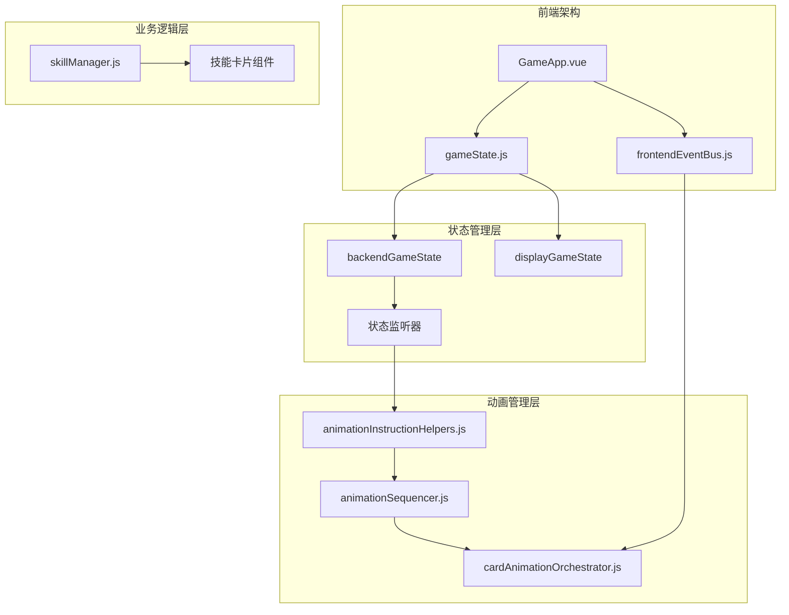
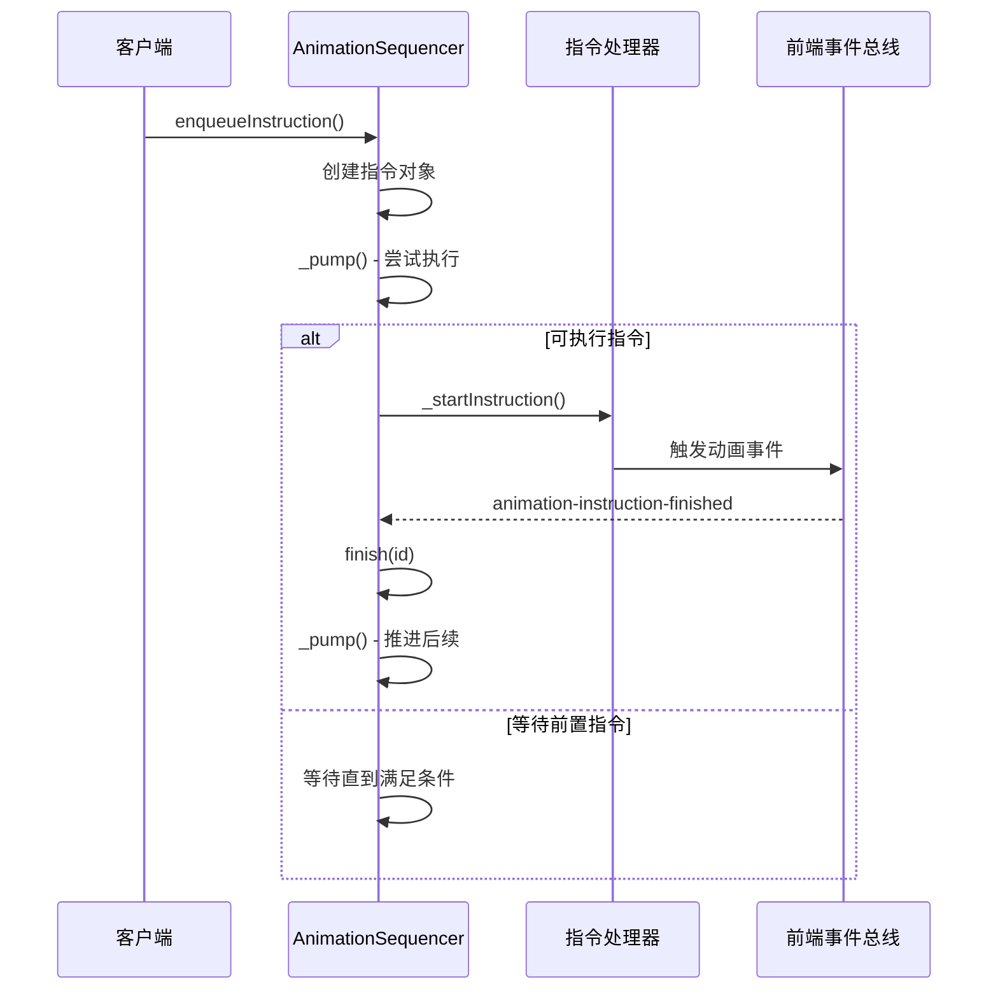

# 性能优化策略

<cite>
**本文档中引用的文件**
- [gameState.js](file://src/data/gameState.js)
- [animationInstructionHelpers.js](file://src/data/animationInstructionHelpers.js)
- [animationSequencer.js](file://src/data/animationSequencer.js)
- [cardAnimationOrchestrator.js](file://src/utils/cardAnimationOrchestrator.js)
- [skillManager.js](file://src/data/skillManager.js)
- [frontendEventBus.js](file://src/frontendEventBus.js)
- [GameApp.vue](file://src/GameApp.vue)
</cite>

## 目录
1. [简介](#简介)
2. [项目架构概览](#项目架构概览)
3. [批量更新机制](#批量更新机制)
4. [状态同步优化](#状态同步优化)
5. [动画性能优化](#动画性能优化)
6. [响应式系统优化](#响应式系统优化)
7. [事件节流与防抖](#事件节流与防抖)
8. [缓存策略](#缓存策略)
9. [性能监控与调试](#性能监控与调试)
10. [最佳实践建议](#最佳实践建议)

## 简介

在高频事件场景下（如连续技能释放），游戏状态管理面临着巨大的性能挑战。本文档深入分析了项目中实现的各种性能优化策略，包括批量更新机制、状态同步优化、动画性能控制等关键技术手段，旨在为开发者提供全面的性能优化指导。

该项目是一个基于Vue.js的游戏应用，采用了前后端分离的状态管理模式，通过精心设计的动画序列器和状态同步机制，实现了高效的性能表现。

## 项目架构概览



**图表来源**
- [GameApp.vue](file://src/GameApp.vue#L1-L139)
- [gameState.js](file://src/data/gameState.js#L1-L75)
- [animationSequencer.js](file://src/data/animationSequencer.js#L1-L135)

## 批量更新机制

### 后端状态批处理

项目实现了智能的后端状态批处理机制，通过监听状态变化并在事件循环结束时统一处理：

```javascript
// 内部：监听 backendGameState 变化，标记为脏
// 如果backendGameState为脏，则在任何enqueueInstruction调用前，自动插入一次enqueueState，并清除脏标记
let backendStateDirty = false;
let endOfTickStateSycnScheduled = false;

function scheduleEndOfTickCheck() {
  if (endOfTickStateSycnScheduled) return;
  endOfTickStateSycnScheduled = true;
  setTimeout(() => {
    endOfTickStateSycnScheduled = false;
    if (backendStateDirty) {
      // tick 结束仍有未同步的变更，强制入队一次当前快照（默认带屏障）
      enqueueState();
    }
  }, 0);
}

export function registerBackendStateWatcher() {
  watch(backendGameState, () => {
    backendStateDirty = true;
    scheduleEndOfTickCheck();
  }, {deep: true, flush: "sync"});
}
```

### 批量状态同步

通过状态投影机制，实现了高效的批量状态同步：

```javascript
// 将 S 投影快照合并到显示层，仅写入/删除 S 字段，保留实例/方法（使用快照的原型）
export function applyProjectionToDisplay(src, dst) {
  if (Array.isArray(src) && Array.isArray(dst)) {
    const done = reconcileArrayById(src, dst);
    if (done) return;

    const len = src.length;
    for (let i = 0; i < len; i++) {
      const sEl = src[i];
      const dEl = dst[i];
      if (sEl && typeof sEl === 'object') {
        if (dEl && typeof dEl === 'object') {
          applyProjectionToDisplay(sEl, dEl);
        } else {
          const inst = createInstanceFromSnapshotNode(sEl);
          applyProjectionToDisplay(sEl, inst);
          dst[i] = inst;
        }
      } else {
        dst[i] = sEl;
      }
    }
    if (dst.length > len) dst.splice(len);
    return;
  }
  
  // 删除 dst 中 S 字段但 src 不再包含的键
  for (const key of Object.keys(dst)) {
    if (!isSKey(key)) continue;
    const desc = Object.getOwnPropertyDescriptor(dst, key);
    if (desc && typeof desc.get === 'function' && typeof desc.set !== 'function') continue;
    if (typeof dst[key] === 'function') continue;
    if (!Object.prototype.hasOwnProperty.call(src, key)) {
      try { delete dst[key]; } catch (_) {}
    }
  }
}
```

**章节来源**
- [animationInstructionHelpers.js](file://src/data/animationInstructionHelpers.js#L218-L261)
- [animationInstructionHelpers.js](file://src/data/animationInstructionHelpers.js#L125-L182)

## 状态同步优化

### 状态投影机制

项目采用了先进的状态投影机制，通过捕获快照来减少不必要的响应式开销：

```javascript
// projectToS：将 backendGameState 投影为轻量快照，仅包含 S 字段，同时保留原型链
function projectToS(value, seen = new WeakMap()) {
  if (value === null || typeof value !== 'object') return value;
  if (seen.has(value)) return seen.get(value);

  const raw = toRaw(value);

  if (Array.isArray(raw)) {
    // 维持为普通数组；若未来存在自定义 Array 子类，可按需设置原型
    const arr = new Array(raw.length);
    seen.set(value, arr);
    for (let i = 0; i < raw.length; i++) {
      arr[i] = projectToS(raw[i], seen);
    }
    return arr;
  }

  // 为对象创建与后端节点相同的原型
  const proto = Object.getPrototypeOf(raw) || Object.prototype;
  const out = Object.create(proto);
  seen.set(value, out);

  // 仅复制 S 字段，且避免向 getter-only / 不可写属性赋值
  for (const key of Object.keys(raw)) {
    if (!isSKey(key)) continue;
    const desc = Object.getOwnPropertyDescriptor(raw, key);
    // 如果后端自身就是 getter-only，也不需要写入该字段
    if (desc && typeof desc.get === 'function' && typeof desc.set !== 'function') continue;
    const v = raw[key];
    if (typeof v === 'function') continue;

    // 跳过不可写字段（考虑到原型链上可能定义为 getter-only）
    if (!isWritableProperty(out, key)) continue;

    out[key] = projectToS(v, seen);
  }
  return out;
}
```

### 状态同步指令

通过动画序列器实现状态同步的精确控制：

```javascript
// 对外暴露：将一次状态同步作为指令推入 sequencer
export function enqueueState({ snapshot, durationMs, waitTags } = {}) {
  const snap = snapshot || captureSnapshot();
  const dur = typeof durationMs === 'number' ? durationMs : DEFAULT_STATE_CHANGE_DURATION;
  return animationSequencer.enqueueInstruction({
    tags: ['state'],
    waitTags: waitTags || ['all'],
    durationMs: dur,
    start: () => {
      try {
        applyProjectionToDisplay(snap, displayGameState);
      } catch (err) {
        console.error('[animationInstructionHelpers] applyProjectionToDisplay failed:', err);
      }
    }
  });
}
```

**章节来源**
- [animationInstructionHelpers.js](file://src/data/animationInstructionHelpers.js#L25-L75)
- [animationInstructionHelpers.js](file://src/data/animationInstructionHelpers.js#L182-L222)

## 动画性能优化

### 动画序列器架构

项目实现了高性能的动画序列器，通过标签系统和等待机制实现复杂的动画协调：



**图表来源**
- [animationSequencer.js](file://src/data/animationSequencer.js#L40-L104)

### 卡牌动画编排器

卡牌动画编排器实现了高效的动画队列管理，支持并发和串行动画：

```javascript
// 全局卡牌动画编排器（DOM + GSAP）
// 特性：
// - 对每一张卡片（按 uniqueID）维护一个“异步动画播放队列”：
//   同一张卡的动画指令会按顺序串行执行，不会相互打断；不同卡片的动画可并发播放。
// - 透过 animateById 进行动画调度与 ghost 创建，其他路径不再创建 ghost。

const orchestrator = {
  overlayEl: null, // 用于存储所有ghost的overlay DOM element
  centerAnchorEl: null,
  deckAnchorEl: null,
  ghostContainerEl: null,
  // 记录：按ID缓存ghost，确保连续指令可复用状态
  // id -> { ghost, baseRect, startEl }
  _ghostRegistry: new Map(),
  // 管理在中心展示的卡片ID列表（按加入顺序）
  _centerIds: [],
  _layoutCenterDurationMs: 220,
  // 全局“时代戳”（reset代次）。当 resetAllGhosts 发生时用于屏蔽旧任务
  _epoch: 0,
  _bumpEpoch() { this._epoch++; return this._epoch; },
  // 排空模式：用于 resetAllGhosts 等待“之前提交”的动画自然结束
  _draining: false,
  _drainEpoch: null,
};
```

### 动画队列管理

通过 ID 链机制实现动画的有序执行：

```javascript
// Helper to animate by id (backend-driven)
const _idChains = new Map();
async function animateById({ id, kind, options = {}, steps, hideStart, completionToken, transfer }) {
  // 若调用方未提供 transfer 且是 appearFromAnchor，自动生成一份基础转移描述
  if (!transfer && kind === 'appearFromAnchor') {
    transfer = {
      type: 'appear',
      from: options.anchor || 'deck',
      to: options.toContainer || 'skills-hand'
    };
  }

  const scheduledEpoch = orchestrator._epoch;
  const run = async () => {
    if (orchestrator._draining) {
      if (scheduledEpoch !== orchestrator._drainEpoch) {
        if (completionToken) try { frontendEventBus.emit('animation-card-by-id-finished', { token: completionToken }); } catch (_) {}
        return;
      }
    } else if (scheduledEpoch !== orchestrator._epoch) {
      if (completionToken) try { frontendEventBus.emit('animation-card-by-id-finished', { token: completionToken }); } catch (_) {}
      return;
    }
    
    // 执行动画逻辑...
  };
  
  const prev = _idChains.get(id) || Promise.resolve();
  const safePrev = prev.catch(() => {});
  const next = safePrev.then(() => run());
  _idChains.set(id, next);
  next.finally(() => { if (_idChains.get(id) === next) _idChains.delete(id); });
  return next;
}
```

**章节来源**
- [cardAnimationOrchestrator.js](file://src/utils/cardAnimationOrchestrator.js#L40-L100)
- [cardAnimationOrchestrator.js](file://src/utils/cardAnimationOrchestrator.js#L468-L520)

## 响应式系统优化

### Vue 响应式优化

项目通过精心设计的响应式系统，实现了高效的视图更新：

```javascript
// gameState.js - 游戏状态管理（前后端分离）

import { reactive } from 'vue';
import { Player } from './player.js';
import SkillManager from './skillManager.js';

// 工厂方法：创建一个“干净”的游戏状态对象（非响应式）
export function createGameState() {
  return {
    // 游戏阶段: 'start', 'battle', 'rest', 'end'
    gameStage: 'start',

    // 休整界面阶段：'money' | 'breakthrough' | 'skill' | 'ability' | 'shop' | ''（不显示）
    restScreenStage: '',

    // 是否开启了瑞米进行游戏
    isRemiPresent: false,

    // 游戏结果状态
    isVictory: false,

    // 回合控制
    isEnemyTurn: false,

    get isPlayerTurn() {
      return !this.isEnemyTurn;
    },

    // 玩家数据
    player: reactive(new Player()),

    // 敌人数据（在战斗开始时赋值）
    enemy: {},

    // 奖励数据
    rewards: {
      breakthrough: false,
      money: 0,
      skills: [],
      abilities: []
    },

    // 当前商店内商品
    shopItems: [],

    // 战斗场次数
    battleCount: 0
  };
}

// 分别创建“显示层状态”和“后端状态”，二者结构一致，但相互独立
export const backendGameState = reactive(createGameState());
export const displayGameState = reactive(createGameState());
```

### 状态重置优化

通过智能的状态重置机制，避免不必要的重新渲染：

```javascript
// 重置显示层状态
export function resetDisplayGameState() {
  const fresh = createGameState();
  // 保持玩家对象响应式：用 Object.assign 同步字段
  Object.assign(displayGameState, fresh);
  Object.assign(displayGameState.player, fresh.player);
}

// 重置后端状态
export function resetBackendGameState() {
  const fresh = createGameState();
  Object.assign(backendGameState, fresh);
  Object.assign(backendGameState.player, fresh.player);
}

// 同时重置两份状态
export function resetAllGameStates() {
  resetDisplayGameState();
  resetBackendGameState();
}
```

**章节来源**
- [gameState.js](file://src/data/gameState.js#L1-L75)

## 事件节流与防抖

### 动画指令节流

项目实现了智能的动画指令节流机制，通过标签系统控制动画执行时机：

```javascript
// AnimationSequencer 类实现
class AnimationSequencer {
  constructor() {
    this._instructions = [];   // 保序数组
    this._idToTimer = new Map();

    // 监听来自前端的“动画完成”通知
    frontendEventBus.on('animation-instruction-finished', (payload = {}) => {
      const id = payload?.id;
      if (id) this.finish(id, 'frontend');
    });
  }

  // 可执行判定：所有位于 index 之前、且与 waitTags 有交集的，都必须 finished
  _canExecute(index) {
    const current = this._instructions[index];
    if (!current) return false;
    for (let j = 0; j < index; j++) {
      const prev = this._instructions[j];
      if (!prev) continue;
      if (prev.status === 'finished') continue;
      if (hasIntersection(prev.tags, current.waitTags)) {
        return false;
      }
    }
    return true;
  }

  _startInstruction(instr) {
    instr.status = 'running';
    instr._startedAt = Date.now();
    try {
      instr.start({ id: instr.id, meta: instr.meta, emit: (name, payload) => frontendEventBus.emit(name, payload) });
    } catch (err) {
      console.error('[animationSequencer] start logic error:', err);
    }
    if (isFinite(instr.durationMs) && instr.durationMs >= 0) {
      const timerId = setTimeout(() => {
        this.finish(instr.id, 'timeout');
      }, Math.max(0, instr.durationMs));
      this._idToTimer.set(instr.id, timerId);
    }
  }
}
```

### 卡牌动画防抖

通过 epoch 系统实现动画的防抖控制：

```javascript
// 动画防抖机制
_resetAllGhosts({ restoreStart = true } = {}) {
  // 建立“排空屏障”：记录此刻的epoch，并立即推进到下一代，阻断之后提交的新动画
  const drainEpoch = this._epoch;
  this._draining = true;
  this._drainEpoch = drainEpoch;
  this._bumpEpoch();

  // 截取当前各ID队列的末尾promise，等待它们结算（表示“此刻之前提交”的动画都已完成”）
  const tails = Array.from(_idChains.values()).map(p => p.catch(() => {}));
  try { await Promise.all(tails); } catch (_) {}

  // 执行清理：注册表 + DOM 兜底
  for (const id of Array.from(this._ghostRegistry.keys())) {
    this._cleanupGhostById(id, { restoreStart });
  }
  
  // 清空队列并关闭“排空模式”
  try { if (typeof _idChains?.clear === 'function') _idChains.clear(); } catch (_) {}
  this._draining = false;
  this._drainEpoch = null;
}
```

**章节来源**
- [animationSequencer.js](file://src/data/animationSequencer.js#L24-L104)
- [cardAnimationOrchestrator.js](file://src/utils/cardAnimationOrchestrator.js#L432-L468)

## 缓存策略

### 技能缓存机制

项目实现了高效的技能缓存机制，通过技能注册表和懒加载实现性能优化：

```javascript
// 技能管理器类
class SkillManager {
  constructor() {
    this.skills = [];
    this.skillRegistry = new Map(); // 新增技能注册表
    
    // 注册技能
    registerSkill(SkillClass) {
      const skillName = (new SkillClass()).name;
      this.skillRegistry.set(skillName, SkillClass);
    }

    // 创建技能实例
    createSkill(skillName) {
      // 使用注册表创建技能实例
      const SkillClass = this.skillRegistry.get(skillName);
      if (SkillClass) {
        const obj = new SkillClass();
        obj.description = obj.regenerateDescription();
        return obj;
      }
      throw new Error(`Unknown skill: ${skillName}`);
    }
  }
  
  // 动态加载所有技能
  static async loadAllSkills() {
    const skillManager = SkillManager.getInstance();
    
    // 动态导入所有技能文件
    const skillModules = [
      await import('./skills/martial_arts/agilePunch.js'),
      await import('./skills/martial_arts/block.js'),
      // ... 更多技能模块
    ];
    
    // 遍历所有模块并注册其中的技能
    for (const module of skillModules) {
      for (const [key, SkillClass] of Object.entries(module)) {
        if (typeof SkillClass === 'function' && SkillClass !== Skill && SkillClass.prototype instanceof Skill) {
          try {
            skillManager.registerSkill(SkillClass);
          } catch (error) {
            console.error(`Failed to register skill: ${key}`, error);
          }
        }
      }
    }
  }
}
```

### 状态投影缓存

通过状态投影机制实现高效的缓存：

```javascript
// projectToS：将 backendGameState 投影为轻量快照，仅包含 S 字段，同时保留原型链
function projectToS(value, seen = new WeakMap()) {
  if (value === null || typeof value !== 'object') return value;
  if (seen.has(value)) return seen.get(value);

  const raw = toRaw(value);
  const proto = Object.getPrototypeOf(raw) || Object.prototype;
  const out = Object.create(proto);
  seen.set(value, out);

  // 仅复制 S 字段，且避免向 getter-only / 不可写属性赋值
  for (const key of Object.keys(raw)) {
    if (!isSKey(key)) continue;
    const desc = Object.getOwnPropertyDescriptor(raw, key);
    if (desc && typeof desc.get === 'function' && typeof desc.set !== 'function') continue;
    const v = raw[key];
    if (typeof v === 'function') continue;

    // 跳过不可写字段
    if (!isWritableProperty(out, key)) continue;

    out[key] = projectToS(v, seen);
  }
  return out;
}
```

**章节来源**
- [skillManager.js](file://src/data/skillManager.js#L1-L50)
- [animationInstructionHelpers.js](file://src/data/animationInstructionHelpers.js#L25-L75)

## 性能监控与调试

### 动画性能监控

项目提供了完善的动画性能监控机制：

```javascript
// 动画性能监控
export default {
  captureSnapshot,
  applyProjectionToDisplay,
  enqueueState,
  enqueueDelay,
  enqueueUI,
  enqueueParticles,
  enqueueSound,
  enqueueBattleLog,
  enqueueClearBattleLog,
  enqueuePopMessage,
  enqueueDialog,
  enqueueAnimateCardById,
  enqueueClearCardAnimations,
  enqueueLockControl,
  enqueueUnlockControl,
  DEFAULT_STATE_CHANGE_DURATION,
  enqueueHurtAnimation,
  enqueueUnitDeath,
  buildCenterThenDeckSteps,
  buildDropToDeckSteps,
  enqueueCardCenterThenDeck,
  enqueueCardDropToDeck,
};
```

### 状态同步性能指标

通过默认状态变更时长控制性能：

```javascript
// 默认的状态同步“虚拟动画”时长
export const DEFAULT_STATE_CHANGE_DURATION = 200;

// 状态同步性能监控
export function enqueueState({ snapshot, durationMs, waitTags } = {}) {
  const snap = snapshot || captureSnapshot();
  const dur = typeof durationMs === 'number' ? durationMs : DEFAULT_STATE_CHANGE_DURATION;
  return animationSequencer.enqueueInstruction({
    tags: ['state'],
    waitTags: waitTags || ['all'],
    durationMs: dur,
    start: () => {
      try {
        applyProjectionToDisplay(snap, displayGameState);
      } catch (err) {
        console.error('[animationInstructionHelpers] applyProjectionToDisplay failed:', err);
      }
    }
  });
}
```

## 最佳实践建议

### 1. 批量状态更新

- 使用 `registerBackendStateWatcher()` 监听状态变化
- 利用 `enqueueState()` 进行批量状态同步
- 通过 `scheduleEndOfTickCheck()` 实现延迟批处理

### 2. 动画性能优化

- 使用动画序列器控制动画执行顺序
- 通过标签系统实现动画间的依赖关系
- 利用 epoch 机制实现动画防抖

### 3. 响应式系统优化

- 保持状态对象的响应式特性
- 使用工厂方法创建干净的状态对象
- 通过 `Object.assign()` 实现高效的状态重置

### 4. 缓存策略

- 实现技能注册表进行缓存管理
- 使用状态投影机制减少不必要的响应式开销
- 通过 WeakMap 实现高效的缓存存储

### 5. 事件处理优化

- 使用事件总线进行解耦通信
- 实现智能的事件节流和防抖机制
- 通过标签系统控制事件处理顺序

### 6. 性能监控

- 监控动画执行时间和状态同步性能
- 使用默认时长参数控制性能边界
- 实现完善的错误处理和日志记录

通过这些优化策略的综合运用，项目能够在高频事件场景下保持优异的性能表现，为用户提供流畅的游戏体验。