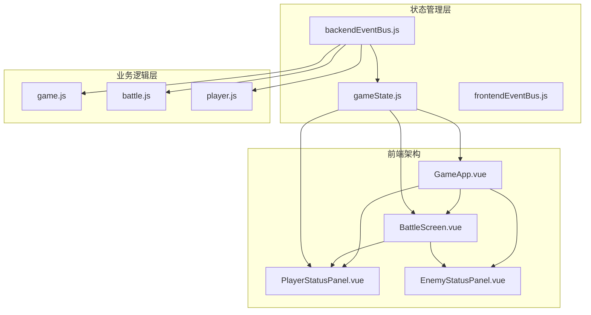
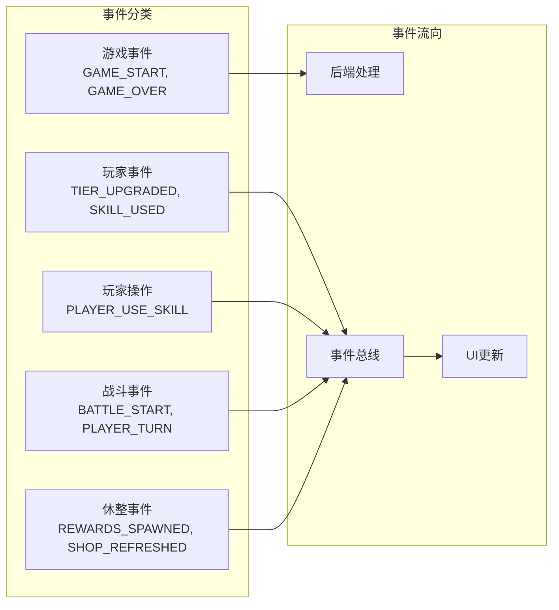
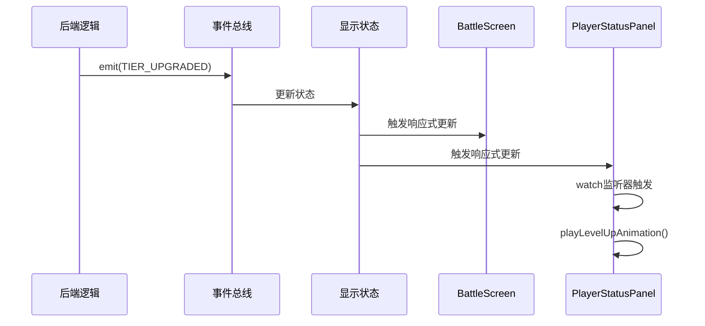

# 状态更新响应机制

<cite>
**本文档中引用的文件**
- [gameState.js](file://src/data/gameState.js)
- [backendEventBus.js](file://src/backendEventBus.js)
- [frontendEventBus.js](file://src/frontendEventBus.js)
- [GameApp.vue](file://src/GameApp.vue)
- [BattleScreen.vue](file://src/components/battle/BattleScreen.vue)
- [PlayerStatusPanel.vue](file://src/components/global/PlayerStatusPanel.vue)
- [player.js](file://src/data/player.js)
- [game.js](file://src/game.js)
- [battle.js](file://src/data/battle.js)
</cite>

## 目录
1. [简介](#简介)
2. [项目架构概览](#项目架构概览)
3. [游戏状态管理核心](#游戏状态管理核心)
4. [事件驱动架构](#事件驱动架构)
5. [响应式状态更新机制](#响应式状态更新机制)
6. [UI组件状态订阅机制](#ui组件状态订阅机制)
7. [状态更新的原子性保证](#状态更新的原子性保证)
8. [性能优化策略](#性能优化策略)
9. [故障排除指南](#故障排除指南)
10. [总结](#总结)

## 简介

本文档深入分析了RTVL游戏项目中`gameState.js`如何通过Vue 3的响应式系统与事件驱动模型的集成，实现高效、安全的游戏状态更新机制。该系统采用前后端分离的设计理念，通过事件总线模式实现状态的实时响应和UI的自动刷新。

## 项目架构概览

该项目采用了现代化的前端架构设计，主要包含以下核心组件：



**图表来源**
- [GameApp.vue](file://src/GameApp.vue#L1-L139)
- [gameState.js](file://src/data/gameState.js#L1-L75)
- [backendEventBus.js](file://src/backendEventBus.js#L1-L80)

## 游戏状态管理核心

### 状态对象设计

游戏状态管理系统采用工厂模式创建状态对象，并通过Vue 3的`reactive`系统实现响应式管理：

```javascript
// 工厂方法：创建一个"干净"的游戏状态对象（非响应式）
export function createGameState() {
  return {
    // 游戏阶段: 'start', 'battle', 'rest', 'end'
    gameStage: 'start',
    
    // 休整界面阶段：'money' | 'breakthrough' | 'skill' | 'ability' | 'shop' | ''（不显示）
    restScreenStage: '',
    
    // 是否开启了瑞米进行游戏
    isRemiPresent: false,
    
    // 游戏结果状态
    isVictory: false,
    
    // 回合控制
    isEnemyTurn: false,
    
    get isPlayerTurn() {
      return !this.isEnemyTurn;
    },
    
    // 玩家数据
    player: reactive(new Player()),
    
    // 敌人数据（在战斗开始时赋值）
    enemy: {},
    
    // 奖励数据
    rewards: {
      breakthrough: false,
      money: 0,
      skills: [],
      abilities: []
    },
    
    // 当前商店内商品
    shopItems: [],
    
    // 战斗场次数
    battleCount: 0
  };
}
```

### 双状态架构设计

系统采用双状态架构，分别管理显示层状态和后端状态：

```javascript
// 分别创建"显示层状态"和"后端状态"，二者结构一致，但相互独立
export const backendGameState = reactive(createGameState());
export const displayGameState = reactive(createGameState());
```

这种设计确保了：
- **状态隔离**：显示层状态和后端状态互不影响
- **性能优化**：显示层状态专注于UI渲染，后端状态处理业务逻辑
- **调试便利**：便于分别调试前后端状态

**章节来源**
- [gameState.js](file://src/data/gameState.js#L1-L75)

## 事件驱动架构

### 后端事件总线设计

后端事件总线使用mitt库实现，定义了完整的事件命名空间：

```javascript
export const EventNames = {
  Game: {
    PRE_GAME_START: 'pre-game-start',
    GAME_START: 'game-start',
    ENTER_BATTLE_STAGE: 'enter-battle-stage',
    ENTER_REST_STAGE: 'enter-rest-stage',
    PRE_BATTLE: 'pre-battle',
    POST_BATTLE: 'post-battle',
    GAME_OVER: 'game-over',
  },
  Player: {
    // 休息/通用事件（由后端触发的结果类事件）
    TIER_UPGRADED: 'player-tier-upgraded',
    ABILITY_CLAIMED: 'player-ability-claimed',
    MONEY_CLAIMED: 'player-money-claimed',
    SKILL_REWARD_CLAIMED: 'player-skill-claimed',
    // 战斗事件（后端广播的状态更新/通知）
    FRONTIER_UPDATED: 'player-frontier-skills-updated',
    ACTIVATED_SKILLS_UPDATED: 'player-activated-skills-updated',
    ACTIVATED_SKILL_ENABLED: 'player-activated-skill-enabled',
    ACTIVATED_SKILL_DISABLED: 'player-activated-skill-disabled',
    EFFECT_CHANGED: 'player-effect-changed',
    SKILL_BURNT: 'player-skill-burnt',
    SKILL_DISCOVERED: 'player-skill-discovered',
    SKILL_USED: 'player-skill-used',
    SKILL_DROPPED: 'player-skill-dropped',
    SKILL_DRAWN: 'player-skill-drawn'
  },
  // 玩家操作事件（仅由前端发起，用于告知后端进行结算/流程推进）
  PlayerOperations: {
    PLAYER_USE_SKILL: 'battle-player-use-skill',
    PLAYER_SHIFT_SKILL: 'battle-player-shift-skill',
    PLAYER_END_TURN: 'player-end-turn',
    PLAYER_STOP_ACTIVATED_SKILL: 'battle-player-stop-activated-skill',
    CLAIM_MONEY: 'rest-claim-money',
    CLAIM_SKILL: 'rest-claim-skill',
    CLAIM_ABILITY: 'rest-claim-ability',
    CLAIM_BREAKTHROUGH: 'rest-claim-breakthrough',
    REORDER_SKILLS: 'rest-reorder-skills',
    PURCHASE_ITEM: 'rest-purchase-item',
    FINISH: 'rest-finish',
    DROP_REWARD: 'rest-drop-reward'
  }
};
```

### 事件分类体系

事件系统采用清晰的分类体系：



**图表来源**
- [backendEventBus.js](file://src/backendEventBus.js#L5-L75)

**章节来源**
- [backendEventBus.js](file://src/backendEventBus.js#L1-L80)

## 响应式状态更新机制

### Vue 3 Reactive系统集成

游戏状态通过Vue 3的`reactive`系统实现响应式更新：

```javascript
// 玩家数据
player: reactive(new Player()),

// 敌人数据（在战斗开始时赋值）
enemy: {},
```

### 状态同步机制

系统通过动画序列器实现状态的平滑同步：

```javascript
// 对外暴露：将一次状态同步作为指令推入sequencer
export function enqueueState({ snapshot, durationMs, waitTags } = {}) {
  const snap = snapshot || captureSnapshot();
  const dur = typeof durationMs === 'number' ? durationMs : DEFAULT_STATE_CHANGE_DURATION;
  return animationSequencer.enqueueInstruction({
    tags: ['state'],
    waitTags: waitTags || ['all'],
    durationMs: dur,
    start: () => {
      try {
        applyProjectionToDisplay(snap, displayGameState);
      } catch (err) {
        console.error('Failed to apply state projection:', err);
      }
    }
  });
}
```

### 状态快照捕获

```javascript
// 捕获一次后台状态快照
export function captureSnapshot() {
  return projectToS(backendGameState);
}
```

### 状态投影应用

```javascript
// 将后端状态投影到显示状态
function applyProjectionToDisplay(snap, dst) {
  for (const key in snap) {
    const sVal = snap[key];
    const sProto = Object.getPrototypeOf(sVal);
    
    if (sProto && sProto.constructor.name === 'Object') {
      if (!dst[key]) {
        dst[key] = {};
      }
      let obj = Object.create(sProto || Object.prototype);
      applyProjectionToDisplay(sVal, obj);
      dst[key] = obj;
      continue;
    }
    
    if (dst[key] !== sVal) dst[key] = sVal;
  }
}
```

**章节来源**
- [gameState.js](file://src/data/gameState.js#L1-L75)
- [animationInstructionHelpers.js](file://src/data/animationInstructionHelpers.js#L182-L222)

## UI组件状态订阅机制

### BattleScreen组件的状态订阅

BattleScreen组件通过props接收游戏状态，并订阅战斗日志事件：

```javascript
export default {
  name: 'BattleScreen',
  components: {
    BattleLogPanel,
    EnemyStatusPanel,
    PlayerStatusPanel,
    ActionPanel,
    OverlaySkillsPanel,
  },
  props: {
    player: { type: Object, required: true },
    enemy: { type: Object, required: true },
    isPlayerTurn: { type: Boolean, default: true },
    level: { type: Number, default: 1 }
  },
  data() {
    return {
      logs: [],
    };
  },
  mounted() {
    frontendEventBus.on('add-battle-log', this.onAddBattleLog);
    frontendEventBus.on('clear-battle-log', this.onClearBattleLog);
  },
  beforeUnmount() {
    frontendEventBus.off('add-battle-log', this.onAddBattleLog);
    frontendEventBus.off('clear-battle-log', this.onClearBattleLog);
  },
  methods: {
    onAddBattleLog(value) {
      // 兼容字符串与对象格式
      this.logs.push(value);
    },
    onClearBattleLog() {
      this.logs = [];
    },
  }
};
```

### PlayerStatusPanel的响应式监听

PlayerStatusPanel组件实现了复杂的响应式监听机制：

```javascript
export default {
  name: 'PlayerStatusPanel',
  components: {
    EffectDisplayBar,
    HurtAnimationWrapper,
    PlayerBasicStats,
    HealthBar,
    ManaBar,
    ActionPointsBar
  },
  props: {
    player: {
      type: Object,
      required: true
    },
    restScreen: {
      type: Boolean,
      default: false
    }
  },
  
  watch: {
    // 监听玩家等阶变化，播放升级动画
    'player.tier'(newTier, oldTier) {
      if (newTier !== oldTier && this.restScreen) {
        this.playLevelUpAnimation();
      }
    },
  }
};
```

### 计算属性的使用

GameApp组件使用计算属性来简化状态访问：

```javascript
export default {
  name: 'App',
  computed: {
    isPlayerTurn() {
      return !gameState.isEnemyTurn;
    }
  },
  data() {
    return {
      gameState: gameState
    }
  }
}
```

### 组件间通信模式



**图表来源**
- [BattleScreen.vue](file://src/components/battle/BattleScreen.vue#L40-L60)
- [PlayerStatusPanel.vue](file://src/components/global/PlayerStatusPanel.vue#L130-L140)

**章节来源**
- [BattleScreen.vue](file://src/components/battle/BattleScreen.vue#L1-L112)
- [PlayerStatusPanel.vue](file://src/components/global/PlayerStatusPanel.vue#L1-L216)
- [GameApp.vue](file://src/GameApp.vue#L50-L70)

## 状态更新的原子性保证

### 状态重置机制

系统提供了完整的状态重置机制，确保状态的一致性：

```javascript
// 重置显示层状态
export function resetDisplayGameState() {
  const fresh = createGameState();
  // 保持玩家对象响应式：用 Object.assign 同步字段
  Object.assign(displayGameState, fresh);
  Object.assign(displayGameState.player, fresh.player);
}

// 重置后端状态
export function resetBackendGameState() {
  const fresh = createGameState();
  Object.assign(backendGameState, fresh);
  Object.assign(backendGameState.player, fresh.player);
}

// 同时重置两份状态
export function resetAllGameStates() {
  resetDisplayGameState();
  resetBackendGameState();
}
```

### 状态同步的安全性

```javascript
// 将后端状态投影到显示状态的安全实现
function applyProjectionToDisplay(snap, dst) {
  for (const key in snap) {
    const sVal = snap[key];
    const sProto = Object.getPrototypeOf(sVal);
    
    // 处理复杂对象的递归投影
    if (sProto && sProto.constructor.name === 'Object') {
      if (!dst[key]) {
        dst[key] = {};
      }
      let obj = Object.create(sProto || Object.prototype);
      applyProjectionToDisplay(sVal, obj);
      dst[key] = obj;
      continue;
    }
    
    // 原子性更新检查
    if (dst[key] !== sVal) dst[key] = sVal;
  }
}
```

### 竞态条件防护

系统通过以下机制防止竞态条件：

1. **事件队列管理**：使用动画序列器管理状态更新顺序
2. **状态快照机制**：通过快照捕获确保状态一致性
3. **原子性更新**：使用`Object.assign`进行整体状态替换

**章节来源**
- [gameState.js](file://src/data/gameState.js#L55-L75)

## 性能优化策略

### 防抖和批量更新

虽然代码中没有显式的防抖实现，但系统通过以下方式优化性能：

1. **事件合并**：多个状态变更通过事件总线批量处理
2. **动画序列化**：使用动画序列器控制状态更新节奏
3. **条件更新**：只有在状态真正发生变化时才触发更新

### 状态投影优化

```javascript
// 优化的状态投影实现
function applyProjectionToDisplay(snap, dst) {
  // 使用原型链优化对象创建
  const sProto = Object.getPrototypeOf(snap);
  if (sProto && sProto.constructor.name === 'Object') {
    let obj = Object.create(sProto || Object.prototype);
    applyProjectionToDisplay(snap, obj);
    dst[key] = obj;
    return;
  }
  
  // 原子性检查避免不必要的更新
  if (dst[key] !== sVal) dst[key] = sVal;
}
```

### 内存管理

系统通过以下方式优化内存使用：

1. **对象池模式**：重用状态对象减少GC压力
2. **弱引用**：合理使用WeakMap等弱引用结构
3. **及时清理**：组件卸载时及时清理事件监听器

### 性能监控

```javascript
// 性能监控示例
export function enqueueState({ snapshot, durationMs, waitTags } = {}) {
  const startTime = performance.now();
  
  const snap = snapshot || captureSnapshot();
  const dur = typeof durationMs === 'number' ? durationMs : DEFAULT_STATE_CHANGE_DURATION;
  
  return animationSequencer.enqueueInstruction({
    tags: ['state'],
    waitTags: waitTags || ['all'],
    durationMs: dur,
    start: () => {
      try {
        applyProjectionToDisplay(snap, displayGameState);
        const endTime = performance.now();
        console.log(`State update took ${endTime - startTime} milliseconds`);
      } catch (err) {
        console.error('Failed to apply state projection:', err);
      }
    }
  });
}
```

**章节来源**
- [animationInstructionHelpers.js](file://src/data/animationInstructionHelpers.js#L182-L222)

## 故障排除指南

### 常见问题诊断

1. **状态不同步问题**
   - 检查事件总线是否正确注册
   - 验证状态快照捕获是否完整
   - 确认投影应用过程中的异常

2. **响应式失效问题**
   - 检查Vue 3版本兼容性
   - 验证reactive包装是否正确
   - 确认对象属性是否动态添加

3. **性能问题**
   - 监控状态更新频率
   - 检查事件监听器泄漏
   - 优化复杂对象的投影逻辑

### 调试工具

```javascript
// 状态调试辅助函数
export function debugGameState(stateType = 'display') {
  const state = stateType === 'display' ? displayGameState : backendGameState;
  
  console.group(`Game State Debug - ${stateType}`);
  console.log('Game Stage:', state.gameStage);
  console.log('Player HP:', state.player.hp);
  console.log('Player Mana:', state.player.mana);
  console.log('Is Player Turn:', state.isPlayerTurn);
  console.log('Battle Count:', state.battleCount);
  console.groupEnd();
}
```

### 错误恢复机制

```javascript
// 状态恢复机制
export function recoverGameState(fallbackState) {
  try {
    // 尝试恢复状态
    Object.assign(displayGameState, fallbackState);
    Object.assign(backendGameState, fallbackState);
  } catch (error) {
    console.error('Failed to recover game state:', error);
    // 使用默认状态
    resetAllGameStates();
  }
}
```

**章节来源**
- [gameState.js](file://src/data/gameState.js#L55-L75)

## 总结

RTVL游戏项目的状态更新响应机制展现了现代前端架构的最佳实践：

### 核心优势

1. **响应式集成**：完美结合Vue 3的响应式系统与事件驱动架构
2. **状态隔离**：前后端状态分离，提升系统稳定性和可维护性
3. **性能优化**：通过动画序列器和批量更新实现高性能状态管理
4. **错误防护**：完善的原子性保证和竞态条件防护机制

### 设计亮点

- **模块化设计**：清晰的职责分离和组件化架构
- **事件驱动**：松耦合的事件总线系统
- **响应式更新**：自动化的UI状态同步
- **扩展性强**：易于添加新的状态类型和事件处理

### 应用价值

这套状态管理机制不仅适用于游戏开发，也为其他复杂的前端应用提供了优秀的参考范例，特别是在需要实时状态同步和高性能响应的应用场景中。