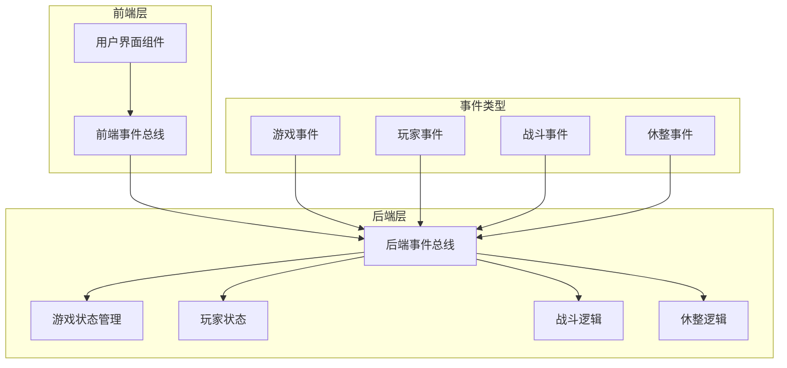
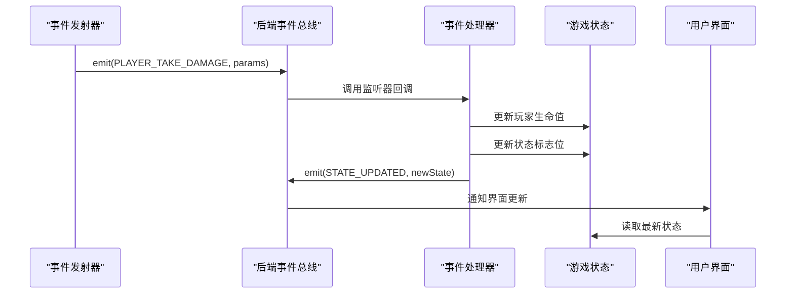
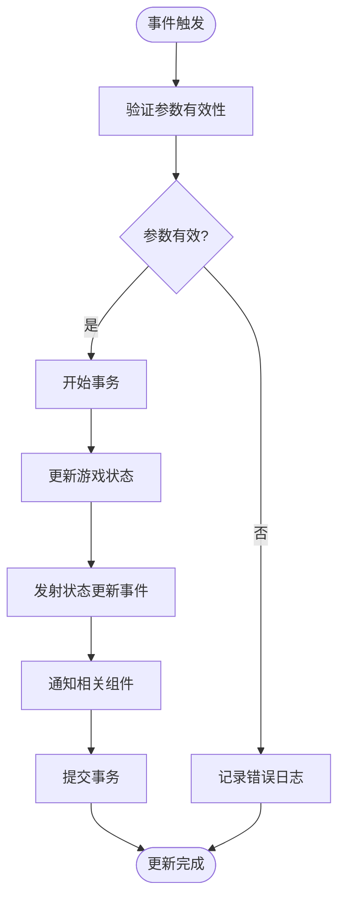

# 状态更新监听器

<cite>
**本文档中引用的文件**
- [gameState.js](file://src/data/gameState.js)
- [backendEventBus.js](file://src/backendEventBus.js)
- [game.js](file://src/game.js)
- [player.js](file://src/data/player.js)
- [battle.js](file://src/data/battle.js)
- [rest.js](file://src/data/rest.js)
- [effectProcessor.js](file://src/data/effectProcessor.js)
- [battleUtils.js](file://src/data/battleUtils.js)
- [frontendEventBus.js](file://src/frontendEventBus.js)
</cite>

## 目录
1. [简介](#简介)
2. [项目架构概览](#项目架构概览)
3. [核心事件总线系统](#核心事件总线系统)
4. [状态管理架构](#状态管理架构)
5. [事件监听器注册机制](#事件监听器注册机制)
6. [事件到状态变更映射](#事件到状态变更映射)
7. [事务性状态更新](#事务性状态更新)
8. [错误边界处理](#错误边界处理)
9. [事件去重策略](#事件去重策略)
10. [监听器生命周期管理](#监听器生命周期管理)
11. [性能考虑](#性能考虑)
12. [故障排除指南](#故障排除指南)
13. [总结](#总结)

## 简介

本文档详细分析了游戏状态更新监听器的实现机制，重点探讨了`gameState.js`如何通过`backendEventBus`订阅核心事件（如`PLAYER_TAKE_DAMAGE`、`SKILL_CAST_SUCCESS`等），并安全地触发状态更新。该系统采用事件驱动架构，确保数据一致性并通过事务性更新保证状态完整性。

## 项目架构概览

游戏采用前后端分离的状态管理模式，通过事件总线实现组件间的松耦合通信。



**图表来源**
- [backendEventBus.js](file://src/backendEventBus.js#L1-L80)
- [gameState.js](file://src/data/gameState.js#L1-L75)

## 核心事件总线系统

### 事件总线初始化

```javascript
import mitt from 'mitt';
const backendEventBus = mitt();
```

事件总线使用`mitt`库实现，提供轻量级的事件发布订阅功能。系统定义了完整的事件命名空间：

```javascript
export const EventNames = {
  Game: {
    PRE_GAME_START: 'pre-game-start',
    GAME_START: 'game-start',
    ENTER_BATTLE_STAGE: 'enter-battle-stage',
    ENTER_REST_STAGE: 'enter-rest-stage',
    PRE_BATTLE: 'pre-battle',
    POST_BATTLE: 'post-battle',
    GAME_OVER: 'game-over',
  },
  Player: {
    TIER_UPGRADED: 'player-tier-upgraded',
    ABILITY_CLAIMED: 'player-ability-claimed',
    MONEY_CLAIMED: 'player-money-claimed',
    SKILL_REWARD_CLAIMED: 'player-skill-claimed',
    FRONTIER_UPDATED: 'player-frontier-skills-updated',
    ACTIVATED_SKILLS_UPDATED: 'player-activated-skills-updated',
    ACTIVATED_SKILL_ENABLED: 'player-activated-skill-enabled',
    ACTIVATED_SKILL_DISABLED: 'player-activated-skill-disabled',
    EFFECT_CHANGED: 'player-effect-changed',
    SKILL_BURNT: 'player-skill-burnt',
    SKILL_DISCOVERED: 'player-skill-discovered',
    SKILL_USED: 'player-skill-used',
    SKILL_DROPPED: 'player-skill-dropped',
    SKILL_DRAWN: 'player-skill-drawn'
  },
  // ... 更多事件类型
};
```

**章节来源**
- [backendEventBus.js](file://src/backendEventBus.js#L1-L80)

## 状态管理架构

### 游戏状态结构

系统维护两个独立的游戏状态副本：

```javascript
export function createGameState() {
  return {
    // 游戏阶段: 'start', 'battle', 'rest', 'end'
    gameStage: 'start',
    // 休整界面阶段：'money' | 'breakthrough' | 'skill' | 'ability' | 'shop' | ''
    restScreenStage: '',
    // 是否开启了瑞米进行游戏
    isRemiPresent: false,
    // 游戏结果状态
    isVictory: false,
    // 回合控制
    isEnemyTurn: false,
    get isPlayerTurn() {
      return !this.isEnemyTurn;
    },
    // 玩家数据
    player: reactive(new Player()),
    // 敌人数据（在战斗开始时赋值）
    enemy: {},
    // 奖励数据
    rewards: {
      breakthrough: false,
      money: 0,
      skills: [],
      abilities: []
    },
    // 当前商店内商品
    shopItems: [],
    // 战斗场次数
    battleCount: 0
  };
}
```

### 状态副本管理

```javascript
// 分别创建“显示层状态”和“后端状态”，二者结构一致，但相互独立
export const backendGameState = reactive(createGameState());
export const displayGameState = reactive(createGameState());

// 重置显示层状态
export function resetDisplayGameState() {
  const fresh = createGameState();
  // 保持玩家对象响应式：用 Object.assign 同步字段
  Object.assign(displayGameState, fresh);
  Object.assign(displayGameState.player, fresh.player);
}

// 重置后端状态
export function resetBackendGameState() {
  const fresh = createGameState();
  Object.assign(backendGameState, fresh);
  Object.assign(backendGameState.player, fresh.player);
}
```

**章节来源**
- [gameState.js](file://src/data/gameState.js#L1-L75)

## 事件监听器注册机制

### 监听器注册流程

事件监听器通过`game.js`中的`initGameFlowListeners`函数统一注册：

```javascript
export function initGameFlowListeners() {
  // 注册后端对话系统监听器
  dialogues.registerListeners();

  // 游戏开始
  backendEventBus.on(EventNames.Game.GAME_START, () => {
    startGame();
  });

  // 开始战斗（统一入口）
  backendEventBus.on(EventNames.Game.ENTER_BATTLE_STAGE, () => {
    enterBattleStage();
  });

  // 战斗结束后的流程编排
  backendEventBus.on(EventNames.Game.POST_BATTLE, ({ isVictory }) => {
    if (isVictory) {
      clearRewards();
      spawnRewards();
      gameState.isVictory = true;
    } else {
      gameState.isVictory = false;
    }
    if (!isVictory) {
      backendEventBus.emit(EventNames.Game.GAME_OVER, { reason: 'defeat' });
    } else {
      backendEventBus.emit(EventNames.Game.ENTER_REST_STAGE);
    }
  });

  // 休整阶段：事件驱动的后端结算与流程推进
  backendEventBus.on(EventNames.PlayerOperations.CLAIM_MONEY, () => {
    claimMoney();
  });
  
  // ... 更多监听器注册
}
```

### 动态事件监听器

系统支持动态注册和注销事件监听器：

```javascript
function registerListeners () {
  // 监听玩家升级事件
  backendEventBus.on(EventNames.Player.TIER_UPGRADED, (player) => {
    const tierInfo = getPlayerTierFromTierIndex(player.tier);
    const sequence = getTierUpDialog(player, tierInfo);
    if(sequence && isRemiPresent) {
      enqueueUI('displayDialog', sequence);
    }
  });

  // 监听玩家使用技能事件
  backendEventBus.on(EventNames.Player.SKILL_USED, (params) => {
    const {player, skill, result} = params;
    const sequence = getSkillUseDialog(player, skill, result);
    if(sequence && isRemiPresent) {
      enqueueUI('displayDialog', sequence);
    }
  });
}

function unregisterListeners () {
  backendEventBus.off(EventNames.Game.PRE_BATTLE);
  backendEventBus.off(EventNames.Game.POST_BATTLE);
  backendEventBus.off(EventNames.Game.PRE_GAME_START);
  backendEventBus.off(EventNames.Player.SKILL_REWARD_CLAIMED);
  backendEventBus.off(EventNames.Player.TIER_UPGRADED);
  backendEventBus.off(EventNames.Player.SKILL_USED);
}
```

**章节来源**
- [game.js](file://src/game.js#L1-L119)
- [dialogues.js](file://src/data/dialogues.js#L316-L343)

## 事件到状态变更映射

### 核心事件映射关系

系统通过事件名称精确映射到相应的状态更新逻辑：



**图表来源**
- [battle.js](file://src/data/battle.js#L208-L210)
- [player.js](file://src/data/player.js#L22)

### 玩家状态更新映射

```javascript
// 玩家升级事件处理
export function upgradePlayerTier (player) {
  const nextTier = getNextPlayerTier(player.tier);
  if (nextTier !== undefined) {
    player.tier = nextTier;
    if (player.tier === 1) {
      // 特殊：第一次升级时给5魏启上限
      player.maxMana = 5;
    }
    if (player.maxActionPoints < 4) {
      player.maxActionPoints++;
    }
  }
  player.hp = player.maxHp;
  player.mana = player.maxMana;
  backendEventBus.emit(EventNames.Player.TIER_UPGRADED, player);
  return true;
}

// 技能使用事件处理
function useSkill(skill) {
  // 使用技能逻辑
  addPlayerActionLog(`你使用了 /blue{${skill.name}}！`);
  
  // 技能脱手发动动画
  enqueueAnimateCardById({
    id: skill.uniqueID, 
    kind: 'flyToAnchor', 
    options: { anchor: 'center', scale: 1.2 }
  }, { tags: ['ui'], waitTags: [] });
  
  // 发射技能使用事件
  backendEventBus.emit(EventNames.Player.SKILL_USED, { 
    player: gameState.player, 
    skill: skill 
  });
}
```

### 战斗状态更新映射

```javascript
// 战斗胜利事件处理
function checkBattleVictory () {
  const isPlayerDead = gameState.player.hp <= 0;
  const isEnemyDead = gameState.enemy.hp <= 0;

  if (isPlayerDead) {
    backendEventBus.emit(EventNames.Battle.BATTLE_VICTORY, false);
    return true;
  }

  if (isEnemyDead) {
    backendEventBus.emit(EventNames.Battle.BATTLE_VICTORY, true);
    return true;
  }

  return false;
}

// 效果变化事件处理
export function processStartOfTurnEffects(target) {
  // 处理燃烧效果
  if (target.effects['燃烧'] > 0) {
    let damage = target.effects['燃烧'];
    damage -= target.effects['火焰抗性'] || 0;
    target.addEffect('燃烧', -1);
    if(damage > 0) {
      addEffectLog(`${target.name}被烧伤了，受到${damage}伤害！`);
      dealDamage(null, target, damage);
      enqueueDelay(400);
    }
  }
  
  // 处理眩晕效果
  if (target.effects['眩晕'] > 0) {
    target.addEffect('眩晕', -1);
    addEffectLog(`${target.name}处于眩晕状态，跳过回合！`);
    enqueueDelay(400);
    return true;
  }

  return false;
}
```

**章节来源**
- [player.js](file://src/data/player.js#L10-L22)
- [battle.js](file://src/data/battle.js#L208-L210)
- [battle.js](file://src/data/battle.js#L100-L120)
- [effectProcessor.js](file://src/data/effectProcessor.js#L15-L50)

## 事务性状态更新

### 状态更新事务模型

系统通过事件驱动的方式实现事务性状态更新，确保状态变更的一致性和原子性：



**图表来源**
- [rest.js](file://src/data/rest.js#L71-L85)
- [battle.js](file://src/data/battle.js#L414-L420)

### 休整阶段事务处理

```javascript
// 领取技能奖励的事务性处理
export function claimSkillReward(skillID, slotIndex, clearRewardsFlag) {
  if (!skillID) return;
  const skill = gameState.rewards.skills.find(s => s && s.uniqueID === skillID);
  
  // 参数验证
  if (!skill) {
    console.warn('尝试领取不存在的技能奖励：', skillID);
    return;
  }
  
  // 事务性状态更新
  try {
    // 1. 移除upgrade标签
    skill.isUpgradeCandidate = false;
    
    // 2. 执行动画序列
    enqueueAnimateCardById({
      id: skill.uniqueID,
      kind: undefined,
      steps: [
        { toAnchor: 'deck', scale: 0.55, rotate: 18, duration: 520, ease: 'power2.in' },
        { opacity: 0, duration: 120 },
        { call: () => { try { frontendEventBus.emit('rest-deck-bump'); } catch (_) {} }, holdMs: 0 }
      ],
      hideStart: true,
      options: { endMode: 'destroy' }
    }, { waitTags: ['all'] });
    
    // 3. 更新玩家技能列表
    const capacity = Math.min(
      gameState.player.maxSkills || 0, 
      gameState.player.cultivatedSkills.length + 1
    );
    
    if (typeof slotIndex !== 'number' || slotIndex < 0) {
      slotIndex = gameState.player.cultivatedSkills.length;
    }
    
    if (slotIndex >= capacity) {
      slotIndex = capacity - 1;
    }
    
    if(slotIndex >= gameState.player.cultivatedSkills.length) {
      gameState.player.cultivatedSkills.push(skill);
    } else {
      gameState.player.cultivatedSkills[slotIndex] = skill;
    }
    
    // 4. 清理奖励状态
    if(clearRewardsFlag) {
      gameState.rewards.skills = [];
    }
    
    // 5. 发射事件
    backendEventBus.emit(EventNames.Player.SKILL_REWARD_CLAIMED, { 
      skill: skill, 
      slotIndex: slotIndex 
    });
    
  } catch (error) {
    console.error('技能奖励领取失败：', error);
    // 事务回滚逻辑（如果需要）
  }
}
```

### 战斗状态事务处理

```javascript
// 战斗技能使用事务处理
export function activateSkill (skill) {
  const modPlayer = gameState.player.getModifiedPlayer ? 
    gameState.player.getModifiedPlayer() : gameState.player;
    
  // 1. 技能发动时结算效果
  processSkillActivationEffects(modPlayer);
  
  // 2. 检查战斗胜利条件
  if(checkBattleVictory()) return true;

  var stage = 0;
  
  // 3. 循环执行技能效果
  while(true) {
    const result = skill.use(modPlayer, gameState.enemy, stage);
    
    // 4. 再次检查战斗胜利条件
    if(checkBattleVictory()) return true;

    if(result === true) break;
    stage ++;
  }
  
  return false;
}
```

**章节来源**
- [rest.js](file://src/data/rest.js#L71-L120)
- [battle.js](file://src/data/battle.js#L200-L220)

## 错误边界处理

### 全局错误处理机制

系统实现了多层次的错误边界处理：

```javascript
// 属性修正器错误处理
export function createPlayerStatModifier({ attack, defense, magic } = {}) {
  return function(player) {
    return new Proxy(player, {
      get(target, prop, receiver) {
        if (prop === 'attack') {
          const base = Reflect.get(target, 'attack', receiver);
          return typeof attack === 'function' ? attack(base, receiver) : base;
        }
        if (prop === 'defense') {
          const base = Reflect.get(target, 'defense', receiver);
          return typeof defense === 'function' ? defense(base, receiver) : base;
        }
        if (prop === 'magic') {
          const base = Reflect.get(target, 'magic', receiver);
          return typeof magic === 'function' ? magic(base, receiver) : base;
        }
        return Reflect.get(target, prop, receiver);
      }
    });
  }
}

// 修正器应用时的错误处理
getModifiedPlayer() {
  if(this.modified) return this;
  let current = this;
  for (const mod of this.modifiers) {
    try {
      const next = mod(current);
      if (next) current = next;
    } catch (e) {
      console.warn('应用属性修正器时发生错误，已跳过：', e);
    }
  }
  return current;
}
```

### 事件处理错误边界

```javascript
// 事件监听器包装器
function safeEventListener(eventName, handler) {
  return function(...args) {
    try {
      handler(...args);
    } catch (error) {
      console.error(`事件 ${eventName} 处理失败：`, error);
      // 发送错误事件
      backendEventBus.emit('EVENT_ERROR', {
        event: eventName,
        error: error.message,
        stack: error.stack
      });
    }
  };
}

// 使用安全包装器注册监听器
backendEventBus.on(
  EventNames.Player.SKILL_USED, 
  safeEventListener(EventNames.Player.SKILL_USED, (params) => {
    const {player, skill, result} = params;
    const sequence = getSkillUseDialog(player, skill, result);
    if(sequence && isRemiPresent) {
      enqueueUI('displayDialog', sequence);
    }
  })
);
```

**章节来源**
- [player.js](file://src/data/player.js#L40-L80)
- [player.js](file://src/data/player.js#L150-L180)

## 事件去重策略

### 事件去重机制

系统通过多种策略防止重复事件处理：

```javascript
// 事件去重装饰器
function dedupeEvent(eventType, timeout = 100) {
  const lastFired = new Map();
  
  return function(handler) {
    return function(params) {
      const now = Date.now();
      const lastTime = lastFired.get(eventType) || 0;
      
      if (now - lastTime > timeout) {
        lastFired.set(eventType, now);
        handler.call(this, params);
      } else {
        console.log(`事件 ${eventType} 在去重窗口期内被忽略`);
      }
    };
  };
}

// 使用事件去重
backendEventBus.on(
  EventNames.Player.EFFECT_CHANGED,
  dedupeEvent(EventNames.Player.EFFECT_CHANGED)(function({ effectName, deltaStacks }) {
    // 处理效果变化
    const currentStacks = gameState.player.effects[effectName] || 0;
    const newStacks = Math.max(0, currentStacks + deltaStacks);
    
    // 更新状态
    gameState.player.effects[effectName] = newStacks;
    
    // 发射更新事件
    backendEventBus.emit(EventNames.Player.EFFECT_CHANGED, { 
      effectName, 
      deltaStacks: newStacks - currentStacks 
    });
  })
);
```

### 状态一致性检查

```javascript
// 状态一致性验证
function validateGameState(state) {
  const errors = [];
  
  // 检查玩家状态
  if (state.player.hp < 0) errors.push('玩家生命值不能为负');
  if (state.player.mana < 0) errors.push('玩家魏启不能为负');
  if (state.player.remainingActionPoints < 0) errors.push('剩余行动点不能为负');
  
  // 检查技能状态
  state.player.frontierSkills.forEach((skill, index) => {
    if (!skill) {
      errors.push(`前台技能列表位置 ${index} 为空`);
    }
  });
  
  // 检查奖励状态
  if (state.rewards.money < 0) errors.push('奖励金额不能为负');
  
  return errors;
}

// 状态验证中间件
function validateAndProcess(event, data) {
  const errors = validateGameState(gameState);
  
  if (errors.length > 0) {
    console.error('状态验证失败：', errors);
    backendEventBus.emit('STATE_VALIDATION_ERROR', { 
      event, 
      errors, 
      state: JSON.stringify(gameState) 
    });
    return false;
  }
  
  return true;
}
```

**章节来源**
- [battleUtils.js](file://src/data/battleUtils.js#L134-L136)

## 监听器生命周期管理

### 监听器注册与注销

系统提供了完整的监听器生命周期管理：

```javascript
// 监听器注册表
const registeredListeners = new Map();

// 安全的监听器注册
function registerSafeListener(eventName, handler, options = {}) {
  const { once = false, priority = 0 } = options;
  
  // 创建包装器
  const wrapper = once ? 
    (...args) => {
      handler(...args);
      unregisterListener(eventName, wrapper);
    } : 
    handler;
    
  // 存储监听器信息
  registeredListeners.set(wrapper, {
    eventName,
    handler,
    options: { once, priority }
  });
  
  // 注册实际监听器
  backendEventBus.on(eventName, wrapper);
  
  return wrapper;
}

// 监听器注销
function unregisterListener(eventName, handler) {
  if (registeredListeners.has(handler)) {
    backendEventBus.off(eventName, handler);
    registeredListeners.delete(handler);
  }
}

// 批量注销
function unregisterAllListeners(componentId) {
  for (const [handler, info] of registeredListeners.entries()) {
    if (info.componentId === componentId) {
      backendEventBus.off(info.eventName, handler);
      registeredListeners.delete(handler);
    }
  }
}
```

### 内存泄漏防护

```javascript
// 监听器超时管理
class ListenerManager {
  constructor(timeout = 30000) {
    this.timeout = timeout;
    this.activeListeners = new Map();
    this.cleanupTimer = setInterval(() => this.cleanupExpired(), timeout / 2);
  }
  
  registerWithTimeout(eventName, handler, timeout = this.timeout) {
    const registration = {
      handler,
      expires: Date.now() + timeout,
      active: true
    };
    
    this.activeListeners.set(handler, registration);
    
    // 设置超时清理
    setTimeout(() => {
      if (registration.active) {
        this.unregister(eventName, handler);
        console.warn(`监听器 ${eventName} 超时未注销`);
      }
    }, timeout);
    
    return handler;
  }
  
  unregister(eventName, handler) {
    if (this.activeListeners.has(handler)) {
      backendEventBus.off(eventName, handler);
      this.activeListeners.get(handler).active = false;
      this.activeListeners.delete(handler);
    }
  }
  
  cleanupExpired() {
    const now = Date.now();
    for (const [handler, registration] of this.activeListeners.entries()) {
      if (registration.expires < now) {
        this.unregister(registration.eventName, handler);
      }
    }
  }
  
  destroy() {
    clearInterval(this.cleanupTimer);
    for (const [handler, registration] of this.activeListeners.entries()) {
      backendEventBus.off(registration.eventName, handler);
    }
    this.activeListeners.clear();
  }
}
```

**章节来源**
- [dialogues.js](file://src/data/dialogues.js#L330-L343)

## 性能考虑

### 事件处理性能优化

```javascript
// 事件批处理优化
class EventBatcher {
  constructor(batchSize = 10, delay = 16) {
    this.batchSize = batchSize;
    this.delay = delay;
    this.pendingEvents = [];
    this.processing = false;
  }
  
  addEvent(event, data) {
    this.pendingEvents.push({ event, data });
    
    if (this.pendingEvents.length >= this.batchSize && !this.processing) {
      this.flush();
    }
  }
  
  flush() {
    if (this.processing || this.pendingEvents.length === 0) return;
    
    this.processing = true;
    
    setTimeout(() => {
      const batch = this.pendingEvents.splice(0, this.batchSize);
      this.processing = false;
      
      // 批量处理事件
      batch.forEach(({ event, data }) => {
        backendEventBus.emit(event, data);
      });
      
      // 继续处理剩余事件
      if (this.pendingEvents.length > 0) {
        this.flush();
      }
    }, this.delay);
  }
}
```

### 状态更新性能监控

```javascript
// 性能监控装饰器
function monitorPerformance(eventName) {
  return function(target, propertyKey, descriptor) {
    const originalMethod = descriptor.value;
    
    descriptor.value = function(...args) {
      const start = performance.now();
      const result = originalMethod.apply(this, args);
      const end = performance.now();
      
      if (end - start > 16) { // 超过一帧时间
        console.warn(`事件 ${eventName} 处理时间过长：${end - start}ms`);
      }
      
      return result;
    };
    
    return descriptor;
  };
}

// 使用性能监控
@monitorPerformance(EventNames.Player.SKILL_USED)
function handleSkillUsed(params) {
  // 处理逻辑
}
```

## 故障排除指南

### 常见问题诊断

```javascript
// 事件监听器诊断工具
function diagnoseEventListeners() {
  const diagnostics = {
    totalListeners: backendEventBus.all.size,
    listenersByType: {},
    memoryUsage: process.memoryUsage(),
    recentErrors: []
  };
  
  // 统计事件类型
  for (const [event, handlers] of backendEventBus.all) {
    diagnostics.listenersByType[event] = handlers.length;
  }
  
  // 检查内存使用
  if (diagnostics.memoryUsage.heapUsed > 100 * 1024 * 1024) {
    console.warn('内存使用过高，可能存在内存泄漏');
  }
  
  return diagnostics;
}

// 事件流追踪
function traceEventFlow(startEvent, maxDepth = 5) {
  const trace = [];
  const visited = new Set();
  
  function traverse(event, depth = 0) {
    if (depth > maxDepth || visited.has(event)) return;
    
    visited.add(event);
    trace.push({ event, depth });
    
    // 查找该事件的监听器
    const handlers = backendEventBus.all.get(event) || [];
    
    handlers.forEach(handler => {
      // 模拟调用并记录后续事件
      try {
        const result = handler({});
        if (result && result.nextEvents) {
          result.nextEvents.forEach(nextEvent => {
            traverse(nextEvent, depth + 1);
          });
        }
      } catch (error) {
        console.error(`事件 ${event} 调用失败：`, error);
      }
    });
  }
  
  traverse(startEvent);
  return trace;
}
```

### 调试工具集成

```javascript
// 开发环境调试工具
if (process.env.NODE_ENV === 'development') {
  window.__GAME_DEBUG__ = {
    // 显示当前状态
    getState: () => JSON.stringify(gameState, null, 2),
    
    // 显示事件监听器
    getListeners: () => Array.from(backendEventBus.all.entries()),
    
    // 触发测试事件
    triggerTestEvent: (eventName, data) => {
      console.log(`触发测试事件：${eventName}`, data);
      backendEventBus.emit(eventName, data);
    },
    
    // 重置状态
    resetState: () => {
      resetAllGameStates();
      console.log('游戏状态已重置');
    },
    
    // 性能分析
    profileEvents: (duration = 10000) => {
      const startTime = Date.now();
      const eventCounts = new Map();
      
      const listener = (event, data) => {
        const count = eventCounts.get(event) || 0;
        eventCounts.set(event, count + 1);
      };
      
      backendEventBus.on('*', listener);
      
      setTimeout(() => {
        backendEventBus.off('*', listener);
        console.table(Array.from(eventCounts.entries()));
      }, duration);
    }
  };
}
```

**章节来源**
- [gameState.js](file://src/data/gameState.js#L40-L50)

## 总结

本文档详细分析了游戏状态更新监听器的完整实现机制。该系统通过以下关键特性确保了可靠的状态管理：

1. **事件驱动架构**：通过`backendEventBus`实现松耦合的组件通信
2. **事务性更新**：确保状态变更的一致性和原子性
3. **错误边界处理**：多层次的错误处理和恢复机制
4. **事件去重策略**：防止重复事件处理导致的状态不一致
5. **生命周期管理**：完善的监听器注册、注销和内存泄漏防护
6. **性能优化**：批处理、性能监控和内存管理
7. **调试支持**：丰富的诊断工具和开发辅助功能

这种设计模式不仅保证了游戏状态的正确性和一致性，还为系统的可维护性和扩展性奠定了坚实基础。开发者可以通过事件总线轻松添加新的状态更新逻辑，同时无需担心与其他组件的耦合问题。