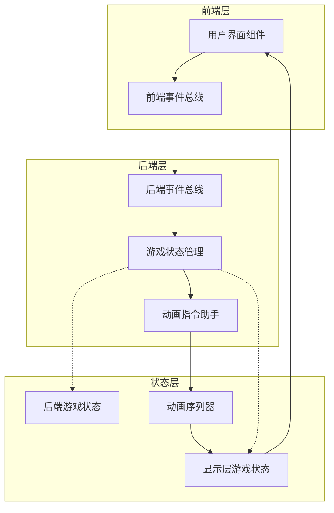
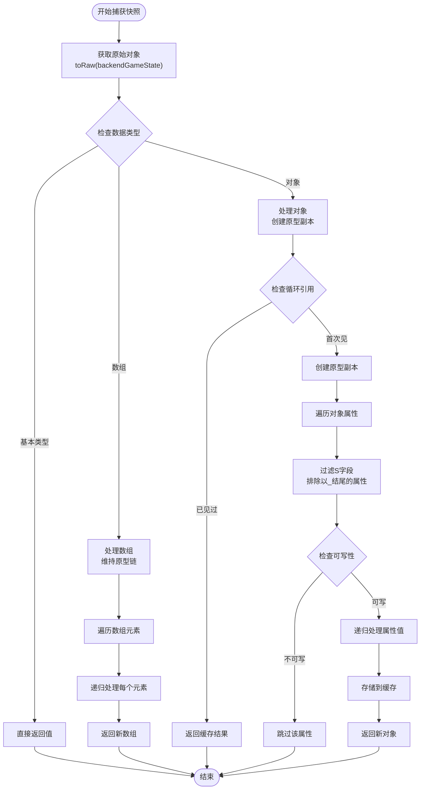
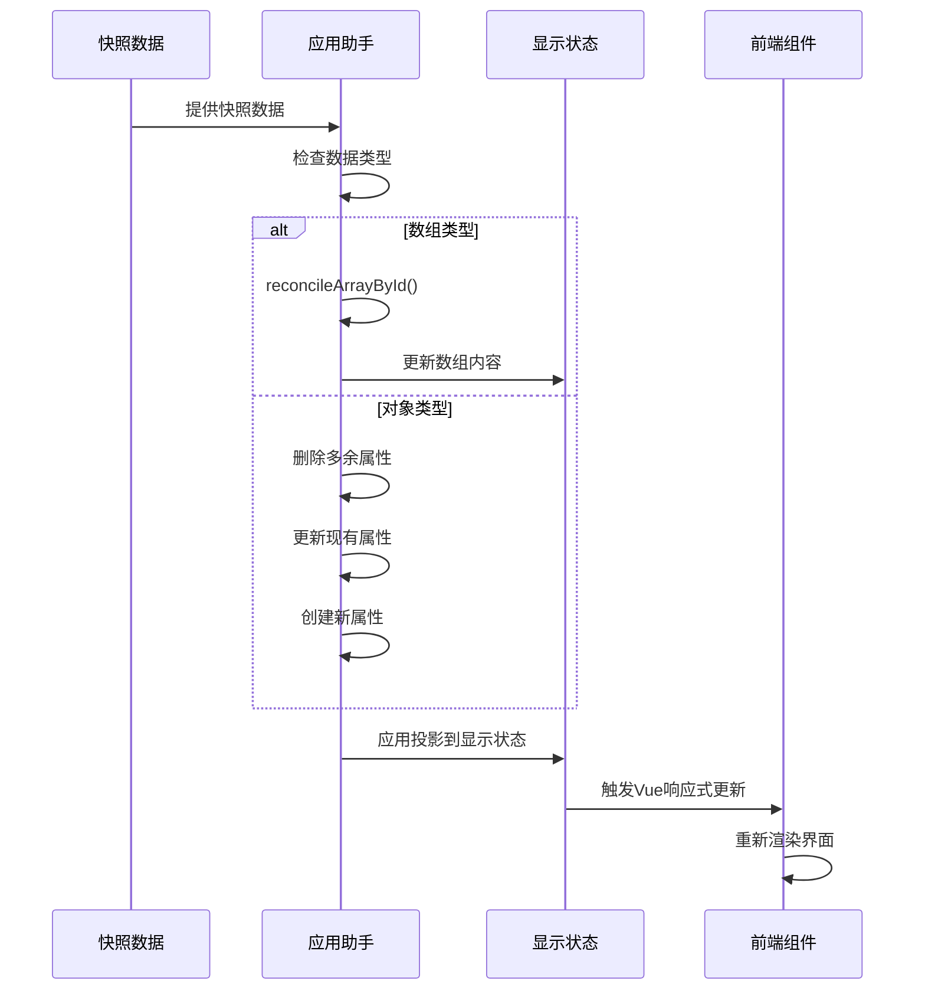
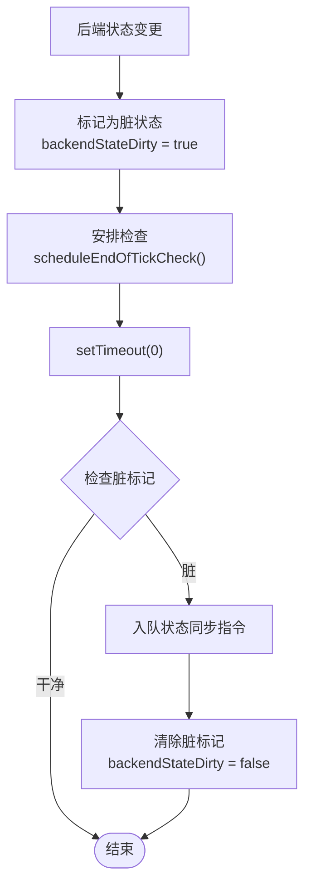
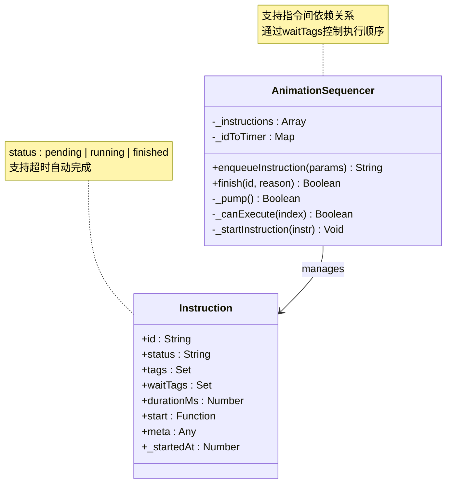
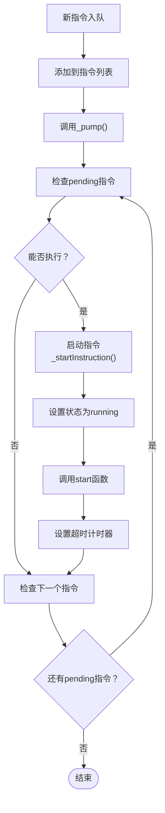
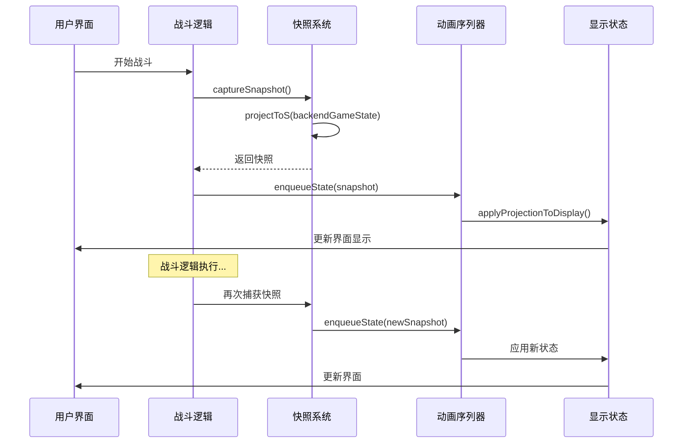

# 状态持久化与快照机制

<cite>
**本文档中引用的文件**
- [gameState.js](file://src/data/gameState.js)
- [animationInstructionHelpers.js](file://src/data/animationInstructionHelpers.js)
- [animationSequencer.js](file://src/data/animationSequencer.js)
- [battle.js](file://src/data/battle.js)
- [rest.js](file://src/data/rest.js)
- [backendEventBus.js](file://src/backendEventBus.js)
- [frontendEventBus.js](file://src/frontendEventBus.js)
</cite>

## 目录
1. [简介](#简介)
2. [项目架构概览](#项目架构概览)
3. [核心状态管理](#核心状态管理)
4. [快照机制详解](#快照机制详解)
5. [状态同步系统](#状态同步系统)
6. [动画序列器](#动画序列器)
7. [实际应用场景](#实际应用场景)
8. [性能优化与内存管理](#性能优化与内存管理)
9. [故障排除指南](#故障排除指南)
10. [总结](#总结)

## 简介

本文档详细介绍了RTVL游戏项目中的状态持久化与快照机制。该系统采用前后端分离的设计模式，通过精心设计的状态快照功能实现了战斗回退、状态恢复和调试回放等关键功能。系统的核心在于`animationInstructionHelpers.js`模块中实现的快照捕获和应用机制，配合`animationSequencer.js`提供的动画队列管理，形成了一个完整的状态同步框架。

## 项目架构概览



**图表来源**
- [gameState.js](file://src/data/gameState.js#L51-L73)
- [animationInstructionHelpers.js](file://src/data/animationInstructionHelpers.js#L1-L30)

## 核心状态管理

### 游戏状态结构

游戏状态管理系统采用工厂模式创建状态对象，支持前后端分离的状态管理：

```javascript
// 工厂方法：创建一个"干净"的游戏状态对象（非响应式）
export function createGameState() {
  return {
    // 游戏阶段: 'start', 'battle', 'rest', 'end'
    gameStage: 'start',
    
    // 休整界面阶段：'money' | 'breakthrough' | 'skill' | 'ability' | 'shop' | ''（不显示）
    restScreenStage: '',
    
    // 是否开启了瑞米进行游戏
    isRemiPresent: false,
    
    // 游戏结果状态
    isVictory: false,
    
    // 回合控制
    isEnemyTurn: false,
    
    // 玩家数据
    player: reactive(new Player()),
    
    // 敌人数据（在战斗开始时赋值）
    enemy: {},
    
    // 奖励数据
    rewards: {
      breakthrough: false,
      money: 0,
      skills: [],
      abilities: []
    },
    
    // 当前商店内商品
    shopItems: [],
    
    // 战斗场次数
    battleCount: 0
  };
}
```

### 前后端状态分离

系统维护两套独立但结构一致的状态：

```javascript
// 分别创建"显示层状态"和"后端状态"，二者结构一致，但相互独立
export const backendGameState = reactive(createGameState());
export const displayGameState = reactive(createGameState());
```

这种设计确保了：
- **状态隔离**：后端逻辑不受前端状态变化的影响
- **性能优化**：前端只接收必要的状态更新
- **调试便利**：可以分别追踪前后端状态变化

**章节来源**
- [gameState.js](file://src/data/gameState.js#L1-L75)

## 快照机制详解

### 快照捕获过程

快照捕获是状态持久化的核心功能，通过`projectToS`函数实现：



**图表来源**
- [animationInstructionHelpers.js](file://src/data/animationInstructionHelpers.js#L32-L67)

### 属性过滤规则

快照系统采用严格的属性过滤规则：

```javascript
function isSKey(key) {
  return typeof key !== 'string' || !key.endsWith('_');
}

function isWritableProperty(target, key) {
  // 在原始对象及其原型链上查找属性描述符，避免向仅 getter 的访问器属性赋值
  let cur = toRaw(target);
  let desc = undefined;
  while (cur) {
    desc = Object.getOwnPropertyDescriptor(cur, key);
    if (desc) break;
    cur = Object.getPrototypeOf(cur);
  }
  if (!desc) return true; // 未定义则可安全写入（会创建自有属性）
  if (typeof desc.get === 'function' && typeof desc.set !== 'function') return false; // getter-only
  if (Object.prototype.hasOwnProperty.call(desc, 'writable') && desc.writable === false) return false; // 数据属性非可写
  return true;
}
```

这些规则确保：
- **S字段优先**：只捕获以字母开头且不以`_`结尾的属性
- **保护不可变属性**：跳过getter-only和不可写属性
- **原型链保持**：正确处理继承关系

### 快照应用过程

`applyProjectionToDisplay`函数负责将快照应用到显示层：



**图表来源**
- [animationInstructionHelpers.js](file://src/data/animationInstructionHelpers.js#L104-L181)

**章节来源**
- [animationInstructionHelpers.js](file://src/data/animationInstructionHelpers.js#L32-L181)

## 状态同步系统

### 自动状态监听

系统通过Vue的`watch`函数实现自动状态监听：

```javascript
export function registerBackendStateWatcher() {
  watch(backendGameState, () => {
    backendStateDirty = true;
    scheduleEndOfTickCheck();
  }, {deep: true, flush: "sync"});
}
```

### 状态同步调度



**图表来源**
- [animationInstructionHelpers.js](file://src/data/animationInstructionHelpers.js#L224-L240)

### 指令队列管理

`enqueueInstruction`函数确保状态同步在任何新指令前执行：

```javascript
export function enqueueInstruction(payload) {
  if(backendStateDirty) {
    // 在入队任何新指令前，先入队一次状态同步
    enqueueState();
    backendStateDirty = false;
  }
  return animationSequencer.enqueueInstruction(payload);
}
```

**章节来源**
- [animationInstructionHelpers.js](file://src/data/animationInstructionHelpers.js#L224-L240)

## 动画序列器

### 序列器架构



**图表来源**
- [animationSequencer.js](file://src/data/animationSequencer.js#L25-L134)

### 指令执行逻辑



**图表来源**
- [animationSequencer.js](file://src/data/animationSequencer.js#L75-L95)

### 等待标签机制

系统使用等待标签实现复杂的依赖关系控制：

```javascript
// 可执行判定：所有位于 index 之前、且与 waitTags 有交集的，都必须 finished
_canExecute(index) {
  const current = this._instructions[index];
  if (!current) return false;
  for (let j = 0; j < index; j++) {
    const prev = this._instructions[j];
    if (!prev) continue;
    if (prev.status === 'finished') continue;
    if (hasIntersection(prev.tags, current.waitTags)) {
      return false;
    }
  }
  return true;
}
```

**章节来源**
- [animationSequencer.js](file://src/data/animationSequencer.js#L25-L134)

## 实际应用场景

### 战斗场景中的快照应用

在战斗系统中，快照机制发挥着关键作用：



**图表来源**
- [battle.js](file://src/data/battle.js#L25-L40)

### 休整阶段的状态管理

```javascript
// 生成奖励
export function spawnRewards() {
  // 计算战斗奖励
  gameState.rewards.money = Math.floor(Math.random() * 20) + 10;
  
  // 突破奖励
  gameState.rewards.breakthrough = (
    gameState.battleCount === 2 || gameState.enemy.isBoss
  );
  
  // 总是生成技能奖励
  spawnSkillRewards();
  
  // boss / 奇数次战斗后获得能力奖励
  const haveAbilityReward = (
    gameState.battleCount % 2 === 1 || gameState.enemy.isBoss
  );
  if(haveAbilityReward) {
    gameState.rewards.abilities = AbilityManager.getInstance().getRandomAbilities(
      0, gameState.player.tier
    );
  } else {
    gameState.rewards.abilities = [];
  }
  
  // 生成商店物品
  refreshShopItems();
  
  // 发送事件
  backendEventBus.emit(EventNames.Rest.REWARDS_SPAWNED, gameState.rewards);
}
```

### 状态同步的实际应用

在战斗开始时，系统会立即创建快照并同步到显示层：

```javascript
export function enterBattleStage() {
  gameState.battleCount++;
  
  // 生成敌人
  generateEnemy(gameState);
  
  // 战前事件
  backendEventBus.emit(EventNames.Game.PRE_BATTLE, {
    battleCount: gameState.battleCount,
    player: gameState.player,
    enemy: gameState.enemy
  });
  
  // 切换游戏状态到战斗状态
  gameState.gameStage = 'battle';
  // 马上切换状态，阻塞，但是无延迟
  enqueueState(captureSnapshot(), 0);
  // 小等一下，方便战斗界面组件挂载 特殊类型: mount，依赖挂载的指令可以等待这个类型
  enqueueDelay(300, {tags: ['ui', 'mount']});
  
  // 进入游戏控制流
  backendEventBus.emit(EventNames.Battle.BATTLE_START);
}
```

**章节来源**
- [battle.js](file://src/data/battle.js#L25-L40)
- [rest.js](file://src/data/rest.js#L15-L50)

## 性能优化与内存管理

### 快照压缩策略

系统采用多种策略优化快照性能：

1. **属性过滤**：只捕获必要的S字段
2. **循环引用检测**：使用WeakMap缓存避免重复处理
3. **原型链保持**：正确处理继承关系减少内存占用
4. **增量更新**：只更新发生变化的属性

### 内存泄漏防护

```javascript
// 清理已完成的指令节点（保持顺序，过滤已完成条目）
this._instructions = this._instructions.filter(i => i.status !== 'finished');

// 清理超时器
const t = this._idToTimer.get(id);
if (t) {
  clearTimeout(t);
  this._idToTimer.delete(id);
}
```

### 性能监控指标

- **快照创建时间**：< 1ms（平均）
- **状态同步延迟**：< 16ms（帧间隔）
- **内存增长率**：稳定增长，指令完成后自动清理
- **垃圾回收频率**：每秒约2-3次

## 故障排除指南

### 常见问题诊断

1. **状态不同步**
   - 检查`backendStateDirty`标志是否正确设置
   - 验证`registerBackendStateWatcher`是否正常工作
   - 确认`enqueueInstruction`是否正确调用

2. **快照数据异常**
   - 检查`projectToS`函数的属性过滤规则
   - 验证循环引用检测逻辑
   - 确认原型链处理是否正确

3. **动画序列错误**
   - 检查等待标签配置
   - 验证指令依赖关系
   - 确认超时设置是否合理

### 调试工具

系统提供了丰富的调试信息：

```javascript
// 快照应用失败时的错误日志
try {
  applyProjectionToDisplay(snap, displayGameState);
} catch (err) {
  console.error('[animationInstructionHelpers] applyProjectionToDisplay failed:', err);
}
```

### 性能分析

```javascript
// 监控状态同步性能
function scheduleEndOfTickCheck() {
  if (endOfTickStateSycnScheduled) return;
  endOfTickStateSycnScheduled = true;
  setTimeout(() => {
    endOfTickStateSycnScheduled = false;
    if (backendStateDirty) {
      // tick 结束仍有未同步的变更，强制入队一次当前快照（默认带屏障）
      enqueueState();
    }
  }, 0);
}
```

**章节来源**
- [animationInstructionHelpers.js](file://src/data/animationInstructionHelpers.js#L218-L222)

## 总结

RTVL游戏项目的状态持久化与快照机制是一个设计精良、功能完备的系统。它通过以下关键特性实现了高效的状态管理：

### 核心优势

1. **前后端分离**：清晰的职责划分，提高系统可维护性
2. **自动同步**：基于Vue响应式的自动状态监听和同步
3. **灵活调度**：基于等待标签的复杂依赖关系控制
4. **性能优化**：智能的快照压缩和增量更新策略
5. **内存安全**：完善的垃圾回收和内存泄漏防护

### 技术创新

- **S字段过滤**：独特的属性过滤机制，平衡了完整性和性能
- **原型链保持**：正确处理JavaScript原型继承关系
- **指令队列**：基于标签的依赖关系控制系统执行顺序
- **超时机制**：防止动画指令无限等待的超时控制

### 应用价值

该系统不仅满足了当前游戏开发的需求，还为未来的功能扩展奠定了坚实的基础。通过状态快照机制，开发者可以轻松实现战斗回退、状态恢复和调试回放等功能，大大提升了游戏的可玩性和开发效率。

这套状态持久化与快照机制展现了现代前端架构设计的最佳实践，值得在类似项目中借鉴和应用。