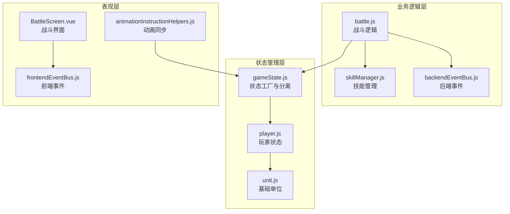
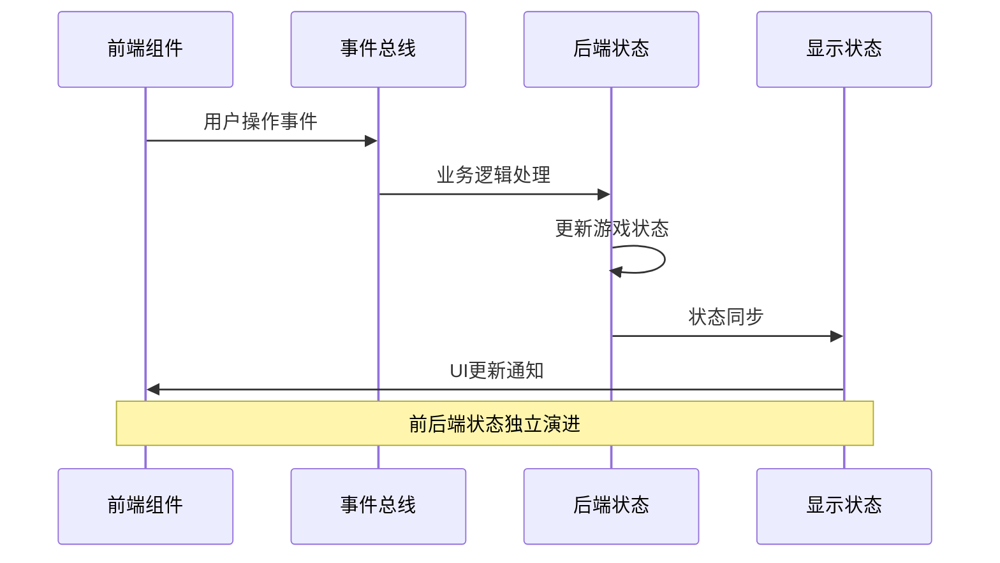
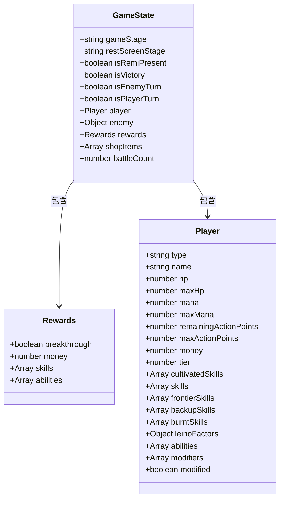
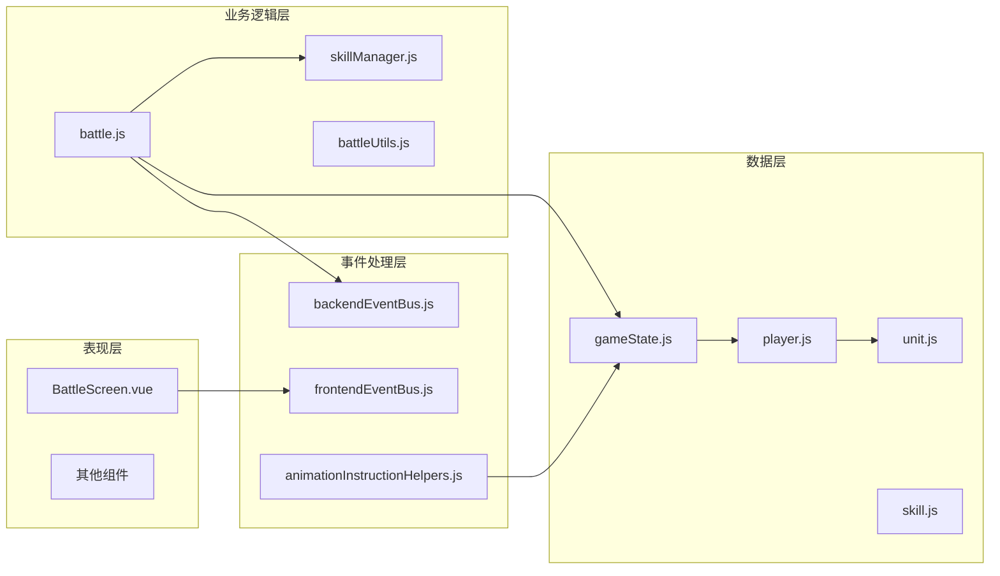

# 状态设计原则

<cite>
**本文档中引用的文件**
- [gameState.js](file://src/data/gameState.js)
- [player.js](file://src/data/player.js)
- [unit.js](file://src/data/unit.js)
- [skillManager.js](file://src/data/skillManager.js)
- [battle.js](file://src/data/battle.js)
- [backendEventBus.js](file://src/backendEventBus.js)
- [frontendEventBus.js](file://src/frontendEventBus.js)
- [animationInstructionHelpers.js](file://src/data/animationInstructionHelpers.js)
- [BattleScreen.vue](file://src/components/BattleScreen.vue)
</cite>

## 目录
1. [引言](#引言)
2. [项目结构概览](#项目结构概览)
3. [核心状态设计原则](#核心状态设计原则)
4. [前后端分离架构](#前后端分离架构)
5. [状态结构分析](#状态结构分析)
6. [状态演进策略](#状态演进策略)
7. [状态命名规范](#状态命名规范)
8. [模块化组织](#模块化组织)
9. [扩展性设计](#扩展性设计)
10. [性能考虑](#性能考虑)
11. [故障排除指南](#故障排除指南)
12. [结论](#结论)

## 引言

游戏状态设计是现代游戏开发中的核心概念，它决定了游戏逻辑的可维护性、可测试性和扩展性。本文档深入分析了基于Vue.js的前后端分离架构中游戏状态的设计原则，重点关注`gameState.js`文件中采用的创新设计理念。

通过分析实际代码实现，我们将探讨如何将UI状态与游戏逻辑状态分离，这种分离如何提升代码的可维护性和可测试性，以及状态的单一数据源原则、不可变性实践和状态演进策略的具体应用。

## 项目结构概览

该项目采用模块化的文件组织结构，将不同类型的逻辑分离到专门的模块中：



**图表来源**
- [gameState.js](file://src/data/gameState.js#L1-L75)
- [player.js](file://src/data/player.js#L1-L226)
- [battle.js](file://src/data/battle.js#L1-L553)

## 核心状态设计原则

### 单一数据源原则

游戏状态管理系统严格遵循单一数据源原则，确保所有状态变更都通过统一的接口进行：

```javascript
// 工厂方法：创建一个"干净"的游戏状态对象（非响应式）
export function createGameState() {
  return {
    // 游戏阶段: 'start', 'battle', 'rest', 'end'
    gameStage: 'start',
    
    // 休整界面阶段：'money' | 'breakthrough' | 'skill' | 'ability' | 'shop' | ''
    restScreenStage: '',
    
    // 是否开启了瑞米进行游戏
    isRemiPresent: false,
    
    // 游戏结果状态
    isVictory: false,
    
    // 回合控制
    isEnemyTurn: false,
    
    get isPlayerTurn() {
      return !this.isEnemyTurn;
    },
    
    // 玩家数据
    player: reactive(new Player()),
    
    // 敌人数据（在战斗开始时赋值）
    enemy: {},
    
    // 奖励数据
    rewards: {
      breakthrough: false,
      money: 0,
      skills: [],
      abilities: []
    },
    
    // 当前商店内商品
    shopItems: [],
    
    // 战斗场次数
    battleCount: 0
  };
}
```

**章节来源**
- [gameState.js](file://src/data/gameState.js#L7-L35)

### 不可变性实践

状态对象采用不可变性实践，通过工厂方法创建新的状态实例，确保状态的一致性和可预测性：

```javascript
// 分别创建"显示层状态"和"后端状态"，二者结构一致，但相互独立
export const backendGameState = reactive(createGameState());
export const displayGameState = reactive(createGameState());
```

这种设计允许两个独立的状态副本同时存在，分别服务于不同的目的：
- **backendGameState**：处理游戏逻辑和业务规则
- **displayGameState**：负责UI渲染和用户交互

**章节来源**
- [gameState.js](file://src/data/gameState.js#L51-L53)

## 前后端分离架构

### 架构设计理念

前后端分离架构的核心思想是将游戏逻辑与用户界面分离，这种分离带来了显著的优势：



**图表来源**
- [backendEventBus.js](file://src/backendEventBus.js#L1-L80)
- [animationInstructionHelpers.js](file://src/data/animationInstructionHelpers.js#L1-L261)

### 状态同步机制

状态同步通过动画序列器和事件总线实现：

```javascript
// 内部：监听 backendGameState 变化，标记为脏
let backendStateDirty = false;
let endOfTickStateSycnScheduled = false;

function scheduleEndOfTickCheck() {
  if (endOfTickStateSycnScheduled) return;
  endOfTickStateSycnScheduled = true;
  setTimeout(() => {
    endOfTickStateSycnScheduled = false;
    if (backendStateDirty) {
      // tick 结束仍有未同步的变更，强制入队一次当前快照（默认带屏障）
      enqueueState();
    }
  }, 0);
}

export function registerBackendStateWatcher() {
  watch(backendGameState, () => {
    backendStateDirty = true;
    scheduleEndOfTickCheck();
  }, {deep: true, flush: "sync"});
}
```

**章节来源**
- [animationInstructionHelpers.js](file://src/data/animationInstructionHelpers.js#L225-L245)

## 状态结构分析

### 初始状态构建

初始状态的构建遵循清晰的层次结构和业务逻辑分组：



**图表来源**
- [gameState.js](file://src/data/gameState.js#L7-L35)
- [player.js](file://src/data/player.js#L60-L120)

### 状态字段组织结构

状态字段按照业务领域进行组织，确保逻辑清晰和易于维护：

1. **游戏阶段控制**：`gameStage`, `restScreenStage`, `isEnemyTurn`
2. **游戏结果**：`isVictory`, `isRemiPresent`
3. **玩家状态**：`player`对象包含完整的玩家数据
4. **战斗相关**：`enemy`, `rewards`, `battleCount`
5. **商店系统**：`shopItems`

**章节来源**
- [gameState.js](file://src/data/gameState.js#L7-L35)

## 状态演进策略

### 状态重置机制

系统提供了完善的重置机制，支持不同场景下的状态恢复：

```javascript
// 重置显示层状态
export function resetDisplayGameState() {
  const fresh = createGameState();
  // 保持玩家对象响应式：用 Object.assign 同步字段
  Object.assign(displayGameState, fresh);
  Object.assign(displayGameState.player, fresh.player);
}

// 重置后端状态
export function resetBackendGameState() {
  const fresh = createGameState();
  Object.assign(backendGameState, fresh);
  Object.assign(backendGameState.player, fresh.player);
}

// 同时重置两份状态
export function resetAllGameStates() {
  resetDisplayGameState();
  resetBackendGameState();
}
```

**章节来源**
- [gameState.js](file://src/data/gameState.js#L55-L73)

### 状态投影与同步

状态投影机制确保后端状态能够高效地同步到显示层：

```javascript
// projectToS：将 backendGameState 投影为轻量快照，仅包含 S 字段，同时保留原型链
function projectToS(value, seen = new WeakMap()) {
  // 实现细节...
}

// 捕获一次后台状态快照
export function captureSnapshot() {
  return projectToS(backendGameState);
}

// 对外暴露：将一次状态同步作为指令推入 sequencer
export function enqueueState({ snapshot, durationMs, waitTags } = {}) {
  const snap = snapshot || captureSnapshot();
  const dur = typeof durationMs === 'number' ? durationMs : DEFAULT_STATE_CHANGE_DURATION;
  return animationSequencer.enqueueInstruction({
    tags: ['state'],
    waitTags: waitTags || ['all'],
    durationMs: dur,
    start: () => {
      try {
        applyProjectionToDisplay(snap, displayGameState);
      } catch (err) {
        console.error('[animationInstructionHelpers] applyProjectionToDisplay failed:', err);
      }
    }
  });
}
```

**章节来源**
- [animationInstructionHelpers.js](file://src/data/animationInstructionHelpers.js#L182-L222)

## 状态命名规范

### 命名约定

状态字段采用清晰的命名约定，确保代码的可读性和一致性：

1. **布尔状态**：使用`is`前缀，如`isVictory`, `isEnemyTurn`
2. **枚举类型**：使用有意义的字符串值，如`gameStage`, `restScreenStage`
3. **集合类型**：使用复数形式，如`skills`, `effects`
4. **数值类型**：使用描述性名称，如`battleCount`, `remainingActionPoints`

### 业务含义明确

每个状态字段都有明确的业务含义：

```javascript
// 游戏阶段: 'start', 'battle', 'rest', 'end'
gameStage: 'start',

// 休整界面阶段：'money' | 'breakthrough' | 'skill' | 'ability' | 'shop' | ''（不显示）
restScreenStage: '',

// 是否开启了瑞米进行游戏
isRemiPresent: false,

// 游戏结果状态
isVictory: false,

// 回合控制
isEnemyTurn: false,
```

**章节来源**
- [gameState.js](file://src/data/gameState.js#L10-L20)

## 模块化组织

### 文件结构设计

项目采用模块化的文件结构，每个文件专注于特定的功能领域：



**图表来源**
- [gameState.js](file://src/data/gameState.js#L1-L75)
- [battle.js](file://src/data/battle.js#L1-L50)

### 依赖关系管理

模块间的依赖关系清晰且松耦合：

1. **状态层**：提供基础的数据结构和工厂方法
2. **业务逻辑层**：处理复杂的业务规则和状态转换
3. **事件处理层**：协调前后端的状态同步
4. **表现层**：负责用户界面的渲染和交互

**章节来源**
- [gameState.js](file://src/data/gameState.js#L1-L75)
- [battle.js](file://src/data/battle.js#L1-L50)

## 扩展性设计

### 插件化技能系统

技能管理器采用插件化设计，支持动态加载和注册技能：

```javascript
class SkillManager {
  constructor() {
    this.skills = [];
    this.skillRegistry = new Map(); // 新增技能注册表
  }
  
  // 注册技能
  registerSkill(SkillClass) {
    const skillName = (new SkillClass()).name;
    this.skillRegistry.set(skillName, SkillClass);
  }
  
  // 动态导入所有技能文件
  static async loadAllSkills() {
    const skillManager = SkillManager.getInstance();
    
    const skillModules = [
      await import('./skills/martial_arts/agilePunch.js'),
      await import('./skills/martial_arts/block.js'),
      // ... 更多技能模块
    ];
    
    // 遍历所有模块并注册其中的技能
    for (const module of skillModules) {
      for (const [key, SkillClass] of Object.entries(module)) {
        if (typeof SkillClass === 'function' && SkillClass !== Skill && SkillClass.prototype instanceof Skill) {
          try {
            skillManager.registerSkill(SkillClass);
          } catch (error) {
            console.error(`Failed to register skill: ${key}`, error);
          }
        }
      }
    }
  }
}
```

**章节来源**
- [skillManager.js](file://src/data/skillManager.js#L1-L50)

### 状态扩展机制

状态结构设计支持未来的扩展：

```javascript
// 可以轻松添加新的状态字段
export function createGameState() {
  return {
    // 现有字段...
    
    // 新增的扩展字段
    customSettings: {},
    experimentalFeatures: [],
    analyticsData: {}
  };
}
```

### 事件系统扩展

事件总线支持灵活的事件扩展：

```javascript
export const EventNames = {
  Game: {
    PRE_GAME_START: 'pre-game-start',
    GAME_START: 'game-start',
    ENTER_BATTLE_STAGE: 'enter-battle-stage',
    ENTER_REST_STAGE: 'enter-rest-stage',
    PRE_BATTLE: 'pre-battle',
    POST_BATTLE: 'post-battle',
    GAME_OVER: 'game-over',
  },
  // ... 更多事件类别
};
```

**章节来源**
- [backendEventBus.js](file://src/backendEventBus.js#L3-L79)

## 性能考虑

### 响应式优化

系统采用Vue.js的响应式特性，但通过合理的封装避免不必要的重新渲染：

```javascript
// 玩家数据使用响应式包装
player: reactive(new Player()),

// 状态同步时使用深拷贝避免引用问题
Object.assign(displayGameState, fresh);
Object.assign(displayGameState.player, fresh.player);
```

### 内存管理

状态重置机制确保内存的有效利用：

```javascript
// 重置时创建新的状态实例，释放旧实例
export function resetDisplayGameState() {
  const fresh = createGameState();
  Object.assign(displayGameState, fresh);
  Object.assign(displayGameState.player, fresh.player);
}
```

### 动画与状态同步

动画序列器确保状态变更与视觉反馈的同步：

```javascript
// 状态变更时自动插入动画屏障
if(backendStateDirty) {
  // 在入队任何新指令前，先入队一次状态同步
  enqueueState();
  backendStateDirty = false;
}
```

**章节来源**
- [gameState.js](file://src/data/gameState.js#L55-L73)
- [animationInstructionHelpers.js](file://src/data/animationInstructionHelpers.js#L218-L225)

## 故障排除指南

### 常见问题诊断

1. **状态不同步**
   - 检查`backendStateDirty`标志是否正确设置
   - 验证事件总线的订阅和发布
   - 确认状态投影函数的正确性

2. **性能问题**
   - 监控状态重置频率
   - 检查不必要的深度监听
   - 优化动画序列器的执行效率

3. **内存泄漏**
   - 确保事件监听器的正确注销
   - 验证状态重置的完整性
   - 监控大型对象的引用

### 调试工具

系统提供了完善的调试支持：

```javascript
// 状态投影调试
function applyProjectionToDisplay(source, target) {
  try {
    // 实现细节...
  } catch (err) {
    console.error('[animationInstructionHelpers] applyProjectionToDisplay failed:', err);
  }
}
```

**章节来源**
- [animationInstructionHelpers.js](file://src/data/animationInstructionHelpers.js#L218-L225)

## 结论

本文档深入分析了基于Vue.js的前后端分离架构中游戏状态的设计原则。通过`gameState.js`文件的实现，我们可以看到以下关键优势：

### 主要设计优势

1. **清晰的职责分离**：前后端状态独立演进，降低了复杂性
2. **高度的可维护性**：单一数据源原则确保状态的一致性
3. **优秀的可测试性**：模块化设计便于单元测试和集成测试
4. **强大的扩展性**：插件化架构支持功能的灵活扩展
5. **良好的性能**：响应式优化和内存管理确保高效的运行

### 最佳实践总结

- **状态设计**：采用工厂方法创建状态，确保不可变性
- **架构模式**：前后端分离，事件驱动的状态同步
- **命名规范**：清晰的命名约定提高代码可读性
- **扩展机制**：插件化设计支持功能的无缝集成
- **性能优化**：响应式特性和内存管理的最佳实践

这种状态设计原则不仅适用于当前的游戏项目，也为类似项目的开发提供了宝贵的参考经验。通过遵循这些设计原则，开发者可以构建出高质量、可维护和可扩展的游戏状态管理系统。