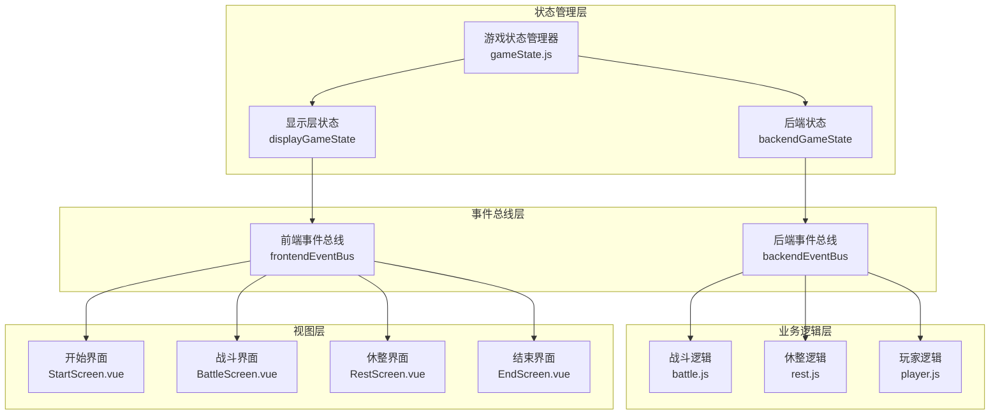
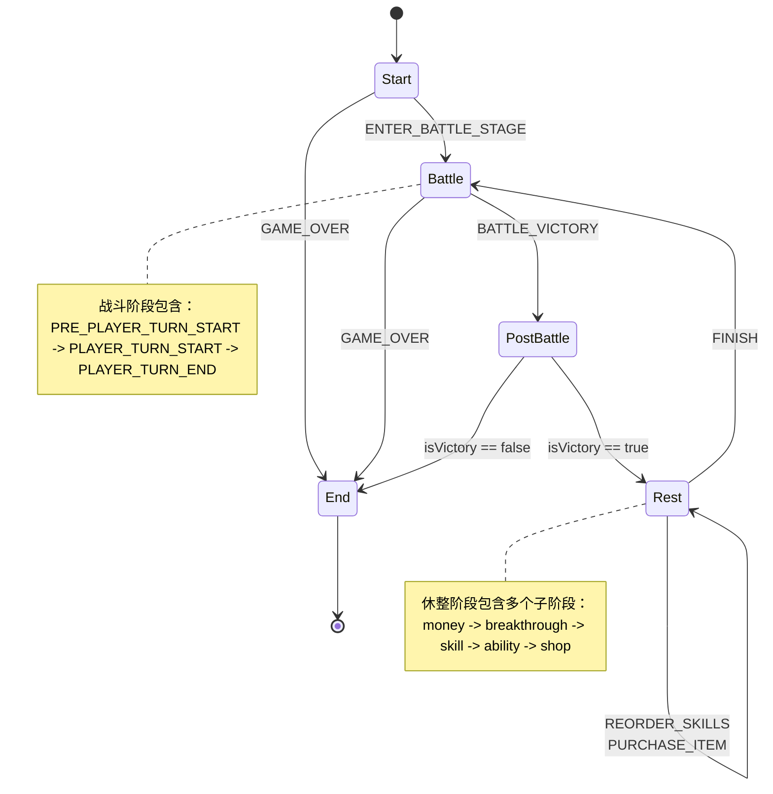
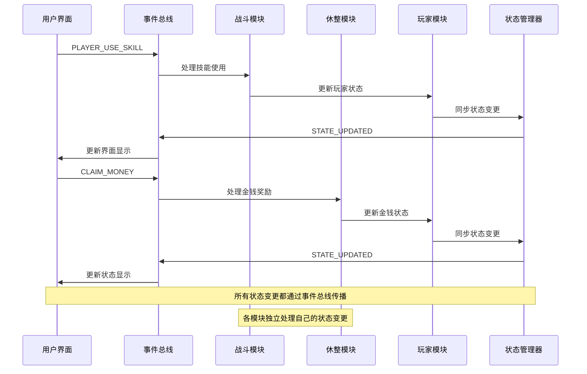

# 状态转换与一致性维护

<cite>
**本文档中引用的文件**
- [src/data/gameState.js](file://src/data/gameState.js)
- [src/data/battle.js](file://src/data/battle.js)
- [src/data/rest.js](file://src/data/rest.js)
- [src/backendEventBus.js](file://src/backendEventBus.js)
- [src/frontendEventBus.js](file://src/frontendEventBus.js)
- [src/data/player.js](file://src/data/player.js)
- [src/GameApp.vue](file://src/GameApp.vue)
- [src/game.js](file://src/game.js)
- [src/components/start/StartScreen.vue](file://src/components/start/StartScreen.vue)
- [src/components/battle/BattleScreen.vue](file://src/components/battle/BattleScreen.vue)
- [src/components/rest/RestScreen.vue](file://src/components/rest/RestScreen.vue)
</cite>

## 目录
1. [引言](#引言)
2. [游戏状态架构概览](#游戏状态架构概览)
3. [状态转换流程](#状态转换流程)
4. [状态一致性保障机制](#状态一致性保障机制)
5. [多模块协同状态同步](#多模块协同状态同步)
6. [状态转换日志与调试支持](#状态转换日志与调试支持)
7. [性能优化与最佳实践](#性能优化与最佳实践)
8. [故障排除指南](#故障排除指南)
9. [总结](#总结)

## 引言

本游戏采用基于事件驱动的状态管理系统，实现了完整的状态转换流程与一致性保障机制。系统通过前后端分离的设计模式，确保了状态转换的原子性和多模块间的协调同步。本文档将深入分析游戏状态机的完整生命周期，从开始界面到战斗阶段再到休整阶段的状态迁移路径，并详细解释状态转换的原子性保证、中间状态处理以及非法转换的防护措施。

## 游戏状态架构概览

游戏状态管理系统采用分层架构设计，包含显示层状态和后端状态两个独立但同步的副本，确保了状态的一致性和系统的稳定性。



**图表来源**
- [src/data/gameState.js](file://src/data/gameState.js#L1-L75)
- [src/backendEventBus.js](file://src/backendEventBus.js#L1-L80)
- [src/frontendEventBus.js](file://src/frontendEventBus.js#L1-L9)

**章节来源**
- [src/data/gameState.js](file://src/data/gameState.js#L1-L75)
- [src/backendEventBus.js](file://src/backendEventBus.js#L1-L80)

## 状态转换流程

游戏状态机包含四个主要阶段："start"（开始）、"battle"（战斗）、"rest"（休整）和"end"（结束）。每个阶段都有明确的转换条件和触发机制。

### 状态转换图



**图表来源**
- [src/game.js](file://src/game.js#L64-L100)
- [src/data/battle.js](file://src/data/battle.js#L32-L69)
- [src/data/rest.js](file://src/data/rest.js#L181-L213)

### 状态转换实现细节

#### 1. 开始阶段到战斗阶段的转换

```javascript
// 从开始界面进入战斗阶段
export function enterBattleStage() {
  gameState.battleCount++;
  
  // 生成敌人
  generateEnemy(gameState);
  
  // 战前事件
  backendEventBus.emit(EventNames.Game.PRE_BATTLE, {
    battleCount: gameState.battleCount,
    player: gameState.player,
    enemy: gameState.enemy
  });
  
  // 切换游戏状态到战斗状态
  gameState.gameStage = 'battle';
  // 马上切换状态，阻塞，但是无延迟
  enqueueState(captureSnapshot(), 0);
  // 小等一下，方便战斗界面组件挂载
  enqueueDelay(300, {tags: ['ui', 'mount']});
  
  // 进入游戏控制流
  backendEventBus.emit(EventNames.Battle.BATTLE_START);
}
```

#### 2. 战斗阶段的状态迁移

战斗阶段内部包含复杂的子状态迁移，通过事件总线实现精确控制：

```javascript
// 战斗开始事件处理
backendEventBus.on(EventNames.Battle.BATTLE_START, () => {
  startBattle();
});

// 玩家回合开始
backendEventBus.on(EventNames.Battle.PLAYER_TURN_START, () => {
  startPlayerTurn();
});

// 玩家回合结束
backendEventBus.on(EventNames.Battle.PLAYER_TURN_END, () => {
  endPlayerTurn();
});
```

#### 3. 休整阶段的子阶段管理

休整阶段采用轮询式的子阶段管理机制：

```javascript
function computeNextRestStage(currentStage = gameState.restScreenStage) {
  // 按顺序：money -> breakthrough -> skill -> ability -> shop
  let availableStages = [];
  if (gameState.rewards.money > 0) availableStages.push('money');
  if (gameState.rewards.breakthrough) availableStages.push('breakthrough');
  if (Array.isArray(gameState.rewards.skills) && gameState.rewards.skills.length > 0) availableStages.push('skill');
  if (Array.isArray(gameState.rewards.abilities) && gameState.rewards.abilities.length > 0) availableStages.push('ability');
  if (gameState.shopItems.length > 0) availableStages.push('shop');
  
  const currentIndex = availableStages.indexOf(currentStage);
  if (currentIndex === -1 || currentIndex === availableStages.length - 1) {
    return availableStages[0] || '';
  } else {
    return availableStages[currentIndex + 1];
  }
}
```

**章节来源**
- [src/data/battle.js](file://src/data/battle.js#L15-L69)
- [src/data/rest.js](file://src/data/rest.js#L181-L213)
- [src/game.js](file://src/game.js#L64-L100)

## 状态一致性保障机制

系统通过多层次的一致性保障机制确保状态转换的正确性和完整性。

### 原子性保证

#### 1. 状态快照机制

```javascript
// 捕获状态快照
export function captureSnapshot() {
  return projectToS(backendGameState);
}

// 状态同步指令
export function enqueueState({ snapshot, durationMs, waitTags } = {}) {
  const snap = snapshot || captureSnapshot();
  const dur = typeof durationMs === 'number' ? durationMs : DEFAULT_STATE_CHANGE_DURATION;
  return animationSequencer.enqueueInstruction({
    tags: ['state'],
    waitTags: waitTags || ['all'],
    durationMs: dur,
    start: () => {
      try {
        applyProjectionToDisplay(snap, displayGameState);
      } catch (err) {
        console.error('状态同步失败:', err);
      }
    }
  });
}
```

#### 2. 事务性状态更新

```javascript
// 同时重置两份状态
export function resetAllGameStates() {
  resetDisplayGameState();
  resetBackendGameState();
}

// 重置显示层状态
export function resetDisplayGameState() {
  const fresh = createGameState();
  // 保持玩家对象响应式：用 Object.assign 同步字段
  Object.assign(displayGameState, fresh);
  Object.assign(displayGameState.player, fresh.player);
}

// 重置后端状态
export function resetBackendGameState() {
  const fresh = createGameState();
  Object.assign(backendGameState, fresh);
  Object.assign(backendGameState.player, fresh.player);
}
```

### 中间状态处理

#### 1. 状态投影机制

```javascript
// 将后端状态投影到显示层
function applyProjectionToDisplay(src, dst) {
  for (let key in src) {
    if (src.hasOwnProperty(key)) {
      const sVal = src[key];
      const dType = typeof dst[key];
      
      if (dType === 'object' && dst[key] !== null) {
        if (Array.isArray(dst[key])) {
          dst[key].splice(0, dst[key].length, ...sVal);
        } else {
          applyProjectionToDisplay(sVal, dst[key]);
        }
        continue;
      }
      
      if (dst[key] !== sVal) dst[key] = sVal;
    }
  }
}
```

#### 2. 状态验证机制

```javascript
// 状态验证函数
function validateGameState(state) {
  // 验证游戏阶段有效性
  const validStages = ['start', 'battle', 'rest', 'end'];
  if (!validStages.includes(state.gameStage)) {
    throw new Error(`无效的游戏阶段: ${state.gameStage}`);
  }
  
  // 验证玩家状态完整性
  if (!state.player || typeof state.player.hp !== 'number') {
    throw new Error('玩家状态损坏');
  }
  
  // 验证战斗状态一致性
  if (state.gameStage === 'battle') {
    if (!state.enemy || !state.enemy.name) {
      throw new Error('战斗状态缺少敌人信息');
    }
  }
  
  return true;
}
```

**章节来源**
- [src/data/animationInstructionHelpers.js](file://src/data/animationInstructionHelpers.js#L182-L222)
- [src/data/gameState.js](file://src/data/gameState.js#L40-L75)

## 多模块协同状态同步

系统通过事件驱动的方式实现多模块间的状态同步，确保各个业务模块能够正确响应状态变化。

### 事件驱动的状态同步



**图表来源**
- [src/backendEventBus.js](file://src/backendEventBus.js#L1-L80)
- [src/game.js](file://src/game.js#L64-L100)

### 状态同步策略

#### 1. 战斗结束时的状态同步

```javascript
// 战斗结束后的状态同步
backendEventBus.on(EventNames.Game.POST_BATTLE, ({ isVictory }) => {
  // 结算战斗结果
  if (isVictory) {
    // 计算奖励
    clearRewards();
    spawnRewards();
    gameState.isVictory = true;
  } else {
    // 玩家失败
    gameState.isVictory = false;
  }
  
  if (!isVictory) {
    // 失败：宣告游戏结束
    backendEventBus.emit(EventNames.Game.GAME_OVER, { reason: 'defeat' });
  } else {
    // 胜利：进入休整阶段
    backendEventBus.emit(EventNames.Game.ENTER_REST_STAGE);
  }
});
```

#### 2. 休整阶段的状态同步

```javascript
// 休整阶段的状态同步
backendEventBus.on(EventNames.PlayerOperations.CLAIM_MONEY, () => {
  claimMoney();
});

backendEventBus.on(EventNames.PlayerOperations.CLAIM_SKILL, ({ skillID, slotIndex, clearRewards }) => {
  claimSkillReward(skillID, slotIndex, !!clearRewards);
});

backendEventBus.on(EventNames.PlayerOperations.CLAIM_ABILITY, ({ ability, clearRewards }) => {
  claimAbilityReward(ability, !!clearRewards);
});

backendEventBus.on(EventNames.PlayerOperations.CLAIM_BREAKTHROUGH, () => {
  claimBreakthroughReward();
});
```

#### 3. 多模块状态一致性检查

```javascript
// 状态一致性检查
function checkStateConsistency() {
  const backend = backendGameState;
  const display = displayGameState;
  
  // 检查游戏阶段一致性
  if (backend.gameStage !== display.gameStage) {
    console.warn('游戏阶段不一致:', { backend: backend.gameStage, display: display.gameStage });
  }
  
  // 检查玩家状态一致性
  if (backend.player.hp !== display.player.hp) {
    console.warn('玩家生命值不一致:', { backend: backend.player.hp, display: display.player.hp });
  }
  
  // 检查技能状态一致性
  if (backend.player.cultivatedSkills.length !== display.player.cultivatedSkills.length) {
    console.warn('技能数量不一致:', { 
      backend: backend.player.cultivatedSkills.length, 
      display: display.player.cultivatedSkills.length 
    });
  }
  
  // 检查奖励状态一致性
  if (backend.rewards.money !== display.rewards.money) {
    console.warn('奖励金额不一致:', { 
      backend: backend.rewards.money, 
      display: display.rewards.money 
    });
  }
}
```

**章节来源**
- [src/game.js](file://src/game.js#L64-L100)
- [src/data/rest.js](file://src/data/rest.js#L60-L120)

## 状态转换日志与调试支持

系统提供了完整的状态转换日志记录和调试支持功能，帮助开发者追踪状态变化和诊断问题。

### 日志记录机制

#### 1. 系统级日志记录

```javascript
// 战斗日志工具
export function addSystemLog(message) {
  const logEntry = {
    timestamp: Date.now(),
    type: 'system',
    message: message
  };
  gameState.battleLogs.push(logEntry);
  frontendEventBus.emit('add-battle-log', logEntry);
}

// 玩家操作日志
export function addPlayerActionLog(message) {
  const logEntry = {
    timestamp: Date.now(),
    type: 'player',
    message: message
  };
  gameState.battleLogs.push(logEntry);
  frontendEventBus.emit('add-battle-log', logEntry);
}

// 敌人行动日志
export function addEnemyActionLog(message) {
  const logEntry = {
    timestamp: Date.now(),
    type: 'enemy',
    message: message
  };
  gameState.battleLogs.push(logEntry);
  frontendEventBus.emit('add-battle-log', logEntry);
}
```

#### 2. 状态变更日志

```javascript
// 状态变更跟踪
function trackStateChanges() {
  const originalSet = Object.defineProperty;
  
  Object.defineProperty = function(obj, prop, descriptor) {
    const originalValue = obj[prop];
    
    return originalSet.call(this, obj, prop, {
      set(newValue) {
        console.log(`状态变更: ${prop}从 ${originalValue} 变为 ${newValue}`);
        
        // 记录状态变更历史
        if (!obj._stateHistory) {
          obj._stateHistory = [];
        }
        obj._stateHistory.push({
          property: prop,
          oldValue: originalValue,
          newValue: newValue,
          timestamp: Date.now()
        });
        
        descriptor.set.call(this, newValue);
      },
      get() {
        return descriptor.get ? descriptor.get.call(this) : originalValue;
      }
    });
  };
}
```

### 调试工具

#### 1. 状态可视化工具

```javascript
// 状态可视化组件
class StateInspector {
  constructor() {
    this.inspectionQueue = [];
    this.activeInspections = new Map();
  }
  
  inspectProperty(path, callback) {
    this.inspectionQueue.push({ path, callback });
  }
  
  startInspection() {
    // 定期检查状态变化
    setInterval(() => {
      this.checkStateChanges();
    }, 1000);
  }
  
  checkStateChanges() {
    // 检查所有注册的属性变化
    this.inspectionQueue.forEach(({ path, callback }) => {
      const currentValue = this.resolvePath(path);
      const lastValue = this.activeInspections.get(path);
      
      if (lastValue !== currentValue) {
        callback(currentValue, lastValue);
        this.activeInspections.set(path, currentValue);
      }
    });
  }
  
  resolvePath(path) {
    // 解析状态路径
    const parts = path.split('.');
    let current = backendGameState;
    
    for (const part of parts) {
      current = current[part];
      if (current === undefined) break;
    }
    
    return current;
  }
}
```

#### 2. 状态恢复功能

```javascript
// 状态恢复工具
class StateRecovery {
  constructor() {
    this.stateSnapshots = [];
    this.maxSnapshots = 10;
  }
  
  takeSnapshot() {
    const snapshot = {
      timestamp: Date.now(),
      state: JSON.parse(JSON.stringify(backendGameState)),
      hash: this.calculateHash(backendGameState)
    };
    
    this.stateSnapshots.unshift(snapshot);
    if (this.stateSnapshots.length > this.maxSnapshots) {
      this.stateSnapshots.pop();
    }
  }
  
  restoreFromSnapshot(index = 0) {
    if (index >= this.stateSnapshots.length) {
      throw new Error('无效的快照索引');
    }
    
    const targetSnapshot = this.stateSnapshots[index];
    const currentState = backendGameState;
    
    // 应用快照状态
    Object.assign(currentState, targetSnapshot.state);
    
    // 触发状态更新事件
    backendEventBus.emit('state-restored', {
      from: targetSnapshot.timestamp,
      to: Date.now()
    });
  }
  
  calculateHash(state) {
    return JSON.stringify(state).split('').reduce((a, b) => {
      a = ((a << 5) - a) + b.charCodeAt(0);
      return a & a;
    }, 0);
  }
}
```

**章节来源**
- [src/data/battleLogUtils.js](file://src/data/battleLogUtils.js#L1-L50)
- [src/data/animationInstructionHelpers.js](file://src/data/animationInstructionHelpers.js#L182-L222)

## 性能优化与最佳实践

### 状态更新优化

#### 1. 批量状态更新

```javascript
// 批量状态更新优化
class BatchStateManager {
  constructor() {
    this.pendingUpdates = new Map();
    this.updateTimeout = null;
  }
  
  updateProperty(path, value) {
    // 添加到批量更新队列
    this.pendingUpdates.set(path, value);
    
    // 延迟执行批量更新
    if (!this.updateTimeout) {
      this.updateTimeout = setTimeout(() => {
        this.flushUpdates();
      }, 16); // 16ms ~ 60fps
    }
  }
  
  flushUpdates() {
    if (this.pendingUpdates.size === 0) return;
    
    // 执行批量状态更新
    this.pendingUpdates.forEach((value, path) => {
      this.updatePath(path, value);
    });
    
    // 清空更新队列
    this.pendingUpdates.clear();
    this.updateTimeout = null;
    
    // 触发批量更新完成事件
    backendEventBus.emit('batch-update-complete');
  }
  
  updatePath(path, value) {
    const parts = path.split('.');
    let current = backendGameState;
    
    for (let i = 0; i < parts.length - 1; i++) {
      current = current[parts[i]];
      if (!current) return;
    }
    
    current[parts[parts.length - 1]] = value;
  }
}
```

#### 2. 状态缓存机制

```javascript
// 状态缓存优化
class StateCache {
  constructor() {
    this.cache = new Map();
    this.cacheTTL = 5000; // 5秒缓存时间
  }
  
  getCachedState(key) {
    const cached = this.cache.get(key);
    if (!cached) return null;
    
    if (Date.now() - cached.timestamp > this.cacheTTL) {
      this.cache.delete(key);
      return null;
    }
    
    return cached.value;
  }
  
  setCachedState(key, value) {
    this.cache.set(key, {
      value: value,
      timestamp: Date.now()
    });
  }
  
  invalidateCache(pattern = '*') {
    if (pattern === '*') {
      this.cache.clear();
    } else {
      this.cache.forEach((_, key) => {
        if (key.match(pattern)) {
          this.cache.delete(key);
        }
      });
    }
  }
}
```

### 内存管理

```javascript
// 内存管理工具
class MemoryManager {
  constructor() {
    this.memoryTraces = new Map();
    this.gcThreshold = 1000; // 1000个状态变更后进行垃圾回收
  }
  
  trackMemoryUsage(operation, details) {
    const trace = {
      operation: operation,
      details: details,
      timestamp: Date.now(),
      memory: this.getCurrentMemoryUsage()
    };
    
    this.memoryTraces.set(Date.now(), trace);
    
    // 定期清理旧的内存跟踪
    if (this.memoryTraces.size > this.gcThreshold) {
      this.performGarbageCollection();
    }
  }
  
  getCurrentMemoryUsage() {
    if (performance.memory) {
      return {
        usedJSHeapSize: performance.memory.usedJSHeapSize,
        totalJSHeapSize: performance.memory.totalJSHeapSize,
        jsHeapSizeLimit: performance.memory.jsHeapSizeLimit
      };
    }
    return null;
  }
  
  performGarbageCollection() {
    // 清理过期的状态跟踪
    const now = Date.now();
    this.memoryTraces.forEach((trace, timestamp) => {
      if (now - timestamp > this.gcThreshold * 2) {
        this.memoryTraces.delete(timestamp);
      }
    });
    
    // 强制垃圾回收（如果可用）
    if (window.gc) {
      window.gc();
    }
  }
}
```

## 故障排除指南

### 常见状态问题诊断

#### 1. 状态不同步问题

```javascript
// 状态不同步诊断工具
class StateSyncDebugger {
  constructor() {
    this.diagnosticReports = [];
  }
  
  diagnoseStateSync() {
    const report = {
      timestamp: Date.now(),
      backendState: this.collectBackendState(),
      displayState: this.collectDisplayState(),
      differences: this.compareStates(),
      recommendations: this.generateRecommendations()
    };
    
    this.diagnosticReports.push(report);
    return report;
  }
  
  collectBackendState() {
    return {
      gameStage: backendGameState.gameStage,
      battleCount: backendGameState.battleCount,
      playerHP: backendGameState.player.hp,
      playerMana: backendGameState.player.mana,
      enemyHP: backendGameState.enemy.hp
    };
  }
  
  collectDisplayState() {
    return {
      gameStage: displayGameState.gameStage,
      battleCount: displayGameState.battleCount,
      playerHP: displayGameState.player.hp,
      playerMana: displayGameState.player.mana,
      enemyHP: displayGameState.enemy.hp
    };
  }
  
  compareStates() {
    const differences = [];
    const backend = this.collectBackendState();
    const display = this.collectDisplayState();
    
    for (const key in backend) {
      if (backend[key] !== display[key]) {
        differences.push({
          property: key,
          backendValue: backend[key],
          displayValue: display[key],
          difference: `${backend[key]} != ${display[key]}`
        });
      }
    }
    
    return differences;
  }
  
  generateRecommendations() {
    const recommendations = [];
    const differences = this.compareStates();
    
    if (differences.length > 0) {
      recommendations.push('检测到状态不同步，请检查状态同步机制');
      
      differences.forEach(diff => {
        switch (diff.property) {
          case 'gameStage':
            recommendations.push('游戏阶段不匹配，可能需要重新初始化状态');
            break;
          case 'playerHP':
            recommendations.push('玩家生命值不同步，可能需要重新同步玩家状态');
            break;
          case 'enemyHP':
            recommendations.push('敌人生命值不同步，可能需要重新同步敌人状态');
            break;
        }
      });
    }
    
    return recommendations;
  }
}
```

#### 2. 状态转换异常处理

```javascript
// 状态转换异常处理器
class StateTransitionHandler {
  constructor() {
    this.errorHandlers = new Map();
    this.fallbackStates = new Map();
  }
  
  registerErrorHandler(event, handler) {
    this.errorHandlers.set(event, handler);
  }
  
  registerFallbackState(event, fallbackState) {
    this.fallbackStates.set(event, fallbackState);
  }
  
  handleTransitionError(event, error) {
    console.error(`状态转换错误: ${event}`, error);
    
    // 查找特定错误处理器
    const errorHandler = this.errorHandlers.get(event);
    if (errorHandler) {
      return errorHandler(error);
    }
    
    // 查找通用错误处理器
    const genericHandler = this.errorHandlers.get('*');
    if (genericHandler) {
      return genericHandler(event, error);
    }
    
    // 使用回退状态
    const fallbackState = this.fallbackStates.get(event);
    if (fallbackState) {
      return this.restoreFallbackState(fallbackState);
    }
    
    // 默认错误处理
    return this.defaultErrorHandler(error);
  }
  
  restoreFallbackState(stateName) {
    switch (stateName) {
      case 'safe':
        return this.safeStateRestore();
      case 'minimal':
        return this.minimalStateRestore();
      default:
        return this.defaultStateRestore();
    }
  }
  
  safeStateRestore() {
    // 安全状态恢复：保留基本状态，清除复杂数据
    const safeState = createGameState();
    safeState.gameStage = 'start';
    safeState.player.hp = safeState.player.maxHp;
    safeState.player.mana = safeState.player.maxMana;
    
    return safeState;
  }
  
  minimalStateRestore() {
    // 最小状态恢复：只保留核心状态
    const minimalState = {
      gameStage: 'start',
      player: {
        hp: 1,
        mana: 0
      }
    };
    
    return minimalState;
  }
}
```

### 调试工具集成

```javascript
// 调试工具集成
class GameDebugger {
  constructor() {
    this.stateInspector = new StateInspector();
    this.stateSyncDebugger = new StateSyncDebugger();
    this.stateTransitionHandler = new StateTransitionHandler();
    this.memoryManager = new MemoryManager();
  }
  
  enableDebugMode() {
    // 启用所有调试功能
    this.enableStateLogging();
    this.enableMemoryTracking();
    this.enableErrorHandling();
  }
  
  enableStateLogging() {
    // 监听所有状态变更
    backendEventBus.on('*', (eventName, eventData) => {
      console.log(`状态事件: ${eventName}`, eventData);
    });
  }
  
  enableMemoryTracking() {
    // 跟踪内存使用情况
    setInterval(() => {
      this.memoryManager.trackMemoryUsage('state-update', {
        backendState: backendGameState,
        displayState: displayGameState
      });
    }, 5000);
  }
  
  enableErrorHandling() {
    // 注册全局错误处理器
    window.addEventListener('unhandledrejection', (event) => {
      this.handleUnhandledError(event.reason);
    });
    
    window.addEventListener('error', (event) => {
      this.handleUnhandledError(event.error);
    });
  }
  
  handleUnhandledError(error) {
    console.error('未处理的错误:', error);
    
    // 尝试诊断状态问题
    const syncReport = this.stateSyncDebugger.diagnoseStateSync();
    const transitionReport = this.stateTransitionHandler.handleTransitionError(
      'unhandled-error', error
    );
    
    // 记录完整的错误报告
    this.recordErrorReport({
      error: error,
      syncReport: syncReport,
      transitionReport: transitionReport,
      memoryUsage: this.memoryManager.getCurrentMemoryUsage()
    });
  }
  
  recordErrorReport(report) {
    console.group('错误报告');
    console.table(report);
    console.groupEnd();
  }
}
```

## 总结

本游戏的状态转换与一致性维护系统通过精心设计的架构和多重保障机制，实现了稳定可靠的状态管理。系统的主要特点包括：

1. **分层架构设计**：通过前后端分离的状态管理，确保了系统的模块化和可维护性。

2. **事件驱动机制**：基于事件总线的状态转换，提供了灵活的状态管理和模块间通信。

3. **原子性保证**：通过状态快照和投影机制，确保了状态转换的原子性和一致性。

4. **多模块协同**：完善的事件驱动同步机制，确保了各业务模块的状态一致性。

5. **全面的日志记录**：完整的状态转换日志和调试支持，便于问题诊断和系统维护。

6. **性能优化**：批量更新、状态缓存和内存管理等优化措施，提升了系统性能。

这套状态管理系统为游戏提供了坚实的基础，确保了游戏体验的流畅性和稳定性。通过持续的监控和优化，系统能够适应不断增长的功能需求和用户规模。