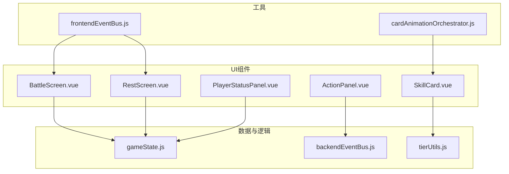
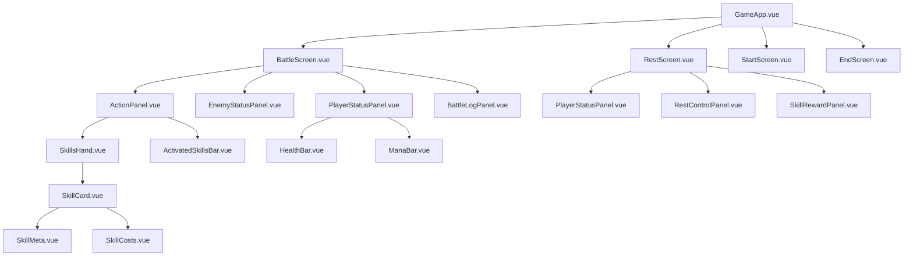
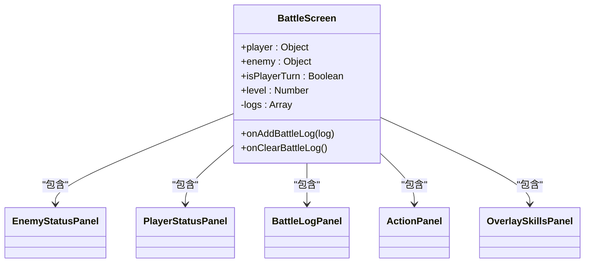
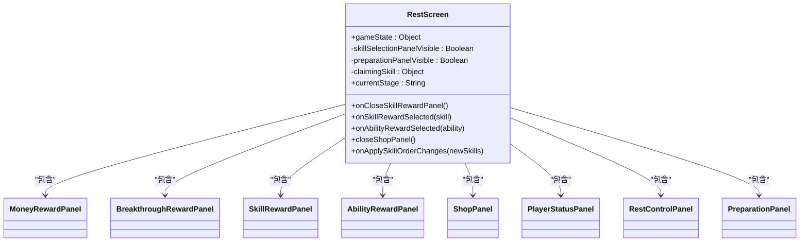
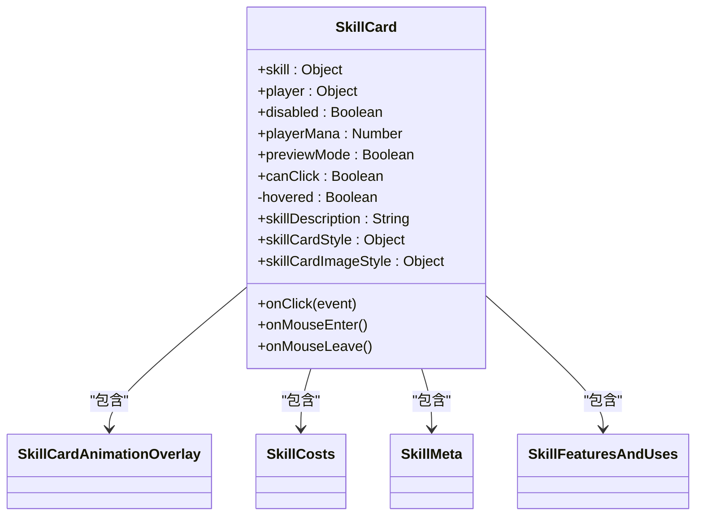
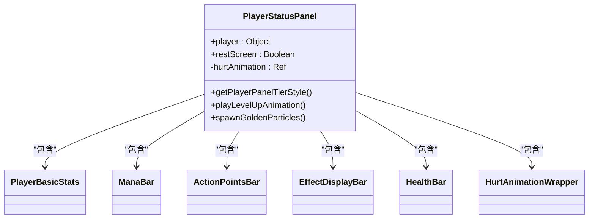
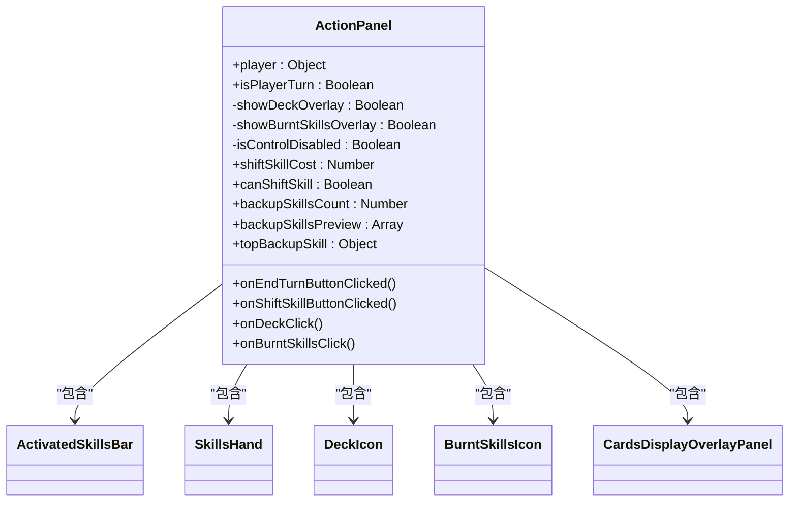
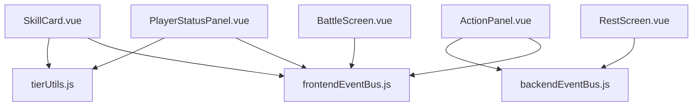

# UI组件体系

<cite>
**本文档中引用的文件**   
- [App.vue](file://src/App.vue)
- [GameApp.vue](file://src/GameApp.vue)
- [BattleScreen.vue](file://src/components/BattleScreen.vue)
- [RestScreen.vue](file://src/components/RestScreen.vue)
- [PlayerStatusPanel.vue](file://src/components/PlayerStatusPanel.vue)
- [EnemyStatusPanel.vue](file://src/components/EnemyStatusPanel.vue)
- [SkillCard.vue](file://src/components/SkillCard.vue)
- [ActionPanel.vue](file://src/components/ActionPanel.vue)
- [SkillsHand.vue](file://src/components/SkillsHand.vue)
- [HurtAnimationWrapper.vue](file://src/components/HurtAnimationWrapper.vue)
- [SkillMeta.vue](file://src/components/skillCard/SkillMeta.vue)
- [tierUtils.js](file://src/utils/tierUtils.js)
- [gameState.js](file://src/data/gameState.js)
- [frontendEventBus.js](file://src/frontendEventBus.js)
- [backendEventBus.js](file://src/backendEventBus.js)
</cite>

## 目录
1. [简介](#简介)
2. [项目结构](#项目结构)
3. [核心组件](#核心组件)
4. [架构概览](#架构概览)
5. [详细组件分析](#详细组件分析)
6. [依赖分析](#依赖分析)
7. [性能考虑](#性能考虑)
8. [故障排除指南](#故障排除指南)
9. [结论](#结论)

## 简介
本项目采用Vue 3构建了一个完整的卡牌战斗游戏UI体系，其组件设计遵循清晰的分层架构与职责划分原则。系统通过屏幕级组件作为容器组织复杂界面，结合可复用的通用展示组件实现高度模块化的UI构建。组件间通过props传递数据、事件触发交互逻辑，并利用插槽机制实现内容定制化。整个体系通过前端事件总线实现松耦合通信，确保了界面响应性与可维护性。

## 项目结构
项目采用典型的Vue单文件组件（SFC）组织方式，核心UI组件集中存放于`src/components`目录下。组件按功能分为屏幕级组件、状态面板、技能卡片、操作控制等类别，形成清晰的层级结构。数据模型与业务逻辑分离在`src/data`目录中，工具函数则封装于`src/utils`目录。这种分层设计使得UI组件专注于视图渲染与用户交互，而将复杂逻辑交由独立模块处理。



**组件来源**
- [BattleScreen.vue](file://src/components/BattleScreen.vue)
- [RestScreen.vue](file://src/components/RestScreen.vue)
- [gameState.js](file://src/data/gameState.js)
- [frontendEventBus.js](file://src/frontendEventBus.js)

**本节来源**
- [src/components](file://src/components)
- [src/data](file://src/data)
- [src/utils](file://src/utils)

## 核心组件
项目的核心UI组件体系围绕游戏流程构建，主要包括`BattleScreen.vue`、`RestScreen.vue`等屏幕级容器组件，以及`PlayerStatusPanel.vue`、`SkillCard.vue`等可复用展示组件。这些组件通过组合与嵌套形成完整的用户界面，每个组件都有明确的职责边界：容器组件负责布局与状态管理，展示组件负责视觉呈现与基础交互。

**本节来源**
- [BattleScreen.vue](file://src/components/BattleScreen.vue#L1-L112)
- [RestScreen.vue](file://src/components/RestScreen.vue#L1-L269)
- [PlayerStatusPanel.vue](file://src/components/PlayerStatusPanel.vue#L1-L216)
- [SkillCard.vue](file://src/components/SkillCard.vue#L1-L236)

## 架构概览
系统的UI架构采用典型的MVVM模式，以`GameApp.vue`为根组件，根据游戏状态动态切换不同屏幕组件。各屏幕组件作为容器，通过props向下传递数据，通过事件总线向上反馈用户操作。通用组件如`SkillCard.vue`被设计为高度可复用的原子单元，可在不同上下文中使用。整个架构通过响应式数据流与事件驱动机制实现高效的状态同步与界面更新。



**架构来源**
- [GameApp.vue](file://src/GameApp.vue#L1-L139)
- [BattleScreen.vue](file://src/components/BattleScreen.vue#L1-L112)
- [RestScreen.vue](file://src/components/RestScreen.vue#L1-L269)

## 详细组件分析
### 屏幕级组件分析
屏幕级组件作为UI体系的顶层容器，负责组织和协调子组件的布局与交互。它们直接与游戏状态`gameState`关联，根据当前游戏阶段渲染相应的界面元素。这些组件通过条件渲染和过渡动画实现平滑的界面切换，为玩家提供连贯的游戏体验。

#### BattleScreen.vue 分析
`BattleScreen.vue`是战斗阶段的核心容器组件，负责整合战斗相关的所有UI元素。它通过props接收玩家、敌人、回合状态等数据，并将其分发给各个子组件。组件内部使用事件总线监听战斗日志的更新，实现了日志的动态添加与清空。其布局采用弹性盒子（flexbox）进行垂直排列，确保在不同屏幕尺寸下都能保持合理的空间分配。



**组件来源**
- [BattleScreen.vue](file://src/components/BattleScreen.vue#L1-L112)
- [frontendEventBus.js](file://src/frontendEventBus.js#L1-L9)

#### RestScreen.vue 分析
`RestScreen.vue`是休整阶段的容器组件，采用更复杂的布局策略来适应多种奖励场景。它通过`currentStage`计算属性动态决定显示哪个奖励面板，并利用Vue的过渡系统实现面板间的平滑切换。组件内部管理着多个状态标志（如`skillSelectionPanelVisible`），用于控制模态对话框的显示与隐藏。与后端的交互通过`backendEventBus`完成，实现了操作指令的解耦。



**组件来源**
- [RestScreen.vue](file://src/components/RestScreen.vue#L1-L269)
- [backendEventBus.js](file://src/backendEventBus.js#L1-L80)

### 通用展示组件分析
通用展示组件是UI体系中的可复用单元，它们被设计为无状态或最小状态的纯展示组件，通过props接收数据，通过事件或插槽与外界交互。这种设计使得它们可以在不同上下文中灵活使用，极大地提高了代码的复用率和可维护性。

#### SkillCard.vue 可复用设计
`SkillCard.vue`是技能卡片的核心展示组件，其设计充分体现了可复用性原则。组件通过`skill`对象接收所有显示数据，包括名称、描述、费用、等级等，并根据这些数据动态渲染卡片内容。它支持多种状态（如禁用、预览模式），并通过`disabled`和`previewMode`等props进行控制。组件内部集成了动画层`SkillCardAnimationOverlay`，用于显示冷却、升级等视觉反馈。



**组件来源**
- [SkillCard.vue](file://src/components/SkillCard.vue#L1-L236)
- [tierUtils.js](file://src/utils/tierUtils.js#L1-L218)

#### PlayerStatusPanel.vue 视觉层次
`PlayerStatusPanel.vue`组件展示了复杂的视觉层次结构，它将玩家的各项状态信息以清晰的层次进行组织。组件顶部显示基础属性，中部为资源条（法力、行动点），底部为生命值。特殊效果通过`EffectDisplayBar`组件集中展示。在休整界面中，组件会根据玩家等阶动态改变边框颜色，并在升级时播放粒子动画，增强了视觉反馈。



**组件来源**
- [PlayerStatusPanel.vue](file://src/components/PlayerStatusPanel.vue#L1-L216)
- [tierUtils.js](file://src/utils/tierUtils.js#L1-L218)

### 组件集成方式
关键界面的组件集成体现了精心设计的布局策略。在战斗界面中，`ActionPanel`作为底部操作区域，集成了手牌、激活技能条、牌库图标等多个子组件，形成了一个功能完整的操作中心。`BattleLogPanel`则位于中间区域，实时显示战斗过程中的各种事件。顶部的`PlayerStatusPanel`和`EnemyStatusPanel`并列显示，便于玩家对比双方状态。

#### ActionPanel 集成分析
`ActionPanel`组件是战斗操作的核心枢纽，它通过合理的布局将多种操作方式集成在一起。手牌区域`SkillsHand`采用动态间距算法，确保在不同数量的卡片下都能美观排列。激活技能条`ActivatedSkillsBar`显示当前激活的持续性技能。牌库和坟地区域通过图标点击触发覆盖面板，实现了信息的分层展示，避免了界面的过度拥挤。



**组件来源**
- [ActionPanel.vue](file://src/components/ActionPanel.vue#L1-L178)
- [SkillsHand.vue](file://src/components/SkillsHand.vue#L1-L395)

### 典型界面组件树
以下以战斗界面为例，展示从根组件到原子组件的完整嵌套关系：

```mermaid
tree
BattleScreen
├── EnemyStatusPanel
│ ├── HurtAnimationWrapper
│ │ ├── EffectDisplayBar
│ │ └── HealthBar
├── PlayerStatusPanel
│ ├── HurtAnimationWrapper
│ │ ├── PlayerBasicStats
│ │ ├── ManaBar
│ │ ├── ActionPointsBar
│ │ ├── EffectDisplayBar
│ │ └── HealthBar
├── BattleLogPanel
├── ActionPanel
│ ├── ActivatedSkillsBar
│ ├── SkillsHand
│ │ └── SkillCard
│ │ ├── SkillCardAnimationOverlay
│ │ ├── SkillCosts
│ │ ├── SkillMeta
│ │ │ └── ColoredText
│ │ └── SkillFeaturesAndUses
│ ├── DeckIcon
│ ├── BurntSkillsIcon
│ └── CardsDisplayOverlayPanel
└── OverlaySkillsPanel
```

**组件来源**
- [BattleScreen.vue](file://src/components/BattleScreen.vue#L1-L112)
- [EnemyStatusPanel.vue](file://src/components/EnemyStatusPanel.vue#L1-L326)
- [PlayerStatusPanel.vue](file://src/components/PlayerStatusPanel.vue#L1-L216)
- [ActionPanel.vue](file://src/components/ActionPanel.vue#L1-L178)
- [SkillsHand.vue](file://src/components/SkillsHand.vue#L1-L395)

### 组件通信模式
组件间的通信主要通过三种模式实现：props传递、事件触发和插槽使用。父组件通过props向下传递数据和配置，子组件通过$emit触发事件向上传递用户操作。对于复杂的内容定制，采用插槽机制，允许父组件向子组件注入任意模板。

#### Props传递与事件触发
`SkillCard`组件是props传递的典型例子，它接收`skill`对象、`player`状态、`disabled`标志等多个props，用于控制自身的显示状态。当用户点击卡片时，它通过`skill-card-clicked`事件将技能信息和事件对象传递给父组件。父组件如`SkillsHand`监听此事件，并进一步通过`backendEventBus`将操作指令发送给游戏逻辑层。

#### 插槽使用模式
虽然当前代码中插槽的使用相对简单，但系统设计为支持复杂的插槽模式。例如，`PlayerStatusPanel`可以通过插槽接收自定义的统计信息或操作按钮，`ActionPanel`也可以通过插槽集成新的操作方式。这种设计为未来的功能扩展提供了良好的基础。

**本节来源**
- [SkillCard.vue](file://src/components/SkillCard.vue#L1-L236)
- [SkillsHand.vue](file://src/components/SkillsHand.vue#L1-L395)
- [backendEventBus.js](file://src/backendEventBus.js#L1-L80)
- [frontendEventBus.js](file://src/frontendEventBus.js#L1-L9)

## 依赖分析
UI组件体系的依赖关系清晰且合理，主要依赖于游戏状态数据、工具函数和事件总线。组件间通过事件总线进行松耦合通信，避免了直接的引用依赖，提高了系统的可测试性和可维护性。工具函数如`tierUtils.js`被多个组件共享，确保了等阶显示逻辑的一致性。



**依赖来源**
- [tierUtils.js](file://src/utils/tierUtils.js#L1-L218)
- [frontendEventBus.js](file://src/frontendEventBus.js#L1-L9)
- [backendEventBus.js](file://src/backendEventBus.js#L1-L80)

**本节来源**
- [package.json](file://package.json#L1-L10)
- [src/components](file://src/components)
- [src/utils](file://src/utils)

## 性能考虑
UI体系在性能方面做了多项优化。`SkillsHand`组件采用动态布局计算，确保手牌在不同数量下都能流畅排列。`HurtAnimationWrapper`组件通过`ResizeObserver`监听容器尺寸变化，避免了频繁的重排重绘。事件总线的使用减少了组件间的直接通信开销。对于复杂的动画效果，系统采用粒子系统批量处理，提高了渲染效率。

## 故障排除指南
当遇到UI显示异常时，首先检查相关组件的props是否正确传递，特别是`gameState`对象的引用是否准确。对于事件无响应的问题，检查事件总线的监听与触发是否匹配，确保事件名称拼写正确。若出现样式问题，检查组件的scoped CSS是否被正确应用，以及是否有z-index冲突导致元素被遮挡。

**本节来源**
- [HurtAnimationWrapper.vue](file://src/components/HurtAnimationWrapper.vue#L1-L362)
- [SkillsHand.vue](file://src/components/SkillsHand.vue#L1-L395)
- [frontendEventBus.js](file://src/frontendEventBus.js#L1-L9)

## 结论
本项目的UI组件体系展现了Vue 3在复杂游戏界面开发中的强大能力。通过清晰的组件分类与职责划分，实现了高度模块化和可复用的UI架构。屏幕级组件作为容器有效组织了复杂的界面布局，而通用展示组件则提供了灵活的视觉单元。事件总线机制确保了组件间的松耦合通信，为系统的可维护性和扩展性奠定了坚实基础。整体设计充分考虑了性能与用户体验，是一个优秀的Vue应用实践案例。