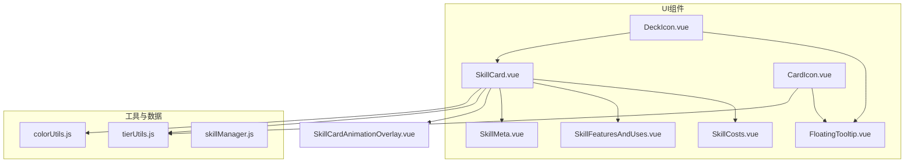
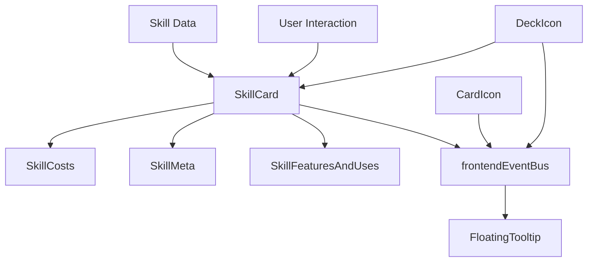
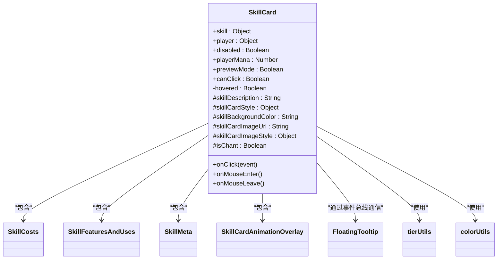
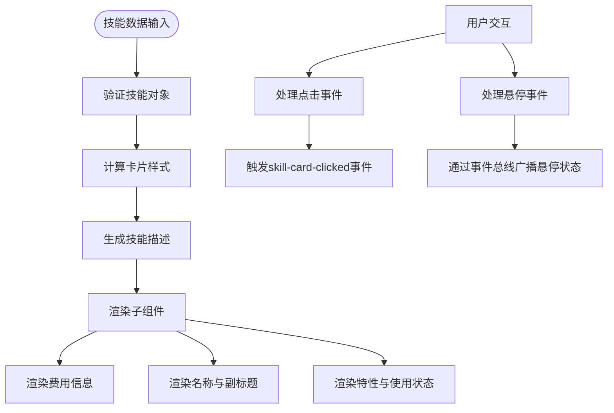
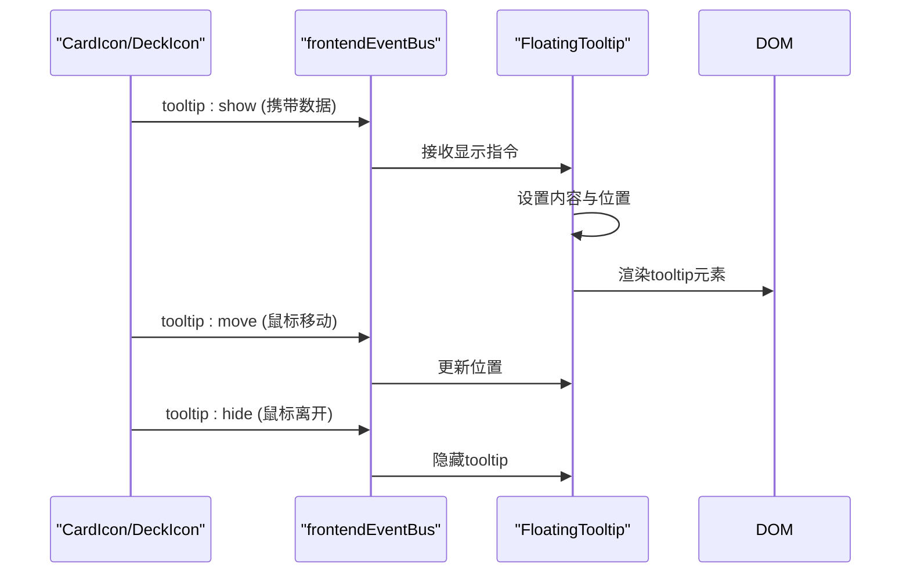
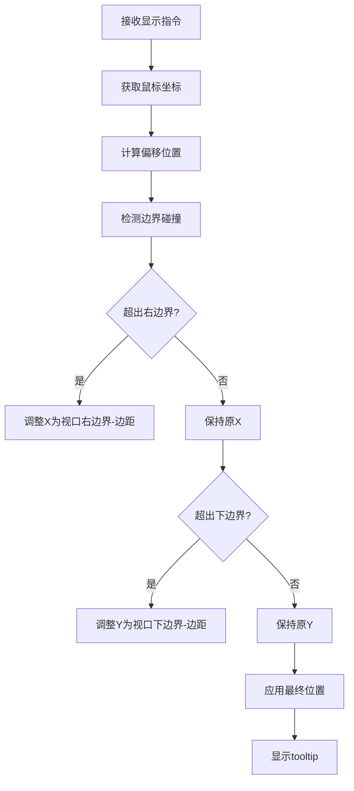
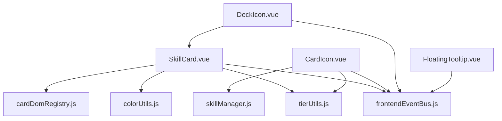

# 原子化UI组件

<cite>
**本文档引用的文件**  
- [SkillCard.vue](file://src/components/global/SkillCard.vue)
- [SkillCosts.vue](file://src/components/global/skillCard/SkillCosts.vue)
- [SkillFeaturesAndUses.vue](file://src/components/global/skillCard/SkillFeaturesAndUses.vue)
- [SkillMeta.vue](file://src/components/global/skillCard/SkillMeta.vue)
- [CardIcon.vue](file://src/components/global/CardIcon.vue)
- [DeckIcon.vue](file://src/components/global/DeckIcon.vue)
- [FloatingTooltip.vue](file://src/components/global/FloatingTooltip.vue)
- [tierUtils.js](file://src/utils/tierUtils.js)
- [colorUtils.js](file://src/utils/colorUtils.js)
</cite>

## 目录
1. [简介](#简介)
2. [项目结构](#项目结构)
3. [核心组件](#核心组件)
4. [架构概览](#架构概览)
5. [详细组件分析](#详细组件分析)
6. [依赖分析](#依赖分析)
7. [性能考虑](#性能考虑)
8. [故障排除指南](#故障排除指南)
9. [结论](#结论)

## 简介
本文档系统性地文档化项目中的原子化UI组件，重点解析`SkillCard.vue`的可复用设计模式。详细说明卡片组件如何通过props接收技能数据并动态渲染属性（消耗、效果等），`CardIcon`与`DeckIcon`如何实现轻量级资源标识。描述`Tooltip`组件的悬浮交互逻辑与位置计算策略，以及图标类组件的样式封装方法。提供组件API接口文档，包括支持的prop类型、事件触发机制和插槽使用方式。结合GSAP动画说明技能卡片的视觉反馈实现。

## 项目结构
项目采用基于功能模块的组件组织方式，将UI组件集中存放在`src/components/global/`目录下，形成可复用的原子化组件库。技能相关组件进一步细分为`skillCard`子目录，包含多个职责单一的子组件。数据模型与业务逻辑分离在`src/data/`目录中，通过props驱动UI渲染，实现了清晰的关注点分离。

**Diagram sources**  
- [SkillCard.vue](file://src/components/global/SkillCard.vue#L1-L235)
- [CardIcon.vue](file://src/components/global/CardIcon.vue#L1-L93)
- [DeckIcon.vue](file://src/components/global/DeckIcon.vue#L1-L137)

**Section sources**  
- [SkillCard.vue](file://src/components/global/SkillCard.vue#L1-L235)
- [project_structure](file://project_structure)

## 核心组件
核心UI组件围绕技能系统构建，以`SkillCard`为容器组件，通过组合多个原子化子组件实现复杂功能。组件设计遵循单一职责原则，每个子组件负责特定的UI展示逻辑，通过props接收数据，保持了高度的可复用性和可测试性。

**Section sources**  
- [SkillCard.vue](file://src/components/global/SkillCard.vue#L1-L235)
- [SkillCosts.vue](file://src/components/global/skillCard/SkillCosts.vue#L1-L52)

## 架构概览
系统采用Vue 3的组合式API架构，通过事件总线`frontendEventBus`实现跨组件通信。UI组件与业务逻辑解耦，通过props接收数据，通过事件或事件总线触发行为。技能数据由`SkillManager`统一管理，组件仅负责渲染，实现了清晰的分层架构。

**Diagram sources**  
- [SkillCard.vue](file://src/components/global/SkillCard.vue#L1-L235)
- [frontendEventBus.js](file://src/frontendEventBus.js#L1-L10)

## 详细组件分析

### SkillCard组件分析
`SkillCard`作为技能系统的主视觉组件，采用复合组件模式，整合多个子组件实现完整功能。通过props接收技能对象和玩家状态，利用computed属性动态生成描述文本和样式，实现了数据驱动的UI渲染。

#### 组件关系图

**Diagram sources**  
- [SkillCard.vue](file://src/components/global/SkillCard.vue#L1-L235)
- [tierUtils.js](file://src/utils/tierUtils.js#L1-L10)
- [colorUtils.js](file://src/utils/colorUtils.js#L1-L10)

#### 数据流图

**Diagram sources**  
- [SkillCard.vue](file://src/components/global/SkillCard.vue#L1-L235)

**Section sources**  
- [SkillCard.vue](file://src/components/global/SkillCard.vue#L1-L235)
- [SkillCosts.vue](file://src/components/global/skillCard/SkillCosts.vue#L1-L52)
- [SkillFeaturesAndUses.vue](file://src/components/global/skillCard/SkillFeaturesAndUses.vue#L1-L47)
- [SkillMeta.vue](file://src/components/global/skillCard/SkillMeta.vue#L1-L57)

### 图标组件分析
`CardIcon`和`DeckIcon`作为轻量级资源标识组件，通过简洁的视觉元素传达关键信息。两者均利用事件总线机制与`FloatingTooltip`组件协同工作，提供丰富的上下文信息。

#### 交互流程图

**Diagram sources**  
- [CardIcon.vue](file://src/components/global/CardIcon.vue#L1-L93)
- [DeckIcon.vue](file://src/components/global/DeckIcon.vue#L1-L137)
- [FloatingTooltip.vue](file://src/components/global/FloatingTooltip.vue#L1-L124)

**Section sources**  
- [CardIcon.vue](file://src/components/global/CardIcon.vue#L1-L93)
- [DeckIcon.vue](file://src/components/global/DeckIcon.vue#L1-L137)
- [FloatingTooltip.vue](file://src/components/global/FloatingTooltip.vue#L1-L124)

### Tooltip组件分析
`FloatingTooltip`组件实现了一个通用的悬浮提示系统，通过监听事件总线的消息来控制显示状态和内容。采用固定定位（fixed positioning）确保在视口内的正确显示，并通过边界检测算法避免溢出屏幕。

#### 位置计算逻辑

**Diagram sources**  
- [FloatingTooltip.vue](file://src/components/global/FloatingTooltip.vue#L1-L124)

**Section sources**  
- [FloatingTooltip.vue](file://src/components/global/FloatingTooltip.vue#L1-L124)

## 依赖分析
组件间依赖关系清晰，主要通过props向下传递数据，通过事件或事件总线向上或横向通信。`SkillCard`作为核心组件，依赖多个工具函数来处理样式计算，同时与动画系统集成，实现了丰富的视觉反馈。

**Diagram sources**  
- [go.mod](file://package.json#L1-L10)
- [SkillCard.vue](file://src/components/global/SkillCard.vue#L1-L235)

**Section sources**  
- [package.json](file://package.json#L1-L10)
- [SkillCard.vue](file://src/components/global/SkillCard.vue#L1-L235)

## 性能考虑
组件在性能方面进行了多项优化：`SkillCard`组件通过`autoRegisterInRegistry` prop控制是否自动注册到全局卡片DOM注册表，避免不必要的DOM操作；`FloatingTooltip`使用`pointer-events: none`确保不阻挡鼠标事件；`DeckIcon`的预览功能通过`showPreview`状态控制，仅在悬停时渲染`SkillCard`实例，减少了初始渲染负担。

## 故障排除指南
常见问题包括tooltip不显示、技能卡片样式异常等。检查`frontendEventBus`的事件监听是否正确绑定，确保`SkillManager`能正确创建技能实例。对于样式问题，验证`tierUtils`返回的颜色值是否正确，并检查CSS变量`--z-tooltip`和`--z-overlay`是否在根样式中定义。

**Section sources**  
- [frontendEventBus.js](file://src/frontendEventBus.js#L1-L20)
- [tierUtils.js](file://src/utils/tierUtils.js#L1-L15)

## 结论
本项目中的原子化UI组件设计体现了现代前端架构的最佳实践：组件高度解耦、职责单一、通过props和事件进行通信。`SkillCard`的复合组件模式、`CardIcon`和`DeckIcon`的轻量级设计、以及`FloatingTooltip`的通用性，共同构建了一个可维护、可扩展的UI系统。通过事件总线实现的松耦合通信机制，为未来功能扩展提供了良好的基础。