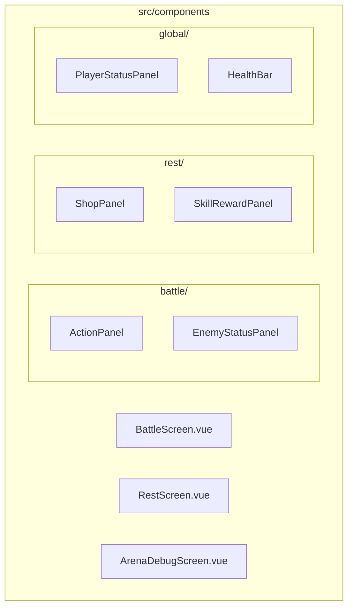
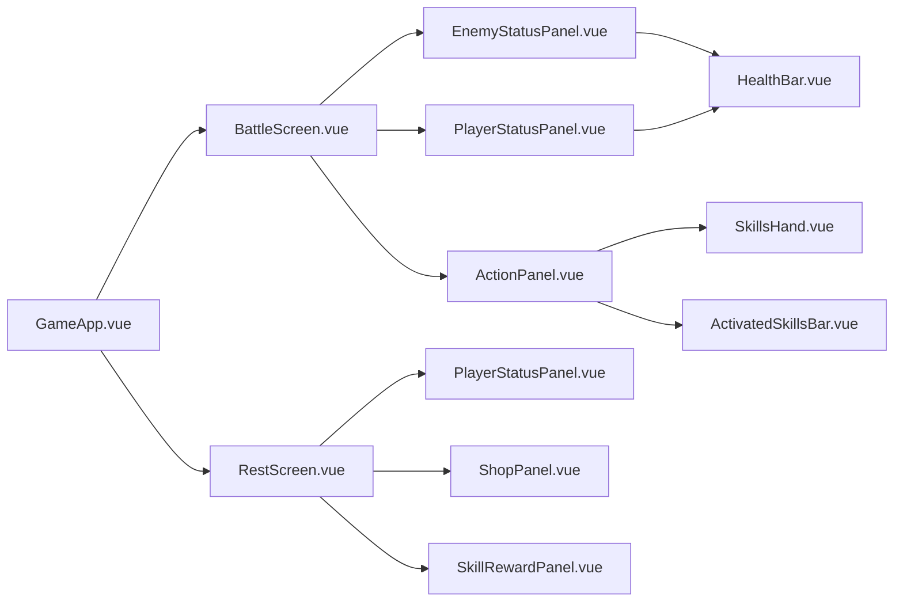
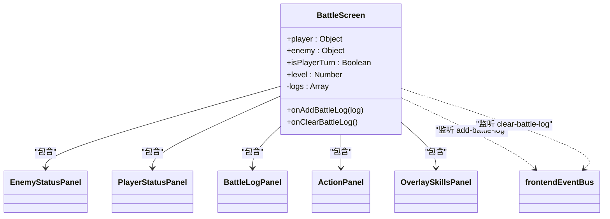
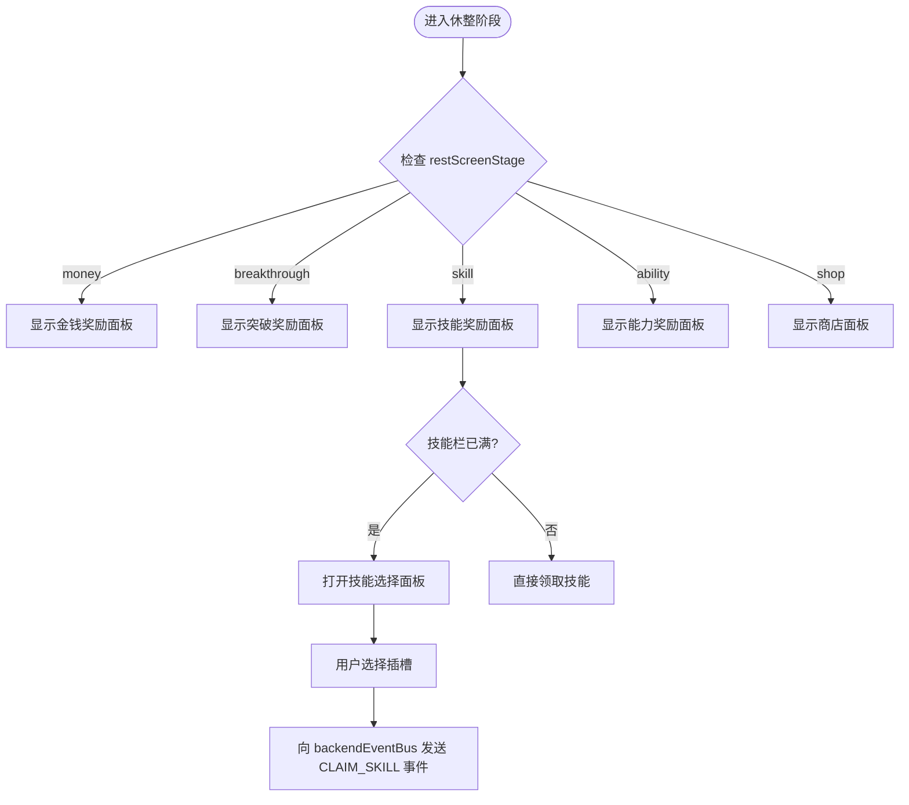
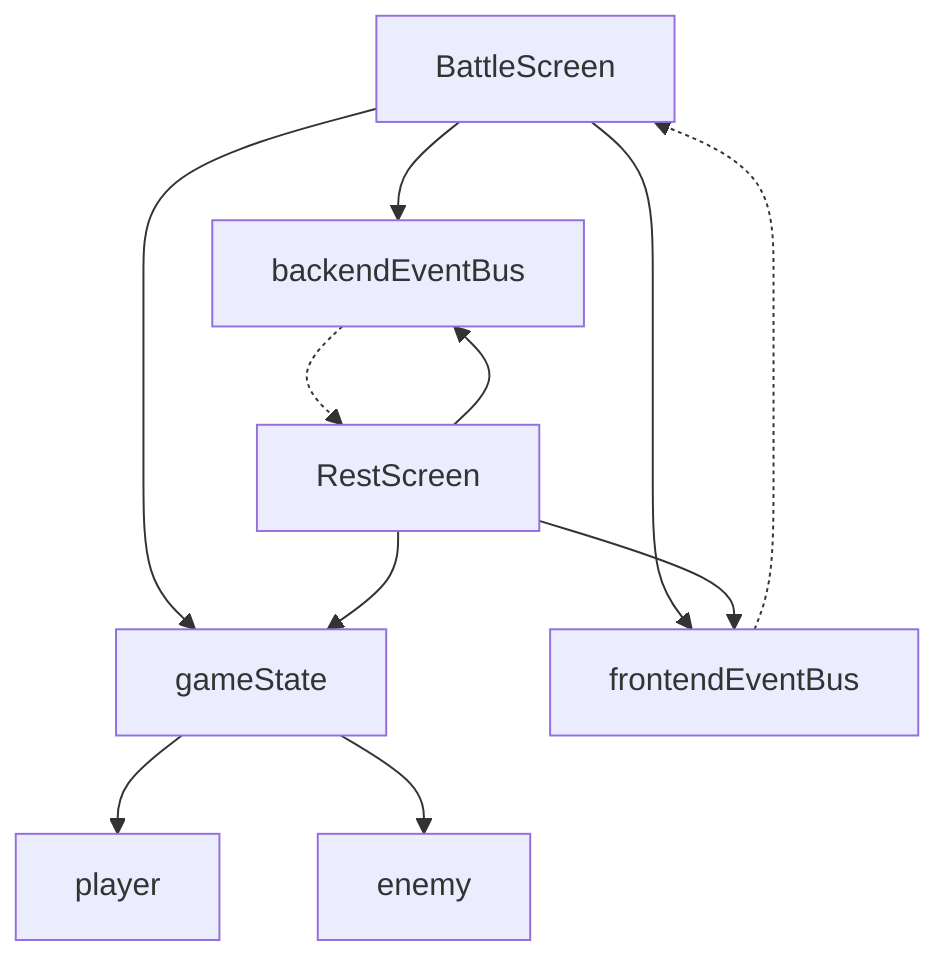

# 屏幕级组件

<cite>
**本文档引用的文件**  
- [BattleScreen.vue](file://src/components/battle/BattleScreen.vue)
- [RestScreen.vue](file://src/components/rest/RestScreen.vue)
- [ArenaDebugScreen.vue](file://src/components/global/ArenaDebugScreen.vue)
- [PlayerStatusPanel.vue](file://src/components/global/PlayerStatusPanel.vue)
- [EnemyStatusPanel.vue](file://src/components/battle/EnemyStatusPanel.vue)
- [ActionPanel.vue](file://src/components/battle/ActionPanel.vue)
- [gameState.js](file://src/data/gameState.js)
- [frontendEventBus.js](file://src/frontendEventBus.js)
- [backendEventBus.js](file://src/backendEventBus.js)
</cite>

## 目录
1. [引言](#引言)
2. [项目结构](#项目结构)
3. [核心屏幕组件](#核心屏幕组件)
4. [架构概览](#架构概览)
5. [详细组件分析](#详细组件分析)
6. [依赖分析](#依赖分析)
7. [性能考虑](#性能考虑)
8. [故障排除指南](#故障排除指南)
9. [结论](#结论)

## 引言
本文档深入分析游戏项目中的屏幕级组件设计，重点描述 `BattleScreen.vue`、`RestScreen.vue` 等全屏界面组件的架构职责。这些组件作为游戏不同阶段的核心容器，协调子组件布局与状态传递，实现完整的用户界面展示。文档将结合代码结构说明屏幕组件如何与全局游戏状态绑定、注册事件监听以及集成路由系统，并提供主要屏幕的UI结构图和数据依赖关系。

## 项目结构
项目采用基于功能模块的组件组织方式，屏幕级组件集中存放在 `src/components/` 目录下的子目录中，如 `battle/`、`rest/` 等。这种结构清晰地分离了不同游戏阶段的界面逻辑。

**Diagram sources**
- [BattleScreen.vue](file://src/components/battle/BattleScreen.vue#L1-L10)
- [RestScreen.vue](file://src/components/rest/RestScreen.vue#L1-L10)

**Section sources**
- [BattleScreen.vue](file://src/components/battle/BattleScreen.vue#L1-L111)
- [RestScreen.vue](file://src/components/rest/RestScreen.vue#L1-L269)

## 核心屏幕组件
屏幕级组件（如 `BattleScreen.vue` 和 `RestScreen.vue`）是游戏UI的顶级容器，负责整合多个子组件并管理其布局与交互逻辑。它们通过 `props` 接收游戏状态数据，并作为事件总线的监听者与后端逻辑通信。

**Section sources**
- [BattleScreen.vue](file://src/components/battle/BattleScreen.vue#L1-L111)
- [RestScreen.vue](file://src/components/rest/RestScreen.vue#L1-L269)

## 架构概览
屏幕组件采用典型的Vue单文件组件（SFC）模式，包含模板、脚本和样式三部分。它们通过 `frontendEventBus` 和 `backendEventBus` 与游戏逻辑层解耦，实现事件驱动的状态更新。

**Diagram sources**
- [BattleScreen.vue](file://src/components/battle/BattleScreen.vue#L1-L111)
- [RestScreen.vue](file://src/components/rest/RestScreen.vue#L1-L269)
- [PlayerStatusPanel.vue](file://src/components/global/PlayerStatusPanel.vue#L1-L216)

## 详细组件分析
本节深入分析主要屏幕组件的实现细节，包括其状态管理、事件处理和UI结构。

### BattleScreen 组件分析
`BattleScreen.vue` 是战斗阶段的主界面，协调敌人状态、玩家状态、战斗日志和操作面板的展示。

#### 组件结构与职责
该组件作为容器，通过 `props` 接收 `player`、`enemy` 和 `isPlayerTurn` 等状态，并将其传递给子组件。它还通过 `frontendEventBus` 监听战斗日志事件，动态更新日志列表。

**Diagram sources**
- [BattleScreen.vue](file://src/components/battle/BattleScreen.vue#L1-L111)

**Section sources**
- [BattleScreen.vue](file://src/components/battle/BattleScreen.vue#L1-L111)
- [BattleLogPanel.vue](file://src/components/battle/BattleLogPanel.vue#L1-L50)

### RestScreen 组件分析
`RestScreen.vue` 管理休整阶段的多种界面状态，包括金钱奖励、技能奖励、商店和准备面板等。

#### 状态驱动的UI切换
该组件通过计算属性 `currentStage` 监听 `gameState.restScreenStage` 的变化，使用 `v-if` 和 `transition` 实现不同奖励面板的动态切换，确保同一时间只显示一个主面板。

**Diagram sources**
- [RestScreen.vue](file://src/components/rest/RestScreen.vue#L1-L269)

**Section sources**
- [RestScreen.vue](file://src/components/rest/RestScreen.vue#L1-L269)
- [backendEventBus.js](file://src/backendEventBus.js#L1-L20)

### ArenaDebugScreen 调试组件
`ArenaDebugScreen.vue` 是一个开发辅助组件，目前处于未开发状态，仅包含一个占位标题。

#### 调试功能与启用机制
尽管当前为空，此类组件通常用于开发阶段快速测试游戏机制。其启用机制可能通过特定路由或全局调试标志（如 `gameState.debugMode`）控制，便于开发者在不干扰正式流程的情况下进行功能验证。

**Section sources**
- [ArenaDebugScreen.vue](file://src/components/global/ArenaDebugScreen.vue#L1-L15)

## 依赖分析
屏幕组件依赖于全局状态管理和事件通信机制，与后端逻辑保持松耦合。

**Diagram sources**
- [gameState.js](file://src/data/gameState.js#L1-L75)
- [frontendEventBus.js](file://src/frontendEventBus.js#L1-L10)
- [backendEventBus.js](file://src/backendEventBus.js#L1-L10)

**Section sources**
- [gameState.js](file://src/data/gameState.js#L1-L75)
- [frontendEventBus.js](file://src/frontendEventBus.js#L1-L10)
- [backendEventBus.js](file://src/backendEventBus.js#L1-L10)

## 性能考虑
屏幕组件通过 `v-if` 而非 `v-show` 控制子组件的渲染，避免不必要的DOM节点存在。同时，事件监听在 `mounted` 和 `beforeUnmount` 生命周期中正确注册与销毁，防止内存泄漏。

## 故障排除指南
若屏幕组件未正确更新，应检查：
1. `props` 传递的数据是否正确
2. 事件总线的监听与触发是否匹配
3. `gameState` 的响应式更新是否生效

**Section sources**
- [BattleScreen.vue](file://src/components/battle/BattleScreen.vue#L1-L111)
- [RestScreen.vue](file://src/components/rest/RestScreen.vue#L1-L269)
- [gameState.js](file://src/data/gameState.js#L1-L75)

## 结论
屏幕级组件作为游戏UI的核心容器，通过合理的架构设计实现了高内聚、低耦合的界面管理。它们利用Vue的响应式系统和事件总线机制，有效地协调了子组件的布局与状态传递，为不同游戏阶段提供了清晰、可维护的界面解决方案。