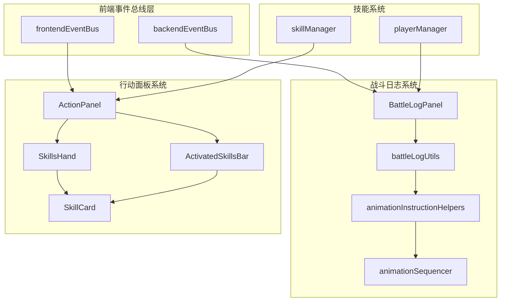
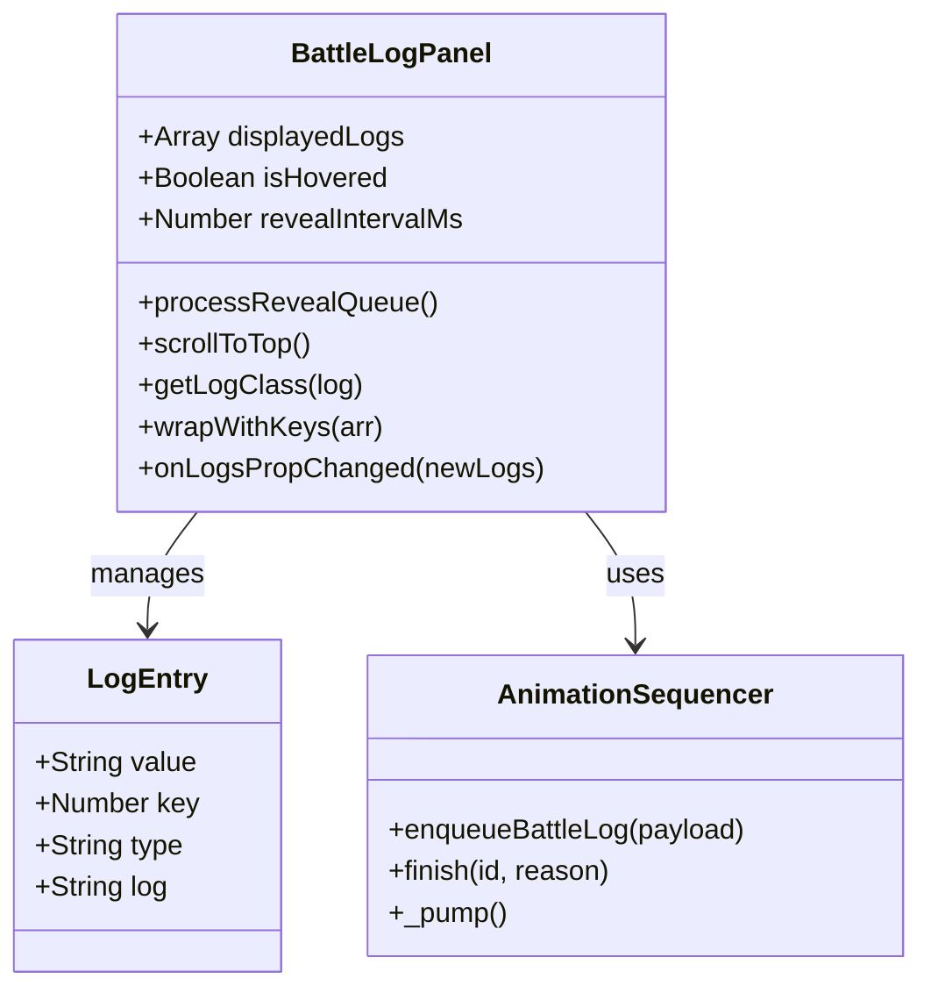
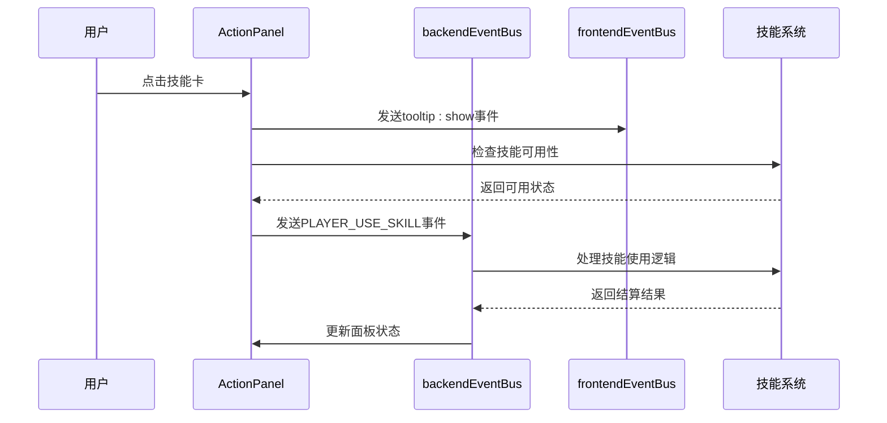
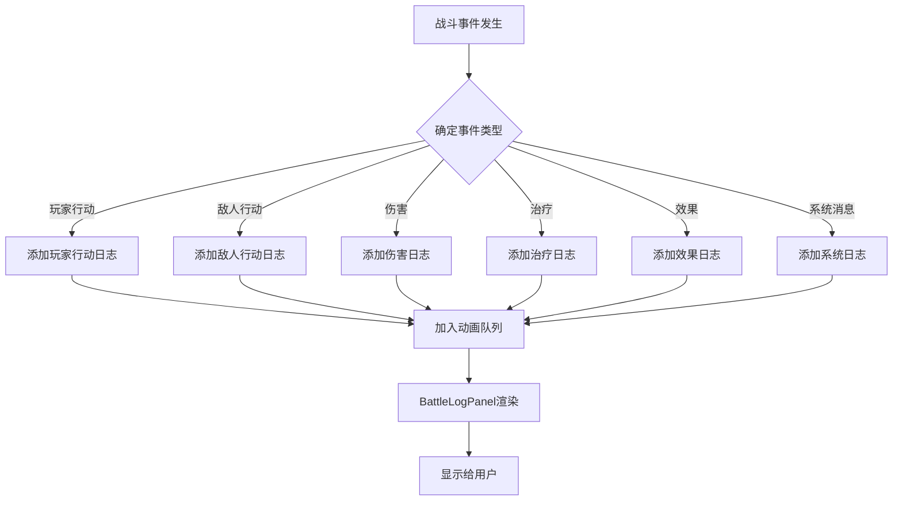

# 战斗日志组件与行动面板交互设计文档

<cite>
**本文档引用的文件**
- [BattleLogPanel.vue](file://src/components/battle/BattleLogPanel.vue)
- [ActionPanel.vue](file://src/components/battle/ActionPanel.vue)
- [frontendEventBus.js](file://src/frontendEventBus.js)
- [backendEventBus.js](file://src/backendEventBus.js)
- [battleLogUtils.js](file://src/data/battleLogUtils.js)
- [animationInstructionHelpers.js](file://src/data/animationInstructionHelpers.js)
- [animationSequencer.js](file://src/data/animationSequencer.js)
- [SkillsHand.vue](file://src/components/battle/SkillsHand.vue)
- [ActivatedSkillsBar.vue](file://src/components/battle/ActivatedSkillsBar.vue)
- [SkillCard.vue](file://src/components/global/SkillCard.vue)
</cite>

## 目录
1. [概述](#概述)
2. [系统架构](#系统架构)
3. [BattleLogPanel组件分析](#battlelogpanel组件分析)
4. [ActionPanel组件分析](#actionpanel组件分析)
5. [事件总线通信机制](#事件总线通信机制)
6. [战斗日志格式化与渲染](#战斗日志格式化与渲染)
7. [技能交互与状态管理](#技能交互与状态管理)
8. [性能优化策略](#性能优化策略)
9. [故障排除指南](#故障排除指南)
10. [总结](#总结)

## 概述

本文档详细阐述了游戏战斗系统中战斗日志组件（BattleLogPanel）与行动面板（ActionPanel）的交互设计与实现机制。这两个组件构成了战斗界面的核心交互层，负责处理战斗事件的实时显示、用户输入反馈以及技能系统的动态交互。

BattleLogPanel通过frontendEventBus订阅各种战斗事件，按照时间序列渲染日志条目，支持自动滚动与信息过滤功能。ActionPanel则根据当前行动点数和技能冷却状态动态生成可交互技能按钮，实现完整的用户输入反馈机制。

## 系统架构



**图表来源**
- [frontendEventBus.js](file://src/frontendEventBus.js#L1-L9)
- [backendEventBus.js](file://src/backendEventBus.js#L1-L80)
- [BattleLogPanel.vue](file://src/components/battle/BattleLogPanel.vue#L1-L204)
- [ActionPanel.vue](file://src/components/battle/ActionPanel.vue#L1-L178)

## BattleLogPanel组件分析

BattleLogPanel是战斗日志的核心组件，负责接收战斗事件、格式化日志信息并提供流畅的视觉呈现。

### 核心功能特性



**图表来源**
- [BattleLogPanel.vue](file://src/components/battle/BattleLogPanel.vue#L20-L50)
- [animationInstructionHelpers.js](file://src/data/animationInstructionHelpers.js#L360-L370)

### 日志渲染机制

BattleLogPanel采用渐进式渲染策略，通过以下机制确保高性能和用户体验：

1. **逐条显示机制**：新日志按200ms间隔逐条显示，避免大量日志同时出现造成视觉冲击
2. **智能前缀检测**：通过commonPrefixLen算法识别重复日志前缀，避免不必要的重新渲染
3. **透明度渐变**：鼠标悬停时显示完整不透明度，离开时逐渐淡化历史日志
4. **自动滚动控制**：当用户悬停时暂停自动滚动，提升阅读体验

### 日志分类与样式

组件支持多种日志类型的智能分类：

```javascript
// 日志类型映射
getLogClass(log) {
  if (typeof log === 'string') {
    if (log.includes('你')) return 'player-log';
    else if (log.includes('敌人') || (this.enemy && log.includes(this.enemy.name))) return 'enemy-log';
    else return 'other-log';
  } else {
    switch (log.type) {
      case 'player_action': return 'player-log';
      case 'enemy_action': return 'enemy-log';
      case 'damage': return 'enemy-log';
      case 'heal': return 'other-log';
      case 'effect': return 'other-log';
      default: return 'other-log';
    }
  }
}
```

**章节来源**
- [BattleLogPanel.vue](file://src/components/battle/BattleLogPanel.vue#L120-L140)

## ActionPanel组件分析

ActionPanel是战斗界面的操作中心，负责管理玩家技能使用、行动点数消耗和回合控制。

### 组件结构与交互



**图表来源**
- [ActionPanel.vue](file://src/components/battle/ActionPanel.vue#L90-L110)
- [backendEventBus.js](file://src/backendEventBus.js#L33-L40)

### 动态技能按钮生成

ActionPanel根据玩家状态动态生成可交互的技能按钮：

1. **技能可用性检查**：通过canUseSkill函数验证技能是否满足使用条件
2. **行动点数验证**：检查玩家当前行动点数是否足够
3. **冷却状态判断**：识别技能是否处于冷却期间
4. **控制状态管理**：通过isControlDisabled标志控制面板整体交互

### 特殊功能按钮

组件提供了多个特殊功能按钮，增强战斗体验：

- **换卡按钮**：消耗行动点数更换手牌，成本随使用次数递增
- **结束回合按钮**：主动结束当前玩家回合
- **牌库预览**：点击牌库图标查看后备技能列表
- **烧毁技能**：查看已失效技能的统计信息

**章节来源**
- [ActionPanel.vue](file://src/components/battle/ActionPanel.vue#L72-L111)

## 事件总线通信机制

系统采用双层事件总线架构，确保前后端组件间的高效通信。

### 前端事件总线（frontendEventBus）

frontendEventBus专门负责前端组件间的数据传递和动画控制：

```javascript
// 事件监听示例
frontendEventBus.on('disable-controls', () => {
  this.isControlDisabled = true;
});

frontendEventBus.on('enable-controls', () => {
  this.isControlDisabled = false;
});
```

### 后端事件总线（backendEventBus）

backendEventBus处理游戏逻辑层面的事件分发：

```javascript
// 战斗事件命名空间
export const EventNames = {
  Battle: {
    PLAYER_TURN_START: 'battle-player-turn-start',
    PLAYER_TURN_END: 'battle-player-turn-end',
    PLAYER_USE_SKILL: 'battle-player-use-skill',
    ENEMY_TURN: 'battle-enemy-turn'
  }
};
```

**章节来源**
- [frontendEventBus.js](file://src/frontendEventBus.js#L1-L9)
- [backendEventBus.js](file://src/backendEventBus.js#L3-L80)

## 战斗日志格式化与渲染

战斗日志系统采用分层架构，确保日志信息的准确性和表现力。

### 日志类型系统



**图表来源**
- [battleLogUtils.js](file://src/data/battleLogUtils.js#L17-L60)
- [animationInstructionHelpers.js](file://src/data/animationInstructionHelpers.js#L360-L370)

### 敏感信息脱敏

系统实现了智能的信息脱敏机制，保护玩家隐私：

1. **实体名称标准化**：将具体实体名称替换为通用标识
2. **数值范围限制**：对伤害值等敏感数据进行范围限制
3. **时间戳处理**：统一处理时间显示格式
4. **位置信息抽象**：避免暴露具体位置信息

### 动画指令集成

战斗日志通过animationInstructionHelpers与动画系统深度集成：

```javascript
export function enqueueBattleLog(payload = {}, { tags = ['ui'], waitTags, durationMs = 0, ...rest } = {}) {
  return enqueueInstruction({
    tags,
    waitTags: waitTags ?? computeWaitTags(rest),
    durationMs,
    start: ({ emit }) => { try { emit('add-battle-log', payload); } catch (_) {} },
  });
}
```

**章节来源**
- [battleLogUtils.js](file://src/data/battleLogUtils.js#L17-L25)
- [animationInstructionHelpers.js](file://src/data/animationInstructionHelpers.js#L360-L370)

## 技能交互与状态管理

技能系统通过多层次的状态管理和交互机制，提供丰富的战斗体验。

### 技能卡片交互

```mermaid
stateDiagram-v2
[*] --> Idle
Idle --> Hover : 鼠标悬停
Hover --> Preview : 显示预览
Preview --> Click : 点击激活
Click --> Disabled : 技能不可用
Click --> Enabled : 技能可用
Enabled --> Dragging : 开始拖拽
Dragging --> Drop : 释放技能
Drop --> Executing : 执行技能
Executing --> Idle : 技能完成
Disabled --> Idle : 状态恢复
```

**图表来源**
- [SkillCard.vue](file://src/components/global/SkillCard.vue#L110-L130)
- [SkillsHand.vue](file://src/components/battle/SkillsHand.vue#L20-L40)

### 行动点数管理系统

ActionPanel实现了精确的行动点数计算和验证：

```javascript
computed: {
  shiftSkillCost() {
    return backendGameState.player.getModifiedPlayer().currentShiftSkillActionPointCost;
  },
  canShiftSkill() {
    const canShiftSkill = backendGameState.player.getModifiedPlayer().canShiftSkill();
    return (this.isPlayerTurn && !this.isControlDisabled && canShiftSkill);
  }
}
```

### 技能冷却与状态

系统维护复杂的技能状态信息：

1. **冷却计时器**：记录每个技能的剩余冷却时间
2. **使用次数限制**：跟踪技能的最大使用次数
3. **组合技能状态**：管理连锁技能的依赖关系
4. **被动技能激活**：监控被动技能的触发条件

**章节来源**
- [ActionPanel.vue](file://src/components/battle/ActionPanel.vue#L80-L95)

## 性能优化策略

系统采用了多种性能优化策略，确保在高频率事件下的流畅运行。

### 虚拟滚动技术

BattleLogPanel实现了智能的虚拟滚动机制：

1. **可见区域检测**：只渲染当前可见区域的日志条目
2. **动态高度计算**：根据内容自动调整容器高度
3. **内存管理**：及时清理超出范围的日志条目
4. **批量更新**：合并多个日志更新为单次渲染

### 节流渲染机制

```javascript
// 节流渲染示例
processRevealQueue() {
  if (this._revealQueue.length === 0) {
    this._revealing = false;
    return;
  }
  
  this._revealing = true;
  const next = this._revealQueue.shift();
  this.displayedLogs.unshift({ value: next, key: ++this._idCounter });
  
  if (!this.isHovered) this.$nextTick(this.scrollToTop);
  this._revealTimer = setTimeout(() => this.processRevealQueue(), this.revealIntervalMs);
}
```

### 动画序列优化

animationSequencer实现了高效的动画队列管理：

1. **并发控制**：限制同时执行的动画数量
2. **优先级调度**：根据动画重要性调整执行顺序
3. **资源池管理**：复用动画资源减少内存分配
4. **延迟加载**：按需加载动画资源

**章节来源**
- [BattleLogPanel.vue](file://src/components/battle/BattleLogPanel.vue#L100-L120)
- [animationSequencer.js](file://src/data/animationSequencer.js#L50-L80)

## 故障排除指南

### 常见问题诊断

1. **日志不显示**
   - 检查frontendEventBus是否正确监听事件
   - 验证animationSequencer队列状态
   - 确认日志类型是否正确分类

2. **技能按钮无响应**
   - 检查isControlDisabled状态
   - 验证技能可用性检查逻辑
   - 确认事件总线连接状态

3. **性能问题**
   - 监控日志条目数量
   - 检查动画队列积压情况
   - 分析内存使用情况

### 调试工具与技巧

系统提供了丰富的调试支持：

```javascript
// 调试日志示例
console.log('ActionPanel: disable-controls received');
console.log('[animationSequencer] start logic error:', err);
```

**章节来源**
- [ActionPanel.vue](file://src/components/battle/ActionPanel.vue#L95-L100)
- [animationSequencer.js](file://src/data/animationSequencer.js#L100-L110)

## 总结

战斗日志组件与行动面板的交互设计展现了现代游戏开发中复杂UI系统的最佳实践。通过精心设计的事件总线架构、智能的性能优化策略和灵活的状态管理系统，系统实现了高质量的用户体验。

主要技术亮点包括：

1. **模块化设计**：清晰的组件分离和职责划分
2. **事件驱动架构**：高效的前后端通信机制
3. **性能优化**：虚拟滚动、节流渲染等先进技术
4. **用户体验**：流畅的动画效果和直观的交互设计
5. **可扩展性**：良好的架构设计支持功能扩展

这套系统为游戏战斗界面的设计提供了宝贵的参考，展示了如何在复杂的交互场景中保持系统的稳定性和响应性。