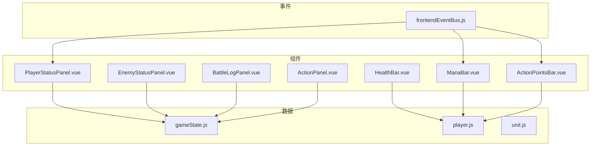
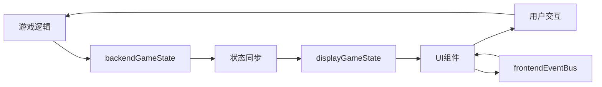
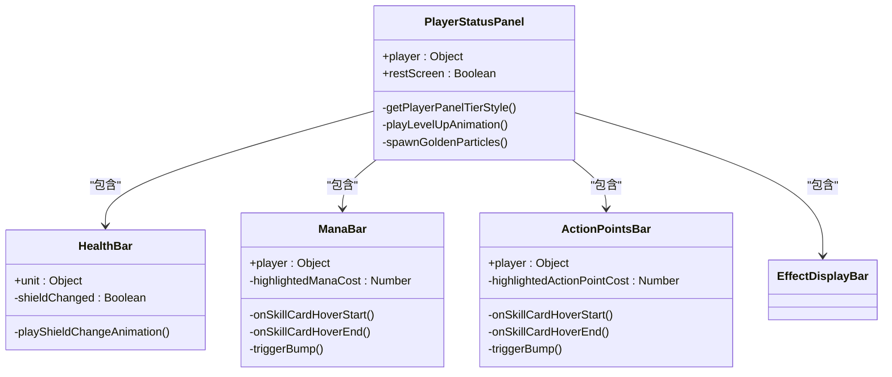
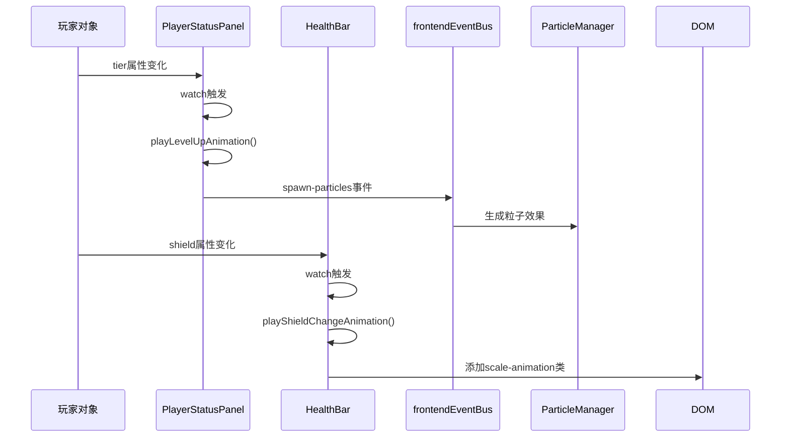
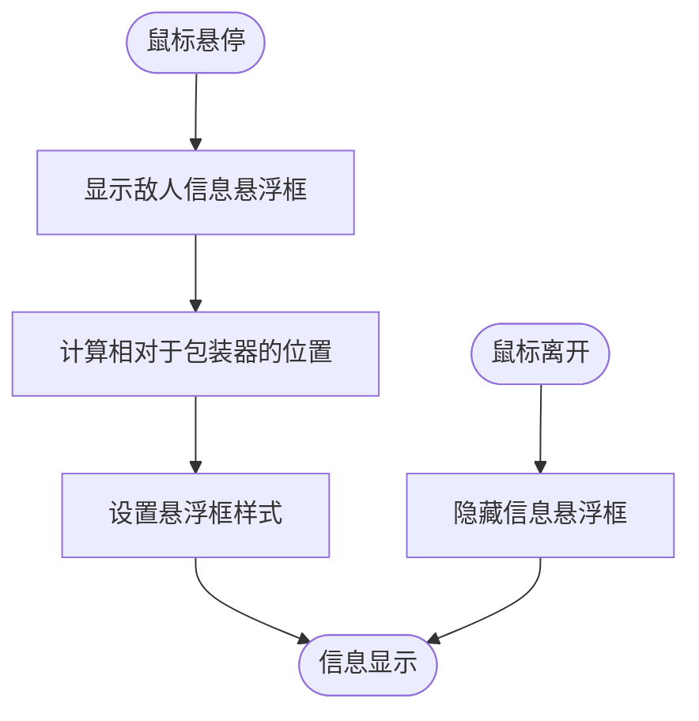
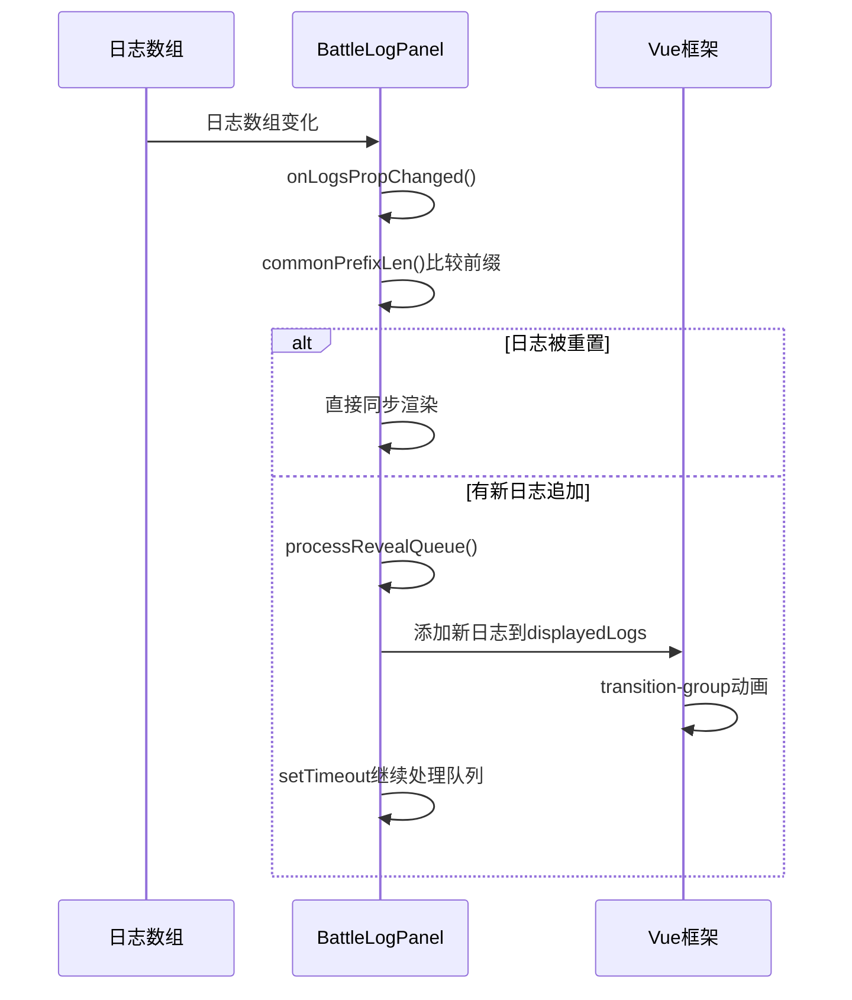
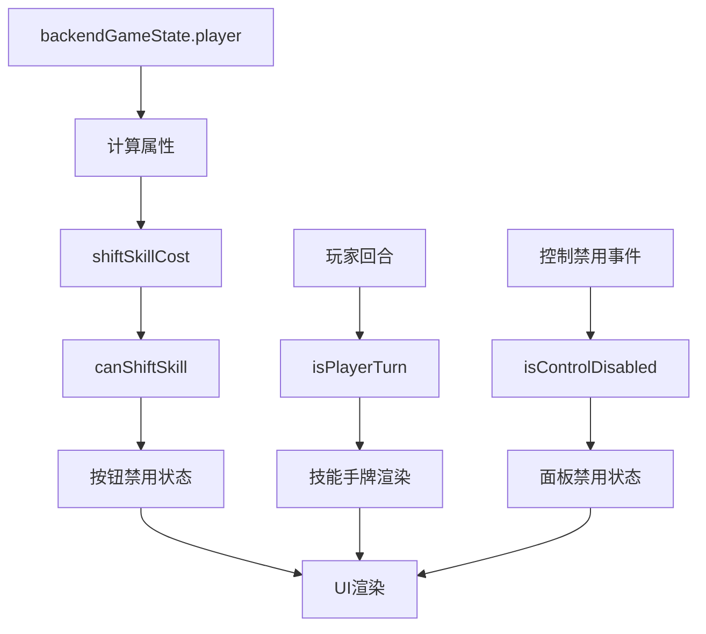
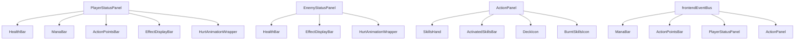

# 状态面板组件

<cite>
**本文档中引用的文件**
- [PlayerStatusPanel.vue](file://src/components/global/PlayerStatusPanel.vue)
- [EnemyStatusPanel.vue](file://src/components/battle/EnemyStatusPanel.vue)
- [BattleLogPanel.vue](file://src/components/battle/BattleLogPanel.vue)
- [ActionPanel.vue](file://src/components/battle/ActionPanel.vue)
- [HealthBar.vue](file://src/components/global/HealthBar.vue)
- [ManaBar.vue](file://src/components/global/ManaBar.vue)
- [ActionPointsBar.vue](file://src/components/global/ActionPointsBar.vue)
- [gameState.js](file://src/data/gameState.js)
- [player.js](file://src/data/player.js)
- [unit.js](file://src/data/unit.js)
- [frontendEventBus.js](file://src/frontendEventBus.js)
</cite>

## 目录
1. [简介](#简介)
2. [项目结构](#项目结构)
3. [核心组件](#核心组件)
4. [架构概述](#架构概述)
5. [详细组件分析](#详细组件分析)
6. [依赖分析](#依赖分析)
7. [性能考虑](#性能考虑)
8. [故障排除指南](#故障排除指南)
9. [结论](#结论)

## 简介
本文档全面解析了游戏中的状态面板类组件设计与实现，重点阐述了`PlayerStatusPanel.vue`和`EnemyStatusPanel.vue`如何实时反映角色状态数据。详细描述了血量条、法力条、行动点数条等状态可视化组件的技术实现，包括响应式更新机制与动画反馈。说明了`BattleLogPanel`如何通过事件驱动更新战斗日志，`ActionPanel`如何动态渲染可用技能。结合实际代码展示了状态数据从gameState到UI的映射流程，以及异常状态（如负值、溢出）的处理策略，并提供了性能优化建议。

## 项目结构
项目结构清晰地将组件分为全局组件和战斗专用组件。全局组件位于`src/components/global/`目录下，可被多个场景复用；战斗相关组件位于`src/components/battle/`目录下。状态数据管理位于`src/data/`目录，通过响应式系统与UI组件联动。

**Diagram sources**
- [PlayerStatusPanel.vue](file://src/components/global/PlayerStatusPanel.vue)
- [EnemyStatusPanel.vue](file://src/components/battle/EnemyStatusPanel.vue)
- [BattleLogPanel.vue](file://src/components/battle/BattleLogPanel.vue)
- [ActionPanel.vue](file://src/components/battle/ActionPanel.vue)
- [HealthBar.vue](file://src/components/global/HealthBar.vue)
- [ManaBar.vue](file://src/components/global/ManaBar.vue)
- [ActionPointsBar.vue](file://src/components/global/ActionPointsBar.vue)
- [gameState.js](file://src/data/gameState.js)
- [player.js](file://src/data/player.js)
- [unit.js](file://src/data/unit.js)
- [frontendEventBus.js](file://src/frontendEventBus.js)

**Section sources**
- [PlayerStatusPanel.vue](file://src/components/global/PlayerStatusPanel.vue)
- [EnemyStatusPanel.vue](file://src/components/battle/EnemyStatusPanel.vue)

## 核心组件
核心状态面板组件包括玩家状态面板、敌人状态面板、战斗日志面板和操作面板。这些组件通过响应式数据绑定实时反映游戏状态，利用Vue的watch机制监听状态变化并自动更新UI。血量条、法力条和行动点数条等子组件实现了精细化的状态可视化，通过动画反馈增强用户体验。

**Section sources**
- [PlayerStatusPanel.vue](file://src/components/global/PlayerStatusPanel.vue#L1-L215)
- [EnemyStatusPanel.vue](file://src/components/battle/EnemyStatusPanel.vue#L1-L325)
- [BattleLogPanel.vue](file://src/components/battle/BattleLogPanel.vue#L1-L203)
- [ActionPanel.vue](file://src/components/battle/ActionPanel.vue#L1-L177)

## 架构概述
系统采用前后端分离的状态管理架构，通过`backendGameState`和`displayGameState`两个独立的响应式状态对象实现逻辑与显示的解耦。前端组件通过props接收状态数据，利用Vue的响应式系统自动更新UI。事件总线机制实现了组件间的松耦合通信，`frontendEventBus`负责动画和UI控制事件的传递。

**Diagram sources**
- [gameState.js](file://src/data/gameState.js#L1-L74)
- [frontendEventBus.js](file://src/frontendEventBus.js#L1-L8)

## 详细组件分析
对各个状态面板组件进行深入分析，揭示其内部实现机制和交互逻辑。

### 玩家状态面板分析
`PlayerStatusPanel.vue`组件负责展示玩家的完整状态信息，包括基础属性、资源条和效果栏。组件通过props接收玩家对象和场景模式，动态调整显示内容。

#### 组件结构

**Diagram sources**
- [PlayerStatusPanel.vue](file://src/components/global/PlayerStatusPanel.vue#L1-L215)
- [HealthBar.vue](file://src/components/global/HealthBar.vue#L1-L100)
- [ManaBar.vue](file://src/components/global/ManaBar.vue#L1-L119)
- [ActionPointsBar.vue](file://src/components/global/ActionPointsBar.vue#L1-L119)

#### 响应式更新机制
玩家状态面板通过Vue的watch选项监听玩家等阶变化，当检测到升级时触发视觉反馈动画。血量条组件通过watch监听护盾值变化，自动播放缩放动画，实现了状态变化的即时视觉反馈。

**Diagram sources**
- [PlayerStatusPanel.vue](file://src/components/global/PlayerStatusPanel.vue#L150-L195)
- [HealthBar.vue](file://src/components/global/HealthBar.vue#L30-L45)

**Section sources**
- [PlayerStatusPanel.vue](file://src/components/global/PlayerStatusPanel.vue#L1-L215)
- [HealthBar.vue](file://src/components/global/HealthBar.vue#L1-L100)

### 敌人状态面板分析
`EnemyStatusPanel.vue`组件展示敌人的状态信息，包括头像、名称、属性和状态条。组件实现了信息悬浮框功能，允许玩家查看敌人详细信息。

#### 交互流程

**Diagram sources**
- [EnemyStatusPanel.vue](file://src/components/battle/EnemyStatusPanel.vue#L1-L325)

**Section sources**
- [EnemyStatusPanel.vue](file://src/components/battle/EnemyStatusPanel.vue#L1-L325)

### 战斗日志面板分析
`BattleLogPanel.vue`组件通过事件驱动的方式更新战斗日志，实现了逐条显示和动画效果。

#### 日志更新流程

**Diagram sources**
- [BattleLogPanel.vue](file://src/components/battle/BattleLogPanel.vue#L1-L203)

**Section sources**
- [BattleLogPanel.vue](file://src/components/battle/BattleLogPanel.vue#L1-L203)

### 操作面板分析
`ActionPanel.vue`组件动态渲染玩家可用技能和操作按钮，根据游戏状态控制交互可用性。

#### 状态映射流程

**Diagram sources**
- [ActionPanel.vue](file://src/components/battle/ActionPanel.vue#L1-L177)

**Section sources**
- [ActionPanel.vue](file://src/components/battle/ActionPanel.vue#L1-L177)

## 依赖分析
状态面板组件之间存在清晰的依赖关系，通过事件总线和共享状态实现通信。

**Diagram sources**
- [PlayerStatusPanel.vue](file://src/components/global/PlayerStatusPanel.vue)
- [EnemyStatusPanel.vue](file://src/components/battle/EnemyStatusPanel.vue)
- [ActionPanel.vue](file://src/components/battle/ActionPanel.vue)
- [frontendEventBus.js](file://src/frontendEventBus.js)

**Section sources**
- [PlayerStatusPanel.vue](file://src/components/global/PlayerStatusPanel.vue)
- [EnemyStatusPanel.vue](file://src/components/battle/EnemyStatusPanel.vue)
- [ActionPanel.vue](file://src/components/battle/ActionPanel.vue)

## 性能考虑
状态面板组件在设计时考虑了性能优化，避免了过度重渲染。通过合理使用Vue的响应式系统和计算属性，确保只有相关状态变化时才触发更新。事件监听器在组件销毁时正确移除，防止内存泄漏。对于频繁更新的数值（如资源点数），使用了防抖和动画触发机制，平衡了视觉反馈和性能消耗。

**Section sources**
- [ManaBar.vue](file://src/components/global/ManaBar.vue#L80-L110)
- [ActionPointsBar.vue](file://src/components/global/ActionPointsBar.vue#L80-L110)
- [HealthBar.vue](file://src/components/global/HealthBar.vue#L30-L45)

## 故障排除指南
当状态面板显示异常时，可按以下步骤排查：

1. **检查状态数据源**：确认`backendGameState`和`displayGameState`中的数据是否正确同步
2. **验证事件监听**：检查`frontendEventBus`的事件监听是否正确注册和注销
3. **审查响应式绑定**：确认props传递和watch监听是否正确设置
4. **检查计算属性**：验证计算属性的依赖关系是否正确
5. **调试动画触发**：查看动画相关的类名和样式是否正确应用

**Section sources**
- [gameState.js](file://src/data/gameState.js#L1-L74)
- [frontendEventBus.js](file://src/frontendEventBus.js#L1-L8)
- [PlayerStatusPanel.vue](file://src/components/global/PlayerStatusPanel.vue)
- [ManaBar.vue](file://src/components/global/ManaBar.vue)

## 结论
状态面板组件通过精心设计的架构实现了高效、响应式的UI更新。组件间通过事件总线和共享状态实现松耦合通信，确保了系统的可维护性和扩展性。响应式更新机制和动画反馈为玩家提供了流畅的游戏体验。未来可进一步优化性能，如实现虚拟滚动以处理大量日志条目，或使用Web Workers处理复杂的计算任务。