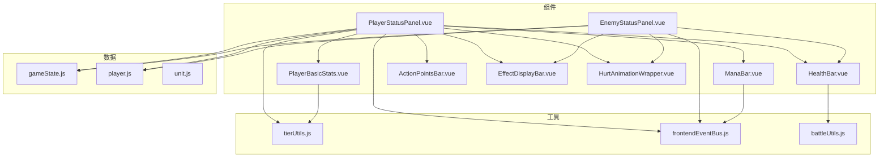
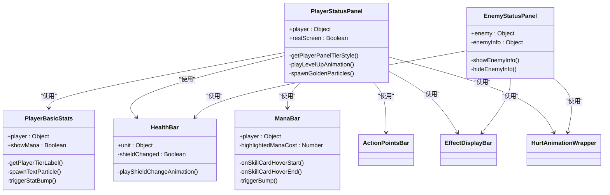
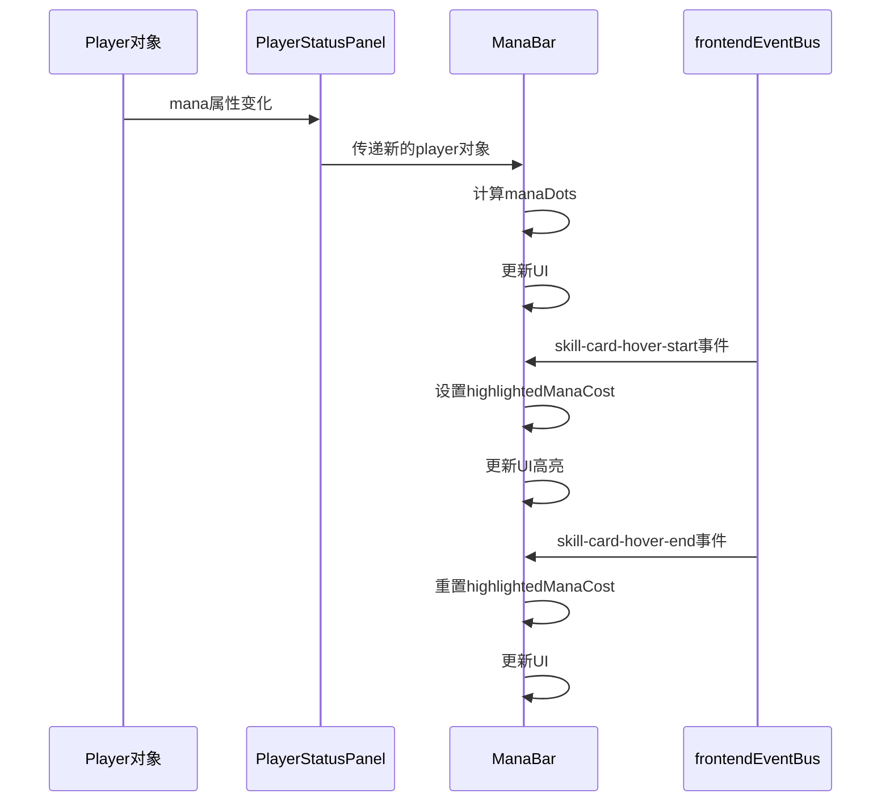
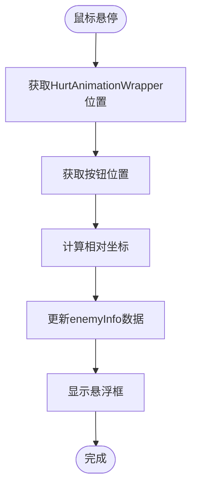
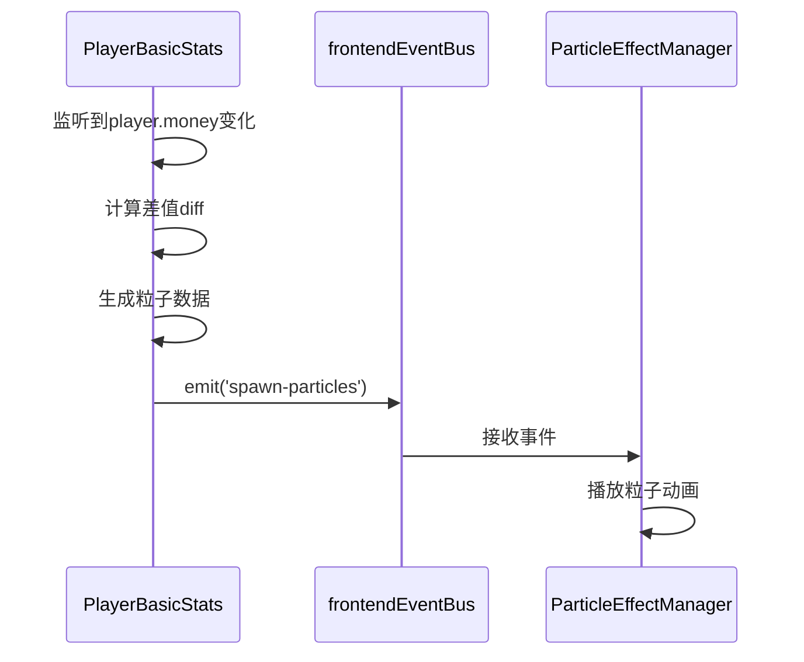
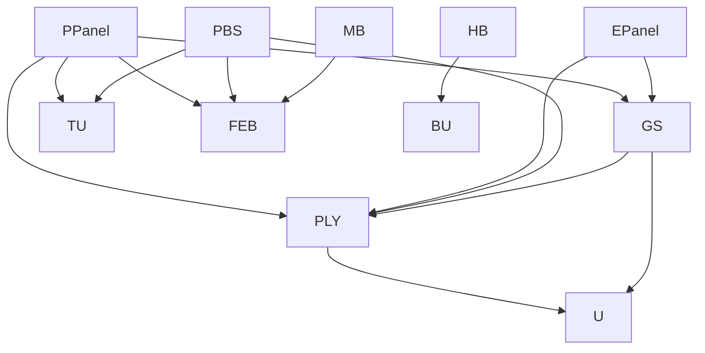

# 角色状态组件

<cite>
**本文档引用的文件**
- [PlayerStatusPanel.vue](file://src/components/global/PlayerStatusPanel.vue)
- [EnemyStatusPanel.vue](file://src/components/battle/EnemyStatusPanel.vue)
- [PlayerBasicStats.vue](file://src/components/global/PlayerBasicStats.vue)
- [HealthBar.vue](file://src/components/global/HealthBar.vue)
- [ManaBar.vue](file://src/components/global/ManaBar.vue)
- [ActionPointsBar.vue](file://src/components/global/ActionPointsBar.vue)
- [EffectDisplayBar.vue](file://src/components/global/EffectDisplayBar.vue)
- [HurtAnimationWrapper.vue](file://src/components/global/HurtAnimationWrapper.vue)
- [gameState.js](file://src/data/gameState.js)
- [player.js](file://src/data/player.js)
- [unit.js](file://src/data/unit.js)
- [tierUtils.js](file://src/utils/tierUtils.js)
- [frontendEventBus.js](file://src/frontendEventBus.js)
- [battleUtils.js](file://src/data/battleUtils.js)
</cite>

## 目录
1. [简介](#简介)
2. [项目结构](#项目结构)
3. [核心组件](#核心组件)
4. [架构概述](#架构概述)
5. [详细组件分析](#详细组件分析)
6. [依赖分析](#依赖分析)
7. [性能考虑](#性能考虑)
8. [故障排除指南](#故障排除指南)
9. [结论](#结论)

## 简介
本项目中的角色状态展示组件负责在游戏界面中动态渲染玩家和敌人的核心属性。`PlayerStatusPanel` 和 `EnemyStatusPanel` 组件基于 `gameState` 中的玩家与敌人数据，通过响应式机制监听生命值、等级、护甲等属性的变化。这些组件结合 `PlayerBasicStats` 展示基础属性，并通过事件驱动流程处理角色死亡、增益/减益叠加等复杂状态。组件设计注重复用性和性能优化，避免不必要的DOM重绘。

## 项目结构
项目结构清晰地划分了组件、数据和工具模块。核心状态组件位于 `src/components` 目录下，分为 `global` 和 `battle` 子目录。`PlayerStatusPanel.vue` 和 `EnemyStatusPanel.vue` 分别位于 `global` 和 `battle` 目录中。相关数据模型定义在 `src/data` 目录下的 `player.js` 和 `unit.js` 文件中。工具函数如等阶处理位于 `src/utils` 目录。这种结构有利于组件的复用和维护。

**Diagram sources**
- [PlayerStatusPanel.vue](file://src/components/global/PlayerStatusPanel.vue)
- [EnemyStatusPanel.vue](file://src/components/battle/EnemyStatusPanel.vue)
- [PlayerBasicStats.vue](file://src/components/global/PlayerBasicStats.vue)
- [HealthBar.vue](file://src/components/global/HealthBar.vue)
- [ManaBar.vue](file://src/components/global/ManaBar.vue)
- [ActionPointsBar.vue](file://src/components/global/ActionPointsBar.vue)
- [EffectDisplayBar.vue](file://src/components/global/EffectDisplayBar.vue)
- [HurtAnimationWrapper.vue](file://src/components/global/HurtAnimationWrapper.vue)
- [gameState.js](file://src/data/gameState.js)
- [player.js](file://src/data/player.js)
- [unit.js](file://src/data/unit.js)
- [tierUtils.js](file://src/utils/tierUtils.js)
- [frontendEventBus.js](file://src/frontendEventBus.js)
- [battleUtils.js](file://src/data/battleUtils.js)

**Section sources**
- [PlayerStatusPanel.vue](file://src/components/global/PlayerStatusPanel.vue)
- [EnemyStatusPanel.vue](file://src/components/battle/EnemyStatusPanel.vue)

## 核心组件
`PlayerStatusPanel` 和 `EnemyStatusPanel` 是角色状态展示的核心组件。它们通过 `props` 接收 `player` 或 `enemy` 对象作为数据源，这些对象源自 `gameState` 的响应式状态。组件内部使用 Vue 的 `watch` 机制监听关键属性的变化，如玩家的 `tier`（等级）和 `shield`（护盾）。当检测到变化时，组件会触发相应的UI更新或动画效果。`PlayerStatusPanel` 还通过 `restScreen` prop 区分战斗和休整界面的不同展示逻辑。

**Section sources**
- [PlayerStatusPanel.vue](file://src/components/global/PlayerStatusPanel.vue#L1-L215)
- [EnemyStatusPanel.vue](file://src/components/battle/EnemyStatusPanel.vue#L1-L325)

## 架构概述
角色状态组件采用分层架构，将UI展示与数据逻辑分离。顶层组件 `PlayerStatusPanel` 和 `EnemyStatusPanel` 负责整体布局和状态管理，它们组合多个子组件来展示不同属性。`PlayerBasicStats` 展示金钱、灵能、防御和等阶等基础信息。`HealthBar`、`ManaBar` 和 `ActionPointsBar` 分别展示生命值、魏启和行动点。`EffectDisplayBar` 负责渲染角色身上的增益/减益效果。这种组合式设计提高了组件的可维护性和复用性。

**Diagram sources**
- [PlayerStatusPanel.vue](file://src/components/global/PlayerStatusPanel.vue#L1-L215)
- [EnemyStatusPanel.vue](file://src/components/battle/EnemyStatusPanel.vue#L1-L325)
- [PlayerBasicStats.vue](file://src/components/global/PlayerBasicStats.vue#L1-L182)
- [HealthBar.vue](file://src/components/global/HealthBar.vue#L1-L100)
- [ManaBar.vue](file://src/components/global/ManaBar.vue#L1-L119)

## 详细组件分析

### PlayerStatusPanel 分析
`PlayerStatusPanel` 组件是玩家状态的核心展示区域。它通过 `props` 接收 `player` 对象，并在模板中组合多个子组件进行渲染。在休整界面 (`restScreen` 为 `true`) 时，面板会根据玩家的 `tier` 显示不同的样式，通过 `getPlayerPanelTierStyle` 方法动态计算边框和背景颜色。当玩家等级提升时，`watch` 监听器会触发 `playLevelUpAnimation` 方法，播放一个闪烁和粒子效果的升级动画。

#### 响应式机制
组件通过 Vue 的响应式系统自动更新UI。例如，`ManaBar` 组件通过计算属性 `manaDots` 动态生成魏启圆点，当 `player.mana` 或 `player.maxMana` 变化时，UI会自动重新渲染。`watch` 监听器用于触发更复杂的副作用，如动画播放。

**Diagram sources**
- [PlayerStatusPanel.vue](file://src/components/global/PlayerStatusPanel.vue#L1-L215)
- [ManaBar.vue](file://src/components/global/ManaBar.vue#L1-L119)
- [frontendEventBus.js](file://src/frontendEventBus.js#L1-L8)

**Section sources**
- [PlayerStatusPanel.vue](file://src/components/global/PlayerStatusPanel.vue#L1-L215)
- [ManaBar.vue](file://src/components/global/ManaBar.vue#L1-L119)

### EnemyStatusPanel 分析
`EnemyStatusPanel` 组件负责展示敌人的状态信息。它除了显示生命值和效果外，还包含一个信息悬浮框功能。当用户将鼠标悬停在“？”按钮上时，`showEnemyInfo` 方法会计算悬浮框的位置并显示敌人的详细描述、攻击力和防御力。位置计算考虑了 `HurtAnimationWrapper` 的相对位置，确保悬浮框正确显示。

#### 复杂状态处理
该组件处理了敌人信息的动态显示。`enemyInfo` 数据对象存储了悬浮框的显示状态和坐标。`showEnemyInfo` 方法通过 `getBoundingClientRect` 获取相关元素的绝对位置，并计算出相对于父容器的偏移量，从而精确定位悬浮框。

**Diagram sources**
- [EnemyStatusPanel.vue](file://src/components/battle/EnemyStatusPanel.vue#L1-L325)

**Section sources**
- [EnemyStatusPanel.vue](file://src/components/battle/EnemyStatusPanel.vue#L1-L325)

### PlayerBasicStats 分析
`PlayerBasicStats` 组件展示了玩家的基础属性，并实现了属性变化的视觉反馈。它通过 `watch` 深度监听 `player` 对象，当金钱、防御、灵能或等阶发生变化时，会触发浮动文字粒子和缩放动画。`spawnTextParticle` 方法通过 `frontendEventBus` 发送 `spawn-particles` 事件，由粒子系统统一处理动画播放。

#### 事件驱动流程
属性变化的处理完全基于事件驱动。`watch` 监听器检测到变化后，调用 `spawnTextParticle` 生成粒子数据，并通过事件总线广播。这实现了UI逻辑与动画逻辑的解耦，使得动画系统可以独立于状态组件进行管理。

**Diagram sources**
- [PlayerBasicStats.vue](file://src/components/global/PlayerBasicStats.vue#L1-L182)
- [frontendEventBus.js](file://src/frontendEventBus.js#L1-L8)

**Section sources**
- [PlayerBasicStats.vue](file://src/components/global/PlayerBasicStats.vue#L1-L182)

## 依赖分析
角色状态组件依赖于多个核心模块。数据模型 `player.js` 和 `unit.js` 定义了 `player` 和 `enemy` 对象的结构和行为。`gameState.js` 提供了全局的响应式状态管理。工具模块 `tierUtils.js` 提供了等阶相关的标签和颜色映射。`frontendEventBus.js` 作为事件总线，实现了组件间的松耦合通信。`battleUtils.js` 则提供了战斗相关的结算逻辑，虽然不直接被状态组件调用，但其修改的状态会触发UI更新。

**Diagram sources**
- [PlayerStatusPanel.vue](file://src/components/global/PlayerStatusPanel.vue)
- [EnemyStatusPanel.vue](file://src/components/battle/EnemyStatusPanel.vue)
- [PlayerBasicStats.vue](file://src/components/global/PlayerBasicStats.vue)
- [HealthBar.vue](file://src/components/global/HealthBar.vue)
- [ManaBar.vue](file://src/components/global/ManaBar.vue)
- [gameState.js](file://src/data/gameState.js)
- [player.js](file://src/data/player.js)
- [unit.js](file://src/data/unit.js)
- [tierUtils.js](file://src/utils/tierUtils.js)
- [frontendEventBus.js](file://src/frontendEventBus.js)
- [battleUtils.js](file://src/data/battleUtils.js)

**Section sources**
- [PlayerStatusPanel.vue](file://src/components/global/PlayerStatusPanel.vue)
- [EnemyStatusPanel.vue](file://src/components/battle/EnemyStatusPanel.vue)
- [PlayerBasicStats.vue](file://src/components/global/PlayerBasicStats.vue)
- [HealthBar.vue](file://src/components/global/HealthBar.vue)
- [ManaBar.vue](file://src/components/global/ManaBar.vue)
- [gameState.js](file://src/data/gameState.js)
- [player.js](file://src/data/player.js)
- [unit.js](file://src/data/unit.js)
- [tierUtils.js](file://src/utils/tierUtils.js)
- [frontendEventBus.js](file://src/frontendEventBus.js)
- [battleUtils.js](file://src/data/battleUtils.js)

## 性能考虑
组件在性能方面做了多项优化。首先，通过使用 `v-if` 和 `v-show` 控制子组件的渲染，避免在不需要时加载 `ActionPointsBar` 和 `ManaBar`。其次，`watch` 监听器使用了 `deep: true` 选项，但仅在必要时才进行深度监听。对于频繁变化的属性（如生命值），利用了CSS的 `transition` 属性实现平滑的宽度变化动画，避免了JavaScript的直接DOM操作。此外，`will-change: transform` CSS属性被用于关键元素，提示浏览器进行硬件加速。

## 故障排除指南
如果状态组件未能正确更新，首先检查 `gameState` 中的 `player` 或 `enemy` 对象是否被正确修改。确保修改是响应式的，直接替换对象可能不会触发更新。对于动画不播放的问题，检查 `frontendEventBus` 是否正确地监听和触发了事件。如果悬浮框位置错误，确认 `HurtAnimationWrapper` 的存在和位置计算逻辑。在性能敏感场景下，如果出现卡顿，可以检查是否有不必要的 `watch` 回调被频繁触发，或考虑对 `EffectDisplayBar` 的渲染进行节流。

**Section sources**
- [PlayerStatusPanel.vue](file://src/components/global/PlayerStatusPanel.vue)
- [EnemyStatusPanel.vue](file://src/components/battle/EnemyStatusPanel.vue)
- [frontendEventBus.js](file://src/frontendEventBus.js)

## 结论
`PlayerStatusPanel` 和 `EnemyStatusPanel` 组件通过响应式数据绑定和事件驱动机制，实现了角色状态的动态渲染。它们的设计体现了组件化和关注点分离的原则，通过组合多个专用子组件来构建复杂的UI。事件总线的使用确保了组件间的松耦合，有利于系统的扩展和维护。在性能方面，通过合理的DOM操作和CSS动画，保证了流畅的用户体验。这些组件为游戏提供了直观、生动的状态展示，是游戏界面的核心组成部分。