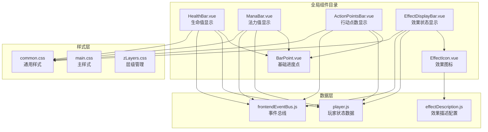
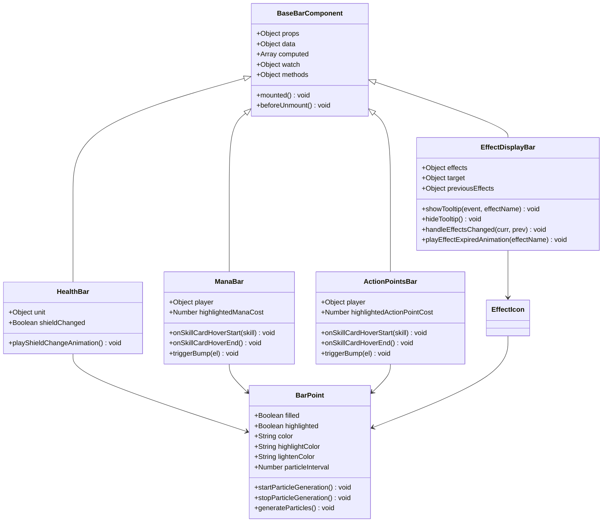
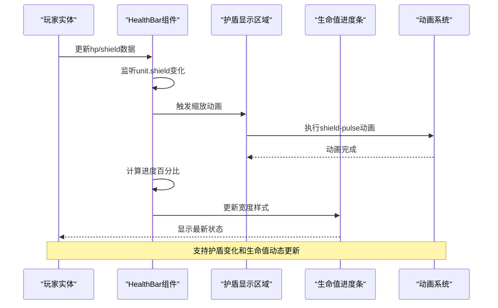
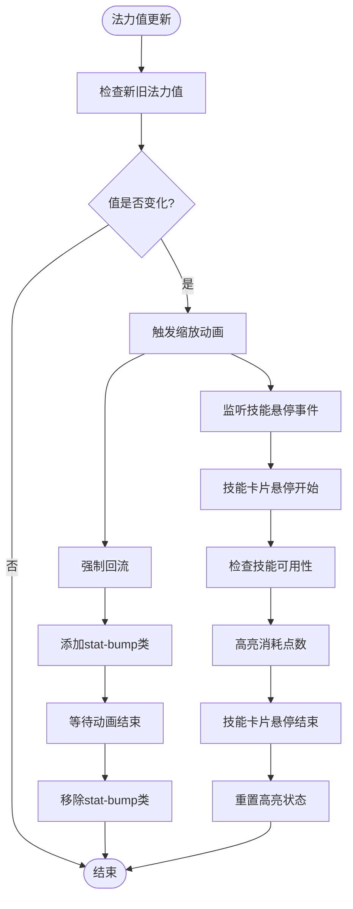
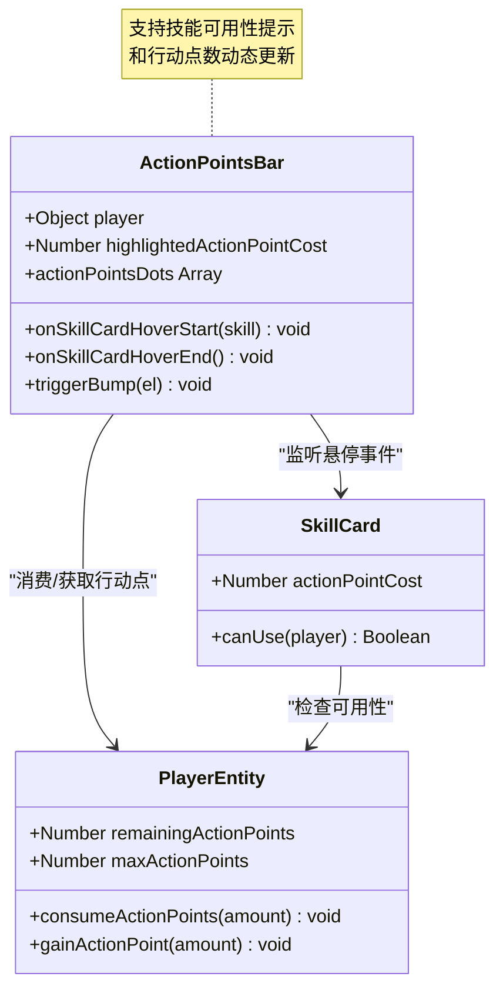
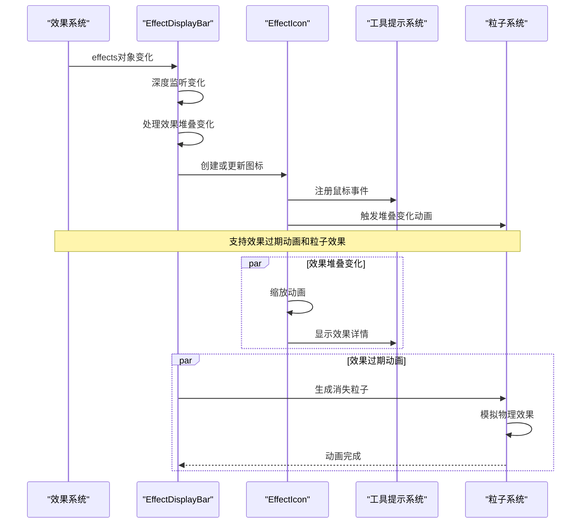
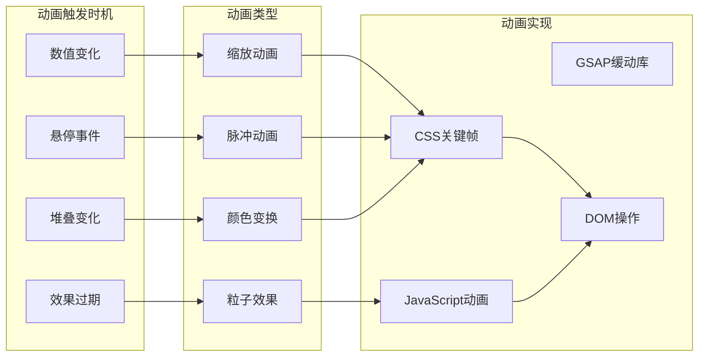
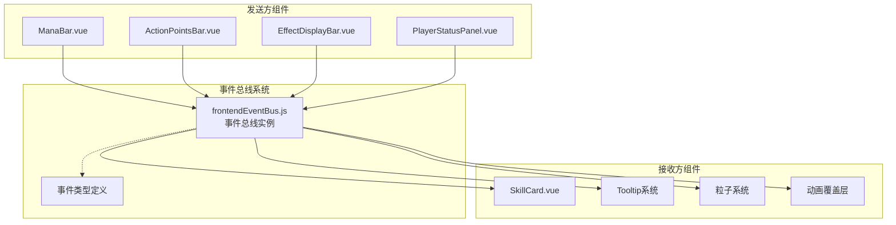
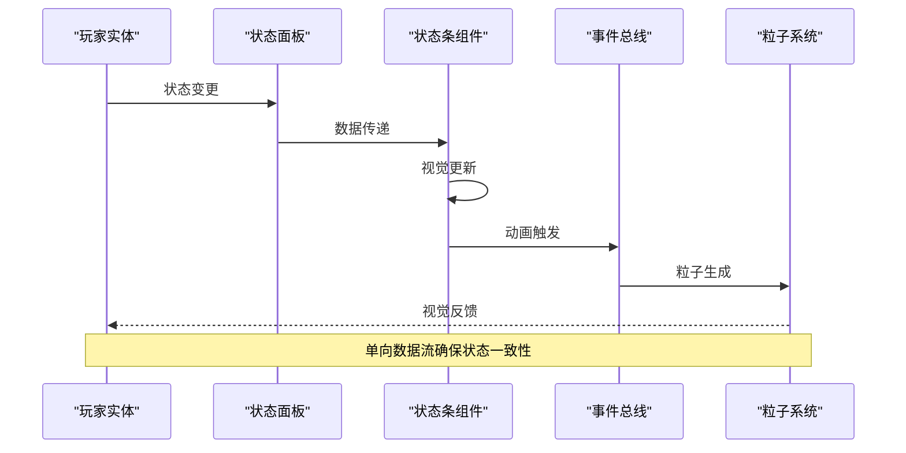

# 资源状态组件技术文档

<cite>
**本文档中引用的文件**
- [HealthBar.vue](file://src/components/global/HealthBar.vue)
- [ManaBar.vue](file://src/components/global/ManaBar.vue)
- [ActionPointsBar.vue](file://src/components/global/ActionPointsBar.vue)
- [EffectDisplayBar.vue](file://src/components/global/EffectDisplayBar.vue)
- [BarPoint.vue](file://src/components/global/BarPoint.vue)
- [EffectIcon.vue](file://src/components/global/EffectIcon.vue)
- [effectDescription.js](file://src/data/effectDescription.js)
- [frontendEventBus.js](file://src/frontendEventBus.js)
- [player.js](file://src/data/player.js)
- [PlayerStatusPanel.vue](file://src/components/global/PlayerStatusPanel.vue)
</cite>

## 目录
1. [简介](#简介)
2. [项目结构概览](#项目结构概览)
3. [核心组件架构](#核心组件架构)
4. [健康状态组件详解](#健康状态组件详解)
5. [法力状态组件详解](#法力状态组件详解)
6. [行动点数状态组件详解](#行动点数状态组件详解)
7. [效果显示状态组件详解](#效果显示状态组件详解)
8. [动画与交互机制](#动画与交互机制)
9. [事件总线与通信](#事件总线与通信)
10. [性能优化策略](#性能优化策略)
11. [故障排除指南](#故障排除指南)
12. [总结](#总结)

## 简介

资源状态组件是游戏界面中至关重要的可视化元素，负责实时展示玩家的各种状态信息。这些组件包括健康条（HealthBar）、法力条（ManaBar）、行动点数条（ActionPointsBar）以及效果显示条（EffectDisplayBar）。每个组件都采用Vue.js框架构建，具备响应式设计、动态动画和用户交互功能。

本系统的核心设计理念是通过直观的视觉反馈帮助玩家理解游戏状态，同时提供流畅的用户体验。组件间通过事件总线进行通信，确保状态变化能够及时反映在界面上。

## 项目结构概览

资源状态组件分布在项目的`src/components/global/`目录下，采用模块化设计：



**图表来源**
- [HealthBar.vue](file://src/components/global/HealthBar.vue#L1-L101)
- [ManaBar.vue](file://src/components/global/ManaBar.vue#L1-L120)
- [ActionPointsBar.vue](file://src/components/global/ActionPointsBar.vue#L1-L120)
- [EffectDisplayBar.vue](file://src/components/global/EffectDisplayBar.vue#L1-L154)

## 核心组件架构

资源状态组件采用统一的设计模式，每个组件都遵循以下架构原则：



**图表来源**
- [HealthBar.vue](file://src/components/global/HealthBar.vue#L10-L50)
- [ManaBar.vue](file://src/components/global/ManaBar.vue#L15-L60)
- [ActionPointsBar.vue](file://src/components/global/ActionPointsBar.vue#L15-L60)
- [EffectDisplayBar.vue](file://src/components/global/EffectDisplayBar.vue#L15-L70)
- [BarPoint.vue](file://src/components/global/BarPoint.vue#L10-L50)

## 健康状态组件详解

### HealthBar组件架构

HealthBar组件专门负责显示玩家的生命值状态，包含护盾显示和生命值进度条两个主要部分。



**图表来源**
- [HealthBar.vue](file://src/components/global/HealthBar.vue#L20-L35)
- [HealthBar.vue](file://src/components/global/HealthBar.vue#L40-L50)

### 关键特性分析

#### 护盾变化检测机制

HealthBar实现了智能的护盾变化检测，当护盾值发生变化时会自动触发缩放动画：

```javascript
// 护盾变化监听器
watch: {
  'unit.shield'(newShield, oldShield) {
    if (newShield !== oldShield) {
      this.playShieldChangeAnimation();
    }
  }
},
```

#### 容错处理机制

组件内置了完善的数值范围检查，确保即使接收到异常数据也能正常显示：

- **生命值范围限制**：`unit.hp`值被严格限制在`0`到`unit.maxHp`之间
- **护盾值处理**：护盾值变化时自动触发视觉反馈
- **样式适配**：根据单位类型（玩家/敌人）自动应用不同的颜色主题

#### 动画系统集成

HealthBar集成了完整的动画系统，支持多种视觉反馈：

```css
@keyframes shield-pulse {
  0% { transform: scale(1); }
  50% { transform: scale(1.2); }
  100% { transform: scale(1); }
}
```

**章节来源**
- [HealthBar.vue](file://src/components/global/HealthBar.vue#L1-L101)

## 法力状态组件详解

### ManaBar组件架构

ManaBar组件采用基于圆点的可视化方案，通过BarPoint组件实现法力值的精确显示。



**图表来源**
- [ManaBar.vue](file://src/components/global/ManaBar.vue#L80-L100)
- [ManaBar.vue](file://src/components/global/ManaBar.vue#L45-L70)

### 圆点计算算法

ManaBar使用精密的圆点计算算法来表示法力值：

```javascript
computed: {
  manaDots() {
    const dots = [];
    for (let i = 0; i < this.player.maxMana; i++) {
      const isFilled = i < this.player.mana;
      const isHighlighted = isFilled && i >= this.player.mana - this.highlightedManaCost;
      dots.push({
        filled: isFilled,
        highlighted: isHighlighted
      });
    }
    return dots;
  }
}
```

### 技能系统联动

ManaBar与技能系统深度集成，提供实时的技能可用性反馈：

#### 事件监听机制

```javascript
mounted() {
  frontendEventBus.on('skill-card-hover-start', this.onSkillCardHoverStart);
  frontendEventBus.on('skill-card-hover-end', this.onSkillCardHoverEnd);
}
```

#### 智能高亮系统

当玩家将鼠标悬停在技能卡片上时，ManaBar会智能地高亮显示该技能所需的法力消耗：

```javascript
onSkillCardHoverStart(skill) {
  const p = (this.player && typeof this.player.getModifiedPlayer === 'function') 
    ? this.player.getModifiedPlayer() : this.player;
  if(skill.canUse(p)) {
    this.highlightedManaCost = skill.manaCost;
  }
}
```

**章节来源**
- [ManaBar.vue](file://src/components/global/ManaBar.vue#L1-L120)

## 行动点数状态组件详解

### ActionPointsBar组件架构

ActionPointsBar组件与ManaBar类似，但专注于显示玩家的行动点数状态。



**图表来源**
- [ActionPointsBar.vue](file://src/components/global/ActionPointsBar.vue#L15-L60)

### 行动点数管理机制

ActionPointsBar实现了完整的行动点数生命周期管理：

#### 数值验证与限制

```javascript
consumeActionPoints (amount) {
  this.remainingActionPoints -= amount;
  this.remainingActionPoints = Math.max(this.remainingActionPoints, 0);
}
```

#### 动态圆点渲染

```javascript
computed: {
  actionPointsDots() {
    const dots = [];
    for (let i = 0; i < this.player.maxActionPoints; i++) {
      const isFilled = i < this.player.remainingActionPoints;
      const isHighlighted = isFilled && 
        i >= this.player.remainingActionPoints - this.highlightedActionPointCost;
      dots.push({
        filled: isFilled,
        highlighted: isHighlighted
      });
    }
    return dots;
  }
}
```

### 技能系统集成

ActionPointsBar与技能系统建立了紧密的协作关系：

#### 实时可用性检查

当玩家尝试使用技能时，系统会实时检查行动点数是否足够：

```javascript
onSkillCardHoverStart(skill) {
  const p = (this.player && typeof this.player.getModifiedPlayer === 'function') 
    ? this.player.getModifiedPlayer() : this.player;
  if(skill.canUse(p)) {
    this.highlightedActionPointCost = skill.actionPointCost;
  }
}
```

#### 用户体验优化

- **即时反馈**：当技能不可用时立即停止高亮
- **视觉提示**：高亮显示所需行动点数
- **动画效果**：平滑的动画过渡提升用户体验

**章节来源**
- [ActionPointsBar.vue](file://src/components/global/ActionPointsBar.vue#L1-L120)
- [player.js](file://src/data/player.js#L180-L200)

## 效果显示状态组件详解

### EffectDisplayBar组件架构

EffectDisplayBar是最复杂的组件之一，负责显示玩家的所有状态效果，包括增益、减益和中立效果。



**图表来源**
- [EffectDisplayBar.vue](file://src/components/global/EffectDisplayBar.vue#L30-L60)
- [EffectDisplayBar.vue](file://src/components/global/EffectDisplayBar.vue#L80-L120)

### 效果图标系统

EffectDisplayBar使用EffectIcon组件来渲染单个效果图标：

#### 图标渲染机制

```javascript
<EffectIcon
  v-if="value !== 0" 
  :effect-name="key"
  :stack="value"
  :preview-mode="false"
  @mouseenter="showTooltip($event, key)"
  @mouseleave="hideTooltip()"
/>
```

#### 效果描述集成

系统从`effectDescription.js`中获取效果的详细信息：

```javascript
const effectInfo = effectDescriptions[effectName] || {};
const effectColor = effectInfo.color || '#000000';
const effectIcon = effectInfo.icon || '❓';
```

### 效果过期动画系统

EffectDisplayBar实现了独特的效果过期动画，通过粒子系统模拟效果消失的视觉效果：

```javascript
playEffectExpiredAnimation(effectName) {
  // 获取效果信息
  const effectInfo = effectDescriptions[effectName] || {};
  const effectColor = effectInfo.color || '#000000';
  const effectIcon = effectInfo.icon || '❓';
  
  // 创建效果过期粒子
  const particles = [{
    absoluteX: centerX,
    absoluteY: centerY,
    vx: (Math.random() - 0.5) * 30,
    vy: -50,
    gravity: 50,
    life: 1500,
    text: `${effectIcon} 消失`,
    extraStyles: {
      color: effectColor,
      fontWeight: 'bold',
      fontSize: '16px',
      textShadow: '0 0 3px rgba(0, 0, 0, 0.5)',
      fontFamily: 'Arial, sans-serif',
      userSelect: 'none',
      pointerEvents: 'none',
      zIndex: '20'
    }
  }];
  
  frontendEventBus.emit('spawn-particles', particles);
}
```

### 堆叠变化检测

EffectDisplayBar实现了智能的堆叠变化检测机制：

```javascript
handleEffectsChanged(curr, prev) {
  const prevKeys = Object.keys(prev || {});
  for (const effectName of prevKeys) {
    const previousStacks = prev[effectName] || 0;
    const currStacks = (curr && curr[effectName]) || 0;
    if (previousStacks > 0 && currStacks === 0) {
      this.playEffectExpiredAnimation(effectName);
    }
  }
}
```

**章节来源**
- [EffectDisplayBar.vue](file://src/components/global/EffectDisplayBar.vue#L1-L154)
- [EffectIcon.vue](file://src/components/global/EffectIcon.vue#L1-L116)

## 动画与交互机制

### 统一动画系统

所有状态组件都采用了统一的动画系统设计，确保视觉体验的一致性：



### 缩放动画实现

大多数组件都实现了缩放动画来增强用户交互体验：

```javascript
// 触发缩放动画的核心方法
triggerBump(el) {
  if (!el) return;
  el.classList.remove('stat-bump');
  // 强制回流以重启动画
  // eslint-disable-next-line no-unused-expressions
  el.offsetWidth;
  el.classList.add('stat-bump');
  const onEnd = () => {
    el.classList.remove('stat-bump');
    el.removeEventListener('animationend', onEnd);
  };
  el.addEventListener('animationend', onEnd);
}
```

### 粒子系统集成

EffectDisplayBar集成了高级的粒子系统来模拟效果消失的物理效果：

#### 粒子生成算法

```javascript
generateParticles() {
  const rect = this.$el.getBoundingClientRect();
  const centerX = rect.left + rect.width / 2;
  const centerY = rect.top + rect.height / 2;
  
  const particles = [];
  for (let i = 0; i < 3; i++) {
    particles.push({
      x: centerX + (Math.random() - 0.5) * 20,
      y: centerY + (Math.random() - 0.5) * 20,
      vx: (Math.random() - 0.5) * 50,
      vy: (Math.random() - 0.5) * 50 - 25,
      color: this.highlightColor,
      life: 1000,
      gravity: 100,
      size: 2 + Math.random() * 1
    });
  }
  
  frontendEventBus.emit('spawn-particles', particles);
}
```

**章节来源**
- [ManaBar.vue](file://src/components/global/ManaBar.vue#L70-L90)
- [ActionPointsBar.vue](file://src/components/global/ActionPointsBar.vue#L70-L90)
- [EffectDisplayBar.vue](file://src/components/global/EffectDisplayBar.vue#L100-L140)

## 事件总线与通信

### 前端事件总线架构

系统采用事件总线模式实现组件间的松耦合通信：



**图表来源**
- [frontendEventBus.js](file://src/frontendEventBus.js#L1-L9)

### 事件类型与处理

#### 技能悬停事件

```javascript
// 发送技能悬停开始事件
frontendEventBus.emit('skill-card-hover-start', skill);

// 发送技能悬停结束事件
frontendEventBus.emit('skill-card-hover-end');

// 接收事件并处理
frontendEventBus.on('skill-card-hover-start', this.onSkillCardHoverStart);
frontendEventBus.on('skill-card-hover-end', this.onSkillCardHoverEnd);
```

#### 工具提示事件

```javascript
// 显示工具提示
frontendEventBus.emit('tooltip:show', {
  name: this.effectDisplayName,
  text: this.effectDescription,
  color: this.effectColor,
  x: event.clientX,
  y: event.clientY
});

// 隐藏工具提示
frontendEventBus.emit('tooltip:hide');
```

#### 粒子系统事件

```javascript
// 生成粒子效果
frontendEventBus.emit('spawn-particles', particles);
```

### 组件通信模式

#### 单向数据流

系统采用单向数据流模式，确保状态管理的可预测性：



**图表来源**
- [PlayerStatusPanel.vue](file://src/components/global/PlayerStatusPanel.vue#L1-L40)

**章节来源**
- [frontendEventBus.js](file://src/frontendEventBus.js#L1-L9)
- [ManaBar.vue](file://src/components/global/ManaBar.vue#L45-L70)
- [EffectDisplayBar.vue](file://src/components/global/EffectDisplayBar.vue#L120-L140)

## 性能优化策略

### 渲染性能优化

#### 虚拟化技术

对于大量效果显示的情况，系统采用了虚拟化技术：

```javascript
// 智能渲染，只渲染非零效果
<div v-for="(value, key) in effects" :key="key">
  <EffectIcon
    v-if="value !== 0" 
    :effect-name="key"
    :stack="value"
    :preview-mode="false"
  />
</div>
```

#### 计算属性缓存

所有复杂的计算都通过计算属性实现缓存：

```javascript
computed: {
  manaDots() {
    // 计算结果会被Vue缓存，直到依赖变化
    const dots = [];
    for (let i = 0; i < this.player.maxMana; i++) {
      // ... 计算逻辑
    }
    return dots;
  }
}
```

### 内存管理优化

#### 事件监听器清理

所有组件都实现了正确的事件监听器清理：

```javascript
mounted() {
  frontendEventBus.on('skill-card-hover-start', this.onSkillCardHoverStart);
  frontendEventBus.on('skill-card-hover-end', this.onSkillCardHoverEnd);
},
beforeUnmount() {
  frontendEventBus.off('skill-card-hover-start', this.onSkillCardHoverStart);
  frontendEventBus.off('skill-card-hover-end', this.onSkillCardHoverEnd);
}
```

#### 定时器管理

BarPoint组件正确管理粒子生成定时器：

```javascript
watch: {
  highlighted(newVal) {
    if (newVal) {
      this.startParticleGeneration();
    } else {
      this.stopParticleGeneration();
    }
  }
},
beforeUnmount() {
  this.stopParticleGeneration();
}
```

### 动画性能优化

#### GPU加速

所有动画都使用CSS transforms实现GPU加速：

```css
.will-change {
  will-change: transform;
}

.stat-bump {
  animation: bump 0.3s ease-out;
}

@keyframes bump {
  0% { transform: scale(1); }
  50% { transform: scale(1.1); }
  100% { transform: scale(1); }
}
```

#### 防抖处理

对于频繁的状态更新，系统实现了防抖处理：

```javascript
watch: {
  'player.mana'(nv, ov) {
    if (nv !== ov) this.$nextTick(() => this.triggerBump(this.$refs.manaText));
  }
}
```

**章节来源**
- [EffectDisplayBar.vue](file://src/components/global/EffectDisplayBar.vue#L1-L20)
- [ManaBar.vue](file://src/components/global/ManaBar.vue#L80-L90)
- [BarPoint.vue](file://src/components/global/BarPoint.vue#L40-L60)

## 故障排除指南

### 常见问题诊断

#### 组件不显示或显示异常

**症状**：状态条不显示或显示不完整

**可能原因**：
1. 父组件未正确传递props
2. CSS样式冲突
3. JavaScript错误阻止组件初始化

**解决方案**：
```javascript
// 检查props有效性
props: {
  player: {
    type: Object,
    required: true,
    validator: (value) => {
      return value && typeof value === 'object' && 
             'mana' in value && 'maxMana' in value;
    }
  }
}
```

#### 动画不工作

**症状**：状态变化时没有动画效果

**可能原因**：
1. CSS动画规则缺失
2. JavaScript动画代码错误
3. 浏览器兼容性问题

**解决方案**：
```javascript
// 添加浏览器兼容性检查
triggerBump(el) {
  if (!el || !window.requestAnimationFrame) return;
  
  // 检查动画支持
  const supported = window.CSS && CSS.supports('animation-duration', '0.3s');
  if (!supported) return;
  
  // 执行动画
  // ...
}
```

#### 事件总线通信失败

**症状**：组件间通信失效

**可能原因**：
1. 事件监听器未正确注册
2. 组件生命周期问题
3. 事件名称拼写错误

**解决方案**：
```javascript
// 添加事件监听器调试
mounted() {
  console.log('组件已挂载，开始监听事件');
  frontendEventBus.on('skill-card-hover-start', this.onSkillCardHoverStart);
  frontendEventBus.on('skill-card-hover-end', this.onSkillCardHoverEnd);
},
beforeUnmount() {
  console.log('组件即将卸载，清理事件监听器');
  frontendEventBus.off('skill-card-hover-start', this.onSkillCardHoverStart);
  frontendEventBus.off('skill-card-hover-end', this.onSkillCardHoverEnd);
}
```

### 性能问题排查

#### 渲染性能问题

**症状**：界面卡顿或响应缓慢

**诊断步骤**：
1. 使用浏览器开发者工具检查渲染时间
2. 分析组件树复杂度
3. 检查是否有不必要的重新渲染

**优化建议**：
```javascript
// 使用shouldComponentUpdate优化
shouldComponentUpdate(nextProps, nextState) {
  // 只在必要时重新渲染
  return nextProps.player !== this.props.player ||
         nextState.highlightedManaCost !== this.state.highlightedManaCost;
}
```

#### 内存泄漏问题

**症状**：长时间使用后内存占用持续增长

**诊断步骤**：
1. 使用Chrome DevTools Memory面板
2. 检查事件监听器是否正确清理
3. 分析定时器和异步操作

**预防措施**：
```javascript
// 确保所有资源都被正确清理
beforeDestroy() {
  // 清理定时器
  if (this.particleInterval) {
    clearInterval(this.particleInterval);
  }
  
  // 清理事件监听器
  frontendEventBus.off('skill-card-hover-start', this.onSkillCardHoverStart);
  frontendEventBus.off('skill-card-hover-end', this.onSkillCardHoverEnd);
  
  // 清理动画回调
  const elements = this.$el.querySelectorAll('.animated-element');
  elements.forEach(el => {
    el.removeEventListener('animationend', this.animationCallback);
  });
}
```

**章节来源**
- [ManaBar.vue](file://src/components/global/ManaBar.vue#L45-L70)
- [BarPoint.vue](file://src/components/global/BarPoint.vue#L40-L60)

## 总结

资源状态组件系统展现了现代Web游戏开发中的最佳实践，通过模块化设计、事件驱动架构和高性能动画系统，为玩家提供了直观且富有表现力的游戏状态可视化。

### 核心优势

1. **模块化架构**：每个组件职责单一，易于维护和扩展
2. **事件驱动通信**：通过事件总线实现松耦合的组件间通信
3. **高性能动画**：利用CSS transforms和GPU加速确保流畅体验
4. **智能容错**：完善的数值验证和边界条件处理
5. **用户体验优化**：丰富的视觉反馈和交互提示

### 技术亮点

- **统一的动画系统**：所有组件共享相同的动画模式和性能优化策略
- **智能事件处理**：基于Vue.js的响应式系统和事件总线的完美结合
- **粒子效果集成**：高级的物理模拟粒子效果增强视觉表现
- **实时状态同步**：通过watchers和计算属性实现实时状态更新

### 应用价值

这套资源状态组件不仅适用于当前的游戏项目，其设计理念和实现方式也为其他类似项目提供了宝贵的参考。通过合理的架构设计和性能优化，系统能够在保证功能完整性的同时提供卓越的用户体验。

未来的改进方向可以考虑：
- 进一步优化大型效果列表的渲染性能
- 增加更多的自定义动画选项
- 实现跨平台的动画一致性
- 加强无障碍访问支持