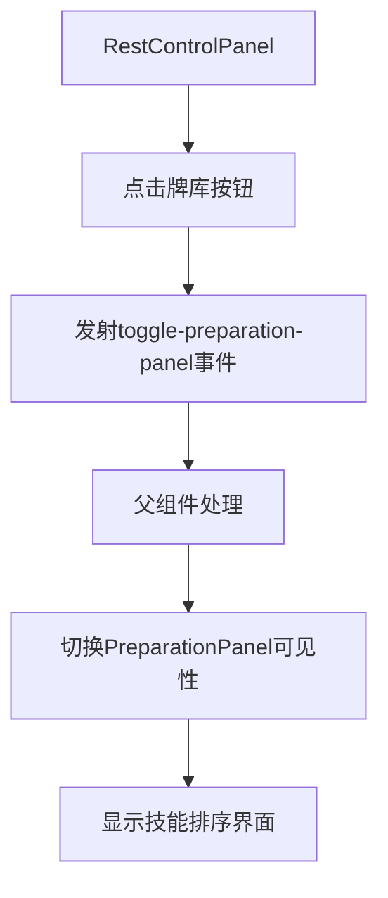
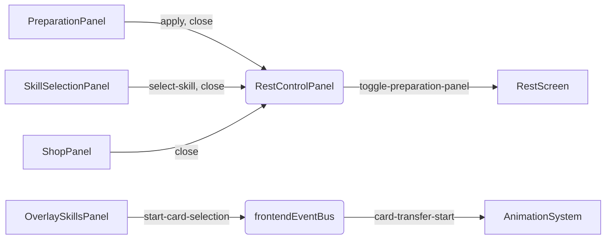

# 交互控制模块组件

<cite>
**本文档引用的文件**
- [PreparationPanel.vue](file://src/components/rest/PreparationPanel.vue)
- [SkillSelectionPanel.vue](file://src/components/rest/SkillSelectionPanel.vue)
- [OverlaySkillsPanel.vue](file://src/components/battle/OverlaySkillsPanel.vue)
- [ShopPanel.vue](file://src/components/rest/ShopPanel.vue)
- [RestControlPanel.vue](file://src/components/rest/RestControlPanel.vue)
- [frontendEventBus.js](file://src/frontendEventBus.js)
- [backendEventBus.js](file://src/backendEventBus.js)
- [skillManager.js](file://src/data/skillManager.js)
</cite>

## 目录
1. [简介](#简介)
2. [休整阶段核心控制逻辑](#休整阶段核心控制逻辑)
3. [技能选择与升级机制](#技能选择与升级机制)
4. [技能预览交互设计](#技能预览交互设计)
5. [商店系统与货币集成](#商店系统与货币集成)
6. [休整流程整体控制](#休整流程整体控制)
7. [前端事件通信机制](#前端事件通信机制)
8. [常见交互问题与调试技巧](#常见交互问题与调试技巧)

## 简介
本文档系统性地解析游戏休整阶段的交互控制模块组件工作机制。重点分析`PreparationPanel.vue`在休整阶段对技能排序的控制逻辑，`SkillSelectionPanel.vue`如何与`skillManager`协作生成随机技能池并处理选择状态，`OverlaySkillsPanel.vue`实现技能预览的交互设计，`ShopPanel.vue`的货币系统集成与购买逻辑，以及`RestControlPanel.vue`对整体流程的控制。同时涵盖事件总线（`frontendEventBus`）在这些组件间的通信模式，并提供常见交互问题的解决方案。

## 休整阶段核心控制逻辑

`PreparationPanel.vue`组件实现了休整阶段的技能管理界面，允许玩家通过拖拽调整技能出场顺序。该组件接收外部传入的技能列表和可见性状态，维护一个内部技能副本以避免直接修改原始数据。

当玩家拖拽技能进行重排时，组件通过`onReorder`方法处理重排请求，使用数组切片和拼接操作完成技能位置调整。最终通过`applyAndClosePanel`方法将变更后的技能顺序通过事件发射器提交给父组件，并关闭面板。

该组件通过`watch`监听器深度监听外部技能列表变化，确保内部状态与外部数据同步。过渡动画使用Vue内置的`transition`组件实现淡入淡出效果，提升用户体验。

**Section sources**
- [PreparationPanel.vue](file://src/components/rest/PreparationPanel.vue#L1-L117)

## 技能选择与升级机制

`SkillSelectionPanel.vue`组件负责处理技能槽位选择的交互逻辑。该组件显示一个待替换技能的预览和当前技能列表，允许玩家选择一个现有技能进行替换。

组件通过`selectSkill`方法处理技能选择事件，根据技能的唯一ID在技能列表中查找对应索引，并通过`select-skill`事件将索引传递给父组件。面板关闭通过`closePanel`方法实现，触发`close`事件通知外部组件。

技能池的生成由`skillManager.js`中的`getRandomSkills`方法实现。该方法根据玩家当前等级、已拥有技能、灵脉属性等多维度因素计算每个技能的出现权重。系统首先过滤出符合条件的基础技能，然后通过前置技能（precessor）机制识别可升级的技能作为候选，合并到可用技能池中。

权重计算考虑了多个因素：技能等级与玩家等级的差异、玩家灵脉属性匹配度、高质量奖励的特殊加成等。升级候选技能会获得额外的权重加成，提高其出现概率。最终通过带权重的不放回抽样算法从技能池中选择指定数量的技能。

**Section sources**
- [SkillSelectionPanel.vue](file://src/components/rest/SkillSelectionPanel.vue#L1-L144)
- [skillManager.js](file://src/data/skillManager.js#L61-L253)

## 技能预览交互设计

`OverlaySkillsPanel.vue`组件实现了复杂的技能预览和选择交互功能。该组件支持两种模式：普通展示模式和选择模式。选择模式可由外部控制或内部动画指令触发。

在选择模式下，组件显示半透明遮罩层阻止其他交互，每个技能卡槽显示选择指示器，底部提供确认和清除按钮。用户点击技能时，组件通过`onSkillClick`方法处理选择逻辑，维护一个按选择顺序存储的ID列表。

组件通过`computed`属性动态计算有效最大可选数量，支持无限选择（∞）的特殊情况。确认选择时，通过`backendEventBus`发射`CONFIRM_OVERLAY_SKILL_SELECTIONS`事件将选择结果传递给后端进行结算。

交互设计亮点包括：
- 使用`cardDomRegistry`注册每个技能卡的DOM元素，便于动画系统引用
- 实现技能移除时的视觉反馈（亮度降低）
- 支持外部事件驱动的选择模式启动（`start-card-selection`事件）
- 完善的生命周期管理，包括事件监听器的注册与注销

**Section sources**
- [OverlaySkillsPanel.vue](file://src/components/battle/OverlaySkillsPanel.vue#L1-L273)

## 商店系统与货币集成

`ShopPanel.vue`组件实现了商店界面的展示和购买逻辑。该组件接收商店商品列表和游戏状态作为属性，动态渲染商品信息。

每个商品显示其名称、描述、价格和购买按钮。价格颜色根据玩家当前金钱是否足够动态变化（足够为橙色，不足为红色）。购买按钮的禁用状态也根据金钱条件自动控制。

购买逻辑通过`onBuy`方法实现，该方法不直接修改游戏状态，而是通过`backendEventBus`发射`PURCHASE_ITEM`事件将购买请求传递给后端系统。这种设计实现了前后端关注点分离，确保游戏逻辑的统一性和可维护性。

商品样式根据等级（tier）应用不同的背景色和边框色，提供视觉层次。组件使用`tierUtils.js`中的`getItemTierLabel`函数获取等级标签文本，确保标签显示的一致性。

**Section sources**
- [ShopPanel.vue](file://src/components/rest/ShopPanel.vue#L1-L220)

## 休整流程整体控制

`RestControlPanel.vue`组件作为休整阶段的主要控制中心，提供操作入口并协调其他组件。当前版本主要包含"牌库"按钮，用于切换`PreparationPanel`的可见性。

组件在挂载时注册`rest-deck-bump`事件监听器，当收到该事件时播放按钮缩放动画，提供视觉反馈。同时，将"牌库"按钮的DOM元素注册到`cardAnimationOrchestrator`中，作为动画系统的锚点目标，实现技能卡飞入牌库的动画效果。

组件通过`emits`声明`toggle-preparation-panel`事件，当用户点击按钮时触发该事件，由父组件处理面板切换逻辑。这种设计实现了组件间的松耦合，提高了代码的可复用性和可测试性。



**Diagram sources**
- [RestControlPanel.vue](file://src/components/rest/RestControlPanel.vue#L1-L94)

## 前端事件通信机制

系统采用事件总线模式实现组件间的松耦合通信。前端事件总线（`frontendEventBus.js`）基于`mitt`库实现，负责在前端组件之间传递UI相关事件，如动画控制和状态更新。

`frontendEventBus`主要用于：
- 播放动画效果（如`rest-deck-bump`）
- 启动选择模式（`start-card-selection`）
- 卡牌转移状态通知（`card-transfer-start`, `card-transfer-end`）

后端事件总线（`backendEventBus.js`）则负责游戏核心逻辑的事件传递，如玩家操作、战斗结算等。两个事件总线分工明确，`frontendEventBus`不涉及具体游戏结算逻辑，仅用于UI控制。

组件通过`on`方法订阅事件，通过`emit`方法发射事件。在组件销毁前必须通过`off`方法取消订阅，避免内存泄漏。这种模式实现了组件间的解耦，使系统更易于维护和扩展。



**Diagram sources**
- [frontendEventBus.js](file://src/frontendEventBus.js#L1-L9)
- [backendEventBus.js](file://src/backendEventBus.js#L1-L80)

## 常见交互问题与调试技巧

### 按钮无响应问题
**可能原因**：
- 事件监听器未正确注册或已注销
- 父组件未处理发射的事件
- DOM元素未正确渲染或被遮挡

**调试技巧**：
1. 在事件处理方法中添加`console.log`验证方法是否被调用
2. 检查组件生命周期，确保事件监听器在`mounted`阶段正确注册
3. 使用浏览器开发者工具检查元素事件监听器

### 选择状态丢失问题
**可能原因**：
- 组件重新渲染导致内部状态重置
- 外部属性变化覆盖了内部状态
- 事件总线通信失败

**调试技巧**：
1. 检查`watch`监听器是否正确处理外部属性变化
2. 验证选择状态是否在组件销毁前正确保存
3. 使用`frontendEventBus`的`on`方法监听相关事件，确认事件是否正常发射

### 事件监听调试通用技巧
1. **事件监听验证**：在事件回调函数中添加日志输出，确认事件是否被正确触发
```javascript
frontendEventBus.on('event-name', (payload) => {
  console.log('Event received:', payload);
  // 处理逻辑
});
```

2. **生命周期检查**：确保在`beforeUnmount`钩子中正确移除事件监听器，避免内存泄漏

3. **事件冒泡分析**：使用`@click.self`修饰符确保点击事件仅在目标元素本身触发，防止事件冒泡干扰

4. **异步更新调试**：对于涉及`$nextTick`的操作，使用回调函数验证DOM更新完成后的状态

**Section sources**
- [frontendEventBus.js](file://src/frontendEventBus.js#L1-L9)
- [backendEventBus.js](file://src/backendEventBus.js#L1-L80)
- [OverlaySkillsPanel.vue](file://src/components/battle/OverlaySkillsPanel.vue#L1-L273)