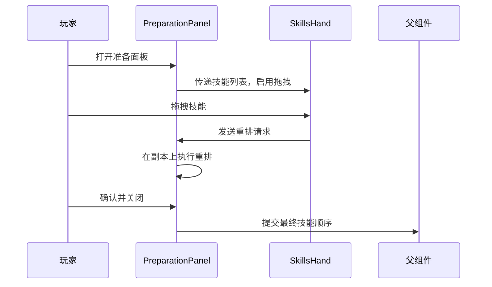
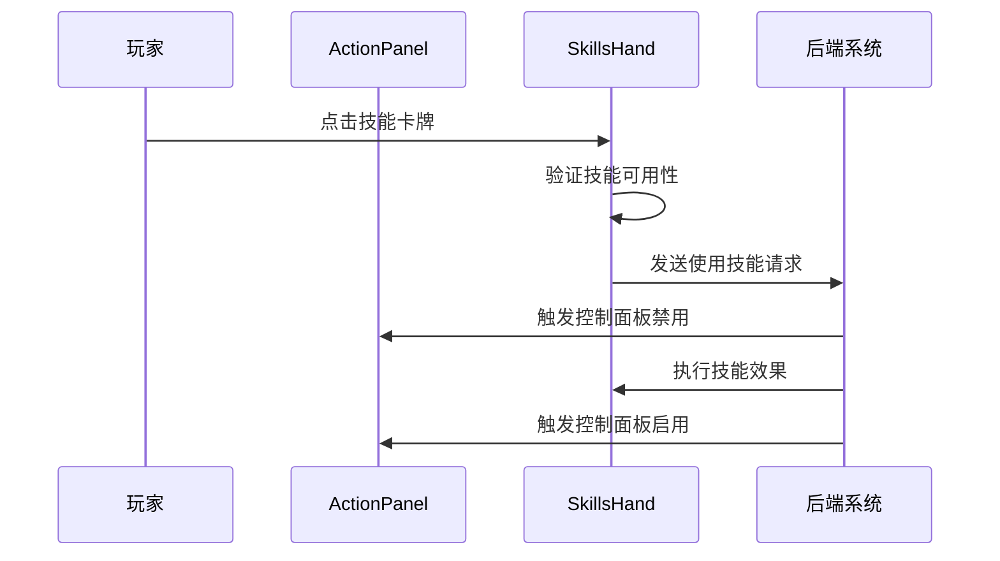
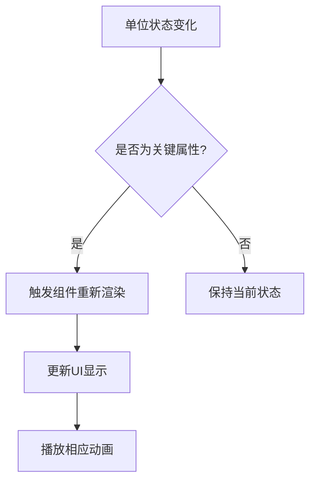
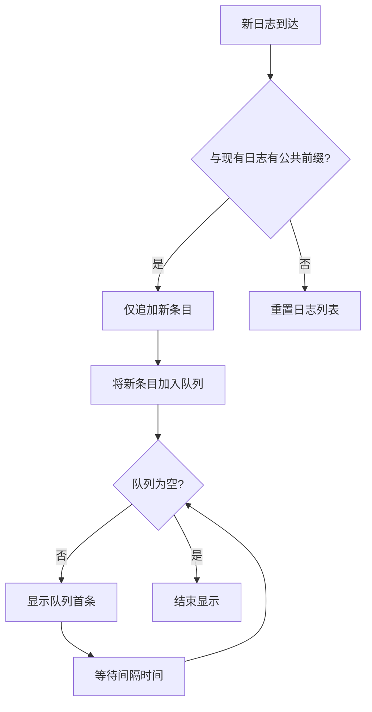
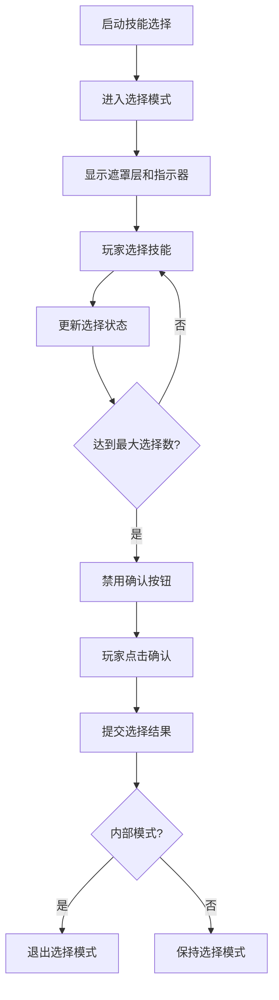

# 功能模块层组件

<cite>
**本文档引用的文件**
- [SkillsHand.vue](file://src/components/battle/SkillsHand.vue)
- [ActionPanel.vue](file://src/components/battle/ActionPanel.vue)
- [EnemyStatusPanel.vue](file://src/components/battle/EnemyStatusPanel.vue)
- [PlayerStatusPanel.vue](file://src/components/global/PlayerStatusPanel.vue)
- [BattleLogPanel.vue](file://src/components/battle/BattleLogPanel.vue)
- [PreparationPanel.vue](file://src/components/rest/PreparationPanel.vue)
- [SkillSelectionPanel.vue](file://src/components/rest/SkillSelectionPanel.vue)
- [OverlaySkillsPanel.vue](file://src/components/battle/OverlaySkillsPanel.vue)
- [player.js](file://src/data/player.js)
- [unit.js](file://src/data/unit.js)
</cite>

## 目录
1. [引言](#引言)
2. [核心组件分析](#核心组件分析)
3. [组件协作机制](#组件协作机制)
4. [状态同步与数据流](#状态同步与数据流)
5. [用户交互流程](#用户交互流程)
6. [结论](#结论)

## 引言
本项目是一个回合制战斗游戏系统，其功能模块层组件主要负责玩家与敌人状态的展示、技能管理、战斗日志记录以及休整阶段的技能选择等核心功能。系统采用Vue.js框架构建，通过组件化设计实现了高内聚低耦合的架构。各组件通过事件总线（frontendEventBus/backendEventBus）进行通信，确保了前后端状态的一致性。本文将深入分析关键组件的设计与实现，重点阐述SkillsHand.vue如何管理玩家手牌的渲染与交互逻辑，ActionPanel.vue如何处理行动点分配与技能激活，以及各状态面板如何同步单位状态数据并实时更新UI。

## 核心组件分析

### SkillsHand.vue：手牌管理与交互逻辑
SkillsHand.vue组件负责管理玩家手牌的渲染与交互逻辑。该组件通过`visibleSkills`计算属性从玩家对象中获取当前可用的技能列表，并根据容器宽度和卡牌数量动态计算每张卡牌的位置、缩放和层级，实现了流畅的布局效果。组件支持两种模式：战斗时的技能使用模式和休整时的拖拽重排模式。

在交互方面，组件实现了鼠标悬停时的视觉反馈（放大效果）和拖拽重排功能。当`draggable`属性为true时（休整阶段），玩家可以通过拖拽调整手牌顺序。拖拽过程中，组件会实时计算插入位置，并通过`wrapperStyle`方法动态更新被拖拽卡牌的位置和样式。组件还通过`card-transfer-end`事件监听卡牌入场动画的完成，确保卡牌在动画结束后才显示，提升了用户体验。

**组件源码**
- [SkillsHand.vue](file://src/components/battle/SkillsHand.vue#L1-L395)

### ActionPanel.vue：行动点分配与技能激活
ActionPanel.vue组件是战斗阶段的核心控制面板，集成了技能使用、行动点管理和特殊操作等功能。该组件通过嵌套SkillsHand.vue组件来展示玩家当前可用的技能，并根据玩家的行动点和法力值状态动态启用或禁用技能。

组件中的`ActivatedSkillsBar`用于显示当前激活的咏唱型技能，`DeckIcon`和`BurntSkillsIcon`则分别提供了查看牌库和坟地的入口。换卡按钮的实现尤为精巧：通过`canShiftSkill`计算属性判断玩家是否满足换卡条件（手牌非空且行动点足够），并动态显示当前换卡所需的行动点消耗。点击换卡按钮会触发`PLAYER_SHIFT_SKILL`后端事件，实现丢弃最左侧卡牌并抽取新卡的逻辑。

**组件源码**
- [ActionPanel.vue](file://src/components/battle/ActionPanel.vue#L1-L178)

### EnemyStatusPanel.vue与PlayerStatusPanel.vue：状态同步与UI更新
EnemyStatusPanel.vue和PlayerStatusPanel.vue组件负责同步单位状态数据并实时更新UI。两个组件都采用了相似的设计模式：通过props接收单位对象，并在模板中直接绑定其属性。

EnemyStatusPanel.vue展示了敌人的头像、名称、攻击力、防御力等基本信息，并通过`EffectDisplayBar`组件显示当前生效的效果。组件还实现了信息悬浮框功能，玩家点击"?"按钮时会显示更详细的敌人信息。HurtAnimationWrapper组件的使用确保了受到伤害时的动画效果。

PlayerStatusPanel.vue则展示了玩家的生命值、法力值、行动点和效果栏。该组件的一个重要特性是支持休整模式（restScreen），在该模式下会显示不同的UI样式，并在玩家等阶提升时播放升级动画。组件通过监听`player.tier`的变化来触发`playLevelUpAnimation`方法，实现了视觉上的升级反馈。

**组件源码**
- [EnemyStatusPanel.vue](file://src/components/battle/EnemyStatusPanel.vue#L1-L326)
- [PlayerStatusPanel.vue](file://src/components/global/PlayerStatusPanel.vue#L1-L216)

### BattleLogPanel.vue：战斗事件流记录与回放
BattleLogPanel.vue组件负责记录和展示战斗过程中的事件流。该组件通过`logs`属性接收外部传入的日志数组，并使用`transition-group`实现了日志条目的入场动画。日志条目按时间倒序排列（最新在最上），并通过`getLogClass`方法根据日志类型应用不同的CSS类，实现了玩家、敌人和系统日志的视觉区分。

组件的逐条显示机制非常巧妙：通过`_revealQueue`队列和`processRevealQueue`方法，实现了新日志逐条出现的效果，间隔时间为`revealIntervalMs`。当鼠标悬停在日志面板上时，`isHovered`状态会阻止自动滚动，方便玩家查看历史记录。日志的透明度渐隐效果（`getEntryOpacity`方法）确保了界面的整洁性，旧日志会逐渐变透明。

**组件源码**
- [BattleLogPanel.vue](file://src/components/battle/BattleLogPanel.vue#L1-L204)

### PreparationPanel.vue与SkillSelectionPanel.vue：休整阶段协作机制
PreparationPanel.vue和SkillSelectionPanel.vue组件在休整阶段协同工作，为玩家提供技能管理和选择功能。PreparationPanel.vue是一个覆盖层组件，通过`SkillsHand`的`draggable`模式允许玩家拖拽调整手牌顺序。组件维护了一个`internalSkills`副本，所有重排操作都在副本上进行，直到玩家确认后才通过`apply`事件将更改提交。

SkillSelectionPanel.vue则用于技能替换场景。当玩家获得新技能时，该组件会显示当前技能列表和新技能的预览，玩家可以选择一个现有技能进行替换。组件通过`select-skill`事件返回被替换技能的索引，实现了精确的技能管理。

**组件源码**
- [PreparationPanel.vue](file://src/components/rest/PreparationPanel.vue#L1-L117)
- [SkillSelectionPanel.vue](file://src/components/rest/SkillSelectionPanel.vue#L1-L144)

### OverlaySkillsPanel.vue：技能预览功能实现
OverlaySkillsPanel.vue组件实现了技能预览和选择功能。该组件通过监听`start-card-selection`事件进入选择模式，此时会显示半透明遮罩层阻止其他交互。组件支持单选和多选模式，通过`maxSelectable`属性控制可选择的技能数量。

在选择模式下，每个技能卡牌上会显示选择序号指示器（`select-indicator`），底部的选择工具栏实时显示已选数量和确认按钮。确认选择后，组件会通过`CONFIRM_OVERLAY_SKILL_SELECTIONS`后端事件提交选择结果。组件还通过`card-transfer-start/end`事件监听卡牌的转移动画，实现了流畅的视觉过渡。

**组件源码**
- [OverlaySkillsPanel.vue](file://src/components/battle/OverlaySkillsPanel.vue#L1-L273)

## 组件协作机制

### 休整阶段技能重排流程
在休整阶段，PreparationPanel.vue与SkillsHand.vue协同工作，实现了技能重排功能。当玩家打开准备面板时，PreparationPanel.vue会将当前技能列表传递给SkillsHand.vue，并启用其`draggable`模式。玩家拖拽技能时，SkillsHand.vue会通过`reorder-request`事件通知PreparationPanel.vue重排请求。PreparationPanel.vue接收到请求后，在`internalSkills`副本上执行重排操作，并实时更新UI。当玩家关闭面板时，最终的技能顺序通过`apply`事件提交给父组件。

**图示来源**
- [PreparationPanel.vue](file://src/components/rest/PreparationPanel.vue#L1-L117)
- [SkillsHand.vue](file://src/components/battle/SkillsHand.vue#L1-L395)

### 战斗阶段技能使用流程
在战斗阶段，ActionPanel.vue、SkillsHand.vue和后端系统共同协作，实现了技能使用流程。当玩家点击技能卡牌时，SkillsHand.vue会先通过`canUseSkill`方法验证技能可用性（检查法力值和行动点），然后触发`PLAYER_USE_SKILL`后端事件。ActionPanel.vue通过监听控制面板禁用事件来管理交互状态，确保在动画播放或特殊状态时禁用玩家操作。

**图示来源**
- [ActionPanel.vue](file://src/components/battle/ActionPanel.vue#L1-L178)
- [SkillsHand.vue](file://src/components/battle/SkillsHand.vue#L1-L395)

## 状态同步与数据流

### 单位状态数据同步机制
EnemyStatusPanel.vue和PlayerStatusPanel.vue通过Vue的响应式系统实现了状态的实时同步。两个组件都接收单位对象作为props，当单位的属性（如hp、effects等）发生变化时，Vue会自动触发组件的重新渲染。这种设计模式确保了UI与数据的一致性，无需手动调用更新方法。

对于复杂的状态变化，如玩家等阶提升，组件通过watcher监听特定属性的变化。PlayerStatusPanel.vue中的`watch`配置监听`player.tier`的变化，当检测到等阶提升时，自动触发升级动画，实现了数据变化到视觉反馈的无缝衔接。

**图示来源**
- [PlayerStatusPanel.vue](file://src/components/global/PlayerStatusPanel.vue#L1-L216)
- [EnemyStatusPanel.vue](file://src/components/battle/EnemyStatusPanel.vue#L1-L326)

### 战斗日志事件流管理
BattleLogPanel.vue通过`logs`属性的深度监听实现了战斗事件流的动态管理。组件不仅能够响应日志数组的整体变化，还能精确处理日志的追加操作。通过`commonPrefixLen`方法比较新旧日志的公共前缀，组件能够判断是日志重置还是追加新条目。对于追加操作，组件使用队列机制逐条显示新日志，创造了类似打字机的视觉效果。

**图示来源**
- [BattleLogPanel.vue](file://src/components/battle/BattleLogPanel.vue#L1-L204)

## 用户交互流程

### 技能预览与选择交互
OverlaySkillsPanel.vue实现了直观的技能预览与选择交互。当需要玩家选择技能时，后端系统会通过`start-card-selection`事件启动选择模式。组件接收到事件后，立即进入选择状态，显示遮罩层和选择指示器。玩家点击技能卡牌时，组件会更新`selectedIds`数组，并实时反映在UI上（显示选择序号和更新工具栏计数）。

确认选择后，组件不仅会向后端提交选择结果，还会根据选择模式的来源（内部或外部）执行不同的清理逻辑。如果是内部模式（由动画指令触发），选择完成后会自动退出选择状态；如果是外部模式，则仅清除选择但保持面板开启，等待进一步操作。

**图示来源**
- [OverlaySkillsPanel.vue](file://src/components/battle/OverlaySkillsPanel.vue#L1-L273)

## 结论
通过对功能模块层组件的深入分析，可以看出该系统在设计上具有高度的模块化和可维护性。各组件职责清晰，通过事件总线进行松耦合通信，确保了系统的灵活性和扩展性。状态管理方面，系统充分利用了Vue的响应式特性，实现了数据与UI的自动同步。交互设计上，组件提供了丰富的视觉反馈和流畅的动画效果，显著提升了用户体验。整体架构合理，为游戏的进一步开发和功能扩展奠定了坚实的基础。