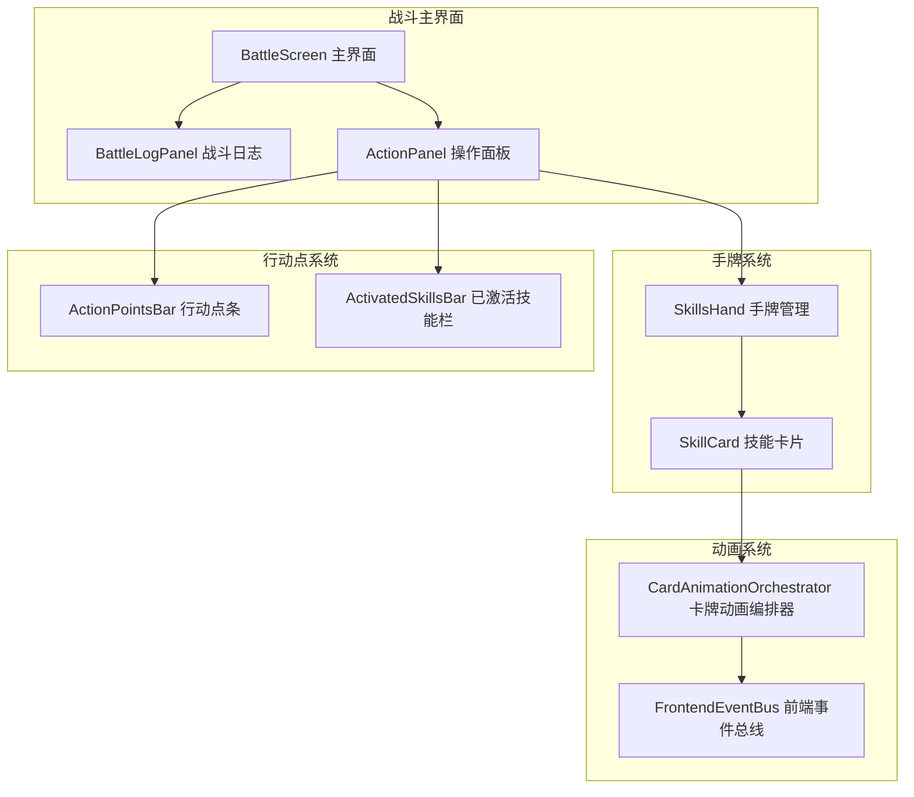
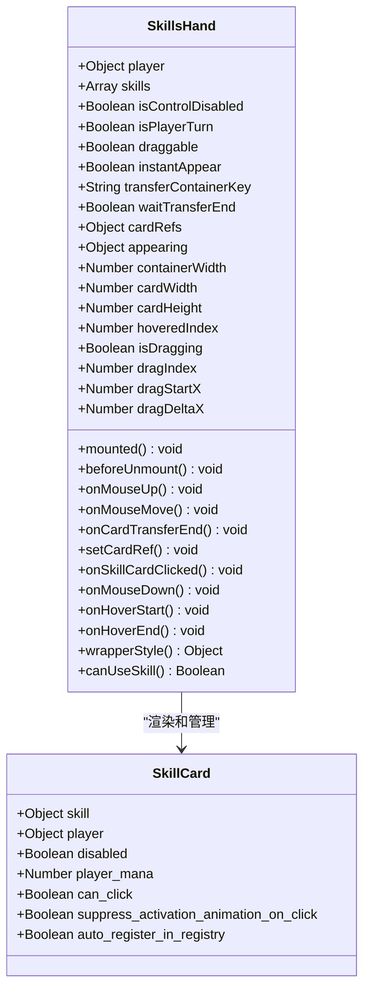
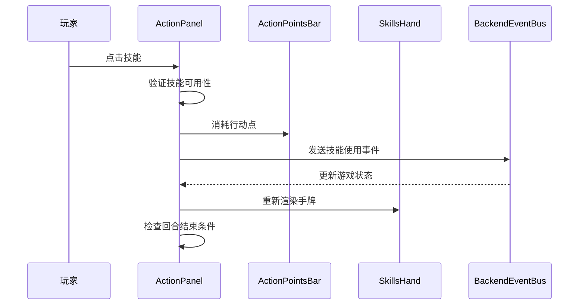
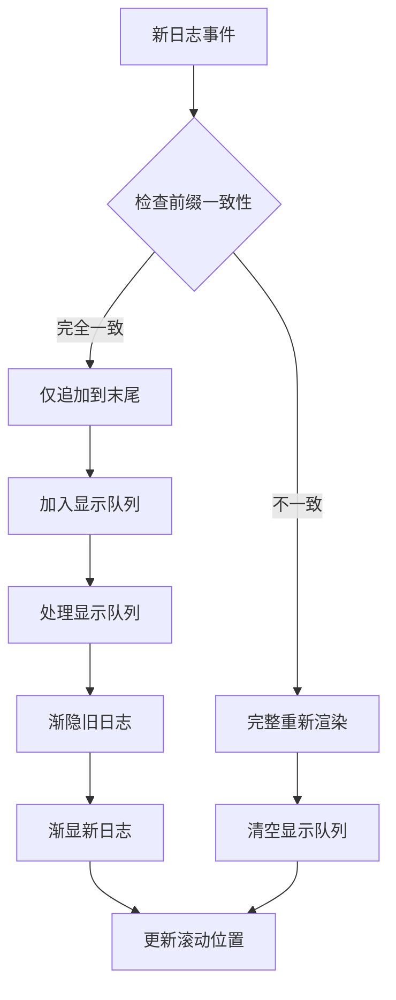
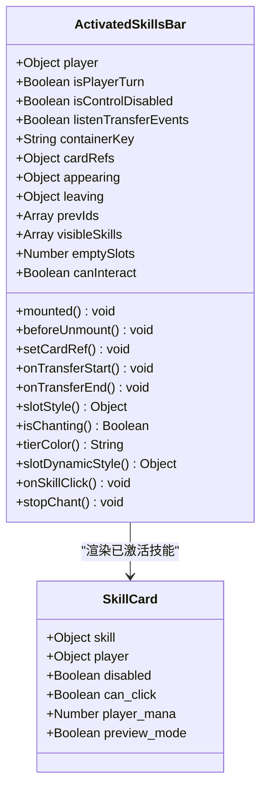
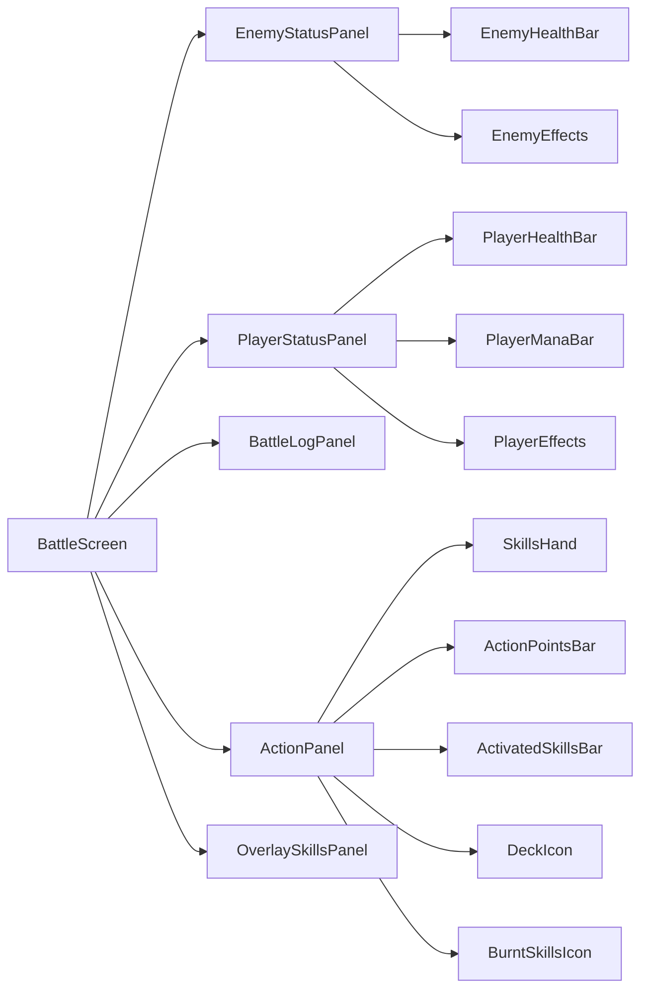
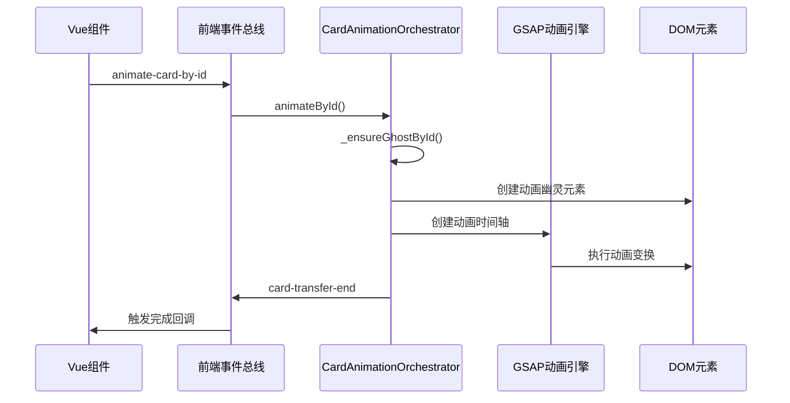

# 核心战斗模块组件设计与实现

<cite>
**本文档引用的文件**
- [SkillsHand.vue](file://src/components/battle/SkillsHand.vue)
- [ActionPanel.vue](file://src/components/battle/ActionPanel.vue)
- [BattleLogPanel.vue](file://src/components/battle/BattleLogPanel.vue)
- [ActivatedSkillsBar.vue](file://src/components/battle/ActivatedSkillsBar.vue)
- [BattleScreen.vue](file://src/components/battle/BattleScreen.vue)
- [ActionPointsBar.vue](file://src/components/global/actionPointsBar.vue)
- [gameState.js](file://src/data/gameState.js)
- [skill.js](file://src/data/skill.js)
- [skillManager.js](file://src/data/skillManager.js)
- [cardAnimationOrchestrator.js](file://src/utils/cardAnimationOrchestrator.js)
</cite>

## 目录
1. [项目概述](#项目概述)
2. [核心组件架构](#核心组件架构)
3. [SkillsHand手牌管理组件](#skillshand手牌管理组件)
4. [ActionPanel行动点控制组件](#actionpanel行动点控制组件)
5. [BattleLogPanel战斗日志组件](#battlelogpanel战斗日志组件)
6. [ActivatedSkillsBar技能栏组件](#activatedskillsbar技能栏组件)
7. [BattleScreen主界面集成](#battlescreen主界面集成)
8. [动画系统与数据流](#动画系统与数据流)
9. [性能优化策略](#性能优化策略)
10. [故障排除指南](#故障排除指南)
11. [总结](#总结)

## 项目概述

RTVL游戏的核心战斗模块采用Vue 3组件化架构，实现了完整的回合制战斗系统。该系统包含手牌管理、行动点控制、技能激活、战斗日志记录等多个核心功能模块，通过精心设计的组件层次结构和数据流管理，提供了流畅的战斗体验。

战斗系统的核心特点：
- **组件化设计**：每个战斗功能模块独立封装为Vue组件
- **响应式状态管理**：基于Vue 3的响应式系统实现状态同步
- **动画编排系统**：复杂的卡牌动画通过GSAP和自定义编排器管理
- **事件驱动架构**：通过事件总线实现组件间通信
- **性能优化**：针对大量手牌渲染的虚拟滚动优化

## 核心组件架构



**图表来源**
- [BattleScreen.vue](file://src/components/battle/BattleScreen.vue#L1-L50)
- [ActionPanel.vue](file://src/components/battle/ActionPanel.vue#L1-L50)
- [SkillsHand.vue](file://src/components/battle/SkillsHand.vue#L1-L30)

## SkillsHand手牌管理组件

SkillsHand组件是战斗系统的核心手牌管理组件，负责玩家手牌的渲染、拖拽排序、抽卡逻辑以及技能激活流程。

### 组件架构设计



**图表来源**
- [SkillsHand.vue](file://src/components/battle/SkillsHand.vue#L31-L68)
- [SkillsHand.vue](file://src/components/battle/SkillsHand.vue#L164-L207)

### 关键功能实现

#### 1. 手牌布局与尺寸管理

SkillsHand组件通过ResizeObserver监听容器尺寸变化，动态计算手牌布局：

```javascript
// 容器尺寸监听
_ro = new ResizeObserver(entries => {
  for (const entry of entries) {
    const cr = entry.contentRect;
    if (cr && cr.width !== this.containerWidth) this.containerWidth = cr.width;
  }
});

// 手牌尺寸计算
this.$nextTick(() => {
  const first = this.$el?.querySelector('.skill-wrapper .skill-card');
  if (first) {
    const r = first.getBoundingClientRect();
    if (r.width > 0) {
      this.cardWidth = Math.round(r.width);
      this.cardHeight = Math.round(r.height);
    }
  }
});
```

#### 2. 拖拽排序机制

组件实现了完整的拖拽排序功能，支持鼠标拖拽和触摸设备：

```javascript
// 拖拽开始处理
onMouseDown(idx, event) {
  if (!this.draggable) return;
  this.dragIndex = idx;
  this.dragStartX = event.clientX;
  this.attachDragListeners();
},

// 拖拽移动处理
onMouseMove(event) {
  if (!this.isDragging) return;
  const deltaX = event.clientX - this.dragStartX;
  this.dragDeltaX = deltaX;
  
  // 实时更新手牌位置
  const newIndex = Math.floor((this.dragStartX + deltaX) / this.cardWidth);
  if (newIndex !== this.dragIndex) {
    this.reorderSkills(this.dragIndex, newIndex);
  }
},
```

#### 3. 卡牌动画与过渡

通过前端事件总线实现卡牌动画的无缝衔接：

```javascript
// 等待卡牌传输完成后再显示
if (this.waitTransferEnd) {
  frontendEventBus.on('card-transfer-end', this.onCardTransferEnd);
}

onCardTransferEnd(payload = {}) {
  if (payload.phase !== 'end') return;
  const { id, to, from } = payload;
  if (to === this.transferContainerKey && this.appearing[id]) {
    delete this.appearing[id];
  }
}
```

**章节来源**
- [SkillsHand.vue](file://src/components/battle/SkillsHand.vue#L164-L207)
- [SkillsHand.vue](file://src/components/battle/SkillsHand.vue#L208-L300)

## ActionPanel行动点控制组件

ActionPanel组件负责管理玩家的行动点消耗机制、技能执行顺序控制以及相关的用户交互功能。

### 组件结构与功能



**图表来源**
- [ActionPanel.vue](file://src/components/battle/ActionPanel.vue#L1-L50)
- [ActionPointsBar.vue](file://src/components/global/ActionPointsBar.vue#L1-L52)

### 行动点消耗机制

ActionPointsBar组件实现了智能的行动点显示和动画效果：

```javascript
// 行动点圆点计算
computed: {
  actionPointsDots() {
    const dots = [];
    for (let i = 0; i < this.player.maxActionPoints; i++) {
      const isFilled = i < this.player.remainingActionPoints;
      const isHighlighted = isFilled && 
        i >= this.player.remainingActionPoints - this.highlightedActionPointCost;
      dots.push({
        filled: isFilled,
        highlighted: isHighlighted
      });
    }
    return dots;
  }
}
```

### 换卡功能实现

ActionPanel提供了独特的"换卡"功能，允许玩家在回合中替换手牌：

```javascript
// 换卡成本计算
computed: {
  shiftSkillCost() {
    return backendGameState.player.getModifiedPlayer().currentShiftSkillActionPointCost;
  },
  canShiftSkill() {
    const canShiftSkill = backendGameState.player.getModifiedPlayer().canShiftSkill();
    return (this.isPlayerTurn && !this.isControlDisabled && canShiftSkill);
  }
},

// 换卡按钮点击处理
onShiftSkillButtonClicked() {
  frontendEventBus.emit('tooltip:hide');
  backendEventBus.emit(EventNames.PlayerOperations.PLAYER_SHIFT_SKILL);
}
```

**章节来源**
- [ActionPanel.vue](file://src/components/battle/ActionPanel.vue#L50-L100)
- [ActionPointsBar.vue](file://src/components/global/ActionPointsBar.vue#L25-L52)

## BattleLogPanel战斗日志组件

BattleLogPanel组件负责记录每回合的战斗事件，包括伤害、状态变化、技能效果等，并提供调试回放功能。

### 日志管理系统



**图表来源**
- [BattleLogPanel.vue](file://src/components/battle/BattleLogPanel.vue#L50-L100)

### 日志分类与样式

组件支持多种日志类型的智能分类和视觉区分：

```javascript
// 日志类型判断
getLogClass(log) {
  if (typeof log === 'string') {
    if (log.includes('你')) return 'player-log';
    else if (log.includes('敌人') || (this.enemy && log.includes(this.enemy.name || '敌人'))) return 'enemy-log';
    else return 'other-log';
  } else {
    switch (log.type) {
      case 'player_action': return 'player-log';
      case 'enemy_action':
      case 'damage':
      case 'death': return 'enemy-log';
      case 'system':
      case 'heal':
      case 'effect': return 'other-log';
      default: return 'other-log';
    }
  }
}
```

### 渐进式显示机制

BattleLogPanel实现了智能的渐进式日志显示，提升用户体验：

```javascript
// 逐条显示处理
processRevealQueue() {
  if (this._revealQueue.length === 0) {
    this._revealing = false;
    return;
  }
  this._revealing = true;
  const next = this._revealQueue.shift();
  this.displayedLogs.unshift({ value: next, key: ++this._idCounter });
  if (!this.isHovered) this.$nextTick(this.scrollToTop);
  this._revealTimer = setTimeout(() => this.processRevealQueue(), this.revealIntervalMs);
}
```

**章节来源**
- [BattleLogPanel.vue](file://src/components/battle/BattleLogPanel.vue#L100-L150)
- [BattleLogPanel.vue](file://src/components/battle/BattleLogPanel.vue#L150-L203)

## ActivatedSkillsBar技能栏组件

ActivatedSkillsBar组件负责可视化已激活技能的持续效果，并与战斗状态保持同步。

### 技能栏架构



**图表来源**
- [ActivatedSkillsBar.vue](file://src/components/battle/ActivatedSkillsBar.vue#L1-L50)

### 咏唱状态可视化

组件实现了独特的咏唱状态视觉效果，通过CSS动画展示技能的持续施法过程：

```css
/* 咏唱状态环形光效 */
.activated-slot.chanting::after {
  content: '';
  position: absolute;
  inset: 0px;
  border-radius: 18px;
  pointer-events: none;
  box-shadow: 0 0 0 0 var(--tier-color, #fff), 0 0 0 0 var(--tier-color, #fff);
  border: 2px solid var(--tier-color, #fff);
  opacity: 0;
  animation: ringLightPulse 3.6s ease-in infinite;
  filter: blur(1px) saturate(1.1);
  z-index: -1;
}

@keyframes ringLightPulse {
  0% { opacity: 0.2; box-shadow: 0 0 8px 2px var(--tier-color, #fff), 0 0 20px 8px var(--tier-color, #fff);}
  12% { box-shadow: 0 0 16px 6px var(--tier-color, #fff), 0 0 34px 14px var(--tier-color, #fff); }
  28% { box-shadow: 0 0 10px 4px var(--tier-color, #fff), 0 0 26px 12px var(--tier-color, #fff); }
  50% { opacity: 1; box-shadow: 0 0 13px 5px var(--tier-color, #fff), 0 0 28px 12px var(--tier-color, #fff); }
  0% { box-shadow: 0 0 8px 2px var(--tier-color, #fff), 0 0 20px 8px var(--tier-color, #fff);}
}
```

### 技能状态同步

通过前端事件总线实现技能状态的实时同步：

```javascript
// 技能状态变化监听
watch: {
  visibleIds: {
    immediate: true,
    handler(newIds, old) {
      if (!old) { this.prevIds = [...newIds]; return; }
      const prevSet = new Set(this.prevIds);
      const added = newIds.filter(id => !prevSet.has(id));
      const removed = this.prevIds.filter(id => !new Set(newIds).has(id));
      this.prevIds = [...newIds];
      
      if (added.length && this.listenTransferEvents) {
        added.forEach(id => { 
          this.appearing[id] = true; 
          this.scheduleAppearFallback(id); 
        });
      }
      // 移除的卡片：保持离开标志直到传输结束清理
      removed.forEach(id => { 
        delete this.appearing[id]; 
        delete this.leaving[id]; 
      });
    }
  }
}
```

**章节来源**
- [ActivatedSkillsBar.vue](file://src/components/battle/ActivatedSkillsBar.vue#L50-L100)
- [ActivatedSkillsBar.vue](file://src/components/battle/ActivatedSkillsBar.vue#L100-L150)

## BattleScreen主界面集成

BattleScreen作为战斗系统的主界面组件，负责协调各个子组件的集成和数据流管理。

### 组件集成架构



**图表来源**
- [BattleScreen.vue](file://src/components/battle/BattleScreen.vue#L1-L50)

### 数据流管理

BattleScreen通过前端事件总线管理整个战斗过程的数据流：

```javascript
// 战斗日志事件处理
mounted() {
  frontendEventBus.on('add-battle-log', this.onAddBattleLog);
  frontendEventBus.on('clear-battle-log', this.onClearBattleLog);
},

methods: {
  onAddBattleLog(value) {
    // 兼容字符串与对象格式
    this.logs.push(value);
  },
  onClearBattleLog() {
    this.logs = [];
  },
}
```

### 组件通信机制

各个子组件通过props和事件实现松耦合通信：

```javascript
// ActionPanel与SkillsHand的通信
<ActionPanel
  :player="player"
  :is-player-turn="isPlayerTurn"
/>

// BattleLogPanel与BattleScreen的通信
<BattleLogPanel 
  :logs="logs"
  :enemy="enemy"
/>
```

**章节来源**
- [BattleScreen.vue](file://src/components/battle/BattleScreen.vue#L44-L110)

## 动画系统与数据流

战斗系统的动画效果通过CardAnimationOrchestrator组件实现，该组件负责管理复杂的卡牌动画序列。

### 动画编排系统



**图表来源**
- [cardAnimationOrchestrator.js](file://src/utils/cardAnimationOrchestrator.js#L1-L100)

### 动画类型与配置

CardAnimationOrchestrator支持多种动画类型：

```javascript
// 预设动画步骤构建器
buildSteps: {
  flyToCenter({ scale = 1.2, durationMs = 350, holdMs = 0 } = {}) {
    return [
      { toAnchor: 'center', scale, duration: durationMs, ease: defaultEase, holdMs }
    ];
  },
  centerThenDeck({ centerHoldMs = 350, totalMs = 900 } = {}) {
    const first = 350;
    const rest = Math.max(300, totalMs - first - centerHoldMs);
    return [
      { toAnchor: 'center', scale: 1.2, duration: first, ease: defaultEase, holdMs: centerHoldMs },
      { toAnchor: 'deck', scale: 0.5, rotate: 20, duration: rest, ease: 'power2.in' }
    ];
  },
  appearFromAnchor({ durationMs = 300 } = {}) {
    return [
      { toCard: true, scale: 1, opacity: 1, duration: durationMs, ease: defaultEase }
    ];
  }
}
```

### 卡牌传输事件系统

为了支持卡牌在多个前端容器之间的转移，系统实现了统一的传输事件机制：

```javascript
// 传输事件载荷结构
{
  id: <number|string>,            // 卡牌唯一ID
  kind: <string>,                 // 动画种类
  type: <string>,                 // 语义化转移类型
  from: <string|undefined>,       // 来源容器标识
  to: <string|undefined>,         // 目标容器标识
  token: <string>,                // 唯一标记
  phase: 'start' | 'end'          // 事件阶段
}
```

**章节来源**
- [cardAnimationOrchestrator.js](file://src/utils/cardAnimationOrchestrator.js#L80-L150)
- [cardAnimationOrchestrator.js](file://src/utils/cardAnimationOrchestrator.js#L200-L300)

## 性能优化策略

### 虚拟滚动优化

对于大量手牌的场景，系统实现了虚拟滚动技术：

```javascript
// 虚拟滚动布局计算
virtualScrollLayout() {
  const visibleCount = Math.ceil(this.containerHeight / this.cardHeight);
  const startIndex = Math.max(0, Math.floor(this.scrollOffset / this.cardHeight));
  const endIndex = Math.min(this.skills.length, startIndex + visibleCount + 2);
  
  return {
    startIndex,
    endIndex,
    scrollTop: startIndex * this.cardHeight
  };
}
```

### 组件懒加载

通过Vue的异步组件实现组件的按需加载：

```javascript
// 异步导入组件
const SkillsHand = defineAsyncComponent(() => import('./SkillsHand.vue'));
const ActionPanel = defineAsyncComponent(() => import('./ActionPanel.vue'));
```

### 事件防抖与节流

在高频事件处理中使用防抖和节流技术：

```javascript
// 拖拽事件防抖
onMouseMove: debounce(function(event) {
  // 处理拖拽逻辑
}, 16),

// 滚动事件节流
onScroll: throttle(function(event) {
  // 处理滚动逻辑
}, 16)
```

### 内存泄漏防护

通过适当的生命周期管理和事件清理防止内存泄漏：

```javascript
// 组件卸载时清理
beforeUnmount() {
  try { frontendEventBus.off('card-transfer-end', this.onCardTransferEnd); } catch (_) {}
  if (this._ro) {
    try { this._ro.disconnect(); } catch (_) {}
    this._ro = null;
  }
  this.detachDragListeners();
}
```

## 故障排除指南

### 常见问题与解决方案

#### 1. 手牌重绘异常

**问题描述**：手牌在某些情况下无法正确重绘或显示错位

**解决方案**：
```javascript
// 强制刷新手牌布局
refreshHandLayout() {
  this.$nextTick(() => {
    this.containerWidth = 0;
    this.$nextTick(() => {
      this.containerWidth = this.$refs.handRoot.clientWidth;
    });
  });
}
```

#### 2. AP计算错误

**问题描述**：行动点消耗计算不准确

**解决方案**：
```javascript
// 验证AP计算逻辑
validateActionPointCost(skill) {
  const player = this.player;
  const cost = skill.actionPointCost;
  
  if (cost > player.remainingActionPoints) {
    console.warn('AP不足:', skill.name, cost, player.remainingActionPoints);
    return false;
  }
  
  if (cost > player.maxActionPoints) {
    console.warn('AP超出上限:', skill.name, cost, player.maxActionPoints);
    return false;
  }
  
  return true;
}
```

#### 3. 动画卡顿问题

**问题描述**：复杂动画导致界面卡顿

**解决方案**：
```javascript
// 优化动画性能
optimizeAnimations() {
  // 禁用不必要的动画
  if (this.isAnimating) return;
  
  // 使用will-change属性优化
  this.$refs.handRoot.style.willChange = 'transform';
  
  // 限制同时运行的动画数量
  if (this.activeAnimations > MAX_ANIMATIONS) {
    this.pauseOldestAnimation();
  }
}
```

#### 4. 内存泄漏问题

**问题描述**：长时间游戏后内存占用过高

**解决方案**：
```javascript
// 定期清理无用数据
cleanupMemory() {
  // 清理旧的日志记录
  if (this.logs.length > MAX_LOGS) {
    this.logs = this.logs.slice(-MAX_LOGS);
  }
  
  // 清理旧的动画幽灵
  this.cleanupOldGhosts();
}
```

### 调试工具与技巧

#### 1. 状态监控

```javascript
// 添加状态监控
monitorGameState() {
  setInterval(() => {
    console.log('当前游戏状态:', {
      playerAP: this.player.remainingActionPoints,
      handSize: this.skills.length,
      activatedSkills: this.player.activatedSkills.length
    });
  }, 1000);
}
```

#### 2. 性能分析

```javascript
// 性能指标收集
collectPerformanceMetrics() {
  const metrics = {
    frameRate: performance.now(),
    memoryUsage: performance.memory?.usedJSHeapSize || 0,
    animationCount: this.activeAnimations
  };
  
  this.performanceHistory.push(metrics);
  if (this.performanceHistory.length > 100) {
    this.performanceHistory.shift();
  }
}
```

## 总结

RTVL游戏的核心战斗模块通过精心设计的组件架构和动画系统，实现了流畅而富有表现力的战斗体验。主要特点包括：

### 技术亮点

1. **模块化组件设计**：每个功能模块独立封装，便于维护和扩展
2. **响应式状态管理**：基于Vue 3的响应式系统实现高效的状态同步
3. **复杂动画编排**：通过GSAP和自定义编排器实现精美的卡牌动画效果
4. **事件驱动架构**：通过事件总线实现组件间的松耦合通信
5. **性能优化策略**：针对大型战斗场景的虚拟滚动和内存管理

### 设计优势

- **可维护性**：清晰的组件边界和职责分离
- **可扩展性**：模块化设计支持新功能的轻松添加
- **用户体验**：流畅的动画效果和直观的操作反馈
- **稳定性**：完善的错误处理和内存管理机制

### 未来改进方向

1. **移动端优化**：增强触摸设备的交互体验
2. **无障碍支持**：改进键盘导航和屏幕阅读器支持
3. **性能监控**：添加更详细的性能指标收集
4. **动画定制**：提供更多动画效果的自定义选项

这个战斗模块为RTVL游戏提供了坚实的技术基础，通过持续的优化和改进，能够为玩家带来更加丰富和沉浸的游戏体验。