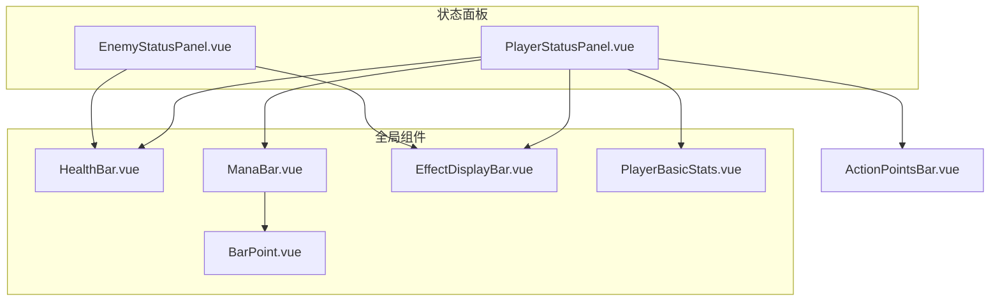
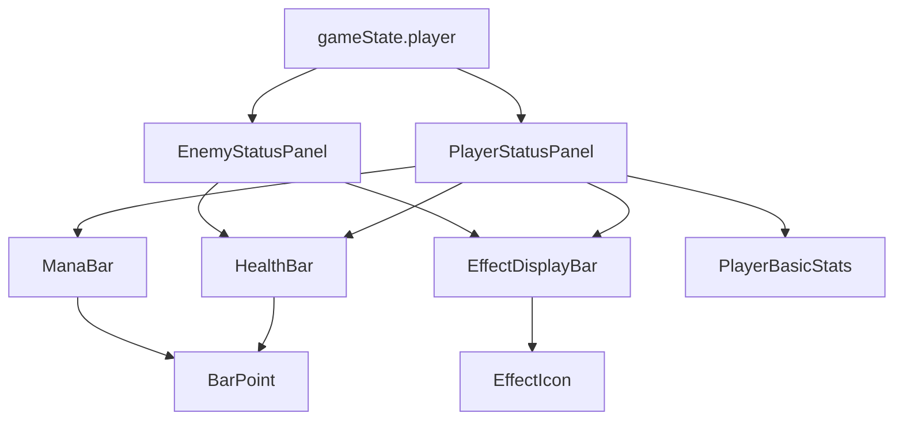
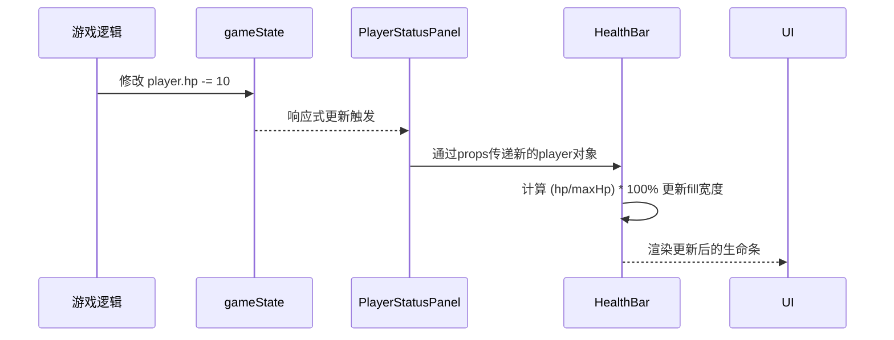
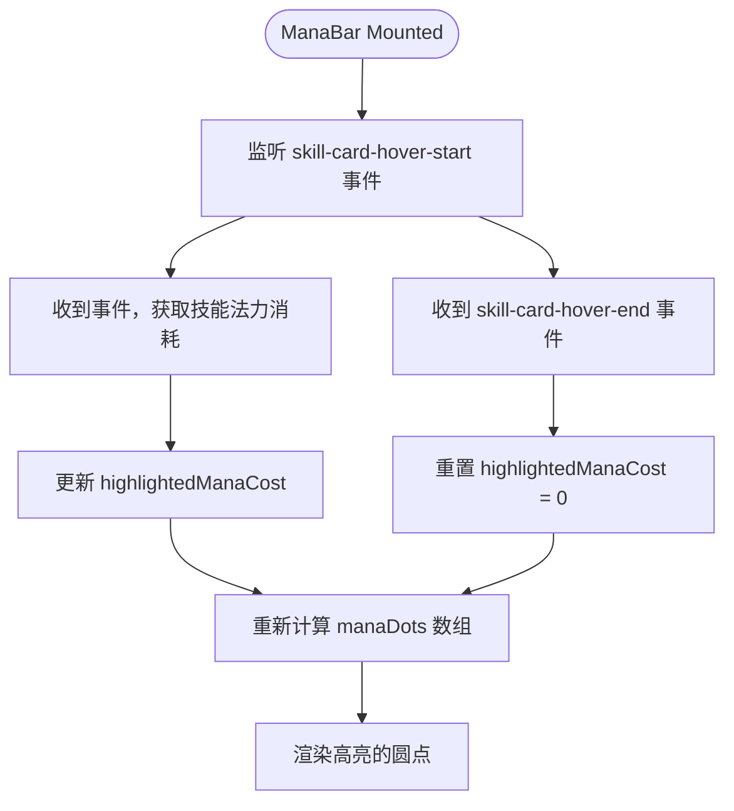
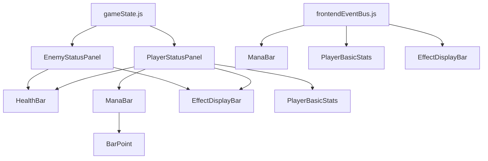

# 状态展示模块组件

<cite>
**本文档中引用的文件**  
- [PlayerStatusPanel.vue](file://src/components/global/PlayerStatusPanel.vue)
- [EnemyStatusPanel.vue](file://src/components/battle/EnemyStatusPanel.vue)
- [HealthBar.vue](file://src/components/global/HealthBar.vue)
- [ManaBar.vue](file://src/components/global/ManaBar.vue)
- [EffectDisplayBar.vue](file://src/components/global/EffectDisplayBar.vue)
- [PlayerBasicStats.vue](file://src/components/global/PlayerBasicStats.vue)
- [gameState.js](file://src/data/gameState.js)
- [player.js](file://src/data/player.js)
- [unit.js](file://src/data/unit.js)
- [frontendEventBus.js](file://src/frontendEventBus.js)
</cite>

## 目录
1. [简介](#简介)
2. [项目结构](#项目结构)
3. [核心组件](#核心组件)
4. [架构概览](#架构概览)
5. [详细组件分析](#详细组件分析)
6. [依赖分析](#依赖分析)
7. [性能考虑](#性能考虑)
8. [故障排除指南](#故障排除指南)
9. [结论](#结论)

## 简介
本文档详细阐述了游戏系统中状态展示模块的架构设计与实现机制。重点分析了玩家与敌人状态面板如何从全局游戏状态中响应式地订阅并更新单位状态（如生命值、法力值、增益/减益效果），并深入解析了进度条渲染、效果图标序列生成、基础属性展示等核心功能的实现逻辑。同时，文档还探讨了组件复用模式、自定义扩展方法以及常见问题的调试方案。

## 项目结构
状态展示模块主要由位于`src/components/global/`和`src/components/battle/`目录下的多个Vue组件构成。这些组件通过组合与复用，构建出玩家和敌人的状态信息界面。核心组件包括状态面板、生命条、法力条、效果显示栏和基础属性展示等。

**图示来源**  
- [PlayerStatusPanel.vue](file://src/components/global/PlayerStatusPanel.vue)
- [EnemyStatusPanel.vue](file://src/components/battle/EnemyStatusPanel.vue)
- [HealthBar.vue](file://src/components/global/HealthBar.vue)
- [ManaBar.vue](file://src/components/global/ManaBar.vue)
- [EffectDisplayBar.vue](file://src/components/global/EffectDisplayBar.vue)

**本节来源**  
- [src/components](file://src/components#L1-L50)

## 核心组件
状态展示模块的核心由`PlayerStatusPanel.vue`和`EnemyStatusPanel.vue`两个面板组件构成。它们分别负责渲染玩家和敌人的完整状态信息。这两个组件通过`props`接收单位对象（`player`或`enemy`），并利用Vue的响应式系统，自动监听单位对象内部属性（如`hp`、`mana`、`effects`等）的变化，从而实现UI的实时更新。

**本节来源**  
- [PlayerStatusPanel.vue](file://src/components/global/PlayerStatusPanel.vue#L1-L50)
- [EnemyStatusPanel.vue](file://src/components/battle/EnemyStatusPanel.vue#L1-L50)

## 架构概览
整个状态展示模块采用分层组合的架构设计。顶层是状态面板组件，它们负责布局和协调。中间层是专用的状态条组件（如`HealthBar`、`ManaBar`），负责特定状态的可视化。底层是原子化组件（如`BarPoint`、`EffectIcon`），提供基础UI元素。数据流从`gameState`中的`player`和`enemy`对象出发，通过`props`逐层向下传递，利用Vue的响应式依赖追踪实现自动更新。

**图示来源**  
- [gameState.js](file://src/data/gameState.js#L1-L20)
- [PlayerStatusPanel.vue](file://src/components/global/PlayerStatusPanel.vue#L1-L50)
- [EnemyStatusPanel.vue](file://src/components/battle/EnemyStatusPanel.vue#L1-L50)

## 详细组件分析

### 玩家与敌人状态面板分析
`PlayerStatusPanel.vue`和`EnemyStatusPanel.vue`是状态信息的容器组件。它们通过`props`接收`player`或`enemy`对象。这些对象是`reactive`创建的响应式对象，源自`gameState.js`中的`displayGameState.player`。当游戏逻辑修改了`player.hp`或`player.effects`等属性时，Vue的响应式系统会自动触发相关组件的重新渲染。

`PlayerStatusPanel`在休整界面（`restScreen`模式）下会显示不同的UI，例如显示`PlayerBasicStats`中的金钱、灵能等信息，并根据玩家等阶动态改变面板样式。它还通过`watch`侦听器监听`player.tier`的变化，一旦玩家升级，便会播放一个金色粒子特效动画。

`EnemyStatusPanel`则包含一个信息悬浮框功能，当鼠标悬停在“？”按钮上时，会显示敌人的详细描述和属性。

#### 对于API/服务组件：

**图示来源**  
- [PlayerStatusPanel.vue](file://src/components/global/PlayerStatusPanel.vue#L1-L100)
- [EnemyStatusPanel.vue](file://src/components/battle/EnemyStatusPanel.vue#L1-L100)
- [gameState.js](file://src/data/gameState.js#L1-L20)

**本节来源**  
- [PlayerStatusPanel.vue](file://src/components/global/PlayerStatusPanel.vue#L1-L215)
- [EnemyStatusPanel.vue](file://src/components/battle/EnemyStatusPanel.vue#L1-L325)

### 生命条与法力条分析
`HealthBar.vue`和`ManaBar.vue`组件负责渲染生命值和法力值的进度条。

`HealthBar`的渲染逻辑非常直接。它接收一个`unit`对象，通过计算`unit.hp / unit.maxHp * 100%`来设置内部`fill`元素的`width`。其阈值警告机制体现在样式上：生命条的背景色为灰色(`#f0f0f0`)，填充色为绿色(`#4caf50`)，而敌人的生命条填充色为红色(`#f44336`)，通过不同的颜色直观地传达危险程度。

`ManaBar`采用了不同的视觉设计，使用一系列圆点(`BarPoint`)来表示法力值。它通过`v-for`循环`player.maxMana`次来创建圆点，并根据`player.mana`的值决定每个圆点是否填充。此外，`ManaBar`还实现了阈值警告的增强版——高亮机制。它通过`frontendEventBus`监听技能卡牌的悬停事件。当玩家将鼠标悬停在一个技能卡上时，该组件会计算该技能的法力消耗，并将当前法力值中对应消耗数量的圆点高亮显示（通过`highlightedManaCost`和`manaDots`计算属性实现），为玩家提供直观的使用成本预览。

#### 对于复杂逻辑组件：

**图示来源**  
- [ManaBar.vue](file://src/components/global/ManaBar.vue#L1-L120)
- [frontendEventBus.js](file://src/frontendEventBus.js#L1-L10)

**本节来源**  
- [HealthBar.vue](file://src/components/global/HealthBar.vue#L1-L101)
- [ManaBar.vue](file://src/components/global/ManaBar.vue#L1-L120)

### 效果显示栏分析
`EffectDisplayBar.vue`组件负责解析单位的`effectList`（即`unit.effects`对象）并生成可视化图标序列。

其实现机制是：接收一个`effects`对象作为`prop`，该对象的键是效果名称（如"力量"、"易伤"），值是该效果的层数。组件使用`v-for`遍历这个对象，为每一个层数大于0的效果创建一个`EffectIcon`组件实例。`EffectIcon`会根据`effect-name`显示对应的图标和层数。

为了实现效果变化时的动画反馈（如效果消失时的粒子特效），`EffectDisplayBar`使用了一个`deep`侦听器来监控`effects`对象的深层变化。它维护了一个`previousEffects`副本。每次`effects`对象发生变化时，它会比较新旧两个对象，找出哪些效果的层数从大于0变成了0（即效果消失）。一旦检测到效果消失，它就会调用`playEffectExpiredAnimation`方法，通过`frontendEventBus`事件总线发射一个`spawn-particles`事件，触发全局粒子系统的响应，从而在UI上播放一个粒子动画。

**本节来源**  
- [EffectDisplayBar.vue](file://src/components/global/EffectDisplayBar.vue#L1-L154)
- [frontendEventBus.js](file://src/frontendEventBus.js#L1-L10)

### 角色基础属性展示分析
`PlayerBasicStats.vue`组件展示了玩家的金钱、灵能、防御和等阶等基础属性。

该组件的核心功能是提供动态的数值变化反馈。它通过一个`deep`侦听器监控`player`对象。当侦听到`money`、`defense`、`magic`或`tier`等属性发生变化时，它会执行两个操作：
1.  **触发缩放动画**：调用`triggerStatBump`方法，为发生变化的属性值添加一个`stat-bump` CSS类，实现一个“跳动”的视觉反馈。
2.  **生成浮动文字**：调用`spawnTextParticle`方法，创建一个包含变化量（如`+5💰`）的粒子，并通过`frontendEventBus.emit('spawn-particles')`事件将其发送到全局粒子系统，使文字从属性值上方飘起，清晰地告知玩家变化的具体数值。

这种设计将状态更新的视觉反馈从简单的静态显示提升到了动态交互的层面，极大地增强了用户体验。

**本节来源**  
- [PlayerBasicStats.vue](file://src/components/global/PlayerBasicStats.vue#L1-L183)

## 依赖分析
状态展示模块的组件之间存在清晰的依赖关系。`PlayerStatusPanel`和`EnemyStatusPanel`依赖于`HealthBar`、`ManaBar`、`EffectDisplayBar`和`PlayerBasicStats`。`ManaBar`进一步依赖于`BarPoint`。这些依赖通过Vue的`components`选项和`import`语句在代码中显式声明。

更关键的是，这些组件都依赖于全局的`gameState`数据源。它们通过`props`接收来自`gameState.displayGameState`的`player`和`enemy`对象。同时，它们还依赖于`frontendEventBus`进行跨组件通信，例如`ManaBar`监听技能悬停事件，`PlayerBasicStats`和`EffectDisplayBar`发射粒子生成事件。

**图示来源**  
- [gameState.js](file://src/data/gameState.js#L1-L20)
- [frontendEventBus.js](file://src/frontendEventBus.js#L1-L10)
- [PlayerStatusPanel.vue](file://src/components/global/PlayerStatusPanel.vue#L1-L50)
- [EnemyStatusPanel.vue](file://src/components/battle/EnemyStatusPanel.vue#L1-L50)

**本节来源**  
- [gameState.js](file://src/data/gameState.js#L1-L75)
- [frontendEventBus.js](file://src/frontendEventBus.js#L1-L20)

## 性能考虑
该模块的性能表现良好。其核心优势在于充分利用了Vue的响应式系统，避免了手动的DOM操作和复杂的更新逻辑。数据驱动的视图更新机制确保了只有在相关数据发生变化时，组件才会重新渲染。

需要注意的潜在性能点是`EffectDisplayBar`中的`deep`侦听器。由于`effects`对象可能包含多个键值对，深度监听可能会带来一定的性能开销。但在当前的游戏场景下，单位同时拥有的效果数量有限，此开销在可接受范围内。此外，`JSON.parse(JSON.stringify())`用于创建`previousEffects`的深拷贝，在效果列表非常庞大时可能成为瓶颈，但根据游戏设计，这种情况极少见。

## 故障排除指南
在开发和调试过程中，可能会遇到以下常见问题：

*   **状态不同步**：如果UI没有随`gameState`的变化而更新，首先检查`player`或`enemy`对象是否是通过`reactive`创建的响应式对象。其次，确认`props`的传递链是否正确，确保数据从`gameState`流向了最终的展示组件。最后，检查是否有直接修改对象引用（如`player = newPlayer`）而非修改其内部属性的行为，这会破坏响应式连接。
*   **UI闪烁**：如果在状态更新时出现UI闪烁，可能是由于在短时间内触发了多次不必要或冲突的状态更新。应检查游戏逻辑中是否有循环或重复的更新操作。对于`EffectDisplayBar`，确保`playEffectExpiredAnimation`不会因频繁的微小变化而被过度触发。
*   **事件未响应**：如果`ManaBar`的高亮功能或`PlayerBasicStats`的粒子效果失效，应检查`frontendEventBus`上的事件监听和发射是否正确。确保`on`和`emit`的事件名称完全匹配，并且在组件销毁时（`beforeUnmount`）正确地移除了事件监听器，以防止内存泄漏。

**本节来源**  
- [PlayerStatusPanel.vue](file://src/components/global/PlayerStatusPanel.vue#L1-L215)
- [ManaBar.vue](file://src/components/global/ManaBar.vue#L1-L120)
- [PlayerBasicStats.vue](file://src/components/global/PlayerBasicStats.vue#L1-L183)
- [frontendEventBus.js](file://src/frontendEventBus.js#L1-L20)

## 结论
状态展示模块通过精心设计的组件化架构，实现了高效、响应式且视觉丰富的单位状态呈现。它以`gameState`为核心数据源，利用Vue的响应式系统和事件总线，构建了一个数据驱动、交互性强的UI体系。各组件职责分明，复用性高，为游戏提供了稳定可靠的状态可视化支持。通过理解其设计原理和潜在问题，开发者可以有效地维护和扩展此模块。