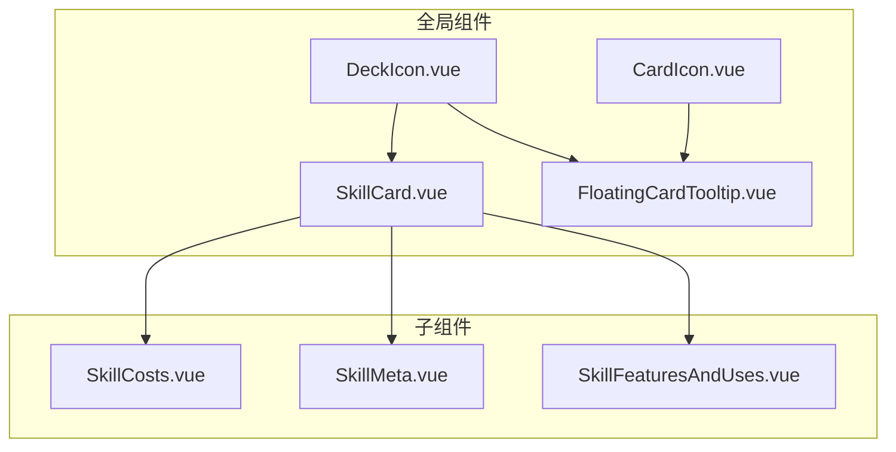
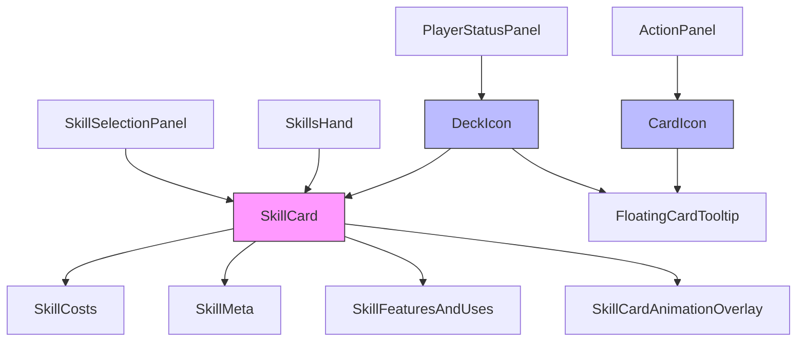
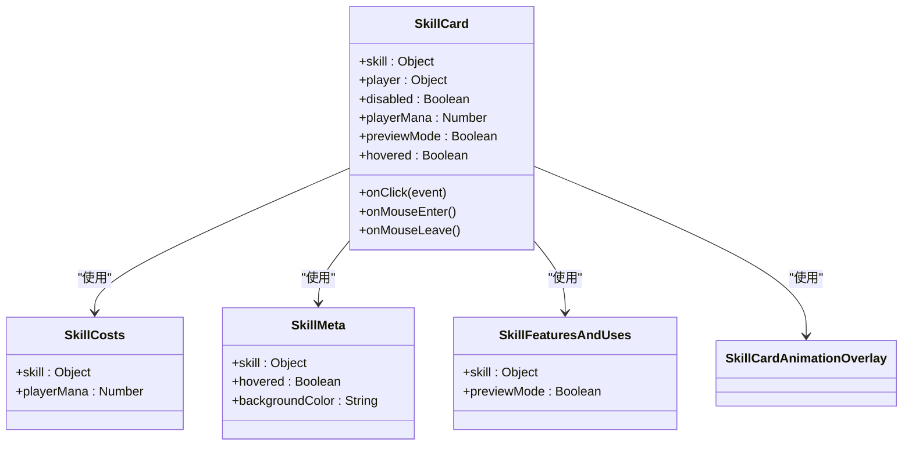
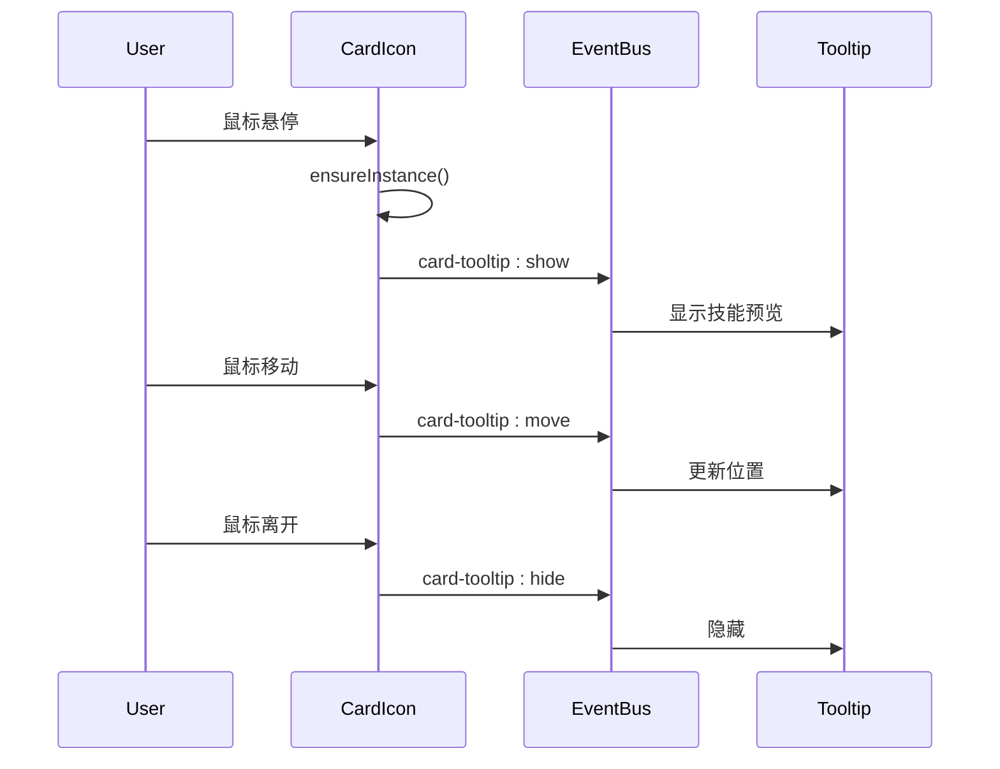
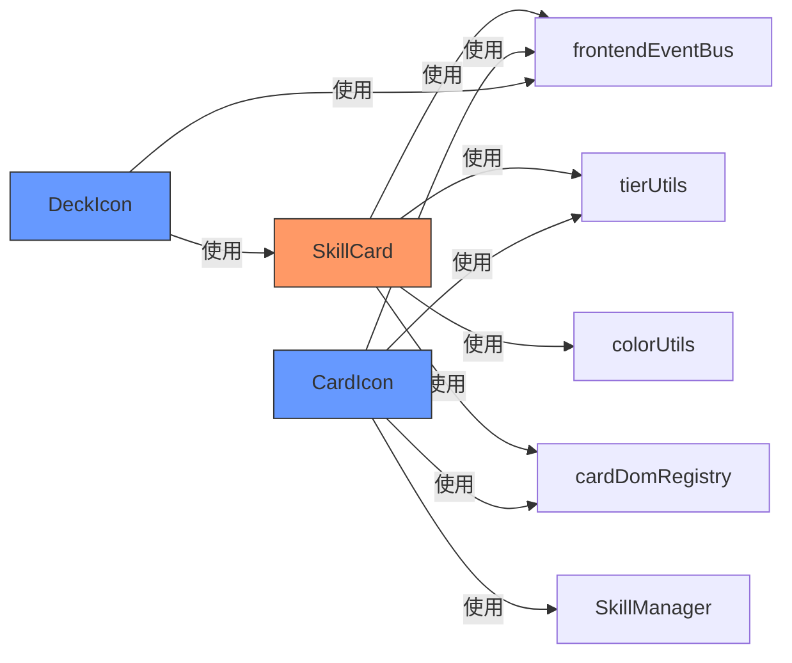

# 卡片类组件

<cite>
**本文档中引用的文件**  
- [SkillCard.vue](file://src/components/global/SkillCard.vue)
- [SkillCosts.vue](file://src/components/global/skillCard/SkillCosts.vue)
- [SkillMeta.vue](file://src/components/global/skillCard/SkillMeta.vue)
- [SkillFeaturesAndUses.vue](file://src/components/global/skillCard/SkillFeaturesAndUses.vue)
- [CardIcon.vue](file://src/components/global/CardIcon.vue)
- [DeckIcon.vue](file://src/components/global/DeckIcon.vue)
- [FloatingCardTooltip.vue](file://src/components/global/FloatingCardTooltip.vue)
</cite>

## 目录
1. [简介](#简介)
2. [项目结构](#项目结构)
3. [核心组件](#核心组件)
4. [架构概述](#架构概述)
5. [详细组件分析](#详细组件分析)
6. [依赖分析](#依赖分析)
7. [性能考虑](#性能考虑)
8. [故障排除指南](#故障排除指南)
9. [结论](#结论)

## 简介
本文档深入解析 `SkillCard.vue` 作为核心卡片容器的架构设计，详细说明其内部集成的 `SkillCosts`、`SkillMeta`、`SkillFeaturesAndUses` 三个子组件的职责划分与数据传递机制。阐述 `CardIcon` 与 `DeckIcon` 在卡牌可视化系统中的轻量级复用模式，包括图标渲染逻辑与状态映射规则。分析 `FloatingCardTooltip` 如何实现卡片悬停预览功能，包括事件绑定、位置计算与内容动态加载。提供各组件的 props 接口定义（如 cost、type、tier 等）、事件触发机制（如 click、hover）及 CSS 变量驱动的样式定制方案。结合实际战斗场景，展示卡片组件在手牌区、技能选择面板中的使用模式。

## 项目结构

**图示来源**  
- [SkillCard.vue](file://src/components/global/SkillCard.vue)
- [CardIcon.vue](file://src/components/global/CardIcon.vue)
- [DeckIcon.vue](file://src/components/global/DeckIcon.vue)

**本节来源**  
- [SkillCard.vue](file://src/components/global/SkillCard.vue)
- [CardIcon.vue](file://src/components/global/CardIcon.vue)
- [DeckIcon.vue](file://src/components/global/DeckIcon.vue)

## 核心组件

`SkillCard.vue` 作为核心卡片容器，负责整合技能的视觉展示与交互逻辑。其通过 props 接收技能对象（skill）、玩家状态（player）、法力值（playerMana）等关键数据，并通过 emit 向父组件传递点击事件（skill-card-clicked）。组件内部通过 computed 属性动态生成技能描述、背景色、边框色等样式信息，并根据技能等级（tier）调用工具函数 `getSkillTierColor` 进行颜色映射。

子组件 `SkillCosts`、`SkillMeta`、`SkillFeaturesAndUses` 分别负责费用显示、名称与副标题展示、技能特性与使用状态的呈现，实现了关注点分离的设计原则。`SkillCardAnimationOverlay` 组件用于展示技能的升级、冷却等动画状态。

**本节来源**  
- [SkillCard.vue](file://src/components/global/SkillCard.vue#L1-L235)
- [SkillCosts.vue](file://src/components/global/skillCard/SkillCosts.vue#L1-L53)
- [SkillMeta.vue](file://src/components/global/skillCard/SkillMeta.vue#L1-L58)
- [SkillFeaturesAndUses.vue](file://src/components/global/skillCard/SkillFeaturesAndUses.vue#L1-L48)

## 架构概述

**图示来源**  
- [SkillCard.vue](file://src/components/global/SkillCard.vue)
- [CardIcon.vue](file://src/components/global/CardIcon.vue)
- [DeckIcon.vue](file://src/components/global/DeckIcon.vue)

## 详细组件分析

### SkillCard 分析

`SkillCard` 组件作为技能卡片的主容器，采用组合式设计，将不同功能模块拆分为独立子组件。其通过 `props` 接收外部数据，包括技能对象、玩家信息、是否禁用、法力值、是否为预览模式等。组件通过 `computed` 属性动态计算技能描述（支持函数式生成）、背景色（基于技能等级）、背景图片（根据技能类型和等级自动匹配）等。

交互方面，组件监听 `click`、`mouseenter`、`mouseleave` 事件，并通过 `frontendEventBus` 发布全局事件（如 `skill-card-hover-start`），实现与其他组件的松耦合通信。组件在挂载时通过 `cardDomRegistry` 注册自身 DOM 元素，便于外部系统（如动画系统）直接访问。

#### 组件关系图

**图示来源**  
- [SkillCard.vue](file://src/components/global/SkillCard.vue#L1-L235)
- [SkillCosts.vue](file://src/components/global/skillCard/SkillCosts.vue#L1-L53)
- [SkillMeta.vue](file://src/components/global/skillCard/SkillMeta.vue#L1-L58)
- [SkillFeaturesAndUses.vue](file://src/components/global/skillCard/SkillFeaturesAndUses.vue#L1-L48)

**本节来源**  
- [SkillCard.vue](file://src/components/global/SkillCard.vue#L1-L235)

### CardIcon 与 DeckIcon 复用模式分析

`CardIcon` 与 `DeckIcon` 是轻量级图标组件，用于在非卡片区域快速展示技能信息。

`CardIcon` 接收 `skillName` 和可选的 `powerDelta`，通过 `SkillManager` 动态创建技能实例，并根据技能类型（type）映射为特定图标（如 ♨ 表示火系，⚔ 表示普通攻击）。当鼠标悬停时，通过 `frontendEventBus` 触发 `card-tooltip:show` 事件，显示技能详情。

`DeckIcon` 用于表示玩家的后备牌库，显示牌库数量，并在悬停时通过 `SkillCard` 组件预览顶部技能。其通过 `watch` 监听 `count` 变化，触发 `stat-bump` 动画，增强用户反馈。

#### 事件流图

**图示来源**  
- [CardIcon.vue](file://src/components/global/CardIcon.vue#L1-L94)
- [FloatingCardTooltip.vue](file://src/components/global/FloatingCardTooltip.vue)

**本节来源**  
- [CardIcon.vue](file://src/components/global/CardIcon.vue#L1-L94)
- [DeckIcon.vue](file://src/components/global/DeckIcon.vue#L1-L138)

### FloatingCardTooltip 悬停预览分析

`FloatingCardTooltip` 组件监听 `frontendEventBus` 上的 `card-tooltip:show`、`card-tooltip:move`、`card-tooltip:hide` 事件，实现非侵入式的卡片预览功能。当收到 `show` 事件时，组件将 `SkillCard` 实例化并定位到指定坐标（x, y）。`move` 事件用于实时更新提示框位置，确保其跟随鼠标移动。`hide` 事件则控制提示框的隐藏。

该设计实现了组件间的解耦，任何组件只需通过事件总线即可触发卡片预览，无需直接引用 `FloatingCardTooltip`。

**本节来源**  
- [FloatingCardTooltip.vue](file://src/components/global/FloatingCardTooltip.vue)

## 依赖分析

**图示来源**  
- [SkillCard.vue](file://src/components/global/SkillCard.vue#L1-L235)
- [CardIcon.vue](file://src/components/global/CardIcon.vue#L1-L94)
- [DeckIcon.vue](file://src/components/global/DeckIcon.vue#L1-L138)

**本节来源**  
- [SkillCard.vue](file://src/components/global/SkillCard.vue#L1-L235)
- [CardIcon.vue](file://src/components/global/CardIcon.vue#L1-L94)
- [DeckIcon.vue](file://src/components/global/DeckIcon.vue#L1-L138)

## 性能考虑

- **DOM 注册机制**：`SkillCard` 提供 `autoRegisterInRegistry` 开关，避免在批量渲染时（如手牌区）产生不必要的性能开销。
- **事件总线通信**：使用 `frontendEventBus` 替代 prop 链式传递，减少组件间直接依赖，提升渲染效率。
- **动态实例化**：`CardIcon` 仅在悬停时创建技能实例，避免内存浪费。
- **CSS 动画优化**：使用 `transform` 和 `opacity` 实现动画效果，并通过 `will-change` 提示浏览器优化。

## 故障排除指南

- **技能图标不显示**：检查 `skill.type` 是否为有效值（fire, normal, heal），或 `skill.image` 路径是否正确。
- **悬停预览不出现**：确认 `frontendEventBus` 事件名称是否正确，`FloatingCardTooltip` 组件是否已挂载。
- **费用显示错误**：检查 `playerMana` 和 `skill.manaCost` 数据类型是否为数字。
- **升级徽章不显示**：确认 `skill.isUpgradeCandidate` 和 `skill.upgradedFrom` 属性是否正确设置。

**本节来源**  
- [SkillCard.vue](file://src/components/global/SkillCard.vue#L1-L235)
- [CardIcon.vue](file://src/components/global/CardIcon.vue#L1-L94)
- [FloatingCardTooltip.vue](file://src/components/global/FloatingCardTooltip.vue)

## 结论

`SkillCard` 及其相关组件构成了一个高效、可复用的卡牌可视化系统。通过清晰的职责划分、事件驱动的通信机制和轻量级的图标组件，系统在保证功能完整性的同时，实现了良好的性能和可维护性。该设计模式适用于需要频繁展示技能信息的 UI 场景，如手牌区、技能选择面板、敌人状态面板等。