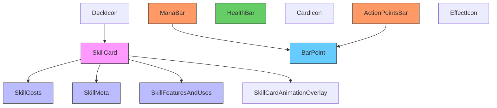
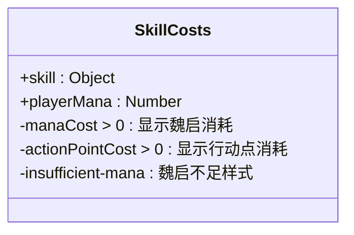
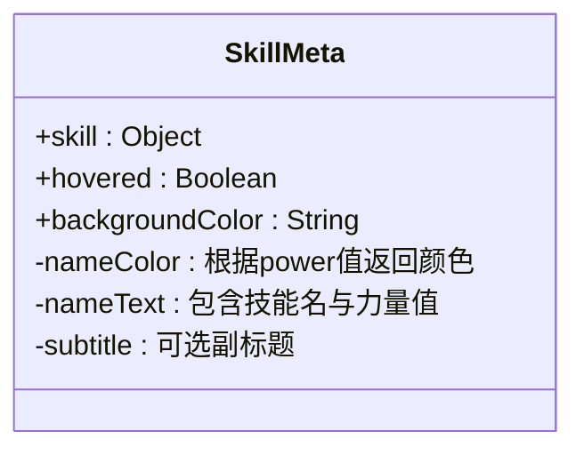
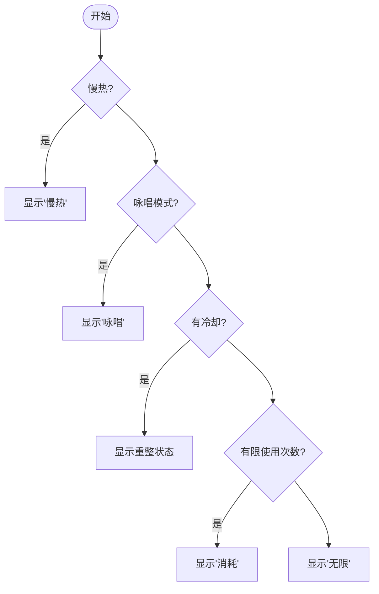
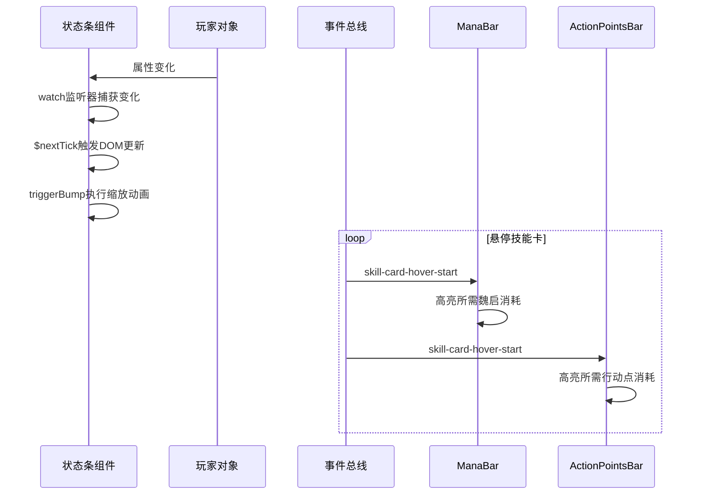
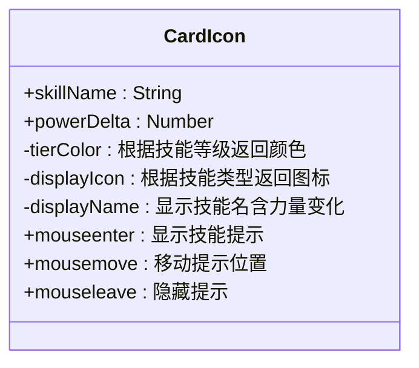
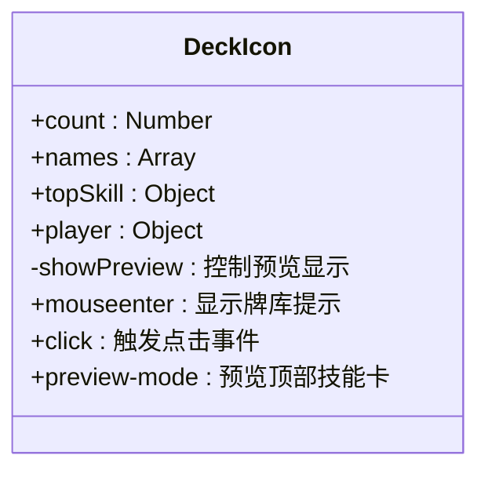
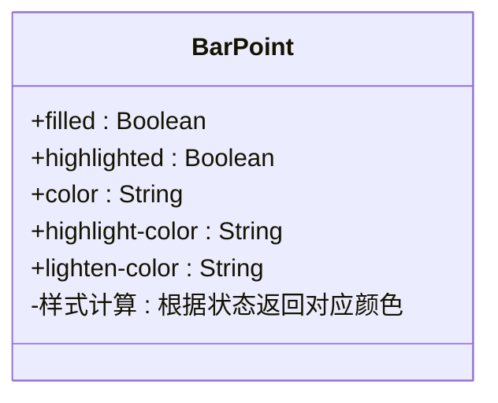

# 原子组件

<cite>
**本文档引用的文件**  
- [SkillCard.vue](file://src/components/global/SkillCard.vue)
- [SkillCosts.vue](file://src/components/global/skillCard/SkillCosts.vue)
- [SkillMeta.vue](file://src/components/global/skillCard/SkillMeta.vue)
- [SkillFeaturesAndUses.vue](file://src/components/global/skillCard/SkillFeaturesAndUses.vue)
- [CardIcon.vue](file://src/components/global/CardIcon.vue)
- [DeckIcon.vue](file://src/components/global/DeckIcon.vue)
- [HealthBar.vue](file://src/components/global/HealthBar.vue)
- [ManaBar.vue](file://src/components/global/ManaBar.vue)
- [ActionPointsBar.vue](file://src/components/global/ActionPointsBar.vue)
- [BarPoint.vue](file://src/components/global/BarPoint.vue)
- [EffectIcon.vue](file://src/components/global/EffectIcon.vue)
</cite>

## 目录
1. [简介](#简介)
2. [核心组件结构分析](#核心组件结构分析)
3. [SkillCard组件分解](#skillcard组件分解)
4. [状态条组件数据绑定机制](#状态条组件数据绑定机制)
5. [图标复用模式分析](#图标复用模式分析)
6. [基础绘图单元应用](#基础绘图单元应用)
7. [原子组件接口与事件](#原子组件接口与事件)
8. [样式定制方案](#样式定制方案)

## 简介
本文档系统化地文档化了游戏项目中的所有原子级UI组件，重点解析了`SkillCard`组件的结构分解及其内部集成的子组件。详细说明了卡牌可视化中`CardIcon`与`DeckIcon`的复用模式，分析了各类状态条组件的数据绑定与动态更新策略，并阐述了基础绘图单元在进度条中的通用应用。

## 核心组件结构分析

**图示来源**  
- [SkillCard.vue](file://src/components/global/SkillCard.vue#L1-L236)
- [SkillCosts.vue](file://src/components/global/skillCard/SkillCosts.vue#L1-L53)
- [ManaBar.vue](file://src/components/global/ManaBar.vue#L1-L120)
- [BarPoint.vue](file://src/components/global/BarPoint.vue)

**本节来源**  
- [SkillCard.vue](file://src/components/global/SkillCard.vue#L1-L236)
- [ManaBar.vue](file://src/components/global/ManaBar.vue#L1-L120)
- [ActionPointsBar.vue](file://src/components/global/ActionPointsBar.vue#L1-L120)

## SkillCard组件分解

`SkillCard`组件作为技能系统的可视化核心，采用模块化设计，通过组合多个原子子组件实现复杂功能。其结构主要由以下几个部分构成：

- **SkillCosts**: 显示技能消耗（魏启/行动点）
- **SkillMeta**: 展示技能名称与副标题
- **SkillFeaturesAndUses**: 表现技能特性与使用状态
- **SkillCardAnimationOverlay**: 处理动画层（冷却/升级等）

该组件通过props接收技能对象和玩家状态，实现了点击、悬停等交互行为，并通过全局事件总线与其他组件通信。

**本节来源**  
- [SkillCard.vue](file://src/components/global/SkillCard.vue#L1-L236)
- [SkillCosts.vue](file://src/components/global/skillCard/SkillCosts.vue#L1-L53)
- [SkillMeta.vue](file://src/components/global/skillCard/SkillMeta.vue#L1-L58)
- [SkillFeaturesAndUses.vue](file://src/components/global/skillCard/SkillFeaturesAndUses.vue#L1-L48)

### SkillCosts子组件分析

**图示来源**  
- [SkillCosts.vue](file://src/components/global/skillCard/SkillCosts.vue#L1-L53)

### SkillMeta子组件分析

**图示来源**  
- [SkillMeta.vue](file://src/components/global/skillCard/SkillMeta.vue#L1-L58)

### SkillFeaturesAndUses子组件分析

**图示来源**  
- [SkillFeaturesAndUses.vue](file://src/components/global/skillCard/SkillFeaturesAndUses.vue#L1-L48)

## 状态条组件数据绑定机制

状态条组件（HealthBar、ManaBar、ActionPointsBar）采用统一的数据绑定与动态更新策略，通过监听玩家状态变化实现UI的实时响应。

### 数据绑定机制对比

| 组件 | 绑定属性 | 显示格式 | 动画触发条件 |
|------|--------|--------|------------|
| HealthBar | unit.hp/unit.maxHp | 生命值: X/Y | 护盾值变化 |
| ManaBar | player.mana/player.maxMana | 滴魏启 X/Y | 魏启值或上限变化 |
| ActionPointsBar | player.remainingActionPoints/player.maxActionPoints | 闪电行动点 X/Y | 行动点值或上限变化 |

### 动态更新策略

**图示来源**  
- [HealthBar.vue](file://src/components/global/HealthBar.vue#L1-L101)
- [ManaBar.vue](file://src/components/global/ManaBar.vue#L1-L120)
- [ActionPointsBar.vue](file://src/components/global/ActionPointsBar.vue#L1-L120)

**本节来源**  
- [HealthBar.vue](file://src/components/global/HealthBar.vue#L1-L101)
- [ManaBar.vue](file://src/components/global/ManaBar.vue#L1-L120)
- [ActionPointsBar.vue](file://src/components/global/ActionPointsBar.vue#L1-L120)

## 图标复用模式分析

`CardIcon`与`DeckIcon`在卡牌可视化中展现了高效的复用模式，通过统一的交互逻辑和样式规范，实现了不同场景下的灵活应用。

### CardIcon复用模式

**图示来源**  
- [CardIcon.vue](file://src/components/global/CardIcon.vue#L1-L94)

### DeckIcon复用模式

**图示来源**  
- [DeckIcon.vue](file://src/components/global/DeckIcon.vue#L1-L138)

**本节来源**  
- [CardIcon.vue](file://src/components/global/CardIcon.vue#L1-L94)
- [DeckIcon.vue](file://src/components/global/DeckIcon.vue#L1-L138)

## 基础绘图单元应用

`BarPoint`作为基础绘图单元，在各类进度条中发挥着核心作用，实现了视觉元素的标准化与复用。

### BarPoint组件结构

**图示来源**  
- [BarPoint.vue](file://src/components/global/BarPoint.vue)

### 在进度条中的应用

`ManaBar`和`ActionPointsBar`均通过`v-for`循环渲染多个`BarPoint`实例，形成圆点式进度条。每个圆点的状态由父组件根据玩家当前状态计算得出：

- **填充状态**: 圆点索引小于当前值
- **高亮状态**: 填充状态下且位于消耗值范围内
- **颜色区分**: 不同资源使用不同主色与高亮色

这种设计使得进度条的视觉表现既统一又具有区分度，同时便于维护和扩展。

**本节来源**  
- [ManaBar.vue](file://src/components/global/ManaBar.vue#L1-L120)
- [ActionPointsBar.vue](file://src/components/global/ActionPointsBar.vue#L1-L120)
- [BarPoint.vue](file://src/components/global/BarPoint.vue)

## 原子组件接口与事件

### 主要组件Props接口定义

| 组件 | Prop名称 | 类型 | 默认值 | 说明 |
|------|--------|------|--------|------|
| SkillCard | skill | Object | 必需 | 技能对象 |
| | player | Object | null | 玩家对象 |
| | disabled | Boolean | false | 是否禁用 |
| | playerMana | Number | Infinity | 玩家魏启值 |
| | previewMode | Boolean | false | 预览模式 |
| | canClick | Boolean | true | 是否可点击 |
| ManaBar | player | Object | 必需 | 玩家对象 |
| ActionPointsBar | player | Object | 必需 | 玩家对象 |
| CardIcon | skillName | String | 必需 | 技能名称 |
| | powerDelta | Number | 0 | 力量变化值 |
| DeckIcon | count | Number | 0 | 牌库数量 |
| | names | Array | [] | 技能名称列表 |
| | topSkill | Object | null | 顶部技能 |
| | player | Object | null | 玩家对象 |

### 事件触发机制

- **SkillCard**: 
  - `skill-card-clicked`: 点击技能卡时触发，携带技能对象和事件
  - 通过`frontendEventBus`广播悬停事件：`skill-card-hover-start`和`skill-card-hover-end`

- **DeckIcon**:
  - `click`: 点击牌库图标时触发

- **CardIcon**:
  - 通过`frontendEventBus`广播提示事件：`card-tooltip:show`、`card-tooltip:move`、`card-tooltip:hide`

**本节来源**  
- [SkillCard.vue](file://src/components/global/SkillCard.vue#L1-L236)
- [ManaBar.vue](file://src/components/global/ManaBar.vue#L1-L120)
- [ActionPointsBar.vue](file://src/components/global/ActionPointsBar.vue#L1-L120)
- [CardIcon.vue](file://src/components/global/CardIcon.vue#L1-L94)
- [DeckIcon.vue](file://src/components/global/DeckIcon.vue#L1-L138)

## 样式定制方案

各原子组件通过以下方式实现样式定制：

1. **CSS变量**: 使用`--z-overlay`、`--z-tooltip`等CSS变量统一管理层级
2. **动态样式**: 通过`v-bind`或`:style`绑定动态计算的样式
3. **类名控制**: 根据状态添加特定类名（如`disabled`、`hovered`、`scale-animation`）
4. **颜色计算**: 利用`adjustColorBrightness`等工具函数动态调整颜色明暗度
5. **动画复用**: 全局定义`.stat-bump`动画类，各组件复用缩放动画效果

组件样式均使用`scoped`属性，确保样式隔离，避免全局污染。

**本节来源**  
- [SkillCard.vue](file://src/components/global/SkillCard.vue#L1-L236)
- [HealthBar.vue](file://src/components/global/HealthBar.vue#L1-L101)
- [ManaBar.vue](file://src/components/global/ManaBar.vue#L1-L120)
- [ActionPointsBar.vue](file://src/components/global/ActionPointsBar.vue#L1-L120)
- [CardIcon.vue](file://src/components/global/CardIcon.vue#L1-L94)
- [DeckIcon.vue](file://src/components/global/DeckIcon.vue#L1-L138)