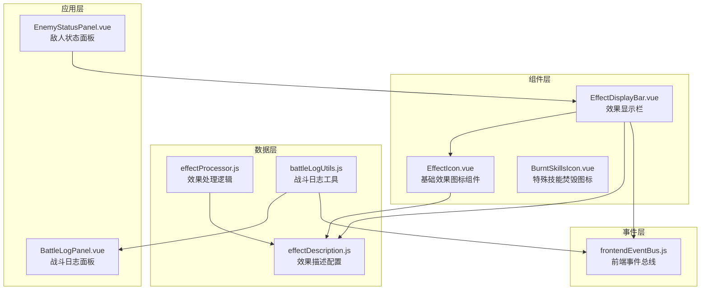
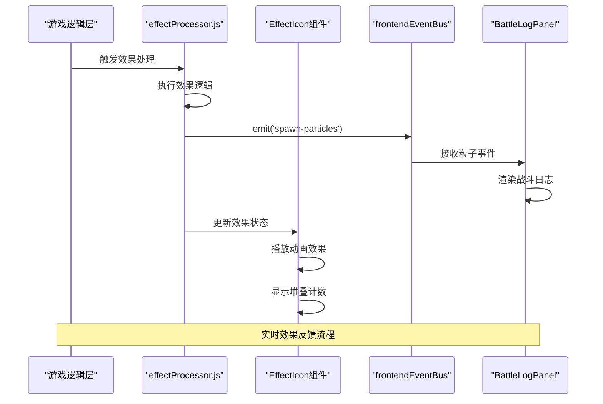
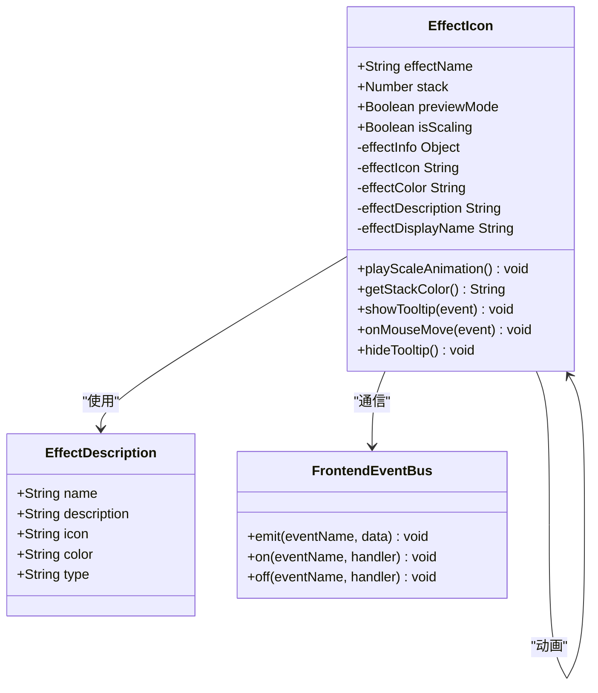
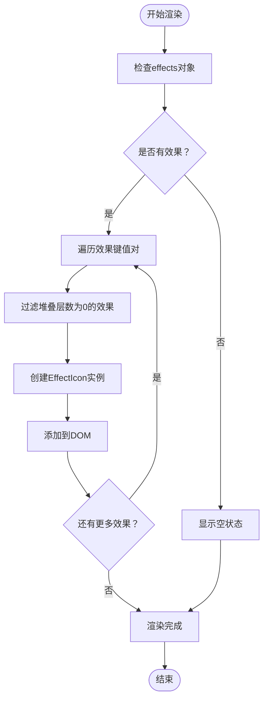
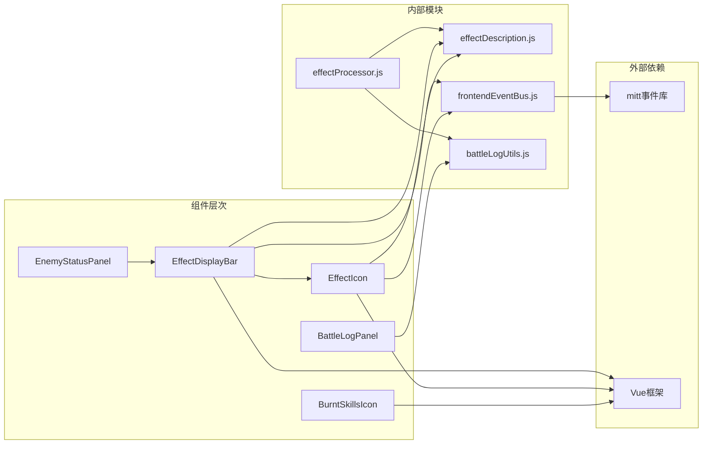

# 图标类组件

<cite>
**本文档引用的文件**
- [EffectIcon.vue](file://src/components/global/EffectIcon.vue)
- [BurntSkillsIcon.vue](file://src/components/global/BurntSkillsIcon.vue)
- [EffectDisplayBar.vue](file://src/components/global/EffectDisplayBar.vue)
- [effectDescription.js](file://src/data/effectDescription.js)
- [effectProcessor.js](file://src/data/effectProcessor.js)
- [BattleLogPanel.vue](file://src/components/battle/BattleLogPanel.vue)
- [EnemyStatusPanel.vue](file://src/components/battle/EnemyStatusPanel.vue)
- [frontendEventBus.js](file://src/frontendEventBus.js)
- [battleLogUtils.js](file://src/data/battleLogUtils.js)
</cite>

## 目录
1. [简介](#简介)
2. [项目结构](#项目结构)
3. [核心组件](#核心组件)
4. [架构概览](#架构概览)
5. [详细组件分析](#详细组件分析)
6. [依赖关系分析](#依赖关系分析)
7. [性能考虑](#性能考虑)
8. [故障排除指南](#故障排除指南)
9. [结论](#结论)

## 简介

EffectIcon组件是RuneTales虚拟实验室游戏中的核心视觉反馈组件，专门用于展示各类状态效果的图标。该组件通过预定义的图标映射表，实现了从效果名称到视觉图标的动态匹配机制，为玩家提供了直观的状态效果可视化体验。

组件系统采用模块化设计，支持多种效果类型（增益、减益、中性效果），并具备良好的可扩展性，能够轻松添加新的效果类型。通过与游戏数据层的紧密集成，EffectIcon不仅展示了静态的视觉效果，还能响应实时的游戏状态变化，提供动态的视觉反馈。

## 项目结构

图标类组件在项目中的组织结构体现了清晰的分层设计理念：



**图表来源**
- [EffectIcon.vue](file://src/components/global/EffectIcon.vue#L1-L116)
- [EffectDisplayBar.vue](file://src/components/global/EffectDisplayBar.vue#L1-L154)
- [effectDescription.js](file://src/data/effectDescription.js#L1-L301)

**章节来源**
- [EffectIcon.vue](file://src/components/global/EffectIcon.vue#L1-L116)
- [BurntSkillsIcon.vue](file://src/components/global/BurntSkillsIcon.vue#L1-L113)
- [EffectDisplayBar.vue](file://src/components/global/EffectDisplayBar.vue#L1-L154)

## 核心组件

### EffectIcon组件

EffectIcon是整个图标系统的核心组件，负责展示单个状态效果的视觉表现。该组件通过props接收效果名称、堆叠层数等参数，并根据预定义的映射表生成相应的图标和颜色。

主要特性：
- **动态图标生成**：基于效果名称从effectDescription.js获取对应的图标字符
- **颜色系统**：支持自定义颜色方案，增强视觉辨识度
- **堆叠计数**：显示效果的层数，支持正负值
- **动画效果**：当堆叠层数发生变化时自动播放缩放动画
- **交互功能**：鼠标悬停时显示详细描述信息

### BurntSkillsIcon组件

BurntSkillsIcon是一个特殊的图标组件，专门用于展示技能焚毁状态。该组件采用了独特的视觉设计，使用黑洞图标（🕳️）配合数字计数器来表示已焚毁的技能数量。

主要特性：
- **特殊视觉设计**：使用黑洞图标象征技能焚毁
- **计数显示**：精确显示已焚毁技能的数量
- **预览功能**：鼠标悬停时显示具体的焚毁技能列表
- **动画效果**：当计数变化时播放缩放动画
- **交互功能**：支持点击事件处理

**章节来源**
- [EffectIcon.vue](file://src/components/global/EffectIcon.vue#L1-L116)
- [BurntSkillsIcon.vue](file://src/components/global/BurntSkillsIcon.vue#L1-L113)

## 架构概览

图标类组件系统采用了事件驱动的架构模式，通过前端事件总线实现组件间的松耦合通信：



**图表来源**
- [effectProcessor.js](file://src/data/effectProcessor.js#L1-L357)
- [frontendEventBus.js](file://src/frontendEventBus.js#L1-L9)
- [BattleLogPanel.vue](file://src/components/battle/BattleLogPanel.vue#L1-L204)

## 详细组件分析

### EffectIcon组件深度分析

EffectIcon组件展现了优秀的面向对象设计原则和响应式编程实践：



**图表来源**
- [EffectIcon.vue](file://src/components/global/EffectIcon.vue#L10-L116)
- [effectDescription.js](file://src/data/effectDescription.js#L1-L301)
- [frontendEventBus.js](file://src/frontendEventBus.js#L1-L9)

#### Props定义与验证

EffectIcon组件通过严格的props定义确保数据的正确性：

```javascript
props: {
  effectName: {
    type: String,
    required: true
  },
  stack: {
    type: Number,
    default: 0
  },
  previewMode: {
    type: Boolean,
    default: true
  }
}
```

#### 计算属性系统

组件使用计算属性来处理复杂的逻辑转换：

```javascript
computed: {
  effectInfo() {
    return effectDescriptions[this.effectName] || {};
  },
  effectIcon() {
    return this.effectInfo.icon || '❓';
  },
  effectColor() {
    return this.effectInfo.color || '#000000';
  },
  effectDescription() {
    return this.effectInfo.description || '未知效果';
  },
  effectDisplayName() {
    return this.effectInfo.name || this.effectName;
  }
}
```

#### 堆叠计数的颜色逻辑

EffectIcon实现了智能的颜色判断逻辑，根据堆叠层数的不同状态返回相应的颜色：

```javascript
getStackColor() {
  if(this.stack == 0) return this.effectColor;
  if(this.stack > 0) return 'green';
  if(this.stack < 0) return 'red'; 
  return 'gray'; 
}
```

### EffectDisplayBar组件分析

EffectDisplayBar组件负责批量展示多个效果图标，体现了组合模式的设计思想：



**图表来源**
- [EffectDisplayBar.vue](file://src/components/global/EffectDisplayBar.vue#L1-L154)

#### 效果变化检测机制

EffectDisplayBar实现了智能的效果变化检测，能够识别效果的增减并触发相应的动画：

```javascript
watch: {
  effects: {
    deep: true,
    handler(newVal) {
      this.handleEffectsChanged(newVal, this.previousEffects);
      this.previousEffects = JSON.parse(JSON.stringify(newVal));
    }
  }
}
```

#### 效果过期动画系统

当某个效果的堆叠层数降为0时，组件会触发粒子效果动画：

```javascript
playEffectExpiredAnimation(effectName) {
  const effectInfo = effectDescriptions[effectName] || {};
  const effectColor = effectInfo.color || '#000000';
  const effectIcon = effectInfo.icon || '❓';
  
  // 创建粒子效果
  const particles = [{
    absoluteX: centerX,
    absoluteY: centerY,
    vx: (Math.random() - 0.5) * 30,
    vy: -50,
    gravity: 50,
    life: 1500,
    text: `${effectIcon} 消失`,
    extraStyles: {
      color: effectColor,
      fontWeight: 'bold',
      fontSize: '16px'
    }
  }];
  
  frontendEventBus.emit('spawn-particles', particles);
}
```

**章节来源**
- [EffectIcon.vue](file://src/components/global/EffectIcon.vue#L1-L116)
- [EffectDisplayBar.vue](file://src/components/global/EffectDisplayBar.vue#L1-L154)

### BurntSkillsIcon组件分析

BurntSkillsIcon组件展现了特殊场景下的组件设计模式：

```mermaid
stateDiagram-v2
[*] --> Idle : 初始化
Idle --> Hover : mouseenter
Hover --> Preview : 显示预览
Preview --> Hover : mouseleave
Hover --> Click : click
Click --> [*] : 触发事件
Preview --> Click : click
Click --> [*] : 触发事件
note right of Preview
显示焚毁技能列表
包含技能名称
支持最大宽度限制
end note
```

**图表来源**
- [BurntSkillsIcon.vue](file://src/components/global/BurntSkillsIcon.vue#L1-L113)

#### 动画触发机制

组件使用CSS动画类来实现缩放效果：

```javascript
triggerBump(el) {
  if (!el) return;
  el.classList.remove('stat-bump');
  // 强制回流
  // eslint-disable-next-line no-unused-expressions
  el.offsetWidth;
  el.classList.add('stat-bump');
  el.addEventListener('animationend', () => {
    el.classList.remove('stat-bump');
  }, { once: true });
}
```

#### 预览功能实现

当用户悬停在图标上时，组件会显示详细的焚毁技能列表：

```javascript
onEnter(e) {
  this.showPreview = true;
  const listHtml = this.names && this.names.length
      ? `<ul style='padding-left:16px;margin:6px 0;'>${this.names.map(n => `<li>${n}</li>`).join('')}</ul>`
      : '';
  frontendEventBus.emit('tooltip:show', {
    name: '坟地',
    text: `已焚毁技能：<strong>${this.count}</strong> 张${listHtml}`,
    color: '#cd00c3',
    x: e.clientX,
    y: e.clientY,
    maxWidth: 260
  });
}
```

**章节来源**
- [BurntSkillsIcon.vue](file://src/components/global/BurntSkillsIcon.vue#L1-L113)

## 依赖关系分析

图标类组件系统的依赖关系展现了清晰的分层架构：



**图表来源**
- [EffectIcon.vue](file://src/components/global/EffectIcon.vue#L1-L15)
- [EffectDisplayBar.vue](file://src/components/global/EffectDisplayBar.vue#L1-L15)
- [frontendEventBus.js](file://src/frontendEventBus.js#L1-L9)

**章节来源**
- [EffectIcon.vue](file://src/components/global/EffectIcon.vue#L1-L15)
- [EffectDisplayBar.vue](file://src/components/global/EffectDisplayBar.vue#L1-L15)
- [BurntSkillsIcon.vue](file://src/components/global/BurntSkillsIcon.vue#L1-L15)

## 性能考虑

### 渲染优化策略

1. **虚拟DOM优化**：EffectIcon组件使用Vue的响应式系统，只在必要时重新渲染
2. **事件委托**：EffectDisplayBar使用事件委托减少事件监听器数量
3. **懒加载**：只有在需要时才创建和显示粒子效果
4. **内存管理**：及时清理事件监听器和定时器

### 动画性能优化

1. **CSS3硬件加速**：使用transform属性触发GPU加速
2. **will-change属性**：提前声明动画元素的变化
3. **动画队列管理**：避免同时触发大量动画
4. **帧率控制**：合理设置动画持续时间和缓动函数

## 故障排除指南

### 常见问题诊断

1. **图标不显示**
   - 检查effectDescription.js中是否定义了对应的效果
   - 确认堆叠层数不是0
   - 验证CSS样式是否正确加载

2. **动画异常**
   - 检查CSS动画类是否存在
   - 确认JavaScript动画逻辑是否正确执行
   - 验证事件总线连接是否正常

3. **事件响应失败**
   - 检查frontendEventBus的初始化
   - 确认事件监听器是否正确绑定
   - 验证事件传播路径

**章节来源**
- [EffectIcon.vue](file://src/components/global/EffectIcon.vue#L70-L85)
- [EffectDisplayBar.vue](file://src/components/global/EffectDisplayBar.vue#L70-L100)

## 结论

EffectIcon组件系统展现了现代前端开发的最佳实践，通过模块化设计、事件驱动架构和响应式编程，实现了高效、可维护的状态效果可视化解决方案。

该系统的主要优势包括：

1. **高度可扩展性**：通过effectDescription.js配置文件，可以轻松添加新的效果类型
2. **良好的用户体验**：丰富的动画效果和交互功能提升了游戏体验
3. **代码质量**：遵循Vue.js最佳实践，代码结构清晰，易于维护
4. **性能优化**：合理的渲染策略和动画管理确保了流畅的用户体验

未来的发展方向可以考虑：
- 增强移动端适配
- 优化大型效果列表的渲染性能
- 添加更多的视觉效果选项
- 改进无障碍访问支持

这个图标类组件系统为RuneTales虚拟实验室游戏提供了坚实的基础，确保了游戏状态的准确传达和良好的用户体验。