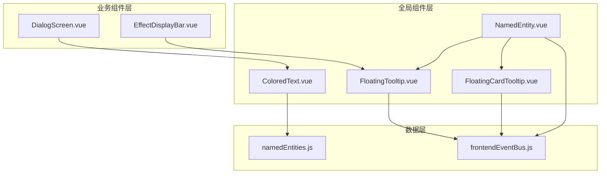
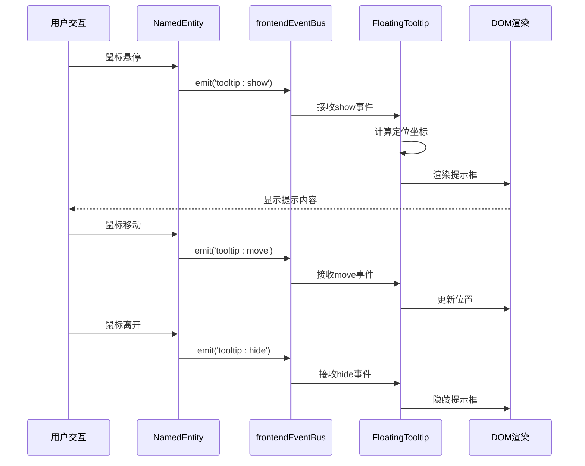
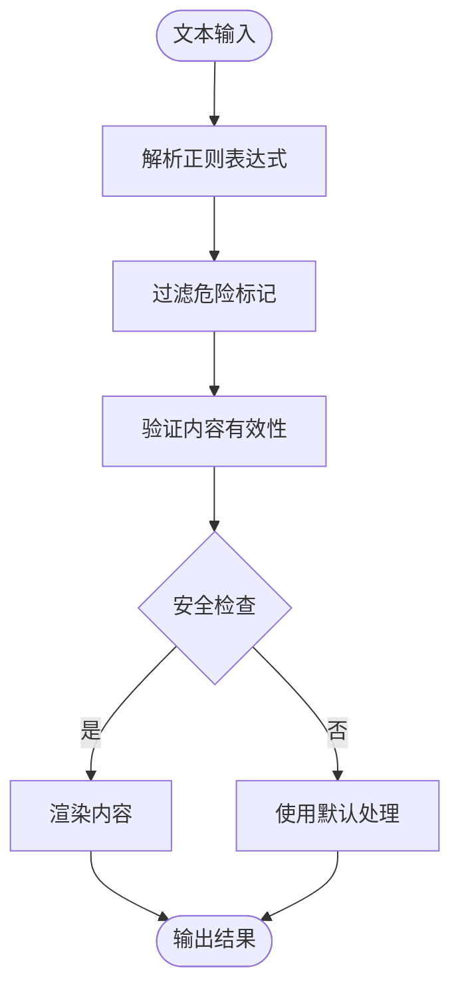
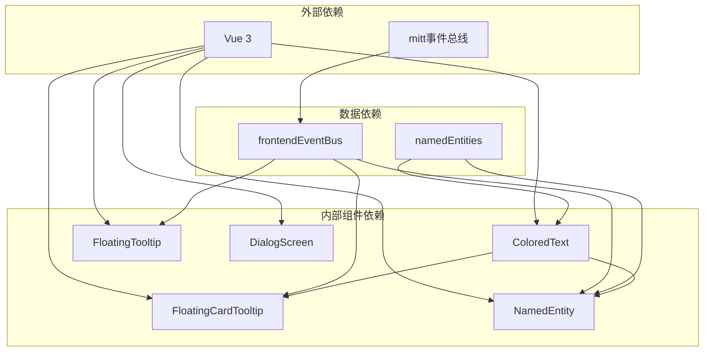

# 文本类组件

<cite>
**本文档引用的文件**
- [ColoredText.vue](file://src/components/global/ColoredText.vue)
- [FloatingTooltip.vue](file://src/components/global/FloatingTooltip.vue)
- [FloatingCardTooltip.vue](file://src/components/global/FloatingCardTooltip.vue)
- [NamedEntity.vue](file://src/components/global/NamedEntity.vue)
- [DialogScreen.vue](file://src/components/end/DialogScreen.vue)
- [frontendEventBus.js](file://src/frontendEventBus.js)
- [namedEntities.js](file://src/data/namedEntities.js)
</cite>

## 目录
1. [简介](#简介)
2. [项目结构](#项目结构)
3. [核心组件](#核心组件)
4. [架构概览](#架构概览)
5. [详细组件分析](#详细组件分析)
6. [依赖关系分析](#依赖关系分析)
7. [性能考虑](#性能考虑)
8. [故障排除指南](#故障排除指南)
9. [结论](#结论)

## 简介

本文档深入分析了RTVL游戏中的文本类组件系统，重点关注两个核心组件：`ColoredText`富文本着色组件和`FloatingTooltip`浮动提示框组件。这些组件为游戏提供了丰富的文本渲染能力和交互式的信息展示功能，特别是在对话系统和UI提示场景中的协同使用。

`ColoredText`组件实现了基于语义标签的富文本着色功能，支持多种标记语法（如`/<color>{content}`、`/effect{effectName}`、`/named{entityName}`、`/skill{skillName}`），并通过正则表达式解析引擎实现动态样式注入。`FloatingTooltip`组件则提供了智能定位算法和内容插槽设计，支持多种触发交互模式。

## 项目结构

文本类组件位于项目的全局组件目录中，与其他UI组件形成统一的设计体系：



**图表来源**
- [ColoredText.vue](file://src/components/global/ColoredText.vue#L1-L81)
- [FloatingTooltip.vue](file://src/components/global/FloatingTooltip.vue#L1-L125)
- [DialogScreen.vue](file://src/components/end/DialogScreen.vue#L1-L133)

## 核心组件

### ColoredText 组件

`ColoredText`组件是整个文本渲染系统的核心，负责解析和渲染带有语义标记的富文本内容。

#### 主要特性：
- **多格式解析**：支持颜色标记、效果图标、命名实体、技能卡片等多种语义标签
- **正则表达式引擎**：使用四个独立的正则表达式分别处理不同类型的标记
- **动态样式注入**：根据解析结果动态应用CSS类和内联样式
- **安全性防护**：通过严格的标记解析避免XSS攻击

#### 解析流程：
1. **预处理阶段**：将输入文本分割为多个部分
2. **标记识别**：使用正则表达式识别不同类型的语义标记
3. **内容提取**：提取标记中的实际内容和参数
4. **类型分类**：将内容分类为文本、颜色、效果、命名实体或技能
5. **排序合并**：按原始文本顺序重新组合解析结果

**章节来源**
- [ColoredText.vue](file://src/components/global/ColoredText.vue#L1-L81)

### FloatingTooltip 组件

`FloatingTooltip`组件提供了智能定位和内容展示功能，是整个提示系统的基础组件。

#### 核心功能：
- **智能定位算法**：自动计算最佳显示位置，确保不超出视口边界
- **事件驱动架构**：通过前端事件总线实现组件间的解耦通信
- **响应式布局**：支持最大宽度限制和自适应尺寸
- **过渡动画**：提供淡入淡出的视觉反馈

#### 定位算法：
1. **基础定位**：根据鼠标坐标和偏移量计算初始位置
2. **边界检测**：检查是否超出视口边界
3. **自动调整**：将超出边界的元素移动到安全区域
4. **约束应用**：应用最小边距和最大尺寸约束

**章节来源**
- [FloatingTooltip.vue](file://src/components/global/FloatingTooltip.vue#L1-L125)

## 架构概览

文本类组件系统采用事件驱动的微服务架构，通过前端事件总线实现组件间的松耦合通信：



**图表来源**
- [NamedEntity.vue](file://src/components/global/NamedEntity.vue#L35-L55)
- [FloatingTooltip.vue](file://src/components/global/FloatingTooltip.vue#L65-L85)
- [frontendEventBus.js](file://src/frontendEventBus.js#L1-L9)

## 详细组件分析

### ColoredText 组件深度分析

#### 正则解析逻辑

`ColoredText`组件使用四个专门的正则表达式来处理不同的语义标记：

```javascript
// 颜色标记正则表达式
const colorRegex = /\/(\w+)\{([^}]+)\}/g;

// 效果标记正则表达式  
const effectRegex = /\/effect\{([^}]+)\}/g;

// 命名实体标记正则表达式
const namedRegex = /\/named\{([^}]+)\}/g;

// 技能标记正则表达式
const skillRegex = /\/skill\{([^}]+)\}/g;
```

每个正则表达式都有特定的用途和匹配规则：

1. **颜色标记**：`/<color>{content}` - 支持预定义的颜色类
2. **效果标记**：`/effect{effectName}` - 显示效果图标
3. **命名实体**：`/named{entityName}` - 显示命名实体信息
4. **技能标记**：`/skill{skillName}` - 显示技能卡片，支持功率变化标识

#### 动态CSS类注入机制

组件通过Vue的条件渲染指令实现动态样式注入：

```vue
<span v-if="part.type === 'text'" :style="part.style">{{ part.content }}</span>
<span v-else-if="part.type === 'color'" :class="part.color">{{ part.content }}</span>
<EffectIcon v-else-if="part.type === 'effect'" :effect-name="part.effectName" />
<NamedEntity v-else-if="part.type === 'named'" :entity-name="part.content" />
<CardIcon v-else-if="part.type === 'skill'" :skill-name="part.content" :power-delta="part.powerDelta || 0" />
```

这种设计允许：
- **类型安全**：每种内容类型都有明确的渲染方式
- **性能优化**：只渲染必要的子组件
- **扩展性**：易于添加新的内容类型

#### 安全性考虑

组件实现了多层安全防护机制：

1. **标记过滤**：排除危险的标记类型（effect、named、skill）
2. **内容转义**：通过模板语法自动转义HTML内容
3. **边界检查**：验证正则匹配结果的有效性
4. **默认处理**：对无效标记提供安全的默认处理



**图表来源**
- [ColoredText.vue](file://src/components/global/ColoredText.vue#L20-L40)

**章节来源**
- [ColoredText.vue](file://src/components/global/ColoredText.vue#L1-L81)

### FloatingTooltip 组件深度分析

#### 定位算法详解

`FloatingTooltip`组件的定位算法是其核心功能之一，确保提示框始终在用户视野内：

```javascript
computed: {
  tooltipStyle() {
    const margin = 8;
    const vw = window.innerWidth || 0;
    const vh = window.innerHeight || 0;
    
    let left = this.x + this.offset.x;
    let top = this.y + this.offset.y;
    
    // 边界检测和自动调整
    if (left + this.maxWidth + margin > vw) {
      left = Math.max(margin, vw - this.maxWidth - margin);
    }
    if (top + 120 + margin > vh) {
      top = Math.max(margin, vh - 120 - margin);
    }
    
    return {
      left: left + 'px',
      top: top + 'px',
      maxWidth: this.maxWidth + 'px'
    };
  }
}
```

算法特点：
- **动态边界检测**：实时检测视口尺寸变化
- **智能调整**：自动将超出边界的元素移动到安全区域
- **固定约束**：应用最小边距和最大尺寸约束
- **性能优化**：使用简单的数学运算而非复杂的测量

#### 内容插槽设计

组件采用简洁的内容插槽设计，支持灵活的内容定制：

```vue
<div class="floating-tooltip" :style="tooltipStyle">
  <div class="tooltip-name" :style="{ color: color }">{{ name }}</div>
  <div class="tooltip-description" v-html="text"></div>
</div>
```

设计原则：
- **分离关注点**：名称和描述分开显示
- **样式控制**：支持动态颜色和字体大小
- **HTML渲染**：支持富文本内容（注意安全性）
- **响应式设计**：自动调整最大宽度

#### 触发交互模式

组件通过前端事件总线支持多种触发交互模式：

1. **显示模式**：`tooltip:show` - 显示提示框
2. **移动模式**：`tooltip:move` - 更新位置
3. **隐藏模式**：`tooltip:hide` - 隐藏提示框

每种模式都有相应的事件处理器：

```javascript
methods: {
  onShow(payload) {
    if (!payload) return;
    const { name, text, color, x, y, maxWidth } = payload;
    this.name = name || '';
    this.text = text || '';
    this.color = color || '#ffffff';
    if (typeof maxWidth === 'number') this.maxWidth = maxWidth;
    this.x = x ?? this.x;
    this.y = y ?? this.y;
    this.visible = true;
  },
  onMove(payload) {
    if (!payload) return;
    const { x, y } = payload;
    if (typeof x === 'number') this.x = x;
    if (typeof y === 'number') this.y = y;
  },
  onHide() {
    this.visible = false;
  }
}
```

**章节来源**
- [FloatingTooltip.vue](file://src/components/global/FloatingTooltip.vue#L1-L125)

### NamedEntity 组件分析

`NamedEntity`组件是`FloatingTooltip`系统的典型应用，展示了组件间的协作模式：

#### 事件触发机制

组件通过鼠标事件触发提示框显示：

```javascript
methods: {
  showTooltip(event) {
    if (!this.entityInfo.description) return;
    frontendEventBus.emit('tooltip:show', {
      name: this.entityDisplayName,
      text: this.entityDescription,
      color: this.entityColor,
      x: event.clientX,
      y: event.clientY
    });
  },
  onMouseMove(event) {
    frontendEventBus.emit('tooltip:move', { x: event.clientX, y: event.clientY });
  },
  hideTooltip() {
    frontendEventBus.emit('tooltip:hide');
  }
}
```

#### 数据绑定和计算属性

组件使用计算属性实现数据的动态绑定：

```javascript
computed: {
  entityInfo() {
    return namedEntities[this.entityName] || {};
  },
  entityIcon() {
    return this.entityInfo.icon || '❓';
  },
  entityColor() {
    return this.entityInfo.color || '#000000';
  },
  entityDescription() {
    return this.entityInfo.description || '未知实体';
  },
  entityDisplayName() {
    return this.entityInfo.name || this.entityName;
  }
}
```

这种设计的优势：
- **数据一致性**：所有相关数据都来自同一个数据源
- **默认值处理**：提供合理的默认值避免未定义情况
- **可维护性**：集中管理实体数据

**章节来源**
- [NamedEntity.vue](file://src/components/global/NamedEntity.vue#L1-L75)

## 依赖关系分析

文本类组件系统具有清晰的依赖层次结构：



**图表来源**
- [ColoredText.vue](file://src/components/global/ColoredText.vue#L15-L20)
- [FloatingTooltip.vue](file://src/components/global/FloatingTooltip.vue#L5-L6)
- [frontendEventBus.js](file://src/frontendEventBus.js#L1-L9)

**章节来源**
- [ColoredText.vue](file://src/components/global/ColoredText.vue#L15-L20)
- [FloatingTooltip.vue](file://src/components/global/FloatingTooltip.vue#L5-L6)
- [NamedEntity.vue](file://src/components/global/NamedEntity.vue#L5-L6)

## 性能考虑

### 渲染性能优化

1. **虚拟DOM优化**：使用Vue的条件渲染减少不必要的DOM操作
2. **事件节流**：对频繁触发的事件（如mousemove）进行节流处理
3. **内存管理**：及时清理事件监听器避免内存泄漏
4. **懒加载**：按需加载子组件（如EffectIcon、CardIcon）

### 计算性能优化

1. **正则表达式缓存**：避免重复编译正则表达式
2. **字符串操作优化**：使用高效的字符串拼接和截取方法
3. **对象属性缓存**：缓存计算属性的结果避免重复计算
4. **批量更新**：将多个状态更新合并为单次渲染

### 内存使用优化

1. **事件总线管理**：及时移除不再需要的事件监听器
2. **组件生命周期**：正确处理组件的挂载和卸载
3. **数据结构优化**：使用合适的数据结构减少内存占用
4. **垃圾回收友好**：避免创建大量临时对象

## 故障排除指南

### 常见问题及解决方案

#### ColoredText 组件问题

**问题1：颜色标记不生效**
- **原因**：标记语法错误或颜色类不存在
- **解决方案**：检查正则表达式匹配，确保颜色类已定义

**问题2：内容显示异常**
- **原因**：特殊字符未正确转义
- **解决方案**：使用Vue的内置转义机制或手动转义

**问题3：性能问题**
- **原因**：复杂文本导致大量正则匹配
- **解决方案**：优化正则表达式，考虑分批处理

#### FloatingTooltip 组件问题

**问题1：提示框位置异常**
- **原因**：边界检测算法错误或视口尺寸获取失败
- **解决方案**：检查窗口尺寸获取逻辑，验证边界检测公式

**问题2：事件通信失败**
- **原因**：事件总线连接问题或事件名称错误
- **解决方案**：检查事件监听器注册，验证事件名称一致性

**问题3：样式冲突**
- **原因**：CSS选择器优先级问题或样式覆盖
- **解决方案**：使用更具体的选择器，检查样式作用域

**章节来源**
- [ColoredText.vue](file://src/components/global/ColoredText.vue#L20-L40)
- [FloatingTooltip.vue](file://src/components/global/FloatingTooltip.vue#L25-L45)

## 结论

RTVL游戏的文本类组件系统展现了现代前端开发的最佳实践，通过精心设计的架构和组件化方案，实现了功能丰富且性能优异的文本渲染和提示系统。

### 主要优势

1. **模块化设计**：清晰的组件边界和职责分离
2. **事件驱动架构**：松耦合的组件通信机制
3. **性能优化**：多层次的性能优化策略
4. **可维护性**：良好的代码组织和文档支持
5. **扩展性**：易于添加新功能和内容类型

### 技术亮点

- **智能解析引擎**：基于正则表达式的高效文本解析
- **动态样式注入**：灵活的样式应用机制
- **智能定位算法**：确保用户体验的提示框定位
- **安全性防护**：多层安全机制保护应用安全
- **响应式设计**：适应不同设备和屏幕尺寸

### 发展建议

1. **性能监控**：添加性能指标监控和报告
2. **单元测试**：完善单元测试覆盖率
3. **文档增强**：补充详细的API文档和使用示例
4. **国际化支持**：考虑多语言环境下的文本处理
5. **无障碍支持**：增强ARIA标签和键盘导航支持

这个文本类组件系统为RTVL游戏提供了坚实的技术基础，不仅满足了当前的功能需求，也为未来的功能扩展和性能优化奠定了良好的技术架构。