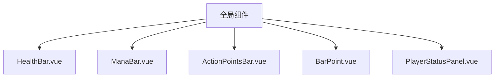
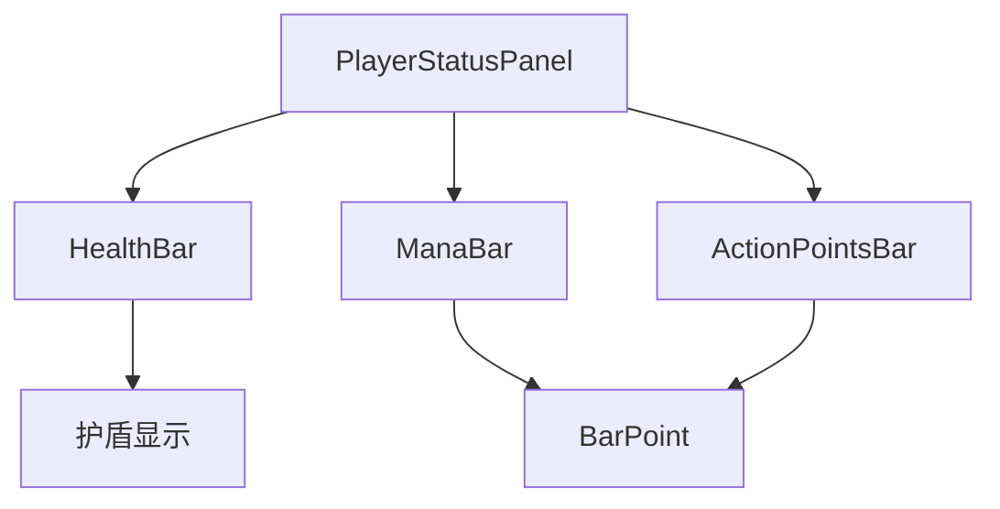
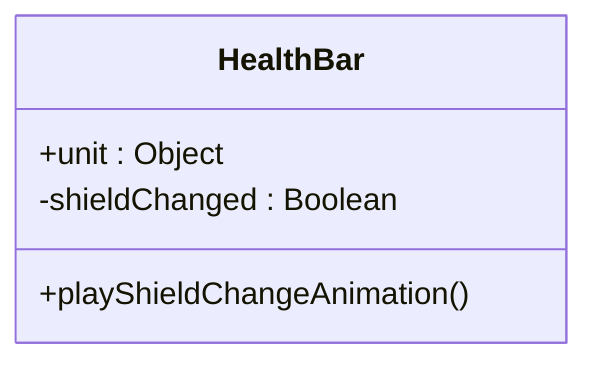
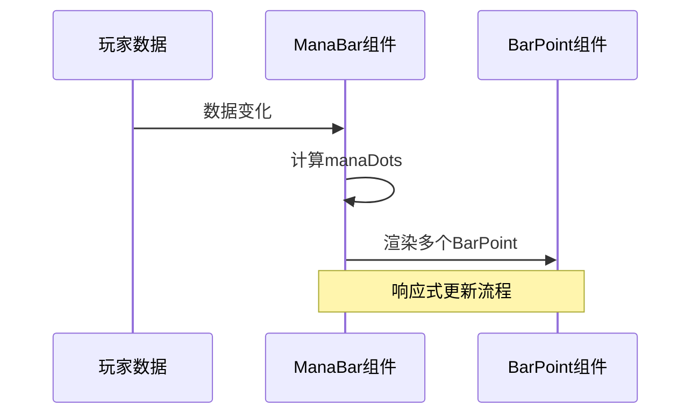
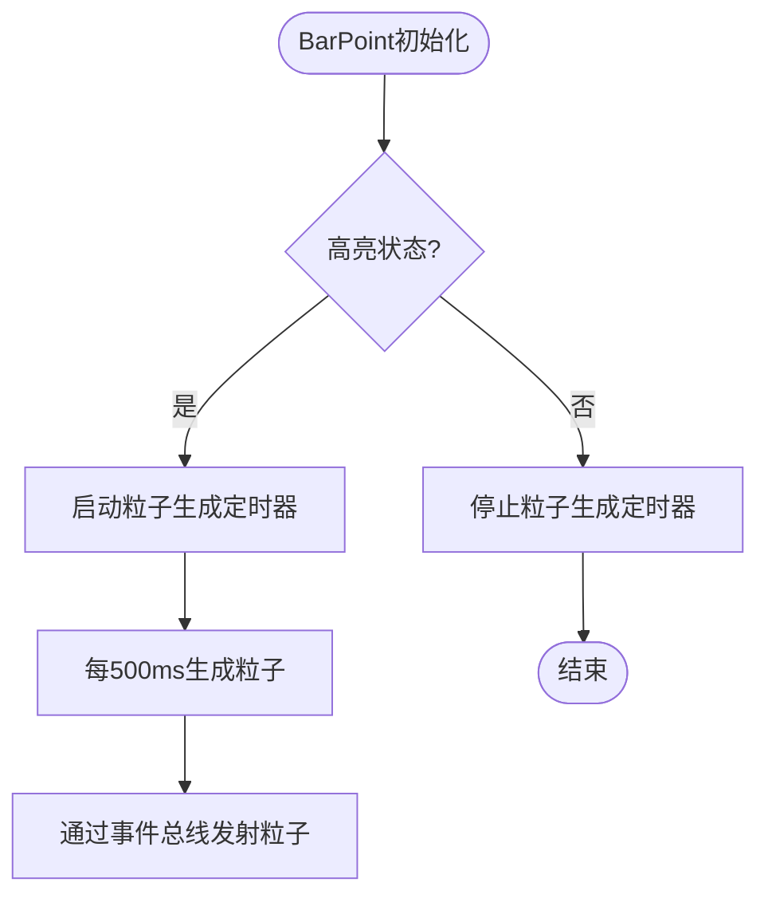
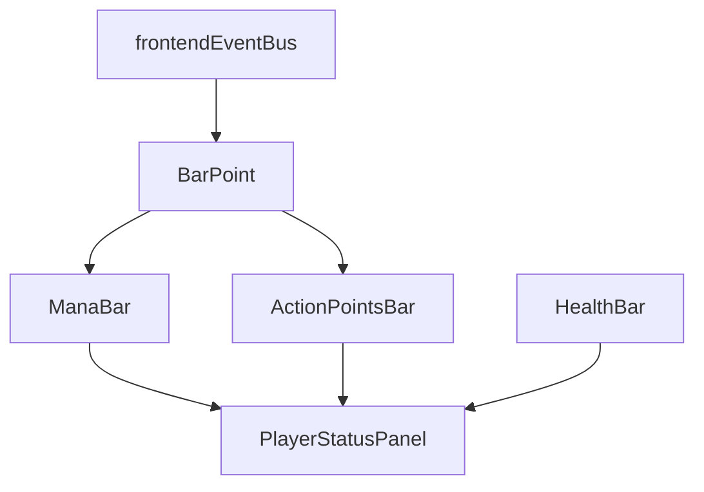

# 状态条组件

<cite>
**本文档引用的文件**  
- [HealthBar.vue](file://src/components/global/HealthBar.vue)
- [ManaBar.vue](file://src/components/global/ManaBar.vue)
- [ActionPointsBar.vue](file://src/components/global/ActionPointsBar.vue)
- [BarPoint.vue](file://src/components/global/BarPoint.vue)
- [PlayerStatusPanel.vue](file://src/components/global/PlayerStatusPanel.vue)
- [frontendEventBus.js](file://src/frontendEventBus.js)
- [common.css](file://src/assets/common.css)
- [player.js](file://src/data/player.js)
</cite>

## 目录
1. [引言](#引言)
2. [项目结构](#项目结构)
3. [核心组件](#核心组件)
4. [架构概览](#架构概览)
5. [详细组件分析](#详细组件分析)
6. [依赖分析](#依赖分析)
7. [性能考虑](#性能考虑)
8. [故障排除指南](#故障排除指南)
9. [结论](#结论)

## 引言
本文档系统化地记录了HealthBar、ManaBar和ActionPointsBar三大状态条组件的统一设计模式。重点说明这些组件如何基于BarPoint基础绘图单元构建，以及其数据绑定机制、响应式更新策略、动画实现和在UI布局中的集成方式。

## 项目结构
项目结构清晰地将状态条组件放置在`src/components/global/`目录下，表明它们是全局可复用的UI元素。这些组件通过Vue的响应式系统与游戏数据模型进行绑定，实现了动态更新。

**图示来源**  
- [HealthBar.vue](file://src/components/global/HealthBar.vue)
- [ManaBar.vue](file://src/components/global/ManaBar.vue)
- [ActionPointsBar.vue](file://src/components/global/ActionPointsBar.vue)
- [BarPoint.vue](file://src/components/global/BarPoint.vue)
- [PlayerStatusPanel.vue](file://src/components/global/PlayerStatusPanel.vue)

**本节来源**  
- [HealthBar.vue](file://src/components/global/HealthBar.vue)
- [ManaBar.vue](file://src/components/global/ManaBar.vue)
- [ActionPointsBar.vue](file://src/components/global/ActionPointsBar.vue)

## 核心组件
三大状态条组件（HealthBar、ManaBar、ActionPointsBar）均采用一致的设计模式：通过props接收数据对象，利用Vue的计算属性和侦听器实现响应式更新，并通过CSS过渡实现平滑动画效果。

**本节来源**  
- [HealthBar.vue](file://src/components/global/HealthBar.vue#L1-L101)
- [ManaBar.vue](file://src/components/global/ManaBar.vue#L1-L120)
- [ActionPointsBar.vue](file://src/components/global/ActionPointsBar.vue#L1-L120)

## 架构概览
状态条组件的架构体现了组件化和复用的设计思想。BarPoint作为基础绘图单元被ManaBar和ActionPointsBar复用，而HealthBar则采用传统的进度条实现方式。所有状态条通过PlayerStatusPanel组件集成到玩家状态面板中。

**图示来源**  
- [PlayerStatusPanel.vue](file://src/components/global/PlayerStatusPanel.vue#L1-L216)
- [HealthBar.vue](file://src/components/global/HealthBar.vue#L1-L101)
- [ManaBar.vue](file://src/components/global/ManaBar.vue#L1-L120)
- [ActionPointsBar.vue](file://src/components/global/ActionPointsBar.vue#L1-L120)

## 详细组件分析
### 状态条组件分析
#### HealthBar组件
HealthBar组件采用传统的CSS进度条实现方式，通过动态设置`fill`元素的宽度来表示生命值比例。组件还包含护盾值显示和变化动画。

**图示来源**  
- [HealthBar.vue](file://src/components/global/HealthBar.vue#L1-L101)

#### ManaBar与ActionPointsBar组件
这两个组件采用点阵式设计，通过v-for循环渲染多个BarPoint组件。每个BarPoint的状态（填充、高亮）由计算属性动态决定。

**图示来源**  
- [ManaBar.vue](file://src/components/global/ManaBar.vue#L1-L120)
- [ActionPointsBar.vue](file://src/components/global/ActionPointsBar.vue#L1-L120)
- [BarPoint.vue](file://src/components/global/BarPoint.vue#L1-L175)

#### BarPoint基础单元
BarPoint作为可复用的基础绘图单元，支持填充状态、高亮状态和自定义颜色。当处于高亮状态时，会触发粒子生成效果。

**图示来源**  
- [BarPoint.vue](file://src/components/global/BarPoint.vue#L1-L175)

**本节来源**  
- [BarPoint.vue](file://src/components/global/BarPoint.vue#L1-L175)
- [ManaBar.vue](file://src/components/global/ManaBar.vue#L1-L120)
- [ActionPointsBar.vue](file://src/components/global/ActionPointsBar.vue#L1-L120)

## 依赖分析
状态条组件之间存在清晰的依赖关系。ManaBar和ActionPointsBar依赖于BarPoint组件，而PlayerStatusPanel组件则整合了所有状态条组件。

**图示来源**  
- [frontendEventBus.js](file://src/frontendEventBus.js#L1-L9)
- [BarPoint.vue](file://src/components/global/BarPoint.vue#L1-L175)
- [ManaBar.vue](file://src/components/global/ManaBar.vue#L1-L120)
- [ActionPointsBar.vue](file://src/components/global/ActionPointsBar.vue#L1-L120)
- [PlayerStatusPanel.vue](file://src/components/global/PlayerStatusPanel.vue#L1-L216)

**本节来源**  
- [frontendEventBus.js](file://src/frontendEventBus.js#L1-L9)
- [BarPoint.vue](file://src/components/global/BarPoint.vue#L1-L175)

## 性能考虑
状态条组件在性能方面做了多项优化：使用`v-bind`动态绑定样式减少DOM操作，通过`$nextTick`确保动画在DOM更新后触发，以及使用事件总线解耦粒子生成功能。

**本节来源**  
- [common.css](file://src/assets/common.css#L1-L28)
- [BarPoint.vue](file://src/components/global/BarPoint.vue#L1-L175)

## 故障排除指南
当状态条无法正确更新时，应检查以下方面：确保数据源对象正确传递、确认Vue的响应式系统正常工作、验证事件监听器是否正确注册。

**本节来源**  
- [player.js](file://src/data/player.js#L1-L226)
- [frontendEventBus.js](file://src/frontendEventBus.js#L1-L9)

## 结论
HealthBar、ManaBar和ActionPointsBar组件展示了两种不同的进度条实现模式：传统进度条和点阵式进度条。通过BarPoint基础单元的复用，实现了视觉风格的一致性和代码的可维护性。这种设计模式既满足了功能需求，又保证了良好的用户体验。