# 屏幕层组件

<cite>
**本文档中引用的文件**
- [App.vue](file://src/App.vue)
- [GameApp.vue](file://src/GameApp.vue)
- [BattleScreen.vue](file://src/components/battle/BattleScreen.vue)
- [RestScreen.vue](file://src/components/rest/RestScreen.vue)
- [StartScreen.vue](file://src/components/start/StartScreen.vue)
- [gameState.js](file://src/data/gameState.js)
- [frontendEventBus.js](file://src/frontendEventBus.js)
- [backendEventBus.js](file://src/backendEventBus.js)
</cite>

## 目录
1. [简介](#简介)
2. [项目架构概览](#项目架构概览)
3. [根组件分析](#根组件分析)
4. [屏幕组件架构](#屏幕组件架构)
5. [核心屏幕组件详解](#核心屏幕组件详解)
6. [状态管理系统](#状态管理系统)
7. [事件通信机制](#事件通信机制)
8. [生命周期管理](#生命周期管理)
9. [性能优化策略](#性能优化策略)
10. [故障排除指南](#故障排除指南)
11. [总结](#总结)

## 简介

本文档详细分析了游戏中的顶级屏幕组件系统，重点关注App.vue作为根组件如何通过GameApp.vue实现屏幕间的切换与状态管理。该系统采用Vue.js框架构建，实现了清晰的组件层次结构和高效的事件通信机制。

屏幕层组件是游戏用户界面的核心，负责管理不同游戏阶段的视觉呈现和用户交互。系统包含四个主要屏幕组件：开始屏幕（StartScreen）、战斗屏幕（BattleScreen）、休整屏幕（RestScreen）和结束屏幕（EndScreen），每个组件都有明确的职责分工和生命周期管理。

## 项目架构概览

游戏采用分层架构设计，屏幕层位于UI层的最上层，负责管理整个游戏的视觉状态和用户交互流程。

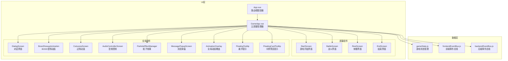

**图表来源**
- [App.vue](file://src/App.vue#L1-L14)
- [GameApp.vue](file://src/GameApp.vue#L1-L139)

## 根组件分析

### App.vue - 路由视图容器

App.vue作为Vue应用的根组件，采用了极简的设计理念，仅包含一个路由视图标签：

```javascript
<template>
  <!-- 路由视图 -->
  <router-view />
</template>
```

这种设计遵循了Vue Router的最佳实践，将路由控制完全交由路由配置管理，使应用具有更好的可维护性和扩展性。

**章节来源**
- [App.vue](file://src/App.vue#L1-L14)

### GameApp.vue - 主屏幕管理器

GameApp.vue是整个游戏界面的核心控制器，负责管理所有屏幕组件的渲染和状态切换。

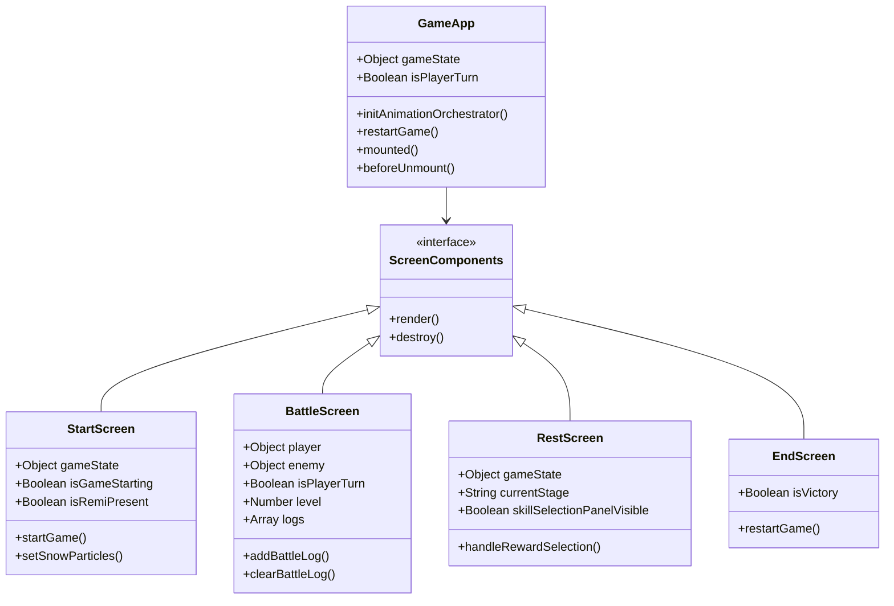

**图表来源**
- [GameApp.vue](file://src/GameApp.vue#L1-L139)
- [StartScreen.vue](file://src/components/start/StartScreen.vue#L1-L278)
- [BattleScreen.vue](file://src/components/battle/BattleScreen.vue#L1-L112)
- [RestScreen.vue](file://src/components/rest/RestScreen.vue#L1-L269)

GameApp.vue的核心功能包括：

1. **屏幕切换逻辑**：根据gameState.gameStage动态渲染相应的屏幕组件
2. **全局状态管理**：统一管理游戏状态和组件间的数据传递
3. **动画编排器初始化**：在组件挂载时初始化全局动画系统
4. **事件总线管理**：处理全局事件和状态同步

**章节来源**
- [GameApp.vue](file://src/GameApp.vue#L1-L139)

## 屏幕组件架构

### 屏幕组件层次结构

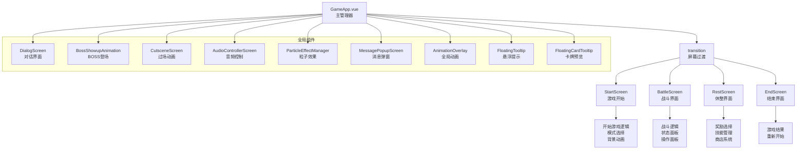

**图表来源**
- [GameApp.vue](file://src/GameApp.vue#L3-L25)

### 屏幕组件特性

每个屏幕组件都具有以下共同特性：

1. **条件渲染**：使用v-if/v-else-if实现屏幕间的互斥显示
2. **属性传递**：通过props接收父组件传递的游戏状态数据
3. **事件监听**：监听全局事件总线以响应游戏状态变化
4. **生命周期管理**：正确注册和注销事件监听器

## 核心屏幕组件详解

### StartScreen - 游戏开始界面

StartScreen负责处理游戏的初始加载和模式选择，提供了两种游戏模式：无限模式和故事模式。

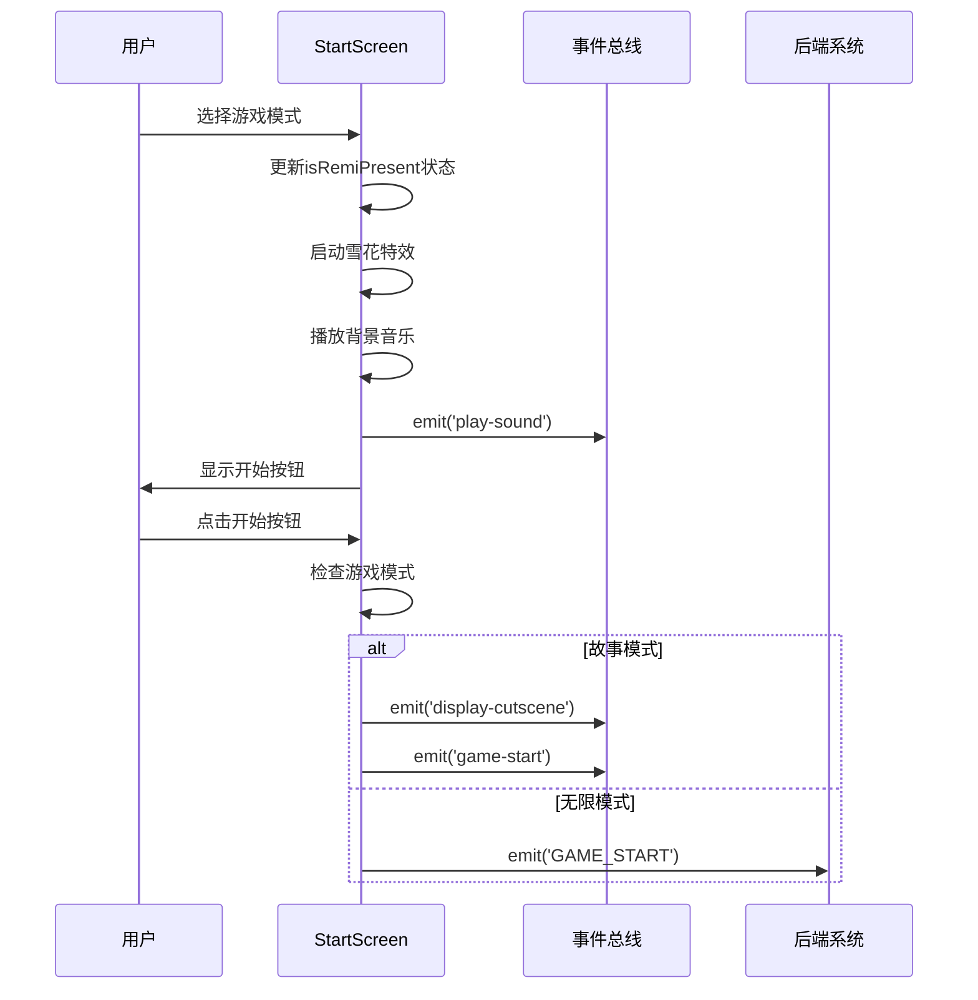

**图表来源**
- [StartScreen.vue](file://src/components/start/StartScreen.vue#L1-L278)

StartScreen的主要功能：

1. **模式选择**：提供无限模式和故事模式的选择开关
2. **视觉特效**：实现雪花粒子特效和背景动画
3. **音频控制**：根据模式切换播放不同的背景音乐
4. **过场动画**：故事模式下显示开场动画序列

**章节来源**
- [StartScreen.vue](file://src/components/start/StartScreen.vue#L1-L278)

### BattleScreen - 战斗界面

BattleScreen是战斗系统的主界面，负责显示战斗状态、操作面板和战斗日志。

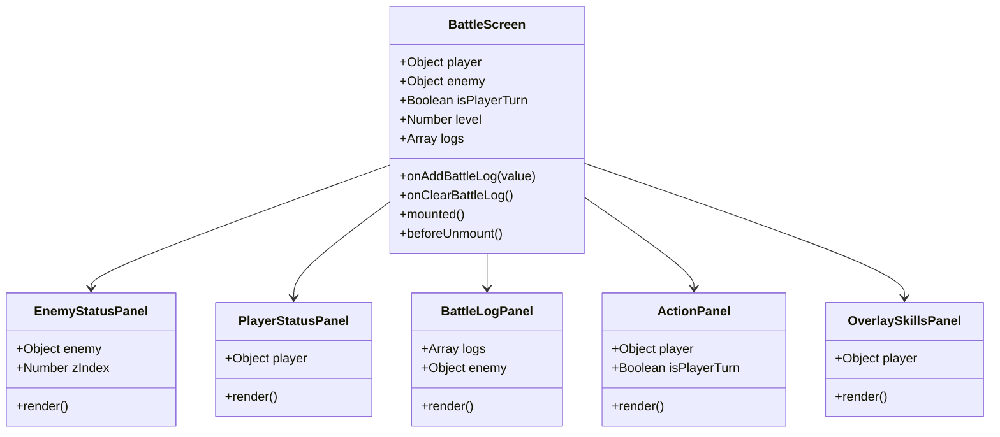

**图表来源**
- [BattleScreen.vue](file://src/components/battle/BattleScreen.vue#L1-L112)

BattleScreen的核心职责：

1. **状态面板管理**：显示玩家和敌人的状态信息
2. **战斗日志记录**：实时记录和显示战斗过程
3. **操作面板控制**：根据回合状态控制玩家操作权限
4. **事件监听**：监听战斗相关的前端事件

**章节来源**
- [BattleScreen.vue](file://src/components/battle/BattleScreen.vue#L1-L112)

### RestScreen - 休整界面

RestScreen管理战斗后的奖励选择流程，包括金钱奖励、突破奖励、技能奖励和能力奖励。

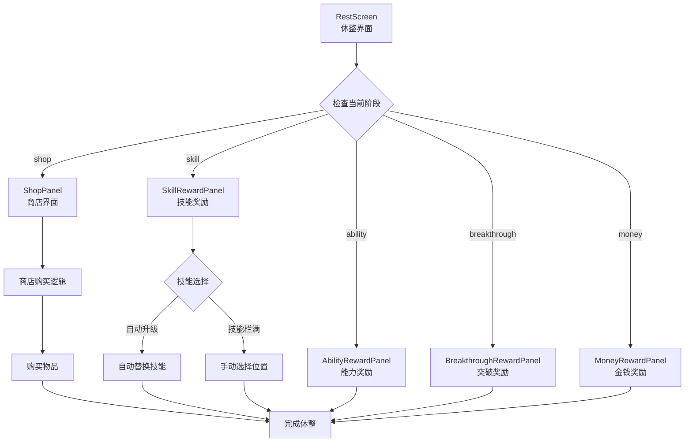

**图表来源**
- [RestScreen.vue](file://src/components/rest/RestScreen.vue#L1-L269)

RestScreen的复杂功能：

1. **多阶段奖励系统**：支持多种类型的奖励选择
2. **智能技能升级**：自动检测技能升级路径
3. **技能栏管理**：处理技能的添加、替换和排序
4. **商店系统**：集成物品购买和准备阶段

**章节来源**
- [RestScreen.vue](file://src/components/rest/RestScreen.vue#L1-L269)

## 状态管理系统

### gameState.js - 游戏状态核心

游戏状态管理采用前后端分离的设计，分别维护显示层状态和后端状态。

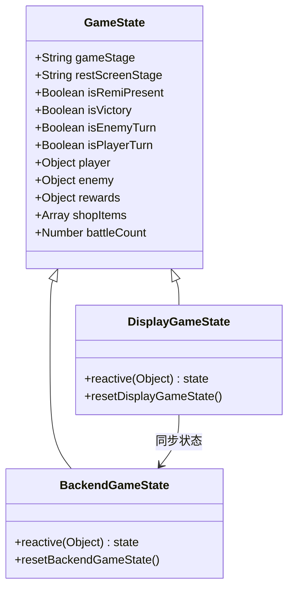

**图表来源**
- [gameState.js](file://src/data/gameState.js#L1-L75)

状态管理的关键特性：

1. **响应式设计**：使用Vue的reactive API实现状态响应
2. **前后端分离**：显示层和后端状态独立管理
3. **状态重置**：提供完整的状态重置功能
4. **阶段控制**：精确控制游戏各个阶段的状态转换

**章节来源**
- [gameState.js](file://src/data/gameState.js#L1-L75)

### 状态同步机制

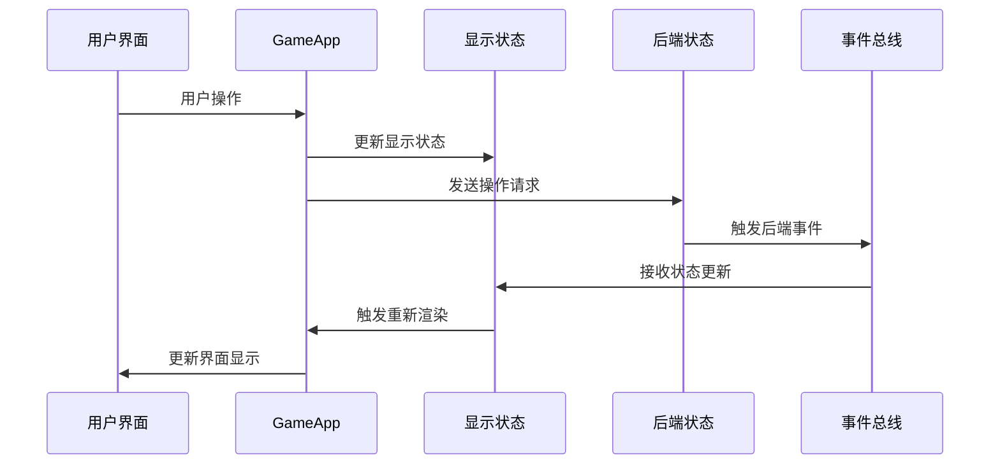

## 事件通信机制

### 前端事件总线

前端事件总线负责在前端组件之间传递事件和数据，主要用于控制和播放动画，不涉及具体结算逻辑。

```javascript
// 前端事件总线定义
import mitt from 'mitt';
const frontendEventBus = mitt();
export default frontendEventBus;
```

### 后端事件总线

后端事件总线定义了完整的事件类型体系，涵盖游戏的所有核心流程。

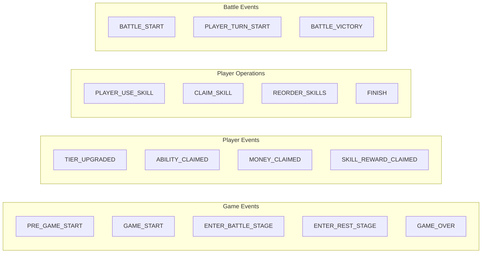

**图表来源**
- [backendEventBus.js](file://src/backendEventBus.js#L1-L80)

事件通信的典型流程：

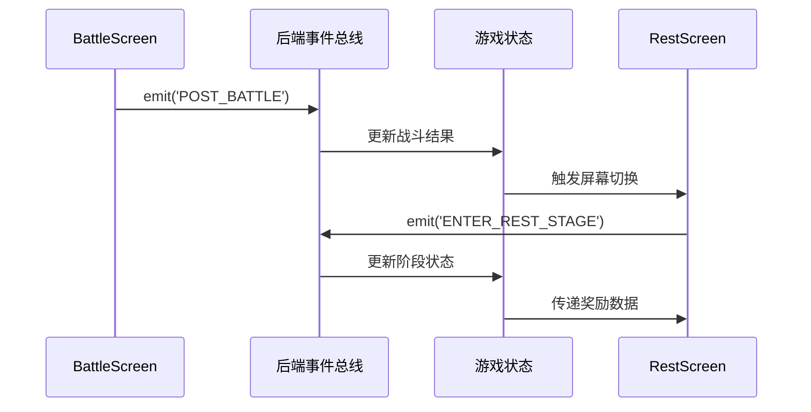

**章节来源**
- [frontendEventBus.js](file://src/frontendEventBus.js#L1-L9)
- [backendEventBus.js](file://src/backendEventBus.js#L1-L80)

## 生命周期管理

### 组件生命周期控制

每个屏幕组件都严格遵循Vue的生命周期钩子，确保资源的正确分配和释放。

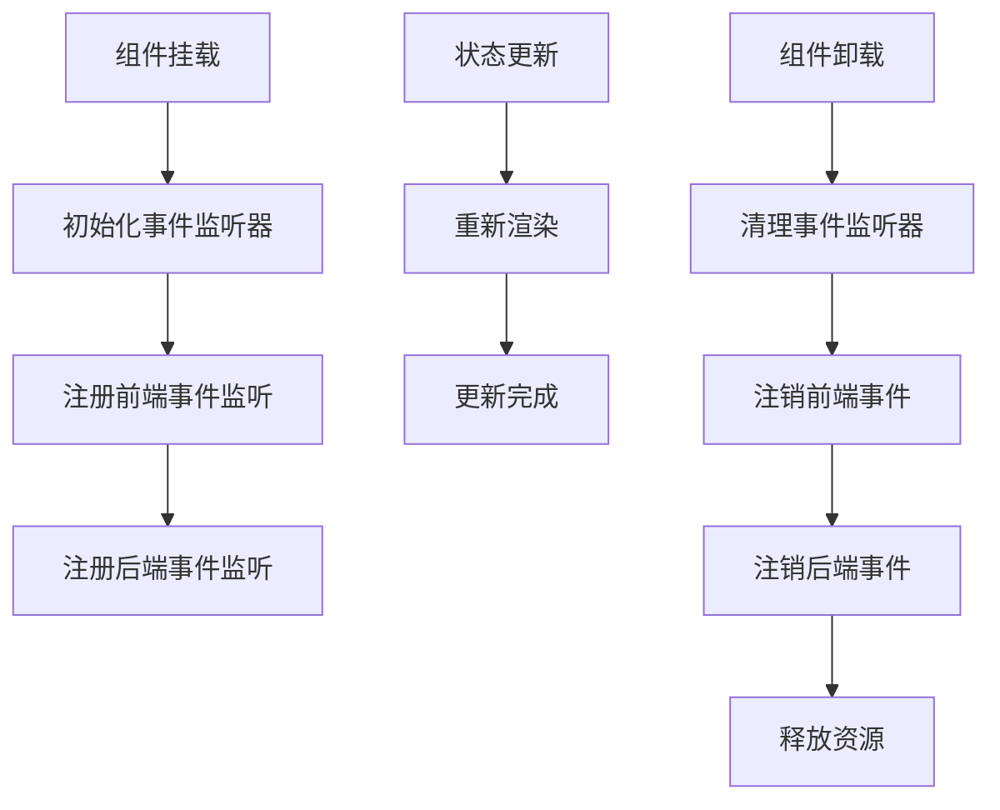

### 内存安全管理

```javascript
// BattleScreen生命周期管理示例
mounted() {
  frontendEventBus.on('add-battle-log', this.onAddBattleLog);
  frontendEventBus.on('clear-battle-log', this.onClearBattleLog);
},
beforeUnmount() {
  frontendEventBus.off('add-battle-log', this.onAddBattleLog);
  frontendEventBus.off('clear-battle-log', this.onClearBattleLog);
}
```

## 性能优化策略

### 渲染优化

1. **条件渲染**：使用v-if/v-else-if实现屏幕间的互斥显示
2. **懒加载**：按需加载大型组件和资源
3. **事件节流**：对高频事件进行节流处理
4. **内存泄漏防护**：及时清理事件监听器和定时器

### 动画优化

```css
/* 屏幕过渡动画 */
.screen-transition-enter-active, .screen-transition-leave-active {
  transition: opacity 0.5s;
}
.screen-transition-enter-from, .screen-transition-leave-to {
  opacity: 0;
}
```

## 故障排除指南

### 常见问题及解决方案

1. **屏幕不显示**
   - 检查gameState.gameStage是否正确设置
   - 验证组件导入路径是否正确
   - 确认CSS样式没有阻止元素显示

2. **事件监听失效**
   - 确保在mounted钩子中注册事件监听器
   - 在beforeUnmount钩子中正确注销监听器
   - 检查事件名称拼写是否正确

3. **状态同步问题**
   - 验证前后端状态是否正确同步
   - 检查事件总线的订阅和发布是否匹配
   - 确认状态更新的时机和顺序

**章节来源**
- [BattleScreen.vue](file://src/components/battle/BattleScreen.vue#L45-L55)
- [RestScreen.vue](file://src/components/rest/RestScreen.vue#L100-L120)

## 总结

游戏的屏幕层组件系统展现了优秀的架构设计和实现质量。通过清晰的职责分工、完善的生命周期管理和高效的事件通信机制，系统实现了良好的可维护性和扩展性。

### 核心优势

1. **模块化设计**：每个屏幕组件职责单一，便于维护和测试
2. **状态管理**：前后端分离的状态管理提供了清晰的数据流
3. **事件驱动**：基于事件总线的通信机制确保了组件间的松耦合
4. **性能优化**：合理的渲染策略和资源管理确保了良好的用户体验

### 设计亮点

- **Transition组件的应用**：实现了流畅的屏幕切换动画
- **响应式状态管理**：利用Vue的响应式系统简化状态同步
- **事件生命周期管理**：严格的事件监听器注册和清理机制
- **错误处理机制**：完善的异常处理和状态恢复机制

这套屏幕层组件系统为游戏提供了坚实的基础架构，支持复杂的交互逻辑和丰富的视觉效果，是现代Web游戏开发的优秀范例。