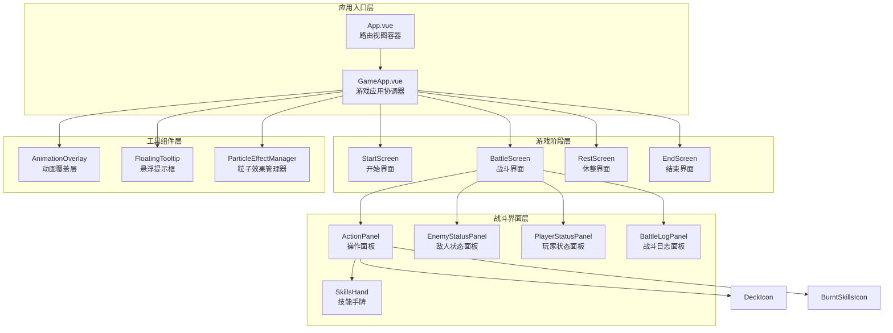
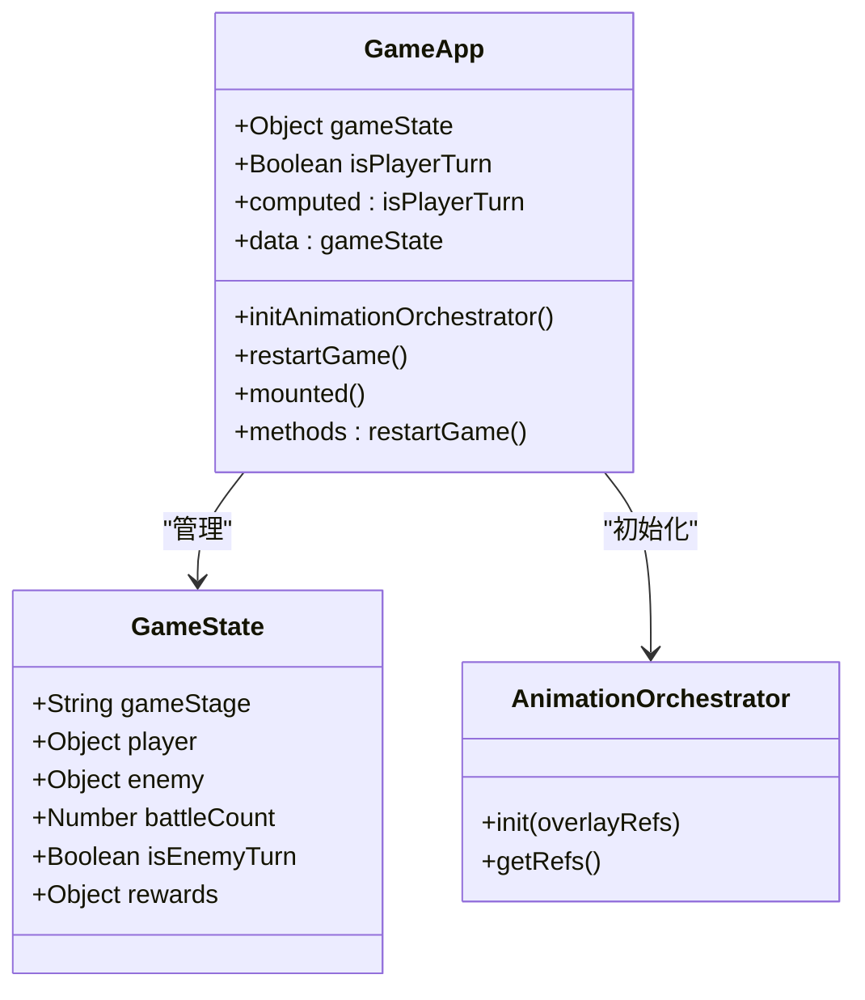
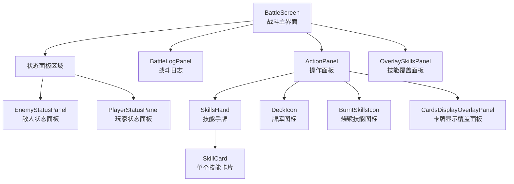
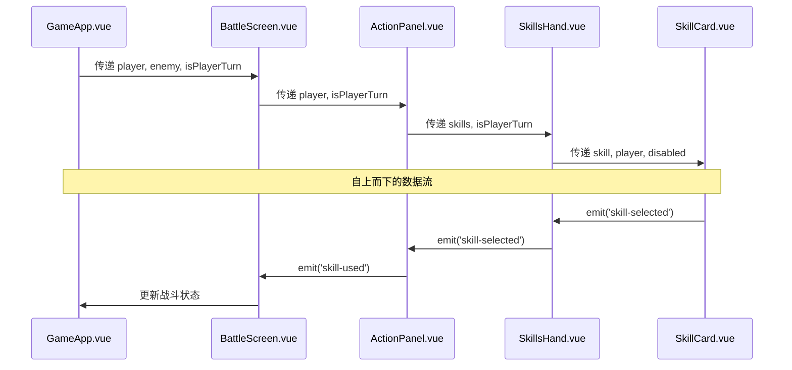

# 组件层次结构

<cite>
**本文档中引用的文件**
- [App.vue](file://src/App.vue)
- [GameApp.vue](file://src/GameApp.vue)
- [BattleScreen.vue](file://src/components/battle/BattleScreen.vue)
- [SkillsHand.vue](file://src/components/battle/SkillsHand.vue)
- [ActionPanel.vue](file://src/components/battle/ActionPanel.vue)
- [EnemyStatusPanel.vue](file://src/components/battle/EnemyStatusPanel.vue)
- [gameState.js](file://src/data/gameState.js)
- [frontendEventBus.js](file://src/frontendEventBus.js)
</cite>

## 目录
1. [简介](#简介)
2. [项目结构概览](#项目结构概览)
3. [核心组件层次结构](#核心组件层次结构)
4. [App.vue 根组件分析](#appvue-根组件分析)
5. [GameApp.vue 游戏应用协调器](#gameappvue-游戏应用协调器)
6. [BattleScreen 战斗主界面](#battlescreen-战斗主界面)
7. [组件间数据流分析](#组件间数据流分析)
8. [组件通信机制](#组件通信机制)
9. [性能优化策略](#性能优化策略)
10. [总结](#总结)

## 简介

本文档深入分析了一个基于 Vue.js 的游戏应用的组件层次结构与嵌套关系。该项目采用分层架构设计，通过清晰的组件边界和数据流向，实现了复杂的战斗系统和用户界面。核心组件包括 App.vue 作为根组件、GameApp.vue 作为游戏流程协调器，以及 BattleScreen 作为战斗主界面。

## 项目结构概览



**图表来源**
- [App.vue](file://src/App.vue#L1-L14)
- [GameApp.vue](file://src/GameApp.vue#L1-L139)

## 核心组件层次结构

该项目的组件层次结构体现了清晰的分层设计理念：

### 1. 应用入口层
- **App.vue**: 最上层的路由视图容器，负责根据路由渲染不同的游戏界面
- **GameApp.vue**: 游戏应用的核心协调器，管理游戏各个阶段的状态切换

### 2. 游戏阶段层
- **StartScreen**: 游戏开始界面，处理初始设置和玩家准备
- **BattleScreen**: 主战斗界面，包含完整的战斗UI组件
- **RestScreen**: 休整界面，提供玩家恢复和升级选项
- **EndScreen**: 游戏结束界面，显示胜利或失败结果

### 3. 战斗界面层
- **ActionPanel**: 操作面板，包含技能手牌、牌库图标和控制按钮
- **SkillsHand**: 技能手牌组件，支持拖拽排序和视觉动画
- **EnemyStatusPanel**: 敌人状态面板，显示敌人的生命值、效果和统计信息
- **PlayerStatusPanel**: 玩家状态面板，显示玩家的生命值、法力值等信息
- **BattleLogPanel**: 战斗日志面板，记录战斗过程中的重要事件

### 4. 工具组件层
- **AnimationOverlay**: 全局动画覆盖层，处理游戏中的各种视觉效果
- **FloatingTooltip**: 浮动提示框，提供技能和物品的详细信息
- **ParticleEffectManager**: 粒子效果管理器，负责战斗特效的渲染

**章节来源**
- [GameApp.vue](file://src/GameApp.vue#L1-L139)
- [BattleScreen.vue](file://src/components/battle/BattleScreen.vue#L1-L112)

## App.vue 根组件分析

App.vue 作为整个应用的根组件，采用了极其简洁的设计：

```javascript
<template>
  <!-- 路由视图 -->
  <router-view />
</template>

<script>
export default {
  name: 'App'
}
</script>
```

### 设计特点：
1. **单一职责**: 仅作为路由视图的容器，不承担任何业务逻辑
2. **轻量级**: 没有模板内容和脚本逻辑，保持最小化
3. **路由集成**: 通过 `<router-view>` 实现不同游戏界面的动态切换

这种设计遵循了 Vue.js 的最佳实践，将具体的业务逻辑委托给 GameApp.vue 处理，确保了组件的单一职责原则。

**章节来源**
- [App.vue](file://src/App.vue#L1-L14)

## GameApp.vue 游戏应用协调器

GameApp.vue 是整个游戏应用的核心协调器，负责管理游戏的不同阶段和全局状态。

### 核心功能架构



**图表来源**
- [GameApp.vue](file://src/GameApp.vue#L40-L80)
- [gameState.js](file://src/data/gameState.js#L1-L75)

### 游戏阶段管理

GameApp.vue 通过条件渲染管理游戏的不同阶段：

```javascript
<template>
  <div id="game-app">
    <transition name="screen-transition" mode="out-in">
    <!-- 开始游戏界面 -->
    <StartScreen 
      v-if="gameState.gameStage === 'start'"
      :game-state="gameState"
    />
    <!-- 战斗界面 -->
    <BattleScreen 
      v-else-if="gameState.gameStage === 'battle'"
      :player="gameState.player.getModifiedPlayer()"
      :enemy="gameState.enemy"
      :is-player-turn="!gameState.isEnemyTurn"
      :level="gameState.battleCount"
    />
    <!-- 休整界面 -->
    <RestScreen 
      v-else-if="gameState.gameStage === 'rest'"
      :game-state="gameState"
    />
    <!-- 结束界面 -->
    <EndScreen 
      v-else-if="gameState.gameStage === 'end'"
      :is-victory="gameState.isVictory"
      @restart-game="restartGame"
    />
    </transition>
    <!-- 其他全局组件 -->
  </div>
</template>
```

### 关键特性：

1. **状态驱动渲染**: 根据 `gameState.gameStage` 动态渲染不同的游戏界面
2. **全局状态管理**: 通过 `displayGameState` 和 `backendGameState` 双重状态管理
3. **动画过渡**: 使用 Vue 的 transition 组件实现界面切换动画
4. **全局组件**: 包含动画覆盖层、提示框等全局使用的组件

**章节来源**
- [GameApp.vue](file://src/GameApp.vue#L1-L50)

## BattleScreen 战斗主界面

BattleScreen.vue 作为战斗界面的核心组件，展示了复杂的嵌套关系和组件协作模式。

### 组件嵌套层次



**图表来源**
- [BattleScreen.vue](file://src/components/battle/BattleScreen.vue#L1-L50)
- [ActionPanel.vue](file://src/components/battle/ActionPanel.vue#L1-L50)

### 数据流设计

BattleScreen 采用了自上而下的数据传递模式：

```javascript
props: {
  player: { type: Object, required: true },
  enemy: { type: Object, required: true },
  isPlayerTurn: { type: Boolean, default: true },
  level: { type: Number, default: 1 }
},
data() {
  return {
    logs: [],
  };
}
```

### 关键组件职责：

1. **EnemyStatusPanel**: 显示敌人的生命值、防御力、攻击值和当前效果
2. **PlayerStatusPanel**: 显示玩家的生命值、法力值、状态效果等信息
3. **BattleLogPanel**: 记录并显示战斗过程中的重要事件
4. **ActionPanel**: 提供玩家的操作界面，包括技能选择和回合结束

**章节来源**
- [BattleScreen.vue](file://src/components/battle/BattleScreen.vue#L30-L80)

## 组件间数据流分析

该项目采用了清晰的数据流向设计，确保了组件间的松耦合和高内聚。

### 数据流向模式



**图表来源**
- [GameApp.vue](file://src/GameApp.vue#L5-L25)
- [BattleScreen.vue](file://src/components/battle/BattleScreen.vue#L30-L40)

### 状态管理模式

项目使用了双重状态管理策略：

1. **显示层状态 (displayGameState)**: 用于前端渲染和用户交互
2. **后端状态 (backendGameState)**: 用于游戏逻辑和战斗结算

```javascript
// 双重状态管理
export const backendGameState = reactive(createGameState());
export const displayGameState = reactive(createGameState());

// 状态同步
Object.assign(displayGameState, fresh);
Object.assign(backendGameState, fresh);
```

### 事件传播机制

组件间通过 Vue 的事件系统进行通信：

```javascript
// 子组件向父组件传递事件
this.$emit('skill-card-clicked', skill);

// 父组件监听子组件事件
@skill-card-clicked="onSkillCardClicked"

// 全局事件总线
frontendEventBus.emit('add-battle-log', logEntry);
frontendEventBus.on('add-battle-log', this.onAddBattleLog);
```

**章节来源**
- [gameState.js](file://src/data/gameState.js#L40-L75)
- [BattleScreen.vue](file://src/components/battle/BattleScreen.vue#L60-L80)

## 组件通信机制

该项目实现了多种组件通信机制，确保了复杂游戏逻辑的有效管理。

### 1. 属性传递 (Props)

最基础的父子组件通信方式：

```javascript
// 父组件向子组件传递属性
<SkillsHand
  :player="player"
  :skills="player.frontierSkills"
  :is-player-turn="isPlayerTurn"
/>

// 子组件接收属性
props: {
  player: { type: Object, required: true },
  skills: { type: Array, default: null },
  isPlayerTurn: { type: Boolean, default: true }
}
```

### 2. 事件发射 (Emits)

子组件向父组件发送事件：

```javascript
// 子组件发射事件
this.$emit('skill-card-clicked', skill);

// 父组件监听事件
@skill-card-clicked="handleSkillClick"
```

### 3. 全局事件总线

用于跨层级组件通信：

```javascript
// 发送全局事件
frontendEventBus.emit('add-battle-log', {
  type: 'damage',
  amount: damage,
  target: 'enemy'
});

// 监听全局事件
frontendEventBus.on('add-battle-log', this.onAddBattleLog);
```

### 4. 状态共享

通过响应式状态对象实现数据共享：

```javascript
// 共享状态对象
export const displayGameState = reactive(createGameState());
export const backendGameState = reactive(createGameState());

// 状态同步
Object.assign(displayGameState.player, fresh.player);
Object.assign(backendGameState.player, fresh.player);
```

### 5. 引用传递 (Refs)

用于直接访问子组件实例：

```javascript
// 父组件获取子组件引用
this.$refs.enemyStatusPanel.updateEnemy(enemy);

// 子组件暴露方法
methods: {
  updateEnemy(enemy) {
    this.enemy = enemy;
  }
}
```

**章节来源**
- [SkillsHand.vue](file://src/components/battle/SkillsHand.vue#L1-L50)
- [frontendEventBus.js](file://src/frontendEventBus.js#L1-L9)

## 性能优化策略

该项目在组件设计中采用了多种性能优化策略：

### 1. 组件懒加载

```javascript
// 按需加载大型组件
import StartScreen from './components/StartScreen.vue'
import BattleScreen from './components/BattleScreen.vue'
import RestScreen from './components/RestScreen.vue'
```

### 2. 条件渲染优化

```javascript
// 使用 v-if/v-else-if 实现条件渲染
<StartScreen 
  v-if="gameState.gameStage === 'start'"
  :game-state="gameState"
/>
<BattleScreen 
  v-else-if="gameState.gameStage === 'battle'"
  :player="gameState.player.getModifiedPlayer()"
  :enemy="gameState.enemy"
/>
```

### 3. 计算属性缓存

```javascript
computed: {
  visibleSkills() {
    const explicit = this.skills && Array.isArray(this.skills) ? this.skills : null;
    if (explicit) return explicit.filter(Boolean);
    return (this.player?.frontierSkills || []).filter(Boolean);
  }
}
```

### 4. 事件监听器管理

```javascript
mounted() {
  frontendEventBus.on('add-battle-log', this.onAddBattleLog);
  frontendEventBus.on('clear-battle-log', this.onClearBattleLog);
},
beforeUnmount() {
  frontendEventBus.off('add-battle-log', this.onAddBattleLog);
  frontendEventBus.off('clear-battle-log', this.onClearBattleLog);
}
```

### 5. DOM 引用优化

```javascript
// 使用 ResizeObserver 优化布局计算
this._ro = new ResizeObserver(entries => {
  for (const entry of entries) {
    const cr = entry.contentRect;
    if (cr && cr.width !== this.containerWidth) this.containerWidth = cr.width;
  }
});
```

### 6. 动画性能优化

```javascript
// 使用 CSS transitions 实现硬件加速
.screen-transition-enter-active, .screen-transition-leave-active {
  transition: opacity 0.5s;
}
.screen-transition-enter-from, .screen-transition-leave-to {
  opacity: 0;
}
```

## 总结

该项目的组件层次结构展现了优秀的软件架构设计原则：

### 架构优势

1. **清晰的分层结构**: 从 App.vue 到具体功能组件的层次分明
2. **职责明确**: 每个组件都有明确的职责边界
3. **松耦合设计**: 通过 Props、Events 和全局事件总线实现组件解耦
4. **状态管理**: 双重状态管理确保了前后端逻辑的分离
5. **性能优化**: 多种优化策略确保了良好的用户体验

### 设计亮点

1. **GameApp.vue 作为协调器**: 有效管理游戏状态和界面切换
2. **BattleScreen 的复杂嵌套**: 展示了大型组件的合理组织方式
3. **SkillsHand 的复杂交互**: 体现了复杂用户界面的组件化设计
4. **全局事件总线**: 解决了跨层级组件通信问题
5. **响应式状态管理**: Vue 3 的响应式系统提供了强大的状态管理能力

### 最佳实践

该项目在组件设计中体现了以下最佳实践：
- 单一职责原则
- 开闭原则（通过扩展而非修改实现功能增强）
- 依赖倒置原则（通过抽象接口实现组件解耦）
- 最小知识原则（组件间通信保持最小化）

这种设计不仅保证了代码的可维护性，也为未来的功能扩展奠定了坚实的基础。通过合理的组件层次结构和清晰的数据流向，开发者可以轻松理解和扩展游戏的功能。