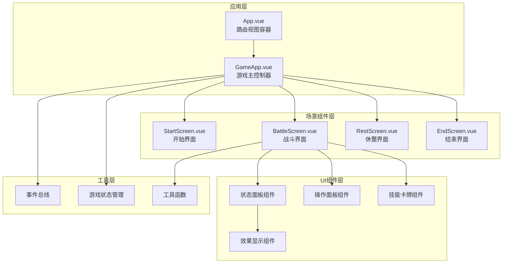
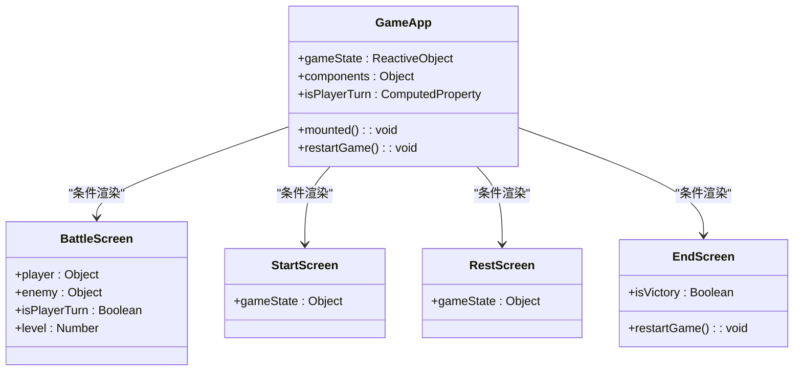
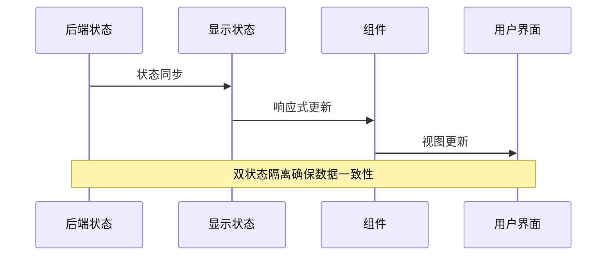
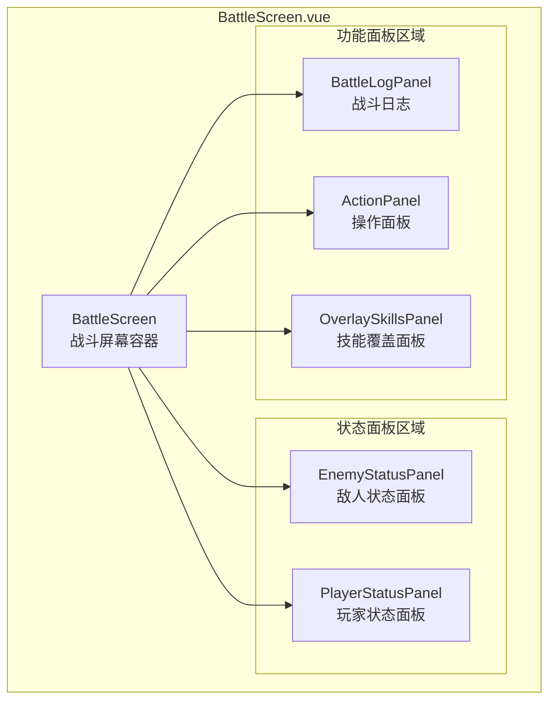
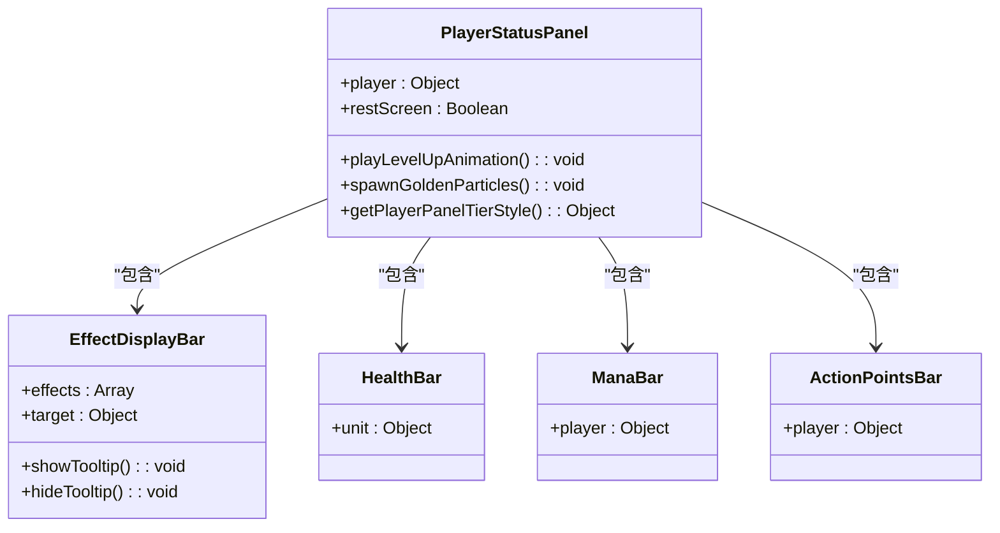
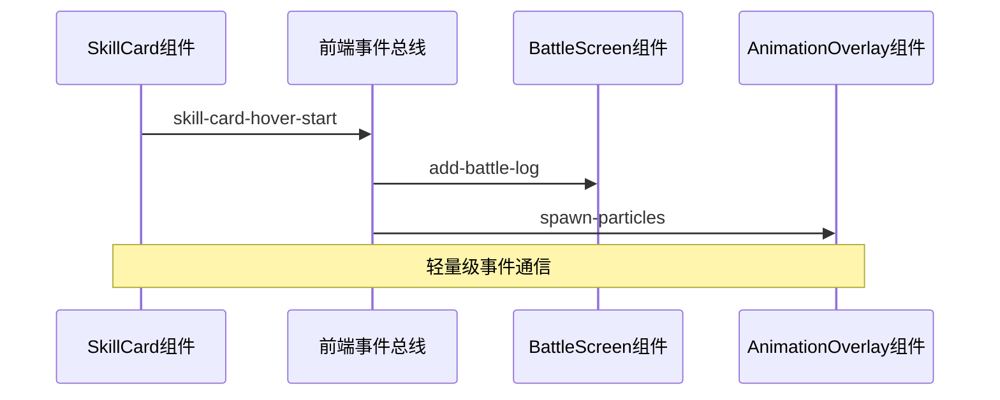
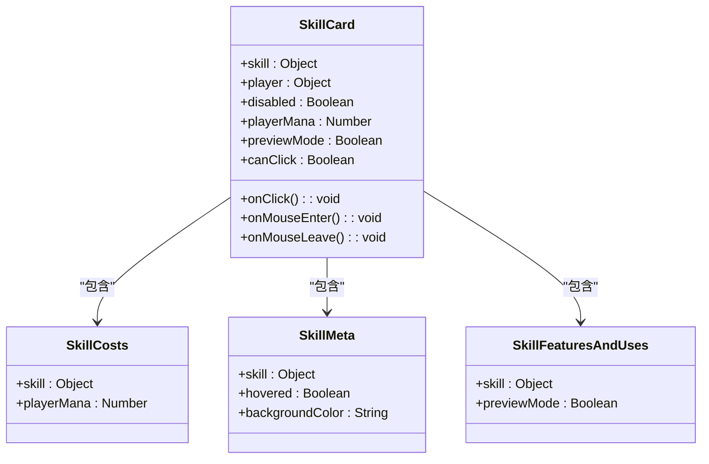
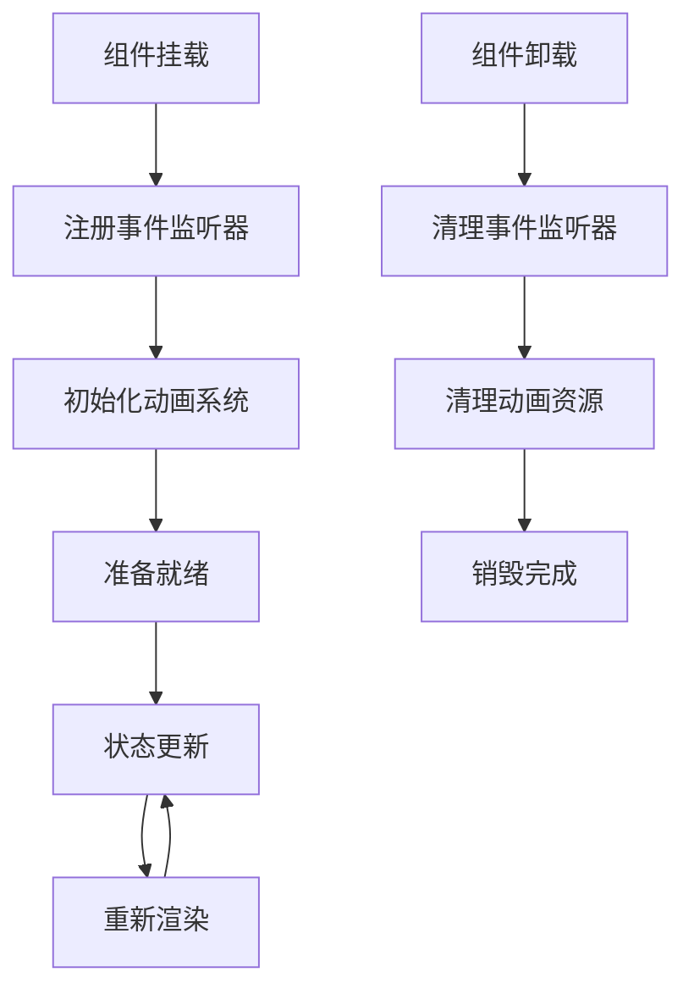

# 组件架构

<cite>
**本文档中引用的文件**
- [App.vue](file://src/App.vue)
- [GameApp.vue](file://src/GameApp.vue)
- [BattleScreen.vue](file://src/components/BattleScreen.vue)
- [PlayerStatusPanel.vue](file://src/components/PlayerStatusPanel.vue)
- [SkillCard.vue](file://src/components/SkillCard.vue)
- [frontendEventBus.js](file://src/frontendEventBus.js)
- [backendEventBus.js](file://src/backendEventBus.js)
- [gameState.js](file://src/data/gameState.js)
- [player.js](file://src/data/player.js)
- [cardAnimationOrchestrator.js](file://src/utils/cardAnimationOrchestrator.js)
- [main.js](file://src/main.js)
</cite>

## 目录
1. [简介](#简介)
2. [项目结构概览](#项目结构概览)
3. [核心组件架构](#核心组件架构)
4. [MVVM模式实现](#mvvm模式实现)
5. [组件层次结构](#组件层次结构)
6. [事件总线通信机制](#事件总线通信机制)
7. [组件可复用性设计](#组件可复用性设计)
8. [组件生命周期管理](#组件生命周期管理)
9. [性能优化策略](#性能优化策略)
10. [总结](#总结)

## 简介

本项目是一个基于Vue 3的游戏应用程序，采用了现代化的MVVM（Model-View-ViewModel）架构模式。项目的核心设计理念是通过清晰的组件分离和事件驱动的通信机制，实现高度模块化的游戏界面系统。整个架构围绕GameApp.vue根组件展开，通过路由切换不同的游戏场景，并通过事件总线实现组件间的松耦合通信。

## 项目结构概览

项目采用标准的Vue 3单文件组件架构，主要分为以下几个层次：



**图表来源**
- [App.vue](file://src/App.vue#L1-L14)
- [GameApp.vue](file://src/GameApp.vue#L1-L139)

**章节来源**
- [App.vue](file://src/App.vue#L1-L14)
- [GameApp.vue](file://src/GameApp.vue#L1-L139)

## 核心组件架构

### App.vue - 路由容器

App.vue作为整个应用的根组件，采用了极简的设计理念：

```javascript
<template>
  <!-- 路由视图 -->
  <router-view />
</template>
```

这个简单的组件充当了Vue Router的占位符，根据当前路由动态渲染相应的游戏场景组件。

### GameApp.vue - 游戏主控制器

GameApp.vue是整个游戏的核心控制器，实现了MVVM模式的关键部分：



**图表来源**
- [GameApp.vue](file://src/GameApp.vue#L40-L80)
- [BattleScreen.vue](file://src/components/BattleScreen.vue#L25-L35)

GameApp.vue通过响应式状态管理实现了游戏场景的智能切换：

```javascript
// 基于游戏状态的场景切换
<StartScreen 
  v-if="gameState.gameStage === 'start'"
  :game-state="gameState"
/>
<BattleScreen 
  v-else-if="gameState.gameStage === 'battle'"
  :player="gameState.player.getModifiedPlayer()"
  :enemy="gameState.enemy"
  :is-player-turn="!gameState.isEnemyTurn"
  :level="gameState.battleCount"
/>
```

**章节来源**
- [GameApp.vue](file://src/GameApp.vue#L1-L139)

## MVVM模式实现

### Model层 - 游戏状态管理

项目采用前后端分离的状态管理模式，通过Reactive对象实现响应式数据绑定：



**图表来源**
- [gameState.js](file://src/data/gameState.js#L30-L50)

### View层 - 组件模板

每个组件都遵循Vue 3的组合式API模式，通过props接收数据：

```javascript
// BattleScreen.vue中的Props定义
props: {
  player: { type: Object, required: true },
  enemy: { type: Object, required: true },
  isPlayerTurn: { type: Boolean, default: true },
  level: { type: Number, default: 1 }
}
```

### ViewModel层 - 事件处理和计算属性

组件通过事件总线和计算属性实现视图与模型的双向绑定：

```javascript
// GameApp.vue中的计算属性
computed: {
  isPlayerTurn() {
    return !gameState.isEnemyTurn;
  }
}
```

**章节来源**
- [gameState.js](file://src/data/gameState.js#L1-L75)
- [BattleScreen.vue](file://src/components/BattleScreen.vue#L25-L35)

## 组件层次结构

### BattleScreen - 战斗界面核心

BattleScreen是战斗场景的核心组件，展示了完整的战斗界面结构：



**图表来源**
- [BattleScreen.vue](file://src/components/BattleScreen.vue#L1-L50)

### PlayerStatusPanel - 状态面板组件

PlayerStatusPanel展示了状态面板的详细结构：



**图表来源**
- [PlayerStatusPanel.vue](file://src/components/PlayerStatusPanel.vue#L1-L50)

**章节来源**
- [BattleScreen.vue](file://src/components/BattleScreen.vue#L1-L112)
- [PlayerStatusPanel.vue](file://src/components/PlayerStatusPanel.vue#L1-L216)

## 事件总线通信机制

### 前端事件总线

前端事件总线负责组件间的轻量级通信：



**图表来源**
- [frontendEventBus.js](file://src/frontendEventBus.js#L1-L9)

### 后端事件总线

后端事件总线定义了完整的事件命名空间：

```javascript
export const EventNames = {
  Game: {
    PRE_GAME_START: 'pre-game-start',
    GAME_START: 'game-start',
    ENTER_BATTLE_STAGE: 'enter-battle-stage',
    GAME_OVER: 'game-over',
  },
  Player: {
    TIER_UPGRADED: 'player-tier-upgraded',
    SKILL_REWARD_CLAIMED: 'player-skill-claimed',
    SKILL_USED: 'player-skill-used',
  },
  Battle: {
    BATTLE_START: 'battle-battle-start',
    PLAYER_TURN_START: 'battle-player-turn-start',
    BATTLE_VICTORY: 'battle-victory',
  }
};
```

**章节来源**
- [frontendEventBus.js](file://src/frontendEventBus.js#L1-L9)
- [backendEventBus.js](file://src/backendEventBus.js#L1-L80)

## 组件可复用性设计

### SkillCard - 可复用技能卡牌组件

SkillCard组件展示了高度的可复用性设计：



**图表来源**
- [SkillCard.vue](file://src/components/SkillCard.vue#L1-L100)

### PlayerStatusPanel - 可复用状态面板

PlayerStatusPanel通过参数化设计实现了在不同场景下的复用：

```javascript
// 两种模式下的样式适配
props: {
  player: { type: Object, required: true },
  restScreen: { type: Boolean, default: false }
}

// 根据模式调整样式
getPlayerPanelTierStyle() {
  const pallette = getPlayerTierPallete(this.player.tier);
  return {
    borderWidth: '8px',
    borderColor: pallette.major,
    backgroundColor: pallette.background,
    color: pallette.text
  };
}
```

**章节来源**
- [SkillCard.vue](file://src/components/SkillCard.vue#L1-L236)
- [PlayerStatusPanel.vue](file://src/components/PlayerStatusPanel.vue#L1-L216)

## 组件生命周期管理

### 生命周期钩子使用

组件通过生命周期钩子实现与游戏状态的同步：



**图表来源**
- [BattleScreen.vue](file://src/components/BattleScreen.vue#L45-L60)

### 动画编排器集成

GameApp.vue集成了全局动画编排器：

```javascript
mounted() {
  // 初始化全局动画编排器：注入全局Overlay引用
  const overlayRefs = this.$refs.animationOverlay?.getRefs?.();
  if (overlayRefs) {
    orchestrator.init(overlayRefs);
  }
}
```

**章节来源**
- [GameApp.vue](file://src/GameApp.vue#L70-L80)
- [BattleScreen.vue](file://src/components/BattleScreen.vue#L45-L60)

## 性能优化策略

### 组件懒加载

项目通过Vue Router实现了组件的懒加载：

```javascript
// main.js中的路由配置
const routes = [
  { path: '/', component: GameApp },
  { path: '/debug', component: DebugApp },
  { path: '/test', component: TestEffectDisplay },
  { path: '/named-test', component: NamedEntityTest }
]
```

### 事件总线优化

前端事件总线使用mitt库实现高效的事件分发：

```javascript
// 前端事件总线实现
import mitt from 'mitt';

const frontendEventBus = mitt();

export default frontendEventBus;
```

### 动画性能优化

CardAnimationOrchestrator使用GSAP库实现高性能动画：

```javascript
// 动画配置示例
flyToCenter({ scale = 1.2, durationMs = 350, holdMs = 0 } = {}) {
  return [
    { toAnchor: 'center', scale, duration: durationMs, ease: defaultEase, holdMs }
  ];
}
```

**章节来源**
- [main.js](file://src/main.js#L20-L30)
- [frontendEventBus.js](file://src/frontendEventBus.js#L1-L9)
- [cardAnimationOrchestrator.js](file://src/utils/cardAnimationOrchestrator.js#L50-L80)

## 总结

本项目通过精心设计的组件架构，成功实现了基于Vue 3的MVVM模式游戏应用。主要特点包括：

1. **清晰的层次结构**：从App.vue到GameApp.vue再到具体的业务组件，形成了完整的组件层次体系
2. **灵活的事件通信**：通过前端和后端事件总线实现组件间的松耦合通信
3. **高度可复用的组件设计**：如SkillCard和PlayerStatusPanel等组件的参数化设计
4. **完善的生命周期管理**：通过生命周期钩子确保组件与游戏状态的同步
5. **优秀的性能表现**：通过懒加载、事件优化和动画编排等技术手段提升用户体验

这种架构设计不仅保证了代码的可维护性和扩展性，也为后续的功能扩展提供了良好的基础。通过组件化的开发方式，团队可以更高效地协作开发，同时保持代码的一致性和质量。