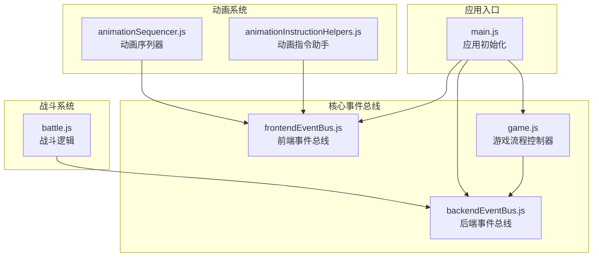
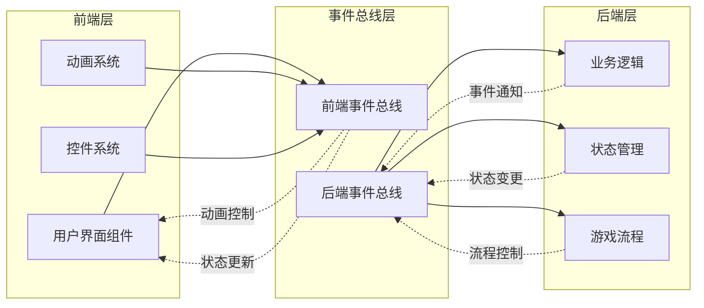
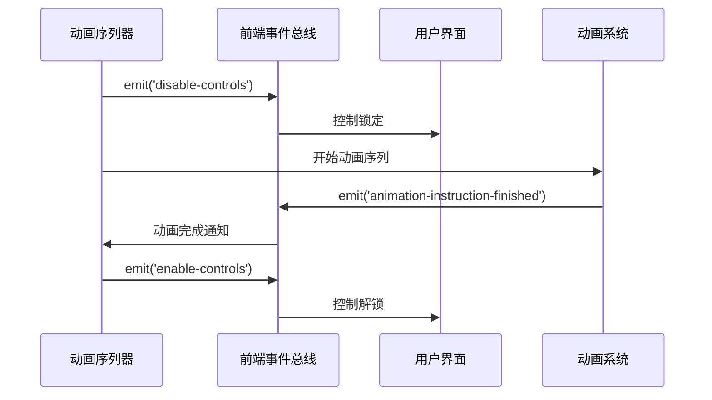
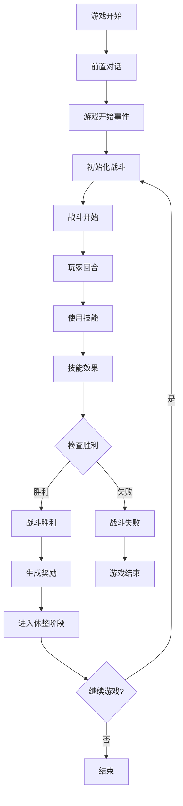

# 事件总线架构设计

<cite>
**本文档引用的文件**
- [main.js](file://src/main.js)
- [frontendEventBus.js](file://src/frontendEventBus.js)
- [backendEventBus.js](file://src/backendEventBus.js)
- [game.js](file://src/game.js)
- [animationInstructionHelpers.js](file://src/data/animationInstructionHelpers.js)
- [animationSequencer.js](file://src/data/animationSequencer.js)
- [battle.js](file://src/data/battle.js)
</cite>

## 目录
1. [简介](#简介)
2. [项目结构概览](#项目结构概览)
3. [核心事件总线组件](#核心事件总线组件)
4. [架构设计原理](#架构设计原理)
5. [详细组件分析](#详细组件分析)
6. [事件总线通信机制](#事件总线通信机制)
7. [性能考虑](#性能考虑)
8. [故障排除指南](#故障排除指南)
9. [结论](#结论)

## 简介

本文档深入分析了一个基于mitt库实现的双事件总线架构设计。该架构通过分离前端事件总线（frontendEventBus）和后端事件总线（backendEventBus），实现了清晰的职责边界和高度解耦的系统设计。这种设计模式不仅提升了系统的可维护性和可测试性，还为复杂的战斗系统提供了灵活的事件驱动架构。

## 项目结构概览

该项目采用模块化的Vue.js应用程序结构，核心事件总线相关文件分布在以下位置：



**图表来源**
- [main.js](file://src/main.js#L1-L55)
- [frontendEventBus.js](file://src/frontendEventBus.js#L1-L9)
- [backendEventBus.js](file://src/backendEventBus.js#L1-L80)

**章节来源**
- [main.js](file://src/main.js#L1-L55)

## 核心事件总线组件

### 前端事件总线（frontendEventBus）

前端事件总线专门负责处理用户界面交互事件和动画控制，其设计原则是：

- **职责单一**：专注于前端组件间的数据传递和动画控制
- **非侵入性**：不包含具体的业务逻辑结算
- **实时响应**：确保用户交互的即时反馈

```javascript
// 前端事件总线的核心实现
import mitt from 'mitt';
const frontendEventBus = mitt();
export default frontendEventBus;
```

### 后端事件总线（backendEventBus）

后端事件总线负责游戏核心逻辑流转，包含完整的事件命名空间：

```javascript
export const EventNames = {
  Game: {
    PRE_GAME_START: 'pre-game-start',
    GAME_START: 'game-start',
    ENTER_BATTLE_STAGE: 'enter-battle-stage',
    ENTER_REST_STAGE: 'enter-rest-stage',
    PRE_BATTLE: 'pre-battle',
    POST_BATTLE: 'post-battle',
    GAME_OVER: 'game-over',
  },
  Player: {
    TIER_UPGRADED: 'player-tier-upgraded',
    ABILITY_CLAIMED: 'player-ability-claimed',
    MONEY_CLAIMED: 'player-money-claimed',
    SKILL_REWARD_CLAIMED: 'player-skill-claimed',
    // 战斗事件...
  },
  PlayerOperations: {
    PLAYER_USE_SKILL: 'battle-player-use-skill',
    PLAYER_SHIFT_SKILL: 'battle-player-shift-skill',
    PLAYER_END_TURN: 'player-end-turn',
    // 休整阶段操作...
  },
  Battle: {
    BATTLE_START: 'battle-battle-start',
    PLAYER_TURN_START: 'battle-player-turn-start',
    PLAYER_TURN: 'battle-player-turn',
    ENEMY_TURN: 'battle-enemy-turn',
    BATTLE_VICTORY: 'battle-victory',
  }
};
```

**章节来源**
- [frontendEventBus.js](file://src/frontendEventBus.js#L1-L9)
- [backendEventBus.js](file://src/backendEventBus.js#L1-L80)

## 架构设计原理

### 分离设计原则

双事件总线架构遵循以下核心设计原则：



**图表来源**
- [frontendEventBus.js](file://src/frontendEventBus.js#L1-L9)
- [backendEventBus.js](file://src/backendEventBus.js#L1-L80)

### 职责边界划分

1. **前端事件总线职责**：
   - 用户界面交互事件（按钮点击、鼠标悬停）
   - 动画控制和播放
   - UI状态同步
   - 用户输入验证

2. **后端事件总线职责**：
   - 游戏核心逻辑流转
   - 回合切换和状态变更
   - 业务规则执行
   - 数据持久化

### 解耦优势

这种分离设计带来了显著的解耦优势：

- **独立开发**：前后端团队可以独立开发和测试
- **模块化**：每个总线专注于特定领域
- **可测试性**：单元测试更加简单直接
- **可维护性**：问题定位和修复更加容易

## 详细组件分析

### 主应用初始化（main.js）

主应用初始化过程中，事件总线的创建和注入体现了清晰的架构设计：

```javascript
// 创建路由
const routes = [
  { path: '/', component: GameApp },
  { path: '/debug', component: DebugApp },
  { path: '/test', component: TestEffectDisplay },
  { path: '/named-test', component: NamedEntityTest }
]

// 创建应用实例
const app = createApp(App)
app.use(router)

// 加载所有技能
SkillManager.loadAllSkills().then(skillManager => {
  app.config.globalProperties.$skillManager = skillManager;
  
  // 加载所有ability
  AbilityManager.loadAllAbilities().then(abilityManager => {
    app.config.globalProperties.$abilityManager = abilityManager;
    app.mount('#app');
  });
});

// 初始化后端状态观察者
registerBackendStateWatcher();

// 初始化后端游戏流程在backendEventBus上的监听器
initGameFlowListeners();
```

### 动画序列器（animationSequencer.js）

动画序列器展示了前端事件总线的实际应用场景：



**图表来源**
- [animationSequencer.js](file://src/data/animationSequencer.js#L35-L40)
- [animationInstructionHelpers.js](file://src/data/animationInstructionHelpers.js#L429-L437)

### 战斗系统集成

战斗系统通过后端事件总线实现完整的游戏流程控制：

```javascript
// 战斗开始事件
backendEventBus.emit(EventNames.Battle.BATTLE_START);

// 玩家回合开始
backendEventBus.emit(EventNames.Battle.PLAYER_TURN_START, {});

// 技能使用事件
backendEventBus.emit(EventNames.Player.SKILL_USED, { 
  player: gameState.player, 
  skill: skill 
});

// 战斗胜利事件
backendEventBus.emit(EventNames.Battle.BATTLE_VICTORY, true);
```

**章节来源**
- [main.js](file://src/main.js#L30-L55)
- [animationSequencer.js](file://src/data/animationSequencer.js#L30-L134)
- [battle.js](file://src/data/battle.js#L25-L369)

## 事件总线通信机制

### 跨总线通信策略

虽然采用了分离设计，但系统仍然需要在不同总线之间进行通信：



**图表来源**
- [game.js](file://src/game.js#L1-L119)
- [battle.js](file://src/data/battle.js#L20-L369)

### 事件传播机制

系统通过精心设计的事件传播机制实现各组件间的协调：

1. **事件发射**：后端事件总线负责游戏核心逻辑的事件发射
2. **事件监听**：前端事件总线负责接收并处理UI相关的事件
3. **状态同步**：通过事件总线实现前后端状态的一致性

### 异常处理策略

事件总线系统采用了健壮的异常处理机制：

```javascript
// 动画完成事件处理
frontendEventBus.on('animation-instruction-finished', (payload = {}) => {
  const id = payload?.id;
  if (id) this.finish(id, 'frontend');
});

// 安全的事件发射
try { 
  emit('display-dialog', dialogItems); 
} catch (_) { 
  frontendEventBus.off('dialog-ended', handler); 
}
```

**章节来源**
- [animationInstructionHelpers.js](file://src/data/animationInstructionHelpers.js#L380-L410)
- [animationSequencer.js](file://src/data/animationSequencer.js#L35-L40)

## 性能考虑

### 事件处理优化

1. **事件去重**：通过唯一ID确保事件不会重复处理
2. **内存管理**：及时清理不再使用的事件监听器
3. **异步处理**：使用Promise和async/await处理耗时操作
4. **批量处理**：合并相似的事件减少处理开销

### 内存泄漏防护

系统采用了多种机制防止内存泄漏：

- **自动清理**：完成的动画指令自动从队列中移除
- **监听器管理**：使用off方法及时移除不需要的事件监听器
- **超时机制**：为长时间运行的动画设置超时保护

## 故障排除指南

### 常见问题诊断

1. **事件未触发**：
   - 检查事件名称拼写
   - 确认事件监听器已正确注册
   - 验证事件总线实例是否正确导入

2. **内存泄漏**：
   - 检查事件监听器是否正确移除
   - 验证动画指令的完成回调
   - 监控事件总线的监听器数量

3. **性能问题**：
   - 检查事件处理函数的复杂度
   - 优化动画序列的长度
   - 监控事件总线的处理时间

### 调试技巧

- 使用浏览器开发者工具监控事件总线的活动
- 在关键事件点添加日志输出
- 利用Vue DevTools观察组件状态变化
- 实施事件追踪机制记录事件流向

**章节来源**
- [animationSequencer.js](file://src/data/animationSequencer.js#L50-L70)

## 结论

基于mitt库实现的双事件总线架构设计展现了现代前端应用中事件驱动架构的最佳实践。通过清晰的职责分离、完善的异常处理和高效的性能优化，该架构成功地平衡了系统的复杂性和可维护性。

### 主要优势

1. **架构清晰**：前后端事件总线职责明确，便于理解和维护
2. **高度解耦**：组件间通过事件总线通信，降低耦合度
3. **易于测试**：事件驱动的架构使得单元测试更加简单
4. **扩展性强**：新的功能可以通过添加事件轻松集成

### 设计启示

这种双事件总线设计模式特别适用于：
- 复杂的游戏逻辑系统
- 需要严格前后端分离的应用
- 需要高度可测试性的项目
- 需要灵活扩展的架构

通过深入理解这种架构设计，开发者可以在构建类似系统时获得宝贵的参考经验，实现既高效又可维护的软件架构。