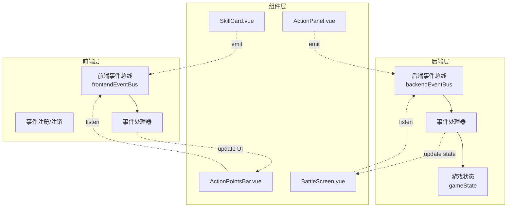
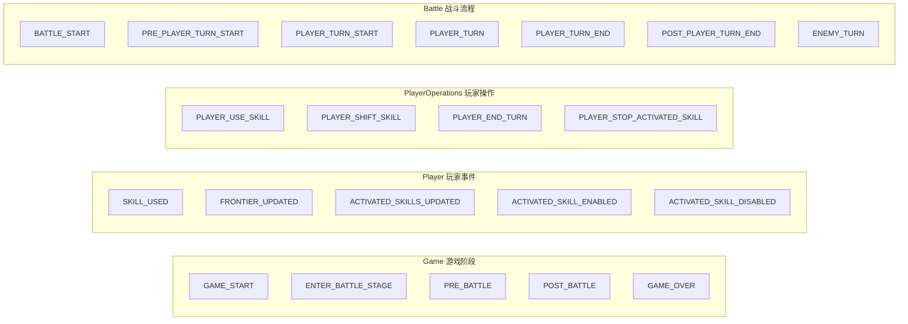
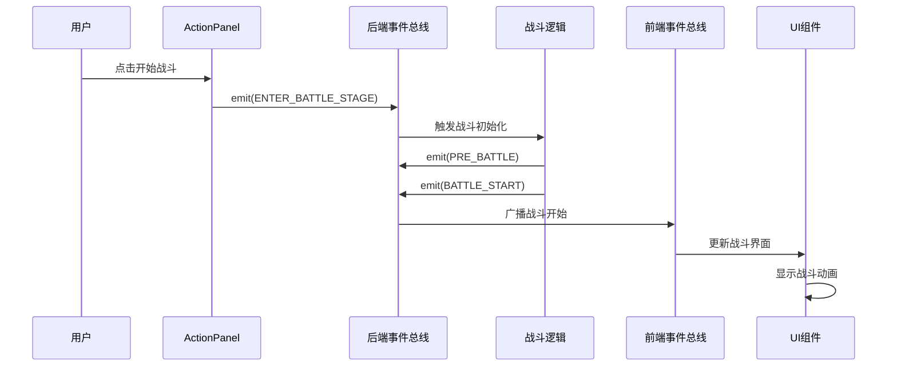
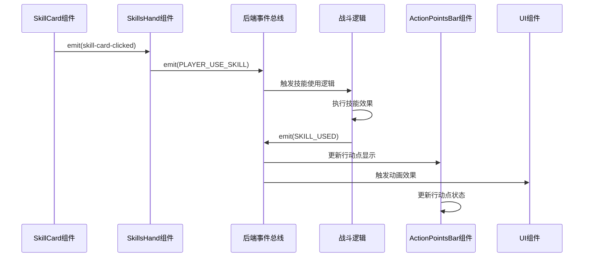
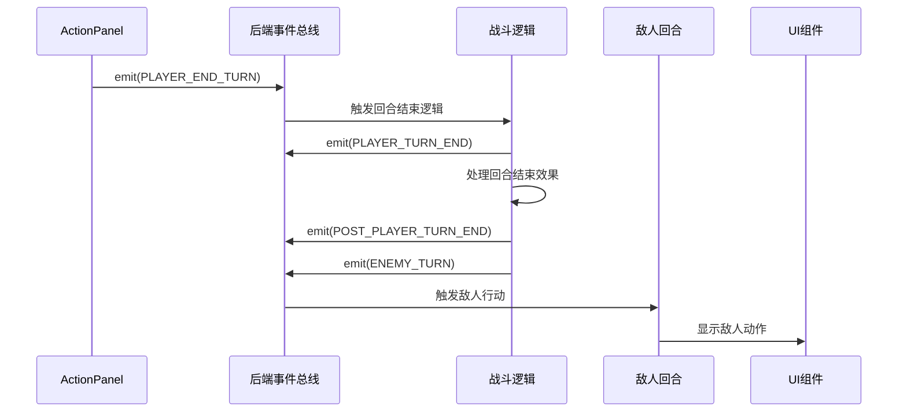
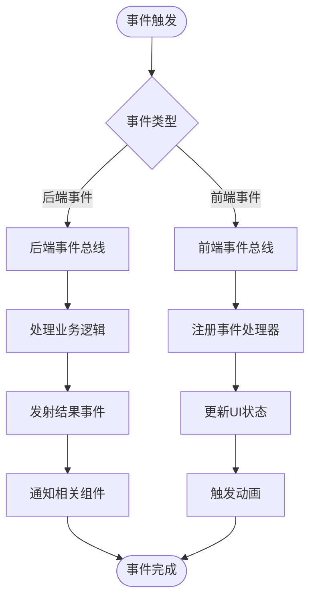
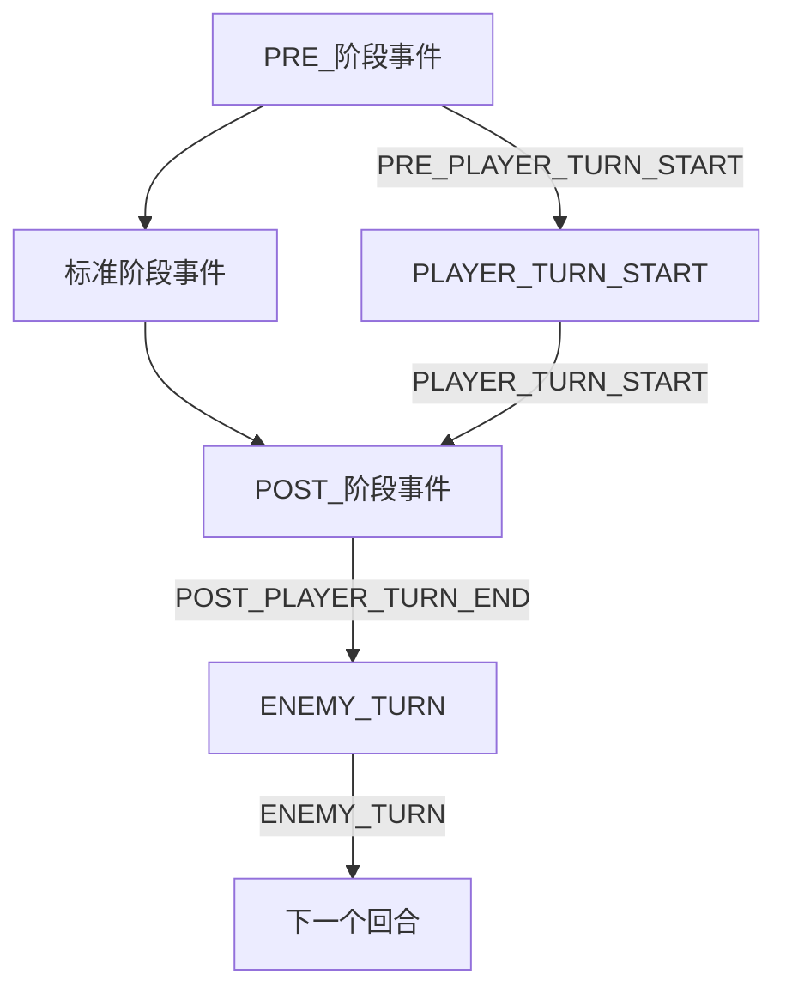

# 事件类型与数据流

<cite>
**本文档中引用的文件**
- [frontendEventBus.js](file://src/frontendEventBus.js)
- [backendEventBus.js](file://src/backendEventBus.js)
- [battle.js](file://src/data/battle.js)
- [SkillCard.vue](file://src/components/global/SkillCard.vue)
- [ActionPanel.vue](file://src/components/battle/ActionPanel.vue)
- [SkillsHand.vue](file://src/components/battle/SkillsHand.vue)
- [ActionPointsBar.vue](file://src/components/global/ActionPointsBar.vue)
</cite>

## 目录
1. [概述](#概述)
2. [事件总线架构](#事件总线架构)
3. [事件类型定义](#事件类型定义)
4. [关键事件分析](#关键事件分析)
5. [事件数据流追踪](#事件数据流追踪)
6. [事件命名规范](#事件命名规范)
7. [调试与监控](#调试与监控)
8. [最佳实践](#最佳实践)

## 概述

该项目采用基于事件驱动的架构模式，通过前后端分离的事件总线系统实现组件间的解耦通信。事件系统主要分为两个层面：

- **前端事件总线** (`frontendEventBus`)：负责前端组件间的消息传递，主要用于动画控制和用户交互反馈
- **后端事件总线** (`backendEventBus`)：负责游戏逻辑状态变更和业务流程控制

这种设计模式确保了组件间的松耦合，使得战斗系统、UI更新和动画播放能够独立开发和维护。

## 事件总线架构



**图表来源**
- [frontendEventBus.js](file://src/frontendEventBus.js#L1-L9)
- [backendEventBus.js](file://src/backendEventBus.js#L1-L80)

**章节来源**
- [frontendEventBus.js](file://src/frontendEventBus.js#L1-L9)
- [backendEventBus.js](file://src/backendEventBus.js#L1-L80)

## 事件类型定义

### 后端事件分类

后端事件按照功能域进行清晰的分组，每个分组都有明确的职责边界：



**图表来源**
- [backendEventBus.js](file://src/backendEventBus.js#L5-L78)

### 事件命名规范

事件名称遵循严格的命名规范：

1. **动词-名词格式**：如 `PLAYER_USE_SKILL`、`SKILL_USED`
2. **命名空间隔离**：通过前缀区分不同模块，如 `battle-`、`player-`
3. **语义化表达**：事件名称直观反映其含义和触发时机

**章节来源**
- [backendEventBus.js](file://src/backendEventBus.js#L5-L78)

## 关键事件分析

### battle-started 事件链路



**图表来源**
- [battle.js](file://src/data/battle.js#L18-L35)
- [ActionPanel.vue](file://src/components/battle/ActionPanel.vue#L100-L105)

### skill-used 事件链路



**图表来源**
- [SkillCard.vue](file://src/components/global/SkillCard.vue#L118-L125)
- [SkillsHand.vue](file://src/components/battle/SkillsHand.vue#L250-L260)
- [battle.js](file://src/data/battle.js#L200-L210)

### turn-ended 事件链路



**图表来源**
- [ActionPanel.vue](file://src/components/battle/ActionPanel.vue#L100-L105)
- [battle.js](file://src/data/battle.js#L290-L310)

**章节来源**
- [battle.js](file://src/data/battle.js#L18-L35)
- [SkillCard.vue](file://src/components/global/SkillCard.vue#L118-L125)
- [SkillsHand.vue](file://src/components/battle/SkillsHand.vue#L250-L260)
- [ActionPanel.vue](file://src/components/battle/ActionPanel.vue#L100-L105)

## 事件数据流追踪

### 数据结构定义

事件携带的数据结构遵循统一的约定：

```javascript
// SKILL_USED 事件数据结构
{
  player: PlayerObject,      // 玩家状态对象
  skill: SkillObject,        // 使用的技能对象
  result: ActionResult,      // 技能执行结果
  manualStop: boolean       // 是否为手动停止（咏唱技能）
}

// FRONTIER_UPDATED 事件数据结构
{
  frontierSkills: Skill[],   // 前台技能列表
  backupSkills: Skill[]      // 后备技能列表
}

// PLAYER_TURN_START 事件数据结构
{
  turnNumber: number,        // 回合编号
  player: PlayerObject,      // 玩家状态
  enemy: EnemyObject         // 敌人状态
}
```

### 事件传播路径



**章节来源**
- [battle.js](file://src/data/battle.js#L200-L210)
- [backendEventBus.js](file://src/backendEventBus.js#L5-L78)

## 事件命名规范

### 命名规则详解

1. **动词-名词格式**：确保语义清晰
   - `PLAYER_USE_SKILL`：玩家使用技能
   - `SKILL_USED`：技能已被使用
   - `PLAYER_END_TURN`：玩家结束回合

2. **命名空间管理**
   - `battle-`：战斗相关事件
   - `player-`：玩家状态事件
   - `rest-`：休整阶段事件

3. **事件生命周期标识**
   - `PRE_`：预处理阶段
   - `POST_`：后处理阶段
   - 缺失前缀：标准阶段

### 事件优先级



**章节来源**
- [backendEventBus.js](file://src/backendEventBus.js#L33-L78)
- [battle.js](file://src/data/battle.js#L110-L120)

## 调试与监控

### 事件监听器注册

```javascript
// 战斗开始事件监听
backendEventBus.on(EventNames.Battle.BATTLE_START, () => {
  console.log('战斗开始事件触发');
  startBattle();
});

// 技能使用事件监听
backendEventBus.on(EventNames.Player.SKILL_USED, (params) => {
  console.log('技能使用事件:', params.skill.name);
  updateSkillDisplay(params);
});
```

### 调试断点位置

1. **事件触发点**：在事件发出处设置断点
2. **事件处理点**：在事件处理器入口设置断点
3. **状态验证点**：在事件处理完成后验证状态变化

### 性能监控

```javascript
// 事件性能监控
const eventTimers = {};

function monitorEvent(eventName, callback) {
  return (...args) => {
    const start = performance.now();
    callback(...args);
    const duration = performance.now() - start;
    console.log(`${eventName} 处理耗时: ${duration.toFixed(2)}ms`);
  };
}
```

**章节来源**
- [battle.js](file://src/data/battle.js#L440-L460)

## 最佳实践

### 事件设计原则

1. **单一职责**：每个事件只负责一个特定的功能领域
2. **幂等性**：事件处理应该是幂等的，多次处理不会产生副作用
3. **及时清理**：组件卸载时及时移除事件监听器

### 错误处理策略

```javascript
// 安全的事件监听器
function safeEventListener(eventName, handler) {
  return (data) => {
    try {
      handler(data);
    } catch (error) {
      console.error(`事件处理错误 ${eventName}:`, error);
    }
  };
}
```

### 测试建议

1. **单元测试**：为每个事件处理器编写单元测试
2. **集成测试**：测试事件链路的完整性
3. **性能测试**：监控事件处理的性能影响

### 维护指南

1. **版本兼容**：新增事件时考虑向后兼容性
2. **文档同步**：事件变更时及时更新文档
3. **代码审查**：严格审查事件相关的代码变更

通过这套完善的事件系统，项目实现了高度解耦的架构设计，使得战斗逻辑、UI更新和动画播放能够独立开发和维护，大大提高了代码的可维护性和扩展性。